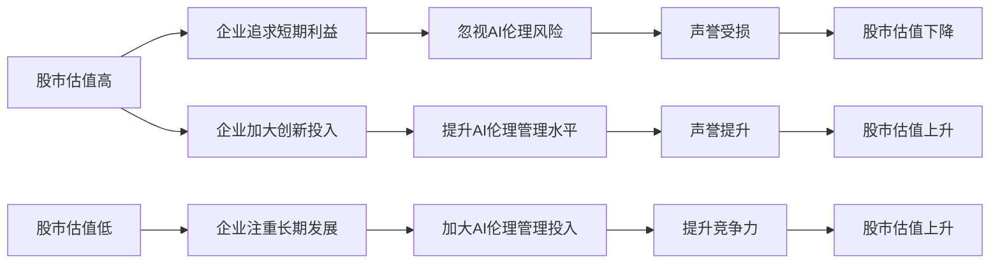

# 股市估值高低对企业AI伦理风险管理的影响

> 关键词：股市估值、企业AI伦理风险管理、市场预期、道德风险、长期发展

> 摘要：本文深入探讨了股市估值高低对企业AI伦理风险管理的影响。首先介绍了研究的背景、目的、预期读者等内容。接着阐述了股市估值和企业AI伦理风险管理的核心概念及联系，分析了其中的原理和架构。通过Python代码详细讲解了相关的核心算法原理和操作步骤，同时给出了对应的数学模型和公式，并举例说明。在项目实战部分，搭建了开发环境，实现并解读了相关代码。探讨了股市估值高低在不同场景下对企业AI伦理风险管理的实际影响，推荐了学习资源、开发工具框架和相关论文著作。最后总结了未来发展趋势与挑战，解答了常见问题，并提供了扩展阅读和参考资料，旨在为企业在股市估值和AI伦理风险管理方面提供全面的理论和实践指导。

## 1. 背景介绍 
### 1.1 目的和范围
在当今数字化时代，人工智能（AI）技术在企业中的应用日益广泛，其发展不仅改变了企业的运营模式，也对社会产生了深远影响。与此同时，股市作为经济的重要组成部分，企业的股市估值受到多种因素的影响，包括企业的技术创新、市场竞争力等。而企业在应用AI技术过程中的伦理风险管理也逐渐成为关注的焦点。本研究的目的在于深入分析股市估值高低与企业AI伦理风险管理之间的内在联系，探讨股市估值的不同水平如何影响企业在AI伦理风险管理方面的决策和实践。研究范围涵盖了不同行业中应用AI技术的企业，通过理论分析、算法建模、实际案例研究等方法，全面揭示两者之间的关系，为企业管理者、投资者以及监管机构提供有价值的参考。

### 1.2 预期读者
本文的预期读者包括企业的高级管理人员、财务经理、AI技术研发负责人等，他们需要在企业的战略决策中考虑股市估值和AI伦理风险管理的因素；投资者，包括个人投资者和机构投资者，他们希望通过了解企业的AI伦理风险管理状况来评估企业的投资价值；监管机构人员，他们负责制定和执行相关政策，以确保企业在AI应用中遵守伦理规范；以及对AI伦理和金融市场感兴趣的研究人员和学者，他们可以从本文中获取相关的研究思路和数据支持。

### 1.3 文档结构概述
本文共分为十个部分。第一部分为背景介绍，阐述了研究的目的、范围、预期读者和文档结构概述，并对相关术语进行了解释。第二部分介绍了股市估值和企业AI伦理风险管理的核心概念，通过文本示意图和Mermaid流程图展示了两者之间的联系。第三部分详细讲解了核心算法原理，并给出了Python源代码示例和具体操作步骤。第四部分介绍了相关的数学模型和公式，并通过举例进行了详细说明。第五部分为项目实战，包括开发环境搭建、源代码实现和代码解读。第六部分探讨了股市估值高低对企业AI伦理风险管理的实际应用场景。第七部分推荐了学习资源、开发工具框架和相关论文著作。第八部分总结了未来发展趋势与挑战。第九部分为附录，解答了常见问题。第十部分提供了扩展阅读和参考资料。

### 1.4 术语表
#### 1.4.1 核心术语定义
- **股市估值**：指对企业在股票市场上的价值进行评估，通常通过各种估值方法，如市盈率（P/E）、市净率（P/B）等，来确定企业股票的合理价格。
- **企业AI伦理风险管理**：企业在应用人工智能技术过程中，识别、评估和控制可能出现的伦理风险的一系列活动。伦理风险包括数据隐私泄露、算法歧视、自动化决策的不透明性等。
- **市场预期**：投资者对企业未来业绩和发展前景的预期，它会影响企业的股市估值。
- **道德风险**：在AI应用中，由于企业追求短期利益或缺乏道德约束，而采取可能损害用户利益或社会公共利益的行为所带来的风险。

#### 1.4.2 相关概念解释
- **AI技术的外部性**：AI技术的应用不仅会对企业自身产生影响，还会对社会、环境等外部因素产生影响。例如，智能安防系统的应用可以提高社会的安全性，但也可能涉及到个人隐私的侵犯。
- **企业社会责任**：企业在创造经济价值的同时，还应承担对社会和环境的责任。在AI应用中，企业应遵守伦理规范，保护用户权益，促进社会公平。
- **金融市场的有效性**：指金融市场能够迅速、准确地反映企业的真实价值。如果市场是有效的，企业的股市估值应该与其内在价值相符。

#### 1.4.3 缩略词列表
- **P/E**：市盈率（Price-to-Earnings Ratio），指股票价格与每股收益的比率，用于衡量股票的估值水平。
- **P/B**：市净率（Price-to-Book Ratio），指股票价格与每股净资产的比率，反映了股票的市场价格相对于其账面价值的倍数。
- **AI**：人工智能（Artificial Intelligence），指计算机系统能够执行通常需要人类智能才能完成的任务，如学习、推理、决策等。

## 2. 核心概念与联系 

### 2.1 股市估值的原理
股市估值是一个复杂的过程，它基于多种因素来评估企业的价值。从基本原理来看，股市估值主要考虑企业的盈利能力、资产质量、市场竞争力、行业前景等因素。常用的估值方法包括相对估值法和绝对估值法。相对估值法通过与同行业其他企业进行比较，如市盈率、市净率等指标，来确定企业的相对价值。绝对估值法主要基于企业未来的现金流折现来计算企业的内在价值。

### 2.2 企业AI伦理风险管理的原理
企业AI伦理风险管理旨在识别、评估和控制AI应用过程中可能出现的伦理风险。其原理包括建立伦理准则、进行风险评估、制定风险应对策略等步骤。企业需要明确AI技术应用的伦理边界，确保其符合法律法规和社会道德规范。同时，要对AI系统的设计、开发、部署和使用过程进行全面的风险评估，及时发现和解决潜在的伦理问题。

### 2.3 两者的联系
股市估值高低与企业AI伦理风险管理存在密切的联系。一方面，企业良好的AI伦理风险管理可以提升企业的声誉和形象，增强投资者的信心，从而提高企业的股市估值。例如，一家注重数据隐私保护、避免算法歧视的企业，更容易获得投资者的青睐。另一方面，股市估值的高低也会影响企业在AI伦理风险管理方面的投入和决策。当股市估值较高时，企业可能会面临更大的市场压力，为了维持高估值，可能会过度追求短期利益，从而忽视AI伦理风险。相反，当股市估值较低时，企业可能会更加注重长期发展，加大在AI伦理风险管理方面的投入，以提升企业的竞争力。

### 2.4 文本示意图
```plaintext
股市估值高低
        |
        | 影响企业决策
        |
企业AI伦理风险管理
        |
        | 反馈影响
        |
股市估值高低
```
该示意图展示了股市估值高低与企业AI伦理风险管理之间的相互影响关系。股市估值高低会影响企业在AI伦理风险管理方面的决策，而企业的AI伦理风险管理状况又会反馈影响股市估值。

### 2.5 Mermaid流程图

该流程图详细展示了股市估值高低不同情况下，企业的决策以及对AI伦理风险管理和股市估值的影响。当股市估值高时，企业可能有两种不同的决策路径，一种是追求短期利益导致声誉受损和股市估值下降，另一种是加大创新投入提升AI伦理管理水平从而使股市估值上升。当股市估值低时，企业注重长期发展，加大AI伦理管理投入，提升竞争力，最终使股市估值上升。

## 3. 核心算法原理 & 具体操作步骤 

### 3.1 股市估值的算法原理
#### 市盈率法
市盈率法是一种常用的相对估值方法，其基本公式为：
$$P = EPS \times PE$$
其中，$P$ 为股票价格，$EPS$ 为每股收益，$PE$ 为市盈率。市盈率可以通过同行业其他企业的平均市盈率来确定，也可以根据企业的历史市盈率进行调整。

#### 现金流折现法
现金流折现法是一种绝对估值方法，其基本思想是将企业未来的现金流折现到当前时刻，以计算企业的内在价值。其公式为：
$$V = \sum_{t=1}^{n} \frac{CF_t}{(1 + r)^t}$$
其中，$V$ 为企业的内在价值，$CF_t$ 为第 $t$ 期的现金流，$r$ 为折现率，$n$ 为预测期数。

### 3.2 企业AI伦理风险评估算法原理
#### 风险矩阵法
风险矩阵法是一种常用的风险评估方法，它通过对风险发生的可能性和影响程度进行评估，将风险分为不同的等级。具体步骤如下：
1. 确定风险因素：识别AI应用中可能出现的伦理风险因素，如数据隐私泄露、算法歧视等。
2. 评估风险发生的可能性：根据历史数据、专家判断等方法，评估每个风险因素发生的可能性，通常分为高、中、低三个等级。
3. 评估风险的影响程度：评估每个风险因素发生后对企业、用户和社会的影响程度，同样分为高、中、低三个等级。
4. 构建风险矩阵：将风险发生的可能性和影响程度组合成一个矩阵，根据矩阵中的位置确定风险等级。

#### 模糊综合评价法
模糊综合评价法是一种基于模糊数学的风险评估方法，它可以处理风险评估中的不确定性和模糊性。具体步骤如下：
1. 确定评价指标体系：建立AI伦理风险评估的指标体系，如数据安全性、算法公正性等。
2. 确定指标权重：通过专家打分、层次分析法等方法，确定每个指标的权重。
3. 确定评语集：确定评价的评语集，如高风险、中风险、低风险等。
4. 进行模糊评价：根据每个指标的实际情况，对其进行模糊评价，得到每个指标的隶属度。
5. 计算综合评价结果：将每个指标的隶属度与权重相乘，然后求和，得到综合评价结果。

### 3.3 Python源代码示例
```python
import numpy as np

# 市盈率法计算股票价格
def pe_valuation(eps, pe):
    """
    市盈率法计算股票价格
    :param eps: 每股收益
    :param pe: 市盈率
    :return: 股票价格
    """
    return eps * pe

# 现金流折现法计算企业内在价值
def dcf_valuation(cash_flows, discount_rate):
    """
    现金流折现法计算企业内在价值
    :param cash_flows: 未来现金流列表
    :param discount_rate: 折现率
    :return: 企业内在价值
    """
    n = len(cash_flows)
    present_values = []
    for t in range(n):
        present_value = cash_flows[t] / ((1 + discount_rate) ** (t + 1))
        present_values.append(present_value)
    return sum(present_values)

# 风险矩阵法评估AI伦理风险
def risk_matrix(likelihood, impact):
    """
    风险矩阵法评估AI伦理风险
    :param likelihood: 风险发生的可能性（高、中、低）
    :param impact: 风险的影响程度（高、中、低）
    :return: 风险等级（高、中、低）
    """
    likelihood_dict = {'高': 3, '中': 2, '低': 1}
    impact_dict = {'高': 3, '中': 2, '低': 1}
    risk_score = likelihood_dict[likelihood] * impact_dict[impact]
    if risk_score >= 7:
        return '高'
    elif risk_score >= 3:
        return '中'
    else:
        return '低'

# 模糊综合评价法评估AI伦理风险
def fuzzy_evaluation(weights, membership_degrees):
    """
    模糊综合评价法评估AI伦理风险
    :param weights: 指标权重列表
    :param membership_degrees: 指标隶属度矩阵
    :return: 综合评价结果
    """
    weights = np.array(weights)
    membership_degrees = np.array(membership_degrees)
    result = np.dot(weights, membership_degrees)
    return result

# 示例数据
eps = 2.0
pe = 15
cash_flows = [100, 120, 150, 180]
discount_rate = 0.1
likelihood = '中'
impact = '高'
weights = [0.3, 0.3, 0.4]
membership_degrees = [[0.2, 0.5, 0.3], [0.3, 0.4, 0.3], [0.1, 0.6, 0.3]]

# 计算结果
stock_price = pe_valuation(eps, pe)
enterprise_value = dcf_valuation(cash_flows, discount_rate)
risk_level = risk_matrix(likelihood, impact)
evaluation_result = fuzzy_evaluation(weights, membership_degrees)

print(f"市盈率法计算的股票价格: {stock_price}")
print(f"现金流折现法计算的企业内在价值: {enterprise_value}")
print(f"风险矩阵法评估的AI伦理风险等级: {risk_level}")
print(f"模糊综合评价法评估的AI伦理风险结果: {evaluation_result}")
```

### 3.4 具体操作步骤
1. **数据收集**：收集企业的财务数据，如每股收益、现金流等，以及同行业的市盈率数据。同时，识别AI应用中的伦理风险因素，并收集相关的历史数据和专家意见。
2. **参数确定**：根据收集到的数据，确定市盈率、折现率、指标权重等参数。
3. **算法计算**：使用上述Python代码中的函数，计算股票价格、企业内在价值、AI伦理风险等级等结果。
4. **结果分析**：根据计算结果，分析企业的股市估值情况和AI伦理风险状况，为企业的决策提供参考。

## 4. 数学模型和公式 & 详细讲解 & 举例说明 

### 4.1 股市估值的数学模型和公式
#### 市盈率法
市盈率法的数学模型为：
$$P = EPS \times PE$$
其中，$P$ 为股票价格，$EPS$ 为每股收益，$PE$ 为市盈率。该公式的原理是，股票价格应该与企业的盈利能力成正比，而市盈率反映了市场对企业盈利能力的预期。

**举例说明**：假设某企业的每股收益为 $2$ 元，同行业的平均市盈率为 $15$ 倍，则该企业的股票价格为：
$$P = 2 \times 15 = 30$$（元）

#### 现金流折现法
现金流折现法的数学模型为：
$$V = \sum_{t=1}^{n} \frac{CF_t}{(1 + r)^t}$$
其中，$V$ 为企业的内在价值，$CF_t$ 为第 $t$ 期的现金流，$r$ 为折现率，$n$ 为预测期数。该公式的原理是，企业的价值等于其未来现金流的现值之和。

**举例说明**：假设某企业未来 $4$ 年的现金流分别为 $100$ 万元、$120$ 万元、$150$ 万元和 $180$ 万元，折现率为 $10\%$，则该企业的内在价值为：
$$V = \frac{100}{(1 + 0.1)^1} + \frac{120}{(1 + 0.1)^2} + \frac{150}{(1 + 0.1)^3} + \frac{180}{(1 + 0.1)^4}$$
$$V \approx 90.91 + 99.17 + 112.70 + 122.94 = 425.72$$（万元）

### 4.2 企业AI伦理风险评估的数学模型和公式
#### 风险矩阵法
风险矩阵法的数学模型可以表示为：
$$R = L \times I$$
其中，$R$ 为风险等级得分，$L$ 为风险发生的可能性得分，$I$ 为风险的影响程度得分。根据得分情况，可以将风险等级分为高、中、低三个等级。

**举例说明**：假设某AI伦理风险发生的可能性为中（得分 $2$），影响程度为高（得分 $3$），则该风险的等级得分为：
$$R = 2 \times 3 = 6$$
根据风险矩阵的划分标准，该风险等级为中。

#### 模糊综合评价法
模糊综合评价法的数学模型为：
$$B = W \cdot R$$
其中，$B$ 为综合评价结果向量，$W$ 为指标权重向量，$R$ 为指标隶属度矩阵。

**举例说明**：假设某AI伦理风险评估的指标权重向量为 $W = [0.3, 0.3, 0.4]$，指标隶属度矩阵为：
$$R = \begin{bmatrix}
0.2 & 0.5 & 0.3 \\
0.3 & 0.4 & 0.3 \\
0.1 & 0.6 & 0.3
\end{bmatrix}$$
则综合评价结果向量为：
$$B = [0.3, 0.3, 0.4] \cdot \begin{bmatrix}
0.2 & 0.5 & 0.3 \\
0.3 & 0.4 & 0.3 \\
0.1 & 0.6 & 0.3
\end{bmatrix}$$
$$B = [0.17, 0.5, 0.33]$$

## 5. 项目实战：代码实际案例和详细解释说明 

### 5.1  开发环境搭建
#### 安装Python
首先，需要安装Python编程语言。可以从Python官方网站（https://www.python.org/downloads/）下载适合自己操作系统的Python版本，并按照安装向导进行安装。

#### 安装必要的库
在Python环境中，需要安装一些必要的库，如 `numpy` 用于数值计算。可以使用以下命令进行安装：
```sh
pip install numpy
```

### 5.2  源代码详细实现和代码解读
```python
import numpy as np

# 市盈率法计算股票价格
def pe_valuation(eps, pe):
    """
    市盈率法计算股票价格
    :param eps: 每股收益
    :param pe: 市盈率
    :return: 股票价格
    """
    return eps * pe

# 现金流折现法计算企业内在价值
def dcf_valuation(cash_flows, discount_rate):
    """
    现金流折现法计算企业内在价值
    :param cash_flows: 未来现金流列表
    :param discount_rate: 折现率
    :return: 企业内在价值
    """
    n = len(cash_flows)
    present_values = []
    for t in range(n):
        present_value = cash_flows[t] / ((1 + discount_rate) ** (t + 1))
        present_values.append(present_value)
    return sum(present_values)

# 风险矩阵法评估AI伦理风险
def risk_matrix(likelihood, impact):
    """
    风险矩阵法评估AI伦理风险
    :param likelihood: 风险发生的可能性（高、中、低）
    :param impact: 风险的影响程度（高、中、低）
    :return: 风险等级（高、中、低）
    """
    likelihood_dict = {'高': 3, '中': 2, '低': 1}
    impact_dict = {'高': 3, '中': 2, '低': 1}
    risk_score = likelihood_dict[likelihood] * impact_dict[impact]
    if risk_score >= 7:
        return '高'
    elif risk_score >= 3:
        return '中'
    else:
        return '低'

# 模糊综合评价法评估AI伦理风险
def fuzzy_evaluation(weights, membership_degrees):
    """
    模糊综合评价法评估AI伦理风险
    :param weights: 指标权重列表
    :param membership_degrees: 指标隶属度矩阵
    :return: 综合评价结果
    """
    weights = np.array(weights)
    membership_degrees = np.array(membership_degrees)
    result = np.dot(weights, membership_degrees)
    return result

# 示例数据
eps = 2.0
pe = 15
cash_flows = [100, 120, 150, 180]
discount_rate = 0.1
likelihood = '中'
impact = '高'
weights = [0.3, 0.3, 0.4]
membership_degrees = [[0.2, 0.5, 0.3], [0.3, 0.4, 0.3], [0.1, 0.6, 0.3]]

# 计算结果
stock_price = pe_valuation(eps, pe)
enterprise_value = dcf_valuation(cash_flows, discount_rate)
risk_level = risk_matrix(likelihood, impact)
evaluation_result = fuzzy_evaluation(weights, membership_degrees)

print(f"市盈率法计算的股票价格: {stock_price}")
print(f"现金流折现法计算的企业内在价值: {enterprise_value}")
print(f"风险矩阵法评估的AI伦理风险等级: {risk_level}")
print(f"模糊综合评价法评估的AI伦理风险结果: {evaluation_result}")
```

#### 代码解读
1. **导入必要的库**：导入 `numpy` 库，用于数值计算。
2. **定义市盈率法计算股票价格的函数**：`pe_valuation` 函数接受每股收益和市盈率作为参数，返回股票价格。
3. **定义现金流折现法计算企业内在价值的函数**：`dcf_valuation` 函数接受未来现金流列表和折现率作为参数，通过循环计算每期现金流的现值，并求和得到企业的内在价值。
4. **定义风险矩阵法评估AI伦理风险的函数**：`risk_matrix` 函数接受风险发生的可能性和影响程度作为参数，根据预先定义的得分规则计算风险等级得分，并根据得分确定风险等级。
5. **定义模糊综合评价法评估AI伦理风险的函数**：`fuzzy_evaluation` 函数接受指标权重列表和指标隶属度矩阵作为参数，使用 `numpy` 的 `dot` 函数计算综合评价结果。
6. **定义示例数据**：定义每股收益、市盈率、未来现金流、折现率、风险发生的可能性、影响程度、指标权重和指标隶属度矩阵等示例数据。
7. **计算结果**：调用上述定义的函数，计算股票价格、企业内在价值、AI伦理风险等级和综合评价结果，并打印输出。

### 5.3  代码解读与分析
通过上述代码，我们可以实现股市估值和企业AI伦理风险评估的基本功能。在实际应用中，可以根据具体情况调整示例数据和参数，以适应不同的企业和场景。例如，可以收集更多的财务数据和历史数据，来更准确地确定市盈率、折现率和指标权重等参数。同时，还可以对代码进行扩展，如添加数据可视化功能，将计算结果以图表的形式展示出来，更直观地分析企业的股市估值和AI伦理风险状况。

## 6. 实际应用场景 
### 6.1 高股市估值下的企业AI伦理风险管理
当企业的股市估值较高时，往往面临着更大的市场压力和投资者的高期望。在这种情况下，企业可能会出现以下两种不同的行为模式及其对AI伦理风险管理的影响：

#### 追求短期利益导致伦理风险忽视
一些企业为了维持高估值，可能会过度追求短期的业绩增长，从而忽视AI伦理风险管理。例如，在AI产品的开发过程中，为了尽快推出产品抢占市场份额，可能会减少对数据隐私保护和算法公正性的测试和验证。某社交平台企业在股市估值较高时，为了增加用户活跃度和广告收入，将用户的个人数据过度商业化，导致用户数据隐私泄露事件频发。这不仅损害了用户的利益，也引发了社会的广泛关注和监管部门的调查，最终导致企业的声誉受损，股市估值大幅下降。

#### 加大创新投入提升伦理管理水平
另一些企业则会利用高估值带来的资金优势，加大在AI技术创新和伦理风险管理方面的投入。这些企业认识到，良好的AI伦理管理是企业长期发展的保障，可以提升企业的声誉和竞争力。例如，一家科技巨头企业在股市估值较高时，成立了专门的AI伦理委员会，负责监督和审查公司的AI项目。同时，投入大量资金进行AI伦理技术的研发，如开发可解释的AI算法，提高算法的透明度和公正性。通过这些措施，企业不仅提升了自身的AI伦理管理水平，也赢得了投资者和用户的信任，进一步巩固了其高估值。

### 6.2 低股市估值下的企业AI伦理风险管理
当企业的股市估值较低时，面临着市场信心不足和融资困难等问题。在这种情况下，企业在AI伦理风险管理方面也会有不同的表现：

#### 注重长期发展加大伦理投入
部分企业会认识到，提升AI伦理管理水平是提升企业竞争力和市场价值的重要途径。因此，它们会注重长期发展，加大在AI伦理风险管理方面的投入。例如，一家初创AI企业在股市估值较低时，虽然资金紧张，但仍然坚持对AI算法进行严格的伦理审查，确保算法的公正性和透明度。同时，积极参与行业的AI伦理标准制定，树立良好的企业形象。随着时间的推移，企业的AI伦理管理优势逐渐显现，赢得了客户的信任和市场的认可，股市估值也逐渐回升。

#### 为求生存忽视伦理风险
然而，也有一些企业为了生存和短期内提升股市估值，可能会忽视AI伦理风险。例如，一些小型AI企业在面临资金压力时，可能会降低对数据质量和安全的要求，使用低质量甚至非法获取的数据来训练AI模型。这种行为虽然可能在短期内提高模型的性能，但从长远来看，会给企业带来巨大的法律风险和声誉损失，进一步压低企业的股市估值。

### 6.3 监管和投资者对不同估值企业的影响
监管机构和投资者在不同股市估值情况下，对企业的AI伦理风险管理也会产生重要影响。

#### 高估值企业面临更严格监管和关注
对于高估值企业，监管机构和投资者会给予更多的关注和严格的监管。监管机构会加强对高估值企业AI应用的审查，确保其符合法律法规和伦理规范。投资者也会更加关注企业的AI伦理风险管理状况，将其作为评估企业投资价值的重要因素。例如，当一家高估值的金融科技企业推出新的AI信贷产品时，监管机构会对其算法的公正性和数据隐私保护进行详细审查，投资者也会密切关注产品的伦理风险，一旦发现问题，可能会导致企业的股市估值大幅波动。

#### 低估值企业需主动提升伦理形象吸引关注
对于低估值企业，监管机构和投资者的关注度相对较低。为了吸引投资者和提升股市估值，低估值企业需要主动提升自身的AI伦理形象。例如，企业可以积极参与行业的伦理倡议活动，公开披露其AI伦理管理措施和成果，向市场传递积极的信号。通过这些方式，低估值企业可以逐渐赢得监管机构和投资者的信任，为提升股市估值创造条件。

## 7. 工具和资源推荐
### 7.1 学习资源推荐
#### 7.1.1 书籍推荐
- 《人工智能：现代方法》（Artificial Intelligence: A Modern Approach）：这本书是人工智能领域的经典教材，全面介绍了人工智能的基本概念、算法和应用。书中也涉及到了AI伦理的相关内容，对于理解AI技术和伦理问题的本质有很大帮助。
- 《算法霸权：数学杀伤性武器的威胁与反击》（Weapons of Math Destruction: How Big Data Increases Inequality and Threatens Democracy）：作者深入探讨了算法在社会各个领域的应用所带来的伦理问题，如算法歧视、隐私侵犯等。通过具体案例分析，让读者认识到算法伦理的重要性。
- 《金融市场与金融机构基础》（Fundamentals of Financial Markets and Institutions）：这本书介绍了金融市场的基本原理和金融机构的运作方式，对于理解股市估值的概念和方法有很大帮助。

#### 7.1.2 在线课程
- Coursera平台上的“人工智能基础”（Foundations of Artificial Intelligence）课程：该课程由知名高校的教授授课，系统地介绍了人工智能的基础知识，包括机器学习、深度学习等。课程中也有关于AI伦理的专题讲解。
- edX平台上的“金融市场”（Financial Markets）课程：由耶鲁大学教授罗伯特·席勒（Robert Shiller）授课，深入讲解了金融市场的运行机制和资产定价理论，对于学习股市估值有很大的帮助。
- Udemy平台上的“AI伦理与社会影响”（AI Ethics and Social Impact）课程：专门针对AI伦理问题进行讲解，包括伦理原则、风险评估和管理等内容。

#### 7.1.3 技术博客和网站
- Towards Data Science：这是一个专注于数据科学和人工智能的技术博客平台，上面有很多关于AI算法、伦理问题的文章和案例分析。
- Hacker News：是一个知名的技术社区，经常会有关于金融科技、AI伦理等方面的讨论和新闻报道。
- 中国金融四十人论坛（CF40）：该网站提供了大量关于金融市场和经济政策的研究报告和分析文章，对于了解股市估值和企业发展的宏观环境有很大帮助。

### 7.2 开发工具框架推荐
#### 7.2.1 IDE和编辑器
- PyCharm：是一款专门为Python开发设计的集成开发环境（IDE），具有强大的代码编辑、调试和自动补全功能，非常适合进行Python代码的开发和调试。
- Jupyter Notebook：是一个交互式的开发环境，支持多种编程语言，特别适合进行数据探索和模型实验。在AI伦理风险评估和股市估值的研究中，可以使用Jupyter Notebook进行数据处理和可视化分析。
- Visual Studio Code：是一款轻量级的代码编辑器，支持多种编程语言和插件扩展。它具有丰富的主题和快捷键设置，方便开发者进行高效的代码编写。

#### 7.2.2 调试和性能分析工具
- pdb：是Python自带的调试工具，可以在代码中设置断点，逐行执行代码，查看变量的值和程序的执行流程，帮助开发者快速定位和解决代码中的问题。
- cProfile：是Python的性能分析工具，可以统计代码中各个函数的执行时间和调用次数，帮助开发者找出代码中的性能瓶颈，进行优化。
- TensorBoard：是TensorFlow框架提供的可视化工具，可以用于可视化神经网络的训练过程、模型结构和性能指标等。在AI模型的开发和评估中，TensorBoard可以帮助开发者更好地理解模型的行为和性能。

#### 7.2.3 相关框架和库
- NumPy：是Python中用于科学计算的基础库，提供了高效的多维数组对象和各种数学函数，在股市估值和AI伦理风险评估的数值计算中经常会用到。
- Pandas：是一个用于数据处理和分析的Python库，提供了灵活的数据结构和强大的数据操作功能，如数据读取、清洗、转换和统计分析等。
- Scikit-learn：是一个常用的机器学习库，提供了丰富的机器学习算法和工具，如分类、回归、聚类等算法，以及模型选择、评估和预处理等功能。在AI伦理风险评估中，可以使用Scikit-learn进行数据建模和分析。

### 7.3 相关论文著作推荐
#### 7.3.1 经典论文
- “The Moral Machine Experiment”：该论文通过在线实验的方式，研究了不同国家和文化背景下人们对自动驾驶汽车伦理决策的看法，引发了关于AI伦理决策的广泛讨论。
- “Algorithmic Bias Detection and Mitigation: Best Practices and Policies to Reduce Consumer Harms”：论文探讨了算法偏见的检测和缓解方法，提出了一系列减少消费者伤害的最佳实践和政策建议。
- “Market Efficiency: The Joint Hypothesis Problem”：这篇经典论文讨论了金融市场效率的概念和检验方法，指出市场效率的检验面临着联合假设问题，对于理解股市估值和市场行为有重要的理论意义。

#### 7.3.2 最新研究成果
- 近年来，关于AI伦理和股市估值的研究不断涌现。可以关注顶级学术期刊，如《Journal of Artificial Intelligence Research》、《The Journal of Finance》等，获取最新的研究成果。
- 国际知名的学术会议，如NeurIPS（神经信息处理系统大会）、ICML（国际机器学习会议）等，也会有关于AI伦理和金融科技的研究报告和论文发表。

#### 7.3.3 应用案例分析
- 一些咨询公司和研究机构会发布关于企业AI伦理风险管理和股市估值的应用案例分析报告。例如，麦肯锡公司（McKinsey & Company）、波士顿咨询集团（Boston Consulting Group）等会对不同行业的企业进行研究，分析其在AI应用和伦理管理方面的实践经验和教训。
- 行业协会和监管机构也会发布相关的案例研究和指导文件，帮助企业更好地理解和应对AI伦理风险。例如，欧盟委员会发布的《人工智能伦理准则》中包含了一些实际案例，展示了如何在AI开发和应用中遵循伦理原则。

## 8. 总结：未来发展趋势与挑战
### 8.1 未来发展趋势
#### 股市估值与AI伦理风险管理的融合加深
随着AI技术在企业中的应用越来越广泛，股市估值将更加注重企业的AI伦理风险管理水平。投资者会认识到，良好的AI伦理管理可以降低企业的法律风险、声誉风险，提升企业的长期竞争力，从而在估值中给予更高的权重。企业也会更加主动地将AI伦理风险管理纳入到战略规划和日常运营中，以提高自身的市场价值。

#### AI伦理风险管理的标准化和规范化
为了更好地评估和管理企业的AI伦理风险，未来将会出现更多的行业标准和规范。国际组织、行业协会和监管机构将共同推动AI伦理标准的制定和实施，如数据隐私保护标准、算法公正性评估标准等。企业需要遵守这些标准，建立健全的AI伦理管理体系，以满足市场和监管的要求。

#### 技术创新推动AI伦理风险管理的发展
随着技术的不断进步，将出现更多的工具和方法来辅助企业进行AI伦理风险管理。例如，可解释的AI技术可以提高算法的透明度，帮助企业更好地理解和解释AI决策的过程；区块链技术可以用于保障数据的安全性和可追溯性，防止数据篡改和滥用。这些技术创新将为企业提供更有效的手段来管理AI伦理风险。

### 8.2 挑战
#### 伦理标准的多样性和不确定性
不同国家、文化和行业对AI伦理的理解和标准存在差异，这给企业的AI伦理风险管理带来了挑战。企业需要在不同的伦理标准之间进行权衡和协调，确保其AI应用在全球范围内都符合伦理要求。同时，AI技术的快速发展也使得伦理标准不断演变，企业需要及时跟上标准的变化，调整其伦理管理策略。

#### 技术复杂性和数据隐私保护的矛盾
AI技术的复杂性使得企业在进行伦理风险管理时面临困难。例如，深度学习模型的黑盒特性使得很难理解其决策过程，从而难以评估其伦理风险。另一方面，为了提高AI模型的性能，企业需要收集和使用大量的数据，但这也增加了数据隐私泄露的风险。如何在保证技术创新的同时，有效地保护数据隐私和管理伦理风险，是企业面临的一大挑战。

#### 监管压力和合规成本的增加
随着社会对AI伦理问题的关注度不断提高，监管机构将加强对企业AI应用的监管。企业需要遵守越来越严格的法律法规和监管要求，这将增加企业的合规成本。同时，监管政策的不断变化也给企业带来了不确定性，企业需要投入更多的资源来应对监管挑战。

## 9. 附录：常见问题与解答
### 9.1 股市估值高的企业就一定忽视AI伦理风险吗？
不一定。虽然股市估值高的企业可能面临更大的市场压力，有追求短期利益而忽视伦理风险的倾向，但也有很多企业认识到良好的AI伦理管理对企业长期发展的重要性。这些企业会利用高估值带来的资金优势，加大在AI伦理风险管理方面的投入，提升企业的声誉和竞争力。

### 9.2 低股市估值的企业如何提升其AI伦理管理水平？
低股市估值的企业可以通过以下方式提升其AI伦理管理水平：
- 树立正确的伦理观念：企业管理层要认识到AI伦理管理的重要性，将其纳入企业的战略规划和企业文化中。
- 加强内部管理：建立健全的AI伦理管理制度和流程，加强对员工的伦理培训，确保AI应用过程中的每个环节都符合伦理要求。
- 积极参与行业标准制定：参与行业的AI伦理标准制定活动，与同行交流经验，提升企业在伦理管理方面的影响力。
- 公开披露伦理管理成果：定期公开披露企业的AI伦理管理措施和成果，向市场传递积极的信号，赢得投资者和客户的信任。

### 9.3 如何衡量企业的AI伦理风险管理效果？
可以从以下几个方面衡量企业的AI伦理风险管理效果：
- 合规性：企业是否遵守了相关的法律法规和行业伦理标准。
- 风险事件发生率：企业在AI应用过程中发生伦理风险事件的频率和严重程度。
- 声誉和形象：企业的声誉和形象是否因AI伦理管理而得到提升，如客户满意度、媒体评价等。
- 长期发展：企业的长期业绩和市场竞争力是否因良好的AI伦理管理而得到增强。

### 9.4 监管机构在企业AI伦理风险管理中扮演什么角色？
监管机构在企业AI伦理风险管理中扮演着重要的角色：
- 制定法律法规和伦理标准：监管机构负责制定相关的法律法规和伦理标准，明确企业在AI应用中的责任和义务。
- 监督检查：对企业的AI应用进行监督检查，确保企业遵守法律法规和伦理标准。
- 处罚违规行为：对违反法律法规和伦理标准的企业进行处罚，以维护市场秩序和社会公共利益。
- 引导和促进：通过发布政策和指导意见，引导企业加强AI伦理风险管理，促进整个行业的健康发展。

## 10. 扩展阅读 & 参考资料
### 扩展阅读
- 《AI 2041：十大趋势塑造人类未来》：这本书探讨了AI技术在未来几十年内的发展趋势及其对人类社会的影响，包括AI伦理、经济、社会等多个方面。
- 《智能时代：大数据与智能革命重新定义未来》：介绍了大数据和人工智能技术的发展现状和未来趋势，以及它们对各个行业的变革性影响，有助于读者更全面地了解AI技术的应用场景和挑战。
- 《创新者的窘境》：虽然这本书主要讨论的是企业创新和市场竞争的问题，但其中的一些观点和案例可以为企业在AI伦理风险管理和股市估值方面的决策提供启示。

### 参考资料
- 国际标准化组织（ISO）发布的关于AI伦理的相关标准和指南。
- 各国监管机构发布的关于金融市场和AI应用的法律法规和政策文件。
- 学术数据库，如IEEE Xplore、ACM Digital Library等，提供了大量关于AI技术和伦理研究的学术论文。

作者：AI天才研究院/AI Genius Institute & 禅与计算机程序设计艺术 /Zen And The Art of Computer Programming