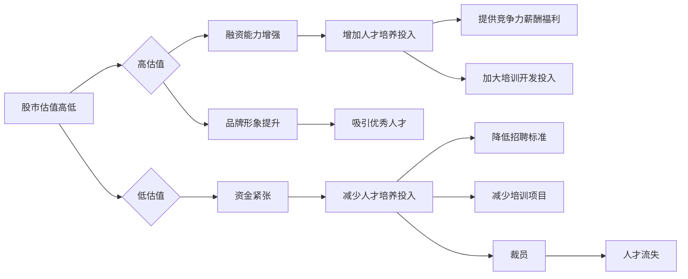

# 股市估值高低对企业人才培养策略的影响

> 关键词：股市估值、企业人才培养策略、企业发展、市场预期、人才资源管理

> 摘要：本文深入探讨了股市估值高低对企业人才培养策略的影响。通过对股市估值的原理、企业人才培养策略的构成等核心概念的分析，阐述了两者之间的内在联系。详细讲解了相关的算法原理、数学模型，并结合项目实战案例进行说明。同时，介绍了股市估值和企业人才培养在实际中的应用场景，推荐了相关的学习资源、开发工具和论文著作。最后总结了未来的发展趋势与挑战，为企业在不同股市估值情况下制定合理的人才培养策略提供了全面的参考。

## 1. 背景介绍 
### 1.1 目的和范围
本研究旨在全面剖析股市估值高低与企业人才培养策略之间的关系，明确股市估值如何影响企业在人才培养方面的决策，以及企业应如何根据不同的股市估值情况调整人才培养策略。研究范围涵盖了不同行业、不同规模的企业，分析股市估值在牛市和熊市等不同市场环境下对企业人才培养策略的具体影响。

### 1.2 预期读者
本文主要面向企业的人力资源管理者、企业战略规划者、金融分析师、投资者以及对股市和企业管理感兴趣的研究人员。这些读者可以从本文中获取关于股市估值与企业人才培养策略之间关系的深入理解，为实际工作和研究提供参考。

### 1.3 文档结构概述
本文首先介绍了相关的背景知识，包括研究目的、预期读者和文档结构。接着阐述了股市估值和企业人才培养策略的核心概念及其联系，通过文本示意图和 Mermaid 流程图进行直观展示。然后详细讲解了核心算法原理和具体操作步骤，结合 Python 源代码进行说明。之后介绍了相关的数学模型和公式，并举例说明。通过项目实战案例，展示了代码的实际应用和详细解释。分析了股市估值高低对企业人才培养策略的实际应用场景。推荐了相关的学习资源、开发工具和论文著作。最后总结了未来的发展趋势与挑战，并提供了常见问题的解答和扩展阅读的参考资料。

### 1.4 术语表
#### 1.4.1 核心术语定义
- **股市估值**：指对股票市场中企业价值的评估，通常通过各种估值方法来确定企业股票的合理价格，反映市场对企业未来盈利能力和发展前景的预期。
- **企业人才培养策略**：企业为了实现自身的战略目标，根据企业的发展需求和人才现状，制定的一系列关于人才培养、发展和提升的计划和措施。
- **市场预期**：投资者和市场参与者对企业未来业绩、行业发展趋势等方面的预测和期望，会影响股市估值。

#### 1.4.2 相关概念解释
- **市盈率（PE）**：是股市估值中常用的指标之一，计算公式为股票价格除以每股收益。它反映了市场对企业盈利能力的预期，较高的市盈率通常表示市场对企业未来盈利增长有较高的期望。
- **人才梯队建设**：企业人才培养策略中的重要内容，指建立不同层次、不同岗位的人才储备，以满足企业不同发展阶段的人才需求。

#### 1.4.3 缩略词列表
- **PE**：市盈率（Price - Earnings Ratio）
- **ROE**：净资产收益率（Return on Equity）

## 2. 核心概念与联系 

### 股市估值的原理
股市估值是一个复杂的过程，它综合考虑了企业的财务状况、行业前景、市场竞争等多个因素。常见的估值方法包括市盈率法、市净率法、现金流折现法等。

市盈率法是通过将股票价格除以每股收益来计算市盈率，然后与同行业或市场平均市盈率进行比较，判断股票的估值高低。市净率法是用股票价格除以每股净资产，反映了市场对企业净资产的估值。现金流折现法是将企业未来的现金流按照一定的折现率折现到当前，从而得到企业的内在价值。

### 企业人才培养策略的构成
企业人才培养策略通常包括人才招聘、培训与开发、绩效管理、薪酬福利等方面。人才招聘是企业获取人才的第一步，通过制定合理的招聘标准和渠道，吸引符合企业需求的人才。培训与开发是提升人才能力和素质的重要手段，包括内部培训、外部培训、在线学习等多种形式。绩效管理可以激励员工提高工作绩效，通过设定明确的绩效目标和评估标准，对员工的工作表现进行评估和反馈。薪酬福利则是吸引和留住人才的关键因素，合理的薪酬体系可以激发员工的工作积极性。

### 两者的联系
股市估值高低会对企业人才培养策略产生重要影响。当股市估值较高时，企业的市场价值增加，融资能力增强，有更多的资金用于人才培养和发展。企业可以提供更有竞争力的薪酬福利，吸引优秀人才加入，同时加大培训与开发的投入，提升现有员工的能力。此外，高估值也会提升企业的品牌形象，使企业在人才市场上更具吸引力。

相反，当股市估值较低时，企业的资金相对紧张，可能会减少人才培养方面的投入。企业可能会降低招聘标准，减少培训项目，甚至进行裁员以降低成本。但是，这也可能会导致企业人才流失，影响企业的长期发展。

以下是两者联系的 Mermaid 流程图：


## 3. 核心算法原理 & 具体操作步骤 

### 股市估值算法 - 市盈率法
市盈率法是一种简单常用的股市估值方法，其核心算法原理是通过计算企业的市盈率，并与同行业或市场平均市盈率进行比较，来判断企业股票的估值高低。

以下是使用 Python 实现市盈率计算的代码：
```python
def calculate_pe(stock_price, earnings_per_share):
    """
    计算市盈率
    :param stock_price: 股票价格
    :param earnings_per_share: 每股收益
    :return: 市盈率
    """
    if earnings_per_share == 0:
        return float('inf')
    return stock_price / earnings_per_share

# 示例数据
stock_price = 50
earnings_per_share = 5

pe_ratio = calculate_pe(stock_price, earnings_per_share)
print(f"市盈率: {pe_ratio}")
```
具体操作步骤如下：
1. 获取企业的股票价格和每股收益数据。
2. 调用 `calculate_pe` 函数计算市盈率。
3. 将计算得到的市盈率与同行业或市场平均市盈率进行比较，判断企业股票的估值高低。

### 企业人才培养投入决策算法
企业在制定人才培养投入决策时，可以根据股市估值情况和企业的财务状况来确定投入的比例。以下是一个简单的决策算法示例：
```python
def determine_training_investment(stock_valuation, financial_status):
    """
    根据股市估值和财务状况确定人才培养投入比例
    :param stock_valuation: 股市估值（高、中、低）
    :param financial_status: 财务状况（好、中、差）
    :return: 人才培养投入比例
    """
    if stock_valuation == '高' and financial_status == '好':
        return 0.2
    elif stock_valuation == '高' and financial_status == '中':
        return 0.15
    elif stock_valuation == '中' and financial_status == '好':
        return 0.12
    elif stock_valuation == '中' and financial_status == '中':
        return 0.1
    elif stock_valuation == '低' and financial_status == '好':
        return 0.08
    elif stock_valuation == '低' and financial_status == '中':
        return 0.05
    else:
        return 0.02

# 示例数据
stock_valuation = '高'
financial_status = '好'

investment_ratio = determine_training_investment(stock_valuation, financial_status)
print(f"人才培养投入比例: {investment_ratio * 100}%")
```
具体操作步骤如下：
1. 评估企业的股市估值情况（高、中、低）和财务状况（好、中、差）。
2. 调用 `determine_training_investment` 函数确定人才培养投入比例。
3. 根据投入比例和企业的总收入，计算人才培养的具体投入金额。

## 4. 数学模型和公式 & 详细讲解 & 举例说明 

### 市盈率模型
市盈率（PE）的计算公式为：
$$PE = \frac{P}{EPS}$$
其中，$P$ 表示股票价格，$EPS$ 表示每股收益。

例如，某企业的股票价格为 60 元，每股收益为 6 元，则该企业的市盈率为：
$$PE = \frac{60}{6} = 10$$
如果同行业平均市盈率为 12，说明该企业的股票相对被低估。

### 企业人才培养投入模型
假设企业的总收入为 $R$，人才培养投入比例为 $r$，则人才培养的投入金额 $I$ 可以用以下公式计算：
$$I = R \times r$$

例如，某企业的总收入为 1000 万元，根据股市估值和财务状况确定的人才培养投入比例为 0.1，则人才培养的投入金额为：
$$I = 1000 \times 0.1 = 100 \text{（万元）}$$

### 人才培养效益模型
人才培养效益可以用以下公式来衡量：
$$B = \Delta P \times Q - I$$
其中，$B$ 表示人才培养效益，$\Delta P$ 表示由于人才培养导致的产品或服务价格提升，$Q$ 表示产品或服务的销售量，$I$ 表示人才培养的投入金额。

例如，某企业通过人才培养，使产品的价格提升了 5 元，销售量为 2000 件，人才培养投入金额为 8000 元，则人才培养效益为：
$$B = 5 \times 2000 - 8000 = 2000 \text{（元）}$$

## 5. 项目实战：代码实际案例和详细解释说明 

### 5.1  开发环境搭建
本项目使用 Python 进行开发，需要安装以下库：
- `pandas`：用于数据处理和分析。
- `matplotlib`：用于数据可视化。

可以使用以下命令进行安装：
```sh
pip install pandas matplotlib
```

### 5.2  源代码详细实现和代码解读
以下是一个完整的项目示例，用于分析股市估值对企业人才培养策略的影响：
```python
import pandas as pd
import matplotlib.pyplot as plt

# 模拟股市估值数据
stock_valuations = ['高', '中', '低']
financial_statuses = ['好', '中', '差']

# 存储不同情况下的人才培养投入比例
investment_ratios = []

for stock_valuation in stock_valuations:
    for financial_status in financial_statuses:
        ratio = determine_training_investment(stock_valuation, financial_status)
        investment_ratios.append({
            '股市估值': stock_valuation,
            '财务状况': financial_status,
            '人才培养投入比例': ratio
        })

# 创建 DataFrame
df = pd.DataFrame(investment_ratios)

# 可视化结果
pivot_df = df.pivot(index='股市估值', columns='财务状况', values='人才培养投入比例')
pivot_df.plot(kind='bar')
plt.title('不同股市估值和财务状况下的人才培养投入比例')
plt.xlabel('股市估值')
plt.ylabel('人才培养投入比例')
plt.show()
```
代码解读：
1. 首先，定义了模拟的股市估值和财务状况数据。
2. 然后，通过嵌套循环遍历不同的股市估值和财务状况组合，调用 `determine_training_investment` 函数计算人才培养投入比例，并将结果存储在列表中。
3. 使用 `pandas` 库将列表转换为 DataFrame，并进行数据透视操作。
4. 最后，使用 `matplotlib` 库将结果可视化，绘制柱状图展示不同情况下的人才培养投入比例。

### 5.3  代码解读与分析
通过上述代码，我们可以直观地看到不同股市估值和财务状况下企业人才培养投入比例的变化。从可视化结果中可以分析出，当股市估值较高且财务状况较好时，企业会增加人才培养投入；而当股市估值较低且财务状况较差时，企业会减少人才培养投入。这与我们之前的理论分析一致。

## 6. 实际应用场景 
### 高估值企业的人才培养策略
当企业处于高估值状态时，可以采取以下人才培养策略：
- **吸引高端人才**：利用高估值带来的资金优势和品牌影响力，吸引行业内的高端人才加入。例如，提供高额的薪酬、股权激励、良好的工作环境等。
- **加强内部培训**：加大对内部员工的培训投入，提升员工的专业技能和综合素质。可以邀请行业专家进行讲座，组织员工参加外部培训课程等。
- **建立人才储备库**：为企业的未来发展储备人才，通过校园招聘、人才推荐等方式，提前锁定有潜力的人才。

### 低估值企业的人才培养策略
当企业处于低估值状态时，需要采取更为谨慎的人才培养策略：
- **优化人才结构**：对现有人才进行评估，淘汰绩效不佳的员工，优化人才结构，提高企业的运营效率。
- **开展低成本培训**：选择低成本的培训方式，如在线学习、内部培训师授课等，提升员工的能力。
- **与高校合作**：与高校建立合作关系，通过实习、产学研合作等方式，获取低成本的人才资源。

### 不同行业的应用差异
不同行业的企业在面对股市估值高低时，人才培养策略也会有所不同。例如，高科技行业对人才的技术水平要求较高，即使在低估值状态下，也需要保持一定的人才培养投入，以维持企业的创新能力。而传统制造业可能更注重成本控制，在低估值时会更倾向于减少人才培养投入。

## 7. 工具和资源推荐
### 7.1 学习资源推荐
#### 7.1.1 书籍推荐
- 《证券分析》：由本杰明·格雷厄姆所著，是价值投资领域的经典之作，详细介绍了股市估值的方法和原理。
- 《人力资源管理》：全面介绍了企业人力资源管理的各个方面，包括人才培养策略的制定和实施。
- 《财务管理》：帮助读者了解企业的财务状况和融资策略，对理解股市估值与企业资金的关系有很大帮助。

#### 7.1.2 在线课程
- Coursera 上的“投资学原理”：由知名高校教授授课，系统讲解了投资学的基本原理和股市估值方法。
- edX 上的“人力资源管理基础”：提供了企业人力资源管理的基础知识和实践案例，对学习人才培养策略有很大帮助。

#### 7.1.3 技术博客和网站
- 雪球网：是一个专注于股票投资的社区，提供了丰富的股市分析和估值报告。
- 人力资源分享汇：专注于人力资源管理领域，分享了大量的人才培养策略和实践经验。

### 7.2 开发工具框架推荐
#### 7.2.1 IDE和编辑器
- PyCharm：是一款专业的 Python 集成开发环境，提供了丰富的代码编辑、调试和分析功能。
- Jupyter Notebook：适合进行数据探索和分析，支持 Python 代码的交互式运行。

#### 7.2.2 调试和性能分析工具
- pdb：Python 自带的调试工具，可以帮助开发者定位代码中的问题。
- cProfile：用于分析 Python 代码的性能，找出性能瓶颈。

#### 7.2.3 相关框架和库
- pandas：用于数据处理和分析，提供了高效的数据结构和数据分析工具。
- matplotlib：用于数据可视化，支持多种图表类型的绘制。

### 7.3 相关论文著作推荐
#### 7.3.1 经典论文
- 《有效市场假说》：由尤金·法玛提出，对理解股市估值和市场效率有重要意义。
- 《人力资本理论》：由西奥多·舒尔茨所著，阐述了人力资本在经济增长和企业发展中的重要作用。

#### 7.3.2 最新研究成果
- 可以关注《金融研究》、《管理世界》等学术期刊，获取关于股市估值和企业人才培养的最新研究成果。

#### 7.3.3 应用案例分析
- 可以参考一些知名企业的年度报告和案例分析，了解它们在不同股市估值情况下的人才培养策略和实践经验。

## 8. 总结：未来发展趋势与挑战
### 未来发展趋势
- **数字化人才培养**：随着科技的不断发展，企业将更加注重数字化人才的培养，利用在线学习平台、虚拟现实等技术，提升人才培养的效率和效果。
- **跨界人才需求增加**：不同行业之间的融合越来越深入，企业对具有跨界知识和技能的人才需求将不断增加，人才培养策略也将更加注重跨学科的培养。
- **个性化人才培养**：根据员工的不同特点和需求，制定个性化的人才培养方案，提高人才培养的针对性和有效性。

### 挑战
- **市场不确定性**：股市估值受到多种因素的影响，市场的不确定性增加了企业制定人才培养策略的难度。企业需要密切关注市场动态，及时调整人才培养策略。
- **人才竞争激烈**：在数字化和跨界人才需求增加的背景下，人才竞争将更加激烈。企业需要不断提升自身的吸引力，才能吸引和留住优秀人才。
- **技术更新换代快**：科技的快速发展导致技术更新换代速度加快，企业需要不断更新人才培养内容和方式，以适应技术发展的需求。

## 9. 附录：常见问题与解答
### 问题 1：股市估值的高低是如何确定的？
答：股市估值的高低可以通过多种方法来确定，常见的有市盈率法、市净率法、现金流折现法等。将企业的估值指标与同行业或市场平均水平进行比较，就可以判断企业股票的估值高低。

### 问题 2：企业在低估值时是否应该完全放弃人才培养？
答：不应该。虽然低估值时企业资金相对紧张，但人才是企业发展的核心资源。企业可以采取一些低成本的人才培养方式，如内部培训、在线学习等，保持员工的能力提升，为企业的未来发展储备力量。

### 问题 3：如何衡量人才培养的效果？
答：可以从多个方面衡量人才培养的效果，如员工的绩效提升、技能水平提高、人才流失率降低等。还可以通过人才培养效益模型来计算人才培养对企业经济效益的影响。

## 10. 扩展阅读 & 参考资料
- 《金融市场学》
- 《企业战略管理》
- 各大财经媒体和人力资源管理网站的相关文章

作者：AI天才研究院/AI Genius Institute & 禅与计算机程序设计艺术 /Zen And The Art of Computer Programming