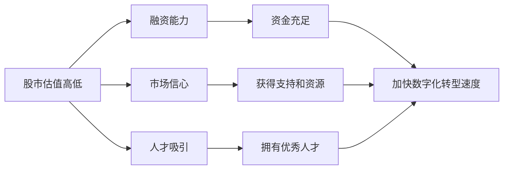

# 股市估值高低对企业数字化转型速度的影响

> 关键词：股市估值、企业数字化转型、转型速度、资本市场、资源配置

> 摘要：本文深入探讨了股市估值高低对企业数字化转型速度的影响。在当今数字化时代，企业数字化转型已成为发展的关键趋势。而股市估值作为企业在资本市场的重要指标，反映了市场对企业的预期和评价。通过研究股市估值与企业数字化转型速度之间的关系，分析其背后的原理、影响机制以及实际案例，有助于企业更好地理解资本市场对自身转型的作用，为企业制定合理的转型策略提供参考，同时也为投资者评估企业价值和发展潜力提供新的视角。

## 1. 背景介绍 
### 1.1 目的和范围
本研究的主要目的是深入剖析股市估值高低对企业数字化转型速度的具体影响。随着全球经济数字化进程的加速，企业数字化转型已成为提升竞争力、实现可持续发展的必然选择。股市作为企业重要的融资和价值评估场所，其估值高低不仅反映了企业当前的经营状况，还影响着企业未来的发展战略和资源配置。本研究将涵盖不同行业、不同规模企业，分析股市估值在企业数字化转型过程中所扮演的角色，以及这种影响的程度和机制。

### 1.2 预期读者
本文预期读者包括企业管理者、投资者、金融分析师、学者以及对企业数字化转型和资本市场感兴趣的人士。企业管理者可以从中了解股市估值对企业数字化转型的影响，以便制定更有效的转型策略；投资者可以通过掌握这一关系，更准确地评估企业的投资价值；金融分析师可以将此研究作为分析企业基本面和市场表现的参考；学者可以在此基础上进行更深入的理论研究；而对相关领域感兴趣的人士则可以拓宽对企业发展和资本市场的认知。

### 1.3 文档结构概述
本文将按照以下结构展开：首先介绍核心概念，包括股市估值和企业数字化转型的定义、内涵以及两者之间的联系；接着阐述影响企业数字化转型速度的核心算法原理，并给出具体操作步骤；然后通过数学模型和公式详细讲解股市估值与企业数字化转型速度之间的定量关系，并举例说明；之后通过实际项目案例展示代码实现和详细解释；再分析股市估值高低对企业数字化转型速度的实际应用场景；推荐相关的学习资源、开发工具和论文著作；最后总结未来发展趋势与挑战，并提供常见问题解答和扩展阅读参考资料。

### 1.4 术语表
#### 1.4.1 核心术语定义
- **股市估值**：指市场对企业股票价值的评估，通常通过各种估值方法（如市盈率、市净率等）来确定企业股票的合理价格范围，反映了市场参与者对企业未来盈利能力和发展前景的预期。
- **企业数字化转型**：企业利用数字技术对其业务流程、组织架构、商业模式等进行全面改造和升级，以提高运营效率、创新能力和竞争力，实现企业的可持续发展。
- **转型速度**：衡量企业在数字化转型过程中推进各项变革的快慢程度，通常可以用转型项目的完成时间、数字化技术的应用程度、业务指标的提升速度等指标来衡量。

#### 1.4.2 相关概念解释
- **资本市场**：企业进行融资和股权交易的市场，包括股票市场、债券市场等。股市估值是资本市场对企业价值的一种体现，企业的数字化转型也需要在资本市场的支持下进行。
- **资源配置**：企业根据自身发展战略和市场需求，将人力、物力、财力等资源分配到不同的业务领域和项目中。股市估值高低会影响企业的融资能力和资源获取能力，进而影响企业的资源配置决策，对数字化转型速度产生影响。

#### 1.4.3 缩略词列表
- **PE**：市盈率（Price-to-Earnings Ratio），是股票价格除以每股收益的比率，用于衡量股票的估值水平。
- **PB**：市净率（Price-to-Book Ratio），是股票价格除以每股净资产的比率，反映了市场对企业净资产的估值。

## 2. 核心概念与联系 

### 2.1 股市估值的原理和方法
股市估值是投资者和市场对企业价值的一种评估，其原理基于企业的未来盈利能力和现金流。常见的估值方法包括：
- **市盈率法（PE）**：通过将股票价格除以每股收益（EPS）来计算市盈率。一般来说，市盈率越高，市场对企业的预期越高，认为企业未来的盈利能力越强。公式为：$PE = \frac{P}{EPS}$，其中 $P$ 为股票价格，$EPS$ 为每股收益。
- **市净率法（PB）**：市净率是股票价格与每股净资产的比值。市净率反映了市场对企业净资产的估值，较高的市净率可能意味着市场认为企业的资产质量较好或具有较高的增长潜力。公式为：$PB = \frac{P}{BVPS}$，其中 $P$ 为股票价格，$BVPS$ 为每股净资产。

### 2.2 企业数字化转型的内涵和目标
企业数字化转型是一个综合性的过程，涵盖了多个方面的变革：
- **业务流程数字化**：将传统的业务流程通过信息技术进行优化和自动化，提高业务处理效率和准确性。例如，企业采用供应链管理系统实现采购、生产、销售等环节的数字化协同。
- **产品和服务创新**：利用数字技术开发新的产品和服务，满足客户不断变化的需求。例如，金融机构推出移动支付、线上理财等数字化金融产品。
- **组织架构变革**：调整企业的组织架构，以适应数字化时代的快速变化和创新需求。例如，建立跨部门的数字化团队，促进信息共享和协同工作。

企业数字化转型的目标是提高企业的竞争力和可持续发展能力，具体包括提高运营效率、降低成本、增加收入、提升客户满意度等。

### 2.3 股市估值与企业数字化转型速度的联系
股市估值高低与企业数字化转型速度之间存在着密切的联系，主要体现在以下几个方面：
- **融资能力**：高股市估值意味着企业在资本市场上具有较高的价值，更容易获得融资。企业可以通过增发股票、发行债券等方式筹集资金，为数字化转型提供充足的资金支持，从而加快转型速度。例如，一家科技企业如果股市估值较高，投资者更愿意购买其股票，企业可以利用融资资金加大对数字化研发的投入。
- **市场信心**：股市估值是市场对企业的一种评价，高估值反映了市场对企业的信心和认可。这种市场信心会影响企业的合作伙伴、客户和员工，使企业在数字化转型过程中更容易获得支持和资源。例如，供应商更愿意与高估值企业合作，提供更优惠的价格和服务；客户对高估值企业的产品和服务更有信心，有利于企业推广数字化产品和服务。
- **人才吸引**：高股市估值的企业通常具有更好的发展前景和品牌形象，更容易吸引优秀的数字化人才。数字化转型需要大量的专业人才，包括数据科学家、软件开发工程师、数字化营销专家等。拥有优秀的人才团队可以加快企业数字化转型的速度。

### 2.4 文本示意图
```plaintext
股市估值高低
├── 影响融资能力
│   └── 资金充足 -> 加快数字化转型速度
├── 影响市场信心
│   └── 获得支持和资源 -> 推动数字化转型
└── 影响人才吸引
    └── 拥有优秀人才 -> 加速数字化转型
```

### 2.5 Mermaid 流程图


## 3. 核心算法原理 & 具体操作步骤 

### 3.1 核心算法原理
为了量化股市估值对企业数字化转型速度的影响，我们可以构建一个基于回归分析的模型。假设企业数字化转型速度（$Y$）受到股市估值（$X_1$）以及其他控制变量（$X_2, X_3, \cdots, X_n$）的影响，回归模型可以表示为：

$$Y = \beta_0 + \beta_1X_1 + \beta_2X_2 + \cdots + \beta_nX_n + \epsilon$$

其中，$\beta_0$ 为截距项，$\beta_1, \beta_2, \cdots, \beta_n$ 为回归系数，$\epsilon$ 为误差项。通过收集历史数据，利用最小二乘法估计回归系数，从而得到股市估值对企业数字化转型速度的影响系数 $\beta_1$。

### 3.2 具体操作步骤
#### 3.2.1 数据收集
- 收集企业的股市估值数据，如市盈率、市净率等，可以从金融数据提供商（如 Wind、东方财富等）获取。
- 收集企业数字化转型速度的相关指标数据，如数字化业务收入占比的增长率、数字化技术应用程度等。这些数据可以通过企业的财务报表、行业报告、市场调研等方式获取。
- 收集控制变量的数据，如企业规模、行业竞争程度、宏观经济环境等。

#### 3.2.2 数据预处理
- 对收集到的数据进行清洗，去除缺失值和异常值。
- 对数据进行标准化处理，将不同变量的数据统一到相同的尺度上，以提高回归分析的准确性。

#### 3.2.3 模型估计
使用 Python 的 `statsmodels` 库进行回归分析，估计回归模型的系数。以下是一个简单的 Python 代码示例：

```python
import pandas as pd
import statsmodels.api as sm

# 假设 data 是包含所有变量的 DataFrame
# Y 是企业数字化转型速度，X1 是股市估值，X2, X3 是控制变量
data = pd.read_csv('data.csv')
Y = data['Y']
X = data[['X1', 'X2', 'X3']]

# 添加常数项
X = sm.add_constant(X)

# 拟合回归模型
model = sm.OLS(Y, X).fit()

# 打印回归结果
print(model.summary())
```

#### 3.2.4 结果分析
根据回归结果，分析股市估值对企业数字化转型速度的影响系数 $\beta_1$ 的显著性和大小。如果 $\beta_1$ 显著为正，说明股市估值越高，企业数字化转型速度越快；如果 $\beta_1$ 显著为负，说明股市估值越高，企业数字化转型速度越慢；如果 $\beta_1$ 不显著，则说明股市估值对企业数字化转型速度没有显著影响。

## 4. 数学模型和公式 & 详细讲解 & 举例说明 

### 4.1 数学模型和公式
在前面的回归分析模型中，我们已经给出了基本的数学模型：

$$Y = \beta_0 + \beta_1X_1 + \beta_2X_2 + \cdots + \beta_nX_n + \epsilon$$

其中，$Y$ 表示企业数字化转型速度，$X_1$ 表示股市估值，$X_2, X_3, \cdots, X_n$ 表示控制变量。

### 4.2 详细讲解
- **截距项 $\beta_0$**：表示当所有自变量都为 0 时，企业数字化转型速度的期望值。在实际应用中，由于自变量通常不会为 0，所以 $\beta_0$ 的实际意义相对较小。
- **回归系数 $\beta_1$**：表示在其他控制变量不变的情况下，股市估值每增加一个单位，企业数字化转型速度的平均变化量。如果 $\beta_1 > 0$，说明股市估值与企业数字化转型速度正相关；如果 $\beta_1 < 0$，说明股市估值与企业数字化转型速度负相关。
- **回归系数 $\beta_2, \beta_3, \cdots, \beta_n$**：表示各个控制变量对企业数字化转型速度的影响程度。通过分析这些系数的大小和显著性，可以了解其他因素对企业数字化转型速度的影响。
- **误差项 $\epsilon$**：表示模型无法解释的随机误差，反映了实际观测值与模型预测值之间的差异。误差项通常假设服从正态分布，其均值为 0，方差为 $\sigma^2$。

### 4.3 举例说明
假设我们收集了 100 家企业的数据，经过回归分析得到以下结果：

$$Y = 0.05 + 0.02X_1 + 0.01X_2 - 0.005X_3 + \epsilon$$

其中，$Y$ 表示企业数字化转型速度（用数字化业务收入占比的年增长率衡量），$X_1$ 表示股市估值（用市盈率衡量），$X_2$ 表示企业规模（用总资产的对数衡量），$X_3$ 表示行业竞争程度（用行业集中度衡量）。

从回归结果可以看出：
- 截距项 $\beta_0 = 0.05$，表示当市盈率、企业规模和行业竞争程度都为 0 时，企业数字化业务收入占比的年增长率为 5%。
- 回归系数 $\beta_1 = 0.02$，表示在企业规模和行业竞争程度不变的情况下，市盈率每增加 1，企业数字化业务收入占比的年增长率平均增加 2%。这说明股市估值越高，企业数字化转型速度越快。
- 回归系数 $\beta_2 = 0.01$，表示在市盈率和行业竞争程度不变的情况下，企业规模每增加 1 个单位（总资产的对数增加 1），企业数字化业务收入占比的年增长率平均增加 1%。这说明企业规模越大，数字化转型速度越快。
- 回归系数 $\beta_3 = -0.005$，表示在市盈率和企业规模不变的情况下，行业竞争程度每增加 1 个单位，企业数字化业务收入占比的年增长率平均减少 0.5%。这说明行业竞争程度越高，企业数字化转型速度越慢。

## 5. 项目实战：代码实际案例和详细解释说明 

### 5.1  开发环境搭建
#### 5.1.1 安装 Python
首先需要安装 Python 环境，建议使用 Python 3.7 及以上版本。可以从 Python 官方网站（https://www.python.org/downloads/）下载安装包，按照安装向导进行安装。

#### 5.1.2 安装必要的库
在安装好 Python 后，需要安装一些必要的库，包括 `pandas`、`statsmodels` 等。可以使用以下命令进行安装：

```bash
pip install pandas statsmodels
```

### 5.2  源代码详细实现和代码解读
以下是一个完整的 Python 代码示例，用于分析股市估值对企业数字化转型速度的影响：

```python
import pandas as pd
import statsmodels.api as sm

# 读取数据
data = pd.read_csv('enterprise_data.csv')

# 提取自变量和因变量
Y = data['digital_transformation_speed']  # 企业数字化转型速度
X = data[['stock_valuation', 'enterprise_size', 'industry_competition']]  # 股市估值、企业规模、行业竞争程度

# 添加常数项
X = sm.add_constant(X)

# 拟合回归模型
model = sm.OLS(Y, X).fit()

# 打印回归结果
print(model.summary())

# 预测新数据
new_data = pd.DataFrame({
    'const': [1],
    'stock_valuation': [20],
    'enterprise_size': [10],
    'industry_competition': [0.5]
})
prediction = model.predict(new_data)
print('预测的企业数字化转型速度:', prediction[0])
```

### 5.3  代码解读与分析
#### 5.3.1 数据读取
使用 `pandas` 库的 `read_csv` 函数读取存储企业数据的 CSV 文件。假设 CSV 文件中包含 `digital_transformation_speed`（企业数字化转型速度）、`stock_valuation`（股市估值）、`enterprise_size`（企业规模）和 `industry_competition`（行业竞争程度）等列。

#### 5.3.2 提取自变量和因变量
将企业数字化转型速度作为因变量 `Y`，股市估值、企业规模和行业竞争程度作为自变量 `X`。

#### 5.3.3 添加常数项
使用 `sm.add_constant` 函数为自变量添加常数项，以便在回归分析中包含截距项。

#### 5.3.4 拟合回归模型
使用 `statsmodels` 库的 `OLS` 函数进行普通最小二乘回归分析，并使用 `fit` 方法拟合模型。

#### 5.3.5 打印回归结果
使用 `model.summary()` 方法打印回归分析的详细结果，包括回归系数、显著性水平、拟合优度等信息。

#### 5.3.6 预测新数据
创建一个新的 DataFrame `new_data`，包含需要预测的自变量值。使用 `model.predict` 方法对新数据进行预测，并打印预测结果。

## 6. 实际应用场景 
### 6.1 企业战略决策
企业管理者可以根据股市估值的高低来调整数字化转型战略。当股市估值较高时，企业可以加大数字化转型的投入，加快转型速度，利用资本市场的资金和市场信心优势，提升企业的竞争力。例如，一家高估值的零售企业可以加快线上业务的拓展，建设数字化供应链系统，提高运营效率。当股市估值较低时，企业可以采取稳健的转型策略，先集中精力提升企业的基本面，改善经营业绩，提高股市估值，再加大数字化转型的力度。

### 6.2 投资者决策
投资者可以将股市估值与企业数字化转型速度结合起来，评估企业的投资价值。对于高估值且数字化转型速度快的企业，投资者可以考虑长期持有其股票，因为这类企业具有较高的成长潜力。对于低估值但数字化转型速度较快的企业，投资者可以关注其未来的发展机会，可能存在投资价值被低估的情况。而对于高估值但数字化转型速度缓慢的企业，投资者需要谨慎评估其风险，可能存在股价泡沫的风险。

### 6.3 政府政策制定
政府可以根据股市估值和企业数字化转型的情况制定相关政策。对于股市估值较高且积极推进数字化转型的企业，政府可以给予税收优惠、财政补贴等支持，鼓励企业加快转型步伐，推动整个行业的数字化升级。对于股市估值较低且数字化转型困难的企业，政府可以提供技术培训、融资支持等服务，帮助企业克服转型障碍，提高企业的竞争力。

## 7. 工具和资源推荐
### 7.1 学习资源推荐
#### 7.1.1 书籍推荐
- 《数字化转型：企业的必修课》：本书系统介绍了企业数字化转型的理论、方法和实践案例，帮助读者全面了解数字化转型的内涵和实施路径。
- 《估值：难点、解决方案及相关案例》：详细讲解了股市估值的各种方法和技巧，以及在实际应用中可能遇到的问题和解决方案。
- 《计量经济学导论》：提供了计量经济学的基础知识和方法，对于理解和应用回归分析等统计方法进行数据分析非常有帮助。

#### 7.1.2 在线课程
- Coursera 上的“企业数字化转型策略”课程：由知名商学院教授授课，涵盖了企业数字化转型的战略规划、组织变革、技术应用等方面的内容。
- edX 上的“股市估值与投资分析”课程：介绍了股市估值的基本原理和方法，以及如何运用估值分析进行投资决策。
- 中国大学 MOOC 上的“计量经济学”课程：适合初学者学习计量经济学的基本理论和方法，为数据分析和模型构建提供理论支持。

#### 7.1.3 技术博客和网站
- 36氪：关注科技创新和创业领域，经常发布关于企业数字化转型的最新动态和分析文章。
- 雪球财经：提供股市行情、估值分析、投资策略等方面的信息和交流平台，有助于了解股市估值和企业基本面情况。
- 艾瑞咨询：专注于互联网和新经济领域的研究，发布行业报告和分析文章，对企业数字化转型的趋势和市场情况有深入的研究。

### 7.2 开发工具框架推荐
#### 7.2.1 IDE和编辑器
- PyCharm：一款专业的 Python 集成开发环境，具有代码编辑、调试、版本控制等功能，适合进行数据分析和机器学习项目的开发。
- Jupyter Notebook：一种交互式的开发环境，支持 Python、R 等多种编程语言，方便进行数据探索、模型构建和结果展示。
- Visual Studio Code：一款轻量级的代码编辑器，支持多种编程语言和插件扩展，具有丰富的代码编辑和调试功能。

#### 7.2.2 调试和性能分析工具
- PDB：Python 自带的调试工具，可以帮助开发者在代码中设置断点、单步执行代码，方便调试和排查问题。
- cProfile：Python 的性能分析工具，可以分析代码的运行时间和函数调用情况，帮助开发者优化代码性能。
- Spyder：一款集成了调试和性能分析功能的 Python 开发环境，适合初学者和专业开发者使用。

#### 7.2.3 相关框架和库
- Pandas：用于数据处理和分析的 Python 库，提供了丰富的数据结构和数据操作方法，方便进行数据清洗、转换和分析。
- Statsmodels：用于统计建模和计量分析的 Python 库，支持线性回归、逻辑回归、时间序列分析等多种统计模型。
- Scikit-learn：用于机器学习的 Python 库，提供了各种机器学习算法和工具，如分类、回归、聚类等，可用于数据挖掘和预测分析。

### 7.3 相关论文著作推荐
#### 7.3.1 经典论文
- “The Impact of Digital Transformation on Firm Performance”：该论文研究了企业数字化转型对企业绩效的影响，通过实证分析验证了数字化转型与企业盈利能力、市场竞争力之间的关系。
- “Stock Valuation and Corporate Investment Decisions”：探讨了股市估值对企业投资决策的影响，分析了股市估值如何影响企业的融资成本和投资回报率。
- “Digital Transformation: A Multidisciplinary Reflection and Research Agenda”：从多学科的角度对企业数字化转型进行了反思和研究，提出了数字化转型的研究框架和未来研究方向。

#### 7.3.2 最新研究成果
- 近年来，学术界对企业数字化转型和股市估值的研究不断深入，一些研究关注了数字化转型的路径选择、影响因素以及股市估值的动态变化等问题。可以通过学术数据库（如知网、万方、Web of Science 等）搜索相关的最新研究论文。

#### 7.3.3 应用案例分析
- 一些知名企业的数字化转型案例可以为我们提供实践经验和启示。例如，亚马逊通过数字化转型实现了从传统书店到全球最大电子商务平台的转变；阿里巴巴通过数字化技术打造了强大的电商生态系统。可以通过企业官网、行业报告、新闻媒体等渠道获取这些案例的详细信息。

## 8. 总结：未来发展趋势与挑战
### 8.1 未来发展趋势
- **数字化转型加速**：随着数字技术的不断发展和应用，企业数字化转型将成为未来的主流趋势。股市估值较高的企业将有更多的资源和动力加快数字化转型，以保持竞争优势。
- **技术融合创新**：数字化转型将不仅仅局限于信息技术的应用，还将与人工智能、大数据、物联网、区块链等新兴技术深度融合，创造出更多的创新商业模式和应用场景。
- **资本市场更加关注数字化转型**：投资者将更加关注企业的数字化转型能力和潜力，股市估值将更加反映企业的数字化转型水平。数字化转型成功的企业将获得更高的估值和市场认可。

### 8.2 挑战
- **技术难题**：企业在数字化转型过程中面临着技术难题，如数据安全、隐私保护、系统集成等。解决这些技术难题需要企业投入大量的资金和人力。
- **组织变革困难**：数字化转型需要企业进行组织架构、企业文化和管理模式的变革，这可能会遇到员工抵触、部门利益冲突等问题，增加了转型的难度。
- **市场不确定性**：数字技术的发展和市场需求的变化非常快速，企业在数字化转型过程中面临着市场不确定性。如果企业不能及时调整转型策略，可能会导致转型失败。

## 9. 附录：常见问题与解答
### 9.1 股市估值高就一定能加快企业数字化转型速度吗？
不一定。股市估值高只是为企业数字化转型提供了一定的优势，如融资能力增强、市场信心提升等。但企业数字化转型还受到多种因素的影响，如企业的战略决策、技术能力、组织管理等。如果企业不能有效地利用这些优势，或者在转型过程中遇到其他问题，可能无法加快数字化转型速度。

### 9.2 如何衡量企业数字化转型速度？
可以从多个方面衡量企业数字化转型速度，如数字化业务收入占比的增长率、数字化技术应用程度、业务流程自动化程度、客户数字化体验的提升等。不同行业和企业可以根据自身的特点选择合适的指标进行衡量。

### 9.3 回归分析模型的结果可靠吗？
回归分析模型的结果可靠性取决于多个因素，如数据的质量、模型的设定、样本的代表性等。在进行回归分析时，需要对数据进行严格的预处理，选择合适的模型和变量，进行模型诊断和检验，以确保结果的可靠性。同时，回归分析结果只是一种统计推断，不能完全代表实际情况，需要结合实际业务进行分析和判断。

## 10. 扩展阅读 & 参考资料
### 10.1 扩展阅读
- 《工业 4.0：即将来袭的第四次工业革命》：介绍了工业 4.0 的概念、技术和应用，对制造业企业的数字化转型有重要的参考价值。
- 《平台革命：改变世界的商业模式》：探讨了平台经济的发展趋势和商业模式，为企业数字化转型提供了新的思路和方向。
- 《大数据时代：生活、工作与思维的大变革》：阐述了大数据在各个领域的应用和影响，帮助读者了解数字化转型的重要支撑技术。

### 10.2 参考资料
- 企业的财务报表和年报，可从企业官网或证券交易所网站获取。
- 金融数据提供商（如 Wind、东方财富等）提供的股市估值数据。
- 行业报告和市场研究机构发布的关于企业数字化转型的研究报告。

作者：AI天才研究院/AI Genius Institute & 禅与计算机程序设计艺术 /Zen And The Art of Computer Programming