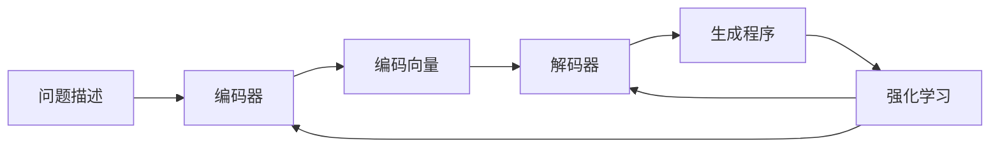

# 自动算法生成中神经程序归纳的突破性应用

> 关键词：自动算法生成、神经程序归纳、深度学习、程序合成、代码生成

> 摘要：本文深入探讨了自动算法生成中神经程序归纳的突破性应用。首先介绍了相关背景，包括目的、预期读者、文档结构和术语表。接着阐述了神经程序归纳的核心概念与联系，通过文本示意图和 Mermaid 流程图进行直观展示。详细讲解了核心算法原理，并给出 Python 源代码示例。同时，介绍了相关的数学模型和公式，并举例说明。通过项目实战，展示了代码的实际案例和详细解释。分析了神经程序归纳在不同领域的实际应用场景，推荐了学习资源、开发工具框架和相关论文著作。最后总结了未来发展趋势与挑战，提供了常见问题解答和扩展阅读参考资料。

## 1. 背景介绍 
### 1.1 目的和范围
自动算法生成一直是计算机科学领域的一个重要目标，它旨在让计算机自动产生解决特定问题的算法。神经程序归纳作为一种新兴的技术，为自动算法生成带来了新的突破。本文的目的是全面介绍神经程序归纳在自动算法生成中的应用，包括其核心概念、算法原理、数学模型、实际应用案例等，帮助读者深入理解这一技术，并为相关研究和开发提供参考。范围涵盖了神经程序归纳的基本理论、实现方法、应用场景以及未来发展趋势等方面。

### 1.2 预期读者
本文预期读者包括计算机科学领域的研究人员、程序员、软件架构师以及对自动算法生成和神经程序归纳感兴趣的技术爱好者。对于研究人员，本文可以提供最新的研究进展和思路；对于程序员和软件架构师，能够帮助他们了解如何将神经程序归纳应用到实际项目中；对于技术爱好者，可作为入门学习的资料，了解这一前沿技术的基本原理和应用。

### 1.3 文档结构概述
本文将按照以下结构进行组织：首先介绍相关背景知识，包括目的、读者群体和文档结构等；接着阐述神经程序归纳的核心概念与联系，通过示意图和流程图进行直观展示；详细讲解核心算法原理，并给出 Python 源代码示例；介绍相关的数学模型和公式，并举例说明；通过项目实战，展示代码的实际案例和详细解释；分析神经程序归纳在不同领域的实际应用场景；推荐学习资源、开发工具框架和相关论文著作；最后总结未来发展趋势与挑战，提供常见问题解答和扩展阅读参考资料。

### 1.4 术语表
#### 1.4.1 核心术语定义
- **自动算法生成**：指计算机系统自动产生解决特定问题的算法的过程，无需人工手动编写全部代码。
- **神经程序归纳**：利用神经网络技术来学习程序的结构和语义，从而实现自动生成程序的方法。
- **深度学习**：一类基于人工神经网络的机器学习技术，通过多层神经网络学习数据的特征和模式。
- **程序合成**：根据给定的规范和约束条件，自动生成满足要求的程序的过程。
- **代码生成**：将高级抽象的表示转换为具体的可执行代码的过程。

#### 1.4.2 相关概念解释
- **神经网络**：由大量神经元组成的计算模型，能够自动学习数据中的模式和规律。在神经程序归纳中，神经网络用于学习程序的结构和语义。
- **编码器 - 解码器架构**：一种常用的深度学习架构，编码器将输入数据编码为固定长度的向量表示，解码器根据该向量生成输出。在神经程序归纳中，编码器对问题描述进行编码，解码器生成相应的程序。
- **强化学习**：一种机器学习方法，智能体通过与环境交互，根据环境反馈的奖励信号来学习最优策略。在神经程序归纳中，强化学习可用于优化生成程序的质量。

#### 1.4.3 缩略词列表
- **RNN**：循环神经网络（Recurrent Neural Network），一种能够处理序列数据的神经网络。
- **LSTM**：长短期记忆网络（Long Short - Term Memory），是 RNN 的一种改进版本，能够有效处理长序列数据。
- **GRU**：门控循环单元（Gated Recurrent Unit），也是一种改进的 RNN，具有与 LSTM 相似的功能，但结构更简单。
- **CNN**：卷积神经网络（Convolutional Neural Network），常用于处理图像和序列数据，能够自动提取数据的局部特征。

## 2. 核心概念与联系 

神经程序归纳的核心思想是利用神经网络来学习程序的结构和语义，从而实现自动生成程序的目标。其基本原理是将问题描述作为输入，通过神经网络学习问题的特征和模式，然后生成满足要求的程序。

### 核心概念原理

神经程序归纳通常采用编码器 - 解码器架构。编码器将问题描述（如自然语言描述、输入输出示例等）编码为一个固定长度的向量表示，该向量包含了问题的关键信息。解码器根据这个向量生成程序代码。在生成过程中，解码器会逐步选择合适的代码片段，直到生成完整的程序。

为了提高生成程序的质量，通常会结合强化学习。强化学习通过与环境交互，根据环境反馈的奖励信号来调整神经网络的参数，使得生成的程序更符合要求。

### 架构的文本示意图

```plaintext
问题描述（自然语言、输入输出示例等） -> 编码器 -> 编码向量 -> 解码器 -> 生成程序
|                                            ^
|                                            |
|           强化学习（奖励信号反馈）         |
|____________________________________________|
```

### Mermaid 流程图



## 3. 核心算法原理 & 具体操作步骤 

### 算法原理讲解

神经程序归纳的核心算法通常基于深度学习模型，如 RNN、LSTM 或 GRU。下面以一个简单的基于 LSTM 的神经程序归纳模型为例，介绍其原理和具体操作步骤。

#### 原理概述
该模型的目标是根据输入的问题描述生成相应的程序代码。输入的问题描述被转换为词向量序列，然后通过 LSTM 编码器进行编码。编码器输出的隐藏状态作为解码器的初始状态，解码器使用另一个 LSTM 逐步生成程序代码的词向量序列，最后将词向量序列转换为程序代码。

#### Python 源代码实现

```python
import torch
import torch.nn as nn
import torch.optim as optim

# 定义编码器
class Encoder(nn.Module):
    def __init__(self, input_size, hidden_size):
        super(Encoder, self).__init__()
        self.hidden_size = hidden_size
        self.embedding = nn.Embedding(input_size, hidden_size)
        self.lstm = nn.LSTM(hidden_size, hidden_size)

    def forward(self, input, hidden):
        embedded = self.embedding(input).view(1, 1, -1)
        output = embedded
        output, hidden = self.lstm(output, hidden)
        return output, hidden

    def initHidden(self):
        return (torch.zeros(1, 1, self.hidden_size),
                torch.zeros(1, 1, self.hidden_size))

# 定义解码器
class Decoder(nn.Module):
    def __init__(self, hidden_size, output_size):
        super(Decoder, self).__init__()
        self.hidden_size = hidden_size
        self.embedding = nn.Embedding(output_size, hidden_size)
        self.lstm = nn.LSTM(hidden_size, hidden_size)
        self.out = nn.Linear(hidden_size, output_size)
        self.softmax = nn.LogSoftmax(dim=1)

    def forward(self, input, hidden):
        output = self.embedding(input).view(1, 1, -1)
        output = torch.relu(output)
        output, hidden = self.lstm(output, hidden)
        output = self.softmax(self.out(output[0]))
        return output, hidden

    def initHidden(self):
        return (torch.zeros(1, 1, self.hidden_size),
                torch.zeros(1, 1, self.hidden_size))

# 训练函数
def train(input_tensor, target_tensor, encoder, decoder, encoder_optimizer, decoder_optimizer, criterion):
    encoder_hidden = encoder.initHidden()

    encoder_optimizer.zero_grad()
    decoder_optimizer.zero_grad()

    input_length = input_tensor.size(0)
    target_length = target_tensor.size(0)

    encoder_outputs = torch.zeros(input_length, encoder.hidden_size)

    for ei in range(input_length):
        encoder_output, encoder_hidden = encoder(
            input_tensor[ei], encoder_hidden)
        encoder_outputs[ei] = encoder_output[0, 0]

    decoder_input = torch.tensor([[0]])
    decoder_hidden = encoder_hidden

    loss = 0

    for di in range(target_length):
        decoder_output, decoder_hidden = decoder(
            decoder_input, decoder_hidden)
        topv, topi = decoder_output.topk(1)
        decoder_input = topi.squeeze().detach()

        loss += criterion(decoder_output, target_tensor[di].unsqueeze(0))

    loss.backward()

    encoder_optimizer.step()
    decoder_optimizer.step()

    return loss.item() / target_length


# 示例使用
input_size = 100  # 输入词汇表大小
hidden_size = 128
output_size = 100  # 输出词汇表大小

encoder = Encoder(input_size, hidden_size)
decoder = Decoder(hidden_size, output_size)

encoder_optimizer = optim.SGD(encoder.parameters(), lr=0.01)
decoder_optimizer = optim.SGD(decoder.parameters(), lr=0.01)
criterion = nn.NLLLoss()

# 模拟输入和目标
input_tensor = torch.randint(0, input_size, (10,))
target_tensor = torch.randint(0, output_size, (10,))

# 训练模型
for i in range(100):
    loss = train(input_tensor, target_tensor, encoder, decoder, encoder_optimizer, decoder_optimizer, criterion)
    print(f'Epoch {i + 1}, Loss: {loss}')


```

### 具体操作步骤

1. **数据预处理**：将输入的问题描述和目标程序代码转换为词向量序列。可以使用词嵌入技术将每个词映射为一个固定长度的向量。
2. **模型初始化**：初始化编码器和解码器的参数。
3. **训练模型**：使用训练数据对模型进行训练。在每个训练步骤中，将输入的问题描述通过编码器进行编码，得到编码向量；然后将编码向量作为解码器的初始状态，解码器逐步生成程序代码；计算生成的代码与目标代码之间的损失，并使用反向传播算法更新模型的参数。
4. **生成程序**：在训练完成后，输入新的问题描述，通过编码器和解码器生成相应的程序代码。

## 4. 数学模型和公式 & 详细讲解 & 举例说明 

### 数学模型

神经程序归纳的数学模型主要基于深度学习的概率模型。假设输入的问题描述为 $x = (x_1, x_2, \cdots, x_m)$，目标程序代码为 $y = (y_1, y_2, \cdots, y_n)$。我们的目标是学习一个条件概率分布 $P(y|x)$，使得生成的程序代码 $y$ 尽可能接近真实的目标程序代码。

在编码器 - 解码器架构中，编码器将输入 $x$ 编码为一个隐藏状态 $h$，解码器根据隐藏状态 $h$ 生成输出 $y$。具体来说，编码器的输出可以表示为：

$$h = Encoder(x)$$

解码器生成输出的过程可以表示为一个序列生成模型，即：

$$P(y|x) = \prod_{i = 1}^{n} P(y_i|y_{1:i - 1}, h)$$

其中，$P(y_i|y_{1:i - 1}, h)$ 表示在给定之前生成的词 $y_{1:i - 1}$ 和隐藏状态 $h$ 的条件下，生成第 $i$ 个词 $y_i$ 的概率。

### 公式详细讲解

#### 编码器部分
编码器通常使用 RNN 或其变体（如 LSTM、GRU）。以 LSTM 为例，LSTM 的输入门 $i_t$、遗忘门 $f_t$、输出门 $o_t$ 和细胞状态 $C_t$ 的计算公式如下：

$$i_t = \sigma(W_{ii}x_t + W_{hi}h_{t - 1} + b_i)$$
$$f_t = \sigma(W_{if}x_t + W_{hf}h_{t - 1} + b_f)$$
$$o_t = \sigma(W_{io}x_t + W_{ho}h_{t - 1} + b_o)$$
$$\tilde{C}_t = \tanh(W_{ic}x_t + W_{hc}h_{t - 1} + b_c)$$
$$C_t = f_t \odot C_{t - 1} + i_t \odot \tilde{C}_t$$
$$h_t = o_t \odot \tanh(C_t)$$

其中，$x_t$ 是输入序列的第 $t$ 个元素，$h_{t - 1}$ 是上一个时间步的隐藏状态，$W$ 是权重矩阵，$b$ 是偏置向量，$\sigma$ 是 sigmoid 函数，$\tanh$ 是双曲正切函数，$\odot$ 表示元素级乘法。

#### 解码器部分
解码器同样使用 LSTM 或其他 RNN 变体。解码器的输出 $y_t$ 的概率可以通过 softmax 函数计算：

$$P(y_t|y_{1:t - 1}, h) = \text{softmax}(W_y h_t + b_y)$$

其中，$W_y$ 是输出层的权重矩阵，$b_y$ 是偏置向量。

### 举例说明

假设我们有一个简单的输入序列 $x = [1, 2, 3]$，目标输出序列 $y = [4, 5, 6]$。首先，将输入序列 $x$ 输入到编码器中，编码器通过 LSTM 计算每个时间步的隐藏状态 $h_1, h_2, h_3$。最后一个时间步的隐藏状态 $h_3$ 作为解码器的初始状态。

解码器从初始状态开始，逐步生成输出序列。在第一个时间步，解码器根据初始状态 $h_3$ 计算生成第一个词 $y_1$ 的概率分布 $P(y_1|h_3)$，然后选择概率最大的词作为输出。接着，将生成的词 $y_1$ 作为下一个时间步的输入，继续生成下一个词，直到生成完整的输出序列 $y$。

## 5. 项目实战：代码实际案例和详细解释说明 

### 5.1  开发环境搭建

#### 安装 Python
首先，确保你已经安装了 Python 3.x 版本。可以从 Python 官方网站（https://www.python.org/downloads/）下载并安装。

#### 安装 PyTorch
PyTorch 是一个常用的深度学习框架，我们将使用它来实现神经程序归纳模型。可以根据自己的系统和 CUDA 版本选择合适的安装方式，具体安装命令可以参考 PyTorch 官方网站（https://pytorch.org/get-started/locally/）。例如，如果你使用的是 CPU 版本的 PyTorch，可以使用以下命令安装：

```sh
pip install torch torchvision
```

#### 安装其他依赖库
还需要安装一些其他的依赖库，如 numpy、tqdm 等。可以使用以下命令安装：

```sh
pip install numpy tqdm
```

### 5.2  源代码详细实现和代码解读

```python
import torch
import torch.nn as nn
import torch.optim as optim
from tqdm import tqdm

# 定义编码器
class Encoder(nn.Module):
    def __init__(self, input_size, hidden_size):
        super(Encoder, self).__init__()
        self.hidden_size = hidden_size
        # 嵌入层，将输入的词索引转换为词向量
        self.embedding = nn.Embedding(input_size, hidden_size)
        # LSTM 层
        self.lstm = nn.LSTM(hidden_size, hidden_size)

    def forward(self, input, hidden):
        # 将输入的词索引转换为词向量
        embedded = self.embedding(input).view(1, 1, -1)
        output = embedded
        # 通过 LSTM 层计算输出和隐藏状态
        output, hidden = self.lstm(output, hidden)
        return output, hidden

    def initHidden(self):
        # 初始化隐藏状态和细胞状态
        return (torch.zeros(1, 1, self.hidden_size),
                torch.zeros(1, 1, self.hidden_size))

# 定义解码器
class Decoder(nn.Module):
    def __init__(self, hidden_size, output_size):
        super(Decoder, self).__init__()
        self.hidden_size = hidden_size
        # 嵌入层，将输入的词索引转换为词向量
        self.embedding = nn.Embedding(output_size, hidden_size)
        # LSTM 层
        self.lstm = nn.LSTM(hidden_size, hidden_size)
        # 全连接层，将 LSTM 的输出转换为词的概率分布
        self.out = nn.Linear(hidden_size, output_size)
        # 对数 softmax 层，用于计算词的概率分布
        self.softmax = nn.LogSoftmax(dim=1)

    def forward(self, input, hidden):
        # 将输入的词索引转换为词向量
        output = self.embedding(input).view(1, 1, -1)
        output = torch.relu(output)
        # 通过 LSTM 层计算输出和隐藏状态
        output, hidden = self.lstm(output, hidden)
        # 通过全连接层和对数 softmax 层计算词的概率分布
        output = self.softmax(self.out(output[0]))
        return output, hidden

    def initHidden(self):
        # 初始化隐藏状态和细胞状态
        return (torch.zeros(1, 1, self.hidden_size),
                torch.zeros(1, 1, self.hidden_size))

# 训练函数
def train(input_tensor, target_tensor, encoder, decoder, encoder_optimizer, decoder_optimizer, criterion):
    # 初始化编码器的隐藏状态
    encoder_hidden = encoder.initHidden()

    # 清零编码器和解码器的梯度
    encoder_optimizer.zero_grad()
    decoder_optimizer.zero_grad()

    input_length = input_tensor.size(0)
    target_length = target_tensor.size(0)

    # 初始化编码器的输出
    encoder_outputs = torch.zeros(input_length, encoder.hidden_size)

    # 编码器前向传播
    for ei in range(input_length):
        encoder_output, encoder_hidden = encoder(
            input_tensor[ei], encoder_hidden)
        encoder_outputs[ei] = encoder_output[0, 0]

    # 初始化解码器的输入
    decoder_input = torch.tensor([[0]])
    decoder_hidden = encoder_hidden

    loss = 0

    # 解码器前向传播
    for di in range(target_length):
        decoder_output, decoder_hidden = decoder(
            decoder_input, decoder_hidden)
        # 选择概率最大的词作为输出
        topv, topi = decoder_output.topk(1)
        decoder_input = topi.squeeze().detach()

        # 计算损失
        loss += criterion(decoder_output, target_tensor[di].unsqueeze(0))

    # 反向传播
    loss.backward()

    # 更新编码器和解码器的参数
    encoder_optimizer.step()
    decoder_optimizer.step()

    return loss.item() / target_length


# 示例使用
input_size = 100  # 输入词汇表大小
hidden_size = 128
output_size = 100  # 输出词汇表大小

# 初始化编码器和解码器
encoder = Encoder(input_size, hidden_size)
decoder = Decoder(hidden_size, output_size)

# 定义优化器
encoder_optimizer = optim.SGD(encoder.parameters(), lr=0.01)
decoder_optimizer = optim.SGD(decoder.parameters(), lr=0.01)
# 定义损失函数
criterion = nn.NLLLoss()

# 模拟输入和目标
input_tensor = torch.randint(0, input_size, (10,))
target_tensor = torch.randint(0, output_size, (10,))

# 训练模型
num_epochs = 100
for epoch in tqdm(range(num_epochs)):
    loss = train(input_tensor, target_tensor, encoder, decoder, encoder_optimizer, decoder_optimizer, criterion)
    if (epoch + 1) % 10 == 0:
        print(f'Epoch {epoch + 1}, Loss: {loss}')


```

### 5.3  代码解读与分析

#### 编码器部分
- `Encoder` 类继承自 `nn.Module`，用于将输入的问题描述编码为一个隐藏状态。
- `__init__` 方法初始化嵌入层和 LSTM 层。
- `forward` 方法实现了编码器的前向传播过程，将输入的词索引转换为词向量，然后通过 LSTM 层计算输出和隐藏状态。
- `initHidden` 方法用于初始化隐藏状态和细胞状态。

#### 解码器部分
- `Decoder` 类继承自 `nn.Module`，用于根据编码器的输出生成程序代码。
- `__init__` 方法初始化嵌入层、LSTM 层、全连接层和对数 softmax 层。
- `forward` 方法实现了解码器的前向传播过程，将输入的词索引转换为词向量，通过 LSTM 层计算输出和隐藏状态，然后通过全连接层和对数 softmax 层计算词的概率分布。
- `initHidden` 方法用于初始化隐藏状态和细胞状态。

#### 训练函数
- `train` 函数实现了模型的训练过程，包括编码器的前向传播、解码器的前向传播、损失计算和反向传播。
- 在编码器的前向传播过程中，将输入的问题描述通过 LSTM 层计算每个时间步的隐藏状态。
- 在解码器的前向传播过程中，根据编码器的输出和之前生成的词，逐步生成程序代码。
- 计算生成的代码与目标代码之间的损失，并使用反向传播算法更新模型的参数。

## 6. 实际应用场景 

### 软件开发
在软件开发中，神经程序归纳可以帮助程序员自动生成代码。例如，根据需求文档自动生成函数框架、类定义等，减少程序员的手动编码工作量。还可以用于代码补全，根据程序员输入的部分代码，预测后续可能的代码片段。

### 数据处理与分析
在数据处理和分析领域，神经程序归纳可以根据数据的特征和分析需求，自动生成数据处理和分析的代码。例如，根据数据集的特点自动生成数据清洗、特征提取和模型训练的代码，提高数据处理和分析的效率。

### 智能编程助手
神经程序归纳可以应用于智能编程助手，为程序员提供实时的代码建议和解决方案。当程序员遇到编程问题时，智能编程助手可以根据问题描述生成相应的代码示例，帮助程序员快速解决问题。

### 自动化测试
在软件测试中，神经程序归纳可以根据软件的功能需求和输入输出规范，自动生成测试用例和测试代码。通过自动生成的测试用例，可以更全面地覆盖软件的功能，提高软件的质量。

## 7. 工具和资源推荐
### 7.1 学习资源推荐
#### 7.1.1 书籍推荐
- 《深度学习》（Deep Learning）：由 Ian Goodfellow、Yoshua Bengio 和 Aaron Courville 编写，是深度学习领域的经典教材，涵盖了神经网络、深度学习模型、优化算法等方面的内容。
- 《Python 深度学习》（Deep Learning with Python）：由 Francois Chollet 编写，介绍了如何使用 Python 和 Keras 框架进行深度学习实践，包括神经网络的构建、训练和应用等方面的内容。
- 《动手学深度学习》（Dive into Deep Learning）：由 Aston Zhang、Zack C. Lipton、Mu Li 和 Alexander J. Smola 编写，提供了丰富的深度学习实践案例和代码示例，适合初学者学习。

#### 7.1.2 在线课程
- Coursera 上的“深度学习专项课程”（Deep Learning Specialization）：由 Andrew Ng 教授授课，包括深度学习基础、卷积神经网络、循环神经网络等多个课程，系统地介绍了深度学习的理论和实践。
- edX 上的“使用 PyTorch 进行深度学习”（Introduction to Deep Learning with PyTorch）：介绍了如何使用 PyTorch 框架进行深度学习开发，包括神经网络的构建、训练和部署等方面的内容。
- 吴恩达老师在 B 站的深度学习视频：免费且内容丰富，适合初学者入门学习。

#### 7.1.3 技术博客和网站
- Medium 上的 Towards Data Science：提供了大量关于数据科学、机器学习和深度学习的技术文章和教程。
- arXiv：是一个预印本服务器，提供了最新的学术研究论文，包括神经程序归纳、深度学习等领域的研究成果。
- 博客园、CSDN 等国内技术博客平台：有很多开发者分享的深度学习实践经验和代码示例。

### 7.2 开发工具框架推荐
#### 7.2.1 IDE和编辑器
- PyCharm：是一款专门为 Python 开发设计的集成开发环境，提供了代码编辑、调试、版本控制等功能，适合深度学习项目的开发。
- Jupyter Notebook：是一个交互式的开发环境，支持 Python、R 等多种编程语言，适合进行数据分析和深度学习实验。
- Visual Studio Code：是一款轻量级的代码编辑器，支持多种编程语言和插件扩展，通过安装相关插件可以进行深度学习项目的开发。

#### 7.2.2 调试和性能分析工具
- PyTorch Profiler：是 PyTorch 框架自带的性能分析工具，可以帮助开发者分析模型的训练和推理性能，找出性能瓶颈。
- TensorBoard：是 TensorFlow 框架的可视化工具，也可以用于 PyTorch 项目，通过可视化的方式展示模型的训练过程、损失曲线、模型结构等信息。
- PDB：是 Python 自带的调试器，可以帮助开发者调试 Python 代码，找出代码中的错误。

#### 7.2.3 相关框架和库
- PyTorch：是一个开源的深度学习框架，提供了丰富的神经网络层和优化算法，支持 GPU 加速，适合进行深度学习模型的开发和训练。
- TensorFlow：是另一个流行的深度学习框架，具有强大的分布式训练和部署能力，广泛应用于工业界和学术界。
- NLTK：是一个自然语言处理工具包，提供了丰富的自然语言处理功能，如分词、词性标注、命名实体识别等，可用于神经程序归纳中的文本处理。

### 7.3 相关论文著作推荐
#### 7.3.1 经典论文
- "Neural Programmer - Interpreters"：介绍了神经程序解释器的概念和方法，通过神经网络学习程序的结构和语义，实现自动程序生成。
- "Learning to Compose Neural Networks for Question Answering"：提出了一种基于神经网络的问题回答方法，通过组合神经网络模块来解决复杂的问题，为神经程序归纳提供了思路。
- "Seq2Seq Learning with Neural Networks"：介绍了编码器 - 解码器架构在序列到序列学习中的应用，是神经程序归纳中常用的架构。

#### 7.3.2 最新研究成果
- 关注 arXiv 上关于神经程序归纳、自动算法生成的最新论文，了解该领域的最新研究进展。
- 参加国际机器学习会议（ICML）、神经信息处理系统大会（NeurIPS）等顶级学术会议，获取最新的研究成果和技术趋势。

#### 7.3.3 应用案例分析
- 研究一些开源的神经程序归纳项目，如 DeepCoder、CodeGen 等，了解它们的实现原理和应用场景。
- 分析工业界中神经程序归纳的应用案例，如谷歌、微软等公司在软件开发、代码生成方面的实践经验。

## 8. 总结：未来发展趋势与挑战

### 未来发展趋势

#### 更强大的模型和算法
随着深度学习技术的不断发展，未来可能会出现更强大的神经程序归纳模型和算法。例如，结合强化学习、元学习等技术，提高模型的学习能力和泛化能力，使得生成的程序更加准确和高效。

#### 跨领域应用
神经程序归纳将不仅仅局限于软件开发领域，还将在其他领域得到广泛应用。例如，在生物信息学、物理学、化学等领域，根据实验数据和问题描述自动生成数据分析和模拟的程序，推动这些领域的研究和发展。

#### 与人类协作编程
未来的智能编程助手将更加智能，能够与人类程序员进行更有效的协作。例如，根据程序员的意图和上下文，自动生成代码片段，并与程序员进行交互和修改，提高软件开发的效率和质量。

### 挑战

#### 数据获取和标注
神经程序归纳需要大量的训练数据，包括问题描述和对应的程序代码。然而，获取和标注这些数据是一项非常困难和耗时的工作。此外，不同领域的程序代码具有不同的风格和规范，如何统一数据格式和标注标准也是一个挑战。

#### 模型的可解释性
深度学习模型通常是黑盒模型，难以解释其决策过程和生成的程序代码。在一些对安全性和可靠性要求较高的领域，如医疗、金融等，模型的可解释性是一个关键问题。如何提高神经程序归纳模型的可解释性，是未来需要解决的挑战之一。

#### 计算资源需求
训练神经程序归纳模型需要大量的计算资源，包括 GPU 计算能力和内存。对于一些小型企业和研究机构来说，获取和维护这些计算资源是一个挑战。如何优化模型的结构和算法，减少计算资源的需求，是未来需要研究的方向之一。

## 9. 附录：常见问题与解答

### 问题 1：神经程序归纳和传统的程序合成方法有什么区别？
传统的程序合成方法通常基于符号推理和逻辑编程，通过对问题的形式化描述和规则推理来生成程序。而神经程序归纳基于深度学习技术，通过神经网络学习程序的结构和语义，从大量的训练数据中自动学习生成程序的模式。神经程序归纳具有更强的泛化能力和适应性，能够处理更复杂和多样化的问题。

### 问题 2：神经程序归纳生成的程序质量如何保证？
可以通过以下几种方法保证神经程序归纳生成的程序质量：
- 使用高质量的训练数据，包括准确的问题描述和正确的程序代码。
- 结合强化学习，通过与环境交互，根据环境反馈的奖励信号来优化生成的程序。
- 进行代码审查和测试，对生成的程序进行人工审查和自动化测试，确保程序的正确性和可靠性。

### 问题 3：神经程序归纳在实际应用中有哪些限制？
神经程序归纳在实际应用中存在以下限制：
- 模型的可解释性较差，难以理解模型生成程序的决策过程。
- 对训练数据的依赖性较强，需要大量的标注数据进行训练。
- 生成的程序可能存在语法错误和逻辑错误，需要人工进行修正。
- 计算资源需求较大，训练和推理过程需要较高的计算能力和内存。

### 问题 4：如何选择合适的神经程序归纳模型？
选择合适的神经程序归纳模型需要考虑以下因素：
- 问题的复杂度和规模：对于简单的问题，可以选择较小的模型；对于复杂的问题，需要选择更强大的模型。
- 数据的特点：如果数据是序列数据，可以选择基于 RNN 或 LSTM 的模型；如果数据是图像数据，可以选择基于 CNN 的模型。
- 计算资源：根据自己的计算资源选择合适的模型，避免因计算资源不足导致训练和推理速度过慢。

## 10. 扩展阅读 & 参考资料

### 扩展阅读
- 《人工智能：一种现代的方法》（Artificial Intelligence: A Modern Approach）：全面介绍了人工智能的基本概念、方法和技术，包括机器学习、自然语言处理、计算机视觉等领域的内容。
- 《神经网络与深度学习》（Neural Networks and Deep Learning）：在线免费书籍，详细介绍了神经网络和深度学习的基本原理和实践方法。

### 参考资料
- 相关学术论文：在 arXiv、IEEE Xplore、ACM Digital Library 等学术数据库中搜索关于神经程序归纳、自动算法生成的相关论文。
- 开源项目：参考 DeepCoder、CodeGen 等开源的神经程序归纳项目的代码和文档。

作者：AI天才研究院/AI Genius Institute & 禅与计算机程序设计艺术 /Zen And The Art of Computer Programming