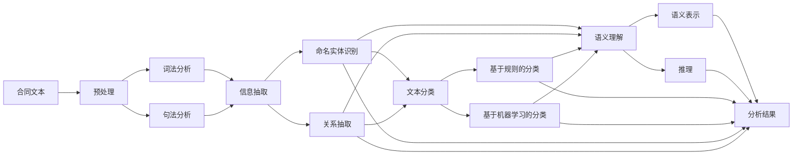

# 自然语言处理在合同文件分析中的应用

> 关键词：自然语言处理、合同文件分析、信息抽取、语义理解、文本分类

> 摘要：本文深入探讨了自然语言处理（NLP）在合同文件分析中的应用。首先介绍了相关背景，包括目的、预期读者和文档结构等。接着阐述了NLP在合同分析中的核心概念与联系，详细讲解了核心算法原理和具体操作步骤，并给出Python代码示例。通过数学模型和公式进一步剖析其原理，结合实际案例进行代码解读。分析了NLP在合同文件分析中的实际应用场景，推荐了学习资源、开发工具框架以及相关论文著作。最后总结了未来发展趋势与挑战，还提供了常见问题解答和扩展阅读参考资料，旨在为读者全面展示NLP在合同文件分析领域的应用。

## 1. 背景介绍 
### 1.1 目的和范围
在当今数字化时代，合同文件数量庞大且复杂。传统的合同文件分析方式效率低下，容易出现人为错误。自然语言处理技术的出现为解决这些问题提供了新的途径。本文的目的在于详细介绍自然语言处理在合同文件分析中的应用，包括如何利用NLP技术实现合同信息抽取、条款分类、风险评估等功能。范围涵盖了NLP相关的核心概念、算法原理、实际案例以及未来发展趋势等方面。

### 1.2 预期读者
本文预期读者包括自然语言处理领域的研究人员、软件开发工程师、法律行业从业者以及对合同文件自动化分析感兴趣的人士。对于研究人员，本文可提供新的研究思路和应用场景；对于工程师，可作为技术实现的参考；对于法律从业者，有助于了解如何借助NLP技术提高合同分析效率；对于其他感兴趣的读者，能帮助他们初步了解该领域的知识。

### 1.3 文档结构概述
本文将按照以下结构展开：首先介绍相关背景知识，包括目的、读者和文档结构等；接着阐述核心概念与联系，用示意图和流程图展示；然后详细讲解核心算法原理和具体操作步骤，并给出Python代码示例；通过数学模型和公式进一步说明原理，结合实际案例进行代码解读；分析实际应用场景；推荐学习资源、开发工具框架和相关论文著作；总结未来发展趋势与挑战；提供常见问题解答和扩展阅读参考资料。

### 1.4 术语表
#### 1.4.1 核心术语定义
- **自然语言处理（Natural Language Processing，NLP）**：是计算机科学、人工智能和语言学交叉领域的一个分支，旨在让计算机能够理解、处理和生成人类语言。
- **合同文件分析**：指对合同文本进行解析、理解和评估的过程，包括信息抽取、条款分类、风险识别等任务。
- **信息抽取**：从文本中提取特定类型的信息，如合同中的当事人、条款内容、时间等。
- **文本分类**：将文本划分到不同的类别中，例如将合同条款分为付款条款、违约责任条款等。

#### 1.4.2 相关概念解释
- **语义理解**：计算机对文本的含义进行理解，不仅仅是对文字表面的识别，还包括对句子、段落的语义分析。
- **命名实体识别（Named Entity Recognition，NER）**：是信息抽取的一种，用于识别文本中的命名实体，如人名、地名、组织机构名等。在合同文件分析中，可用于识别合同当事人、标的物等。
- **词法分析**：对文本进行词语切分和词性标注，有助于后续的语义分析和信息抽取。

#### 1.4.3 缩略词列表
- **NLP**：Natural Language Processing（自然语言处理）
- **NER**：Named Entity Recognition（命名实体识别）
- **TF-IDF**：Term Frequency-Inverse Document Frequency（词频 - 逆文档频率）

## 2. 核心概念与联系 

### 核心概念原理
自然语言处理在合同文件分析中的核心概念包括信息抽取、文本分类、语义理解等。信息抽取是从合同文本中提取关键信息，如合同双方、合同金额、履行期限等。文本分类则是将合同条款划分为不同的类别，以便于后续的分析和管理。语义理解是让计算机理解合同文本的含义，从而能够进行更深入的分析，如风险评估等。

这些概念之间相互关联。信息抽取是文本分类和语义理解的基础，只有准确地抽取到关键信息，才能进行有效的分类和语义分析。文本分类可以帮助更好地组织和管理抽取到的信息，同时也有助于语义理解，因为不同类别的条款具有不同的语义特征。语义理解则可以提高信息抽取和文本分类的准确性，通过理解文本的含义，能够更准确地识别关键信息和判断条款类别。

### 架构的文本示意图
```plaintext
合同文件分析系统
|-- 输入：合同文本
|   |-- 预处理
|       |-- 词法分析
|       |-- 句法分析
|   |-- 信息抽取
|       |-- 命名实体识别
|       |-- 关系抽取
|   |-- 文本分类
|       |-- 基于规则的分类
|       |-- 基于机器学习的分类
|   |-- 语义理解
|       |-- 语义表示
|       |-- 推理
|-- 输出：分析结果
    |-- 关键信息列表
    |-- 条款分类结果
    |-- 风险评估报告
```

### Mermaid 流程图


## 3. 核心算法原理 & 具体操作步骤 

### 信息抽取算法 - 命名实体识别（NER）
命名实体识别是信息抽取的重要任务之一，用于识别合同文本中的命名实体。常见的NER算法有基于规则的方法、基于机器学习的方法和基于深度学习的方法。这里我们介绍基于深度学习的BiLSTM - CRF算法。

#### 算法原理
BiLSTM（双向长短期记忆网络）可以捕捉文本的上下文信息，能够学习到序列数据中的长期依赖关系。CRF（条件随机场）则用于处理标签之间的依赖关系，能够提高标签预测的准确性。将BiLSTM和CRF结合起来，可以充分利用两者的优势，提高命名实体识别的性能。

#### 具体操作步骤
1. **数据预处理**：将合同文本进行分词，并标注每个词的实体标签。
2. **构建模型**：使用BiLSTM - CRF模型进行训练。
3. **训练模型**：使用标注好的数据集对模型进行训练。
4. **预测**：使用训练好的模型对新的合同文本进行命名实体识别。

#### Python源代码
```python
import torch
import torch.nn as nn
import torch.optim as optim
from torch.utils.data import Dataset, DataLoader
from torchcrf import CRF

# 定义数据集类
class ContractDataset(Dataset):
    def __init__(self, texts, labels):
        self.texts = texts
        self.labels = labels

    def __len__(self):
        return len(self.texts)

    def __getitem__(self, idx):
        text = self.texts[idx]
        label = self.labels[idx]
        return text, label

# 定义BiLSTM - CRF模型
class BiLSTM_CRF(nn.Module):
    def __init__(self, vocab_size, embedding_dim, hidden_dim, num_tags):
        super(BiLSTM_CRF, self).__init__()
        self.embedding = nn.Embedding(vocab_size, embedding_dim)
        self.lstm = nn.LSTM(embedding_dim, hidden_dim // 2,
                            num_layers=1, bidirectional=True)
        self.hidden2tag = nn.Linear(hidden_dim, num_tags)
        self.crf = CRF(num_tags)

    def forward(self, x, y):
        embedded = self.embedding(x)
        lstm_out, _ = self.lstm(embedded.view(len(x), 1, -1))
        emissions = self.hidden2tag(lstm_out.view(len(x), -1))
        loss = -self.crf(emissions.unsqueeze(0), y.unsqueeze(0))
        return loss

    def decode(self, x):
        embedded = self.embedding(x)
        lstm_out, _ = self.lstm(embedded.view(len(x), 1, -1))
        emissions = self.hidden2tag(lstm_out.view(len(x), -1))
        tags = self.crf.decode(emissions.unsqueeze(0))
        return tags[0]

# 示例数据
texts = [["合同", "甲方", "乙方", "金额", "10000", "元"], ["合作", "协议", "开始", "时间", "2023", "年", "10", "月"]]
labels = [[1, 2, 3, 4, 5, 5], [6, 6, 7, 8, 9, 9, 9, 9]]

# 构建词汇表和标签表
vocab = set([word for text in texts for word in text])
vocab_size = len(vocab)
word2idx = {word: idx for idx, word in enumerate(vocab)}
tag2idx = {tag: idx for idx, tag in enumerate(set([tag for label in labels for tag in label]))}
num_tags = len(tag2idx)

# 将文本和标签转换为索引
texts_idx = [[word2idx[word] for word in text] for text in texts]
labels_idx = [[tag2idx[tag] for tag in label] for label in labels]

# 创建数据集和数据加载器
dataset = ContractDataset(texts_idx, labels_idx)
dataloader = DataLoader(dataset, batch_size=1, shuffle=True)

# 初始化模型、优化器
model = BiLSTM_CRF(vocab_size, 100, 200, num_tags)
optimizer = optim.SGD(model.parameters(), lr=0.01, weight_decay=1e-4)

# 训练模型
num_epochs = 10
for epoch in range(num_epochs):
    total_loss = 0
    for text, label in dataloader:
        text = text[0]
        label = label[0]
        optimizer.zero_grad()
        loss = model(text, label)
        loss.backward()
        optimizer.step()
        total_loss += loss.item()
    print(f'Epoch {epoch + 1}, Loss: {total_loss}')

# 预测示例
test_text = ["合同", "甲方", "乙方"]
test_text_idx = [word2idx[word] for word in test_text]
test_text_tensor = torch.tensor(test_text_idx)
tags = model.decode(test_text_tensor)
print("预测标签:", tags)
```

### 文本分类算法 - 基于TF - IDF和逻辑回归
#### 算法原理
TF - IDF（词频 - 逆文档频率）是一种常用的文本特征提取方法，用于衡量一个词在文档中的重要性。逻辑回归是一种简单而有效的分类算法，用于根据文本的特征进行分类。结合TF - IDF和逻辑回归，可以实现合同条款的分类。

#### 具体操作步骤
1. **数据预处理**：将合同条款文本进行分词、去除停用词等处理。
2. **特征提取**：使用TF - IDF方法提取文本特征。
3. **构建模型**：使用逻辑回归模型进行训练。
4. **训练模型**：使用标注好的数据集对模型进行训练。
5. **预测**：使用训练好的模型对新的合同条款进行分类。

#### Python源代码
```python
from sklearn.feature_extraction.text import TfidfVectorizer
from sklearn.linear_model import LogisticRegression
from sklearn.model_selection import train_test_split
from sklearn.metrics import accuracy_score

# 示例数据
clauses = ["甲方应在合同签订后10日内支付预付款", "若乙方违约，应承担违约责任", "本合同自双方签字盖章之日起生效"]
labels = ["付款条款", "违约责任条款", "生效条款"]

# 数据预处理
vectorizer = TfidfVectorizer()
X = vectorizer.fit_transform(clauses)

# 划分训练集和测试集
X_train, X_test, y_train, y_test = train_test_split(X, labels, test_size=0.2, random_state=42)

# 构建逻辑回归模型
model = LogisticRegression()

# 训练模型
model.fit(X_train, y_train)

# 预测
y_pred = model.predict(X_test)

# 评估模型
accuracy = accuracy_score(y_test, y_pred)
print(f'Accuracy: {accuracy}')
```

## 4. 数学模型和公式 & 详细讲解 & 举例说明 

### TF - IDF 公式
TF - IDF（词频 - 逆文档频率）是一种用于衡量一个词在文档中的重要性的统计方法。其计算公式如下：

$$TF - IDF(t, d, D) = TF(t, d) \times IDF(t, D)$$

其中：
- $TF(t, d)$ 表示词 $t$ 在文档 $d$ 中的词频，计算公式为：
  $$TF(t, d) = \frac{词 t 在文档 d 中出现的次数}{文档 d 中的总词数}$$
- $IDF(t, D)$ 表示词 $t$ 的逆文档频率，计算公式为：
  $$IDF(t, D) = \log\frac{|D|}{|{d \in D : t \in d}| + 1}$$
  其中 $|D|$ 表示文档集合 $D$ 中的文档总数，$|{d \in D : t \in d}|$ 表示包含词 $t$ 的文档数。

#### 举例说明
假设有以下三个文档：
- $d_1$: "苹果 香蕉 橙子"
- $d_2$: "苹果 草莓"
- $d_3$: "香蕉 葡萄"

计算词 "苹果" 的 TF - IDF 值。

首先计算 $TF$ 值：
- 在 $d_1$ 中，$TF(苹果, d_1) = \frac{1}{3}$
- 在 $d_2$ 中，$TF(苹果, d_2) = \frac{1}{2}$
- 在 $d_3$ 中，$TF(苹果, d_3) = 0$

然后计算 $IDF$ 值：
包含词 "苹果" 的文档数为 2，文档总数为 3，则
$$IDF(苹果, D) = \log\frac{3}{2 + 1} = \log1 = 0$$

最后计算 $TF - IDF$ 值：
- 在 $d_1$ 中，$TF - IDF(苹果, d_1) = \frac{1}{3} \times 0 = 0$
- 在 $d_2$ 中，$TF - IDF(苹果, d_2) = \frac{1}{2} \times 0 = 0$
- 在 $d_3$ 中，$TF - IDF(苹果, d_3) = 0 \times 0 = 0$

### 逻辑回归模型
逻辑回归是一种用于二分类或多分类问题的广义线性模型。其基本思想是通过一个逻辑函数将线性回归的输出映射到 $[0, 1]$ 区间，从而得到一个概率值。

对于二分类问题，逻辑回归的模型可以表示为：

$$P(y = 1|x) = \frac{1}{1 + e^{-(w^T x + b)}}$$

其中 $x$ 是输入特征向量，$w$ 是权重向量，$b$ 是偏置项。

逻辑回归的损失函数通常使用交叉熵损失函数，其公式为：

$$L(w, b) = -\frac{1}{N} \sum_{i = 1}^{N} [y_i \log P(y_i = 1|x_i) + (1 - y_i) \log (1 - P(y_i = 1|x_i))]$$

其中 $N$ 是样本数量，$y_i$ 是样本 $i$ 的真实标签。

#### 举例说明
假设有一个简单的二分类问题，输入特征 $x$ 是一个一维向量，权重 $w = 1$，偏置 $b = 0$。对于输入 $x = 2$，计算 $P(y = 1|x)$ 的值。

首先计算 $w^T x + b = 1 \times 2 + 0 = 2$

然后计算 $P(y = 1|x) = \frac{1}{1 + e^{-2}} \approx 0.88$

## 5. 项目实战：代码实际案例和详细解释说明 

### 5.1  开发环境搭建
#### 操作系统
建议使用Linux系统，如Ubuntu 18.04及以上版本，也可以使用Windows 10或macOS系统。

#### Python环境
安装Python 3.7及以上版本。可以使用Anaconda来管理Python环境，具体安装步骤如下：
1. 从Anaconda官网（https://www.anaconda.com/products/individual）下载适合自己操作系统的Anaconda安装包。
2. 运行安装包，按照提示完成安装。
3. 打开终端（Windows下为Anaconda Prompt），创建一个新的Python环境：
```bash
conda create -n contract_analysis python=3.8
conda activate contract_analysis
```

#### 安装必要的库
在激活的Python环境中，安装以下必要的库：
```bash
pip install torch torchvision torchaudio
pip install scikit-learn
pip install torchcrf
```

### 5.2  源代码详细实现和代码解读
#### 信息抽取（命名实体识别）
```python
import torch
import torch.nn as nn
import torch.optim as optim
from torch.utils.data import Dataset, DataLoader
from torchcrf import CRF

# 定义数据集类
class ContractDataset(Dataset):
    def __init__(self, texts, labels):
        # 初始化数据集，将文本和标签存储在类的属性中
        self.texts = texts
        self.labels = labels

    def __len__(self):
        # 返回数据集的长度，即文本的数量
        return len(self.texts)

    def __getitem__(self, idx):
        # 根据索引返回对应的文本和标签
        text = self.texts[idx]
        label = self.labels[idx]
        return text, label

# 定义BiLSTM - CRF模型
class BiLSTM_CRF(nn.Module):
    def __init__(self, vocab_size, embedding_dim, hidden_dim, num_tags):
        super(BiLSTM_CRF, self).__init__()
        # 词嵌入层，将词索引转换为词向量
        self.embedding = nn.Embedding(vocab_size, embedding_dim)
        # 双向LSTM层，用于捕捉文本的上下文信息
        self.lstm = nn.LSTM(embedding_dim, hidden_dim // 2,
                            num_layers=1, bidirectional=True)
        # 线性层，将LSTM的输出映射到标签空间
        self.hidden2tag = nn.Linear(hidden_dim, num_tags)
        # CRF层，用于处理标签之间的依赖关系
        self.crf = CRF(num_tags)

    def forward(self, x, y):
        # 前向传播函数，计算损失值
        embedded = self.embedding(x)
        lstm_out, _ = self.lstm(embedded.view(len(x), 1, -1))
        emissions = self.hidden2tag(lstm_out.view(len(x), -1))
        loss = -self.crf(emissions.unsqueeze(0), y.unsqueeze(0))
        return loss

    def decode(self, x):
        # 解码函数，根据输入文本预测标签
        embedded = self.embedding(x)
        lstm_out, _ = self.lstm(embedded.view(len(x), 1, -1))
        emissions = self.hidden2tag(lstm_out.view(len(x), -1))
        tags = self.crf.decode(emissions.unsqueeze(0))
        return tags[0]

# 示例数据
texts = [["合同", "甲方", "乙方", "金额", "10000", "元"], ["合作", "协议", "开始", "时间", "2023", "年", "10", "月"]]
labels = [[1, 2, 3, 4, 5, 5], [6, 6, 7, 8, 9, 9, 9, 9]]

# 构建词汇表和标签表
vocab = set([word for text in texts for word in text])
vocab_size = len(vocab)
word2idx = {word: idx for idx, word in enumerate(vocab)}
tag2idx = {tag: idx for idx, tag in enumerate(set([tag for label in labels for tag in label]))}
num_tags = len(tag2idx)

# 将文本和标签转换为索引
texts_idx = [[word2idx[word] for word in text] for text in texts]
labels_idx = [[tag2idx[tag] for tag in label] for label in labels]

# 创建数据集和数据加载器
dataset = ContractDataset(texts_idx, labels_idx)
dataloader = DataLoader(dataset, batch_size=1, shuffle=True)

# 初始化模型、优化器
model = BiLSTM_CRF(vocab_size, 100, 200, num_tags)
optimizer = optim.SGD(model.parameters(), lr=0.01, weight_decay=1e-4)

# 训练模型
num_epochs = 10
for epoch in range(num_epochs):
    total_loss = 0
    for text, label in dataloader:
        text = text[0]
        label = label[0]
        optimizer.zero_grad()
        loss = model(text, label)
        loss.backward()
        optimizer.step()
        total_loss += loss.item()
    print(f'Epoch {epoch + 1}, Loss: {total_loss}')

# 预测示例
test_text = ["合同", "甲方", "乙方"]
test_text_idx = [word2idx[word] for word in test_text]
test_text_tensor = torch.tensor(test_text_idx)
tags = model.decode(test_text_tensor)
print("预测标签:", tags)
```

#### 代码解读
- **数据集类 `ContractDataset`**：用于存储和管理数据集，实现了 `__len__` 和 `__getitem__` 方法，方便数据加载器进行数据加载。
- **BiLSTM - CRF模型 `BiLSTM_CRF`**：包含词嵌入层、双向LSTM层、线性层和CRF层。`forward` 方法用于计算损失值，`decode` 方法用于预测标签。
- **数据预处理**：构建词汇表和标签表，将文本和标签转换为索引，方便模型处理。
- **训练过程**：使用随机梯度下降（SGD）优化器对模型进行训练，迭代多个epoch，不断更新模型参数。
- **预测过程**：将测试文本转换为索引，输入到模型的 `decode` 方法中，得到预测标签。

#### 文本分类（基于TF - IDF和逻辑回归）
```python
from sklearn.feature_extraction.text import TfidfVectorizer
from sklearn.linear_model import LogisticRegression
from sklearn.model_selection import train_test_split
from sklearn.metrics import accuracy_score

# 示例数据
clauses = ["甲方应在合同签订后10日内支付预付款", "若乙方违约，应承担违约责任", "本合同自双方签字盖章之日起生效"]
labels = ["付款条款", "违约责任条款", "生效条款"]

# 数据预处理
vectorizer = TfidfVectorizer()
X = vectorizer.fit_transform(clauses)

# 划分训练集和测试集
X_train, X_test, y_train, y_test = train_test_split(X, labels, test_size=0.2, random_state=42)

# 构建逻辑回归模型
model = LogisticRegression()

# 训练模型
model.fit(X_train, y_train)

# 预测
y_pred = model.predict(X_test)

# 评估模型
accuracy = accuracy_score(y_test, y_pred)
print(f'Accuracy: {accuracy}')
```

#### 代码解读
- **数据预处理**：使用 `TfidfVectorizer` 提取文本的TF - IDF特征，将文本转换为向量表示。
- **划分数据集**：使用 `train_test_split` 方法将数据集划分为训练集和测试集。
- **模型构建**：使用 `LogisticRegression` 构建逻辑回归模型。
- **模型训练**：使用训练集对模型进行训练。
- **模型预测和评估**：使用测试集进行预测，并使用 `accuracy_score` 计算模型的准确率。

### 5.3  代码解读与分析
#### 信息抽取代码分析
- **优点**：BiLSTM - CRF模型能够充分利用文本的上下文信息和标签之间的依赖关系，提高命名实体识别的准确性。使用深度学习模型可以自动学习文本的特征，减少了人工特征工程的工作量。
- **缺点**：模型训练需要大量的标注数据，训练时间较长，对计算资源要求较高。模型的可解释性较差，难以理解模型的决策过程。

#### 文本分类代码分析
- **优点**：TF - IDF和逻辑回归方法简单易懂，实现起来较为容易。不需要大量的训练数据，训练速度较快。模型具有一定的可解释性，可以通过查看特征的权重来理解模型的决策依据。
- **缺点**：TF - IDF方法只考虑了词的统计信息，没有考虑词的语义信息，对于一些语义相近但词不同的文本可能无法准确分类。逻辑回归模型是一个线性模型，对于复杂的分类问题可能效果不佳。

## 6. 实际应用场景 
### 合同信息抽取
在处理大量合同文件时，手动抽取关键信息（如合同双方、合同金额、履行期限等）是一项繁琐且容易出错的工作。使用自然语言处理技术可以自动从合同文本中抽取这些关键信息，提高工作效率和准确性。例如，在企业的合同管理系统中，可以使用信息抽取技术快速获取合同的基本信息，方便进行合同的分类、存储和查询。

### 合同条款分类
将合同条款划分为不同的类别（如付款条款、违约责任条款、保密条款等）有助于对合同进行更细致的管理和分析。通过文本分类技术，可以自动对合同条款进行分类，便于律师和业务人员快速定位和查看相关条款。例如，在合同审查过程中，可以根据条款的分类快速筛选出需要重点关注的条款。

### 合同风险评估
自然语言处理技术可以帮助识别合同中的潜在风险。通过语义理解和文本分析，可以检测合同条款中是否存在模糊、歧义或对己方不利的内容。例如，分析违约责任条款是否合理，付款条款是否存在风险等。根据风险评估结果，企业可以采取相应的措施来降低风险。

### 合同比对
在合同续签或修改时，需要对新旧合同进行比对，找出其中的差异。自然语言处理技术可以通过文本相似度计算等方法，快速准确地找出合同之间的差异，帮助业务人员和律师进行合同审查和修改。

## 7. 工具和资源推荐
### 7.1 学习资源推荐
#### 7.1.1 书籍推荐
- 《自然语言处理入门》：作者何晗，本书适合初学者，系统介绍了自然语言处理的基本概念、算法和应用，通过大量的实例和代码帮助读者快速掌握相关知识。
- 《Python自然语言处理》：作者Steven Bird、Ewan Klein和Edward Loper，本书以Python为工具，详细介绍了自然语言处理的各个方面，包括文本预处理、词性标注、命名实体识别等。
- 《深度学习》：作者Ian Goodfellow、Yoshua Bengio和Aaron Courville，本书是深度学习领域的经典著作，介绍了深度学习的基本原理、算法和应用，对于理解自然语言处理中的深度学习模型有很大帮助。

#### 7.1.2 在线课程
- Coursera上的“Natural Language Processing Specialization”：由斯坦福大学的教授授课，系统介绍了自然语言处理的各个方面，包括词法分析、句法分析、语义理解等。
- edX上的“Introduction to Natural Language Processing”：由哥伦比亚大学的教授授课，课程内容涵盖了自然语言处理的基本概念、算法和应用。
- 中国大学MOOC上的“自然语言处理”：由哈尔滨工业大学的教授授课，结合实际案例介绍了自然语言处理的相关技术和应用。

#### 7.1.3 技术博客和网站
- Medium上的Towards Data Science：该博客上有很多关于自然语言处理的技术文章和案例分析，涵盖了最新的研究成果和应用实践。
- arXiv：是一个预印本平台，上面有很多关于自然语言处理的最新研究论文，可以及时了解该领域的研究动态。
- 开源中国：该网站上有很多关于自然语言处理的开源项目和技术文章，对于学习和实践有很大帮助。

### 7.2 开发工具框架推荐
#### 7.2.1 IDE和编辑器
- PyCharm：是一款专门用于Python开发的集成开发环境，具有代码编辑、调试、版本控制等功能，支持各种Python库和框架。
- Jupyter Notebook：是一个交互式的开发环境，适合进行数据分析和模型训练，支持Python、R等多种编程语言。
- Visual Studio Code：是一款轻量级的代码编辑器，具有丰富的插件和扩展功能，支持Python开发。

#### 7.2.2 调试和性能分析工具
- PySnooper：是一个简单易用的调试工具，可以自动记录函数的执行过程和变量的值，方便调试代码。
- cProfile：是Python标准库中的性能分析工具，可以分析代码的运行时间和函数调用情况，帮助优化代码性能。
- TensorBoard：是TensorFlow的可视化工具，可用于可视化模型的训练过程、损失曲线等，帮助分析模型的性能。

#### 7.2.3 相关框架和库
- NLTK（Natural Language Toolkit）：是一个广泛使用的自然语言处理库，提供了丰富的文本处理工具和数据集，包括词法分析、句法分析、语义分析等功能。
- SpaCy：是一个高效的自然语言处理库，支持多种语言，具有快速的处理速度和良好的性能，提供了命名实体识别、词性标注等功能。
- Transformers：是Hugging Face开发的一个深度学习库，提供了各种预训练的语言模型（如BERT、GPT等），可以方便地进行文本分类、信息抽取等任务。

### 7.3 相关论文著作推荐
#### 7.3.1 经典论文
- “Attention Is All You Need”：提出了Transformer模型，为自然语言处理领域带来了革命性的变化，是现代自然语言处理模型的基础。
- “BERT: Pre-training of Deep Bidirectional Transformers for Language Understanding”：介绍了BERT模型，该模型在多个自然语言处理任务上取得了优异的成绩，推动了预训练语言模型的发展。
- “Named Entity Recognition with Bidirectional LSTM-CNNs”：提出了使用双向LSTM和卷积神经网络进行命名实体识别的方法，提高了命名实体识别的性能。

#### 7.3.2 最新研究成果
- 在ACL（Association for Computational Linguistics）、EMNLP（Conference on Empirical Methods in Natural Language Processing）等自然语言处理领域的顶级会议上可以找到最新的研究成果。这些会议上的论文涵盖了自然语言处理的各个方面，包括新的算法、模型和应用。
- 在顶级学术期刊如Journal of Artificial Intelligence Research（JAIR）、Computational Linguistics等上也有很多关于自然语言处理的高质量研究论文。

#### 7.3.3 应用案例分析
- 在实际应用中，可以参考一些大型企业和研究机构发布的案例分析报告。例如，IBM Watson在合同分析领域的应用案例，展示了如何使用自然语言处理技术进行合同信息抽取和风险评估。
- 一些法律科技公司也会发布相关的案例分析，介绍他们如何利用自然语言处理技术帮助律师和企业处理合同文件。

## 8. 总结：未来发展趋势与挑战
### 未来发展趋势
#### 预训练模型的广泛应用
随着预训练语言模型（如BERT、GPT等）的不断发展，它们将在合同文件分析中得到更广泛的应用。预训练模型可以学习到大量的语言知识，能够更好地理解合同文本的语义，提高信息抽取、文本分类等任务的准确性。

#### 多模态信息融合
未来的合同文件分析可能会结合多模态信息，如文本、图像、音频等。例如，合同中的一些条款可能以图像的形式存在，通过图像识别技术将其转换为文本，再进行分析。多模态信息融合可以提供更全面的合同信息，提高分析的准确性和效率。

#### 智能化合同管理系统
基于自然语言处理技术，将开发出更加智能化的合同管理系统。这些系统可以自动完成合同的起草、审查、风险评估等任务，实现合同管理的自动化和智能化。例如，系统可以根据企业的历史合同数据和业务需求，自动生成符合要求的合同条款。

#### 与区块链技术结合
将自然语言处理与区块链技术结合，可以提高合同的安全性和可信度。区块链技术可以确保合同数据的不可篡改和可追溯性，自然语言处理技术可以对合同内容进行分析和验证。两者结合可以为合同管理提供更可靠的解决方案。

### 挑战
#### 数据质量和标注问题
自然语言处理模型的训练需要大量高质量的标注数据。在合同文件分析领域，获取标注数据是一个挑战，因为合同文本通常具有专业性和保密性，标注工作需要专业的法律知识。此外，数据的质量也会影响模型的性能，如果数据存在错误或偏差，可能会导致模型的预测结果不准确。

#### 语义理解的复杂性
合同文本通常具有复杂的语义结构和法律含义，准确理解合同文本的语义是一个挑战。自然语言处理技术在处理一些模糊、歧义的表述时可能会出现困难，需要进一步提高语义理解的能力。

#### 法律合规性
在使用自然语言处理技术进行合同文件分析时，需要确保系统的输出符合法律规定。例如，在风险评估过程中，系统的判断结果需要有法律依据，否则可能会给企业带来法律风险。

#### 模型可解释性
深度学习模型在自然语言处理中取得了很好的效果，但这些模型通常是黑盒模型，难以解释其决策过程。在合同文件分析中，模型的可解释性非常重要，因为律师和业务人员需要了解模型是如何得出结论的，以便进行决策。

## 9. 附录：常见问题与解答
### 1. 自然语言处理技术在合同文件分析中的准确性如何保证？
可以通过以下方法保证准确性：
- 使用大量高质量的标注数据进行模型训练，数据的质量和多样性会直接影响模型的性能。
- 选择合适的算法和模型，根据具体的任务和数据特点选择最适合的方法。
- 进行模型评估和调优，使用交叉验证等方法评估模型的性能，并对模型的参数进行调优。
- 结合人工审查，对于一些关键的合同条款和重要信息，由专业的法律人员进行人工审查，确保分析结果的准确性。

### 2. 自然语言处理模型需要多长时间进行训练？
模型的训练时间取决于多个因素，如数据量的大小、模型的复杂度、计算资源的配置等。对于简单的模型和较小的数据集，训练时间可能只需要几分钟到几小时；对于复杂的深度学习模型和大规模的数据集，训练时间可能需要几天甚至几周。

### 3. 如何处理合同文本中的专业术语和法律词汇？
可以采取以下措施：
- 构建专业的词汇表，将合同文本中的专业术语和法律词汇纳入词汇表中，在数据预处理阶段进行特殊处理。
- 使用预训练模型，一些预训练模型在大规模的文本数据上进行了训练，可能已经学习到了一些专业术语和法律词汇的语义。
- 结合领域知识进行特征工程，提取与专业术语和法律词汇相关的特征，帮助模型更好地理解这些词汇。

### 4. 自然语言处理技术能否完全替代人工进行合同文件分析？
目前还不能完全替代。虽然自然语言处理技术在合同文件分析中可以提高效率和准确性，但合同文本通常具有专业性和复杂性，涉及到法律和业务的多个方面。人工审查在理解合同的背景、意图和潜在风险等方面具有不可替代的作用。自然语言处理技术可以作为辅助工具，帮助人工更快地完成合同分析任务。

## 10. 扩展阅读 & 参考资料
### 扩展阅读
- 《法律自然语言处理》：深入探讨了自然语言处理技术在法律领域的应用，包括合同分析、法律检索等方面。
- 《人工智能与法律》：介绍了人工智能技术（包括自然语言处理）在法律领域的发展和应用，以及相关的法律和伦理问题。
- 《自然语言处理实战：基于Scikit - learn、Keras和TensorFlow》：通过实际案例介绍了自然语言处理的各种技术和方法，适合有一定编程基础的读者。

### 参考资料
- 《自然语言处理入门》书籍官网：https://nlp.hankcs.com/
- Hugging Face Transformers官方文档：https://huggingface.co/docs/transformers/index
- NLTK官方文档：https://www.nltk.org/

作者：AI天才研究院/AI Genius Institute & 禅与计算机程序设计艺术 /Zen And The Art of Computer Programming