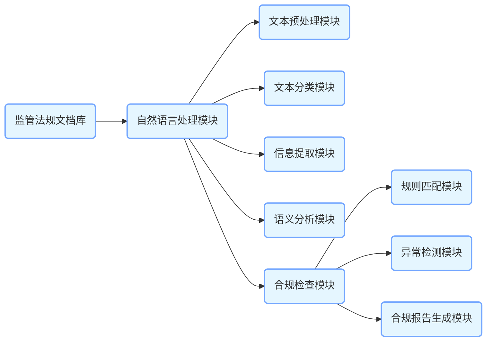

# 自然语言处理在监管合规自动化中的应用

> 关键词：自然语言处理、监管合规自动化、文本分析、信息提取、机器学习

> 摘要：本文聚焦于自然语言处理（NLP）在监管合规自动化领域的应用。首先介绍了监管合规自动化的背景，包括目的、预期读者和文档结构等。接着阐述了NLP的核心概念及其与监管合规的联系，详细讲解了相关核心算法原理和具体操作步骤，运用Python代码进行说明。同时给出了涉及的数学模型和公式，并举例解释。通过项目实战展示了如何利用NLP实现监管合规自动化，包括开发环境搭建、源代码实现和解读。还探讨了NLP在监管合规自动化中的实际应用场景，推荐了学习资源、开发工具框架和相关论文著作。最后总结了未来发展趋势与挑战，解答了常见问题，并提供了扩展阅读和参考资料。

## 1. 背景介绍 
### 1.1 目的和范围
在当今复杂的商业环境中，监管合规是企业运营中至关重要的一部分。监管法规不断更新和变化，企业需要投入大量的人力和时间来确保自身的运营符合各项规定。自然语言处理技术的出现为监管合规自动化提供了新的解决方案。本文的目的是深入探讨自然语言处理在监管合规自动化中的应用，包括相关技术原理、实际操作步骤、项目案例以及未来发展趋势等方面。范围涵盖了从基础概念到具体应用的各个层面，旨在为读者提供全面而深入的了解。

### 1.2 预期读者
本文预期读者包括监管合规领域的专业人士，如合规专员、律师等，他们可以通过本文了解如何利用自然语言处理技术提高合规工作的效率和准确性。同时，也适合从事自然语言处理研究和开发的技术人员，为他们提供在监管合规领域的应用场景和实践经验。此外，企业管理人员和决策者也可以从本文中获取关于监管合规自动化的信息，以便做出更明智的决策。

### 1.3 文档结构概述
本文将按照以下结构进行组织：首先介绍自然语言处理和监管合规自动化的核心概念及其联系；然后详细讲解核心算法原理和具体操作步骤，通过Python代码进行说明；接着给出相关的数学模型和公式，并举例解释；通过项目实战展示如何利用自然语言处理实现监管合规自动化；探讨自然语言处理在监管合规自动化中的实际应用场景；推荐学习资源、开发工具框架和相关论文著作；最后总结未来发展趋势与挑战，解答常见问题，并提供扩展阅读和参考资料。

### 1.4 术语表
#### 1.4.1 核心术语定义
- **自然语言处理（Natural Language Processing, NLP）**：是人工智能的一个分支领域，旨在让计算机能够理解、处理和生成人类语言。它涉及到多个方面的技术，如文本分类、信息提取、机器翻译等。
- **监管合规自动化（Regulatory Compliance Automation）**：指利用技术手段自动完成监管合规相关的任务，如法规文档的分析、企业运营数据的检查等，以提高合规工作的效率和准确性。
- **文本分类（Text Classification）**：是自然语言处理中的一项基本任务，它将文本划分到不同的类别中。例如，将法规文档分类为不同的监管领域。
- **信息提取（Information Extraction）**：从文本中提取出特定的信息，如实体、关系和事件等。在监管合规中，可以用于从法规文档中提取关键条款和要求。

#### 1.4.2 相关概念解释
- **机器学习（Machine Learning）**：是自然语言处理中常用的技术之一，它通过让计算机从数据中学习模式和规律，从而实现对未知数据的预测和分类。常见的机器学习算法包括决策树、支持向量机、神经网络等。
- **深度学习（Deep Learning）**：是机器学习的一个子集，它使用多层神经网络来学习数据的复杂表示。在自然语言处理中，深度学习已经取得了很多成功的应用，如语言模型、情感分析等。
- **法规本体（Regulatory Ontology）**：是一种用于表示法规知识的形式化模型，它定义了法规中的概念、关系和规则。法规本体可以帮助计算机更好地理解法规文档的语义。

#### 1.4.3 缩略词列表
- **NLP**：Natural Language Processing（自然语言处理）
- **RCA**：Regulatory Compliance Automation（监管合规自动化）
- **ML**：Machine Learning（机器学习）
- **DL**：Deep Learning（深度学习）

## 2. 核心概念与联系 

### 2.1 自然语言处理核心概念
自然语言处理的核心目标是让计算机能够像人类一样理解和处理自然语言。它涉及到多个层次的处理，包括词法分析、句法分析、语义分析和语用分析等。

#### 词法分析
词法分析是自然语言处理的基础，它将文本分解为单词或词素。例如，对于句子 “The quick brown fox jumps over the lazy dog.”，词法分析会将其分解为 “The”、“quick”、“brown”、“fox”、“jumps”、“over”、“the”、“lazy”、“dog” 等单词。

#### 句法分析
句法分析是分析句子的语法结构，确定单词之间的关系。例如，对于上述句子，句法分析可以确定 “The quick brown fox” 是主语，“jumps” 是谓语，“over the lazy dog” 是宾语等。

#### 语义分析
语义分析是理解文本的含义，确定单词和句子的语义信息。例如，理解 “fox” 是一种动物，“jumps” 表示一种动作等。

#### 语用分析
语用分析是考虑文本的使用场景和上下文，理解文本的隐含意义。例如，在不同的语境中，“How are you?” 可能有不同的含义。

### 2.2 监管合规自动化核心概念
监管合规自动化的目标是利用技术手段自动完成监管合规相关的任务，减少人工干预，提高合规工作的效率和准确性。它主要包括以下几个方面：

#### 法规文档管理
法规文档管理是对监管法规文档进行收集、整理、存储和更新。通过自然语言处理技术，可以对法规文档进行分类、索引和搜索，方便合规人员快速查找所需的法规信息。

#### 合规检查
合规检查是对企业的运营数据和业务流程进行检查，确保其符合监管法规的要求。自然语言处理技术可以用于从企业的文档和数据中提取关键信息，与法规要求进行比对，发现潜在的合规问题。

#### 报告生成
报告生成是根据合规检查的结果生成合规报告。自然语言处理技术可以用于自动生成合规报告的文本内容，提高报告生成的效率和准确性。

### 2.3 自然语言处理与监管合规自动化的联系
自然语言处理为监管合规自动化提供了强大的技术支持。通过自然语言处理技术，可以对大量的法规文档和企业数据进行自动处理和分析，实现法规文档的理解、合规检查的自动化和合规报告的生成。具体来说，自然语言处理在监管合规自动化中的应用主要包括以下几个方面：

#### 法规文档理解
自然语言处理技术可以用于对法规文档进行语义分析，理解法规的含义和要求。通过文本分类、信息提取等技术，可以将法规文档分类为不同的监管领域，提取关键条款和要求，为合规检查提供依据。

#### 合规检查自动化
自然语言处理技术可以用于从企业的文档和数据中提取关键信息，与法规要求进行比对，发现潜在的合规问题。例如，通过命名实体识别技术，可以从企业的合同中提取出相关的实体信息，如供应商、客户等，与法规中关于供应商资质的要求进行比对。

#### 合规报告生成
自然语言处理技术可以用于自动生成合规报告的文本内容。通过模板生成和文本生成技术，可以根据合规检查的结果自动生成合规报告的各个部分，如引言、检查结果、建议等，提高报告生成的效率和准确性。

### 2.4 核心概念原理和架构的文本示意图
```plaintext
自然语言处理在监管合规自动化中的应用架构

┌───────────────────────────┐
│      监管法规文档库      │
└───────────────────────────┘
               │
               ▼
┌───────────────────────────┐
│    自然语言处理模块       │
│ ┌───────────────────────┐ │
│ │  文本预处理模块       │ │
│ ├───────────────────────┤ │
│ │  文本分类模块         │ │
│ ├───────────────────────┤ │
│ │  信息提取模块         │ │
│ ├───────────────────────┤ │
│ │  语义分析模块         │ │
│ └───────────────────────┘ │
└───────────────────────────┘
               │
               ▼
┌───────────────────────────┐
│    合规检查模块           │
│ ┌───────────────────────┐ │
│ │  规则匹配模块         │ │
│ ├───────────────────────┤ │
│ │  异常检测模块         │ │
│ └───────────────────────┘ │
└───────────────────────────┘
               │
               ▼
┌───────────────────────────┐
│    合规报告生成模块       │
└───────────────────────────┘
```

### 2.5 Mermaid 流程图


## 3. 核心算法原理 & 具体操作步骤 

### 3.1 文本分类算法原理
文本分类是自然语言处理中的一项基本任务，它将文本划分到不同的类别中。常见的文本分类算法包括朴素贝叶斯算法、支持向量机算法和深度学习算法等。

#### 朴素贝叶斯算法原理
朴素贝叶斯算法是基于贝叶斯定理和特征条件独立假设的分类算法。它假设文本中的每个特征（如单词）都是独立的，通过计算文本属于每个类别的概率，选择概率最大的类别作为文本的分类结果。

贝叶斯定理的公式为：

$$P(C|D)=\frac{P(D|C)P(C)}{P(D)}$$

其中，$P(C|D)$ 表示在给定文本 $D$ 的情况下，文本属于类别 $C$ 的概率；$P(D|C)$ 表示在类别 $C$ 下出现文本 $D$ 的概率；$P(C)$ 表示类别 $C$ 出现的先验概率；$P(D)$ 表示文本 $D$ 出现的概率。

在朴素贝叶斯算法中，由于 $P(D)$ 对于所有类别都是相同的，因此可以忽略不计。同时，根据特征条件独立假设，$P(D|C)$ 可以表示为：

$$P(D|C)=\prod_{i=1}^{n}P(w_i|C)$$

其中，$w_i$ 表示文本 $D$ 中的第 $i$ 个单词，$n$ 表示文本 $D$ 中单词的数量。

#### 支持向量机算法原理
支持向量机算法是一种二分类算法，它通过寻找一个最优的超平面来将不同类别的样本分开。在文本分类中，支持向量机算法将文本表示为向量，然后寻找一个最优的超平面来将不同类别的文本向量分开。

支持向量机算法的目标是最大化超平面与最近样本点之间的距离，这个距离称为间隔。最优超平面是使得间隔最大的超平面，它可以通过求解一个凸二次规划问题来得到。

#### 深度学习算法原理
深度学习算法在文本分类中取得了很好的效果，常见的深度学习模型包括卷积神经网络（CNN）和循环神经网络（RNN）等。

卷积神经网络（CNN）通过卷积层、池化层和全连接层来提取文本的特征，然后进行分类。卷积层可以自动提取文本中的局部特征，池化层可以减少特征的维度，全连接层可以将提取的特征映射到不同的类别上。

循环神经网络（RNN）可以处理序列数据，它通过循环结构来捕捉文本中的上下文信息。在文本分类中，RNN 可以将文本序列输入到网络中，然后通过最后一个时间步的输出进行分类。

### 3.2 信息提取算法原理
信息提取是从文本中提取出特定的信息，如实体、关系和事件等。常见的信息提取算法包括基于规则的方法、基于机器学习的方法和基于深度学习的方法等。

#### 基于规则的方法原理
基于规则的方法是通过手工编写规则来提取文本中的信息。这些规则通常是基于语言学知识和领域知识制定的，例如，通过正则表达式来匹配文本中的特定模式，或者通过语法分析来确定文本中的实体和关系。

#### 基于机器学习的方法原理
基于机器学习的方法是通过训练机器学习模型来提取文本中的信息。常见的机器学习算法包括决策树、支持向量机和条件随机场等。在信息提取中，通常将文本表示为特征向量，然后使用机器学习模型来预测文本中的实体和关系。

#### 基于深度学习的方法原理
基于深度学习的方法是通过训练深度学习模型来提取文本中的信息。常见的深度学习模型包括长短期记忆网络（LSTM）和门控循环单元（GRU）等。在信息提取中，通常将文本序列输入到深度学习模型中，然后通过模型的输出预测文本中的实体和关系。

### 3.3 具体操作步骤

#### 文本分类操作步骤
1. **数据预处理**：对文本数据进行清洗、分词、去除停用词等操作，将文本转换为适合机器学习模型处理的格式。
2. **特征提取**：从预处理后的文本中提取特征，如词袋模型、TF-IDF 等。
3. **模型训练**：使用训练数据对文本分类模型进行训练，如朴素贝叶斯模型、支持向量机模型等。
4. **模型评估**：使用测试数据对训练好的模型进行评估，计算模型的准确率、召回率、F1 值等指标。
5. **模型应用**：使用训练好的模型对新的文本进行分类。

#### 信息提取操作步骤
1. **数据预处理**：对文本数据进行清洗、分词、词性标注等操作，将文本转换为适合信息提取模型处理的格式。
2. **特征提取**：从预处理后的文本中提取特征，如词性特征、词嵌入特征等。
3. **模型训练**：使用训练数据对信息提取模型进行训练，如条件随机场模型、深度学习模型等。
4. **模型评估**：使用测试数据对训练好的模型进行评估，计算模型的准确率、召回率、F1 值等指标。
5. **模型应用**：使用训练好的模型对新的文本进行信息提取。

### 3.4 Python 代码示例

#### 文本分类代码示例
```python
import numpy as np
from sklearn.feature_extraction.text import CountVectorizer
from sklearn.naive_bayes import MultinomialNB
from sklearn.metrics import accuracy_score

# 训练数据
train_texts = ["This is a positive review", "This is a negative review", "Another positive one", "Another negative one"]
train_labels = [1, 0, 1, 0]

# 测试数据
test_texts = ["A positive statement", "A negative statement"]
test_labels = [1, 0]

# 特征提取
vectorizer = CountVectorizer()
train_features = vectorizer.fit_transform(train_texts)
test_features = vectorizer.transform(test_texts)

# 模型训练
model = MultinomialNB()
model.fit(train_features, train_labels)

# 模型预测
predictions = model.predict(test_features)

# 模型评估
accuracy = accuracy_score(test_labels, predictions)
print("Accuracy:", accuracy)
```

#### 信息提取代码示例
```python
import nltk
from nltk.tokenize import word_tokenize
from nltk.tag import pos_tag
from nltk.chunk import ne_chunk

# 文本数据
text = "John works at Google in California."

# 分词和词性标注
tokens = word_tokenize(text)
tagged = pos_tag(tokens)

# 命名实体识别
entities = ne_chunk(tagged)

# 打印命名实体
for entity in entities:
    if hasattr(entity, 'label'):
        print(entity.label(), ' '.join(c[0] for c in entity))
```

## 4. 数学模型和公式 & 详细讲解 & 举例说明 

### 4.1 贝叶斯定理
贝叶斯定理是朴素贝叶斯算法的基础，它的公式为：

$$P(C|D)=\frac{P(D|C)P(C)}{P(D)}$$

其中，$P(C|D)$ 表示在给定文本 $D$ 的情况下，文本属于类别 $C$ 的概率；$P(D|C)$ 表示在类别 $C$ 下出现文本 $D$ 的概率；$P(C)$ 表示类别 $C$ 出现的先验概率；$P(D)$ 表示文本 $D$ 出现的概率。

#### 详细讲解
贝叶斯定理的核心思想是通过已知的先验概率和条件概率来计算后验概率。在文本分类中，我们可以通过统计训练数据中每个类别出现的频率来估计先验概率 $P(C)$，通过统计每个类别下每个单词出现的频率来估计条件概率 $P(D|C)$。然后，根据贝叶斯定理计算文本属于每个类别的后验概率 $P(C|D)$，选择概率最大的类别作为文本的分类结果。

#### 举例说明
假设我们有一个文本分类任务，要将电影评论分为正面评论和负面评论两类。我们有以下训练数据：

| 评论内容 | 类别 |
| --- | --- |
| This movie is great! | 正面 |
| The acting is terrible. | 负面 |
| I really enjoyed this film. | 正面 |
| It was a waste of time. | 负面 |

我们可以统计每个类别出现的频率来估计先验概率：

$P(正面)=\frac{2}{4}=0.5$

$P(负面)=\frac{2}{4}=0.5$

然后，我们可以统计每个类别下每个单词出现的频率来估计条件概率。例如，对于单词 “great”，在正面评论中出现了 1 次，在负面评论中没有出现，因此：

$P(great|正面)=\frac{1}{2}=0.5$

$P(great|负面)=0$

现在，我们有一个新的评论 “This movie is great.”，我们可以根据贝叶斯定理计算它属于正面评论和负面评论的概率：

$P(正面|This movie is great.)=\frac{P(This movie is great.|正面)P(正面)}{P(This movie is great.)}$

$P(负面|This movie is great.)=\frac{P(This movie is great.|负面)P(负面)}{P(This movie is great.)}$

由于 $P(This movie is great.)$ 对于所有类别都是相同的，因此可以忽略不计。我们只需要比较 $P(This movie is great.|正面)P(正面)$ 和 $P(This movie is great.|负面)P(负面)$ 的大小即可。

$P(This movie is great.|正面)P(正面)=P(This|正面)P(movie|正面)P(is|正面)P(great|正面)P(正面)$

$P(This movie is great.|负面)P(负面)=P(This|负面)P(movie|负面)P(is|负面)P(great|负面)P(负面)$

假设 $P(This|正面)=P(This|负面)=0.5$，$P(movie|正面)=P(movie|负面)=0.5$，$P(is|正面)=P(is|负面)=0.5$，则：

$P(This movie is great.|正面)P(正面)=0.5\times0.5\times0.5\times0.5\times0.5=0.03125$

$P(This movie is great.|负面)P(负面)=0.5\times0.5\times0.5\times0\times0.5=0$

由于 $P(This movie is great.|正面)P(正面)>P(This movie is great.|负面)P(负面)$，因此我们可以将这个评论分类为正面评论。

### 4.2 支持向量机的优化目标
支持向量机的优化目标是最大化超平面与最近样本点之间的距离，即间隔。假设我们有一个二分类问题，训练数据为 $(x_1,y_1),(x_2,y_2),\cdots,(x_n,y_n)$，其中 $x_i\in R^d$ 是样本特征向量，$y_i\in\{-1,1\}$ 是样本标签。支持向量机的优化目标可以表示为：

$$\min_{w,b}\frac{1}{2}\|w\|^2$$

$$s.t. y_i(w^Tx_i + b)\geq 1, i = 1,2,\cdots,n$$

其中，$w$ 是超平面的法向量，$b$ 是超平面的截距。

#### 详细讲解
支持向量机的优化目标是找到一个最优的超平面，使得不同类别的样本点能够被最大程度地分开。约束条件 $y_i(w^Tx_i + b)\geq 1$ 表示所有样本点都必须位于超平面的正确一侧，并且与超平面的距离至少为 1。通过最小化 $\frac{1}{2}\|w\|^2$，可以使得间隔最大。

#### 举例说明
假设我们有以下二维训练数据：

| 样本点 | 标签 |
| --- | --- |
| $(1,1)$ | 1 |
| $(2,2)$ | 1 |
| $(3,3)$ | 1 |
| $(1,3)$ | -1 |
| $(2,4)$ | -1 |
| $(3,5)$ | -1 |

我们可以使用支持向量机来找到一个最优的超平面将这些样本点分开。通过求解上述优化问题，我们可以得到最优的 $w$ 和 $b$，从而确定超平面的位置。

### 4.3 条件随机场的概率模型
条件随机场（CRF）是一种用于序列标注的概率模型，它的概率模型可以表示为：

$$P(y|x)=\frac{1}{Z(x)}\exp\left(\sum_{i=1}^{n}\sum_{k=1}^{K}\lambda_kf_k(y_{i-1},y_i,x,i)\right)$$

其中，$x$ 是输入序列，$y$ 是输出序列，$Z(x)$ 是归一化因子，$\lambda_k$ 是特征函数 $f_k$ 的权重，$f_k(y_{i-1},y_i,x,i)$ 是特征函数，表示在位置 $i$ 处，前一个标签为 $y_{i-1}$，当前标签为 $y_i$ 时，输入序列 $x$ 的特征。

#### 详细讲解
条件随机场的核心思想是通过定义一系列的特征函数来描述输入序列和输出序列之间的关系。特征函数可以是基于输入序列的单词、词性、上下文等信息定义的。通过学习特征函数的权重 $\lambda_k$，可以使得条件随机场能够更好地拟合训练数据。

#### 举例说明
假设我们有一个命名实体识别任务，输入序列为 “John works at Google in California.”，输出序列为 “PERSON O O ORGANIZATION O LOCATION”。我们可以定义一些特征函数来描述输入序列和输出序列之间的关系，例如：

- $f_1(y_{i-1},y_i,x,i)=1$，如果 $y_{i-1}=O$ 且 $y_i=PERSON$ 且 $x_i$ 是一个人名。
- $f_2(y_{i-1},y_i,x,i)=1$，如果 $y_{i-1}=O$ 且 $y_i=ORGANIZATION$ 且 $x_i$ 是一个公司名。

通过学习这些特征函数的权重，条件随机场可以更好地进行命名实体识别。

## 5. 项目实战：代码实际案例和详细解释说明 

### 5.1 开发环境搭建
在进行自然语言处理在监管合规自动化中的项目实战之前，需要搭建相应的开发环境。以下是搭建开发环境的步骤：

#### 安装 Python
Python 是一种广泛使用的编程语言，在自然语言处理领域有很多优秀的库和工具。可以从 Python 官方网站（https://www.python.org/downloads/） 下载并安装 Python。

#### 安装必要的库
在 Python 中，有很多用于自然语言处理的库，如 NLTK、Scikit-learn、TensorFlow 等。可以使用 pip 命令来安装这些库：

```sh
pip install nltk scikit-learn tensorflow
```

#### 下载 NLTK 数据
NLTK 是一个常用的自然语言处理库，它包含了很多语料库和工具。可以使用以下代码来下载 NLTK 数据：

```python
import nltk
nltk.download('punkt')
nltk.download('averaged_perceptron_tagger')
nltk.download('maxent_ne_chunker')
nltk.download('words')
```

### 5.2 源代码详细实现和代码解读

#### 项目需求
假设我们要实现一个简单的监管合规自动化系统，该系统可以对企业的合同文档进行合规检查，检查合同中是否包含禁止的条款。

#### 代码实现

```python
import nltk
from nltk.tokenize import word_tokenize
from sklearn.feature_extraction.text import CountVectorizer
from sklearn.naive_bayes import MultinomialNB

# 禁止条款列表
prohibited_clauses = ["No refunds allowed", "Customers must pay a penalty fee"]

# 训练数据
train_texts = ["This contract allows refunds", "Customers don't need to pay a penalty fee", "No refunds allowed", "Customers must pay a penalty fee"]
train_labels = [0, 0, 1, 1]

# 特征提取
vectorizer = CountVectorizer()
train_features = vectorizer.fit_transform(train_texts)

# 模型训练
model = MultinomialNB()
model.fit(train_features, train_labels)

# 合同文档
contract = "This is a contract. No refunds allowed."

# 对合同文档进行分词
tokens = word_tokenize(contract)
contract_text = ' '.join(tokens)

# 提取合同文档的特征
contract_features = vectorizer.transform([contract_text])

# 模型预测
prediction = model.predict(contract_features)

# 输出结果
if prediction[0] == 1:
    print("合同中包含禁止条款！")
else:
    print("合同中不包含禁止条款。")
```

#### 代码解读
1. **禁止条款列表**：定义了一个禁止条款列表 `prohibited_clauses`，用于存储禁止的条款。
2. **训练数据**：定义了训练数据 `train_texts` 和对应的标签 `train_labels`，其中 0 表示不包含禁止条款，1 表示包含禁止条款。
3. **特征提取**：使用 `CountVectorizer` 对训练数据进行特征提取，将文本转换为向量表示。
4. **模型训练**：使用 `MultinomialNB` 对训练数据进行训练，得到一个文本分类模型。
5. **合同文档处理**：对合同文档进行分词处理，将其转换为文本字符串。
6. **特征提取和预测**：使用训练好的 `vectorizer` 对合同文档进行特征提取，然后使用训练好的模型进行预测。
7. **输出结果**：根据预测结果输出合同中是否包含禁止条款的信息。

### 5.3 代码解读与分析
#### 优点
- **简单易懂**：代码使用了常见的自然语言处理库和机器学习算法，代码结构清晰，易于理解和维护。
- **可扩展性**：可以通过添加更多的训练数据和禁止条款来提高模型的准确性和扩展性。
- **灵活性**：可以根据实际需求选择不同的特征提取方法和机器学习算法。

#### 缺点
- **数据依赖性**：模型的准确性依赖于训练数据的质量和数量。如果训练数据不足或存在偏差，模型的性能可能会受到影响。
- **语义理解能力有限**：代码使用的是基于词袋模型的特征提取方法，缺乏对文本语义的理解能力。对于一些语义复杂的合同文档，模型的准确性可能会受到影响。

#### 改进建议
- **增加训练数据**：收集更多的合同文档和禁止条款，扩大训练数据的规模，提高模型的准确性。
- **使用更复杂的特征提取方法**：可以使用 TF-IDF、词嵌入等方法来提取文本的特征，提高模型对文本语义的理解能力。
- **使用深度学习模型**：可以使用卷积神经网络、循环神经网络等深度学习模型来代替朴素贝叶斯模型，提高模型的性能。

## 6. 实际应用场景 
### 6.1 法规文档管理
自然语言处理技术可以用于对监管法规文档进行管理，提高法规文档的检索和分析效率。具体应用场景包括：

#### 法规文档分类
通过文本分类技术，可以将法规文档分类为不同的监管领域，如金融监管、医疗监管、环保监管等。这样可以方便合规人员快速查找所需的法规信息。

#### 法规文档索引
通过信息提取技术，可以从法规文档中提取关键条款和要求，建立法规文档的索引。这样可以提高法规文档的检索效率，方便合规人员快速定位所需的法规信息。

#### 法规文档更新提醒
通过自然语言处理技术，可以对法规文档的更新情况进行监测，当法规文档发生更新时，及时提醒合规人员。

### 6.2 合规检查
自然语言处理技术可以用于对企业的运营数据和业务流程进行合规检查，发现潜在的合规问题。具体应用场景包括：

#### 合同合规检查
通过信息提取技术，可以从企业的合同中提取关键信息，如合同条款、签约方信息等，与法规要求进行比对，发现潜在的合规问题。例如，检查合同中是否包含禁止的条款，签约方是否具备相应的资质等。

#### 财务报表合规检查
通过文本分析技术，可以对企业的财务报表进行分析，检查财务报表是否符合法规要求。例如，检查财务报表中的数据是否真实、准确，是否按照规定的格式和方法进行编制等。

#### 业务流程合规检查
通过自然语言处理技术，可以对企业的业务流程进行分析，检查业务流程是否符合法规要求。例如，检查业务流程中是否存在违规操作，是否按照规定的程序进行审批等。

### 6.3 合规报告生成
自然语言处理技术可以用于自动生成合规报告，提高合规报告的生成效率和准确性。具体应用场景包括：

#### 合规检查结果汇总
通过自然语言处理技术，可以对合规检查的结果进行汇总和分析，生成合规检查结果报告。报告中可以包括合规检查的范围、方法、结果等信息。

#### 合规建议生成
根据合规检查的结果，通过自然语言处理技术可以生成相应的合规建议。建议中可以包括改进措施、时间要求等信息，帮助企业及时解决合规问题。

#### 合规报告模板生成
通过自然语言处理技术，可以根据不同的监管要求和企业需求，生成合规报告的模板。模板中可以包括报告的格式、内容、章节等信息，方便合规人员快速生成合规报告。

### 6.4 风险预警
自然语言处理技术可以用于对企业的合规风险进行预警，及时发现潜在的合规风险。具体应用场景包括：

#### 法规变化监测
通过自然语言处理技术，可以对法规的变化情况进行监测，及时发现法规的更新和调整。当法规发生变化时，及时提醒企业进行相应的调整，避免因法规变化而导致的合规风险。

#### 舆情监测
通过自然语言处理技术，可以对企业的舆情进行监测，及时发现与企业相关的负面信息。当发现负面信息时，及时提醒企业采取相应的措施，避免因舆情问题而导致的合规风险。

#### 异常行为监测
通过自然语言处理技术，可以对企业的业务数据和操作行为进行监测，及时发现异常行为。当发现异常行为时，及时提醒企业进行调查和处理，避免因异常行为而导致的合规风险。

## 7. 工具和资源推荐
### 7.1 学习资源推荐
#### 7.1.1 书籍推荐
- 《自然语言处理入门》：何晗著，本书是一本自然语言处理的入门书籍，介绍了自然语言处理的基本概念、算法和应用。
- 《Python 自然语言处理》：Steven Bird、Ewan Klein 和 Edward Loper 著，本书介绍了如何使用 Python 进行自然语言处理，包括文本处理、机器学习、深度学习等方面的内容。
- 《统计自然语言处理基础》：Christopher D. Manning 和 Hinrich Schütze 著，本书是一本经典的自然语言处理教材，介绍了自然语言处理的统计方法和模型。

#### 7.1.2 在线课程
- Coursera 上的 “Natural Language Processing Specialization”：由 DeepLearning.AI 提供，介绍了自然语言处理的基本概念、算法和应用，包括文本分类、信息提取、机器翻译等方面的内容。
- edX 上的 “Introduction to Natural Language Processing”：由 The University of Sydney 提供，介绍了自然语言处理的基本概念、算法和应用，包括词法分析、句法分析、语义分析等方面的内容。
- 中国大学 MOOC 上的 “自然语言处理”：由哈尔滨工业大学提供，介绍了自然语言处理的基本概念、算法和应用，包括中文信息处理、机器学习、深度学习等方面的内容。

#### 7.1.3 技术博客和网站
- Towards Data Science：一个数据科学和机器学习的技术博客，上面有很多关于自然语言处理的文章和教程。
- Medium：一个内容分享平台，上面有很多关于自然语言处理的技术文章和经验分享。
- ACL Anthology：自然语言处理领域的学术论文库，上面有很多最新的研究成果和技术报告。

### 7.2 开发工具框架推荐
#### 7.2.1 IDE和编辑器
- PyCharm：一个专业的 Python 集成开发环境，提供了代码编辑、调试、版本控制等功能，适合开发自然语言处理项目。
- Jupyter Notebook：一个交互式的开发环境，支持 Python、R 等多种编程语言，适合进行数据分析和模型训练。
- Visual Studio Code：一个轻量级的代码编辑器，支持多种编程语言和插件，适合快速开发和调试自然语言处理代码。

#### 7.2.2 调试和性能分析工具
- PySnooper：一个简单易用的 Python 调试工具，可以自动记录函数的输入输出和变量值，方便调试代码。
- cProfile：Python 内置的性能分析工具，可以分析代码的运行时间和函数调用情况，帮助优化代码性能。
- TensorBoard：TensorFlow 提供的可视化工具，可以可视化模型的训练过程和性能指标，方便调试和优化深度学习模型。

#### 7.2.3 相关框架和库
- NLTK：一个常用的自然语言处理库，提供了文本处理、词性标注、命名实体识别等功能。
- Scikit-learn：一个机器学习库，提供了多种机器学习算法和工具，如分类、回归、聚类等。
- TensorFlow：一个深度学习框架，提供了构建和训练深度学习模型的工具和接口，如卷积神经网络、循环神经网络等。
- PyTorch：一个深度学习框架，提供了动态图和静态图两种编程方式，适合快速开发和调试深度学习模型。

### 7.3 相关论文著作推荐
#### 7.3.1 经典论文
- “A Statistical Approach to Machine Translation”：Peter F. Brown 等人著，介绍了统计机器翻译的基本方法和模型。
- “Conditional Random Fields: Probabilistic Models for Segmenting and Labeling Sequence Data”：John D. Lafferty 等人著，介绍了条件随机场的基本概念和算法。
- “Neural Machine Translation by Jointly Learning to Align and Translate”：Dzmitry Bahdanau 等人著，介绍了基于注意力机制的神经机器翻译模型。

#### 7.3.2 最新研究成果
- ACL（Association for Computational Linguistics）会议论文集：每年举办的 ACL 会议是自然语言处理领域的顶级会议，上面有很多最新的研究成果和技术报告。
- EMNLP（Conference on Empirical Methods in Natural Language Processing）会议论文集：每年举办的 EMNLP 会议是自然语言处理领域的重要会议，上面有很多关于自然语言处理实证方法的研究成果。
- NAACL（North American Chapter of the Association for Computational Linguistics）会议论文集：每年举办的 NAACL 会议是自然语言处理领域的重要会议，上面有很多关于自然语言处理在北美地区的研究成果。

#### 7.3.3 应用案例分析
- 《金融科技前沿：自然语言处理在金融领域的应用》：介绍了自然语言处理在金融领域的应用案例，如金融舆情分析、金融风险预警等。
- 《医疗大数据与自然语言处理》：介绍了自然语言处理在医疗领域的应用案例，如医疗文本挖掘、医疗知识图谱构建等。
- 《自然语言处理在法律领域的应用》：介绍了自然语言处理在法律领域的应用案例，如法律文本分类、法律信息检索等。

## 8. 总结：未来发展趋势与挑战
### 8.1 未来发展趋势
#### 多模态融合
未来，自然语言处理将与计算机视觉、语音识别等技术进行融合，实现多模态信息的处理和分析。例如，在监管合规自动化中，可以结合图像、视频和文本信息进行综合分析，提高合规检查的准确性和效率。

#### 知识图谱应用
知识图谱可以将法规知识和企业信息进行结构化表示，为自然语言处理提供更丰富的语义信息。未来，知识图谱将在监管合规自动化中得到更广泛的应用，帮助计算机更好地理解法规和企业业务。

#### 强化学习应用
强化学习可以通过智能体与环境的交互来学习最优策略。在监管合规自动化中，强化学习可以用于优化合规检查的流程和策略，提高合规工作的效率和效果。

#### 可解释性增强
随着自然语言处理技术在监管合规等重要领域的应用，模型的可解释性变得越来越重要。未来，研究人员将致力于开发可解释的自然语言处理模型，使得模型的决策过程和结果能够被人类理解和信任。

### 8.2 挑战
#### 数据质量和数量
自然语言处理模型的性能很大程度上依赖于训练数据的质量和数量。在监管合规领域，法规文档和企业数据通常具有专业性强、格式复杂等特点，获取高质量的训练数据面临一定的挑战。

#### 法规变化频繁
监管法规不断更新和变化，要求自然语言处理系统能够及时适应法规的变化。这需要系统具备良好的灵活性和可扩展性，能够快速更新模型和规则。

#### 语义理解难度大
自然语言具有丰富的语义和歧义性，理解法规文档和企业数据的语义是自然语言处理在监管合规自动化中的一个难点。需要进一步研究和开发更先进的语义理解技术，提高模型对文本语义的理解能力。

#### 隐私和安全问题
在监管合规自动化中，涉及到大量的企业敏感信息和个人隐私数据。如何保证数据的隐私和安全，防止数据泄露和滥用，是一个需要解决的重要问题。

## 9. 附录：常见问题与解答
### 9.1 自然语言处理技术在监管合规自动化中的准确性如何保证？
要保证自然语言处理技术在监管合规自动化中的准确性，可以从以下几个方面入手：
- **数据质量**：收集和整理高质量的训练数据，包括法规文档、企业合同等，确保数据的准确性和完整性。
- **模型选择**：选择合适的自然语言处理模型，如深度学习模型，这些模型通常具有更好的性能和准确性。
- **特征工程**：进行有效的特征工程，提取文本的关键特征，提高模型的分类和信息提取能力。
- **模型评估和优化**：使用测试数据对模型进行评估，根据评估结果对模型进行优化和调整。

### 9.2 自然语言处理技术能否完全替代人工进行监管合规工作？
目前，自然语言处理技术还不能完全替代人工进行监管合规工作。虽然自然语言处理技术可以提高合规工作的效率和准确性，但在一些复杂的情况下，如法规的解释和判断、合规风险的评估等，仍然需要人工的参与和决策。自然语言处理技术可以作为人工的辅助工具，帮助合规人员更好地完成工作。

### 9.3 如何应对法规变化对自然语言处理系统的影响？
为了应对法规变化对自然语言处理系统的影响，可以采取以下措施：
- **实时监测**：建立法规变化监测机制，及时获取法规的更新信息。
- **数据更新**：根据法规的变化，及时更新训练数据，保证模型的适应性。
- **模型调整**：对模型进行调整和优化，使其能够适应新的法规要求。
- **规则更新**：更新合规检查的规则和流程，确保系统能够准确地进行合规检查。

### 9.4 自然语言处理技术在监管合规自动化中的应用成本高吗？
自然语言处理技术在监管合规自动化中的应用成本取决于多个因素，如数据收集和整理的成本、模型开发和训练的成本、硬件和软件的成本等。一般来说，初期的应用成本可能较高，但随着技术的发展和应用的普及，成本会逐渐降低。同时，自然语言处理技术可以提高合规工作的效率和准确性，减少人工成本和合规风险，从长期来看，具有较高的性价比。

## 10. 扩展阅读 & 参考资料
### 10.1 扩展阅读
- 《人工智能时代的自然语言处理》：介绍了自然语言处理的最新技术和应用，包括深度学习、强化学习等方面的内容。
- 《大数据时代的监管科技》：探讨了监管科技在大数据时代的发展和应用，包括自然语言处理在监管合规中的应用。
- 《金融科技与监管创新》：分析了金融科技对监管的挑战和机遇，以及自然语言处理在金融监管中的应用案例。

### 10.2 参考资料
- NLTK 官方文档：https://www.nltk.org/
- Scikit-learn 官方文档：https://scikit-learn.org/
- TensorFlow 官方文档：https://www.tensorflow.org/
- PyTorch 官方文档：https://pytorch.org/

作者：AI天才研究院/AI Genius Institute & 禅与计算机程序设计艺术 /Zen And The Art of Computer Programming