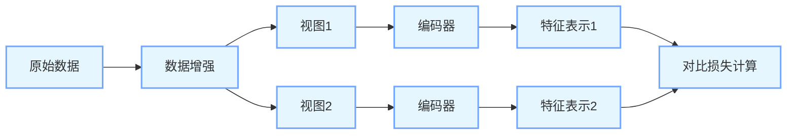

# 自监督对比学习在表示学习推理中的应用

> 关键词：自监督对比学习、表示学习、推理、特征提取、机器学习

> 摘要：本文深入探讨了自监督对比学习在表示学习推理中的应用。首先介绍了相关背景知识，包括目的、预期读者等。接着详细阐述了核心概念、算法原理、数学模型等内容，并通过Python代码进行了原理讲解。然后给出了项目实战案例，包括开发环境搭建、代码实现与解读。还分析了实际应用场景，推荐了相关的工具和资源。最后对未来发展趋势与挑战进行了总结，并提供了常见问题解答和扩展阅读参考资料。

## 1. 背景介绍 
### 1.1 目的和范围
自监督对比学习作为一种强大的无监督学习方法，在表示学习领域取得了显著的成果。本文章的目的是深入研究自监督对比学习在表示学习推理中的具体应用，详细剖析其原理、算法和实际操作步骤。范围涵盖了从理论基础到实际项目应用的各个方面，旨在为读者提供全面而深入的理解。

### 1.2 预期读者
本文预期读者包括人工智能领域的研究人员、程序员、机器学习爱好者以及相关专业的学生。对于希望深入了解自监督对比学习和表示学习推理的人士，本文将提供有价值的知识和实践指导。

### 1.3 文档结构概述
本文将按照以下结构进行阐述：首先介绍核心概念与联系，包括自监督对比学习和表示学习推理的基本原理和架构；接着讲解核心算法原理和具体操作步骤，并通过Python代码进行详细说明；然后给出数学模型和公式，并举例说明；之后进行项目实战，包括开发环境搭建、源代码实现和代码解读；再分析实际应用场景；推荐相关的工具和资源；最后总结未来发展趋势与挑战，提供常见问题解答和扩展阅读参考资料。

### 1.4 术语表
#### 1.4.1 核心术语定义
- **自监督对比学习**：一种无监督学习方法，通过对比不同样本的特征表示来学习数据的内在结构。
- **表示学习**：旨在自动学习数据的有效表示，以便于后续的任务，如分类、聚类等。
- **推理**：根据已有的知识和数据，推断出未知的信息或结论。
- **特征提取**：从原始数据中提取出具有代表性的特征。

#### 1.4.2 相关概念解释
- **无监督学习**：不需要标注数据的学习方法，通过数据的内在结构来学习模式。
- **对比损失**：用于衡量不同样本特征表示之间的差异，促使相似样本的特征表示更接近，不相似样本的特征表示更远离。

#### 1.4.3 缩略词列表
- **SSL**：Self-Supervised Learning（自监督学习）
- **CL**：Contrastive Learning（对比学习）
- **RL**：Representation Learning（表示学习）

## 2. 核心概念与联系 
### 自监督对比学习原理
自监督对比学习的核心思想是通过构建对比任务，让模型学习到数据的有用表示。具体来说，它通过对同一数据样本进行不同的增强操作，得到多个视图，然后让模型学习使得同一数据样本的不同视图的特征表示相近，不同数据样本的特征表示相远。

#### 架构示意图


### 表示学习推理原理
表示学习推理是基于学习到的特征表示进行后续的任务，如分类、预测等。通过自监督对比学习得到的特征表示具有较好的泛化能力和语义信息，能够提高推理任务的性能。

### 两者联系
自监督对比学习为表示学习提供了一种有效的学习方法，通过学习到的特征表示可以更好地进行推理任务。而推理任务的需求也反过来促进了自监督对比学习方法的不断改进和发展。

## 3. 核心算法原理 & 具体操作步骤 
### 核心算法原理
自监督对比学习的核心算法通常基于对比损失函数，最常见的是InfoNCE（Info Noise Contrastive Estimation）损失。其目标是最大化正样本对（同一数据样本的不同视图）的相似度，最小化负样本对（不同数据样本的视图）的相似度。

### Python代码实现
```python
import torch
import torch.nn as nn
import torch.nn.functional as F

class InfoNCELoss(nn.Module):
    def __init__(self, temperature=0.1):
        super(InfoNCELoss, self).__init__()
        self.temperature = temperature

    def forward(self, features):
        batch_size = features.shape[0]
        labels = torch.arange(batch_size).to(features.device)
        similarity_matrix = F.cosine_similarity(features.unsqueeze(1), features.unsqueeze(0), dim=2)
        similarity_matrix = similarity_matrix / self.temperature
        loss = F.cross_entropy(similarity_matrix, labels)
        return loss

# 示例使用
batch_size = 32
feature_dim = 128
features = torch.randn(batch_size, feature_dim)
criterion = InfoNCELoss()
loss = criterion(features)
print(f"InfoNCE Loss: {loss.item()}")
```
### 具体操作步骤
1. **数据增强**：对原始数据进行随机的增强操作，如裁剪、旋转、颜色变换等，得到多个视图。
2. **特征提取**：使用编码器对每个视图进行特征提取，得到对应的特征表示。
3. **对比损失计算**：计算同一数据样本的不同视图之间的相似度，以及不同数据样本的视图之间的相似度，使用对比损失函数进行优化。
4. **模型更新**：根据对比损失的梯度，更新编码器的参数。

## 4. 数学模型和公式 & 详细讲解 & 举例说明 
### 数学模型
InfoNCE损失的数学公式如下：
$$
L_{InfoNCE}=-\log\frac{\exp(sim(z_i, z_j)/\tau)}{\sum_{k=1}^{N}\exp(sim(z_i, z_k)/\tau)}
$$
其中，$z_i$ 和 $z_j$ 是同一数据样本的不同视图的特征表示，$sim(\cdot, \cdot)$ 是相似度函数（通常使用余弦相似度），$\tau$ 是温度参数，$N$ 是样本数量。

### 详细讲解
InfoNCE损失的目标是最大化正样本对的相似度，最小化负样本对的相似度。通过对正样本对的相似度进行指数化，并除以所有样本对的相似度指数化之和，得到一个概率值。取负对数后，就可以作为损失函数进行优化。

### 举例说明
假设我们有两个样本 $x_1$ 和 $x_2$，对每个样本进行两次增强操作，得到 $x_{11}, x_{12}, x_{21}, x_{22}$。经过编码器后，得到特征表示 $z_{11}, z_{12}, z_{21}, z_{22}$。我们希望 $z_{11}$ 和 $z_{12}$ 的相似度高，$z_{11}$ 和 $z_{21}$ 的相似度低。通过 InfoNCE 损失，模型会学习到这样的特征表示。

## 5. 项目实战：代码实际案例和详细解释说明 
### 5.1  开发环境搭建
- **操作系统**：Ubuntu 20.04
- **Python版本**：Python 3.8
- **深度学习框架**：PyTorch 1.9
- **数据处理库**：NumPy、Pandas
- **图像库**：OpenCV、PIL

### 5.2  源代码详细实现和代码解读
```python
import torch
import torch.nn as nn
import torch.optim as optim
from torchvision import datasets, transforms
from torch.utils.data import DataLoader
import numpy as np

# 定义编码器
class Encoder(nn.Module):
    def __init__(self):
        super(Encoder, self).__init__()
        self.conv1 = nn.Conv2d(3, 64, kernel_size=3, stride=1, padding=1)
        self.relu1 = nn.ReLU()
        self.pool1 = nn.MaxPool2d(kernel_size=2, stride=2)
        self.conv2 = nn.Conv2d(64, 128, kernel_size=3, stride=1, padding=1)
        self.relu2 = nn.ReLU()
        self.pool2 = nn.MaxPool2d(kernel_size=2, stride=2)
        self.fc = nn.Linear(128 * 8 * 8, 128)

    def forward(self, x):
        x = self.pool1(self.relu1(self.conv1(x)))
        x = self.pool2(self.relu2(self.conv2(x)))
        x = x.view(-1, 128 * 8 * 8)
        x = self.fc(x)
        return x

# 数据增强
transform = transforms.Compose([
    transforms.RandomResizedCrop(32),
    transforms.RandomHorizontalFlip(),
    transforms.ToTensor(),
    transforms.Normalize((0.5, 0.5, 0.5), (0.5, 0.5, 0.5))
])

# 加载数据集
train_dataset = datasets.CIFAR10(root='./data', train=True, transform=transform, download=True)
train_loader = DataLoader(train_dataset, batch_size=32, shuffle=True)

# 初始化模型、损失函数和优化器
encoder = Encoder()
criterion = InfoNCELoss()
optimizer = optim.Adam(encoder.parameters(), lr=0.001)

# 训练模型
num_epochs = 10
for epoch in range(num_epochs):
    running_loss = 0.0
    for i, (images, _) in enumerate(train_loader):
        optimizer.zero_grad()
        features = encoder(images)
        loss = criterion(features)
        loss.backward()
        optimizer.step()
        running_loss += loss.item()
    print(f'Epoch {epoch + 1}, Loss: {running_loss / len(train_loader)}')
```

### 5.3  代码解读与分析
- **编码器定义**：定义了一个简单的卷积神经网络作为编码器，用于提取图像的特征表示。
- **数据增强**：使用 `torchvision.transforms` 对图像进行随机裁剪、翻转等增强操作。
- **数据集加载**：使用 `torchvision.datasets` 加载 CIFAR-10 数据集，并使用 `DataLoader` 进行批量加载。
- **模型训练**：使用 InfoNCE 损失函数和 Adam 优化器对模型进行训练，通过多次迭代更新编码器的参数。

## 6. 实际应用场景 
### 图像分类
自监督对比学习可以用于预训练图像分类模型，通过学习到的特征表示提高模型的分类性能。在没有大量标注数据的情况下，自监督对比学习可以有效地利用未标注数据进行特征学习。

### 目标检测
在目标检测任务中，自监督对比学习可以帮助模型学习到更具判别性的特征表示，提高目标检测的准确率和召回率。

### 语义分割
对于语义分割任务，自监督对比学习可以学习到图像的语义信息，使得分割结果更加准确和精细。

### 推荐系统
在推荐系统中，自监督对比学习可以用于学习用户和物品的特征表示，提高推荐的准确性和多样性。

## 7. 工具和资源推荐
### 7.1 学习资源推荐
#### 7.1.1 书籍推荐
- 《深度学习》（Deep Learning）：Ian Goodfellow、Yoshua Bengio 和 Aaron Courville 著，全面介绍了深度学习的基本概念、算法和应用。
- 《Python深度学习》（Deep Learning with Python）：Francois Chollet 著，通过 Python 和 Keras 框架介绍深度学习的实践应用。

#### 7.1.2 在线课程
- Coursera 上的《深度学习专项课程》（Deep Learning Specialization）：由 Andrew Ng 教授授课，涵盖了深度学习的各个方面。
- edX 上的《强化学习基础》（Fundamentals of Reinforcement Learning）：介绍了强化学习的基本概念和算法。

#### 7.1.3 技术博客和网站
- Medium 上的 Towards Data Science：提供了大量关于数据科学、机器学习和人工智能的文章。
- arXiv.org：预印本服务器，提供了最新的学术研究成果。

### 7.2 开发工具框架推荐
#### 7.2.1 IDE和编辑器
- PyCharm：功能强大的 Python IDE，提供了代码编辑、调试、版本控制等功能。
- Jupyter Notebook：交互式笔记本，适合进行数据分析和模型实验。

#### 7.2.2 调试和性能分析工具
- TensorBoard：用于可视化深度学习模型的训练过程和性能指标。
- Py-Spy：用于分析 Python 代码的性能瓶颈。

#### 7.2.3 相关框架和库
- PyTorch：开源的深度学习框架，具有动态图和丰富的工具库。
- TensorFlow：Google 开发的深度学习框架，广泛应用于工业界和学术界。

### 7.3 相关论文著作推荐
#### 7.3.1 经典论文
- “A Simple Framework for Contrastive Learning of Visual Representations”（SimCLR）：提出了一种简单而有效的自监督对比学习框架。
- “Momentum Contrast for Unsupervised Visual Representation Learning”（MoCo）：引入了动量对比机制，提高了自监督学习的性能。

#### 7.3.2 最新研究成果
- 关注 arXiv.org 上的最新论文，了解自监督对比学习的最新研究进展。

#### 7.3.3 应用案例分析
- 阅读相关的学术论文和工业界的案例分享，了解自监督对比学习在实际应用中的效果和经验。

## 8. 总结：未来发展趋势与挑战
### 未来发展趋势
- **多模态融合**：将自监督对比学习应用于多模态数据，如图像、文本、音频等，实现更强大的表示学习。
- **大规模预训练**：利用更大规模的数据集和更强大的计算资源进行预训练，提高模型的泛化能力。
- **与强化学习结合**：将自监督对比学习与强化学习相结合，解决更复杂的决策问题。

### 挑战
- **计算资源需求**：自监督对比学习通常需要大量的计算资源和时间，如何降低计算成本是一个挑战。
- **对比任务设计**：设计有效的对比任务是自监督对比学习的关键，需要进一步研究和探索。
- **模型可解释性**：提高自监督对比学习模型的可解释性，有助于更好地理解模型的决策过程。

## 9. 附录：常见问题与解答
### 问题1：自监督对比学习和有监督学习有什么区别？
自监督对比学习是一种无监督学习方法，不需要标注数据，通过对比不同样本的特征表示来学习数据的内在结构。而有监督学习需要标注数据，通过最小化预测值和真实值之间的误差来学习模型。

### 问题2：如何选择合适的温度参数 $\tau$？
温度参数 $\tau$ 控制了相似度的缩放程度，通常需要通过实验来选择合适的值。一般来说，较小的 $\tau$ 会使得模型更加关注正样本对的相似度，较大的 $\tau$ 会使得模型更加平滑。

### 问题3：自监督对比学习在小数据集上的效果如何？
自监督对比学习在小数据集上也可以取得较好的效果，因为它可以利用未标注数据进行特征学习。但是，在小数据集上，需要注意过拟合的问题。

## 10. 扩展阅读 & 参考资料
- Goodfellow, I., Bengio, Y., & Courville, A. (2016). Deep Learning. MIT Press.
- Chollet, F. (2018). Deep Learning with Python. Manning Publications.
- Chen, T., Kornblith, S., Norouzi, M., & Hinton, G. (2020). A Simple Framework for Contrastive Learning of Visual Representations. arXiv preprint arXiv:2002.05709.
- He, K., Fan, H., Wu, Y., Xie, S., & Girshick, R. (2020). Momentum Contrast for Unsupervised Visual Representation Learning. In Proceedings of the IEEE/CVF Conference on Computer Vision and Pattern Recognition (pp. 9729-9738).

作者：AI天才研究院/AI Genius Institute & 禅与计算机程序设计艺术 /Zen And The Art of Computer Programming