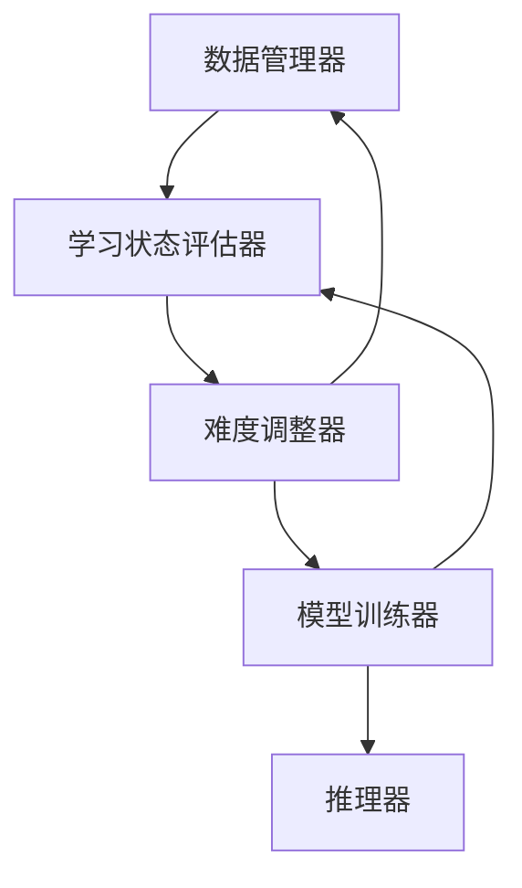

# 自适应课程学习优化AI推理的难度递进

> 关键词：自适应课程学习、AI推理、难度递进、优化策略、机器学习

> 摘要：本文聚焦于自适应课程学习在优化AI推理难度递进方面的应用。首先介绍了相关背景知识，包括目的、预期读者、文档结构和术语表。接着深入探讨了核心概念及其联系，阐述了核心算法原理并给出Python代码示例，同时讲解了数学模型和公式。通过项目实战展示了代码的实际应用和详细解释。分析了该技术在不同领域的实际应用场景，并推荐了相关的学习资源、开发工具框架和论文著作。最后总结了未来发展趋势与挑战，解答了常见问题，并提供了扩展阅读和参考资料，旨在为读者全面呈现自适应课程学习优化AI推理难度递进的相关知识和技术。

## 1. 背景介绍 
### 1.1 目的和范围
自适应课程学习优化AI推理的难度递进旨在提升AI系统在学习和推理过程中的效率与效果。传统的AI训练方法往往采用固定的数据集和训练顺序，无法根据模型的实际学习进度和能力进行动态调整。而自适应课程学习通过合理安排学习任务的难度顺序，让AI系统能够逐步适应并处理更复杂的问题，从而提高推理的准确性和泛化能力。

本文的范围涵盖了自适应课程学习的基本概念、核心算法原理、数学模型、实际应用案例以及相关的工具和资源推荐。我们将详细探讨如何利用自适应课程学习来优化AI推理的难度递进，并提供具体的代码实现和分析。

### 1.2 预期读者
本文预期读者包括AI领域的研究人员、工程师、学生以及对机器学习和人工智能感兴趣的技术爱好者。对于正在从事AI项目开发的专业人士，本文可以提供新的思路和方法来优化模型的训练过程；对于学生和初学者，本文有助于深入理解自适应课程学习的原理和应用。

### 1.3 文档结构概述
本文将按照以下结构进行组织：
1. **背景介绍**：阐述本文的目的、预期读者、文档结构和术语表。
2. **核心概念与联系**：介绍自适应课程学习、AI推理和难度递进的核心概念，并展示它们之间的联系。
3. **核心算法原理 & 具体操作步骤**：详细讲解自适应课程学习的核心算法原理，并给出Python代码示例。
4. **数学模型和公式 & 详细讲解 & 举例说明**：介绍相关的数学模型和公式，并通过具体例子进行说明。
5. **项目实战：代码实际案例和详细解释说明**：通过一个实际项目展示自适应课程学习在优化AI推理难度递进方面的应用。
6. **实际应用场景**：分析自适应课程学习在不同领域的实际应用场景。
7. **工具和资源推荐**：推荐相关的学习资源、开发工具框架和论文著作。
8. **总结：未来发展趋势与挑战**：总结自适应课程学习的未来发展趋势和面临的挑战。
9. **附录：常见问题与解答**：解答读者可能遇到的常见问题。
10. **扩展阅读 & 参考资料**：提供相关的扩展阅读和参考资料。

### 1.4 术语表
#### 1.4.1 核心术语定义
- **自适应课程学习（Adaptive Curriculum Learning）**：一种机器学习方法，通过动态调整学习任务的难度顺序，使模型能够根据自身的学习进度和能力逐步学习更复杂的任务。
- **AI推理（AI Inference）**：指AI模型在训练完成后，对新数据进行预测和决策的过程。
- **难度递进（Difficulty Progression）**：在自适应课程学习中，按照一定的规则逐步增加学习任务的难度，以提高模型的学习效果。

#### 1.4.2 相关概念解释
- **课程学习（Curriculum Learning）**：是自适应课程学习的基础，它按照预先定义的顺序安排学习任务，通常从简单任务开始，逐渐过渡到复杂任务。
- **元学习（Meta - learning）**：一种学习如何学习的方法，与自适应课程学习有一定的关联，都关注如何提高学习效率和泛化能力。

#### 1.4.3 缩略词列表
- **ML**：机器学习（Machine Learning）
- **DL**：深度学习（Deep Learning）
- **RL**：强化学习（Reinforcement Learning）

## 2. 核心概念与联系 
### 核心概念原理
#### 自适应课程学习
自适应课程学习的核心思想是根据模型当前的学习状态动态调整学习任务的难度。在训练开始时，模型通常从简单的任务入手，随着学习的进行，当模型在当前难度的任务上达到一定的性能指标时，就会逐渐引入更复杂的任务。这种方法可以避免模型在训练初期面对过于复杂的任务而导致学习困难，同时也能让模型在适当的时候挑战更高难度的任务，从而提高学习效率和泛化能力。

#### AI推理
AI推理是指AI模型在训练完成后，对新的数据进行处理和预测的过程。在推理阶段，模型需要根据输入的数据输出相应的结果，例如图像分类中的类别标签、自然语言处理中的文本生成等。推理的准确性和效率是衡量AI模型性能的重要指标。

#### 难度递进
难度递进是自适应课程学习的关键策略之一。它通过定义任务的难度级别，并按照一定的规则逐步增加难度。难度的定义可以基于多种因素，例如数据的复杂度、任务的抽象程度等。合理的难度递进可以让模型在学习过程中逐步积累知识和技能，从而更好地应对复杂的推理任务。

### 架构的文本示意图
自适应课程学习优化AI推理的难度递进架构可以描述如下：

1. **数据管理器**：负责管理训练数据，根据难度级别对数据进行分类和组织。
2. **学习状态评估器**：实时监测模型的学习状态，例如准确率、损失函数值等。
3. **难度调整器**：根据学习状态评估器的结果，动态调整学习任务的难度。
4. **模型训练器**：使用当前难度级别的数据对模型进行训练。
5. **推理器**：在模型训练完成后，对新数据进行推理。

### Mermaid流程图


该流程图展示了自适应课程学习优化AI推理难度递进的主要流程。数据管理器为模型训练提供数据，学习状态评估器监测模型的学习状态，难度调整器根据评估结果调整数据的难度，模型训练器使用调整后的数据进行训练，最后推理器对新数据进行推理。整个过程形成一个闭环，不断优化模型的性能。

## 3. 核心算法原理 & 具体操作步骤 
### 核心算法原理
自适应课程学习的核心算法通常基于模型的学习状态来动态调整学习任务的难度。一种常见的方法是使用基于性能的难度调整策略。具体来说，当模型在当前难度级别的任务上达到一定的准确率阈值时，就将学习任务的难度提高一级；如果模型的准确率低于某个阈值，则保持当前难度或降低难度。

### 具体操作步骤
1. **数据预处理**：将训练数据按照难度级别进行分类和标记。可以根据数据的复杂度、特征数量等因素来定义难度级别。
2. **初始化模型和难度级别**：选择合适的AI模型，并将初始难度级别设置为最低。
3. **训练模型**：使用当前难度级别的数据对模型进行训练。
4. **评估模型性能**：在训练过程中，定期评估模型在当前难度级别的数据上的性能，例如准确率、损失函数值等。
5. **调整难度级别**：根据模型的性能评估结果，动态调整学习任务的难度级别。如果模型的准确率高于某个阈值，则提高难度级别；如果准确率低于某个阈值，则降低难度级别或保持不变。
6. **重复步骤3 - 5**：直到达到预设的训练轮数或模型性能满足要求。
7. **推理阶段**：使用训练好的模型对新数据进行推理。

### Python源代码示例
```python
import numpy as np
from sklearn.model_selection import train_test_split
from sklearn.linear_model import LogisticRegression

# 模拟训练数据
def generate_data(num_samples, num_features, difficulty_level):
    if difficulty_level == 1:
        # 简单数据
        X = np.random.randn(num_samples, num_features)
        y = (X[:, 0] > 0).astype(int)
    elif difficulty_level == 2:
        # 中等难度数据
        X = np.random.randn(num_samples, num_features)
        y = ((X[:, 0] + X[:, 1]) > 0).astype(int)
    else:
        # 复杂数据
        X = np.random.randn(num_samples, num_features)
        y = ((X[:, 0] * X[:, 1] + X[:, 2]) > 0).astype(int)
    return X, y

# 自适应课程学习函数
def adaptive_curriculum_learning(num_samples, num_features, max_difficulty, accuracy_threshold):
    current_difficulty = 1
    model = LogisticRegression()

    for _ in range(10):  # 训练轮数
        X, y = generate_data(num_samples, num_features, current_difficulty)
        X_train, X_test, y_train, y_test = train_test_split(X, y, test_size=0.2)

        model.fit(X_train, y_train)
        accuracy = model.score(X_test, y_test)

        if accuracy > accuracy_threshold:
            if current_difficulty < max_difficulty:
                current_difficulty += 1
        elif accuracy < 0.5:
            if current_difficulty > 1:
                current_difficulty -= 1

    return model

# 主函数
if __name__ == "__main__":
    num_samples = 1000
    num_features = 5
    max_difficulty = 3
    accuracy_threshold = 0.8

    trained_model = adaptive_curriculum_learning(num_samples, num_features, max_difficulty, accuracy_threshold)

    # 模拟新数据进行推理
    new_X = np.random.randn(10, num_features)
    predictions = trained_model.predict(new_X)
    print("Predictions:", predictions)
```

### 代码解释
1. **generate_data函数**：根据不同的难度级别生成模拟训练数据。难度级别越高，数据的复杂度越高。
2. **adaptive_curriculum_learning函数**：实现自适应课程学习的核心逻辑。在训练过程中，根据模型的准确率动态调整学习任务的难度级别。
3. **主函数**：调用自适应课程学习函数进行模型训练，并使用训练好的模型对新数据进行推理。

## 4. 数学模型和公式 & 详细讲解 & 举例说明 
### 数学模型和公式
#### 准确率计算
在自适应课程学习中，模型的准确率是评估其性能的重要指标。准确率的计算公式为：

$$Accuracy = \frac{TP + TN}{TP + TN + FP + FN}$$

其中，$TP$ 表示真正例（True Positives），即模型正确预测为正类的样本数；$TN$ 表示真反例（True Negatives），即模型正确预测为反类的样本数；$FP$ 表示假正例（False Positives），即模型错误预测为正类的样本数；$FN$ 表示假反例（False Negatives），即模型错误预测为反类的样本数。

#### 难度调整策略
假设当前难度级别为 $d$，模型在当前难度级别的数据上的准确率为 $A_d$，准确率阈值为 $A_{th}$。难度调整策略可以表示为：

$$
d_{new} = 
\begin{cases}
d + 1, & \text{if } A_d > A_{th} \text{ and } d < d_{max}\\
d - 1, & \text{if } A_d < A_{low} \text{ and } d > 1\\
d, & \text{otherwise}
\end{cases}
$$

其中，$d_{new}$ 表示调整后的难度级别，$d_{max}$ 表示最大难度级别，$A_{low}$ 表示较低的准确率阈值。

### 详细讲解
#### 准确率计算
准确率反映了模型在分类任务中正确预测的比例。在自适应课程学习中，通过定期计算模型的准确率，可以了解模型在当前难度级别的数据上的学习效果。如果准确率较高，说明模型已经较好地掌握了当前难度的任务，可以考虑提高难度；如果准确率较低，说明模型可能还需要更多的训练或者降低难度。

#### 难度调整策略
难度调整策略根据模型的准确率动态调整学习任务的难度级别。当模型的准确率高于阈值时，提高难度级别，让模型挑战更复杂的任务；当模型的准确率低于较低的阈值时，降低难度级别，让模型有更多的机会学习简单的任务，巩固基础。

### 举例说明
假设我们有一个二分类问题，使用自适应课程学习进行模型训练。初始难度级别 $d = 1$，最大难度级别 $d_{max} = 3$，准确率阈值 $A_{th} = 0.8$，较低的准确率阈值 $A_{low} = 0.5$。

在第一轮训练中，模型在难度级别 $d = 1$ 的数据上的准确率 $A_1 = 0.9$。由于 $A_1 > A_{th}$ 且 $d < d_{max}$，所以将难度级别提高到 $d_{new} = 2$。

在第二轮训练中，模型在难度级别 $d = 2$ 的数据上的准确率 $A_2 = 0.4$。由于 $A_2 < A_{low}$ 且 $d > 1$，所以将难度级别降低到 $d_{new} = 1$。

通过不断地调整难度级别，模型可以逐步适应不同难度的任务，提高学习效果。

## 5. 项目实战：代码实际案例和详细解释说明 
### 5.1  开发环境搭建
为了实现自适应课程学习优化AI推理的难度递进，我们可以使用Python语言和一些常见的机器学习库。以下是开发环境的搭建步骤：

1. **安装Python**：建议使用Python 3.7及以上版本。可以从Python官方网站（https://www.python.org/downloads/）下载并安装。
2. **安装必要的库**：使用以下命令安装所需的库：
```bash
pip install numpy scikit-learn
```

### 5.2  源代码详细实现和代码解读
以下是一个更完整的项目实战代码示例，用于图像分类任务：

```python
import numpy as np
import tensorflow as tf
from tensorflow.keras.datasets import cifar10
from tensorflow.keras.models import Sequential
from tensorflow.keras.layers import Conv2D, MaxPooling2D, Flatten, Dense
from sklearn.model_selection import train_test_split

# 数据预处理
def preprocess_data(X, y):
    X = X.astype('float32') / 255.0
    y = tf.keras.utils.to_categorical(y, 10)
    return X, y

# 生成不同难度级别的数据
def generate_difficulty_data(X, y, difficulty_level):
    if difficulty_level == 1:
        # 简单数据：只选择前两个类别
        indices = np.where(np.logical_or(y.argmax(axis=1) == 0, y.argmax(axis=1) == 1))[0]
        X_subset = X[indices]
        y_subset = y[indices]
    elif difficulty_level == 2:
        # 中等难度数据：选择前五个类别
        indices = np.where(y.argmax(axis=1) < 5)[0]
        X_subset = X[indices]
        y_subset = y[indices]
    else:
        # 复杂数据：使用所有类别
        X_subset = X
        y_subset = y
    return X_subset, y_subset

# 构建模型
def build_model():
    model = Sequential([
        Conv2D(32, (3, 3), activation='relu', input_shape=(32, 32, 3)),
        MaxPooling2D((2, 2)),
        Conv2D(64, (3, 3), activation='relu'),
        MaxPooling2D((2, 2)),
        Flatten(),
        Dense(64, activation='relu'),
        Dense(10, activation='softmax')
    ])
    model.compile(optimizer='adam',
                  loss='categorical_crossentropy',
                  metrics=['accuracy'])
    return model

# 自适应课程学习函数
def adaptive_curriculum_learning(X, y, max_difficulty, accuracy_threshold):
    current_difficulty = 1
    model = build_model()

    for _ in range(10):  # 训练轮数
        X_subset, y_subset = generate_difficulty_data(X, y, current_difficulty)
        X_train, X_test, y_train, y_test = train_test_split(X_subset, y_subset, test_size=0.2)

        model.fit(X_train, y_train, epochs=1, batch_size=32, verbose=1)
        _, accuracy = model.evaluate(X_test, y_test, verbose=0)

        if accuracy > accuracy_threshold:
            if current_difficulty < max_difficulty:
                current_difficulty += 1
        elif accuracy < 0.5:
            if current_difficulty > 1:
                current_difficulty -= 1

    return model

# 主函数
if __name__ == "__main__":
    # 加载CIFAR-10数据集
    (X_train, y_train), (X_test, y_test) = cifar10.load_data()
    X_train, y_train = preprocess_data(X_train, y_train)
    X_test, y_test = preprocess_data(X_test, y_test)

    max_difficulty = 3
    accuracy_threshold = 0.8

    trained_model = adaptive_curriculum_learning(X_train, y_train, max_difficulty, accuracy_threshold)

    # 在测试集上进行推理
    _, test_accuracy = trained_model.evaluate(X_test, y_test, verbose=0)
    print("Test Accuracy:", test_accuracy)
```

### 代码解读
1. **preprocess_data函数**：对图像数据进行预处理，将像素值归一化到0 - 1之间，并将标签进行one - hot编码。
2. **generate_difficulty_data函数**：根据不同的难度级别生成不同的数据集。难度级别越高，数据集中包含的类别越多。
3. **build_model函数**：构建一个简单的卷积神经网络模型，用于图像分类任务。
4. **adaptive_curriculum_learning函数**：实现自适应课程学习的核心逻辑。在训练过程中，根据模型的准确率动态调整学习任务的难度级别。
5. **主函数**：加载CIFAR - 10数据集，调用自适应课程学习函数进行模型训练，并在测试集上进行推理。

### 5.3  代码解读与分析
#### 数据处理
通过`generate_difficulty_data`函数，我们可以根据难度级别动态选择不同的数据集。在训练初期，使用简单的数据集，让模型快速掌握基本的特征和模式；随着训练的进行，逐渐引入更复杂的数据集，提高模型的泛化能力。

#### 模型训练
在每个训练轮次中，使用当前难度级别的数据集对模型进行训练，并评估模型的准确率。根据准确率的结果，动态调整难度级别。这种方式可以让模型在合适的难度下进行学习，避免过拟合或欠拟合的问题。

#### 推理阶段
在模型训练完成后，使用测试集对模型进行评估。通过比较不同训练策略下的测试准确率，可以验证自适应课程学习在优化AI推理难度递进方面的有效性。

## 6. 实际应用场景 
### 图像识别
在图像识别领域，自适应课程学习可以帮助模型更好地处理不同难度的图像。例如，在训练初期，模型可以从简单的图像分类任务开始，如区分猫和狗的图像；随着训练的进行，逐渐引入更复杂的任务，如识别不同品种的猫和狗。通过动态调整学习任务的难度，模型可以逐步提高对图像特征的理解和识别能力。

### 自然语言处理
在自然语言处理中，自适应课程学习可以应用于文本分类、情感分析、机器翻译等任务。例如，在文本分类任务中，模型可以先从简单的二分类任务开始，如区分正面和负面评论；然后逐渐过渡到多分类任务，如区分不同主题的新闻文章。这种难度递进的学习方式可以让模型更好地理解语言的语义和结构。

### 机器人学习
在机器人学习中，自适应课程学习可以帮助机器人逐步掌握不同难度的任务。例如，机器人可以先学习简单的运动控制任务，如移动和抓取；然后逐渐学习更复杂的任务，如导航和协作。通过动态调整学习任务的难度，机器人可以更高效地学习和适应不同的环境。

### 游戏AI
在游戏AI领域，自适应课程学习可以让游戏AI逐步提高其游戏水平。例如，在棋类游戏中，AI可以先从简单的规则学习开始，如走法和吃子规则；然后逐渐学习更复杂的策略，如布局和攻防策略。通过动态调整学习任务的难度，游戏AI可以不断提升其竞争力。

## 7. 工具和资源推荐
### 7.1 学习资源推荐
#### 7.1.1 书籍推荐
- 《机器学习》（周志华）：全面介绍了机器学习的基本概念、算法和应用，是机器学习领域的经典教材。
- 《深度学习》（Ian Goodfellow、Yoshua Bengio和Aaron Courville）：深入探讨了深度学习的理论和实践，是深度学习领域的权威著作。
- 《人工智能：一种现代的方法》（Stuart Russell和Peter Norvig）：涵盖了人工智能的各个方面，包括搜索算法、知识表示、机器学习等。

#### 7.1.2 在线课程
- Coursera上的“机器学习”课程（Andrew Ng教授）：是一门非常经典的机器学习入门课程，通过视频讲解、编程作业等方式让学生掌握机器学习的基本概念和算法。
- edX上的“深度学习专业课程”：由多个模块组成，包括深度学习基础、卷积神经网络、循环神经网络等，适合深入学习深度学习的学生。
- 哔哩哔哩上有许多关于机器学习和人工智能的免费视频教程，如李宏毅教授的机器学习课程，讲解生动易懂。

#### 7.1.3 技术博客和网站
- Medium：有许多AI领域的专家和爱好者分享他们的技术文章和经验，是获取最新技术动态的好地方。
- Towards Data Science：专注于数据科学和机器学习领域，提供了大量的技术文章和案例分析。
- arXiv：是一个预印本服务器，包含了许多最新的AI研究论文，可以及时了解该领域的前沿研究成果。

### 7.2 开发工具框架推荐
#### 7.2.1 IDE和编辑器
- PyCharm：是一款专业的Python集成开发环境，提供了丰富的代码编辑、调试和版本控制功能，适合Python开发者。
- Jupyter Notebook：是一个交互式的开发环境，可以在浏览器中编写和运行代码，同时可以添加文本说明和可视化结果，非常适合数据分析和机器学习项目。
- Visual Studio Code：是一款轻量级的代码编辑器，支持多种编程语言和插件，具有丰富的扩展功能，可用于AI开发。

#### 7.2.2 调试和性能分析工具
- TensorBoard：是TensorFlow提供的可视化工具，可以用于监控模型的训练过程、可视化模型结构和分析性能指标。
- Py-Spy：是一个用于Python代码性能分析的工具，可以帮助开发者找出代码中的性能瓶颈。
- cProfile：是Python标准库中的性能分析工具，可以统计函数的调用次数和执行时间，帮助开发者优化代码性能。

#### 7.2.3 相关框架和库
- TensorFlow：是一个开源的机器学习框架，提供了丰富的工具和库，支持深度学习模型的构建、训练和部署。
- PyTorch：是另一个流行的深度学习框架，具有动态图的特点，易于使用和调试，在学术界和工业界都有广泛的应用。
- Scikit-learn：是一个用于机器学习的Python库，提供了多种机器学习算法和工具，适合初学者进行机器学习实验和项目开发。

### 7.3 相关论文著作推荐
#### 7.3.1 经典论文
- "Curriculum Learning"（Yoshua Bengio等人）：首次提出了课程学习的概念，为自适应课程学习的研究奠定了基础。
- "Adaptive Curriculum Learning for Neural Networks"（Marc G. Bellemare等人）：深入探讨了自适应课程学习在神经网络中的应用，提出了一些具体的算法和策略。

#### 7.3.2 最新研究成果
- 在arXiv和顶级学术会议（如NeurIPS、ICML、CVPR等）上可以找到许多关于自适应课程学习的最新研究论文，了解该领域的最新进展和趋势。

#### 7.3.3 应用案例分析
- 一些知名企业和研究机构会发布关于自适应课程学习在实际项目中的应用案例，例如谷歌、微软等公司的技术博客，这些案例可以帮助我们更好地理解自适应课程学习的实际应用。

## 8. 总结：未来发展趋势与挑战
### 未来发展趋势
#### 与强化学习的结合
自适应课程学习与强化学习的结合将是未来的一个重要发展方向。强化学习可以通过智能体与环境的交互来学习最优策略，而自适应课程学习可以为强化学习提供更合理的学习任务顺序，从而提高强化学习的效率和性能。

#### 跨领域应用
自适应课程学习将在更多的领域得到应用，如医疗保健、金融、交通等。通过根据不同领域的特点和需求，设计合适的难度递进策略，可以帮助AI模型更好地解决实际问题。

#### 自动化难度调整
未来的自适应课程学习系统将更加自动化，能够根据模型的学习状态自动调整难度级别，而无需人工干预。这将大大提高AI模型的训练效率和智能化水平。

### 挑战
#### 难度定义的主观性
难度的定义往往具有一定的主观性，不同的人可能对同一任务的难度有不同的看法。如何客观、准确地定义任务的难度是自适应课程学习面临的一个挑战。

#### 计算资源的需求
随着任务难度的增加，模型的训练和推理需要更多的计算资源。如何在有限的计算资源下实现高效的自适应课程学习是一个亟待解决的问题。

#### 模型的泛化能力
虽然自适应课程学习可以提高模型在训练数据上的性能，但如何确保模型在未见过的数据上也具有良好的泛化能力是一个挑战。需要进一步研究和改进自适应课程学习的算法和策略。

## 9. 附录：常见问题与解答
### 1. 自适应课程学习和传统课程学习有什么区别？
传统课程学习通常按照预先定义的顺序安排学习任务，而自适应课程学习可以根据模型的学习状态动态调整学习任务的难度。自适应课程学习更加灵活，能够更好地适应模型的学习进度和能力。

### 2. 如何确定难度级别和准确率阈值？
难度级别和准确率阈值的确定需要根据具体的任务和数据集进行实验和调整。一般来说，可以先进行一些初步的实验，观察模型在不同难度级别和准确率阈值下的性能，然后根据实验结果进行优化。

### 3. 自适应课程学习适用于所有的AI模型吗？
自适应课程学习适用于大多数的AI模型，包括机器学习模型和深度学习模型。但不同的模型可能需要不同的难度调整策略和算法，需要根据具体情况进行选择和优化。

### 4. 自适应课程学习会增加模型的训练时间吗？
在某些情况下，自适应课程学习可能会增加模型的训练时间，因为模型需要在不同难度级别的数据上进行多次训练。但从整体上看，自适应课程学习可以提高模型的学习效率和泛化能力，减少过拟合和欠拟合的问题，从而在长期内节省训练时间和计算资源。

## 10. 扩展阅读 & 参考资料
### 扩展阅读
- 《神经网络与深度学习》（邱锡鹏）：深入介绍了神经网络和深度学习的原理、算法和应用，适合进一步深入学习相关知识。
- 《强化学习：原理与Python实现》（智能系统实验室）：详细讲解了强化学习的基本概念、算法和实现方法，对于理解自适应课程学习与强化学习的结合有很大帮助。

### 参考资料
- 周志华. 机器学习[M]. 清华大学出版社, 2016.
- Ian Goodfellow, Yoshua Bengio, Aaron Courville. 深度学习[M]. 人民邮电出版社, 2017.
- Stuart Russell, Peter Norvig. 人工智能：一种现代的方法[M]. 清华大学出版社, 2006.
- Yoshua Bengio, Jérôme Louradour, Ronan Collobert, Jason Weston. Curriculum Learning[J]. Journal of Machine Learning Research, 2009, 15: 107-129.
- Marc G. Bellemare, Sriram Srinivasan, Georg Ostrovski, Tom Schaul, David Saxton, Remi Munos. Adaptive Curriculum Learning for Neural Networks[C]. Advances in Neural Information Processing Systems, 2016: 4331-4339.

作者：AI天才研究院/AI Genius Institute & 禅与计算机程序设计艺术 /Zen And The Art of Computer Programming