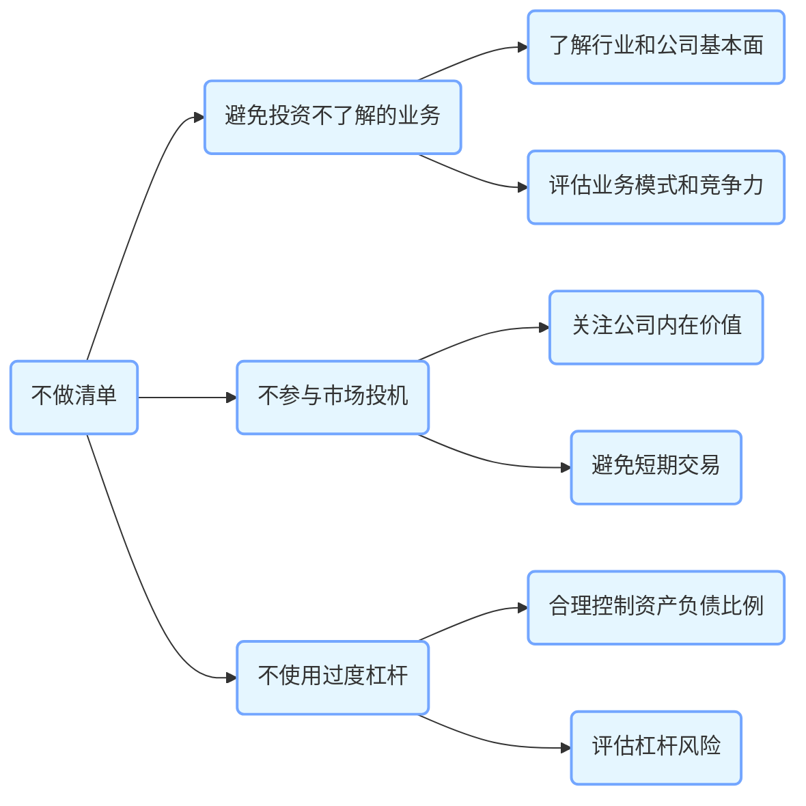

# 芒格的"不做"清单：避免常见投资陷阱

> 关键词：芒格、不做清单、投资陷阱、价值投资、风险规避

> 摘要：本文围绕芒格的“不做”清单展开，深入剖析其在投资领域对于避免常见陷阱的重要意义。详细介绍了清单中各项原则的核心概念与联系，阐述了背后的核心算法原理和操作步骤，通过数学模型和公式进行理论支持，并结合实际案例进行说明。同时探讨了这些原则在不同投资场景中的应用，推荐了相关的学习工具、资源和论文著作。最后总结了投资领域的未来发展趋势与挑战，为投资者提供全面且深入的投资指导。

## 1. 背景介绍 
### 1.1 目的和范围
查理·芒格是投资界的传奇人物，他的智慧和经验对众多投资者产生了深远影响。“不做”清单是芒格投资理念的重要组成部分，其目的在于帮助投资者识别并规避那些可能导致投资失败的常见陷阱。本文的范围将涵盖芒格“不做”清单的各个方面，包括核心概念、算法原理、数学模型以及实际应用等，旨在为投资者提供一套系统的方法来避免投资失误。

### 1.2 预期读者
本文预期读者主要包括各类投资者，无论是初涉投资领域的新手，还是具有一定经验的专业投资者。对于新手投资者，本文可以作为入门指南，帮助他们建立正确的投资观念和风险意识；对于专业投资者，本文可以提供新的视角和思路，进一步完善他们的投资策略。此外，对投资理论和方法感兴趣的研究人员和学者也可以从本文中获取有价值的信息。

### 1.3 文档结构概述
本文将按照以下结构进行组织：首先介绍芒格“不做”清单的背景和相关术语；接着阐述清单中各项原则的核心概念与联系，并通过流程图进行直观展示；然后详细讲解核心算法原理和具体操作步骤，结合Python代码进行说明；再通过数学模型和公式对投资决策进行分析，并举例说明；之后通过实际案例展示如何应用“不做”清单进行投资；探讨其在不同场景中的实际应用；推荐相关的学习工具、资源和论文著作；最后总结投资领域的未来发展趋势与挑战，并提供常见问题的解答和扩展阅读的参考资料。

### 1.4 术语表
#### 1.4.1 核心术语定义
- **不做清单**：芒格提出的一系列投资中应避免的行为和决策原则，旨在帮助投资者减少犯错的概率。
- **价值投资**：一种基于对公司内在价值评估的投资策略，投资者通过分析公司的财务状况、行业前景等因素，寻找被低估的股票进行投资。
- **投资陷阱**：可能导致投资者遭受损失的各种情况，如市场泡沫、财务造假、过度杠杆等。

#### 1.4.2 相关概念解释
- **内在价值**：公司的真实价值，通常通过对公司未来现金流的折现计算得出。内在价值是价值投资的核心概念，投资者通过比较股票价格与内在价值来判断是否具有投资价值。
- **安全边际**：股票价格低于其内在价值的幅度。安全边际为投资者提供了一定的缓冲，降低了投资风险。

#### 1.4.3 缩略词列表
- **PE**：市盈率，即股票价格与每股收益的比率，用于衡量股票的估值水平。
- **PB**：市净率，即股票价格与每股净资产的比率，反映了市场对公司净资产的估值。

## 2. 核心概念与联系 

芒格的“不做”清单包含了多个核心概念，这些概念相互关联，共同构成了一个完整的投资风险规避体系。以下是一些主要的核心概念及其联系：

### 核心概念原理
- **避免投资不了解的业务**：投资者应该只投资于自己熟悉和理解的行业和公司。如果对业务不了解，就无法准确评估其风险和价值，容易陷入投资陷阱。例如，一个对科技行业缺乏了解的投资者，如果盲目投资一家新兴的科技公司，可能会因为对技术发展趋势和市场竞争情况的误判而遭受损失。
- **不参与市场投机**：市场投机往往是基于短期的市场波动和情绪进行交易，而不是基于公司的内在价值。投机行为容易导致投资者在市场泡沫中追高买入，在市场下跌时恐慌卖出，从而造成损失。芒格主张投资者应该关注公司的长期价值，避免参与短期的投机活动。
- **不使用过度杠杆**：杠杆可以放大投资收益，但同时也会放大投资风险。如果使用过度杠杆，一旦市场走势不利，投资者可能会面临巨大的损失甚至破产。因此，芒格建议投资者谨慎使用杠杆，保持合理的资产负债比例。

### 架构的文本示意图
```plaintext
不做清单
|-- 避免投资不了解的业务
|   |-- 了解行业和公司基本面
|   |-- 评估业务模式和竞争力
|
|-- 不参与市场投机
|   |-- 关注公司内在价值
|   |-- 避免短期交易
|
|-- 不使用过度杠杆
|   |-- 合理控制资产负债比例
|   |-- 评估杠杆风险
```

### Mermaid 流程图


## 3. 核心算法原理 & 具体操作步骤 

### 核心算法原理
芒格的“不做”清单虽然不是严格意义上的算法，但可以通过一些逻辑判断来实现其核心思想。以下是一个简单的算法思路：

- **输入**：投资目标信息，包括行业、公司基本面、市场情况等。
- **处理**：
    - 判断是否了解投资目标所在的行业和公司业务，如果不了解，则拒绝投资。
    - 判断投资是否基于短期投机，如果是，则拒绝投资。
    - 判断是否需要使用杠杆，如果需要，评估杠杆的合理性和风险，如果风险过高，则拒绝使用杠杆。
- **输出**：投资决策结果（接受或拒绝投资）。

### 具体操作步骤
#### 步骤 1：收集投资目标信息
投资者需要收集投资目标的相关信息，包括行业报告、公司财务报表、市场动态等。可以通过财经媒体、证券交易所网站、专业研究机构等渠道获取这些信息。

#### 步骤 2：评估对业务的了解程度
投资者需要对投资目标所在的行业和公司业务进行深入分析，判断自己是否了解该业务的商业模式、竞争优势、市场前景等。可以通过以下几个方面进行评估：
- 行业知识：了解行业的发展趋势、竞争格局、政策环境等。
- 公司基本面：分析公司的财务状况、管理层能力、产品或服务特点等。
- 业务模式：理解公司的盈利模式、运营流程、客户群体等。

#### 步骤 3：判断是否为投机行为
投资者需要判断自己的投资动机是否基于短期投机。可以通过以下几个方面进行判断：
- 投资期限：如果投资期限较短，通常是为了获取短期差价，可能属于投机行为。
- 投资依据：如果投资依据主要是市场热点、传闻或情绪，而不是公司的内在价值，可能属于投机行为。

#### 步骤 4：评估杠杆使用的合理性
如果投资者考虑使用杠杆，需要评估杠杆的合理性和风险。可以通过以下几个方面进行评估：
- 资产负债比例：计算投资组合的资产负债比例，判断是否在合理范围内。
- 杠杆倍数：确定使用的杠杆倍数，评估其对投资收益和风险的影响。
- 风险承受能力：考虑自己的风险承受能力，判断是否能够承受杠杆带来的潜在损失。

### Python 源代码实现
```python
def investment_decision(industry_understanding, is_speculation, leverage_ratio):
    # 判断是否了解业务
    if not industry_understanding:
        return "拒绝投资：不了解业务"
    
    # 判断是否为投机行为
    if is_speculation:
        return "拒绝投资：参与市场投机"
    
    # 判断杠杆使用是否合理
    if leverage_ratio > 2:  # 假设合理杠杆比例不超过2
        return "拒绝投资：使用过度杠杆"
    
    return "接受投资"

# 示例输入
industry_understanding = True
is_speculation = False
leverage_ratio = 1.5

# 进行投资决策
decision = investment_decision(industry_understanding, is_speculation, leverage_ratio)
print(decision)
```

在上述代码中，`investment_decision` 函数接受三个参数：`industry_understanding` 表示是否了解业务，`is_speculation` 表示是否为投机行为，`leverage_ratio` 表示杠杆比例。函数根据这些参数进行逻辑判断，返回投资决策结果。

## 4. 数学模型和公式 & 详细讲解 & 举例说明 

### 内在价值评估模型
内在价值是价值投资的核心概念，常用的评估模型是现金流折现模型（DCF）。该模型的基本思想是将公司未来的现金流折现到当前，以确定公司的内在价值。

#### 数学公式
$$V = \sum_{t=1}^{n} \frac{CF_t}{(1 + r)^t} + \frac{TV}{(1 + r)^n}$$

其中：
- $V$ 表示公司的内在价值
- $CF_t$ 表示第 $t$ 期的现金流
- $r$ 表示折现率
- $n$ 表示预测期数
- $TV$ 表示终值

#### 详细讲解
- **现金流预测**：需要对公司未来的现金流进行预测，通常可以根据公司的历史财务数据、行业发展趋势等因素进行估算。
- **折现率选择**：折现率反映了投资者对投资回报的要求，通常可以使用资本资产定价模型（CAPM）来确定。
- **终值计算**：终值是指预测期结束后公司的价值，通常可以使用永续增长模型来计算。

#### 举例说明
假设一家公司预计未来三年的现金流分别为 100 万元、120 万元和 150 万元，预测期结束后公司的现金流将以 3% 的增长率永续增长。折现率为 10%。

首先计算预测期内的现金流现值：
$$PV_1 = \frac{100}{(1 + 0.1)^1} = 90.91 \text{ 万元}$$
$$PV_2 = \frac{120}{(1 + 0.1)^2} = 99.17 \text{ 万元}$$
$$PV_3 = \frac{150}{(1 + 0.1)^3} = 112.69 \text{ 万元}$$

然后计算终值：
$$TV = \frac{150 \times (1 + 0.03)}{0.1 - 0.03} = 2207.14 \text{ 万元}$$

终值的现值为：
$$PV_{TV} = \frac{2207.14}{(1 + 0.1)^3} = 1656.48 \text{ 万元}$$

最后计算公司的内在价值：
$$V = 90.91 + 99.17 + 112.69 + 1656.48 = 1959.25 \text{ 万元}$$

### 安全边际计算
安全边际是指股票价格低于其内在价值的幅度，计算公式为：

#### 数学公式
$$安全边际 = \frac{内在价值 - 股票价格}{内在价值} \times 100\%$$

#### 详细讲解
安全边际为投资者提供了一定的缓冲，降低了投资风险。当安全边际较大时，说明股票价格相对较低，投资风险较小；当安全边际较小时，说明股票价格相对较高，投资风险较大。

#### 举例说明
假设某公司的内在价值为 200 元，当前股票价格为 150 元，则安全边际为：
$$安全边际 = \frac{200 - 150}{200} \times 100\% = 25\%$$

这意味着股票价格低于内在价值 25%，投资者在购买该股票时具有一定的安全边际。

## 5. 项目实战：代码实际案例和详细解释说明 

### 5.1  开发环境搭建
为了实现基于芒格“不做”清单的投资决策系统，我们需要搭建一个开发环境。以下是具体步骤：

#### 步骤 1：安装 Python
可以从 Python 官方网站（https://www.python.org/downloads/）下载并安装 Python 3.x 版本。

#### 步骤 2：安装必要的库
我们需要安装一些必要的 Python 库，如 `pandas`、`numpy` 等。可以使用以下命令进行安装：
```sh
pip install pandas numpy
```

### 5.2  源代码详细实现和代码解读
以下是一个完整的基于芒格“不做”清单的投资决策系统的 Python 代码示例：

```python
import pandas as pd

# 定义投资决策函数
def investment_decision(industry_understanding, is_speculation, leverage_ratio, intrinsic_value, stock_price):
    # 判断是否了解业务
    if not industry_understanding:
        return "拒绝投资：不了解业务"
    
    # 判断是否为投机行为
    if is_speculation:
        return "拒绝投资：参与市场投机"
    
    # 判断杠杆使用是否合理
    if leverage_ratio > 2:  # 假设合理杠杆比例不超过2
        return "拒绝投资：使用过度杠杆"
    
    # 计算安全边际
    safety_margin = (intrinsic_value - stock_price) / intrinsic_value
    if safety_margin < 0.2:  # 假设安全边际要求不低于20%
        return "拒绝投资：安全边际不足"
    
    return "接受投资"

# 模拟投资数据
data = {
    "公司名称": ["A公司", "B公司", "C公司"],
    "是否了解业务": [True, False, True],
    "是否为投机行为": [False, False, True],
    "杠杆比例": [1.5, 1.2, 2.5],
    "内在价值": [200, 150, 300],
    "股票价格": [150, 160, 280]
}

df = pd.DataFrame(data)

# 进行投资决策
df["投资决策"] = df.apply(lambda row: investment_decision(
    row["是否了解业务"],
    row["是否为投机行为"],
    row["杠杆比例"],
    row["内在价值"],
    row["股票价格"]
), axis=1)

# 输出结果
print(df)
```

### 代码解读与分析
#### 代码结构
- **导入必要的库**：导入 `pandas` 库用于数据处理。
- **定义投资决策函数**：`investment_decision` 函数根据芒格“不做”清单的原则进行投资决策，包括判断是否了解业务、是否为投机行为、杠杆使用是否合理以及安全边际是否充足。
- **模拟投资数据**：使用 `pandas` 的 `DataFrame` 模拟投资数据，包括公司名称、是否了解业务、是否为投机行为、杠杆比例、内在价值和股票价格等信息。
- **进行投资决策**：使用 `apply` 方法对每一行数据应用 `investment_decision` 函数，得到投资决策结果，并将结果添加到 `DataFrame` 中。
- **输出结果**：打印包含投资决策结果的 `DataFrame`。

#### 结果分析
通过运行上述代码，我们可以得到每个公司的投资决策结果。根据芒格“不做”清单的原则，不了解业务、参与市场投机、使用过度杠杆或安全边际不足的公司将被拒绝投资。这样可以帮助投资者筛选出符合投资要求的公司，降低投资风险。

## 6. 实际应用场景 
### 股票投资
在股票投资中，芒格的“不做”清单可以帮助投资者避免一些常见的陷阱。例如，投资者在选择股票时，应该首先评估自己是否了解该公司所在的行业和业务，如果不了解，则应该避免投资。同时，投资者应该关注公司的内在价值，避免参与短期的投机交易。此外，投资者在使用杠杆时应该谨慎，合理控制资产负债比例。

### 基金投资
在基金投资中，投资者也可以运用芒格的“不做”清单。例如，投资者应该了解基金的投资策略和投资标的，如果对基金的投资方向不了解，则应该避免投资。同时，投资者应该避免追逐短期业绩排名靠前的基金，因为这些基金可能是由于市场热点或短期运气而表现出色，并不一定具有长期投资价值。此外，投资者在投资基金时也应该注意杠杆的使用，避免使用过度杠杆的基金产品。

### 房地产投资
在房地产投资中，芒格的“不做”清单同样具有指导意义。投资者在选择房地产项目时，应该了解当地的房地产市场情况、项目的地理位置、开发商的信誉等信息，如果对这些方面不了解，则应该谨慎投资。同时，投资者应该避免参与房地产市场的投机炒作，关注房地产的实际使用价值和租金回报率。此外，投资者在使用杠杆进行房地产投资时，应该充分评估杠杆风险，合理控制负债水平。

## 7. 工具和资源推荐
### 7.1 学习资源推荐
#### 7.1.1 书籍推荐
- 《穷查理宝典：查理·芒格的智慧箴言录》：这本书收录了芒格的演讲、文章和名言，全面展现了他的投资理念、思维方式和人生智慧。
- 《聪明的投资者》：本杰明·格雷厄姆的经典著作，是价值投资的奠基之作，对芒格的投资理念产生了深远影响。
- 《证券分析》：同样是格雷厄姆的著作，详细介绍了证券分析的方法和技巧，是投资者必备的参考书。

#### 7.1.2 在线课程
- Coursera 上的“投资学原理”：该课程由知名大学的教授授课，系统介绍了投资学的基本原理和方法。
- edX 上的“价值投资入门”：课程聚焦于价值投资的核心概念和实践方法，适合初学者学习。

#### 7.1.3 技术博客和网站
- 雪球网：国内知名的投资社区，提供股票、基金等投资产品的分析和讨论，投资者可以在这里交流投资经验和观点。
- Seeking Alpha：国外知名的金融分析网站，提供全球范围内的股票分析、市场评论等内容。

### 7.2 开发工具框架推荐
#### 7.2.1 IDE和编辑器
- PyCharm：一款专业的 Python 集成开发环境，具有代码编辑、调试、版本控制等功能，适合开发基于 Python 的投资决策系统。
- Jupyter Notebook：一种交互式的开发环境，支持代码、文本、图表等多种形式的展示，方便进行数据分析和可视化。

#### 7.2.2 调试和性能分析工具
- PDB：Python 自带的调试工具，可以帮助开发者定位代码中的问题。
- cProfile：Python 的性能分析工具，可以分析代码的运行时间和资源消耗情况。

#### 7.2.3 相关框架和库
- Pandas：用于数据处理和分析的 Python 库，提供了高效的数据结构和数据操作方法。
- Numpy：用于科学计算的 Python 库，提供了多维数组和数学函数等功能。

### 7.3 相关论文著作推荐
#### 7.3.1 经典论文
- 《有效市场假说》：该论文提出了有效市场假说，对金融市场的定价机制进行了深入探讨。
- 《资本资产定价模型》：介绍了资本资产定价模型（CAPM），用于计算资产的预期收益率。

#### 7.3.2 最新研究成果
- 关于行为金融学的研究：行为金融学结合了心理学和金融学的理论，研究投资者的行为偏差和市场异常现象。
- 关于量化投资的研究：量化投资利用数学模型和计算机技术进行投资决策，是近年来投资领域的热门研究方向。

#### 7.3.3 应用案例分析
- 巴菲特的投资案例分析：巴菲特是价值投资的代表人物，他的投资案例可以为投资者提供宝贵的经验和启示。
- 芒格的投资案例分析：通过分析芒格的投资决策过程和案例，可以深入理解他的投资理念和方法。

## 8. 总结：未来发展趋势与挑战
### 未来发展趋势
- **数字化投资**：随着科技的不断发展，数字化投资将成为未来的发展趋势。投资者可以利用大数据、人工智能等技术进行投资决策，提高投资效率和准确性。
- **可持续投资**：越来越多的投资者开始关注企业的社会责任和可持续发展，可持续投资将成为未来的重要投资方向。
- **全球资产配置**：随着全球经济的一体化，投资者将更加注重全球资产配置，分散投资风险，获取更高的投资回报。

### 挑战
- **市场不确定性增加**：全球政治、经济环境的不确定性增加，市场波动加剧，给投资者带来了更大的挑战。
- **技术变革带来的挑战**：科技的快速发展使得投资领域的技术变革日新月异，投资者需要不断学习和更新知识，以适应新的投资环境。
- **信息过载**：互联网的发展使得信息传播速度加快，投资者面临着信息过载的问题，如何筛选和分析有用的信息成为了一个挑战。

## 9. 附录：常见问题与解答
### 问题 1：如何判断自己是否了解一个行业和公司业务？
答：可以从以下几个方面进行判断：了解行业的发展趋势、竞争格局、政策环境等；分析公司的财务状况、管理层能力、产品或服务特点等；理解公司的盈利模式、运营流程、客户群体等。此外，还可以通过阅读行业报告、参加行业研讨会等方式增加对行业和公司的了解。

### 问题 2：如何判断投资是否为投机行为？
答：可以从投资期限和投资依据两个方面进行判断。如果投资期限较短，通常是为了获取短期差价，可能属于投机行为；如果投资依据主要是市场热点、传闻或情绪，而不是公司的内在价值，也可能属于投机行为。

### 问题 3：如何合理使用杠杆？
答：首先要合理控制资产负债比例，避免使用过高的杠杆。其次，要评估杠杆的风险，考虑自己的风险承受能力。在使用杠杆时，要制定合理的止损策略，以防止损失过大。

## 10. 扩展阅读 & 参考资料
### 扩展阅读
- 《金融炼金术》：乔治·索罗斯的著作，介绍了他的投资哲学和操作方法。
- 《黑天鹅》：纳西姆·尼古拉斯·塔勒布的著作，探讨了不确定性和黑天鹅事件对金融市场的影响。

### 参考资料
- 查理·芒格的演讲和文章
- 财经媒体和证券交易所网站的相关报道
- 学术期刊上的投资研究论文

作者：AI天才研究院/AI Genius Institute & 禅与计算机程序设计艺术 /Zen And The Art of Computer Programming