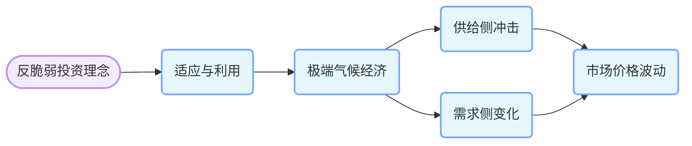

# 芒格的“反脆弱”投资理念在极端气候经济中的应用

> 关键词：芒格、反脆弱投资理念、极端气候经济、风险管理、投资策略

> 摘要：本文深入探讨了芒格的“反脆弱”投资理念在极端气候经济中的应用。首先介绍了背景信息，包括目的范围、预期读者等。接着阐述了“反脆弱”及极端气候经济的核心概念与联系，通过Mermaid流程图展示其架构。详细讲解了相关核心算法原理并给出Python代码示例，同时介绍了数学模型和公式。结合项目实战，提供代码实际案例及详细解释。分析了该理念在极端气候经济中的实际应用场景，推荐了学习、开发相关的工具和资源，包含书籍、在线课程等。最后总结未来发展趋势与挑战，解答常见问题并列出扩展阅读和参考资料，旨在为投资者在极端气候经济环境下运用“反脆弱”投资理念提供全面的指导。

## 1. 背景介绍 
### 1.1 目的和范围
在当今时代，极端气候事件愈发频繁，如暴雨洪涝、高温干旱、超强台风等，对全球经济产生了广泛而深刻的影响。传统的投资理念在应对极端气候带来的不确定性时面临诸多挑战。芒格的“反脆弱”投资理念强调在不确定性中不仅能抵御风险，还能从中获益，为投资者在极端气候经济环境下提供了新的思路。本文旨在深入研究该理念在极端气候经济中的具体应用，探讨如何运用这一理念制定有效的投资策略，降低风险并实现资产的增值。研究范围涵盖了多个与极端气候相关的经济领域，包括可再生能源、农业、保险等行业。

### 1.2 预期读者
本文预期读者主要包括专业投资者、金融分析师、投资顾问等金融领域从业者，他们希望在极端气候经济背景下优化投资组合，提高投资收益。同时，也适合对气候变化经济影响和投资策略感兴趣的学者、研究人员以及关注可持续投资的普通投资者，帮助他们了解如何将“反脆弱”理念融入到投资决策中。

### 1.3 文档结构概述
本文将按照以下结构展开：首先介绍核心概念，包括“反脆弱”投资理念和极端气候经济的定义、原理及它们之间的联系，并通过示意图和流程图进行展示。接着详细讲解核心算法原理和具体操作步骤，结合Python代码进行说明。然后阐述相关的数学模型和公式，并举例说明。通过项目实战部分，展示代码实际案例并进行详细解读。分析该理念在极端气候经济中的实际应用场景。推荐学习和开发所需的工具和资源，包括书籍、在线课程、开发工具等。最后总结未来发展趋势与挑战，解答常见问题并提供扩展阅读和参考资料。

### 1.4 术语表
#### 1.4.1 核心术语定义
- **反脆弱（Antifragile）**：由纳西姆·尼古拉斯·塔勒布提出的概念，指的是事物在不确定性、随机性、混乱和压力等冲击下不仅能够承受，还能从中受益、获得成长和发展的特性。在投资领域，反脆弱投资就是构建能够从市场波动和风险事件中获利的投资组合。
- **极端气候经济**：指由于极端气候事件（如暴雨、洪水、干旱、飓风、热浪等）的发生频率和强度增加，对经济系统的各个层面（包括生产、消费、贸易、金融等）产生影响而形成的经济现象和经济活动的总和。
- **投资组合（Portfolio）**：投资者将不同的资产（如股票、债券、基金、房地产等）按照一定的比例进行组合，以达到分散风险、实现预期收益的目的。

#### 1.4.2 相关概念解释
- **风险承受能力（Risk Tolerance）**：投资者在投资过程中能够承受的最大损失程度。它受到投资者的财务状况、投资目标、投资经验、年龄等多种因素的影响。
- **可持续投资（Sustainable Investment）**：在投资决策过程中，不仅考虑财务回报，还考虑环境、社会和公司治理（ESG）因素的投资方式。在极端气候经济中，可持续投资通常与支持应对气候变化、促进环境友好型产业发展相关。
- **气候风险溢价（Climate Risk Premium）**：由于极端气候事件对资产价值和投资回报产生潜在影响，投资者要求获得的额外补偿。它反映了市场对气候风险的定价。

#### 1.4.3 缩略词列表
- **ESG**：Environmental, Social and Governance，环境、社会和公司治理
- **GDP**：Gross Domestic Product，国内生产总值
- **ETF**：Exchange - Traded Fund，交易型开放式指数基金

## 2. 核心概念与联系 
### 核心概念原理
#### “反脆弱”投资理念原理
“反脆弱”投资理念的核心在于认识到世界是充满不确定性的，传统的风险管理方法往往只能应对可预测的风险，而对于不可预测的黑天鹅事件（极端不确定性事件）则无能为力。反脆弱投资通过构建具有弹性和适应性的投资组合，利用不确定性带来的机会，实现资产的增值。其原理基于以下几点：
- **非线性响应**：反脆弱系统对冲击的响应是非线性的，小的冲击可能不会产生明显影响，但大的冲击可能会带来巨大的收益。例如，在市场暴跌时，持有一些具有反脆弱性的资产（如期权、保险等）可能会获得高额回报。
- **冗余和多样性**：通过持有多种不同类型的资产，构建冗余的投资组合，可以降低单一资产的风险。当某一资产受到极端气候事件的负面影响时，其他资产可能不受影响或受益，从而保证整个投资组合的稳定性。
- **学习和适应**：反脆弱系统具有学习和适应能力，能够从过去的经验中吸取教训，调整投资策略以应对未来的不确定性。例如，投资者可以根据极端气候事件的发生情况，调整对不同行业和资产的投资比例。

#### 极端气候经济原理
极端气候经济的形成源于气候变化导致的极端气候事件增加，这些事件对经济系统产生了多方面的影响：
- **供给侧冲击**：极端气候事件可能破坏生产设施、影响原材料供应，导致企业生产中断、成本上升。例如，洪水可能淹没工厂，干旱可能导致农作物减产，从而影响相关产业的供给。
- **需求侧变化**：极端气候事件也会改变消费者的需求。例如，高温天气会增加对空调、冷饮等防暑用品的需求，而寒冷天气则会增加对取暖设备和保暖衣物的需求。
- **市场价格波动**：极端气候事件引起的供需变化会导致市场价格的波动。例如，农作物减产会导致农产品价格上涨，能源需求的变化会影响能源价格。

### 架构的文本示意图
```plaintext
          反脆弱投资理念
               |
               |  适应与利用
               |
       极端气候经济
      /           \
供给侧冲击     需求侧变化
      \           /
        市场价格波动
```

### Mermaid流程图


该流程图展示了“反脆弱”投资理念与极端气候经济之间的关系。“反脆弱”投资理念通过适应和利用极端气候经济中的各种变化，应对供给侧冲击和需求侧变化带来的市场价格波动，从而实现投资目标。

## 3. 核心算法原理 & 具体操作步骤 
### 核心算法原理
在将“反脆弱”投资理念应用于极端气候经济时，我们可以使用一种基于风险评估和资产配置的算法。该算法的核心思想是根据极端气候事件对不同资产的影响程度，评估资产的风险，并通过优化资产配置来提高投资组合的反脆弱性。

具体来说，我们可以使用风险价值（VaR）和条件风险价值（CVaR）来衡量资产的风险。VaR是指在一定的置信水平下，投资组合在未来一段时间内可能遭受的最大损失。CVaR则是在VaR的基础上，考虑了超过VaR的损失情况，更能反映极端风险。

我们的目标是在满足一定预期收益的前提下，最小化投资组合的CVaR。这可以通过求解一个优化问题来实现：

### Python源代码阐述
```python
import numpy as np
from scipy.optimize import minimize

# 假设我们有n种资产，以下是每种资产的预期收益率和协方差矩阵
n = 5
expected_returns = np.array([0.1, 0.12, 0.08, 0.15, 0.09])
cov_matrix = np.array([
    [0.04, 0.01, 0.005, 0.02, 0.008],
    [0.01, 0.06, 0.003, 0.015, 0.01],
    [0.005, 0.003, 0.03, 0.008, 0.006],
    [0.02, 0.015, 0.008, 0.08, 0.012],
    [0.008, 0.01, 0.006, 0.012, 0.05]
])

# 定义目标函数：最小化CVaR
def cvar_objective(weights, alpha=0.95, num_simulations=1000):
    # 生成模拟收益率
    simulated_returns = np.random.multivariate_normal(expected_returns, cov_matrix, num_simulations)
    portfolio_returns = np.dot(simulated_returns, weights)
    portfolio_returns.sort()
    var_index = int((1 - alpha) * num_simulations)
    var = portfolio_returns[var_index]
    cvar = np.mean(portfolio_returns[:var_index])
    return -cvar

# 定义约束条件：权重之和为1，且权重非负
constraints = ({'type': 'eq', 'fun': lambda x: np.sum(x) - 1})
bounds = [(0, 1) for _ in range(n)]

# 初始权重猜测
initial_weights = np.ones(n) / n

# 求解优化问题
result = minimize(cvar_objective, initial_weights, method='SLSQP', bounds=bounds, constraints=constraints)

# 最优权重
optimal_weights = result.x

print("最优资产配置权重:", optimal_weights)
```

### 具体操作步骤
1. **数据收集**：收集不同资产的历史收益率数据，计算预期收益率和协方差矩阵。可以使用金融数据提供商（如雅虎财经、彭博等）获取数据。
2. **确定置信水平和模拟次数**：选择合适的置信水平（如95%）和模拟次数（如1000次），用于计算VaR和CVaR。
3. **定义目标函数**：根据CVaR的计算公式，定义目标函数，目标是最小化CVaR。
4. **设置约束条件**：设置权重之和为1且权重非负的约束条件。
5. **初始化权重**：选择初始的资产配置权重。
6. **求解优化问题**：使用优化算法（如`scipy.optimize.minimize`）求解优化问题，得到最优的资产配置权重。
7. **调整投资组合**：根据最优权重调整投资组合，定期进行重新平衡。

## 4. 数学模型和公式 & 详细讲解 & 举例说明 
### 风险价值（VaR）
#### 公式
风险价值（VaR）是指在一定的置信水平 $\alpha$ 下，投资组合在未来一段时间 $\Delta t$ 内可能遭受的最大损失。其数学定义为：
$$VaR_{\alpha} = - \inf \{ l \in \mathbb{R} : P(L \leq l) \geq \alpha \}$$
其中，$L$ 是投资组合的损失随机变量，$\alpha$ 是置信水平。

#### 详细讲解
VaR的计算通常基于历史数据或模拟方法。在历史模拟法中，我们使用投资组合的历史收益率数据，按照从小到大的顺序排序，然后根据置信水平找到对应的分位数，该分位数对应的损失值即为VaR。在蒙特卡罗模拟法中，我们通过模拟投资组合的未来收益率，计算损失分布，再根据置信水平确定VaR。

#### 举例说明
假设我们有一个投资组合，其历史收益率数据如下：
```python
import numpy as np

returns = np.array([0.02, -0.01, 0.03, -0.02, 0.01, -0.03, 0.04, -0.04, 0.05, -0.05])
alpha = 0.95

# 计算VaR
returns.sort()
var_index = int((1 - alpha) * len(returns))
var = -returns[var_index]

print("95%置信水平下的VaR:", var)
```

### 条件风险价值（CVaR）
#### 公式
条件风险价值（CVaR）是指在损失超过VaR的条件下，损失的期望值。其数学定义为：
$$CVaR_{\alpha} = E[L | L \geq VaR_{\alpha}]$$

#### 详细讲解
CVaR比VaR更能反映极端风险，因为它考虑了超过VaR的损失情况。计算CVaR时，我们首先计算VaR，然后找出所有超过VaR的损失值，计算这些损失值的平均值。

#### 举例说明
继续使用上面的投资组合收益率数据，计算CVaR：
```python
# 计算CVaR
cvar = np.mean(returns[:var_index])
cvar = -cvar

print("95%置信水平下的CVaR:", cvar)
```

### 投资组合优化模型
#### 公式
我们的投资组合优化目标是在满足一定预期收益 $R_{target}$ 的前提下，最小化CVaR。数学模型可以表示为：
$$\min_{w} CVaR_{\alpha}(w)$$
$$\text{s.t.} \quad E[R_p(w)] \geq R_{target}$$
$$\sum_{i=1}^{n} w_i = 1$$
$$w_i \geq 0, \quad i = 1, \cdots, n$$
其中，$w$ 是资产配置权重向量，$R_p(w)$ 是投资组合的收益率，$E[R_p(w)]$ 是投资组合的预期收益率。

#### 详细讲解
该优化模型的目标是找到一组最优的资产配置权重，使得投资组合的CVaR最小，同时满足预期收益的要求。约束条件包括权重之和为1和权重非负。我们可以使用优化算法（如线性规划、二次规划等）来求解该模型。

#### 举例说明
假设我们的目标预期收益率为 $R_{target} = 0.1$，使用上面的Python代码求解优化问题时，我们可以添加一个额外的约束条件：
```python
# 添加预期收益约束
target_return = 0.1
constraints = (
    {'type': 'eq', 'fun': lambda x: np.sum(x) - 1},
    {'type': 'ineq', 'fun': lambda x: np.dot(expected_returns, x) - target_return}
)

result = minimize(cvar_objective, initial_weights, method='SLSQP', bounds=bounds, constraints=constraints)

optimal_weights = result.x

print("考虑预期收益约束后的最优资产配置权重:", optimal_weights)
```

## 5. 项目实战：代码实际案例和详细解释说明 
### 5.1  开发环境搭建
#### 安装Python
首先，确保你已经安装了Python。可以从Python官方网站（https://www.python.org/downloads/）下载适合你操作系统的Python版本。建议安装Python 3.7及以上版本。

#### 安装必要的库
我们需要安装一些必要的Python库，包括`numpy`、`scipy`等。可以使用`pip`命令进行安装：
```sh
pip install numpy scipy
```

### 5.2  源代码详细实现和代码解读
以下是一个完整的项目实战代码示例，用于将“反脆弱”投资理念应用于极端气候经济中的资产配置：
```python
import numpy as np
from scipy.optimize import minimize

# 假设我们有n种资产，以下是每种资产的预期收益率和协方差矩阵
n = 5
expected_returns = np.array([0.1, 0.12, 0.08, 0.15, 0.09])
cov_matrix = np.array([
    [0.04, 0.01, 0.005, 0.02, 0.008],
    [0.01, 0.06, 0.003, 0.015, 0.01],
    [0.005, 0.003, 0.03, 0.008, 0.006],
    [0.02, 0.015, 0.008, 0.08, 0.012],
    [0.008, 0.01, 0.006, 0.012, 0.05]
])

# 定义目标函数：最小化CVaR
def cvar_objective(weights, alpha=0.95, num_simulations=1000):
    # 生成模拟收益率
    simulated_returns = np.random.multivariate_normal(expected_returns, cov_matrix, num_simulations)
    portfolio_returns = np.dot(simulated_returns, weights)
    portfolio_returns.sort()
    var_index = int((1 - alpha) * num_simulations)
    var = portfolio_returns[var_index]
    cvar = np.mean(portfolio_returns[:var_index])
    return -cvar

# 定义约束条件：权重之和为1，且权重非负
constraints = ({'type': 'eq', 'fun': lambda x: np.sum(x) - 1})
bounds = [(0, 1) for _ in range(n)]

# 初始权重猜测
initial_weights = np.ones(n) / n

# 求解优化问题
result = minimize(cvar_objective, initial_weights, method='SLSQP', bounds=bounds, constraints=constraints)

# 最优权重
optimal_weights = result.x

print("最优资产配置权重:", optimal_weights)
```

#### 代码解读
1. **导入必要的库**：导入`numpy`用于数值计算，`scipy.optimize.minimize`用于求解优化问题。
2. **定义资产参数**：定义资产的数量`n`、预期收益率`expected_returns`和协方差矩阵`cov_matrix`。
3. **定义目标函数`cvar_objective`**：该函数接受资产配置权重`weights`、置信水平`alpha`和模拟次数`num_simulations`作为输入，通过蒙特卡罗模拟生成投资组合的模拟收益率，计算CVaR并返回其负值（因为我们要最小化CVaR）。
4. **定义约束条件和边界**：约束条件要求权重之和为1，边界要求权重在0到1之间。
5. **初始化权重**：将初始权重设置为每种资产均等分配。
6. **求解优化问题**：使用`minimize`函数求解优化问题，得到最优的资产配置权重。
7. **输出结果**：打印最优资产配置权重。

### 5.3  代码解读与分析
#### 优点
- **考虑极端风险**：使用CVaR作为目标函数，能够更好地考虑极端气候事件等不确定性因素带来的极端风险，提高投资组合的抗风险能力。
- **灵活性**：通过调整置信水平和模拟次数，可以根据不同的风险偏好和数据质量进行优化。
- **可扩展性**：可以添加更多的约束条件，如预期收益约束、行业权重限制等，以满足不同的投资需求。

#### 缺点
- **数据依赖性**：算法的性能依赖于预期收益率和协方差矩阵的准确性。如果数据不准确，可能会导致优化结果不理想。
- **计算复杂度**：蒙特卡罗模拟需要大量的计算资源和时间，尤其是在模拟次数较多的情况下。
- **假设条件**：算法假设资产收益率服从正态分布，这在实际市场中可能并不成立。

## 6. 实际应用场景 
### 可再生能源行业投资
极端气候事件的增加使得传统能源的供应面临更多的不确定性，如石油开采可能受到飓风影响，煤炭运输可能因暴雨中断。而可再生能源（如太阳能、风能、水能等）具有清洁、可持续的特点，且不受极端气候的直接影响。投资者可以运用“反脆弱”投资理念，增加对可再生能源行业的投资。

例如，在极端气候经济环境下，太阳能企业可能会受益于政策支持和市场需求的增加。投资者可以通过购买太阳能企业的股票、投资可再生能源基金或参与相关项目的融资等方式，构建具有反脆弱性的投资组合。当极端气候事件导致传统能源供应中断时，可再生能源的需求可能会上升，从而带动相关企业的股价上涨，投资者可以从中获利。

### 农业保险投资
极端气候事件（如暴雨、干旱、洪水等）对农业生产造成了严重的影响，导致农作物减产甚至绝收。农业保险作为一种风险管理工具，可以帮助农民和农业企业应对这些风险。投资者可以投资农业保险公司或相关的保险产品，以获取收益。

在“反脆弱”投资理念下，农业保险的需求在极端气候事件增加的情况下可能会上升。当发生极端气候灾害时，农业保险公司可能会获得更多的保费收入，同时也需要支付更多的赔款。但如果保险公司能够合理定价和管理风险，仍然可以实现盈利。投资者可以通过分析农业保险市场的供需情况、保险公司的风险管理能力等因素，选择具有潜力的投资对象。

### 气候适应性基础设施投资
为了应对极端气候事件的影响，许多城市和地区开始加大对气候适应性基础设施的投资，如防洪堤、排水系统、绿色建筑等。这些基础设施项目不仅可以提高城市的抗灾能力，还能带来长期的经济效益。

投资者可以参与气候适应性基础设施项目的投资，如通过基础设施基金、公私合营（PPP）项目等方式。在极端气候经济环境下，这些项目的价值可能会随着极端气候事件的增加而提升。例如，防洪堤的建设可以减少洪水对城市的破坏，保护周边的商业和居民财产，从而提高土地价值和商业活动的稳定性。投资者可以从项目的运营收益、资产增值等方面获得回报。

### 水资源管理相关投资
极端气候事件导致水资源的分布和供需关系发生了变化，一些地区可能面临水资源短缺，而另一些地区则可能遭受洪水灾害。水资源管理相关的行业，如污水处理、海水淡化、水资源调配等，具有重要的战略意义。

投资者可以关注水资源管理相关的企业和项目，通过投资这些领域来实现“反脆弱”投资。例如，在水资源短缺的地区，海水淡化企业可能会迎来发展机遇。投资者可以购买海水淡化企业的股票或参与相关项目的投资，以分享行业的增长红利。同时，污水处理企业也可以通过提高污水处理效率和资源回收利用，降低极端气候事件对水资源质量的影响，具有一定的投资价值。

## 7. 工具和资源推荐
### 7.1 学习资源推荐
#### 7.1.1 书籍推荐
- 《反脆弱：从不确定性中获益》（Antifragile: Things That Gain from Disorder），纳西姆·尼古拉斯·塔勒布（Nassim Nicholas Taleb）著。这本书是“反脆弱”概念的经典之作，详细阐述了反脆弱的原理和应用，对投资、生活等多个领域都有启发。
- 《气候经济与人类未来》（How to Avoid a Climate Disaster: The Solutions We Have and the Breakthroughs We Need），比尔·盖茨（Bill Gates）著。该书探讨了气候变化对经济的影响以及应对策略，提供了许多关于极端气候经济的见解和解决方案。
- 《聪明的投资者》（The Intelligent Investor），本杰明·格雷厄姆（Benjamin Graham）著。这是一本投资领域的经典书籍，介绍了价值投资的理念和方法，对理解投资组合的构建和风险管理有很大帮助。

#### 7.1.2 在线课程
- Coursera平台上的“Climate Change Economics”课程，由耶鲁大学教授开设，系统介绍了气候变化经济学的基本原理和方法，包括极端气候事件对经济的影响、气候政策评估等内容。
- edX平台上的“Investment Management Specialization”课程，涵盖了投资组合理论、资产定价、风险管理等方面的知识，有助于投资者掌握投资分析和决策的技巧。
- Udemy平台上的“Python for Finance: Investment Fundamentals & Data Analytics”课程，通过Python编程实现金融数据分析和投资策略开发，适合想将编程应用于投资领域的学习者。

#### 7.1.3 技术博客和网站
- Bloomberg Terminal：提供全球金融市场的实时数据、新闻和分析，包括极端气候经济相关的信息。投资者可以通过该平台了解气候变化对不同行业和资产的影响。
- Climate Policy Initiative：专注于气候变化政策和投资的研究机构，其网站提供了大量关于气候经济、可持续投资等方面的报告和研究成果。
- Seeking Alpha：一个金融投资社区，有许多专业投资者和分析师分享投资观点和研究报告，其中也包括与极端气候经济相关的投资分析。

### 7.2 开发工具框架推荐
#### 7.2.1 IDE和编辑器
- PyCharm：一款专业的Python集成开发环境，具有代码编辑、调试、版本控制等功能，适合开发复杂的金融数据分析和投资策略代码。
- Jupyter Notebook：一种交互式的编程环境，支持Python、R等多种编程语言。它可以将代码、文本、图表等内容整合在一起，方便进行数据探索和分析。
- Visual Studio Code：一款轻量级的代码编辑器，支持多种编程语言和插件扩展。可以通过安装Python插件来进行Python编程开发。

#### 7.2.2 调试和性能分析工具
- pdb：Python自带的调试器，可以帮助开发者在代码中设置断点、单步执行代码，定位和解决代码中的问题。
- cProfile：Python标准库中的性能分析工具，可以统计代码中各个函数的执行时间和调用次数，帮助开发者找出代码的性能瓶颈。
- Numba：一个用于加速Python代码的编译器，可以将Python代码转换为机器码，提高代码的执行速度，特别是在处理大规模数据和复杂计算时效果显著。

#### 7.2.3 相关框架和库
- NumPy：一个用于科学计算的Python库，提供了高效的多维数组对象和各种数学函数，是金融数据分析和投资策略开发的基础库。
- Pandas：一个用于数据处理和分析的Python库，提供了灵活的数据结构（如DataFrame）和数据操作方法，方便进行数据清洗、整理和分析。
- Scikit-learn：一个用于机器学习的Python库，提供了各种机器学习算法和工具，如分类、回归、聚类等。可以用于投资风险评估和预测。

### 7.3 相关论文著作推荐
#### 7.3.1 经典论文
- Nordhaus, W. D. (2018). “Climate Economics: A Meta-analysis of the Stern Review.” *Journal of Economic Literature*, 56(3), 986 - 1027. 该论文对气候变化经济学进行了元分析，探讨了气候变化对经济的影响以及应对策略的成本效益。
- Pindyck, R. S. (2017). “Climate Change Policy: What Do the Models Tell Us?” *Journal of Economic Literature*, 55(2), 860 - 922. 论文分析了气候变化政策模型的局限性和不确定性，对理解气候政策的制定和评估有重要意义。
- Taleb, N. N., & Douady, R. (2013). “On the Statistical Consequences of Fat Tails: Real World Preasymptotics, Epistemology, and Applications.” *The American Statistician*, 67(3), 145 - 152. 该论文深入探讨了厚尾分布的统计后果，与“反脆弱”理念中对极端不确定性的关注相关。

#### 7.3.2 最新研究成果
- “Climate Finance and Investment: Trends, Challenges, and Opportunities”，由国际金融公司（IFC）发布的报告，分析了气候金融和投资的最新趋势、面临的挑战以及潜在的机会。
- “The Impact of Climate Change on Financial Stability”，国际清算银行（BIS）的研究报告，探讨了气候变化对金融稳定的影响，包括对银行、保险等金融机构的风险暴露。
- Academic journals such as *Nature Climate Change*, *Journal of Climate Economics*, and *Review of Financial Studies* regularly publish cutting - edge research on climate - related economic and financial topics.

#### 7.3.3 应用案例分析
- “Case Studies in Sustainable Investment: How Investors are Incorporating ESG Factors”，提供了多个可持续投资的实际案例，展示了投资者如何将环境、社会和治理因素纳入投资决策中，特别是在应对极端气候经济方面的应用。
- “Climate - Resilient Infrastructure Investment: Lessons from Global Projects”，分析了全球范围内气候适应性基础设施投资项目的案例，总结了项目实施过程中的经验教训和成功因素。

## 8. 总结：未来发展趋势与挑战
### 未来发展趋势
#### 可持续投资主流化
随着极端气候事件的频繁发生和社会对气候变化问题的关注度不断提高，可持续投资将逐渐成为主流投资策略。投资者将更加注重投资项目的环境、社会和治理（ESG）表现，尤其是与应对气候变化相关的因素。未来，越来越多的资金将流向可再生能源、绿色交通、水资源管理等可持续发展领域。

#### 气候风险定价完善
金融市场将更加准确地对气候风险进行定价。目前，气候风险溢价尚未被充分反映在资产价格中，但随着数据的积累和分析方法的改进，投资者将能够更好地评估极端气候事件对不同资产的影响，从而要求相应的风险补偿。这将促使企业更加重视气候变化风险管理，推动整个经济向低碳、气候适应型转型。

#### 技术创新驱动投资机会
科技的不断进步将为极端气候经济中的投资带来更多机会。例如，人工智能、大数据、物联网等技术可以用于气候风险监测和预测，提高投资决策的准确性。同时，新能源技术、储能技术、碳捕获与封存技术等的发展将推动可再生能源和低碳产业的发展，为投资者提供新的投资标的。

#### 国际合作加强
气候变化是全球性问题，需要各国政府、企业和投资者共同合作应对。未来，国际间在气候政策制定、资金流动、技术转让等方面的合作将不断加强。例如，“一带一路”倡议下的绿色投资合作将为沿线国家的气候适应和可持续发展项目提供资金支持，促进全球气候经济的发展。

### 挑战
#### 数据质量和可得性
准确的气候数据和金融数据是实施“反脆弱”投资策略的基础。然而，目前气候数据的质量和可得性存在不足，尤其是关于极端气候事件的长期历史数据和未来预测数据。同时，企业的ESG信息披露也不够规范和透明，这给投资者评估气候风险和可持续投资机会带来了困难。

#### 模型不确定性
现有的气候经济模型和投资模型存在一定的不确定性。气候系统本身非常复杂，模型难以准确预测极端气候事件的发生频率和强度。在投资模型方面，资产收益率的分布假设和参数估计也可能存在偏差，导致优化结果的可靠性受到影响。

#### 政策不确定性
各国政府的气候政策和监管措施存在不确定性。政策的变化可能会对相关行业和企业的发展产生重大影响，例如补贴政策的调整、碳排放税的实施等。投资者需要密切关注政策动态，及时调整投资策略，但政策的不确定性增加了投资决策的难度。

#### 投资者意识和能力不足
许多投资者对“反脆弱”投资理念和极端气候经济的认识还不够深入，缺乏将气候变化因素纳入投资决策的意识和能力。此外，专业的气候投资人才相对匮乏，也限制了“反脆弱”投资策略的广泛应用。

## 9. 附录：常见问题与解答
### 1. 什么是“反脆弱”投资理念？
“反脆弱”投资理念由纳西姆·尼古拉斯·塔勒布提出，强调在不确定性、随机性和风险冲击下，投资组合不仅能够承受损失，还能从中受益。它通过构建具有弹性和适应性的投资组合，利用市场波动和极端事件带来的机会，实现资产的增值。

### 2. 极端气候经济对投资有哪些影响？
极端气候经济对投资的影响主要体现在以下几个方面：
- **行业分化**：一些行业（如可再生能源、农业保险、气候适应性基础设施等）可能受益于极端气候事件的增加，而另一些行业（如传统能源、农业等）可能受到负面影响。
- **市场波动**：极端气候事件会导致市场供需关系的变化，从而引起市场价格的波动，增加投资的不确定性。
- **风险增加**：极端气候事件带来的物理风险（如洪水、飓风等对资产的破坏）和转型风险（如政策变化导致的行业转型）会增加投资组合的风险。

### 3. 如何衡量投资组合的反脆弱性？
可以从以下几个方面衡量投资组合的反脆弱性：
- **风险指标**：使用风险价值（VaR）、条件风险价值（CVaR）等指标评估投资组合在极端情况下的风险承受能力。反脆弱的投资组合应该在极端事件发生时，损失相对较小，甚至能够获得收益。
- **资产多样性**：投资组合中资产的种类和相关性。多样化的资产配置可以降低单一资产的风险，提高投资组合的弹性。
- **适应性**：投资组合对市场变化和极端事件的适应能力。例如，能够及时调整资产配置，抓住新的投资机会。

### 4. 如何将“反脆弱”投资理念应用于实际投资中？
可以按照以下步骤将“反脆弱”投资理念应用于实际投资中：
- **资产筛选**：选择具有反脆弱性的资产，如可再生能源、防御性行业的股票、保险产品等。
- **资产配置**：根据自己的风险承受能力和投资目标，合理配置不同资产的比例，构建多样化的投资组合。
- **风险管理**：使用风险评估工具（如VaR、CVaR）评估投资组合的风险，制定风险管理策略，如止损、对冲等。
- **动态调整**：定期监测市场变化和极端气候事件的影响，及时调整投资组合的资产配置，以适应新的市场环境。

### 5. 投资可再生能源行业有哪些风险？
投资可再生能源行业虽然具有一定的发展潜力，但也存在一些风险：
- **技术风险**：可再生能源技术仍在不断发展和完善中，新技术的出现可能会使现有技术过时，导致企业竞争力下降。
- **政策风险**：可再生能源行业的发展高度依赖政府的政策支持，如补贴政策、上网电价政策等。政策的变化可能会对企业的盈利能力产生重大影响。
- **市场风险**：可再生能源市场竞争激烈，产品价格波动较大。市场需求的变化、原材料价格的上涨等因素都可能影响企业的业绩。
- **自然条件风险**：可再生能源的生产受到自然条件的限制，如太阳能发电依赖阳光照射，风能发电依赖风力条件。自然条件的不稳定可能导致能源生产的波动。

## 10. 扩展阅读 & 参考资料
### 扩展阅读
- 《非对称风险：风险共担，应对现实世界中的不确定性》（Skin in the Game: Hidden Asymmetries in Daily Life），纳西姆·尼古拉斯·塔勒布（Nassim Nicholas Taleb）著。该书进一步探讨了在不确定性环境下的决策和风险管理，与“反脆弱”理念密切相关。
- 《绿色金融与可持续发展》，马骏等著。本书介绍了绿色金融的概念、政策和实践，对理解可持续投资和极端气候经济中的金融创新有帮助。
- 《气候投资学》，作者待查。该书系统阐述了气候投资的理论和方法，为投资者提供了在极端气候经济环境下的投资指导。

### 参考资料
- Taleb, N. N. (2012). *Antifragile: Things That Gain from Disorder*. Random House.
- Gates, B. (2021). *How to Avoid a Climate Disaster: The Solutions We Have and the Breakthroughs We Need*. Knopf.
- Graham, B. (1949). *The Intelligent Investor*. Harper Business.
- Bloomberg Terminal. https://www.bloomberg.com/terminal
- Climate Policy Initiative. https://climatepolicyinitiative.org/
- Seeking Alpha. https://seekingalpha.com/
- Nordhaus, W. D. (2018). “Climate Economics: A Meta - analysis of the Stern Review.” *Journal of Economic Literature*, 56(3), 986 - 1027.
- Pindyck, R. S. (2017). “Climate Change Policy: What Do the Models Tell Us?” *Journal of Economic Literature*, 55(2), 860 - 922.
- Taleb, N. N., & Douady, R. (2013). “On the Statistical Consequences of Fat Tails: Real World Preasymptotics, Epistemology, and Applications.” *The American Statistician*, 67(3), 145 - 152.

作者：AI天才研究院/AI Genius Institute & 禅与计算机程序设计艺术 /Zen And The Art of Computer Programming