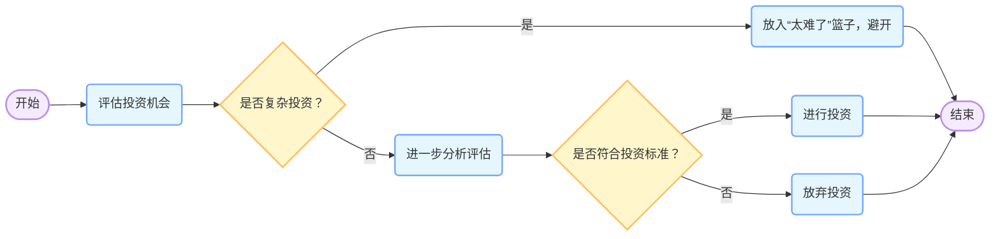

# 芒格的“太难了”篮子：避开复杂投资

> 关键词：芒格、“太难了”篮子、复杂投资、投资策略、价值投资

> 摘要：本文深入探讨了芒格提出的“太难了”篮子这一重要投资理念，即避开复杂投资。通过对其背景的介绍，阐述了该理念的目的、适用读者群体以及文档的整体结构。详细解析了核心概念及其联系，包括“太难了”篮子的原理和架构，并以Mermaid流程图展示其决策过程。深入讲解了核心算法原理和具体操作步骤，结合Python代码进行说明。运用数学模型和公式进一步阐释其在投资中的应用，并举例说明。通过项目实战，提供代码实际案例并进行详细解释。探讨了该理念在实际投资场景中的应用，推荐了相关的学习资源、开发工具框架以及论文著作。最后总结了其未来发展趋势与挑战，解答常见问题，并提供扩展阅读和参考资料，旨在帮助投资者更好地理解和运用这一理念，做出更明智的投资决策。

## 1. 背景介绍 
### 1.1 目的和范围
芒格作为投资界的传奇人物，他的投资理念和策略一直备受关注。“太难了”篮子这一概念是芒格在长期投资实践中总结出来的一种有效避开复杂投资的方法。本文的目的在于深入剖析这一概念，详细阐述其原理、操作步骤以及在实际投资中的应用，帮助投资者更好地理解和运用这一理念，提高投资决策的质量和成功率。本文的范围涵盖了从理论层面的核心概念解析到实际操作的项目实战，以及相关的学习资源和未来发展趋势的探讨。

### 1.2 预期读者
本文预期读者主要包括各类投资者，无论是个人投资者还是专业投资机构的从业者，都能从本文中获得有价值的信息。对于初涉投资领域的新手来说，本文可以帮助他们建立正确的投资观念，避免陷入复杂投资的陷阱；对于有一定投资经验的投资者，本文可以为他们提供新的思考角度和投资策略，进一步优化投资组合。此外，金融专业的学生和研究人员也可以通过本文深入了解芒格的投资思想，为学术研究提供参考。

### 1.3 文档结构概述
本文将按照以下结构展开：首先介绍“太难了”篮子这一概念的背景信息，包括目的、预期读者和文档结构概述等；接着详细解析核心概念及其联系，通过文本示意图和Mermaid流程图展示其原理和架构；然后深入讲解核心算法原理和具体操作步骤，并结合Python代码进行说明；运用数学模型和公式进一步阐释其在投资中的应用，并举例说明；通过项目实战，提供代码实际案例并进行详细解释；探讨该理念在实际投资场景中的应用；推荐相关的学习资源、开发工具框架以及论文著作；最后总结其未来发展趋势与挑战，解答常见问题，并提供扩展阅读和参考资料。

### 1.4 术语表
#### 1.4.1 核心术语定义
- **“太难了”篮子**：芒格提出的一种投资理念，指的是将那些难以理解、分析和评估的投资机会放入一个“篮子”中，选择避开这些复杂投资，专注于那些容易理解和评估的投资项目。
- **复杂投资**：涉及到复杂的业务模式、财务结构、市场环境或技术等因素，使得投资者难以准确评估其价值和风险的投资项目。
- **价值投资**：一种投资策略，强调通过对企业基本面的分析，寻找被低估的股票或其他资产，并长期持有，以获取企业价值增长带来的收益。

#### 1.4.2 相关概念解释
- **投资决策**：投资者在面对各种投资机会时，根据自身的投资目标、风险承受能力和对投资项目的评估，做出是否投资以及投资多少的决策过程。
- **风险评估**：对投资项目可能面临的各种风险进行分析和评估，包括市场风险、信用风险、经营风险等，以确定投资项目的风险水平。
- **投资组合**：投资者将资金分散投资于不同的资产或项目，以降低投资风险并实现预期收益的一种投资方式。

#### 1.4.3 缩略词列表
- **ROE**：Return on Equity，净资产收益率，反映企业利用自有资本获取收益的能力。
- **PE**：Price-to-Earnings Ratio，市盈率，衡量股票价格相对公司盈利水平的指标。
- **PB**：Price-to-Book Ratio，市净率，衡量股票价格相对公司净资产的指标。

## 2. 核心概念与联系 
### 核心概念原理
芒格的“太难了”篮子理念基于一个简单而深刻的认识：在投资领域，并非所有的投资机会都是平等的。有些投资项目由于其业务模式复杂、财务状况难以分析、市场环境不确定等因素，使得投资者很难准确评估其价值和风险。对于这些复杂投资，即使投入大量的时间和精力进行研究，也可能无法得出可靠的结论。因此，芒格建议投资者将这些复杂投资放入“太难了”篮子中，选择避开它们，专注于那些容易理解和评估的投资项目。

这种理念的核心原理在于，投资的本质是对未来现金流的折现。投资者需要对投资项目的未来现金流进行预测，并根据风险水平确定合适的折现率，从而计算出投资项目的内在价值。对于复杂投资，由于其未来现金流的不确定性较大，很难进行准确的预测，因此也就难以确定其内在价值。而避开复杂投资，选择那些业务模式简单、财务状况透明、市场环境稳定的投资项目，可以降低投资的不确定性，提高投资决策的准确性。

### 架构的文本示意图
```plaintext
开始
|
|-- 评估投资机会
|   |
|   |-- 是否复杂投资？
|       |
|       |-- 是 --> 放入“太难了”篮子，避开
|       |
|       |-- 否 --> 进一步分析评估
|           |
|           |-- 是否符合投资标准？
|               |
|               |-- 是 --> 进行投资
|               |
|               |-- 否 --> 放弃投资
结束
```

### Mermaid流程图


这个流程图清晰地展示了“太难了”篮子理念在投资决策过程中的应用。首先对投资机会进行评估，判断其是否为复杂投资。如果是复杂投资，则直接放入“太难了”篮子中避开；如果不是复杂投资，则进一步分析评估，判断其是否符合投资标准，根据判断结果决定是否进行投资。

## 3. 核心算法原理 & 具体操作步骤 
### 核心算法原理
“太难了”篮子理念的核心算法原理可以概括为一个筛选和决策的过程。其核心思想是通过一系列的规则和指标，筛选出复杂投资，并将其排除在投资范围之外，然后对剩余的投资机会进行进一步的分析和评估，选择符合投资标准的项目进行投资。

具体来说，该算法的核心步骤包括：
1. **复杂度评估**：对每个投资机会进行复杂度评估，判断其是否为复杂投资。复杂度评估可以从多个维度进行，如业务模式的复杂度、财务结构的复杂度、市场环境的复杂度等。
2. **筛选复杂投资**：根据复杂度评估的结果，将那些被判定为复杂投资的项目放入“太难了”篮子中，选择避开它们。
3. **进一步分析评估**：对剩余的非复杂投资项目进行进一步的分析和评估，包括对企业基本面的分析、财务指标的计算、市场前景的预测等。
4. **投资决策**：根据进一步分析评估的结果，判断每个非复杂投资项目是否符合投资标准。如果符合投资标准，则进行投资；如果不符合投资标准，则放弃投资。

### 具体操作步骤
以下是实现“太难了”篮子理念的具体操作步骤：

#### 步骤1：收集投资机会信息
投资者需要收集各种投资机会的信息，包括股票、债券、基金、房地产等。这些信息可以通过各种渠道获取，如财经媒体、证券公司、投资咨询机构等。

#### 步骤2：复杂度评估
对每个投资机会进行复杂度评估，可以采用以下方法：
1. **业务模式分析**：分析投资项目的业务模式是否简单易懂。如果业务模式涉及到复杂的技术、流程或商业模式，难以理解和评估，则可以判定为复杂投资。
2. **财务结构分析**：分析投资项目的财务结构是否复杂。如果财务报表中存在大量的关联交易、复杂的会计处理或高负债等情况，难以准确评估其财务状况，则可以判定为复杂投资。
3. **市场环境分析**：分析投资项目所处的市场环境是否复杂。如果市场环境存在高度的不确定性、激烈的竞争或政策风险等因素，难以预测其未来发展趋势，则可以判定为复杂投资。

#### 步骤3：筛选复杂投资
根据复杂度评估的结果，将那些被判定为复杂投资的项目放入“太难了”篮子中，选择避开它们。

#### 步骤4：进一步分析评估
对剩余的非复杂投资项目进行进一步的分析和评估，可以采用以下方法：
1. **企业基本面分析**：分析企业的经营状况、管理团队、行业竞争力等基本面因素，评估企业的长期发展潜力。
2. **财务指标计算**：计算企业的财务指标，如ROE、PE、PB等，评估企业的盈利能力、估值水平等。
3. **市场前景预测**：预测企业所处行业的市场前景，评估企业的市场份额和增长空间。

#### 步骤5：投资决策
根据进一步分析评估的结果，判断每个非复杂投资项目是否符合投资标准。投资标准可以根据投资者的个人情况和投资目标制定，如要求企业具有稳定的盈利能力、合理的估值水平等。如果符合投资标准，则进行投资；如果不符合投资标准，则放弃投资。

### Python源代码示例
```python
# 定义投资机会类
class InvestmentOpportunity:
    def __init__(self, name, business_complexity, financial_complexity, market_complexity):
        self.name = name
        self.business_complexity = business_complexity
        self.financial_complexity = financial_complexity
        self.market_complexity = market_complexity

    def is_complex(self, complexity_threshold):
        # 综合评估复杂度
        total_complexity = self.business_complexity + self.financial_complexity + self.market_complexity
        return total_complexity > complexity_threshold

# 定义投资决策函数
def investment_decision(opportunities, complexity_threshold, investment_criteria):
    difficult_basket = []
    potential_investments = []

    # 筛选复杂投资
    for opportunity in opportunities:
        if opportunity.is_complex(complexity_threshold):
            difficult_basket.append(opportunity.name)
        else:
            potential_investments.append(opportunity)

    # 进一步分析评估和投资决策
    final_investments = []
    for opportunity in potential_investments:
        # 这里简单假设投资标准是一个函数，返回True或False
        if investment_criteria(opportunity):
            final_investments.append(opportunity.name)

    return difficult_basket, final_investments

# 示例投资机会
opportunities = [
    InvestmentOpportunity("Stock A", 2, 3, 2),
    InvestmentOpportunity("Stock B", 5, 4, 3),
    InvestmentOpportunity("Stock C", 1, 2, 1)
]

# 复杂度阈值
complexity_threshold = 6

# 示例投资标准函数
def investment_criteria(opportunity):
    # 这里简单假设投资标准是业务复杂度小于3
    return opportunity.business_complexity < 3

# 进行投资决策
difficult_basket, final_investments = investment_decision(opportunities, complexity_threshold, investment_criteria)

print("太难了篮子中的投资机会:", difficult_basket)
print("最终投资的机会:", final_investments)
```

### 代码解释
上述Python代码实现了“太难了”篮子理念的核心算法。首先定义了一个`InvestmentOpportunity`类，用于表示投资机会，其中包含业务复杂度、财务复杂度和市场复杂度等属性。`is_complex`方法用于判断投资机会是否为复杂投资。

然后定义了一个`investment_decision`函数，用于进行投资决策。该函数接受投资机会列表、复杂度阈值和投资标准函数作为输入，首先筛选出复杂投资放入“太难了”篮子中，然后对剩余的非复杂投资项目进行进一步的分析和评估，根据投资标准函数的结果确定最终的投资项目。

最后，创建了示例投资机会列表，设置了复杂度阈值和投资标准函数，并调用`investment_decision`函数进行投资决策，输出“太难了”篮子中的投资机会和最终投资的机会。

## 4. 数学模型和公式 & 详细讲解 & 举例说明 
### 数学模型和公式
在“太难了”篮子理念的应用中，可以运用一些数学模型和公式来辅助投资决策。以下是一些常见的数学模型和公式：

#### 1. 内在价值计算模型
内在价值是投资决策的重要依据之一。常用的内在价值计算模型是现金流折现模型（Discounted Cash Flow Model，DCF）。该模型的基本公式为：

$$V = \sum_{t=1}^{n} \frac{CF_t}{(1 + r)^t}$$

其中，$V$ 表示投资项目的内在价值，$CF_t$ 表示第 $t$ 期的现金流，$r$ 表示折现率，$n$ 表示现金流的期数。

#### 2. 估值指标公式
- **市盈率（PE）**：

$$PE = \frac{P}{E}$$

其中，$P$ 表示股票价格，$E$ 表示每股收益。

- **市净率（PB）**：

$$PB = \frac{P}{B}$$

其中，$P$ 表示股票价格，$B$ 表示每股净资产。

- **净资产收益率（ROE）**：

$$ROE = \frac{Net Income}{Shareholders' Equity}$$

其中，$Net Income$ 表示净利润，$Shareholders' Equity$ 表示股东权益。

### 详细讲解
#### 现金流折现模型（DCF）
现金流折现模型的核心思想是将投资项目未来各期的现金流按照一定的折现率折现到当前时刻，从而计算出投资项目的内在价值。折现率反映了投资者对投资项目的风险要求，风险越高，折现率越高。

在实际应用中，计算现金流折现模型需要对未来各期的现金流进行预测，并确定合适的折现率。由于未来现金流的不确定性较大，因此需要进行合理的假设和估计。

#### 估值指标公式
- **市盈率（PE）**：市盈率是衡量股票价格相对公司盈利水平的指标。一般来说，市盈率越低，说明股票价格相对公司盈利水平越低，投资价值越高；反之，市盈率越高，说明股票价格相对公司盈利水平越高，投资价值越低。
- **市净率（PB）**：市净率是衡量股票价格相对公司净资产的指标。一般来说，市净率越低，说明股票价格相对公司净资产越低，投资价值越高；反之，市净率越高，说明股票价格相对公司净资产越高，投资价值越低。
- **净资产收益率（ROE）**：净资产收益率反映了企业利用自有资本获取收益的能力。一般来说，净资产收益率越高，说明企业的盈利能力越强，投资价值越高。

### 举例说明
假设我们要评估一只股票的投资价值，已知该股票当前价格为 $P = 50$ 元，每股收益为 $E = 5$ 元，每股净资产为 $B = 20$ 元，预计未来每年的净利润增长率为 $g = 10\%$，折现率为 $r = 15\%$，预计未来 5 年的现金流分别为 $CF_1 = 5$ 元，$CF_2 = 5 \times (1 + 10\%) = 5.5$ 元，$CF_3 = 5.5 \times (1 + 10\%) = 6.05$ 元，$CF_4 = 6.05 \times (1 + 10\%) = 6.655$ 元，$CF_5 = 6.655 \times (1 + 10\%) = 7.3205$ 元。

#### 计算估值指标
- **市盈率（PE）**：

$$PE = \frac{P}{E} = \frac{50}{5} = 10$$

- **市净率（PB）**：

$$PB = \frac{P}{B} = \frac{50}{20} = 2.5$$

- **净资产收益率（ROE）**：

假设净利润为 $Net Income = 5$ 元，股东权益为 $Shareholders' Equity = 20$ 元，则

$$ROE = \frac{Net Income}{Shareholders' Equity} = \frac{5}{20} = 25\%$$

#### 计算内在价值
根据现金流折现模型，该股票的内在价值为：

$$V = \sum_{t=1}^{5} \frac{CF_t}{(1 + r)^t} = \frac{5}{(1 + 0.15)^1} + \frac{5.5}{(1 + 0.15)^2} + \frac{6.05}{(1 + 0.15)^3} + \frac{6.655}{(1 + 0.15)^4} + \frac{7.3205}{(1 + 0.15)^5}$$

```python
import math

CF = [5, 5.5, 6.05, 6.655, 7.3205]
r = 0.15
V = 0

for t in range(len(CF)):
    V += CF[t] / math.pow(1 + r, t + 1)

print("该股票的内在价值为:", V)
```

运行上述代码，可得该股票的内在价值约为 $21.74$ 元。由于当前股票价格为 $50$ 元，高于内在价值，因此从现金流折现模型的角度来看，该股票可能被高估，投资价值较低。

## 5. 项目实战：代码实际案例和详细解释说明 
### 5.1  开发环境搭建
为了实现“太难了”篮子理念的项目实战，我们可以使用Python作为开发语言，并借助一些常用的Python库，如`pandas`、`numpy`等。以下是开发环境搭建的具体步骤：

#### 步骤1：安装Python
首先需要安装Python开发环境。可以从Python官方网站（https://www.python.org/downloads/）下载适合自己操作系统的Python安装包，并按照安装向导进行安装。

#### 步骤2：安装必要的Python库
打开命令行工具，使用`pip`命令安装必要的Python库：

```sh
pip install pandas numpy
```

#### 步骤3：选择开发工具
可以选择使用PyCharm、Jupyter Notebook等开发工具进行代码编写和调试。这里以Jupyter Notebook为例，安装和启动Jupyter Notebook的步骤如下：

```sh
pip install jupyter
jupyter notebook
```

### 5.2  源代码详细实现和代码解读
以下是一个基于“太难了”篮子理念的项目实战的源代码示例，该示例假设我们要对一组股票投资机会进行评估和决策：

```python
import pandas as pd
import numpy as np

# 定义投资机会类
class InvestmentOpportunity:
    def __init__(self, name, business_complexity, financial_complexity, market_complexity, roe, pe, pb):
        self.name = name
        self.business_complexity = business_complexity
        self.financial_complexity = financial_complexity
        self.market_complexity = market_complexity
        self.roe = roe
        self.pe = pe
        self.pb = pb

    def is_complex(self, complexity_threshold):
        # 综合评估复杂度
        total_complexity = self.business_complexity + self.financial_complexity + self.market_complexity
        return total_complexity > complexity_threshold

    def meets_investment_criteria(self, roe_threshold, pe_threshold, pb_threshold):
        # 判断是否符合投资标准
        return self.roe >= roe_threshold and self.pe <= pe_threshold and self.pb <= pb_threshold

# 定义投资决策函数
def investment_decision(opportunities, complexity_threshold, roe_threshold, pe_threshold, pb_threshold):
    difficult_basket = []
    potential_investments = []

    # 筛选复杂投资
    for opportunity in opportunities:
        if opportunity.is_complex(complexity_threshold):
            difficult_basket.append(opportunity.name)
        else:
            potential_investments.append(opportunity)

    # 进一步分析评估和投资决策
    final_investments = []
    for opportunity in potential_investments:
        if opportunity.meets_investment_criteria(roe_threshold, pe_threshold, pb_threshold):
            final_investments.append(opportunity.name)

    return difficult_basket, final_investments

# 示例投资机会数据
data = {
    'name': ['Stock A', 'Stock B', 'Stock C', 'Stock D'],
    'business_complexity': [2, 5, 1, 3],
    'financial_complexity': [3, 4, 2, 3],
    'market_complexity': [2, 3, 1, 2],
    'roe': [20, 15, 25, 18],
    'pe': [10, 15, 8, 12],
    'pb': [2, 2.5, 1.5, 2]
}

df = pd.DataFrame(data)

# 创建投资机会对象列表
opportunities = []
for index, row in df.iterrows():
    opportunity = InvestmentOpportunity(
        row['name'],
        row['business_complexity'],
        row['financial_complexity'],
        row['market_complexity'],
        row['roe'],
        row['pe'],
        row['pb']
    )
    opportunities.append(opportunity)

# 复杂度阈值
complexity_threshold = 6

# 投资标准阈值
roe_threshold = 20
pe_threshold = 10
pb_threshold = 2

# 进行投资决策
difficult_basket, final_investments = investment_decision(opportunities, complexity_threshold, roe_threshold, pe_threshold, pb_threshold)

print("太难了篮子中的投资机会:", difficult_basket)
print("最终投资的机会:", final_investments)
```

### 代码解读与分析
#### 代码结构
- **`InvestmentOpportunity`类**：用于表示投资机会，包含业务复杂度、财务复杂度、市场复杂度、ROE、PE、PB等属性。`is_complex`方法用于判断投资机会是否为复杂投资，`meets_investment_criteria`方法用于判断投资机会是否符合投资标准。
- **`investment_decision`函数**：用于进行投资决策，接受投资机会列表、复杂度阈值和投资标准阈值作为输入，首先筛选出复杂投资放入“太难了”篮子中，然后对剩余的非复杂投资项目进行进一步的分析和评估，根据投资标准判断是否进行投资。
- **示例投资机会数据**：使用`pandas`库创建一个包含投资机会信息的DataFrame，并将其转换为`InvestmentOpportunity`对象列表。
- **投资决策过程**：设置复杂度阈值和投资标准阈值，调用`investment_decision`函数进行投资决策，输出“太难了”篮子中的投资机会和最终投资的机会。

#### 代码分析
通过上述代码，我们可以看到“太难了”篮子理念在实际投资决策中的应用。首先，对投资机会进行复杂度评估，将复杂投资放入“太难了”篮子中避开；然后，对剩余的非复杂投资项目进行进一步的分析和评估，根据投资标准判断是否进行投资。这种方法可以帮助投资者降低投资的不确定性，提高投资决策的准确性。

## 6. 实际应用场景 
### 股票投资
在股票投资中，“太难了”篮子理念可以帮助投资者筛选出那些业务模式复杂、财务状况难以分析的股票，避免陷入投资陷阱。例如，一些新兴科技公司可能具有复杂的技术和商业模式，投资者很难准确评估其未来发展前景和盈利能力。对于这类股票，投资者可以将其放入“太难了”篮子中，选择避开。而对于那些业务模式简单、财务状况透明的传统行业股票，如消费、医药等行业的股票，投资者可以进行进一步的分析和评估，选择符合投资标准的股票进行投资。

### 基金投资
在基金投资中，“太难了”篮子理念可以帮助投资者筛选出那些投资策略复杂、业绩波动较大的基金。例如，一些量化对冲基金可能采用复杂的投资策略和模型，投资者很难理解其投资逻辑和风险特征。对于这类基金，投资者可以将其放入“太难了”篮子中，选择避开。而对于那些投资策略简单、业绩稳定的指数基金、主动管理型基金等，投资者可以进行进一步的分析和评估，选择符合投资标准的基金进行投资。

### 房地产投资
在房地产投资中，“太难了”篮子理念可以帮助投资者筛选出那些地理位置偏远、市场环境复杂的房地产项目。例如，一些新兴城市的房地产市场可能存在政策不确定性、市场需求不稳定等因素，投资者很难准确评估其投资价值和风险。对于这类房地产项目，投资者可以将其放入“太难了”篮子中，选择避开。而对于那些地理位置优越、市场环境稳定的核心城市的房地产项目，投资者可以进行进一步的分析和评估，选择符合投资标准的项目进行投资。

## 7. 工具和资源推荐
### 7.1 学习资源推荐
#### 7.1.1 书籍推荐
- 《穷查理宝典：查理·芒格的智慧箴言录》：这本书收录了芒格的演讲、文章和访谈等内容，全面展现了芒格的投资理念、人生智慧和思维方式，是学习芒格思想的必读之书。
- 《聪明的投资者》：作者是本杰明·格雷厄姆，这本书是价值投资领域的经典著作，对价值投资的理论和实践进行了深入的阐述，对芒格的投资理念产生了重要影响。
- 《证券分析》：同样是本杰明·格雷厄姆的著作，被誉为投资领域的“圣经”，详细介绍了证券分析的方法和技巧，对投资者进行基本面分析具有重要的指导意义。

#### 7.1.2 在线课程
- Coursera平台上的“投资学原理”课程：该课程由知名大学的教授授课，系统介绍了投资学的基本原理和方法，包括资产定价、投资组合理论、风险管理等内容，适合初学者学习。
- 网易云课堂上的“价值投资实战训练营”课程：该课程由资深投资专家授课，结合实际案例讲解价值投资的理念和方法，帮助学员掌握价值投资的实战技巧。

#### 7.1.3 技术博客和网站
- 雪球网：国内知名的投资交流社区，汇聚了大量的投资者和投资专家，提供了丰富的投资资讯、研究报告和投资策略分享，是投资者获取信息和交流经验的重要平台。
- 东方财富网：提供全面的金融信息和数据服务，包括股票行情、基金净值、财经新闻等内容，是投资者了解市场动态和进行投资分析的重要工具。

### 7.2 开发工具框架推荐
#### 7.2.1 IDE和编辑器
- PyCharm：一款专业的Python集成开发环境，具有代码编辑、调试、版本控制等功能，适合开发Python投资分析程序。
- Jupyter Notebook：一种交互式的开发环境，支持多种编程语言，方便进行数据探索、分析和可视化，适合进行投资数据分析和建模。

#### 7.2.2 调试和性能分析工具
- pdb：Python自带的调试工具，可以帮助开发者在代码中设置断点、查看变量值等，方便进行代码调试。
- cProfile：Python的性能分析工具，可以分析代码的运行时间和函数调用情况，帮助开发者找出代码中的性能瓶颈。

#### 7.2.3 相关框架和库
- pandas：Python的数据分析库，提供了高效的数据结构和数据处理工具，方便进行投资数据的清洗、分析和可视化。
- numpy：Python的科学计算库，提供了高效的数组和矩阵运算功能，是进行投资数据分析和建模的基础库。
- matplotlib：Python的绘图库，提供了丰富的绘图功能，方便进行投资数据的可视化展示。

### 7.3 相关论文著作推荐
#### 7.3.1 经典论文
- 《有效市场假说》：作者是尤金·法玛，该论文提出了有效市场假说，对金融市场的效率和定价机制进行了深入的研究，是现代金融理论的重要基础。
- 《资本资产定价模型》：作者是威廉·夏普，该论文提出了资本资产定价模型（CAPM），用于描述资产的预期收益率与市场风险之间的关系，是投资组合理论的重要组成部分。

#### 7.3.2 最新研究成果
- 《行为金融学》：近年来，行为金融学成为了金融领域的研究热点，相关的研究成果对于理解投资者的行为和决策具有重要的意义。可以关注《Journal of Financial Economics》、《Review of Financial Studies》等学术期刊上的相关论文。
- 《量化投资》：随着计算机技术和数据分析技术的发展，量化投资逐渐成为了一种重要的投资方式。可以关注《Journal of Quantitative Finance》、《Quantitative Finance》等学术期刊上的相关论文。

#### 7.3.3 应用案例分析
- 《巴菲特致股东的信》：巴菲特是价值投资的代表人物，他的致股东的信中包含了大量的投资案例和经验分享，对于投资者学习价值投资和投资决策具有重要的参考价值。
- 《金融炼金术》：作者是乔治·索罗斯，这本书记录了索罗斯的投资经历和投资哲学，通过对实际案例的分析，展示了他的投资策略和方法。

## 8. 总结：未来发展趋势与挑战
### 未来发展趋势
- **智能化投资决策**：随着人工智能和机器学习技术的不断发展，智能化投资决策将成为未来的发展趋势。通过利用大数据和算法模型，投资者可以更快速、准确地筛选和评估投资机会，提高投资决策的效率和准确性。
- **跨领域投资**：未来的投资市场将更加多元化，投资者将不仅仅局限于股票、债券、基金等传统投资领域，还将涉足房地产、科技、医疗等跨领域投资。这就要求投资者具备更广泛的知识和技能，能够综合考虑不同领域的投资机会和风险。
- **社会责任投资**：随着社会对环境保护、社会责任和公司治理等问题的关注度不断提高，社会责任投资将成为未来的发展方向。投资者将更加注重投资项目的社会和环境效益，选择那些符合社会责任标准的投资项目进行投资。

### 挑战
- **数据质量和可靠性**：智能化投资决策依赖于大量的数据，数据的质量和可靠性直接影响到投资决策的准确性。然而，在实际应用中，数据可能存在缺失、错误、不一致等问题，如何保证数据的质量和可靠性是一个挑战。
- **算法模型的解释性**：人工智能和机器学习算法模型往往具有较高的复杂度，其决策过程难以解释。在投资决策中，投资者需要了解算法模型的决策依据，以便做出合理的投资决策。因此，如何提高算法模型的解释性是一个挑战。
- **市场不确定性**：投资市场充满了不确定性，未来的市场走势难以预测。即使采用了先进的投资决策方法和技术，也无法完全消除市场不确定性带来的风险。投资者需要具备较强的风险意识和应对能力，以应对市场不确定性带来的挑战。

## 9. 附录：常见问题与解答
### 问题1：如何判断一个投资机会是否为复杂投资？
解答：可以从业务模式、财务结构、市场环境等多个维度进行判断。如果业务模式涉及到复杂的技术、流程或商业模式，难以理解和评估；财务报表中存在大量的关联交易、复杂的会计处理或高负债等情况，难以准确评估其财务状况；市场环境存在高度的不确定性、激烈的竞争或政策风险等因素，难以预测其未来发展趋势，则可以判定为复杂投资。

### 问题2：“太难了”篮子理念是否意味着放弃所有复杂投资？
解答：“太难了”篮子理念并不是意味着放弃所有复杂投资，而是建议投资者在面对复杂投资时要谨慎对待。对于那些自己无法理解和评估的复杂投资，可以选择避开；而对于那些有能力深入研究和分析的复杂投资，也可以根据自己的判断进行投资。

### 问题3：如何确定投资标准？
解答：投资标准可以根据投资者的个人情况和投资目标制定。一般来说，可以考虑企业的盈利能力、估值水平、财务状况等因素。例如，要求企业具有稳定的盈利能力、合理的估值水平、较低的负债水平等。同时，投资标准也可以根据市场情况和投资经验进行调整。

### 问题4：“太难了”篮子理念在不同市场环境下的适用性如何？
解答：“太难了”篮子理念在不同市场环境下都具有一定的适用性。在市场行情较好时，投资者可能更容易受到诱惑，盲目投资一些复杂投资项目。此时，“太难了”篮子理念可以帮助投资者保持清醒的头脑，避免陷入投资陷阱。在市场行情较差时，投资者更需要谨慎对待投资，选择那些具有较强抗风险能力的投资项目。“太难了”篮子理念可以帮助投资者筛选出那些简单易懂、财务状况稳定的投资项目，降低投资风险。

## 10. 扩展阅读 & 参考资料
### 扩展阅读
- 《投资最重要的事》：作者是霍华德·马克斯，这本书分享了作者在投资领域的经验和智慧，对投资者进行投资决策具有重要的启示作用。
- 《原则》：作者是瑞·达利欧，这本书介绍了作者的生活和工作原则，其中也包含了很多关于投资的原则和方法，值得投资者深入学习。

### 参考资料
- 《穷查理宝典：查理·芒格的智慧箴言录》，彼得·考夫曼编著
- 《聪明的投资者》，本杰明·格雷厄姆著
- 《证券分析》，本杰明·格雷厄姆、戴维·多德著
- 《有效市场假说》，尤金·法玛著
- 《资本资产定价模型》，威廉·夏普著

作者：AI天才研究院/AI Genius Institute & 禅与计算机程序设计艺术 /Zen And The Art of Computer Programming