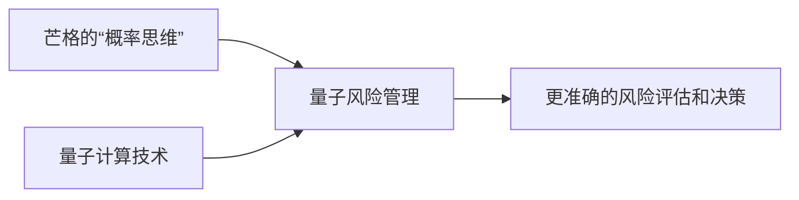

# 芒格的“概率思维”在量子风险管理中的高级应用

> 关键词：芒格、概率思维、量子风险管理、高级应用、风险评估

> 摘要：本文深入探讨了芒格的“概率思维”在量子风险管理中的高级应用。首先介绍了相关背景，包括目的范围、预期读者等。接着阐述了核心概念与联系，分析了核心算法原理并给出Python代码示例。通过数学模型和公式进一步详细讲解，结合项目实战案例进行代码实现和解读。探讨了实际应用场景，推荐了相关的学习资源、开发工具和论文著作。最后总结了未来发展趋势与挑战，并提供常见问题解答和扩展阅读参考资料，旨在为读者全面呈现“概率思维”在量子风险管理中的应用体系。

## 1. 背景介绍 
### 1.1 目的和范围
本文章的目的在于深入研究并阐述芒格的“概率思维”在量子风险管理领域的高级应用。通过对这一主题的探讨，我们期望为相关领域的研究者、从业者以及对该领域感兴趣的人士提供全面且深入的知识和见解。具体范围涵盖了从概率思维的基本概念到其在量子风险管理中的具体应用，包括核心算法原理、数学模型、实际案例分析等方面。

### 1.2 预期读者
预期读者主要包括以下几类人群：
- 金融领域的风险管理专家和从业者，他们希望通过引入新的思维方式和方法来提升量子风险管理的水平。
- 计算机科学和数学领域的研究人员，对跨学科应用有兴趣，特别是概率思维在量子计算相关领域的应用。
- 对投资和决策理论感兴趣的爱好者，希望了解如何运用概率思维进行更科学的决策和风险评估。
- 高校相关专业的学生，如金融工程、量子物理、计算机科学等专业，作为学习和研究的参考资料。

### 1.3 文档结构概述
本文将按照以下结构进行阐述：
- 核心概念与联系：介绍芒格的“概率思维”和量子风险管理的核心概念，并阐述它们之间的联系。
- 核心算法原理 & 具体操作步骤：讲解基于概率思维的量子风险管理算法原理，并给出Python代码示例。
- 数学模型和公式 & 详细讲解 & 举例说明：通过数学模型和公式深入分析概率思维在量子风险管理中的应用，并举例说明。
- 项目实战：代码实际案例和详细解释说明：以实际项目为例，展示如何运用概率思维进行量子风险管理，并对代码进行详细解读。
- 实际应用场景：探讨概率思维在量子风险管理中的实际应用场景。
- 工具和资源推荐：推荐相关的学习资源、开发工具和论文著作。
- 总结：未来发展趋势与挑战：总结概率思维在量子风险管理中的应用现状，分析未来发展趋势和面临的挑战。
- 附录：常见问题与解答：解答读者可能遇到的常见问题。
- 扩展阅读 & 参考资料：提供扩展阅读的建议和相关参考资料。

### 1.4 术语表
#### 1.4.1 核心术语定义
- **芒格的“概率思维”**：由查理·芒格提出的一种思维方式，强调在决策过程中运用概率来评估各种可能性和风险，以做出更理性和科学的决策。
- **量子风险管理**：结合量子计算技术和风险管理理论，对复杂系统中的风险进行评估、分析和控制的过程。
- **概率分布**：描述随机变量取值的概率规律的函数，常见的有正态分布、泊松分布等。
- **风险度量**：用于衡量风险大小的指标，如方差、标准差、风险价值（VaR）等。

#### 1.4.2 相关概念解释
- **量子计算**：基于量子力学原理的计算方式，具有强大的计算能力，能够处理复杂的问题。
- **风险管理**：识别、评估和应对风险的过程，旨在降低风险对目标的影响。
- **决策理论**：研究如何在不确定情况下做出最优决策的理论。

#### 1.4.3 缩略词列表
- **VaR**：Value at Risk，风险价值
- **CVaR**：Conditional Value at Risk，条件风险价值

## 2. 核心概念与联系 

### 芒格的“概率思维”核心原理
芒格的“概率思维”核心在于认识到世界是充满不确定性的，决策往往是在不完全信息的情况下做出的。因此，我们需要运用概率来量化各种可能性，从而更好地评估风险和收益。其基本思想是，在面对一个决策时，我们应该考虑所有可能的结果及其发生的概率，而不是仅仅关注最可能的结果。

例如，在投资决策中，我们不能仅仅根据过去的业绩来预测未来的收益，而应该考虑到市场的不确定性和各种可能的情况。通过分析不同情况下的概率和收益，我们可以制定出更合理的投资策略。

### 量子风险管理的核心原理
量子风险管理结合了量子计算的强大能力和风险管理的理论方法。量子计算能够在短时间内处理大量的数据和复杂的计算，从而为风险管理提供更准确和及时的信息。

量子风险管理的核心在于利用量子算法来优化风险评估和决策过程。例如，通过量子退火算法可以在复杂的风险空间中找到最优的风险控制策略。

### 两者的联系
芒格的“概率思维”为量子风险管理提供了一种重要的思维方式。在量子风险管理中，我们需要运用概率来描述和评估风险，而“概率思维”强调了对概率的重视和正确运用。

同时，量子计算技术为“概率思维”的应用提供了更强大的工具。通过量子计算，我们可以更准确地计算各种事件的概率，从而更好地进行风险评估和决策。

### 文本示意图
```plaintext
芒格的“概率思维”
    |
    | 提供思维方式
    v
量子风险管理
    |
    | 利用量子计算技术
    v
更准确的风险评估和决策
```

### Mermaid流程图


## 3. 核心算法原理 & 具体操作步骤 

### 核心算法原理
在量子风险管理中，我们可以运用蒙特卡罗模拟结合概率思维来评估风险。蒙特卡罗模拟是一种基于随机抽样的统计方法，通过大量的随机模拟来估计某个事件的概率和期望值。

具体来说，我们可以根据历史数据或专家经验确定各种风险因素的概率分布，然后通过随机抽样生成大量的模拟场景。对于每个模拟场景，我们可以计算出相应的风险指标，如风险价值（VaR）和条件风险价值（CVaR）。最后，通过对所有模拟场景的风险指标进行统计分析，我们可以得到风险的概率分布和期望值。

### 具体操作步骤
1. **确定风险因素和概率分布**：根据实际情况确定影响风险的因素，并确定每个因素的概率分布。例如，市场收益率可以假设为正态分布。
2. **生成随机样本**：使用随机数生成器从每个风险因素的概率分布中生成大量的随机样本。
3. **计算风险指标**：对于每个随机样本，计算相应的风险指标，如VaR和CVaR。
4. **统计分析**：对所有模拟场景的风险指标进行统计分析，得到风险的概率分布和期望值。

### Python源代码示例
```python
import numpy as np
import scipy.stats as stats

# 步骤1：确定风险因素和概率分布
# 假设市场收益率服从正态分布，均值为0.05，标准差为0.2
mean_return = 0.05
std_return = 0.2

# 步骤2：生成随机样本
num_simulations = 10000
simulated_returns = np.random.normal(mean_return, std_return, num_simulations)

# 步骤3：计算风险指标
# 计算VaR和CVaR
confidence_level = 0.95
sorted_returns = np.sort(simulated_returns)
var_index = int((1 - confidence_level) * num_simulations)
var = -sorted_returns[var_index]
cvar = -np.mean(sorted_returns[:var_index])

# 步骤4：输出结果
print(f"VaR at {confidence_level * 100}% confidence level: {var:.4f}")
print(f"CVaR at {confidence_level * 100}% confidence level: {cvar:.4f}")
```

### 代码解释
- 首先，我们使用`numpy`库的`random.normal`函数生成了10000个服从正态分布的随机样本，模拟市场收益率。
- 然后，我们对这些样本进行排序，并根据置信水平计算VaR和CVaR。
- 最后，我们输出计算结果。

## 4. 数学模型和公式 & 详细讲解 & 举例说明 

### 风险价值（VaR）的数学模型和公式
风险价值（VaR）是指在一定的置信水平下，某一投资组合在未来特定时期内可能遭受的最大损失。其数学定义如下：

设 $R$ 为投资组合的收益率，$F_R(r)$ 为 $R$ 的累积分布函数，则在置信水平 $1 - \alpha$ 下的VaR定义为：

$$VaR_{\alpha} = -inf\{r \in R: F_R(r) \geq \alpha\}$$

### 详细讲解
VaR的计算本质上是在收益率的累积分布函数中找到一个分位数。具体来说，我们首先需要确定置信水平 $\alpha$，然后在收益率的累积分布函数中找到使得 $F_R(r) \geq \alpha$ 的最小 $r$ 值，取其相反数即为VaR。

### 举例说明
假设我们有一个投资组合，其收益率服从正态分布 $N(\mu, \sigma^2)$，其中 $\mu = 0.05$，$\sigma = 0.2$。我们要计算在95%置信水平下的VaR。

首先，我们需要找到标准正态分布的分位数 $z_{\alpha}$，使得 $P(Z \leq z_{\alpha}) = \alpha$，其中 $Z$ 是标准正态分布随机变量。对于 $\alpha = 0.05$，$z_{\alpha} = -1.645$。

然后，我们可以使用以下公式计算VaR：

$$VaR = -(\mu + z_{\alpha} \sigma)$$

将 $\mu = 0.05$，$\sigma = 0.2$，$z_{\alpha} = -1.645$ 代入公式，得到：

$$VaR = -(0.05 - 1.645 \times 0.2) = 0.279$$

这意味着在95%的置信水平下，该投资组合在未来特定时期内可能遭受的最大损失为27.9%。

### 条件风险价值（CVaR）的数学模型和公式
条件风险价值（CVaR）是指在一定的置信水平下，投资组合在超过VaR的情况下的平均损失。其数学定义如下：

设 $R$ 为投资组合的收益率，$VaR_{\alpha}$ 为在置信水平 $1 - \alpha$ 下的VaR，则CVaR定义为：

$$CVaR_{\alpha} = E[-R | -R \geq VaR_{\alpha}]$$

### 详细讲解
CVaR的计算需要在超过VaR的情况下计算收益率的期望值。具体来说，我们首先需要确定VaR，然后在收益率小于等于 $-VaR$ 的情况下计算收益率的平均值，取其相反数即为CVaR。

### 举例说明
继续以上面的投资组合为例，我们已经计算出在95%置信水平下的VaR为0.279。现在我们要计算CVaR。

我们可以使用蒙特卡罗模拟的方法来计算CVaR。具体来说，我们生成大量的随机样本，计算每个样本的收益率，然后找出收益率小于等于 $-0.279$ 的样本，计算这些样本的平均收益率，取其相反数即为CVaR。

以下是Python代码示例：
```python
import numpy as np
import scipy.stats as stats

# 假设市场收益率服从正态分布，均值为0.05，标准差为0.2
mean_return = 0.05
std_return = 0.2

# 生成随机样本
num_simulations = 10000
simulated_returns = np.random.normal(mean_return, std_return, num_simulations)

# 计算VaR
confidence_level = 0.95
sorted_returns = np.sort(simulated_returns)
var_index = int((1 - confidence_level) * num_simulations)
var = -sorted_returns[var_index]

# 计算CVaR
cvar = -np.mean(sorted_returns[:var_index])

print(f"VaR at {confidence_level * 100}% confidence level: {var:.4f}")
print(f"CVaR at {confidence_level * 100}% confidence level: {cvar:.4f}")
```

通过以上代码，我们可以计算出在95%置信水平下的CVaR。

## 5. 项目实战：代码实际案例和详细解释说明 

### 5.1  开发环境搭建
在进行项目实战之前，我们需要搭建开发环境。以下是具体步骤：

#### 安装Python
首先，我们需要安装Python。可以从Python官方网站（https://www.python.org/downloads/）下载适合自己操作系统的Python版本，并按照安装向导进行安装。

#### 安装必要的库
我们需要安装一些必要的Python库，如`numpy`、`scipy`等。可以使用以下命令进行安装：
```sh
pip install numpy scipy
```

### 5.2  源代码详细实现和代码解读
以下是一个完整的项目实战代码示例，用于计算投资组合的VaR和CVaR：

```python
import numpy as np
import scipy.stats as stats

# 步骤1：定义投资组合的参数
# 假设投资组合由两种资产组成，每种资产的权重分别为0.6和0.4
weights = np.array([0.6, 0.4])

# 每种资产的预期收益率和协方差矩阵
expected_returns = np.array([0.1, 0.15])
cov_matrix = np.array([[0.04, 0.02], [0.02, 0.09]])

# 步骤2：生成随机样本
num_simulations = 10000
simulated_portfolio_returns = []

for _ in range(num_simulations):
    # 生成每种资产的随机收益率
    asset_returns = np.random.multivariate_normal(expected_returns, cov_matrix)
    
    # 计算投资组合的收益率
    portfolio_return = np.dot(weights, asset_returns)
    simulated_portfolio_returns.append(portfolio_return)

simulated_portfolio_returns = np.array(simulated_portfolio_returns)

# 步骤3：计算风险指标
confidence_level = 0.95
sorted_returns = np.sort(simulated_portfolio_returns)
var_index = int((1 - confidence_level) * num_simulations)
var = -sorted_returns[var_index]
cvar = -np.mean(sorted_returns[:var_index])

# 步骤4：输出结果
print(f"VaR at {confidence_level * 100}% confidence level: {var:.4f}")
print(f"CVaR at {confidence_level * 100}% confidence level: {cvar:.4f}")
```

### 代码解读
1. **步骤1：定义投资组合的参数**
    - `weights`：定义了投资组合中每种资产的权重。
    - `expected_returns`：定义了每种资产的预期收益率。
    - `cov_matrix`：定义了每种资产之间的协方差矩阵。

2. **步骤2：生成随机样本**
    - 使用`np.random.multivariate_normal`函数生成每种资产的随机收益率。
    - 通过`np.dot`函数计算投资组合的收益率。
    - 将每次模拟的投资组合收益率存储在`simulated_portfolio_returns`列表中。

3. **步骤3：计算风险指标**
    - 对模拟的投资组合收益率进行排序。
    - 根据置信水平计算VaR和CVaR。

4. **步骤4：输出结果**
    - 输出计算得到的VaR和CVaR。

### 5.3  代码解读与分析
通过以上代码，我们可以看到如何运用蒙特卡罗模拟和概率思维来计算投资组合的VaR和CVaR。这种方法的优点是可以处理复杂的投资组合和风险因素，并且可以考虑到各种可能的情况。

然而，这种方法也存在一些局限性。例如，需要大量的模拟次数才能得到准确的结果，计算成本较高。此外，模拟结果的准确性还依赖于所假设的概率分布和参数的准确性。

## 6. 实际应用场景 
### 金融投资领域
在金融投资领域，芒格的“概率思维”和量子风险管理可以用于投资组合的优化和风险控制。通过运用概率思维评估不同资产的风险和收益，结合量子计算技术进行复杂的计算，可以找到最优的投资组合，降低投资风险。

例如，在股票投资中，我们可以使用概率思维分析不同股票的涨跌概率，结合量子风险管理方法计算投资组合的VaR和CVaR，从而制定合理的投资策略。

### 保险行业
在保险行业，概率思维和量子风险管理可以用于风险评估和保险费率的确定。通过对保险标的的风险进行概率分析，结合量子计算技术进行更准确的风险评估，可以制定合理的保险费率，提高保险公司的盈利能力和风险控制能力。

例如，在人寿保险中，我们可以使用概率思维分析被保险人的死亡概率，结合量子风险管理方法计算保险赔付的风险，从而确定合理的保险费率。

### 供应链管理
在供应链管理中，概率思维和量子风险管理可以用于供应链风险的评估和应对。通过对供应链中的各种风险因素进行概率分析，结合量子计算技术进行复杂的计算，可以制定合理的供应链风险管理策略，降低供应链中断的风险。

例如，在原材料采购中，我们可以使用概率思维分析原材料价格波动的概率，结合量子风险管理方法计算采购成本的风险，从而制定合理的采购策略。

## 7. 工具和资源推荐
### 7.1 学习资源推荐
#### 7.1.1 书籍推荐
- 《穷查理宝典：查理·芒格的智慧箴言录》：介绍了芒格的投资理念和思维方式，包括概率思维。
- 《风险管理与金融机构》：全面介绍了风险管理的理论和方法，包括VaR和CVaR的计算。
- 《量子计算与量子信息》：介绍了量子计算的基本原理和应用。

#### 7.1.2 在线课程
- Coursera上的“Quantitative Risk Management”：提供了风险管理的定量分析方法和技术。
- edX上的“Quantum Computing for Everyone”：介绍了量子计算的基本概念和应用。

#### 7.1.3 技术博客和网站
- Medium上的“Towards Data Science”：提供了大量关于数据分析和风险管理的文章。
- arXiv.org：提供了最新的学术研究论文，包括量子计算和风险管理领域的研究。

### 7.2 开发工具框架推荐
#### 7.2.1 IDE和编辑器
- PyCharm：一款功能强大的Python集成开发环境，适合进行Python代码的开发和调试。
- Jupyter Notebook：一种交互式的开发环境，适合进行数据分析和可视化。

#### 7.2.2 调试和性能分析工具
- pdb：Python自带的调试工具，可以帮助我们调试代码。
- cProfile：Python自带的性能分析工具，可以帮助我们分析代码的性能瓶颈。

#### 7.2.3 相关框架和库
- numpy：用于进行数值计算和数组操作。
- scipy：提供了丰富的科学计算工具和算法。
- qiskit：IBM开发的量子计算框架，用于进行量子算法的开发和模拟。

### 7.3 相关论文著作推荐
#### 7.3.1 经典论文
- “Value at Risk: The New Benchmark for Managing Financial Risk”：介绍了VaR的概念和计算方法。
- “Quantum Algorithms for Financial Risk Analysis”：探讨了量子算法在金融风险分析中的应用。

#### 7.3.2 最新研究成果
- 可以关注arXiv.org上关于量子计算和风险管理的最新研究论文。

#### 7.3.3 应用案例分析
- 可以参考一些金融机构和企业的风险管理报告，了解概率思维和量子风险管理在实际应用中的案例。

## 8. 总结：未来发展趋势与挑战
### 未来发展趋势
- **跨学科融合**：概率思维、量子计算和风险管理将进一步融合，形成更加复杂和高效的风险管理方法。
- **智能化应用**：随着人工智能技术的发展，风险管理将更加智能化，能够自动识别和应对各种风险。
- **实时风险管理**：借助量子计算的强大能力，风险管理将实现实时监测和决策，提高风险管理的效率和准确性。

### 挑战
- **技术难题**：量子计算技术仍处于发展阶段，存在着稳定性、可扩展性等技术难题，需要进一步研究和突破。
- **数据质量**：风险管理依赖于大量的数据，数据的质量和准确性对风险管理的效果有着重要影响。因此，需要加强数据管理和质量控制。
- **人才短缺**：跨学科的风险管理人才短缺，需要培养更多既懂概率思维和量子计算，又懂风险管理的复合型人才。

## 9. 附录：常见问题与解答
### 问题1：什么是概率思维？
概率思维是一种基于概率的决策方法，强调在决策过程中考虑各种可能的结果及其发生的概率，而不是仅仅关注最可能的结果。

### 问题2：量子风险管理与传统风险管理有什么区别？
量子风险管理结合了量子计算的强大能力和风险管理的理论方法，能够处理更复杂的问题和更大量的数据，从而提供更准确和及时的风险评估和决策。而传统风险管理主要依赖于经典计算方法，处理能力相对有限。

### 问题3：如何应用概率思维进行风险管理？
可以通过以下步骤应用概率思维进行风险管理：
1. 确定风险因素和概率分布。
2. 生成随机样本。
3. 计算风险指标，如VaR和CVaR。
4. 根据风险指标制定风险管理策略。

### 问题4：量子计算在风险管理中有哪些应用？
量子计算在风险管理中的应用包括：
1. 优化风险评估和决策过程。
2. 处理复杂的风险模型和大量的数据。
3. 提高风险管理的效率和准确性。

## 10. 扩展阅读 & 参考资料
### 扩展阅读
- 《思考，快与慢》：介绍了人类的思维方式和决策过程，对概率思维的理解有一定的帮助。
- 《量子力学导论》：深入介绍了量子力学的基本原理和概念，有助于理解量子计算在风险管理中的应用。

### 参考资料
- 《穷查理宝典：查理·芒格的智慧箴言录》
- 《风险管理与金融机构》
- 《量子计算与量子信息》
- “Value at Risk: The New Benchmark for Managing Financial Risk”
- “Quantum Algorithms for Financial Risk Analysis”

作者：AI天才研究院/AI Genius Institute & 禅与计算机程序设计艺术 /Zen And The Art of Computer Programming