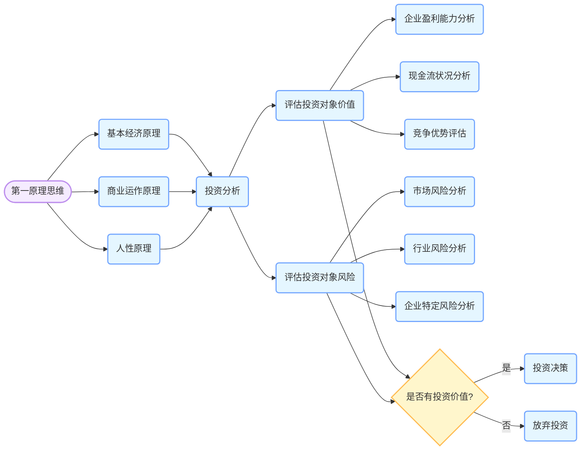

# 芒格的“第一原理”思维在投资分析中的应用

> 关键词：芒格、第一原理思维、投资分析、价值投资、底层逻辑

> 摘要：本文深入探讨了芒格的“第一原理”思维在投资分析中的应用。首先介绍了背景信息，包括目的范围、预期读者等。接着阐述了“第一原理”思维的核心概念及其与投资分析的联系，通过文本示意图和 Mermaid 流程图进行直观展示。详细讲解了核心算法原理，并用 Python 代码举例说明。同时给出了相关数学模型和公式，并进行详细讲解与举例。在项目实战部分，通过具体案例展示了如何在实际投资中运用“第一原理”思维，包括开发环境搭建、源代码实现与解读。还探讨了其实际应用场景，推荐了学习资源、开发工具框架和相关论文著作。最后总结了未来发展趋势与挑战，解答了常见问题，并提供了扩展阅读和参考资料。

## 1. 背景介绍 
### 1.1 目的和范围
本文章的主要目的是深入剖析芒格的“第一原理”思维在投资分析领域的具体应用。通过对“第一原理”思维的理论阐述、算法解析、实际案例分析等多方面的探讨，帮助投资者更好地理解和运用这一思维方式，提高投资决策的准确性和科学性。范围涵盖了“第一原理”思维的基本概念、在投资分析中的核心算法、相关数学模型，以及在不同投资场景下的实际应用等内容。

### 1.2 预期读者
本文预期读者主要包括专业投资者、投资领域的从业者、金融专业的学生以及对投资分析和思维方法感兴趣的爱好者。对于专业投资者和从业者来说，文章可以为他们提供新的投资分析视角和方法；对于金融专业学生，有助于加深他们对投资理论和实践的理解；而对于投资爱好者，能够帮助他们建立科学的投资思维体系。

### 1.3 文档结构概述
本文将按照以下结构进行阐述：首先介绍“第一原理”思维的背景知识，包括相关术语和概念；接着分析其核心概念与投资分析的联系，并通过示意图和流程图进行展示；然后详细讲解核心算法原理，并用 Python 代码实现；之后给出数学模型和公式，并进行详细解释和举例；通过项目实战部分，展示“第一原理”思维在实际投资中的应用；探讨其实际应用场景；推荐相关的学习资源、开发工具框架和论文著作；最后总结未来发展趋势与挑战，解答常见问题，并提供扩展阅读和参考资料。

### 1.4 术语表
#### 1.4.1 核心术语定义
- **第一原理思维**：是一种从最基本的原理出发，通过逻辑推理和分析来解决问题的思维方式。它强调打破传统的思维定式，回到事物的本质去思考和决策。
- **投资分析**：是指对投资对象的基本面、市场环境、风险收益等方面进行研究和评估，以确定投资的可行性和合理性。
- **价值投资**：是一种基于对投资对象内在价值的评估，寻找被低估的资产进行投资的策略。

#### 1.4.2 相关概念解释
- **底层逻辑**：是指事物最本质、最基础的运行规律和原理。在投资分析中，底层逻辑是理解投资对象价值和市场变化的关键。
- **演绎推理**：是从一般性的前提出发，通过推导即“演绎”，得出具体陈述或个别结论的过程。在“第一原理”思维中，演绎推理用于从基本原理推导出具体的投资决策。

#### 1.4.3 缩略词列表
- **DCF**：Discounted Cash Flow，折现现金流，是一种用于评估投资项目或资产价值的方法。
- **PE**：Price-to-Earnings Ratio，市盈率，是衡量股票投资价值的常用指标。

## 2. 核心概念与联系 

### 核心概念原理
“第一原理”思维最早由古希腊哲学家亚里士多德提出，他认为“在每一系统的探索中，存在第一原理，是一个最基本的命题或假设，不能被省略或删除，也不能被违反。”在投资领域，芒格将“第一原理”思维运用到投资分析中，强调要从最基本的经济、商业和人性原理出发，去理解和评估投资对象。

投资分析的核心目标是评估投资对象的价值和风险，以做出合理的投资决策。“第一原理”思维为投资分析提供了一种深入本质、打破常规的思考方式。通过回到投资的基本原理，如企业的盈利能力、现金流状况、竞争优势等，投资者可以更准确地评估投资对象的内在价值，而不受市场情绪和短期波动的影响。

### 文本示意图
```plaintext
第一原理思维
|
|--基本经济原理（供求关系、成本效益等）
|--商业运作原理（商业模式、竞争优势等）
|--人性原理（贪婪、恐惧等）
|
|--投资分析
    |
    |--评估投资对象价值
        |
        |--企业盈利能力分析
        |--现金流状况分析
        |--竞争优势评估
    |
    |--评估投资对象风险
        |
        |--市场风险分析
        |--行业风险分析
        |--企业特定风险分析
    |
    |--投资决策
```

### Mermaid 流程图


## 3. 核心算法原理 & 具体操作步骤 

### 核心算法原理
在投资分析中运用“第一原理”思维的核心算法可以概括为以下几个步骤：
1. **确定基本原理**：明确与投资分析相关的基本经济、商业和人性原理，如供求关系、成本效益原则、企业的核心竞争力等。
2. **收集数据**：收集投资对象的相关数据，包括财务报表、市场数据、行业报告等。
3. **基于原理分析数据**：运用基本原理对收集到的数据进行分析，评估投资对象的价值和风险。
4. **得出结论**：根据分析结果，得出投资决策，如是否投资、投资的金额和时机等。

### Python 代码实现
```python
# 示例：评估企业盈利能力
import pandas as pd

# 模拟企业财务数据
data = {
    '年份': [2018, 2019, 2020, 2021, 2022],
    '营业收入': [1000, 1200, 1300, 1500, 1600],
    '净利润': [100, 120, 130, 150, 160]
}
df = pd.DataFrame(data)

# 计算净利润增长率
df['净利润增长率'] = df['净利润'].pct_change()

# 计算平均净利润增长率
average_growth_rate = df['净利润增长率'].mean()

# 判断企业盈利能力
if average_growth_rate > 0.1:
    print("企业盈利能力较强")
else:
    print("企业盈利能力一般")
```
### 具体操作步骤
1. **步骤一：确定基本原理**
    - 对于企业盈利能力的评估，基本原理是企业的净利润应该保持稳定增长，且增长率要高于一定水平。
2. **步骤二：收集数据**
    - 通过财务报表收集企业的营业收入和净利润数据。
3. **步骤三：基于原理分析数据**
    - 计算净利润增长率，并求出平均增长率。
4. **步骤四：得出结论**
    - 根据平均增长率与设定的阈值（如 0.1）进行比较，判断企业的盈利能力。

## 4. 数学模型和公式 & 详细讲解 & 举例说明 

### 折现现金流（DCF）模型
DCF 模型是一种常用的评估投资对象价值的方法，其基本公式为：
$$
V = \sum_{t=1}^{n} \frac{CF_t}{(1 + r)^t} + \frac{TV}{(1 + r)^n}
$$
其中：
- $V$ 表示投资对象的内在价值
- $CF_t$ 表示第 $t$ 期的现金流
- $r$ 表示折现率
- $n$ 表示预测期数
- $TV$ 表示终值

### 详细讲解
DCF 模型的核心思想是将投资对象未来的现金流折现到当前时刻，以反映其当前的价值。现金流是企业在未来各期产生的现金流入和流出的净额，折现率则反映了投资者对资金时间价值和风险的要求。终值是指预测期结束后投资对象的价值。

### 举例说明
假设一家企业预计未来 5 年的现金流分别为 100 万元、120 万元、130 万元、150 万元和 160 万元，折现率为 10%，预测期结束后的终值为 1000 万元。则该企业的内在价值计算如下：
```python
import numpy as np

# 现金流
cf = np.array([100, 120, 130, 150, 160])
# 折现率
r = 0.1
# 预测期数
n = 5
# 终值
tv = 1000

# 计算各期现金流的现值
pv_cf = cf / (1 + r) ** np.arange(1, n + 1)
# 计算终值的现值
pv_tv = tv / (1 + r) ** n

# 计算内在价值
v = pv_cf.sum() + pv_tv

print(f"企业的内在价值为: {v:.2f} 万元")
```
### 市盈率（PE）模型
市盈率模型是一种相对简单的评估股票投资价值的方法，其公式为：
$$
PE = \frac{P}{E}
$$
其中：
- $PE$ 表示市盈率
- $P$ 表示股票价格
- $E$ 表示每股收益

### 详细讲解
市盈率反映了投资者为获得每一元的净利润所愿意支付的价格。一般来说，市盈率越低，股票越具有投资价值。但需要注意的是，不同行业的市盈率水平可能存在较大差异。

### 举例说明
假设某股票的价格为 20 元，每股收益为 2 元，则该股票的市盈率为：
```python
p = 20
e = 2

pe = p / e

print(f"该股票的市盈率为: {pe}")
```

## 5. 项目实战：代码实际案例和详细解释说明 

### 5.1  开发环境搭建
在进行投资分析的项目实战时，我们可以使用 Python 作为开发语言，以下是搭建开发环境的步骤：
1. **安装 Python**：从 Python 官方网站（https://www.python.org/downloads/）下载并安装适合你操作系统的 Python 版本。建议安装 Python 3.7 及以上版本。
2. **安装开发工具**：可以选择使用 PyCharm、Jupyter Notebook 等开发工具。PyCharm 是一款功能强大的 Python 集成开发环境，适合进行大型项目的开发；Jupyter Notebook 则更适合进行交互式的数据分析和代码演示。
3. **安装必要的库**：在投资分析中，我们需要使用一些常用的库，如 Pandas、Numpy、Matplotlib 等。可以使用以下命令进行安装：
```sh
pip install pandas numpy matplotlib
```

### 5.2  源代码详细实现和代码解读
以下是一个使用“第一原理”思维进行股票投资分析的实际案例，我们将通过分析一家公司的财务数据来评估其投资价值。

```python
import pandas as pd
import matplotlib.pyplot as plt

# 读取财务数据
data = pd.read_csv('financial_data.csv')

# 计算关键指标
data['净利润增长率'] = data['净利润'].pct_change()
data['净资产收益率'] = data['净利润'] / data['净资产']

# 可视化分析
plt.figure(figsize=(12, 6))

# 绘制净利润增长率曲线
plt.subplot(2, 1, 1)
plt.plot(data['年份'], data['净利润增长率'])
plt.title('净利润增长率')
plt.xlabel('年份')
plt.ylabel('增长率')

# 绘制净资产收益率曲线
plt.subplot(2, 1, 2)
plt.plot(data['年份'], data['净资产收益率'])
plt.title('净资产收益率')
plt.xlabel('年份')
plt.ylabel('收益率')

plt.tight_layout()
plt.show()

# 评估投资价值
if data['净利润增长率'].mean() > 0.1 and data['净资产收益率'].mean() > 0.15:
    print("该公司具有较高的投资价值")
else:
    print("该公司投资价值一般")
```
### 代码解读
1. **读取财务数据**：使用 Pandas 库的 `read_csv` 函数读取存储在 CSV 文件中的财务数据。
2. **计算关键指标**：计算净利润增长率和净资产收益率，这两个指标是评估企业盈利能力和股东回报能力的重要指标。
3. **可视化分析**：使用 Matplotlib 库绘制净利润增长率和净资产收益率的曲线，直观地展示企业的发展趋势。
4. **评估投资价值**：根据净利润增长率和净资产收益率的平均值，判断该公司是否具有较高的投资价值。

### 5.3  代码解读与分析
通过上述代码，我们可以对一家公司的财务状况进行全面的分析。净利润增长率反映了企业的盈利增长能力，净资产收益率则反映了企业运用自有资本的效率。如果这两个指标都表现良好，说明该公司具有较强的盈利能力和股东回报能力，具有较高的投资价值。

需要注意的是，投资分析是一个复杂的过程，不能仅仅依靠这两个指标来做出决策。还需要考虑行业竞争、市场环境、宏观经济等因素。同时，财务数据的真实性和准确性也需要进行严格的审核。

## 6. 实际应用场景 
### 股票投资
在股票投资中，“第一原理”思维可以帮助投资者深入分析企业的基本面，寻找具有长期投资价值的股票。通过回到企业的基本原理，如商业模式、竞争优势、盈利能力等，投资者可以避免被市场短期波动和热点所迷惑，做出更理性的投资决策。

### 债券投资
在债券投资中，“第一原理”思维可以用于评估债券的信用风险和收益水平。投资者可以从债券发行主体的财务状况、经营稳定性等基本原理出发，分析债券的违约风险和实际收益率，从而选择合适的债券进行投资。

### 基金投资
在基金投资中，“第一原理”思维可以帮助投资者选择优秀的基金经理和基金产品。投资者可以从基金经理的投资理念、投资策略、历史业绩等基本原理出发，评估基金的投资价值和风险水平，做出合理的投资选择。

### 房地产投资
在房地产投资中，“第一原理”思维可以用于评估房地产项目的价值和投资潜力。投资者可以从房地产的地理位置、市场需求、租金回报率等基本原理出发，分析房地产项目的投资价值和风险，做出明智的投资决策。

## 7. 工具和资源推荐
### 7.1 学习资源推荐
#### 7.1.1 书籍推荐
- 《穷查理宝典：查理·芒格的智慧箴言录》：本书收录了芒格的演讲、文章和名言，全面展示了他的投资理念和思维方式。
- 《价值投资：从格雷厄姆到巴菲特》：详细介绍了价值投资的理论和实践，是价值投资者的必读之书。
- 《聪明的投资者》：本杰明·格雷厄姆的经典著作，被誉为投资界的“圣经”，对投资分析和风险管理有深刻的阐述。

#### 7.1.2 在线课程
- Coursera 上的“投资学原理”：由知名大学教授授课，系统讲解投资学的基本原理和方法。
- edX 上的“金融市场与投资策略”：提供了丰富的金融市场和投资策略的知识，适合初学者和进阶者。

#### 7.1.3 技术博客和网站
- 雪球网：国内知名的投资社区，提供了丰富的股票分析、投资策略和投资者交流的内容。
- Seeking Alpha：国外知名的投资分析网站，汇聚了众多专业投资者和分析师的观点和研究报告。

### 7.2 开发工具框架推荐
#### 7.2.1 IDE和编辑器
- PyCharm：功能强大的 Python 集成开发环境，提供了代码编辑、调试、版本控制等一系列功能。
- Jupyter Notebook：交互式的数据分析和代码演示工具，适合进行快速的数据分析和模型验证。

#### 7.2.2 调试和性能分析工具
- Py-Spy：用于分析 Python 代码的性能瓶颈，找出耗时较长的代码段。
- PDB：Python 自带的调试工具，可以帮助开发者定位和解决代码中的问题。

#### 7.2.3 相关框架和库
- Pandas：用于数据处理和分析的 Python 库，提供了高效的数据结构和数据分析工具。
- Numpy：用于科学计算的 Python 库，提供了多维数组和矩阵运算的功能。
- Matplotlib：用于数据可视化的 Python 库，可以绘制各种类型的图表和图形。

### 7.3 相关论文著作推荐
#### 7.3.1 经典论文
- 《证券分析》（Security Analysis）：本杰明·格雷厄姆和戴维·多德的经典论文，奠定了价值投资的理论基础。
- 《有效市场假说》（Efficient Market Hypothesis）：尤金·法玛提出的理论，对金融市场的有效性进行了深入探讨。

#### 7.3.2 最新研究成果
- 《行为金融学》（Behavioral Finance）：研究投资者的心理和行为对金融市场的影响，是近年来金融领域的热门研究方向。
- 《人工智能在投资分析中的应用》：探讨了人工智能技术在投资分析中的应用前景和挑战。

#### 7.3.3 应用案例分析
- 《巴菲特的投资案例分析》：详细分析了巴菲特的投资策略和经典案例，为投资者提供了宝贵的经验和启示。
- 《量化投资的实战案例》：介绍了量化投资的方法和实践，通过实际案例展示了量化投资的效果和优势。

## 8. 总结：未来发展趋势与挑战
### 未来发展趋势
1. **与人工智能的融合**：随着人工智能技术的不断发展，“第一原理”思维与人工智能的融合将成为未来投资分析的重要趋势。人工智能可以帮助投资者更高效地收集和分析数据，挖掘隐藏在数据中的规律和价值，从而提高投资决策的准确性和科学性。
2. **跨领域应用**：“第一原理”思维不仅可以应用于传统的金融投资领域，还将在科技、医疗、能源等多个领域得到广泛应用。通过跨领域的应用，投资者可以发现更多的投资机会，实现多元化的投资组合。
3. **个性化投资**：未来，投资者对个性化投资的需求将越来越高。“第一原理”思维可以帮助投资者根据自己的风险偏好、投资目标和财务状况，制定个性化的投资策略，实现个性化的投资服务。

### 挑战
1. **数据质量和可靠性**：在投资分析中，数据的质量和可靠性是至关重要的。然而，由于数据来源的多样性和复杂性，数据质量和可靠性往往难以保证。投资者需要花费大量的时间和精力来收集、清洗和验证数据，以确保数据的准确性和可靠性。
2. **模型的局限性**：虽然数学模型和算法可以帮助投资者进行投资分析，但模型本身存在一定的局限性。模型往往是基于历史数据和假设条件建立的，而市场环境和投资对象是不断变化的，模型可能无法准确预测未来的市场走势和投资回报。
3. **投资者的心理和行为**：投资者的心理和行为对投资决策有着重要的影响。在实际投资中，投资者往往会受到贪婪、恐惧、从众等心理因素的影响，做出非理性的投资决策。如何克服投资者的心理和行为偏差，是“第一原理”思维在投资分析中面临的一个重要挑战。

## 9. 附录：常见问题与解答
### 问题 1：“第一原理”思维与传统投资分析方法有什么区别？
“第一原理”思维强调从最基本的原理出发，打破传统的思维定式，深入到事物的本质去思考和决策。而传统投资分析方法往往依赖于历史数据和经验，容易受到市场情绪和短期波动的影响。“第一原理”思维可以帮助投资者更准确地评估投资对象的内在价值，做出更理性的投资决策。

### 问题 2：如何确定与投资分析相关的基本原理？
确定与投资分析相关的基本原理需要投资者具备丰富的知识和经验。投资者可以从经济学、商业、心理学等多个领域寻找基本原理，如供求关系、成本效益原则、企业的核心竞争力、投资者的心理和行为等。同时，投资者还需要不断学习和实践，总结经验教训，逐步提高自己确定基本原理的能力。

### 问题 3：“第一原理”思维在投资分析中是否适用于所有投资对象？
“第一原理”思维在投资分析中具有广泛的适用性，但并不是适用于所有投资对象。对于一些新兴的、不确定性较大的投资对象，如初创企业、虚拟货币等，由于缺乏历史数据和成熟的商业模式，“第一原理”思维的应用可能会受到一定的限制。在这种情况下，投资者需要结合其他方法和信息进行综合分析。

### 问题 4：如何运用“第一原理”思维进行风险管理？
运用“第一原理”思维进行风险管理，需要投资者从风险的本质出发，分析风险产生的原因和影响因素。投资者可以通过评估投资对象的内在价值、市场环境、行业竞争等因素，识别潜在的风险。同时，投资者还可以通过分散投资、设置止损点等方法，降低风险的影响。

## 10. 扩展阅读 & 参考资料
### 扩展阅读
- 《思考，快与慢》：丹尼尔·卡尼曼的经典著作，介绍了人类思维的两种模式，对投资者理解自己的心理和行为偏差有很大的帮助。
- 《黑天鹅：如何应对不可预知的未来》：纳西姆·尼古拉斯·塔勒布的著作，探讨了不确定性和极端事件对投资和生活的影响。

### 参考资料
- 查理·芒格的演讲和文章
- 金融学术期刊和研究报告
- 知名投资机构和分析师的研究成果

作者：AI天才研究院/AI Genius Institute & 禅与计算机程序设计艺术 /Zen And The Art of Computer Programming