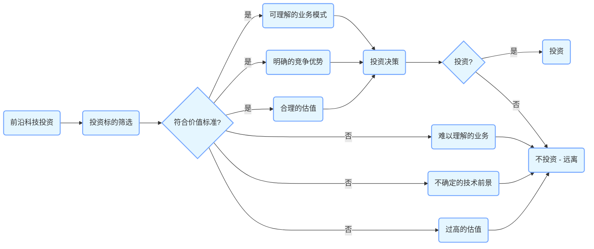

# 芒格的“远离”策略在前沿科技投资中的重要性

> 关键词：芒格、“远离”策略、前沿科技投资、风险规避、价值投资

> 摘要：本文深入探讨了芒格的“远离”策略在前沿科技投资领域的重要性。从背景介绍出发，阐述了该策略相关的核心概念及联系，详细分析了其核心算法原理与操作步骤，引入数学模型进行理论支撑，并通过实际案例展示了该策略在前沿科技投资中的应用。同时，介绍了实际应用场景、推荐了相关工具和资源，最后总结了未来发展趋势与挑战，解答常见问题并提供扩展阅读与参考资料，旨在为投资者在前沿科技投资中运用“远离”策略提供全面且深入的指导。

## 1. 背景介绍 
### 1.1 目的和范围
本文旨在全面剖析芒格的“远离”策略在前沿科技投资中的重要性。前沿科技领域如人工智能、量子计算、生物技术等发展迅速，但同时也伴随着高度的不确定性和风险。芒格作为投资界的传奇人物，其“远离”策略蕴含着深刻的投资智慧。通过本文的研究，我们将探讨如何运用这一策略识别前沿科技投资中的风险，避免陷入潜在的投资陷阱，从而提高投资决策的质量和成功率。研究范围涵盖了前沿科技各个领域的投资场景，以及“远离”策略在不同市场环境下的应用。

### 1.2 预期读者
本文的预期读者主要包括对前沿科技投资感兴趣的投资者，无论是个人投资者还是专业投资机构的从业者。同时，对于从事金融研究、科技行业分析的学者和研究人员也具有一定的参考价值。此外，科技创业者在寻求融资和制定商业战略时，也可以从本文中获得关于投资风险和价值判断的启示。

### 1.3 文档结构概述
本文将按照以下结构展开：首先介绍核心概念与联系，明确芒格“远离”策略以及前沿科技投资的相关概念，并展示它们之间的关系；接着阐述核心算法原理和具体操作步骤，通过Python代码进行详细说明；然后引入数学模型和公式，结合实例进行讲解；之后通过项目实战展示代码案例并进行详细解读；再介绍该策略在实际中的应用场景；推荐相关的工具和资源；总结未来发展趋势与挑战；在附录中解答常见问题；最后提供扩展阅读和参考资料。

### 1.4 术语表
#### 1.4.1 核心术语定义
- **芒格的“远离”策略**：指查理·芒格在投资过程中，基于对风险、价值等因素的判断，主动避开那些不符合其投资理念、风险过高或难以理解的投资标的的策略。
- **前沿科技投资**：对处于科技发展前沿领域的企业或项目进行的投资活动，这些领域通常具有创新性、高成长性和高风险性，如人工智能、区块链、基因编辑等。
- **风险溢价**：投资者因承担额外风险而要求获得的额外回报。在前沿科技投资中，由于不确定性较高，风险溢价通常也较高。
- **投资护城河**：企业所拥有的一种可持续的竞争优势，使其在市场中能够抵御竞争对手的侵蚀，保持长期的盈利能力。

#### 1.4.2 相关概念解释
- **价值投资**：一种投资理念，强调通过分析企业的基本面，寻找被低估的股票或其他投资标的，以获取长期的投资回报。芒格的“远离”策略是价值投资理念的重要组成部分，通过避开高风险和不合理估值的标的，来确保投资的安全性和价值性。
- **技术泡沫**：在科技领域快速发展过程中，由于市场对新技术的过度乐观预期，导致相关企业的估值大幅高于其实际价值，形成泡沫。当泡沫破裂时，投资者可能遭受巨大损失。“远离”策略有助于投资者在技术泡沫形成过程中保持理性，避免陷入其中。

#### 1.4.3 缩略词列表
- **AI**：人工智能（Artificial Intelligence）
- **QC**：量子计算（Quantum Computing）
- **BI**：生物技术（Biotechnology）

## 2. 核心概念与联系 
### 核心概念原理
芒格的“远离”策略基于价值投资的核心理念，强调投资者应具备理性和独立思考的能力。在前沿科技投资中，由于科技发展的不确定性和市场的炒作氛围，很多投资标的的价格可能偏离其内在价值。芒格认为，投资者应该避免那些自己无法理解其业务模式、技术原理或竞争优势不明确的投资项目。同时，对于那些估值过高、风险过大的项目，也应该果断远离。

例如，在人工智能领域，很多初创企业声称拥有先进的算法和技术，但实际上可能缺乏实际的应用场景和商业变现能力。投资者如果不深入了解这些企业的真实情况，盲目跟风投资，就可能面临巨大的风险。芒格的“远离”策略提醒投资者要保持清醒的头脑，对投资项目进行全面、深入的分析，避免被市场的短期热点所迷惑。

### 架构的文本示意图
```plaintext
前沿科技投资
|
|-- 投资标的筛选
|   |
|   |-- 符合价值标准
|   |   |
|   |   |-- 可理解的业务模式
|   |   |-- 明确的竞争优势
|   |   |-- 合理的估值
|   |
|   |-- 不符合价值标准（远离）
|       |
|       |-- 难以理解的业务
|       |-- 不确定的技术前景
|       |-- 过高的估值
|
|-- 投资决策
|   |
|   |-- 投资
|   |
|   |-- 不投资（远离）
```

### Mermaid 流程图


## 3. 核心算法原理 & 具体操作步骤 
### 核心算法原理
在前沿科技投资中运用芒格的“远离”策略，可以通过构建一个基于多因素评估的算法模型来实现。该模型的核心思想是对投资标的的各个关键因素进行量化评估，根据评估结果判断是否符合投资标准，不符合则选择“远离”。

以下是一个简化的算法原理：
1. **因素选择**：选择影响投资标的价值和风险的关键因素，如业务模式清晰度、技术创新性、市场竞争力、财务状况、估值水平等。
2. **权重分配**：为每个因素分配相应的权重，权重反映了该因素在整体评估中的重要性。
3. **评分体系**：为每个因素建立评分标准，根据投资标的的实际情况给予相应的分数。
4. **综合评估**：将每个因素的得分乘以其权重，然后求和得到投资标的的综合得分。
5. **决策阈值**：设定一个决策阈值，当综合得分低于该阈值时，判断该投资标的不符合投资标准，选择“远离”。

### Python 代码实现
```python
# 定义因素列表和权重
factors = ['业务模式清晰度', '技术创新性', '市场竞争力', '财务状况', '估值水平']
weights = [0.2, 0.2, 0.2, 0.2, 0.2]

# 定义评分函数
def score_investment(investment, factors, weights):
    total_score = 0
    for i, factor in enumerate(factors):
        # 这里简单假设每个因素的评分范围是 0 - 10
        score = float(input(f"请为 {investment} 的 {factor} 因素打分（0 - 10）："))
        total_score += score * weights[i]
    return total_score

# 定义决策阈值
decision_threshold = 6

# 主函数
def main():
    investment = input("请输入投资标的名称：")
    score = score_investment(investment, factors, weights)
    if score < decision_threshold:
        print(f"根据评估，建议远离 {investment}。")
    else:
        print(f"{investment} 符合投资标准，可以进一步考虑。")

if __name__ == "__main__":
    main()
```

### 具体操作步骤
1. **确定投资标的**：明确要评估的前沿科技投资项目。
2. **收集信息**：收集关于该投资标的的详细信息，包括业务模式、技术方案、市场份额、财务报表等。
3. **因素评分**：根据收集到的信息，按照评分标准为每个因素打分。
4. **计算综合得分**：使用上述算法计算投资标的的综合得分。
5. **做出决策**：将综合得分与决策阈值进行比较，若低于阈值则选择“远离”，否则可以进一步考虑投资。

## 4. 数学模型和公式 & 详细讲解 & 举例说明 
### 数学模型和公式
设投资标的的综合得分为 $S$，因素个数为 $n$，第 $i$ 个因素的权重为 $w_i$，第 $i$ 个因素的得分 为 $s_i$，则综合得分的计算公式为：
$$S = \sum_{i=1}^{n} w_i s_i$$
其中，$\sum_{i=1}^{n} w_i = 1$，表示所有因素的权重之和为 1。

### 详细讲解
该数学模型通过对各个因素进行加权求和，综合考虑了多个方面的因素对投资标的的影响。权重 $w_i$ 反映了每个因素在整体评估中的重要性，得分 $s_i$ 则是对该因素具体情况的量化表示。通过这种方式，可以更全面、客观地评估投资标的的价值和风险。

### 举例说明
假设我们要评估一个人工智能初创企业的投资价值，使用上述的 5 个因素进行评估，权重分别为 $w_1 = 0.2$（业务模式清晰度），$w_2 = 0.2$（技术创新性），$w_3 = 0.2$（市场竞争力），$w_4 = 0.2$（财务状况），$w_5 = 0.2$（估值水平）。经过分析和评估，我们为各个因素给出以下得分：$s_1 = 3$（业务模式不太清晰），$s_2 = 7$（技术有一定创新性），$s_3 = 4$（市场竞争力较弱），$s_4 = 2$（财务状况不佳），$s_5 = 8$（估值过高）。

根据公式计算综合得分：
$$S = 0.2 \times 3 + 0.2 \times 7 + 0.2 \times 4 + 0.2 \times 2 + 0.2 \times 8$$
$$S = 0.6 + 1.4 + 0.8 + 0.4 + 1.6$$
$$S = 4.8$$

假设决策阈值为 6，由于 $S = 4.8 < 6$，根据评估结果，建议远离该人工智能初创企业的投资。

## 5. 项目实战：代码实际案例和详细解释说明 
### 5.1  开发环境搭建
为了运行上述 Python 代码，我们需要搭建一个基本的 Python 开发环境。以下是具体步骤：
1. **安装 Python**：从 Python 官方网站（https://www.python.org/downloads/）下载并安装适合你操作系统的 Python 版本。建议选择 Python 3.6 及以上版本。
2. **安装集成开发环境（IDE）**：可以选择 PyCharm、VS Code 等流行的 IDE。这里以 VS Code 为例，下载并安装 VS Code（https://code.visualstudio.com/）。
3. **安装 Python 扩展**：打开 VS Code，在扩展市场中搜索“Python”，安装 Microsoft 提供的 Python 扩展。
4. **创建项目文件夹**：在本地创建一个新的文件夹，用于存放项目代码。
5. **打开项目文件夹**：在 VS Code 中选择“文件” -> “打开文件夹”，选择刚刚创建的项目文件夹。

### 5.2  源代码详细实现和代码解读
```python
# 定义因素列表和权重
factors = ['业务模式清晰度', '技术创新性', '市场竞争力', '财务状况', '估值水平']
weights = [0.2, 0.2, 0.2, 0.2, 0.2]

# 定义评分函数
def score_investment(investment, factors, weights):
    total_score = 0
    for i, factor in enumerate(factors):
        # 这里简单假设每个因素的评分范围是 0 - 10
        score = float(input(f"请为 {investment} 的 {factor} 因素打分（0 - 10）："))
        total_score += score * weights[i]
    return total_score

# 定义决策阈值
decision_threshold = 6

# 主函数
def main():
    investment = input("请输入投资标的名称：")
    score = score_investment(investment, factors, weights)
    if score < decision_threshold:
        print(f"根据评估，建议远离 {investment}。")
    else:
        print(f"{investment} 符合投资标准，可以进一步考虑。")

if __name__ == "__main__":
    main()
```
### 代码解读与分析
1. **因素列表和权重定义**：`factors` 列表存储了用于评估投资标的的关键因素，`weights` 列表为每个因素分配了相应的权重。这里我们假设每个因素的权重相等，实际应用中可以根据具体情况进行调整。
2. **评分函数 `score_investment`**：该函数接受投资标的名称、因素列表和权重列表作为参数。通过循环遍历每个因素，提示用户输入该因素的得分，并将得分乘以权重累加到总得分中。最后返回总得分。
3. **决策阈值定义**：`decision_threshold` 变量设定了决策的阈值，当投资标的的综合得分低于该阈值时，建议远离该投资标的。
4. **主函数 `main`**：首先提示用户输入投资标的名称，然后调用 `score_investment` 函数计算综合得分。根据综合得分与决策阈值的比较结果，输出相应的建议。
5. **代码调用**：`if __name__ == "__main__":` 语句确保代码作为脚本直接运行时，会执行 `main` 函数。

### 代码优化建议
- **数据输入验证**：当前代码没有对用户输入的得分进行验证，可能会导致输入非法数据。可以添加输入验证逻辑，确保用户输入的得分在 0 - 10 范围内。
- **自动化数据获取**：目前得分是通过用户手动输入的，在实际应用中可以通过爬虫、API 等方式自动获取投资标的的相关数据，并根据预设的评分标准进行打分。
- **可视化输出**：可以使用 Python 的可视化库（如 Matplotlib、Seaborn 等）将评估结果以图表的形式展示，使结果更加直观。

## 6. 实际应用场景 
### 新兴技术领域投资
在新兴技术领域，如人工智能、区块链、量子计算等，技术发展迅速，市场变化频繁。很多初创企业可能会提出一些看似新颖但缺乏实际应用价值的技术方案。投资者可以运用芒格的“远离”策略，对那些技术原理复杂、难以理解，或者商业前景不明确的项目保持谨慎态度。例如，在区块链领域，曾经出现过大量的 ICO（首次代币发行）项目，其中很多项目只是打着区块链的旗号进行非法集资，没有实际的业务支撑。投资者如果能够运用“远离”策略，对这些项目进行筛选，就可以避免遭受重大损失。

### 科技泡沫时期投资
在科技泡沫时期，市场对科技股的热情高涨，很多股票的估值远远超过了其实际价值。此时，投资者容易受到市场情绪的影响，盲目跟风投资。芒格的“远离”策略可以帮助投资者保持理性，避免在泡沫高峰期进入市场。例如，在 2000 年的互联网泡沫时期，很多互联网公司的股价被炒到了天价，但实际上这些公司的盈利能力和商业模式并不成熟。当泡沫破裂时，很多投资者损失惨重。如果投资者能够运用“远离”策略，对那些估值过高的互联网公司保持距离，就可以在一定程度上规避风险。

### 跨行业投资决策
当投资者进行跨行业投资时，由于对新行业的了解有限，可能会面临更大的风险。芒格的“远离”策略提醒投资者要充分了解目标行业的特点、竞争格局和技术趋势。如果对某个行业的业务模式和技术原理缺乏深入理解，就应该谨慎投资。例如，一个传统制造业的投资者想要进入生物技术领域，在没有充分了解生物技术行业的研发周期、监管要求和市场竞争情况之前，就贸然投资，可能会面临巨大的风险。此时，运用“远离”策略，先对该行业进行深入研究，再做投资决策，是更为明智的选择。

## 7. 工具和资源推荐
### 7.1 学习资源推荐
#### 7.1.1 书籍推荐
- 《穷查理宝典：查理·芒格的智慧箴言录》：这本书全面介绍了查理·芒格的投资理念、思维方式和人生哲学，是学习芒格投资思想的必读之作。
- 《聪明的投资者》：本杰明·格雷厄姆的经典著作，价值投资的奠基之作，对理解芒格的“远离”策略背后的价值投资理念有很大帮助。
- 《创新者的窘境》：克莱顿·克里斯坦森所著，探讨了新兴技术对传统企业的冲击和影响，有助于投资者理解前沿科技领域的投资风险。

#### 7.1.2 在线课程
- Coursera 上的“投资学原理”课程：由知名大学教授授课，系统介绍了投资学的基本原理和方法，包括价值投资、风险评估等内容。
- edX 上的“金融科技与创新”课程：聚焦于金融科技领域的最新发展，对前沿科技投资有深入的分析和探讨。
- 网易云课堂上的“查理·芒格的多元思维模型”课程：专门讲解芒格的思维方式和投资策略，适合想要深入学习芒格思想的投资者。

#### 7.1.3 技术博客和网站
- Seeking Alpha：一个知名的金融投资博客网站，提供大量的股票分析、投资策略和市场评论文章，其中不乏对前沿科技投资的深入分析。
- TechCrunch：专注于科技行业的新闻和分析网站，及时报道科技领域的最新动态和创新企业，有助于投资者了解前沿科技的发展趋势。
- 雪球财经：国内知名的投资社区，有很多投资者分享自己的投资经验和见解，包括对前沿科技投资的讨论。

### 7.2 开发工具框架推荐
#### 7.2.1 IDE和编辑器
- PyCharm：功能强大的 Python 集成开发环境，提供代码编辑、调试、版本控制等一系列功能，适合开发和调试与投资分析相关的 Python 代码。
- VS Code：轻量级的代码编辑器，支持多种编程语言，通过安装插件可以扩展其功能，是很多开发者喜爱的工具之一。
- Jupyter Notebook：交互式的编程环境，适合进行数据探索、模型验证和可视化展示，在投资数据分析和算法开发中应用广泛。

#### 7.2.2 调试和性能分析工具
- PDB：Python 自带的调试工具，可以帮助开发者逐行调试代码，查找和解决代码中的问题。
- cProfile：Python 的性能分析工具，用于分析代码的运行时间和资源消耗情况，帮助开发者优化代码性能。
- Py-Spy：一个轻量级的 Python 性能分析工具，可以实时监控 Python 程序的运行状态，找出性能瓶颈。

#### 7.2.3 相关框架和库
- Pandas：强大的数据处理和分析库，提供了高效的数据结构和数据操作方法，适合处理和分析投资相关的数据。
- NumPy：Python 的数值计算库，提供了多维数组对象和各种数学函数，在投资模型的计算中应用广泛。
- Scikit-learn：机器学习库，提供了丰富的机器学习算法和工具，可用于构建投资风险评估模型和预测模型。

### 7.3 相关论文著作推荐
#### 7.3.1 经典论文
- Fama, E. F., & French, K. R. (1992). The cross-section of expected stock returns. Journal of Finance, 47(2), 427 - 465. 这篇论文提出了著名的 Fama - French 三因子模型，对理解股票收益率的影响因素有重要意义，在投资领域有广泛的应用。
- Markowitz, H. M. (1952). Portfolio selection. The Journal of Finance, 7(1), 77 - 91. 该论文开创了现代投资组合理论，为投资者进行资产配置提供了理论基础。

#### 7.3.2 最新研究成果
- 关注顶尖学术期刊如 The Journal of Financial Economics、Review of Financial Studies 等，这些期刊经常发表关于投资领域的最新研究成果，包括前沿科技投资的相关研究。
- 参加金融和科技领域的学术会议，如 American Finance Association (AFA) 年会、ACM SIGKDD 会议等，获取最新的研究动态和成果。

#### 7.3.3 应用案例分析
- 《金融科技前沿：应用与实践》：书中收录了大量金融科技领域的应用案例，包括前沿科技投资的成功和失败案例，通过分析这些案例可以学习到实际投资中的经验和教训。
- 一些知名投资机构的研究报告和案例分析，如高盛、摩根士丹利等，这些报告通常会对前沿科技投资项目进行深入分析和评估，具有很高的参考价值。

## 8. 总结：未来发展趋势与挑战
### 未来发展趋势
- **技术融合加速**：未来前沿科技领域将呈现出更加明显的技术融合趋势，如人工智能与生物技术、量子计算与区块链等的融合。这将为投资带来更多的机会，但也增加了投资分析的难度。投资者需要具备跨学科的知识和视野，才能更好地运用“远离”策略识别投资风险。
- **数据驱动投资**：随着大数据、人工智能等技术的发展，投资决策将越来越依赖于数据和算法。投资者可以利用更丰富的数据和更先进的分析工具，对投资标的进行更精准的评估。芒格的“远离”策略也将与数据驱动的投资方法相结合，通过量化分析和模型预测，提高投资决策的科学性和准确性。
- **社会责任投资兴起**：社会对企业的社会责任要求越来越高，投资者在进行前沿科技投资时也会更加关注企业的社会责任表现。具有良好社会责任形象的企业可能会更受投资者青睐，而那些存在道德风险或环境问题的企业可能会被投资者“远离”。

### 挑战
- **技术不确定性增加**：前沿科技的发展速度极快，新技术不断涌现，技术更新换代的周期越来越短。这使得投资者很难准确判断技术的发展趋势和市场前景，增加了运用“远离”策略的难度。例如，一些看似有潜力的新技术可能在短时间内被更先进的技术所取代，导致投资失败。
- **市场炒作和信息不对称**：前沿科技领域容易出现市场炒作现象，一些企业可能会夸大自身的技术实力和商业前景，误导投资者。同时，由于技术的专业性和复杂性，投资者与企业之间存在信息不对称的问题，投资者很难获取到真实、准确的信息。这就要求投资者具备更强的信息甄别能力和风险意识，才能正确运用“远离”策略。
- **监管政策变化**：前沿科技领域的发展往往会带来新的监管问题，监管政策也会随着技术的发展而不断调整。政策的变化可能会对投资项目的可行性和盈利能力产生重大影响。投资者需要密切关注监管政策的变化，及时调整投资策略，避免因政策风险而遭受损失。

## 9. 附录：常见问题与解答
### Q1：芒格的“远离”策略是否意味着完全不投资前沿科技领域？
A1：不是的。芒格的“远离”策略并不是让投资者完全避开前沿科技领域，而是提醒投资者要谨慎选择投资标的。对于那些符合价值投资标准，具有可理解的业务模式、明确的竞争优势和合理估值的前沿科技项目，仍然可以进行投资。“远离”策略主要是帮助投资者避免那些风险过高、难以理解或估值不合理的投资项目。

### Q2：如何确定每个因素的权重和评分标准？
A2：确定因素的权重和评分标准需要综合考虑多个因素。权重可以根据投资者的投资理念、风险偏好和对不同因素的重视程度来确定。例如，对于更注重技术创新性的投资者，可以适当提高“技术创新性”因素的权重。评分标准可以参考行业平均水平、历史数据和专家意见等。例如，对于“财务状况”因素，可以根据企业的盈利能力、偿债能力等指标制定具体的评分标准。在实际应用中，投资者可以根据经验和实践不断调整权重和评分标准，以提高评估的准确性。

### Q3：如果投资标的的综合得分接近决策阈值，应该如何决策？
A3：当投资标的的综合得分接近决策阈值时，投资者需要更加谨慎地进行决策。可以进一步深入分析该投资标的的各个因素，查找得分较低的因素是否存在改善的可能性。同时，可以参考其他投资者的意见和市场反馈，综合考虑各种因素后再做决策。此外，也可以适当延长观察期，等待更多的信息和数据出现后再做决定。

### Q4：芒格的“远离”策略在不同市场环境下的效果如何？
A4：芒格的“远离”策略在不同市场环境下都具有一定的有效性。在市场繁荣时期，该策略可以帮助投资者避免陷入泡沫化的投资项目，保护投资本金。在市场低迷时期，通过筛选出真正有价值的投资标的，可以为投资者提供更好的投资机会。然而，市场环境是复杂多变的，“远离”策略也不能保证完全避免投资风险。投资者需要根据市场情况灵活运用该策略，并结合其他投资方法进行综合决策。

## 10. 扩展阅读 & 参考资料
### 扩展阅读
- 《投资最重要的事》：霍华德·马克斯所著，深入探讨了投资中的风险管理和价值判断，与芒格的投资思想有很多相通之处。
- 《黑天鹅：如何应对不可预知的未来》：纳西姆·尼古拉斯·塔勒布的经典著作，提醒投资者要关注市场中的不确定性和极端事件，对理解前沿科技投资中的风险有重要启示。
- 《从 0 到 1：开启商业与未来的秘密》：彼得·蒂尔的著作，探讨了创新企业的发展规律和投资机会，适合对前沿科技创业投资感兴趣的读者。

### 参考资料
- Munger, C. T. (2005). Poor Charlie's Almanack: The Wit and Wisdom of Charles T. Munger. Donning Company Publishers.
- Graham, B. (1949). The Intelligent Investor. HarperBusiness.
- Christensen, C. M. (1997). The Innovator's Dilemma: When New Technologies Cause Great Firms to Fail. Harvard Business School Press.

作者：AI天才研究院/AI Genius Institute & 禅与计算机程序设计艺术 /Zen And The Art of Computer Programming