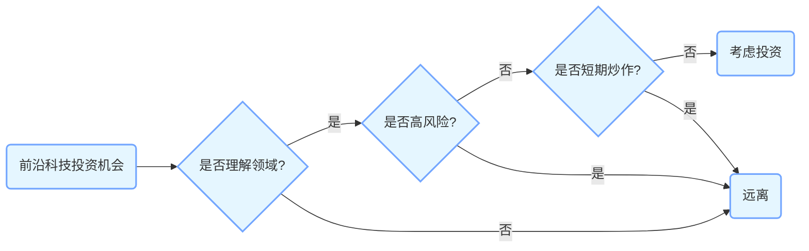

# 芒格的"远离"策略在前沿科技投资中的重要性

> 关键词：芒格、“远离”策略、前沿科技投资、投资风险、价值投资

> 摘要：本文深入探讨了芒格的“远离”策略在前沿科技投资领域的重要性。首先介绍了背景信息，包括目的范围、预期读者等内容。接着阐述了核心概念，分析了“远离”策略的原理及与前沿科技投资的联系。通过核心算法原理的讲解、数学模型的推导，详细说明了该策略的理论基础。结合项目实战案例，展示了“远离”策略在实际投资中的应用。同时探讨了其在不同实际场景中的作用，推荐了相关的工具和资源。最后总结了未来发展趋势与挑战，并对常见问题进行解答，为投资者在前沿科技投资中运用“远离”策略提供全面的参考。

## 1. 背景介绍 
### 1.1 目的和范围
在当今科技飞速发展的时代，前沿科技领域吸引了众多投资者的目光。然而，该领域的投资充满了不确定性和风险。本文章的目的在于深入剖析芒格的“远离”策略在前沿科技投资中的重要性，为投资者提供一种有效的风险控制和价值判断方法。范围涵盖了对“远离”策略的理论阐述、实际应用案例分析，以及在不同前沿科技领域中的适应性探讨。

### 1.2 预期读者
本文预期读者包括对前沿科技投资感兴趣的个人投资者、专业投资机构从业者、金融领域的研究人员以及对投资策略有深入学习需求的人士。希望通过本文的内容，能帮助读者更好地理解和运用芒格的“远离”策略，提升在前沿科技投资中的决策能力。

### 1.3 文档结构概述
本文首先对相关的背景信息进行介绍，让读者了解文章的目的、受众和整体结构。接着阐述核心概念，明确“远离”策略的内涵及其与前沿科技投资的联系。通过核心算法原理和数学模型的讲解，从理论层面深入剖析该策略。然后通过项目实战案例，展示“远离”策略在实际投资中的具体应用和效果。探讨其在不同实际场景中的作用，为投资者提供更多的应用思路。推荐相关的工具和资源，帮助读者进一步学习和研究。最后总结未来发展趋势与挑战，解答常见问题，并提供扩展阅读和参考资料。

### 1.4 术语表
#### 1.4.1 核心术语定义
- **芒格的“远离”策略**：指由查理·芒格提出的一种投资策略，强调在投资过程中要远离那些自己不理解、风险过高、缺乏长期价值的投资标的。
- **前沿科技投资**：对处于科技发展前沿领域的企业或项目进行的投资活动，这些领域通常具有创新性、高成长性和高风险性。

#### 1.4.2 相关概念解释
- **价值投资**：一种投资理念，强调通过对企业内在价值的分析，寻找被低估的投资标的，并长期持有。芒格的“远离”策略与价值投资理念密切相关，是价值投资在具体操作层面的一种体现。
- **风险评估**：对投资过程中可能面临的各种风险进行识别、分析和评估的过程。在前沿科技投资中，准确的风险评估对于运用“远离”策略至关重要。

#### 1.4.3 缩略词列表
本文中无特定缩略词。

## 2. 核心概念与联系 
### 2.1 芒格的“远离”策略原理
芒格的“远离”策略基于其对投资本质的深刻理解。他认为，投资的核心在于找到具有长期价值的标的，并避免陷入高风险和不确定性的投资陷阱。“远离”策略具体包括以下几个方面：
- **远离不理解的领域**：投资者应该专注于自己熟悉和理解的领域，对于那些技术复杂、商业模式难以理解的前沿科技项目，应谨慎对待。因为缺乏对项目的深入理解，投资者很难准确评估其价值和风险，容易做出错误的决策。
- **远离高风险的投资**：前沿科技领域虽然具有巨大的发展潜力，但同时也伴随着高风险。芒格强调要远离那些风险过高、可能导致重大损失的投资。例如，一些处于技术研发初期、尚未经过市场验证的项目，其失败的概率较大，投资者应尽量避免。
- **远离短期炒作的项目**：在前沿科技投资中，经常会出现一些短期炒作的现象。这些项目往往缺乏实际的价值支撑，只是借助热点概念吸引投资者的关注。芒格的“远离”策略提醒投资者要保持理性，不被短期的市场情绪所左右。

### 2.2 前沿科技投资的特点
前沿科技投资具有以下几个显著特点：
- **创新性**：前沿科技领域不断涌现出新的技术和商业模式，具有很强的创新性。例如，人工智能、区块链、生物技术等领域的发展，正在改变人们的生活和工作方式。
- **高成长性**：一旦前沿科技项目取得成功，往往会带来巨大的市场价值和成长空间。例如，一些互联网科技公司在成立初期可能规模较小，但随着技术的发展和市场的认可，其市值可能会迅速增长。
- **高风险性**：前沿科技投资面临着技术风险、市场风险、竞争风险等多种风险。技术研发可能失败，市场需求可能不及预期，竞争对手可能推出更先进的产品或服务。

### 2.3 两者的联系
芒格的“远离”策略与前沿科技投资的特点密切相关。由于前沿科技投资具有创新性、高成长性和高风险性，投资者需要运用“远离”策略来筛选投资标的，降低风险。通过远离不理解的领域，投资者可以避免因对技术和商业模式的误解而导致的投资失误。远离高风险的投资可以保护投资者的本金，避免因项目失败而遭受重大损失。远离短期炒作的项目可以使投资者更加关注项目的实际价值，避免被市场的短期波动所影响。

### 2.4 文本示意图
| 芒格的“远离”策略 | 前沿科技投资 |
| --- | --- |
| 远离不理解的领域 | 技术复杂、商业模式多样 |
| 远离高风险的投资 | 技术风险、市场风险、竞争风险高 |
| 远离短期炒作的项目 | 存在短期市场炒作现象 |

### 2.5 Mermaid 流程图


## 3. 核心算法原理 & 具体操作步骤 
### 3.1 核心算法原理
在前沿科技投资中运用芒格的“远离”策略，可以通过以下算法原理来实现。我们可以将投资标的的评估指标分为三个维度：理解程度（$U$）、风险程度（$R$）和炒作程度（$S$）。每个维度的取值范围为$[0, 1]$，其中$0$表示完全不满足条件，$1$表示完全满足条件。

投资决策函数可以表示为：
```python
def investment_decision(U, R, S):
    if U < 0.5:
        return "远离"
    elif R > 0.7:
        return "远离"
    elif S > 0.6:
        return "远离"
    else:
        return "考虑投资"
```

### 3.2 具体操作步骤
1. **理解程度评估（$U$）**
    - **技术分析**：研究投资标的所涉及的技术原理、发展趋势和竞争优势。可以通过查阅相关的技术文献、咨询行业专家等方式来进行评估。
    - **商业模式分析**：分析投资标的的商业模式，包括盈利模式、市场定位、客户群体等。了解其如何创造价值和获取利润。
    - **团队评估**：评估投资标的的核心团队，包括团队成员的技术背景、管理经验和创新能力。一个优秀的团队是项目成功的关键因素之一。
    根据以上分析，对投资标的的理解程度进行打分，取值范围为$[0, 1]$。

2. **风险程度评估（$R$）**
    - **技术风险**：评估投资标的所涉及的技术是否成熟、是否存在技术瓶颈。技术研发失败的风险是前沿科技投资中常见的风险之一。
    - **市场风险**：分析投资标的所处的市场环境，包括市场需求、竞争状况等。市场需求不足或竞争过于激烈可能导致项目失败。
    - **财务风险**：评估投资标的的财务状况，包括资金实力、盈利能力、偿债能力等。财务状况不佳可能影响项目的持续发展。
    根据以上分析，对投资标的的风险程度进行打分，取值范围为$[0, 1]$。

3. **炒作程度评估（$S$）**
    - **媒体关注度**：关注媒体对投资标的的报道情况，分析报道的内容和频率。过度的媒体炒作可能是短期炒作的信号。
    - **市场热度**：观察市场对投资标的的反应，包括股价波动、交易量等。市场热度过高可能存在短期炒作的风险。
    根据以上分析，对投资标的的炒作程度进行打分，取值范围为$[0, 1]$。

4. **投资决策**
将评估得到的理解程度（$U$）、风险程度（$R$）和炒作程度（$S$）代入投资决策函数中，根据函数的返回结果做出投资决策。

## 4. 数学模型和公式 & 详细讲解 & 举例说明 
### 4.1 数学模型
在前沿科技投资中，我们可以用一个综合评估模型来衡量投资标的的可行性。设投资标的的综合得分（$Z$）为：
$$Z = \alpha U+\beta(1 - R)+\gamma(1 - S)$$
其中，$\alpha$、$\beta$、$\gamma$ 为权重系数，且 $\alpha+\beta+\gamma = 1$，$U$ 为理解程度，$R$ 为风险程度，$S$ 为炒作程度。

### 4.2 详细讲解
- **理解程度（$U$）**：投资者对投资标的的理解程度越高，$U$ 的值越接近$1$。理解程度高意味着投资者能够更好地评估项目的价值和风险，做出更明智的投资决策。
- **风险程度（$R$）**：风险程度越低，$(1 - R)$ 的值越接近$1$。降低风险是投资的重要目标之一，因此在综合评估中，风险程度的倒数作为一个重要的因素。
- **炒作程度（$S$）**：炒作程度越低，$(1 - S)$ 的值越接近$1$。远离短期炒作的项目可以使投资更加理性，因此炒作程度的倒数也被纳入综合评估模型中。
- **权重系数（$\alpha$、$\beta$、$\gamma$）**：权重系数反映了各个因素在综合评估中的重要性。投资者可以根据自己的投资风格和风险偏好来调整权重系数。例如，对于风险偏好较低的投资者，可以适当提高 $\beta$ 的值，强调风险控制的重要性。

### 4.3 举例说明
假设某投资者在评估一个前沿科技项目时，根据自己的分析和判断，得出该项目的理解程度 $U = 0.6$，风险程度 $R = 0.4$，炒作程度 $S = 0.3$。投资者设定的权重系数为 $\alpha = 0.3$，$\beta = 0.4$，$\gamma = 0.3$。

则该项目的综合得分（$Z$）为：
$$Z = 0.3\times0.6 + 0.4\times(1 - 0.4)+0.3\times(1 - 0.3)$$
$$Z = 0.18 + 0.4\times0.6+0.3\times0.7$$
$$Z = 0.18 + 0.24 + 0.21$$
$$Z = 0.63$$

如果投资者设定的投资阈值为$0.6$，则该项目的综合得分超过了阈值，可以考虑投资。

## 5. 项目实战：代码实际案例和详细解释说明 
### 5.1  开发环境搭建
- **编程语言**：Python 3.x
- **开发工具**：可以选择 PyCharm、Jupyter Notebook 等开发工具。
- **依赖库**：需要安装 `numpy`、`pandas` 等常用数据处理库。

### 5.2  源代码详细实现和代码解读
```python
import numpy as np
import pandas as pd

# 定义投资决策函数
def investment_decision(U, R, S):
    if U < 0.5:
        return "远离"
    elif R > 0.7:
        return "远离"
    elif S > 0.6:
        return "远离"
    else:
        return "考虑投资"

# 定义综合评估函数
def comprehensive_evaluation(U, R, S, alpha=0.3, beta=0.4, gamma=0.3):
    return alpha * U + beta * (1 - R) + gamma * (1 - S)

# 模拟投资项目数据
data = {
    '项目名称': ['项目 A', '项目 B', '项目 C', '项目 D'],
    '理解程度（U）': [0.6, 0.4, 0.7, 0.3],
    '风险程度（R）': [0.4, 0.8, 0.3, 0.6],
    '炒作程度（S）': [0.3, 0.5, 0.2, 0.7]
}

df = pd.DataFrame(data)

# 计算综合得分
df['综合得分'] = df.apply(lambda row: comprehensive_evaluation(row['理解程度（U）'], row['风险程度（R）'], row['炒作程度（S）']), axis=1)

# 进行投资决策
df['投资决策'] = df.apply(lambda row: investment_decision(row['理解程度（U）'], row['风险程度（R）'], row['炒作程度（S）']), axis=1)

print(df)
```

### 5.3  代码解读与分析
1. **投资决策函数（`investment_decision`）**：根据理解程度（$U$）、风险程度（$R$）和炒作程度（$S$）的阈值进行判断，返回“远离”或“考虑投资”的决策结果。
2. **综合评估函数（`comprehensive_evaluation`）**：根据综合评估模型计算投资标的的综合得分，默认权重系数为 $\alpha = 0.3$，$\beta = 0.4$，$\gamma = 0.3$。
3. **模拟投资项目数据**：使用 `pandas` 库创建一个包含项目名称、理解程度、风险程度和炒作程度的数据集。
4. **计算综合得分**：使用 `apply` 方法对每一行数据应用综合评估函数，计算每个项目的综合得分。
5. **进行投资决策**：使用 `apply` 方法对每一行数据应用投资决策函数，得出每个项目的投资决策结果。
6. **输出结果**：打印包含综合得分和投资决策结果的数据集，方便投资者进行分析和比较。

## 6. 实际应用场景 
### 6.1 人工智能领域投资
在人工智能领域，技术发展迅速，新的算法和应用不断涌现。投资者在进行人工智能领域的投资时，可以运用芒格的“远离”策略。例如，对于一些过于复杂、难以理解的人工智能算法和模型，投资者如果缺乏相关的专业知识，应谨慎投资。同时，对于一些处于研发初期、尚未经过市场验证的人工智能项目，由于其技术风险和市场风险较高，也应远离。此外，一些人工智能概念的短期炒作项目，投资者不应盲目跟风，而应关注项目的实际价值和发展潜力。

### 6.2 区块链领域投资
区块链技术具有去中心化、不可篡改等特点，吸引了众多投资者的关注。然而，区块链领域也存在着大量的骗局和炒作项目。投资者在进行区块链领域的投资时，应远离那些打着区块链旗号进行非法集资的项目。对于一些技术不成熟、缺乏实际应用场景的区块链项目，也应谨慎对待。通过运用“远离”策略，投资者可以筛选出真正有价值的区块链项目进行投资。

### 6.3 生物技术领域投资
生物技术领域的研发周期长、风险高，但一旦取得成功，可能会带来巨大的回报。投资者在进行生物技术领域的投资时，应远离那些技术难度过大、成功率较低的项目。同时，对于一些利用生物技术概念进行短期炒作的项目，也应保持警惕。通过对项目的深入了解和风险评估，运用“远离”策略，投资者可以降低投资风险，提高投资的成功率。

## 7. 工具和资源推荐
### 7.1 学习资源推荐
#### 7.1.1 书籍推荐
- 《穷查理宝典：查理·芒格的智慧箴言录》：这本书全面介绍了查理·芒格的投资理念和人生智慧，是学习芒格投资思想的重要书籍。
- 《聪明的投资者》：作者本杰明·格雷厄姆是价值投资的奠基人，这本书阐述了价值投资的基本原理和方法，对理解芒格的“远离”策略有很大的帮助。
- 《创新者的窘境》：该书探讨了新兴技术对传统企业的冲击，以及企业如何应对创新的挑战，对于前沿科技投资具有重要的参考价值。

#### 7.1.2 在线课程
- Coursera 上的“投资学原理”课程：该课程系统地介绍了投资的基本理论和方法，包括风险评估、投资组合管理等