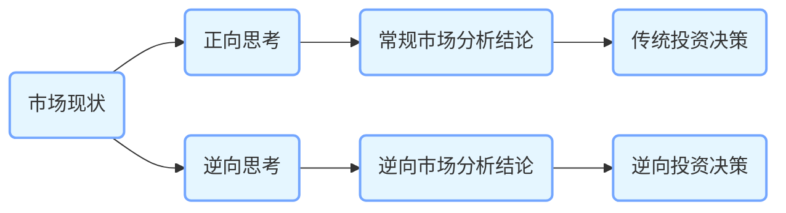

# 芒格的"逆向思考"在市场分析中的应用

> 关键词：芒格、逆向思考、市场分析、投资决策、风险评估

> 摘要：本文深入探讨了芒格的逆向思考方法在市场分析领域的应用。首先介绍了逆向思考的背景及相关概念，阐述了其核心原理与架构。接着详细讲解了逆向思考在市场分析中的核心算法原理及具体操作步骤，并给出了相应的数学模型和公式。通过项目实战案例，展示了逆向思考在实际市场分析中的代码实现与解读。分析了逆向思考在不同市场场景中的实际应用，推荐了学习逆向思考及市场分析相关的工具和资源。最后总结了逆向思考在市场分析中的未来发展趋势与挑战，还提供了常见问题解答和扩展阅读参考资料，旨在帮助读者全面理解并运用逆向思考方法提升市场分析能力。

## 1. 背景介绍 
### 1.1 目的和范围
本文章的主要目的是详细阐述芒格的逆向思考方法在市场分析中的应用。通过深入探讨逆向思考的原理、操作步骤、数学模型以及实际案例，帮助读者理解如何运用这一独特的思维方式进行有效的市场分析，从而在投资决策、风险评估等方面做出更明智的选择。文章的范围涵盖了逆向思考在股票市场、期货市场、债券市场等多种金融市场分析中的应用，同时也涉及到企业经营、市场营销等相关领域的市场分析。

### 1.2 预期读者
本文预期读者包括金融投资者、市场分析师、企业管理者、市场营销人员以及对芒格的逆向思考方法和市场分析感兴趣的广大读者。无论是专业人士希望提升市场分析能力，还是初学者想要了解独特的市场分析思维方式，都能从本文中获得有价值的信息。

### 1.3 文档结构概述
本文将按照以下结构进行阐述：首先介绍逆向思考的背景知识，包括目的、预期读者、文档结构和相关术语。接着深入讲解逆向思考的核心概念、原理和架构，并以示意图和流程图的形式呈现。然后详细阐述逆向思考在市场分析中的核心算法原理和具体操作步骤，同时给出相应的数学模型和公式，并举例说明。通过项目实战案例，展示逆向思考在实际市场分析中的代码实现和详细解读。分析逆向思考在不同市场场景中的实际应用。推荐学习逆向思考及市场分析相关的工具和资源，包括书籍、在线课程、技术博客、开发工具、框架和库以及相关论文著作。最后总结逆向思考在市场分析中的未来发展趋势与挑战，提供常见问题解答和扩展阅读参考资料。

### 1.4 术语表
#### 1.4.1 核心术语定义
- **逆向思考**：是指从相反的方向、角度去思考问题，不局限于常规的思维模式，通过反向推理来发现问题、解决问题的一种思维方式。在市场分析中，逆向思考表现为不盲目跟随市场趋势，而是从与大众观点相反的角度去评估市场、分析投资机会。
- **市场分析**：是指对市场的各种因素进行研究和评估，包括市场需求、市场供给、市场竞争、市场趋势等，以帮助投资者、企业管理者等做出合理的决策。
- **投资决策**：是指投资者根据市场分析的结果，结合自身的投资目标、风险承受能力等因素，选择合适的投资对象、投资时机和投资方式的过程。
- **风险评估**：是指对投资或经营活动中可能面临的风险进行识别、分析和评估的过程，以确定风险的大小、可能性和影响程度，并采取相应的措施进行风险管理。

#### 1.4.2 相关概念解释
- **正向思考**：与逆向思考相对，是指按照常规的思维模式，从问题的正面去思考、分析和解决问题。在市场分析中，正向思考通常表现为跟随市场趋势、关注热门行业和股票等。
- **批判性思维**：是一种理性的、反思性的思维方式，要求对各种观点和信息进行批判性的分析和评估，不盲目接受，而是通过质疑、推理和验证来判断其真实性和可靠性。逆向思考与批判性思维密切相关，逆向思考往往需要运用批判性思维来打破常规的思维定式。
- **概率思维**：是指在决策过程中，考虑各种事件发生的概率，并根据概率的大小来做出决策。在市场分析中，概率思维可以帮助投资者更客观地评估投资机会和风险，避免过度乐观或悲观的情绪影响决策。

#### 1.4.3 缩略词列表
- **SWOT**：Strengths（优势）、Weaknesses（劣势）、Opportunities（机会）、Threats（威胁）的缩写，是一种常用的战略分析工具，用于评估企业或项目的内部优势和劣势以及外部机会和威胁。
- **PE**：Price-to-Earnings Ratio（市盈率）的缩写，是指股票价格与每股收益的比率，用于评估股票的估值水平。
- **ROE**：Return on Equity（净资产收益率）的缩写，是指企业净利润与净资产的比率，用于衡量企业运用自有资本的效率。

## 2. 核心概念与联系 

### 逆向思考的核心原理
逆向思考的核心原理在于打破常规的思维定式，从相反的方向去思考问题。在市场分析中，大多数人往往会跟随市场趋势、关注热门行业和股票，这种正向思考方式虽然在某些情况下能够取得成功，但也容易导致投资者陷入羊群效应，忽略潜在的风险。而逆向思考则要求投资者不盲目跟随大众，而是从与大众观点相反的角度去评估市场、分析投资机会。例如，当市场普遍看好某一行业或股票时，逆向思考者会思考该行业或股票是否存在被高估的风险；当市场普遍悲观时，逆向思考者会寻找其中可能存在的低估机会。

### 逆向思考与市场分析的联系
逆向思考与市场分析密切相关，它为市场分析提供了一种独特的视角和方法。在市场分析中，逆向思考可以帮助投资者更全面、客观地评估市场情况，发现被市场忽视的投资机会，同时也能更好地识别潜在的风险。通过逆向思考，投资者可以避免盲目跟风，做出更理性的投资决策。例如，在股票市场中，当某只股票价格连续上涨，市场上一片看好声时，逆向思考者会分析该股票价格上涨是否已经超出了其内在价值，是否存在泡沫风险；当某只股票价格连续下跌，市场上一片悲观时，逆向思考者会研究该股票的基本面是否依然良好，是否存在被低估的情况。

### 逆向思考的架构示意图

这个示意图展示了逆向思考在市场分析中的架构。从市场现状出发，分别通过正向思考和逆向思考得到不同的市场分析结论，进而做出传统投资决策和逆向投资决策。

## 3. 核心算法原理 & 具体操作步骤 

### 核心算法原理
逆向思考在市场分析中的核心算法原理可以概括为以下几个步骤：
1. **收集市场信息**：通过各种渠道收集市场的相关信息，包括宏观经济数据、行业动态、企业财务报表等。
2. **分析市场主流观点**：对收集到的信息进行分析，了解市场上大多数人的观点和预期。
3. **提出逆向假设**：基于对市场主流观点的分析，提出与主流观点相反的假设。例如，如果市场主流观点认为某一行业未来前景光明，逆向假设可以是该行业可能面临潜在的挑战或风险。
4. **验证逆向假设**：通过进一步的研究和分析，验证逆向假设是否成立。可以运用数据分析、案例研究、专家咨询等方法进行验证。
5. **评估投资机会和风险**：根据逆向假设的验证结果，评估相应的投资机会和风险。如果逆向假设成立，可能存在被市场忽视的投资机会；如果逆向假设不成立，则需要重新审视市场情况。
6. **做出决策**：根据评估结果，做出投资决策。如果投资机会大于风险，可以考虑进行投资；如果风险大于机会，则应谨慎投资或选择放弃。

### 具体操作步骤
以下是逆向思考在市场分析中的具体操作步骤，并用 Python 代码示例进行说明。

#### 步骤 1：收集市场信息
可以使用 Python 的第三方库，如 `pandas-datareader` 来获取股票市场数据。
```python
import pandas_datareader.data as web
import datetime

# 设置时间范围
start = datetime.datetime(2020, 1, 1)
end = datetime.datetime(2023, 12, 31)

# 获取某只股票的数据
stock_symbol = 'AAPL'
stock_data = web.DataReader(stock_symbol, 'yahoo', start, end)

print(stock_data.head())
```
#### 步骤 2：分析市场主流观点
可以通过阅读财经新闻、研究报告等方式了解市场主流观点，也可以使用自然语言处理技术对相关文本进行分析。以下是一个简单的示例，使用 `nltk` 库对财经新闻进行情感分析，以了解市场对某只股票的主流观点。
```python
import nltk
from nltk.sentiment import SentimentIntensityAnalyzer
nltk.download('vader_lexicon')

# 假设这是一篇关于某只股票的财经新闻
news_text = "Apple's new product line is expected to drive significant revenue growth in the coming quarters. Analysts are optimistic about the company's future prospects."

sia = SentimentIntensityAnalyzer()
sentiment_score = sia.polarity_scores(news_text)

if sentiment_score['compound'] > 0:
    print("市场主流观点对该股票持乐观态度")
elif sentiment_score['compound'] < 0:
    print("市场主流观点对该股票持悲观态度")
else:
    print("市场主流观点对该股票持中立态度")
```
#### 步骤 3：提出逆向假设
根据市场主流观点，提出逆向假设。例如，如果市场主流观点对某只股票持乐观态度，逆向假设可以是该股票可能存在被高估的风险。
```python
# 逆向假设示例
reverse_hypothesis = "尽管市场对 Apple 股票持乐观态度，但可能存在产品销售不及预期、竞争加剧等因素导致股票被高估的风险。"
print(reverse_hypothesis)
```
#### 步骤 4：验证逆向假设
可以通过分析公司的财务数据、行业竞争情况等方式验证逆向假设。以下是一个简单的示例，分析公司的市盈率（PE）来判断股票是否被高估。
```python
# 假设当前股票价格为 150 美元，每股收益为 5 美元
stock_price = 150
earnings_per_share = 5
pe_ratio = stock_price / earnings_per_share

# 假设行业平均市盈率为 20
industry_avg_pe = 20

if pe_ratio > industry_avg_pe:
    print("逆向假设部分成立，该股票可能被高估")
else:
    print("逆向假设不成立，该股票可能未被高估")
```
#### 步骤 5：评估投资机会和风险
根据逆向假设的验证结果，评估投资机会和风险。可以使用风险评估模型，如夏普比率（Sharpe Ratio）来评估投资的风险和收益。
```python
import numpy as np

# 假设投资组合的预期收益率为 0.1，无风险利率为 0.02，投资组合的标准差为 0.2
expected_return = 0.1
risk_free_rate = 0.02
portfolio_std = 0.2

sharpe_ratio = (expected_return - risk_free_rate) / portfolio_std

if sharpe_ratio > 1:
    print("投资机会较好，风险相对较低")
else:
    print("投资机会一般，需要谨慎考虑")
```
#### 步骤 6：做出决策
根据评估结果，做出投资决策。
```python
if sharpe_ratio > 1 and pe_ratio <= industry_avg_pe:
    print("可以考虑投资该股票")
else:
    print("建议谨慎投资或选择放弃")
```

## 4. 数学模型和公式 & 详细讲解 & 举例说明 

### 市盈率（PE）模型
#### 公式
市盈率（PE）的计算公式为：
$$PE = \frac{P}{EPS}$$
其中，$P$ 表示股票价格，$EPS$ 表示每股收益。

#### 详细讲解
市盈率是衡量股票估值水平的常用指标。一般来说，市盈率越高，说明市场对该股票的预期越高，但也可能意味着股票被高估；市盈率越低，说明股票可能被低估。不同行业的市盈率水平可能会有所差异，因此在使用市盈率进行估值时，需要与同行业的平均市盈率进行比较。

#### 举例说明
假设某只股票的价格为 50 美元，每股收益为 2 美元，则该股票的市盈率为：
$$PE = \frac{50}{2} = 25$$
如果该行业的平均市盈率为 20，说明该股票的估值相对较高，可能存在被高估的风险。

### 夏普比率（Sharpe Ratio）模型
#### 公式
夏普比率的计算公式为：
$$Sharpe Ratio = \frac{R_p - R_f}{\sigma_p}$$
其中，$R_p$ 表示投资组合的预期收益率，$R_f$ 表示无风险利率，$\sigma_p$ 表示投资组合的标准差。

#### 详细讲解
夏普比率用于衡量投资组合的风险调整后收益。它表示每承担一单位风险所获得的超过无风险收益的额外收益。夏普比率越高，说明投资组合的风险调整后收益越好。

#### 举例说明
假设某投资组合的预期收益率为 0.15，无风险利率为 0.03，投资组合的标准差为 0.2，则该投资组合的夏普比率为：
$$Sharpe Ratio = \frac{0.15 - 0.03}{0.2} = 0.6$$
一般来说，夏普比率大于 1 表示投资组合的风险调整后收益较好。在这个例子中，夏普比率为 0.6，说明该投资组合的风险调整后收益一般，需要谨慎考虑。

### 资本资产定价模型（CAPM）
#### 公式
资本资产定价模型的计算公式为：
$$E(R_i) = R_f + \beta_i(E(R_m) - R_f)$$
其中，$E(R_i)$ 表示资产 $i$ 的预期收益率，$R_f$ 表示无风险利率，$\beta_i$ 表示资产 $i$ 的贝塔系数，$E(R_m)$ 表示市场组合的预期收益率。

#### 详细讲解
资本资产定价模型描述了资产的预期收益率与市场风险之间的关系。贝塔系数 $\beta_i$ 衡量了资产 $i$ 的收益率相对于市场组合收益率的波动程度。如果 $\beta_i > 1$，说明资产 $i$ 的波动比市场组合更大；如果 $\beta_i < 1$，说明资产 $i$ 的波动比市场组合更小。

#### 举例说明
假设无风险利率为 0.02，市场组合的预期收益率为 0.1，某只股票的贝塔系数为 1.2，则该股票的预期收益率为：
$$E(R_i) = 0.02 + 1.2\times(0.1 - 0.02) = 0.116$$
这意味着投资者预期该股票的收益率为 11.6%。

## 5. 项目实战：代码实际案例和详细解释说明 

### 5.1  开发环境搭建
#### 安装 Python
首先需要安装 Python 环境，建议使用 Python 3.7 及以上版本。可以从 Python 官方网站（https://www.python.org/downloads/）下载并安装。

#### 安装必要的库
在命令行中使用 `pip` 安装以下必要的库：
```sh
pip install pandas pandas-datareader nltk
```

### 5.2  源代码详细实现和代码解读
以下是一个完整的逆向思考在市场分析中的项目实战代码示例：
```python
import pandas_datareader.data as web
import datetime
import nltk
from nltk.sentiment import SentimentIntensityAnalyzer

# 步骤 1：收集市场信息
start = datetime.datetime(2020, 1, 1)
end = datetime.datetime(2023, 12, 31)
stock_symbol = 'AAPL'
stock_data = web.DataReader(stock_symbol, 'yahoo', start, end)

# 步骤 2：分析市场主流观点
nltk.download('vader_lexicon')
news_text = "Apple's new product line is expected to drive significant revenue growth in the coming quarters. Analysts are optimistic about the company's future prospects."
sia = SentimentIntensityAnalyzer()
sentiment_score = sia.polarity_scores(news_text)

if sentiment_score['compound'] > 0:
    market_opinion = "乐观"
elif sentiment_score['compound'] < 0:
    market_opinion = "悲观"
else:
    market_opinion = "中立"

# 步骤 3：提出逆向假设
reverse_hypothesis = f"尽管市场对 {stock_symbol} 股票持 {market_opinion} 态度，但可能存在产品销售不及预期、竞争加剧等因素导致股票被高估的风险。"

# 步骤 4：验证逆向假设
# 假设当前股票价格为最后一天的收盘价
stock_price = stock_data['Close'][-1]
# 假设每股收益为 5 美元（实际应用中需要从财务报表获取）
earnings_per_share = 5
pe_ratio = stock_price / earnings_per_share
industry_avg_pe = 20

if pe_ratio > industry_avg_pe:
    hypothesis_valid = True
else:
    hypothesis_valid = False

# 步骤 5：评估投资机会和风险
# 假设投资组合的预期收益率为 0.1，无风险利率为 0.02，投资组合的标准差为 0.2
expected_return = 0.1
risk_free_rate = 0.02
portfolio_std = 0.2
sharpe_ratio = (expected_return - risk_free_rate) / portfolio_std

# 步骤 6：做出决策
if sharpe_ratio > 1 and not hypothesis_valid:
    decision = "可以考虑投资该股票"
else:
    decision = "建议谨慎投资或选择放弃"

# 输出结果
print(f"市场对 {stock_symbol} 股票的主流观点是 {market_opinion}")
print(reverse_hypothesis)
if hypothesis_valid:
    print("逆向假设成立，该股票可能被高估")
else:
    print("逆向假设不成立，该股票可能未被高估")
print(f"投资组合的夏普比率为 {sharpe_ratio}")
print(decision)
```

### 5.3  代码解读与分析
- **步骤 1**：使用 `pandas-datareader` 库从雅虎财经获取指定股票在指定时间范围内的历史数据。
- **步骤 2**：使用 `nltk` 库的 `SentimentIntensityAnalyzer` 对财经新闻进行情感分析，判断市场主流观点是乐观、悲观还是中立。
- **步骤 3**：根据市场主流观点提出逆向假设。
- **步骤 4**：计算股票的市盈率，并与行业平均市盈率进行比较，验证逆向假设是否成立。
- **步骤 5**：计算投资组合的夏普比率，评估投资机会和风险。
- **步骤 6**：根据夏普比率和逆向假设的验证结果做出投资决策。

通过这个项目实战案例，可以看到逆向思考在市场分析中的具体应用过程，从收集信息、分析观点、提出假设、验证假设到评估风险和做出决策，每个步骤都相互关联，共同构成了一个完整的市场分析体系。

## 6. 实际应用场景 
### 股票市场
在股票市场中，逆向思考可以帮助投资者发现被市场忽视的投资机会。例如，当市场上大多数投资者都看好某一热门行业的股票时，逆向思考者会关注那些被市场冷落的行业或股票。这些股票可能由于短期的业绩不佳、行业负面消息等原因而被低估，但从长期来看，它们可能具有潜在的增长潜力。逆向思考者会深入研究这些股票的基本面，分析其未来的发展前景，从而做出与市场主流观点不同的投资决策。

另外，当股票市场出现大幅下跌时，市场情绪往往非常悲观，大多数投资者会选择抛售股票。而逆向思考者会冷静分析市场下跌的原因，判断是否存在过度恐慌的情况。如果发现某些优质股票的价格已经下跌到其内在价值以下，逆向思考者会抓住机会买入这些股票，等待市场反弹。

### 期货市场
在期货市场中，逆向思考同样具有重要的应用价值。期货市场的价格波动较大，投资者往往容易受到市场情绪的影响。当市场上大多数投资者都预期某一期货品种的价格会上涨时，逆向思考者会考虑是否存在潜在的风险因素导致价格下跌。例如，可能存在供应增加、需求下降等因素被市场忽视。逆向思考者会通过分析市场供需关系、宏观经济数据等，来验证自己的逆向假设。

如果逆向假设成立，逆向思考者会选择做空该期货品种，从而获得盈利机会。相反，当市场上大多数投资者都看空某一期货品种时，逆向思考者会寻找可能导致价格上涨的因素，如政策利好、突发事件等，进而考虑做多该期货品种。

### 企业经营与市场营销
在企业经营和市场营销中，逆向思考可以帮助企业管理者突破传统思维的束缚，发现新的商业机会。例如，在产品研发方面，大多数企业会关注市场上的热门需求，推出类似的产品。而逆向思考的企业会从相反的角度出发，关注那些未被满足的小众需求，开发出具有差异化的产品。这样的产品可能在市场上具有独特的竞争力，能够吸引特定的客户群体。

在市场营销方面，逆向思考可以帮助企业制定与众不同的营销策略。当大多数企业都在进行大规模的广告宣传时，逆向思考的企业可能会选择通过口碑营销、事件营销等方式来提高品牌知名度。通过逆向思考，企业可以在激烈的市场竞争中脱颖而出，获得更大的市场份额。

## 7. 工具和资源推荐
### 7.1 学习资源推荐
#### 7.1.1 书籍推荐
- 《穷查理宝典：查理·芒格的智慧箴言录》：这本书是关于查理·芒格的思想和智慧的经典著作，详细介绍了芒格的多元思维模型和逆向思考方法，对于学习逆向思考在市场分析中的应用具有重要的参考价值。
- 《聪明的投资者》：由本杰明·格雷厄姆所著，是价值投资领域的经典之作。书中强调了逆向思考在投资决策中的重要性，通过大量的案例和分析，帮助读者理解如何运用逆向思考来识别被低估的股票。
- 《金融炼金术》：乔治·索罗斯的代表作，书中阐述了他的反身性理论和逆向投资策略。索罗斯通过逆向思考和对市场趋势的敏锐洞察，在金融市场中取得了巨大的成功。

#### 7.1.2 在线课程
- Coursera 上的“投资学原理”：该课程由知名大学的教授授课，涵盖了投资分析、资产定价、风险管理等方面的知识，其中也包括逆向思考在投资决策中的应用。
- Udemy 上的“市场分析与投资策略”：课程内容丰富，包括市场分析的方法和工具、不同市场环境下的投资策略等，对逆向思考在市场分析中的应用有详细的讲解。

#### 7.1.3 技术博客和网站
- 雪球网：是一个知名的财经社区，上面有很多投资者分享自己的投资经验和市场分析观点。通过阅读不同投资者的文章，可以了解到逆向思考在实际投资中的应用案例。
- 东方财富网：提供丰富的财经资讯和市场数据，同时也有很多专业的分析师发表市场分析报告。关注这些报告可以帮助读者了解市场动态和不同的分析视角，培养逆向思考能力。

### 7.2 开发工具框架推荐
#### 7.2.1 IDE和编辑器
- PyCharm：是一款专业的 Python 集成开发环境，具有强大的代码编辑、调试和项目管理功能。对于使用 Python 进行市场分析和数据处理的开发者来说，PyCharm 是一个不错的选择。
- Jupyter Notebook：是一个基于网页的交互式开发环境，适合进行数据分析和可视化。在 Jupyter Notebook 中，可以方便地编写和运行 Python 代码，同时还能将代码、文本和可视化结果整合在一起，形成一个完整的分析报告。

#### 7.2.2 调试和性能分析工具
- PDB：是 Python 自带的调试器，可以帮助开发者在代码执行过程中进行调试，查找和解决代码中的问题。
- cProfile：是 Python 的性能分析工具，可以统计代码中各个函数的执行时间和调用次数，帮助开发者找出代码中的性能瓶颈。

#### 7.2.3 相关框架和库
- Pandas：是一个强大的数据分析库，提供了高效的数据结构和数据处理功能，非常适合用于市场数据的处理和分析。
- NumPy：是 Python 的科学计算基础库，提供了高性能的多维数组对象和各种数学函数，在市场分析中经常用于数据的数值计算。
- Scikit-learn：是一个机器学习库，提供了各种机器学习算法和工具，可用于市场数据的建模和预测。

### 7.3 相关论文著作推荐
#### 7.3.1 经典论文
- 《有效市场假说》：由尤金·法玛提出，该论文阐述了有效市场的概念和分类，对市场分析和投资决策产生了深远的影响。逆向思考者可以通过研究有效市场假说，思考市场中可能存在的无效性，从而发现投资机会。
- 《资本资产定价模型》：由威廉·夏普等人提出，该论文建立了资本资产定价模型，用于描述资产的预期收益率与市场风险之间的关系。了解资本资产定价模型可以帮助逆向思考者更好地评估投资的风险和收益。

#### 7.3.2 最新研究成果
- 关注顶尖学术期刊，如《金融研究》、《管理科学学报》等，这些期刊上会发表关于市场分析、投资决策等方面的最新研究成果。逆向思考者可以从中获取最新的理论和方法，应用到实际的市场分析中。
- 参加学术会议和研讨会，与国内外的专家学者交流，了解市场分析领域的前沿动态和研究方向。

#### 7.3.3 应用案例分析
- 阅读知名投资机构和投资者的案例分析报告，了解他们在市场分析和投资决策中如何运用逆向思考方法。例如，巴菲特的投资案例分析，他通过逆向思考和深入的基本面分析，在股票市场中取得了长期的成功。

## 8. 总结：未来发展趋势与挑战
### 未来发展趋势
- **与人工智能和大数据的结合**：随着人工智能和大数据技术的不断发展，逆向思考在市场分析中的应用将更加智能化和精准化。通过大数据技术，可以收集和分析更多的市场信息，为逆向思考提供更丰富的数据支持。人工智能算法可以帮助投资者快速处理和分析这些数据，发现市场中的潜在规律和机会。例如，利用机器学习算法对市场数据进行建模和预测，结合逆向思考方法，做出更准确的投资决策。
- **跨领域应用的拓展**：逆向思考不仅在金融市场分析中具有重要应用价值，未来还将拓展到更多的领域，如医疗、教育、科技等。在这些领域中，逆向思考可以帮助企业和决策者发现新的商业模式、解决复杂的问题。例如，在医疗领域，逆向思考可以帮助研发人员从相反的角度思考疾病的治疗方法，开发出更有效的药物和治疗方案。
- **投资者教育的普及**：随着投资者对逆向思考方法的认识和理解不断加深，逆向思考将逐渐成为投资者教育的重要内容。更多的投资者将学习和掌握逆向思考方法，运用到自己的投资决策中。这将有助于提高投资者的整体素质和投资水平，促进金融市场的健康发展。

### 挑战
- **数据质量和可靠性**：逆向思考在市场分析中的应用依赖于大量的市场信息和数据。然而，数据的质量和可靠性可能存在问题，如数据不准确、不完整、滞后等。这些问题可能会影响逆向思考的分析结果和决策的准确性。因此，如何获取高质量、可靠的数据，并对数据进行有效的清洗和处理，是逆向思考应用面临的一个重要挑战。
- **市场复杂性和不确定性**：市场是复杂多变的，受到多种因素的影响，如宏观经济环境、政策法规、突发事件等。这些因素的不确定性增加了市场分析的难度，逆向思考方法也难以完全准确地预测市场走势和投资机会。投资者需要在复杂的市场环境中不断调整和完善逆向思考的方法和策略，以适应市场的变化。
- **心理因素的影响**：逆向思考要求投资者具备独立思考和逆向思维的能力，不盲目跟随市场趋势。然而，在实际投资过程中，投资者往往容易受到心理因素的影响，如贪婪、恐惧、羊群效应等。这些心理因素可能会导致投资者放弃逆向思考，做出非理性的投资决策。因此，如何克服心理因素的影响，保持理性和冷静，是逆向思考应用面临的另一个挑战。

## 9. 附录：常见问题与解答
### 问题 1：逆向思考是否意味着总是与市场主流观点相反？
解答：逆向思考并不意味着总是与市场主流观点相反。逆向思考是一种思维方式，它要求投资者不盲目跟随市场趋势，而是从相反的方向去思考问题，分析市场中可能存在的风险和机会。在某些情况下，市场主流观点可能是正确的，逆向思考者也会认同这些观点。逆向思考的关键在于通过深入的研究和分析，独立判断市场情况，而不是简单地与主流观点作对。

### 问题 2：逆向思考在市场分析中一定能取得成功吗？
解答：逆向思考在市场分析中可以提供一种独特的视角和方法，但并不能保证一定能取得成功。市场是复杂多变的，受到多种因素的影响，逆向思考方法也存在一定的局限性。即使逆向思考者发现了被市场忽视的投资机会，也可能由于市场环境的变化、突发事件等原因导致投资失败。因此，逆向思考需要结合其他的分析方法和工具，同时投资者还需要具备丰富的经验和良好的风险控制能力。

### 问题 3：如何培养逆向思考能力？
解答：培养逆向思考能力可以从以下几个方面入手：
- **学习逆向思考的理论和方法**：阅读相关的书籍、文章，了解逆向思考的原理和应用案例。
- **多观察和分析市场**：关注市场动态，分析市场主流观点的形成原因，尝试从相反的角度去思考问题。
- **进行模拟投资和实践**：通过模拟投资，运用逆向思考方法进行市场分析和投资决策，积累经验。
- **与不同观点的人交流**：与其他投资者、分析师等交流，听取不同的观点和意见，拓宽自己的思维视野。

### 问题 4：逆向思考在不同市场环境下的应用有什么区别？
解答：在不同的市场环境下，逆向思考的应用方式可能会有所不同。在牛市中，市场情绪乐观，大多数投资者都看好市场，逆向思考者需要更加警惕市场可能存在的泡沫和风险，关注那些被市场高估的股票或行业。在熊市中，市场情绪悲观，大多数投资者都看空市场，逆向思考者则需要寻找被市场低估的投资机会，关注那些具有潜在增长潜力的股票或行业。在震荡市中，市场波动较大，逆向思考者需要更加灵活地运用逆向思考方法，根据市场的短期变化及时调整投资策略。

## 10. 扩展阅读 & 参考资料
- 《逆向投资策略：市场恐慌时如何做到理性投资》，作者：大卫·德雷曼
- 《战胜华尔街》，作者：彼得·林奇
- 《黑天鹅：如何应对不可预知的未来》，作者：纳西姆·尼古拉斯·塔勒布
- 财经网站：新浪财经、腾讯财经、和讯网等
- 学术数据库：中国知网、万方数据、维普资讯等

作者：AI天才研究院/AI Genius Institute & 禅与计算机程序设计艺术 /Zen And The Art of Computer Programming