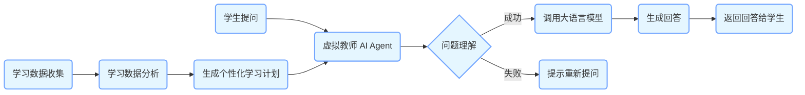

# 虚拟教师 AI Agent：LLM 驱动的个性化教育系统

> 关键词：虚拟教师、AI Agent、大语言模型（LLM）、个性化教育系统、教育技术

> 摘要：本文深入探讨了基于大语言模型（LLM）驱动的虚拟教师 AI Agent 构建的个性化教育系统。首先介绍了该系统产生的背景，包括目的、预期读者等信息。接着阐述了核心概念与联系，详细讲解了核心算法原理和具体操作步骤，同时给出了相关数学模型和公式。通过项目实战案例，展示了系统的开发环境搭建、源代码实现及解读。分析了系统的实际应用场景，推荐了学习、开发所需的工具和资源，最后总结了该系统未来的发展趋势与挑战，并提供了常见问题解答和扩展阅读参考资料，旨在为教育领域引入创新的技术解决方案，推动个性化教育的发展。

## 1. 背景介绍 
### 1.1 目的和范围
在当今数字化时代，教育面临着新的挑战和机遇。传统教育模式往往难以满足每个学生的个性化需求，学生的学习进度、学习风格和兴趣爱好各不相同，而教师资源有限，难以做到全面的个性化辅导。虚拟教师 AI Agent：LLM 驱动的个性化教育系统的目的就是利用先进的大语言模型（LLM）技术，打造一个能够根据学生的特点和需求提供个性化学习支持的虚拟教师。

本系统的范围涵盖了多个学科领域的知识学习，包括但不限于数学、语文、英语等基础学科，以及计算机科学、艺术等专业领域。它可以为不同年龄段的学生提供服务，从小学到大学甚至成人教育都适用。系统不仅可以提供知识讲解、答疑解惑，还能根据学生的学习情况制定个性化的学习计划和提供针对性的练习。

### 1.2 预期读者
- **教育工作者**：包括学校教师、培训机构讲师等，他们可以借助该系统丰富教学手段，提高教学效率，更好地满足学生的个性化需求。
- **学生**：各个年龄段和学习阶段的学生都可以使用该系统进行自主学习，获取个性化的学习支持，提高学习成绩和学习能力。
- **教育技术开发者**：对开发智能教育系统感兴趣的程序员、软件架构师等，可以从本文中获取系统设计、算法实现等方面的技术思路和参考。
- **教育政策制定者**：了解先进的教育技术发展趋势，为制定相关教育政策提供参考，推动教育信息化的发展。

### 1.3 文档结构概述
本文将按照以下结构进行阐述：
- 核心概念与联系：介绍虚拟教师 AI Agent、LLM 和个性化教育系统的核心概念，以及它们之间的联系，并通过文本示意图和 Mermaid 流程图进行直观展示。
- 核心算法原理 & 具体操作步骤：详细讲解系统所使用的核心算法原理，并用 Python 源代码进行阐述，同时给出具体的操作步骤。
- 数学模型和公式 & 详细讲解 & 举例说明：介绍系统涉及的数学模型和公式，对其进行详细讲解，并通过具体例子进行说明。
- 项目实战：代码实际案例和详细解释说明：通过一个实际的项目案例，展示系统的开发环境搭建、源代码实现和代码解读。
- 实际应用场景：分析该系统在不同教育场景中的实际应用。
- 工具和资源推荐：推荐学习、开发该系统所需的工具和资源，包括书籍、在线课程、开发工具等。
- 总结：未来发展趋势与挑战：总结该系统的发展趋势和面临的挑战。
- 附录：常见问题与解答：提供一些常见问题的解答。
- 扩展阅读 & 参考资料：提供相关的扩展阅读内容和参考资料。

### 1.4 术语表
#### 1.4.1 核心术语定义
- **虚拟教师 AI Agent**：一种基于人工智能技术的虚拟角色，能够模拟教师的行为和功能，与学生进行交互，提供学习支持和指导。
- **大语言模型（LLM）**：一种基于深度学习的自然语言处理模型，具有强大的语言理解和生成能力，能够处理各种自然语言任务，如文本生成、问答系统等。
- **个性化教育系统**：根据学生的个体差异，如学习进度、学习风格、兴趣爱好等，为学生提供个性化的学习内容、学习计划和学习指导的教育系统。

#### 1.4.2 相关概念解释
- **自然语言处理（NLP）**：研究如何让计算机理解和处理人类自然语言的技术领域，包括文本分类、情感分析、机器翻译等任务。大语言模型是自然语言处理领域的重要成果之一。
- **机器学习**：一门多领域交叉学科，涉及概率论、统计学、逼近论、凸分析、算法复杂度理论等多门学科。它专门研究计算机怎样模拟或实现人类的学习行为，以获取新的知识或技能，重新组织已有的知识结构使之不断改善自身的性能。在虚拟教师 AI Agent 中，机器学习技术用于训练模型，使其能够更好地理解学生的需求和提供准确的回复。

#### 1.4.3 缩略词列表
- **LLM**：Large Language Model（大语言模型）
- **NLP**：Natural Language Processing（自然语言处理）
- **AI**：Artificial Intelligence（人工智能）

## 2. 核心概念与联系 
### 核心概念原理
#### 虚拟教师 AI Agent
虚拟教师 AI Agent 是整个个性化教育系统的核心交互角色。它基于大语言模型（LLM）构建，通过自然语言处理技术与学生进行交互。虚拟教师 AI Agent 可以理解学生的问题，根据学生的学习情况和需求提供相应的解答和指导。它可以模拟教师的教学行为，如讲解知识、布置作业、评估学习成果等。

#### 大语言模型（LLM）
大语言模型是一种基于深度学习的自然语言处理模型，通常采用Transformer架构。它通过在大规模的文本数据上进行预训练，学习到语言的模式和规律，从而能够生成高质量的文本。在虚拟教师 AI Agent 中，LLM 用于理解学生的问题和生成相应的回答。例如，当学生提出一个数学问题时，LLM 可以分析问题的语义，调用相关的知识和算法，生成准确的解答。

#### 个性化教育系统
个性化教育系统的目标是根据学生的个体差异提供个性化的学习支持。它通过收集学生的学习数据，如学习进度、答题正确率、学习时间等，分析学生的学习特点和需求。然后，根据分析结果为学生制定个性化的学习计划，推荐适合学生的学习资源和练习题目。虚拟教师 AI Agent 作为个性化教育系统的前端交互界面，负责与学生进行沟通和指导，将个性化的学习内容传递给学生。

### 架构的文本示意图
```plaintext
+----------------------+
|  个性化教育系统      |
|                      |
| +----------------+   |
| | 学习数据收集模块 |   |
| +----------------+   |
| | 学习数据分析模块 |   |
| +----------------+   |
| | 学习计划生成模块 |   |
| +----------------+   |
|                      |
| +----------------+   |
| | 虚拟教师 AI Agent |   |
| |   +----------+   |   |
| |   | 大语言模型 |   |   |
| |   +----------+   |   |
| +----------------+   |
+----------------------+
```

### Mermaid 流程图


## 3. 核心算法原理 & 具体操作步骤 
### 核心算法原理
#### 大语言模型的问答原理
大语言模型基于预训练 - 微调的模式进行工作。在预训练阶段，模型在大规模的文本数据上进行无监督学习，学习到语言的通用模式和知识。在微调阶段，模型在特定的问答数据集上进行有监督学习，以提高其在问答任务上的性能。

当学生提出一个问题时，虚拟教师 AI Agent 会将问题输入到大语言模型中。大语言模型会对问题进行编码，将其转换为向量表示。然后，模型会根据自身的参数和结构，在其内部的知识图谱中查找相关的信息，并生成一个候选答案集合。最后，模型会对候选答案进行排序，选择得分最高的答案作为最终回答。

#### 个性化学习计划生成算法
个性化学习计划生成算法基于学生的学习数据进行工作。首先，系统会收集学生的学习数据，包括学习进度、答题正确率、学习时间等。然后，通过聚类算法将学生分为不同的学习群体，每个群体具有相似的学习特点和需求。接着，针对每个学习群体，系统会使用决策树算法生成相应的学习计划模板。最后，根据学生的具体情况，对学习计划模板进行个性化调整，生成适合该学生的学习计划。

### 具体操作步骤
#### 步骤 1：数据收集
使用日志记录和问卷调查等方式收集学生的学习数据，包括学生的基本信息、学习历史记录、答题结果等。

#### 步骤 2：数据预处理
对收集到的学习数据进行清洗和预处理，去除噪声数据和缺失值。将数据转换为适合机器学习算法处理的格式，如数值型向量。

#### 步骤 3：模型训练
- 大语言模型：使用大规模的文本数据进行预训练，然后在特定的问答数据集上进行微调。
- 个性化学习计划生成模型：使用聚类算法和决策树算法对预处理后的学习数据进行训练。

#### 步骤 4：系统部署
将训练好的模型部署到服务器上，搭建虚拟教师 AI Agent 和个性化教育系统的运行环境。

#### 步骤 5：交互与服务
学生通过网页或移动应用与虚拟教师 AI Agent 进行交互，提出问题或获取学习计划。虚拟教师 AI Agent 接收学生的请求，调用相应的模型进行处理，并返回结果给学生。

### Python 源代码示例
```python
import numpy as np
from sklearn.cluster import KMeans
from sklearn.tree import DecisionTreeClassifier

# 模拟学习数据
learning_data = np.random.rand(100, 5)  # 100 个学生，每个学生有 5 个学习特征

# 步骤 2：数据预处理
# 这里简单地进行归一化处理
normalized_data = (learning_data - np.mean(learning_data, axis=0)) / np.std(learning_data, axis=0)

# 步骤 3：模型训练 - 聚类算法
kmeans = KMeans(n_clusters=3)  # 假设分为 3 个学习群体
kmeans.fit(normalized_data)
labels = kmeans.labels_

# 步骤 3：模型训练 - 决策树算法
# 假设目标是预测学生的学习难度等级（0, 1, 2）
target = np.random.randint(0, 3, 100)
dt = DecisionTreeClassifier()
dt.fit(normalized_data, target)

# 步骤 5：交互与服务
# 模拟一个新学生的学习数据
new_student_data = np.random.rand(1, 5)
normalized_new_student_data = (new_student_data - np.mean(learning_data, axis=0)) / np.std(learning_data, axis=0)

# 预测学习群体
predicted_cluster = kmeans.predict(normalized_new_student_data)

# 预测学习难度等级
predicted_difficulty = dt.predict(normalized_new_student_data)

print(f"新学生的预测学习群体: {predicted_cluster[0]}")
print(f"新学生的预测学习难度等级: {predicted_difficulty[0]}")
```

## 4. 数学模型和公式 & 详细讲解 & 举例说明 
### 大语言模型的损失函数
大语言模型通常使用交叉熵损失函数进行训练。交叉熵损失函数用于衡量模型预测的概率分布与真实标签的概率分布之间的差异。

#### 数学公式
假设模型的输入为 $x$，真实标签为 $y$，模型的预测概率分布为 $p(y|x)$，则交叉熵损失函数 $L$ 定义为：

$$L = -\sum_{i=1}^{N} y_i \log(p(y_i|x))$$

其中，$N$ 是标签的类别数，$y_i$ 是真实标签的第 $i$ 个分量，$p(y_i|x)$ 是模型预测第 $i$ 个类别的概率。

#### 详细讲解
交叉熵损失函数的目的是最小化模型预测的概率分布与真实标签的概率分布之间的差异。当模型的预测概率分布与真实标签的概率分布完全一致时，交叉熵损失函数的值为 0。反之，当模型的预测概率分布与真实标签的概率分布差异较大时，交叉熵损失函数的值会较大。

#### 举例说明
假设我们有一个三分类问题，真实标签为 $y = [1, 0, 0]$，模型的预测概率分布为 $p(y|x) = [0.8, 0.1, 0.1]$。则交叉熵损失函数的值为：

$$L = -(1 \times \log(0.8) + 0 \times \log(0.1) + 0 \times \log(0.1)) \approx 0.223$$

### 个性化学习计划生成中的聚类算法
个性化学习计划生成中常用的聚类算法是 K-Means 算法。K-Means 算法的目标是将数据集划分为 $K$ 个簇，使得每个簇内的数据点尽可能相似，不同簇之间的数据点尽可能不同。

#### 数学公式
K-Means 算法的目标函数是最小化所有数据点到其所属簇中心的距离之和。假设数据集为 $X = \{x_1, x_2, \cdots, x_n\}$，簇中心为 $C = \{c_1, c_2, \cdots, c_K\}$，则目标函数 $J$ 定义为：

$$J = \sum_{i=1}^{n} \min_{j=1}^{K} \|x_i - c_j\|^2$$

其中，$\|x_i - c_j\|$ 表示数据点 $x_i$ 到簇中心 $c_j$ 的欧几里得距离。

#### 详细讲解
K-Means 算法的基本步骤如下：
1. 随机初始化 $K$ 个簇中心。
2. 将每个数据点分配到距离最近的簇中心所在的簇。
3. 更新每个簇的中心为该簇内所有数据点的平均值。
4. 重复步骤 2 和 3，直到簇中心不再变化或达到最大迭代次数。

#### 举例说明
假设我们有一个二维数据集 $X = \{(1, 1), (2, 2), (8, 8), (9, 9)\}$，我们要将其划分为 2 个簇。

1. 随机初始化簇中心：$c_1 = (1, 1)$，$c_2 = (9, 9)$。
2. 分配数据点到最近的簇：
   - $(1, 1)$ 和 $(2, 2)$ 距离 $c_1$ 更近，分配到簇 1。
   - $(8, 8)$ 和 $(9, 9)$ 距离 $c_2$ 更近，分配到簇 2。
3. 更新簇中心：
   - 簇 1 的新中心为 $((1 + 2) / 2, (1 + 2) / 2) = (1.5, 1.5)$。
   - 簇 2 的新中心为 $((8 + 9) / 2, (8 + 9) / 2) = (8.5, 8.5)$。
4. 重复步骤 2 和 3，直到簇中心不再变化。

## 5. 项目实战：代码实际案例和详细解释说明 
### 5.1  开发环境搭建
#### 硬件环境
- 服务器：建议使用具有较高性能的云服务器，如 Amazon EC2、Google Cloud Compute Engine 或阿里云 ECS。服务器需要具备足够的 CPU、内存和存储资源，以支持大语言模型的运行。
- 本地开发机器：可以使用普通的笔记本电脑或台式机，配置要求为至少 8GB 内存，建议使用固态硬盘以提高数据读写速度。

#### 软件环境
- 操作系统：服务器和本地开发机器可以使用 Linux 系统，如 Ubuntu 18.04 或更高版本。
- Python 环境：安装 Python 3.7 或更高版本，并使用虚拟环境管理工具（如 virtualenv 或 conda）创建一个独立的 Python 环境。
- 依赖库：安装以下 Python 依赖库：
  - `transformers`：用于加载和使用大语言模型。
  - `torch`：深度学习框架，支持 GPU 加速。
  - `flask`：用于搭建 Web 服务器，实现与用户的交互。
  - `pandas`：用于数据处理和分析。
  - `scikit-learn`：用于机器学习算法的实现。

#### 安装步骤
```bash
# 创建虚拟环境
python -m venv venv
source venv/bin/activate

# 安装依赖库
pip install transformers torch flask pandas scikit-learn
```

### 5.2  源代码详细实现和代码解读
#### 整体架构
我们将构建一个简单的虚拟教师 AI Agent 系统，包括一个 Web 服务器和一个大语言模型。用户通过网页输入问题，Web 服务器接收问题，调用大语言模型生成回答，并将回答返回给用户。

#### 代码实现
```python
from flask import Flask, request, jsonify
from transformers import AutoTokenizer, AutoModelForCausalLM

app = Flask(__name__)

# 加载大语言模型
tokenizer = AutoTokenizer.from_pretrained("gpt2")
model = AutoModelForCausalLM.from_pretrained("gpt2")

@app.route('/ask', methods=['POST'])
def ask():
    data = request.get_json()
    question = data.get('question')
    
    # 对问题进行编码
    input_ids = tokenizer.encode(question, return_tensors='pt')
    
    # 生成回答
    output = model.generate(input_ids, max_length=100, num_return_sequences=1)
    
    # 对回答进行解码
    answer = tokenizer.decode(output[0], skip_special_tokens=True)
    
    return jsonify({'answer': answer})

if __name__ == '__main__':
    app.run(debug=True)
```

#### 代码解读
1. **导入必要的库**：导入 Flask 库用于搭建 Web 服务器，导入 `transformers` 库中的 `AutoTokenizer` 和 `AutoModelForCausalLM` 用于加载大语言模型。
2. **创建 Flask 应用**：使用 `Flask(__name__)` 创建一个 Flask 应用实例。
3. **加载大语言模型**：使用 `AutoTokenizer.from_pretrained` 和 `AutoModelForCausalLM.from_pretrained` 加载 GPT-2 模型和对应的分词器。
4. **定义路由**：使用 `@app.route` 装饰器定义一个 `/ask` 路由，该路由接收 POST 请求，处理用户的问题并返回回答。
5. **处理用户问题**：在 `ask` 函数中，首先从请求中获取用户的问题，然后使用分词器对问题进行编码，将编码后的输入传递给大语言模型生成回答，最后使用分词器对回答进行解码并返回给用户。
6. **启动服务器**：使用 `app.run(debug=True)` 启动 Flask 服务器，开启调试模式。

### 5.3  代码解读与分析
#### 优点
- **简单易用**：使用 Flask 框架和 `transformers` 库，代码实现简单，易于理解和维护。
- **可扩展性强**：可以方便地替换不同的大语言模型，如 GPT-3、BERT 等，以提高系统的性能。
- **灵活性高**：可以根据需要添加更多的功能，如个性化学习计划生成、学习数据收集等。

#### 缺点
- **性能有限**：GPT-2 模型相对较小，对于复杂的问题可能无法提供准确的回答。
- **缺乏个性化**：当前代码没有考虑学生的个性化需求，只是简单地根据问题生成回答。

#### 改进方向
- **使用更强大的模型**：可以使用 GPT-3 等更强大的大语言模型，提高系统的回答质量。
- **添加个性化功能**：结合个性化学习计划生成算法，根据学生的学习数据为学生提供个性化的回答和学习建议。

## 6. 实际应用场景 
### 学校教学辅助
在学校教学中，虚拟教师 AI Agent 可以作为教师的辅助工具，帮助教师更好地管理课堂和教学。例如，教师可以使用虚拟教师 AI Agent 为学生提供课后辅导，解答学生的疑问。虚拟教师 AI Agent 可以根据学生的学习情况，为学生提供个性化的学习资料和练习题目，帮助学生巩固所学知识。

### 在线教育平台
在线教育平台可以集成虚拟教师 AI Agent，为学生提供 24/7 的学习支持。学生可以随时向虚拟教师 AI Agent 提问，获取学习帮助。虚拟教师 AI Agent 可以根据学生的学习进度和表现，为学生调整学习计划，提供个性化的学习路径。

### 自主学习
学生可以使用虚拟教师 AI Agent 进行自主学习。虚拟教师 AI Agent 可以作为学生的私人学习伙伴，陪伴学生学习。学生可以与虚拟教师 AI Agent 进行互动，讨论学习内容，获取学习灵感。虚拟教师 AI Agent 还可以为学生提供学习方法和技巧的建议，帮助学生提高学习效率。

### 职业培训
在职业培训领域，虚拟教师 AI Agent 可以为学员提供专业的培训指导。例如，在编程培训中，虚拟教师 AI Agent 可以帮助学员解决编程难题，提供代码示例和优化建议。在金融培训中，虚拟教师 AI Agent 可以为学员讲解金融知识和投资策略。

## 7. 工具和资源推荐
### 7.1 学习资源推荐
#### 7.1.1 书籍推荐
- 《深度学习》（Deep Learning）：由 Ian Goodfellow、Yoshua Bengio 和 Aaron Courville 合著，是深度学习领域的经典教材，涵盖了深度学习的基本原理、算法和应用。
- 《自然语言处理入门》：何晗著，适合初学者了解自然语言处理的基本概念和方法，包含了大量的代码示例和实践案例。
- 《教育技术学导论》：介绍了教育技术的基本理论和方法，以及如何将技术应用于教育领域，对于理解个性化教育系统的设计和开发有很大帮助。

#### 7.1.2 在线课程
- Coursera 上的“深度学习专项课程”（Deep Learning Specialization）：由 Andrew Ng 教授授课，系统地介绍了深度学习的各个方面，包括神经网络、卷积神经网络、循环神经网络等。
- edX 上的“自然语言处理基础”（Foundations of Natural Language Processing）：讲解了自然语言处理的基本技术和算法，如词法分析、句法分析、语义分析等。
- 中国大学 MOOC 上的“教育技术学”：由国内知名高校的教师授课，介绍了教育技术的理论和实践，以及如何利用技术改善教育教学。

#### 7.1.3 技术博客和网站
- Medium：上面有很多关于人工智能、自然语言处理和教育技术的技术博客文章，作者来自世界各地的技术专家和研究人员。
- arXiv：提供了大量的学术论文，涵盖了人工智能、机器学习、自然语言处理等领域的最新研究成果。
- 机器之心：专注于人工智能领域的资讯和技术分享，有很多关于大语言模型和教育技术的报道和分析。

### 7.2 开发工具框架推荐
#### 7.2.1 IDE和编辑器
- PyCharm：一款专业的 Python 集成开发环境，提供了丰富的代码编辑、调试和分析功能，适合开发 Python 项目。
- Visual Studio Code：一款轻量级的代码编辑器，支持多种编程语言，具有丰富的插件生态系统，可以根据需要安装各种扩展。
- Jupyter Notebook：一种交互式的开发环境，适合进行数据分析、模型训练和实验，支持 Python、R 等多种编程语言。

#### 7.2.2 调试和性能分析工具
- TensorBoard：TensorFlow 提供的可视化工具，可以用于监控模型的训练过程，分析模型的性能指标，如损失函数、准确率等。
- Py-Spy：一个轻量级的 Python 性能分析工具，可以实时监测 Python 程序的 CPU 使用情况和函数调用栈，帮助开发者找出性能瓶颈。
- PDB：Python 内置的调试器，可以在代码中设置断点，逐步执行代码，查看变量的值和程序的执行流程。

#### 7.2.3 相关框架和库
- PyTorch：一个开源的深度学习框架，具有动态图计算的特点，易于使用和调试，广泛应用于自然语言处理、计算机视觉等领域。
- Hugging Face Transformers：一个用于自然语言处理的开源库，提供了大量的预训练模型和工具，方便开发者快速构建自然语言处理应用。
- Scikit-learn：一个简单易用的机器学习库，提供了各种机器学习算法和工具，如分类、回归、聚类等，适合初学者和快速实验。

### 7.3 相关论文著作推荐
#### 7.3.1 经典论文
- “Attention Is All You Need”：提出了 Transformer 架构，是大语言模型的基础，改变了自然语言处理的发展方向。
- “BERT: Pre-training of Deep Bidirectional Transformers for Language Understanding”：介绍了 BERT 模型，一种基于 Transformer 的预训练语言模型，在多个自然语言处理任务上取得了优异的成绩。
- “Mastering the Game of Go without Human Knowledge”：介绍了 AlphaGo Zero，一种基于强化学习的围棋人工智能，展示了人工智能在复杂游戏中的强大能力。

#### 7.3.2 最新研究成果
- 关注 arXiv 上关于大语言模型和个性化教育的最新论文，了解该领域的前沿研究动态。
- 参加相关的学术会议，如 ACL（Association for Computational Linguistics）、ICML（International Conference on Machine Learning）等，获取最新的研究成果和交流机会。

#### 7.3.3 应用案例分析
- 分析一些成功的虚拟教师 AI Agent 和个性化教育系统的应用案例，了解它们的设计思路、技术实现和应用效果。例如，分析 Coursera 上的一些课程中使用的智能辅导系统，学习它们的优点和经验。

## 8. 总结：未来发展趋势与挑战
### 未来发展趋势
#### 多模态融合
未来的虚拟教师 AI Agent 将不仅仅局限于文本交互，还将融合语音、图像、视频等多种模态的信息。例如，学生可以通过语音提问，虚拟教师 AI Agent 可以通过图像和视频的方式进行更加生动形象的解答。多模态融合将提高虚拟教师 AI Agent 的交互体验和教学效果。

#### 强化学习与自适应教学
结合强化学习技术，虚拟教师 AI Agent 可以根据学生的实时反馈不断调整教学策略和内容。例如，当学生在某个知识点上遇到困难时，虚拟教师 AI Agent 可以自动增加相关的练习和讲解，直到学生掌握为止。自适应教学将使个性化教育更加精准和有效。

#### 与现实教育场景深度融合
虚拟教师 AI Agent 将与现实教育场景深度融合，如与学校的教学管理系统、在线教育平台等进行集成。这样，虚拟教师 AI Agent 可以获取更多的学生信息，为学生提供更加全面的学习支持。同时，教师也可以通过虚拟教师 AI Agent 更好地了解学生的学习情况，调整教学计划。

### 挑战
#### 数据隐私和安全
虚拟教师 AI Agent 需要收集大量的学生学习数据，这些数据包含了学生的个人信息和学习隐私。如何保障数据的隐私和安全是一个重要的挑战。需要采取有效的数据加密、访问控制等技术手段，防止数据泄露和滥用。

#### 模型可解释性
大语言模型通常是黑盒模型，其决策过程难以解释。在教育领域，学生和教师需要了解虚拟教师 AI Agent 给出回答和建议的依据。因此，提高模型的可解释性是一个亟待解决的问题。

#### 教育伦理问题
虚拟教师 AI Agent 的应用可能会带来一些教育伦理问题，如教育公平性、学生的自主性和创造性等。例如，如果虚拟教师 AI Agent 只根据学生的学习成绩提供个性化服务，可能会加剧教育不公平。需要制定相应的教育伦理准则，规范虚拟教师 AI Agent 的使用。

## 9. 附录：常见问题与解答
### 问题 1：虚拟教师 AI Agent 能否完全替代真实教师？
解答：目前虚拟教师 AI Agent 还不能完全替代真实教师。虽然虚拟教师 AI Agent 可以提供知识讲解、答疑解惑等服务，但真实教师在情感关怀、价值观引导、团队协作等方面具有不可替代的作用。虚拟教师 AI Agent 可以作为真实教师的辅助工具，提高教学效率和质量。

### 问题 2：大语言模型的训练成本高吗？
解答：大语言模型的训练成本通常较高。训练大语言模型需要大量的计算资源和数据，并且训练时间较长。例如，GPT-3 的训练使用了数千个 GPU 进行了数月的训练。不过，现在有很多预训练的大语言模型可以直接使用，开发者可以根据自己的需求选择合适的模型，降低开发成本。

### 问题 3：如何评估虚拟教师 AI Agent 的性能？
解答：可以从多个方面评估虚拟教师 AI Agent 的性能，如回答的准确性、回答的及时性、个性化程度等。可以使用人工评估和自动评估相结合的方法，邀请教师和学生对虚拟教师 AI Agent 的回答进行评价，同时使用一些自动评估指标，如准确率、召回率等，对虚拟教师 AI Agent 的性能进行量化评估。

### 问题 4：虚拟教师 AI Agent 可以应用于哪些学科领域？
解答：虚拟教师 AI Agent 可以应用于多个学科领域，包括但不限于数学、语文、英语、物理、化学、生物等基础学科，以及计算机科学、艺术、音乐等专业领域。只要有相应的知识数据和教学需求，虚拟教师 AI Agent 都可以提供相应的学习支持。

## 10. 扩展阅读 & 参考资料
### 扩展阅读
- 《人工智能时代的教育革命》：探讨了人工智能对教育的影响和变革，以及如何应对人工智能时代的教育挑战。
- 《智能教育：从理念到实践》：介绍了智能教育的概念、技术和应用案例，为智能教育的发展提供了理论和实践指导。
- 《教育大数据：理论与实践》：讲解了教育大数据的采集、分析和应用，以及如何利用教育大数据实现个性化教育。

### 参考资料
- Hugging Face 官方文档：https://huggingface.co/docs
- PyTorch 官方文档：https://pytorch.org/docs/stable/index.html
- Scikit-learn 官方文档：https://scikit-learn.org/stable/documentation.html

作者：AI天才研究院/AI Genius Institute & 禅与计算机程序设计艺术 /Zen And The Art of Computer Programming