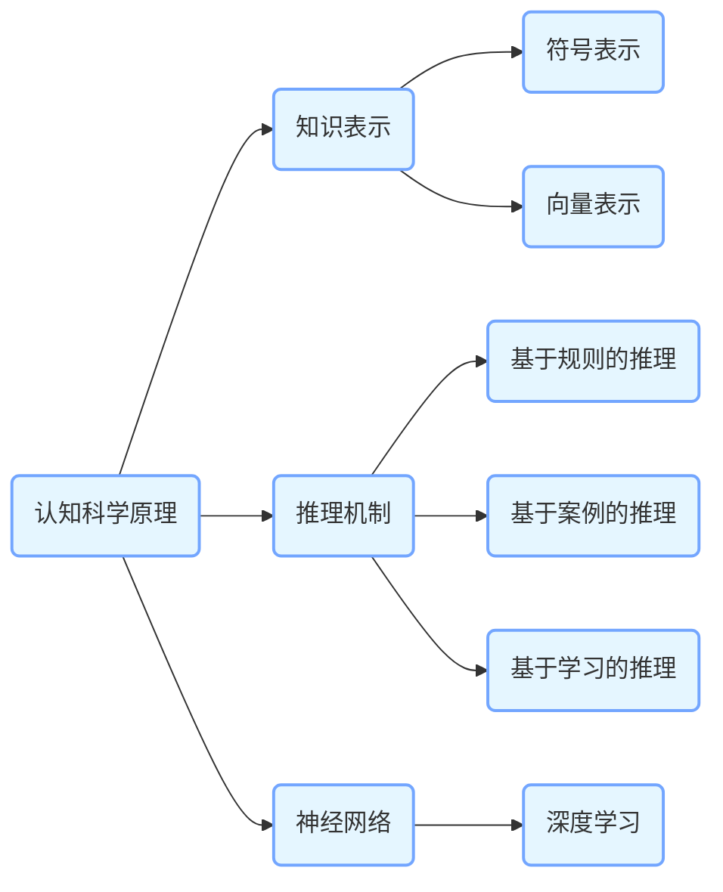

# 认知科学启发的神经推理模型的创新设计

> 关键词：认知科学、神经推理模型、创新设计、人工智能、知识表示、推理机制

> 摘要：本文聚焦于认知科学启发的神经推理模型的创新设计。首先介绍了该研究的背景，包括目的、预期读者、文档结构和相关术语。接着阐述了核心概念及其联系，通过文本示意图和Mermaid流程图进行清晰展示。详细讲解了核心算法原理，结合Python源代码进行说明，同时给出数学模型和公式，并举例阐释。在项目实战部分，进行了开发环境搭建，给出源代码实现和解读。探讨了该模型的实际应用场景，推荐了相关的学习资源、开发工具框架和论文著作。最后总结了未来发展趋势与挑战，提供了常见问题解答和扩展阅读参考资料。旨在为相关领域的研究者和开发者提供全面深入的技术指导和创新思路。

## 1. 背景介绍 
### 1.1 目的和范围
在人工智能领域，推理能力是实现智能系统高级功能的关键。传统的推理模型在处理复杂的语义信息和不确定知识时存在一定的局限性。认知科学研究人类的认知过程，包括感知、学习、记忆、推理等，为神经推理模型的设计提供了宝贵的灵感。本研究的目的是基于认知科学的原理，设计创新的神经推理模型，以提高模型在知识表示、推理效率和泛化能力等方面的性能。

本研究的范围涵盖了从认知科学理论到神经推理模型的设计、实现和应用。具体包括核心概念的阐述、算法原理的研究、数学模型的建立、项目实战的验证以及实际应用场景的探讨。

### 1.2 预期读者
本文预期读者包括人工智能领域的研究者、开发者、学生以及对认知科学和神经推理模型感兴趣的技术爱好者。对于研究者，本文提供了新的研究思路和方法；对于开发者，本文可以作为实践指导，帮助他们实现更高效的推理模型；对于学生，本文有助于他们深入理解认知科学和神经推理模型的相关知识。

### 1.3 文档结构概述
本文共分为十个部分。第一部分是背景介绍，包括目的、预期读者、文档结构和术语表。第二部分阐述核心概念与联系，通过文本示意图和Mermaid流程图进行展示。第三部分详细讲解核心算法原理，并结合Python源代码进行说明。第四部分给出数学模型和公式，并举例进行详细讲解。第五部分是项目实战，包括开发环境搭建、源代码实现和代码解读。第六部分探讨实际应用场景。第七部分推荐相关的工具和资源，包括学习资源、开发工具框架和论文著作。第八部分总结未来发展趋势与挑战。第九部分是附录，提供常见问题与解答。第十部分是扩展阅读和参考资料。

### 1.4 术语表
#### 1.4.1 核心术语定义
- **认知科学**：研究人类认知过程的学科，包括感知、学习、记忆、推理、语言等方面。
- **神经推理模型**：基于神经网络的推理模型，通过学习数据中的模式和关系进行推理。
- **知识表示**：将知识以计算机能够处理的形式进行表示，如符号表示、向量表示等。
- **推理机制**：模型根据已知知识进行推理的方法和规则。

#### 1.4.2 相关概念解释
- **神经网络**：一种模仿人类神经系统的计算模型，由大量的神经元组成，可以自动学习数据中的特征和模式。
- **深度学习**：一种基于神经网络的机器学习方法，通过多层神经网络进行特征学习和表示。
- **语义理解**：对文本或图像等信息的语义含义进行理解和分析。

#### 1.4.3 缩略词列表
- **AI**：人工智能（Artificial Intelligence）
- **NN**：神经网络（Neural Network）
- **DL**：深度学习（Deep Learning）

## 2. 核心概念与联系 

### 核心概念原理
认知科学启发的神经推理模型主要基于认知科学中的一些原理，如人类的知识表示、推理过程和学习机制。在人类认知中，知识通常以结构化的形式存储在大脑中，并且可以通过联想和推理进行检索和应用。神经推理模型借鉴了这些原理，将知识表示为向量或图结构，通过神经网络进行推理和学习。

知识表示是神经推理模型的基础，常见的知识表示方法包括符号表示和向量表示。符号表示将知识表示为离散的符号和规则，具有明确的语义含义，但在处理复杂知识和不确定性时存在一定的局限性。向量表示将知识表示为连续的向量，通过向量之间的运算进行推理，具有较好的泛化能力和处理不确定性的能力。

推理机制是神经推理模型的核心，常见的推理机制包括基于规则的推理、基于案例的推理和基于学习的推理。基于规则的推理根据预先定义的规则进行推理，具有较高的准确性和可解释性，但规则的制定需要大量的领域知识和人工干预。基于案例的推理通过检索和匹配相似的案例进行推理，适用于处理复杂的问题，但案例的存储和检索需要较大的存储空间和计算资源。基于学习的推理通过神经网络学习数据中的模式和关系进行推理，具有较强的自适应能力和泛化能力。

### 文本示意图
以下是认知科学启发的神经推理模型的核心概念关系示意图：

```plaintext
认知科学原理
    |
    |-- 知识表示
    |   |-- 符号表示
    |   |-- 向量表示
    |
    |-- 推理机制
    |   |-- 基于规则的推理
    |   |-- 基于案例的推理
    |   |-- 基于学习的推理
    |
    |-- 神经网络
        |-- 深度学习
```

### Mermaid流程图


## 3. 核心算法原理 & 具体操作步骤 

### 核心算法原理
本研究提出的认知科学启发的神经推理模型主要基于图神经网络（Graph Neural Network，GNN）和注意力机制（Attention Mechanism）。图神经网络可以有效地处理图结构的数据，如知识图谱，通过消息传递机制学习节点和边的特征表示。注意力机制可以自适应地分配不同节点和边的权重，提高模型的推理能力。

具体来说，模型的输入是一个知识图谱，包括节点（实体）和边（关系）。首先，将节点和边的特征进行嵌入，得到它们的向量表示。然后，使用图神经网络进行消息传递，更新节点和边的特征表示。在消息传递过程中，使用注意力机制计算不同节点和边的权重，使得模型能够更加关注重要的信息。最后，根据更新后的节点和边的特征表示进行推理，得到推理结果。

### 具体操作步骤
以下是使用Python实现认知科学启发的神经推理模型的具体操作步骤：

```python
import torch
import torch.nn as nn
import torch.nn.functional as F

# 定义图神经网络层
class GraphConvolution(nn.Module):
    def __init__(self, in_features, out_features):
        super(GraphConvolution, self).__init__()
        self.weight = nn.Parameter(torch.FloatTensor(in_features, out_features))
        self.reset_parameters()

    def reset_parameters(self):
        nn.init.xavier_uniform_(self.weight)

    def forward(self, input, adj):
        support = torch.mm(input, self.weight)
        output = torch.spmm(adj, support)
        return output

# 定义注意力机制层
class Attention(nn.Module):
    def __init__(self, in_features):
        super(Attention, self).__init__()
        self.attn = nn.Parameter(torch.FloatTensor(in_features, 1))
        self.reset_parameters()

    def reset_parameters(self):
        nn.init.xavier_uniform_(self.attn)

    def forward(self, input):
        attn_scores = torch.mm(input, self.attn)
        attn_weights = F.softmax(attn_scores, dim=0)
        output = torch.sum(attn_weights * input, dim=0)
        return output

# 定义神经推理模型
class NeuralReasoningModel(nn.Module):
    def __init__(self, in_features, hidden_features, out_features):
        super(NeuralReasoningModel, self).__init__()
        self.gc1 = GraphConvolution(in_features, hidden_features)
        self.attn = Attention(hidden_features)
        self.fc = nn.Linear(hidden_features, out_features)

    def forward(self, x, adj):
        x = F.relu(self.gc1(x, adj))
        x = self.attn(x)
        x = self.fc(x)
        return x

# 示例使用
in_features = 10
hidden_features = 20
out_features = 2
model = NeuralReasoningModel(in_features, hidden_features, out_features)

# 生成示例数据
x = torch.randn(100, in_features)
adj = torch.randn(100, 100)
adj = F.softmax(adj, dim=1)

# 前向传播
output = model(x, adj)
print(output)
```

### 代码解释
1. **GraphConvolution类**：定义了图神经网络层，通过矩阵乘法和稀疏矩阵乘法实现消息传递。
2. **Attention类**：定义了注意力机制层，通过计算注意力分数和权重，对输入进行加权求和。
3. **NeuralReasoningModel类**：定义了神经推理模型，包括一个图神经网络层、一个注意力机制层和一个全连接层。
4. **示例使用**：生成示例数据，调用模型进行前向传播，并打印输出结果。

## 4. 数学模型和公式 & 详细讲解 & 举例说明 

### 数学模型和公式
#### 图神经网络消息传递
图神经网络的消息传递过程可以用以下公式表示：

$$H^{(l+1)} = \sigma(\tilde{D}^{-\frac{1}{2}}\tilde{A}\tilde{D}^{-\frac{1}{2}}H^{(l)}W^{(l)})$$

其中，$H^{(l)}$ 是第 $l$ 层的节点特征矩阵，$\tilde{A} = A + I$ 是邻接矩阵加上自环，$\tilde{D}$ 是 $\tilde{A}$ 的度矩阵，$W^{(l)}$ 是第 $l$ 层的权重矩阵，$\sigma$ 是激活函数。

#### 注意力机制
注意力机制的计算过程可以用以下公式表示：

$$\alpha_i = \frac{\exp(\mathbf{w}^T \mathbf{h}_i)}{\sum_{j=1}^{N} \exp(\mathbf{w}^T \mathbf{h}_j)}$$

$$\mathbf{h}_{attn} = \sum_{i=1}^{N} \alpha_i \mathbf{h}_i$$

其中，$\mathbf{h}_i$ 是第 $i$ 个节点的特征向量，$\mathbf{w}$ 是注意力权重向量，$\alpha_i$ 是第 $i$ 个节点的注意力权重，$\mathbf{h}_{attn}$ 是经过注意力机制处理后的特征向量。

#### 推理结果
最终的推理结果可以通过全连接层得到：

$$\mathbf{y} = \mathbf{W}_{fc} \mathbf{h}_{attn} + \mathbf{b}_{fc}$$

其中，$\mathbf{W}_{fc}$ 是全连接层的权重矩阵，$\mathbf{b}_{fc}$ 是全连接层的偏置向量。

### 详细讲解
#### 图神经网络消息传递
图神经网络的消息传递过程是通过邻接矩阵和权重矩阵对节点特征进行更新。邻接矩阵 $\tilde{A}$ 表示节点之间的连接关系，度矩阵 $\tilde{D}$ 用于对邻接矩阵进行归一化，以避免梯度消失或爆炸问题。权重矩阵 $W^{(l)}$ 用于学习节点特征的转换。激活函数 $\sigma$ 引入非线性，增加模型的表达能力。

#### 注意力机制
注意力机制通过计算注意力权重，对不同节点的特征进行加权求和。注意力权重 $\alpha_i$ 表示第 $i$ 个节点的重要程度，通过 softmax 函数进行归一化。经过注意力机制处理后的特征向量 $\mathbf{h}_{attn}$ 更加关注重要的节点信息。

#### 推理结果
全连接层将经过注意力机制处理后的特征向量映射到输出空间，得到推理结果。权重矩阵 $\mathbf{W}_{fc}$ 和偏置向量 $\mathbf{b}_{fc}$ 用于学习输入特征和输出结果之间的映射关系。

### 举例说明
假设我们有一个简单的知识图谱，包含 3 个节点和 2 条边。节点的特征向量维度为 2，邻接矩阵为：

$$A = \begin{bmatrix}
0 & 1 & 0 \\
1 & 0 & 1 \\
0 & 1 & 0
\end{bmatrix}$$

节点的特征矩阵为：

$$H^{(0)} = \begin{bmatrix}
1 & 2 \\
3 & 4 \\
5 & 6
\end{bmatrix}$$

权重矩阵 $W^{(0)}$ 为：

$$W^{(0)} = \begin{bmatrix}
0.1 & 0.2 \\
0.3 & 0.4
\end{bmatrix}$$

首先，计算 $\tilde{A}$ 和 $\tilde{D}$：

$$\tilde{A} = A + I = \begin{bmatrix}
1 & 1 & 0 \\
1 & 1 & 1 \\
0 & 1 & 1
\end{bmatrix}$$

$$\tilde{D} = \begin{bmatrix}
2 & 0 & 0 \\
0 & 3 & 0 \\
0 & 0 & 2
\end{bmatrix}$$

然后，计算 $\tilde{D}^{-\frac{1}{2}}\tilde{A}\tilde{D}^{-\frac{1}{2}}$：

$$\tilde{D}^{-\frac{1}{2}}\tilde{A}\tilde{D}^{-\frac{1}{2}} = \begin{bmatrix}
0.5 & 0.408 & 0 \\
0.408 & 0.333 & 0.408 \\
0 & 0.408 & 0.5
\end{bmatrix}$$

接着，计算 $H^{(1)}$：

$$H^{(1)} = \sigma(\tilde{D}^{-\frac{1}{2}}\tilde{A}\tilde{D}^{-\frac{1}{2}}H^{(0)}W^{(0)})$$

假设激活函数 $\sigma$ 为 ReLU 函数，则：

$$H^{(1)} = \begin{bmatrix}
0.4 & 0.6 \\
0.8 & 1.2 \\
1.2 & 1.8
\end{bmatrix}$$

然后，使用注意力机制计算 $\mathbf{h}_{attn}$：

假设注意力权重向量 $\mathbf{w}$ 为：

$$\mathbf{w} = \begin{bmatrix}
0.1 \\
0.2
\end{bmatrix}$$

计算注意力分数和权重：

$$\alpha_1 = \frac{\exp(\mathbf{w}^T \mathbf{h}_1)}{\sum_{j=1}^{3} \exp(\mathbf{w}^T \mathbf{h}_j)} = 0.2$$

$$\alpha_2 = \frac{\exp(\mathbf{w}^T \mathbf{h}_2)}{\sum_{j=1}^{3} \exp(\mathbf{w}^T \mathbf{h}_j)} = 0.3$$

$$\alpha_3 = \frac{\exp(\mathbf{w}^T \mathbf{h}_3)}{\sum_{j=1}^{3} \exp(\mathbf{w}^T \mathbf{h}_j)} = 0.5$$

计算 $\mathbf{h}_{attn}$：

$$\mathbf{h}_{attn} = \sum_{i=1}^{3} \alpha_i \mathbf{h}_i = \begin{bmatrix}
0.92 \\
1.38
\end{bmatrix}$$

最后，通过全连接层得到推理结果：

假设全连接层的权重矩阵 $\mathbf{W}_{fc}$ 和偏置向量 $\mathbf{b}_{fc}$ 为：

$$\mathbf{W}_{fc} = \begin{bmatrix}
0.5 & 0.6 \\
0.7 & 0.8
\end{bmatrix}$$

$$\mathbf{b}_{fc} = \begin{bmatrix}
0.1 \\
0.2
\end{bmatrix}$$

则推理结果为：

$$\mathbf{y} = \mathbf{W}_{fc} \mathbf{h}_{attn} + \mathbf{b}_{fc} = \begin{bmatrix}
1.252 \\
1.696
\end{bmatrix}$$

## 5. 项目实战：代码实际案例和详细解释说明 

### 5.1  开发环境搭建
#### 操作系统
本项目可以在 Windows、Linux 或 macOS 操作系统上进行开发。建议使用 Linux 操作系统，如 Ubuntu 18.04 或更高版本。

#### Python 环境
使用 Python 3.7 或更高版本。可以使用 Anaconda 或 Miniconda 来管理 Python 环境。以下是创建和激活虚拟环境的示例命令：

```bash
conda create -n reasoning_model python=3.8
conda activate reasoning_model
```

#### 依赖库安装
安装必要的依赖库，包括 PyTorch、NumPy、SciPy 等。可以使用以下命令进行安装：

```bash
pip install torch numpy scipy
```

### 5.2  源代码详细实现和代码解读
以下是一个完整的项目实战代码示例：

```python
import torch
import torch.nn as nn
import torch.nn.functional as F
import numpy as np
import scipy.sparse as sp

# 定义图神经网络层
class GraphConvolution(nn.Module):
    def __init__(self, in_features, out_features):
        super(GraphConvolution, self).__init__()
        self.weight = nn.Parameter(torch.FloatTensor(in_features, out_features))
        self.reset_parameters()

    def reset_parameters(self):
        nn.init.xavier_uniform_(self.weight)

    def forward(self, input, adj):
        support = torch.mm(input, self.weight)
        output = torch.spmm(adj, support)
        return output

# 定义注意力机制层
class Attention(nn.Module):
    def __init__(self, in_features):
        super(Attention, self).__init__()
        self.attn = nn.Parameter(torch.FloatTensor(in_features, 1))
        self.reset_parameters()

    def reset_parameters(self):
        nn.init.xavier_uniform_(self.attn)

    def forward(self, input):
        attn_scores = torch.mm(input, self.attn)
        attn_weights = F.softmax(attn_scores, dim=0)
        output = torch.sum(attn_weights * input, dim=0)
        return output

# 定义神经推理模型
class NeuralReasoningModel(nn.Module):
    def __init__(self, in_features, hidden_features, out_features):
        super(NeuralReasoningModel, self).__init__()
        self.gc1 = GraphConvolution(in_features, hidden_features)
        self.attn = Attention(hidden_features)
        self.fc = nn.Linear(hidden_features, out_features)

    def forward(self, x, adj):
        x = F.relu(self.gc1(x, adj))
        x = self.attn(x)
        x = self.fc(x)
        return x

# 数据预处理函数
def preprocess_adj(adj):
    adj = adj + sp.eye(adj.shape[0])
    adj = sp.coo_matrix(adj)
    rowsum = np.array(adj.sum(1))
    d_inv_sqrt = np.power(rowsum, -0.5).flatten()
    d_inv_sqrt[np.isinf(d_inv_sqrt)] = 0.
    d_mat_inv_sqrt = sp.diags(d_inv_sqrt)
    return adj.dot(d_mat_inv_sqrt).transpose().dot(d_mat_inv_sqrt).tocoo()

# 训练函数
def train(model, x, adj, labels, optimizer, criterion, epochs):
    for epoch in range(epochs):
        optimizer.zero_grad()
        output = model(x, adj)
        loss = criterion(output, labels)
        loss.backward()
        optimizer.step()
        if epoch % 10 == 0:
            print(f'Epoch {epoch}, Loss: {loss.item()}')

# 示例使用
# 生成示例数据
num_nodes = 100
in_features = 10
hidden_features = 20
out_features = 2
x = torch.randn(num_nodes, in_features)
adj = sp.random(num_nodes, num_nodes, density=0.1)
adj = preprocess_adj(adj)
adj = torch.FloatTensor(np.array(adj.todense()))
labels = torch.randint(0, out_features, (1,))

# 初始化模型、优化器和损失函数
model = NeuralReasoningModel(in_features, hidden_features, out_features)
optimizer = torch.optim.Adam(model.parameters(), lr=0.01)
criterion = nn.CrossEntropyLoss()

# 训练模型
train(model, x, adj, labels, optimizer, criterion, epochs=100)
```

### 5.3  代码解读与分析
#### 图神经网络层（GraphConvolution）
- `__init__` 方法：初始化权重矩阵，并使用 Xavier 初始化方法进行参数初始化。
- `reset_parameters` 方法：重置权重矩阵的参数。
- `forward` 方法：实现图神经网络的消息传递过程，通过矩阵乘法和稀疏矩阵乘法更新节点特征。

#### 注意力机制层（Attention）
- `__init__` 方法：初始化注意力权重向量，并使用 Xavier 初始化方法进行参数初始化。
- `reset_parameters` 方法：重置注意力权重向量的参数。
- `forward` 方法：计算注意力分数和权重，对输入进行加权求和。

#### 神经推理模型（NeuralReasoningModel）
- `__init__` 方法：初始化图神经网络层、注意力机制层和全连接层。
- `forward` 方法：定义模型的前向传播过程，包括图神经网络的消息传递、注意力机制的处理和全连接层的映射。

#### 数据预处理函数（preprocess_adj）
对邻接矩阵进行预处理，包括添加自环、归一化等操作，以提高模型的训练效果。

#### 训练函数（train）
- 循环训练模型指定的轮数。
- 在每一轮中，清空优化器的梯度，进行前向传播计算输出，计算损失，进行反向传播更新参数。
- 每 10 轮打印一次损失值。

#### 示例使用
- 生成示例数据，包括节点特征矩阵、邻接矩阵和标签。
- 初始化模型、优化器和损失函数。
- 调用训练函数进行模型训练。

## 6. 实际应用场景 
认知科学启发的神经推理模型在许多实际应用场景中具有广泛的应用前景，以下是一些具体的应用场景：

### 知识图谱推理
知识图谱是一种结构化的知识表示方法，包含大量的实体和关系。神经推理模型可以用于知识图谱的推理任务，如实体链接、关系预测、知识补全等。通过学习知识图谱中的实体和关系的特征表示，模型可以推断出未知的实体关系，提高知识图谱的完整性和准确性。

### 自然语言处理
在自然语言处理中，神经推理模型可以用于语义理解、问答系统、文本生成等任务。例如，在问答系统中，模型可以根据问题和知识库中的知识进行推理，生成准确的答案。在文本生成中，模型可以根据上下文信息进行推理，生成连贯、有逻辑的文本。

### 智能医疗
在智能医疗领域，神经推理模型可以用于疾病诊断、治疗方案推荐、医学影像分析等任务。例如，在疾病诊断中，模型可以根据患者的症状、病史和检查结果进行推理，辅助医生做出准确的诊断。在治疗方案推荐中，模型可以根据患者的病情和基因信息进行推理，推荐个性化的治疗方案。

### 金融风险评估
在金融领域，神经推理模型可以用于金融风险评估、信用评级、投资决策等任务。例如，在金融风险评估中，模型可以根据企业的财务数据、市场信息和宏观经济数据进行推理，评估企业的信用风险和市场风险。在投资决策中，模型可以根据股票的历史数据和市场趋势进行推理，推荐投资组合。

### 智能交通
在智能交通领域，神经推理模型可以用于交通流量预测、交通事故预警、自动驾驶等任务。例如，在交通流量预测中，模型可以根据历史交通数据、天气信息和时间信息进行推理，预测未来的交通流量。在交通事故预警中，模型可以根据车辆的行驶状态、道路状况和交通信号进行推理，提前预警交通事故的发生。

## 7. 工具和资源推荐
### 7.1 学习资源推荐
#### 7.1.1 书籍推荐
- 《深度学习》（Deep Learning）：由 Ian Goodfellow、Yoshua Bengio 和 Aaron Courville 编写，是深度学习领域的经典教材，全面介绍了深度学习的基本概念、算法和应用。
- 《神经网络与深度学习》（Neural Networks and Deep Learning）：由 Michael Nielsen 编写，是一本免费的在线书籍，通过生动的例子和可视化的方式介绍了神经网络和深度学习的原理和应用。
- 《知识图谱：方法、实践与应用》：由王昊奋、漆桂林、陈华钧等编写，全面介绍了知识图谱的基本概念、构建方法、推理技术和应用场景。

#### 7.1.2 在线课程
- Coursera 上的 “Deep Learning Specialization”：由 Andrew Ng 教授授课，是深度学习领域最受欢迎的在线课程之一，包括五门课程，涵盖了深度学习的基础知识、卷积神经网络、循环神经网络等内容。
- edX 上的 “Artificial Intelligence”：由麻省理工学院（MIT）的 Patrick H. Winston 教授授课，是人工智能领域的经典课程，介绍了人工智能的基本概念、算法和应用。
- 中国大学 MOOC 上的 “知识图谱”：由陈华钧教授授课，系统介绍了知识图谱的基本概念、构建方法、推理技术和应用场景。

#### 7.1.3 技术博客和网站
- Medium 上的 Towards Data Science：是一个专注于数据科学和人工智能的技术博客，发表了许多高质量的技术文章和教程。
- arXiv：是一个预印本平台，提供了大量的学术论文，包括人工智能、机器学习、深度学习等领域的最新研究成果。
- AI开源社区：提供了丰富的人工智能开源项目、数据集和工具，是开发者学习和交流的重要平台。

### 7.2 开发工具框架推荐
#### 7.2.1 IDE和编辑器
- PyCharm：是一款专门为 Python 开发设计的集成开发环境（IDE），提供了丰富的代码编辑、调试、版本控制等功能，是 Python 开发者的首选工具之一。
- Jupyter Notebook：是一个交互式的开发环境，支持多种编程语言，如 Python、R、Julia 等，适合进行数据分析、模型训练和可视化等任务。
- Visual Studio Code：是一款轻量级的代码编辑器，支持多种编程语言和插件，具有丰富的扩展功能，是开发者常用的代码编辑工具之一。

#### 7.2.2 调试和性能分析工具
- PyTorch Profiler：是 PyTorch 提供的性能分析工具，可以帮助开发者分析模型的训练和推理时间、内存使用情况等，优化模型的性能。
- TensorBoard：是 TensorFlow 提供的可视化工具，可以帮助开发者可视化模型的训练过程、损失曲线、准确率等指标，方便调试和优化模型。
- cProfile：是 Python 内置的性能分析工具，可以帮助开发者分析 Python 代码的执行时间和函数调用情况，找出性能瓶颈。

#### 7.2.3 相关框架和库
- PyTorch：是一个开源的深度学习框架，提供了丰富的神经网络层、优化器和损失函数，支持 GPU 加速，是深度学习开发者的首选框架之一。
- TensorFlow：是一个开源的深度学习框架，由 Google 开发，提供了丰富的工具和库，支持分布式训练和部署，广泛应用于工业界和学术界。
- NetworkX：是一个用于创建、操作和研究复杂网络的 Python 库，提供了丰富的图算法和数据结构，适合进行图神经网络的开发和研究。

### 7.3 相关论文著作推荐
#### 7.3.1 经典论文
- “DeepWalk: Online Learning of Social Representations”：提出了 DeepWalk 算法，用于学习图结构数据中的节点表示，为图神经网络的发展奠定了基础。
- “Graph Convolutional Networks for Semi-Supervised Classification”：提出了图卷积网络（GCN），是图神经网络领域的经典论文，为后续的研究提供了重要的理论基础。
- “Attention Is All You Need”：提出了 Transformer 模型，引入了注意力机制，在自然语言处理领域取得了巨大的成功。

#### 7.3.2 最新研究成果
- “Neural-Symbolic Computing: An Effective Methodology for Integrating Machine Learning and Reasoning”：探讨了神经符号计算的方法，将机器学习和推理相结合，为人工智能的发展提供了新的思路。
- “Cognitive Graph for Multi-Hop Reading Comprehension at Scale”：提出了认知图模型，用于多跳阅读理解任务，提高了模型的推理能力和泛化能力。
- “Graph Neural Networks: A Review of Methods and Applications”：对图神经网络的方法和应用进行了全面的综述，为研究者提供了系统的参考。

#### 7.3.3 应用案例分析
- “Knowledge Graph Embedding for Link Prediction: A Comparative Analysis”：对知识图谱嵌入方法进行了比较分析，为知识图谱推理任务提供了实践指导。
- “Deep Learning for Medical Image Analysis: A Review”：对深度学习在医学影像分析中的应用进行了综述，介绍了相关的方法和案例。
- “Intelligent Transportation Systems: A Survey on Deep Learning Applications”：对深度学习在智能交通系统中的应用进行了综述，分析了相关的技术和挑战。

## 8. 总结：未来发展趋势与挑战
### 未来发展趋势
#### 多模态融合
未来的神经推理模型将更加注重多模态信息的融合，如文本、图像、语音等。通过融合多模态信息，模型可以获取更丰富的知识和信息，提高推理的准确性和可靠性。

#### 可解释性增强
随着人工智能技术的广泛应用，模型的可解释性变得越来越重要。未来的神经推理模型将更加注重可解释性的设计，通过引入符号推理、知识图谱等方法，提高模型的可解释性和透明度。

#### 认知能力提升
受认知科学的启发，未来的神经推理模型将不断提升自身的认知能力，如感知、学习、记忆、推理等。通过模拟人类的认知过程，模型可以更好地理解和处理复杂的问题，实现更加智能的决策和推理。

#### 与其他技术的融合
神经推理模型将与其他技术，如区块链、物联网、量子计算等进行融合，创造出更加智能和高效的应用场景。例如，与区块链技术结合，可以实现数据的安全共享和可信推理；与物联网技术结合，可以实现智能设备之间的协同推理。

### 挑战
#### 数据质量和数量
神经推理模型的性能很大程度上依赖于数据的质量和数量。在实际应用中，获取高质量、大规模的数据往往是一个挑战。同时，数据的标注和清洗也需要大量的人力和时间成本。

#### 计算资源需求
神经推理模型通常需要大量的计算资源进行训练和推理。随着模型规模的不断增大，计算资源的需求也越来越高。如何在有限的计算资源下提高模型的训练和推理效率是一个亟待解决的问题。

#### 模型可解释性
虽然可解释性是未来神经推理模型的发展趋势，但目前实现模型的可解释性仍然是一个挑战。如何在保证模型性能的前提下，提高模型的可解释性是一个需要深入研究的问题。

#### 伦理和法律问题
随着人工智能技术的广泛应用，伦理和法律问题也日益凸显。例如，模型的决策结果可能会对人类产生重大影响，如何确保模型的决策是公正、公平和合法的是一个需要关注的问题。

## 9. 附录：常见问题与解答
### 1. 什么是认知科学启发的神经推理模型？
认知科学启发的神经推理模型是基于认知科学的原理和方法，设计的一种神经推理模型。该模型借鉴了人类的认知过程，如知识表示、推理机制和学习方法，通过神经网络实现知识的表示和推理，提高模型的性能和泛化能力。

### 2. 图神经网络和传统神经网络有什么区别？
图神经网络是一种专门用于处理图结构数据的神经网络，与传统神经网络相比，具有以下区别：
- **数据结构**：传统神经网络通常处理的是欧几里得空间中的数据，如图像、文本等；而图神经网络处理的是图结构数据，如社交网络、知识图谱等。
- **信息传递**：传统神经网络通过神经元之间的连接进行信息传递；而图神经网络通过节点和边之间的消息传递进行信息传递，能够更好地捕捉图结构数据中的局部和全局信息。
- **模型复杂度**：图神经网络的模型复杂度通常较高，因为需要处理图结构数据的复杂性；而传统神经网络的模型复杂度相对较低。

### 3. 注意力机制在神经推理模型中有什么作用？
注意力机制在神经推理模型中起到了自适应地分配不同节点和边的权重的作用。通过注意力机制，模型可以更加关注重要的信息，提高推理的准确性和效率。具体来说，注意力机制可以帮助模型在处理大规模数据时，筛选出关键的信息，减少噪声的干扰；同时，注意力机制还可以提高模型的可解释性，通过可视化注意力权重，我们可以了解模型在推理过程中关注的重点。

### 4. 如何评估神经推理模型的性能？
评估神经推理模型的性能可以从以下几个方面进行：
- **准确率**：模型预测结果与真实结果的匹配程度，是最常用的评估指标之一。
- **召回率**：模型正确预测的正例占所有正例的比例，反映了模型的查全能力。
- **F1值**：准确率和召回率的调和平均值，综合考虑了模型的查准能力和查全能力。
- **推理速度**：模型进行推理所需的时间，反映了模型的效率。
- **可解释性**：模型的决策结果是否可以被解释和理解，是评估模型性能的重要指标之一。

### 5. 如何选择合适的开发工具和框架？
选择合适的开发工具和框架需要考虑以下几个因素：
- **项目需求**：根据项目的具体需求，选择适合的开发工具和框架。例如，如果项目需要处理图结构数据，可以选择图神经网络相关的框架，如 PyTorch Geometric、DGL 等。
- **个人经验**：考虑个人的编程经验和熟悉程度，选择自己熟悉的开发工具和框架，提高开发效率。
- **社区支持**：选择社区支持良好的开发工具和框架，这样可以更容易地获取相关的文档、教程和代码示例，解决遇到的问题。
- **性能和效率**：考虑开发工具和框架的性能和效率，选择能够满足项目需求的工具和框架。

## 10. 扩展阅读 & 参考资料
### 扩展阅读
- 《人工智能：现代方法》（Artificial Intelligence: A Modern Approach）：全面介绍了人工智能的基本概念、算法和应用，是人工智能领域的经典教材。
- 《深度学习实战》（Deep Learning in Practice）：通过实际案例介绍了深度学习的应用，包括图像识别、自然语言处理、语音识别等领域。
- 《图神经网络：从理论到实践》：详细介绍了图神经网络的原理、算法和应用，适合对图神经网络感兴趣的读者。

### 参考资料
- Goodfellow, I., Bengio, Y., & Courville, A. (2016). Deep Learning. MIT Press.
- Nielsen, M. A. (2015). Neural Networks and Deep Learning. Determination Press.
- Kipf, T. N., & Welling, M. (2016). Semi-Supervised Classification with Graph Convolutional Networks. arXiv preprint arXiv:1609.02907.
- Vaswani, A., Shazeer, N., Parmar, N., Uszkoreit, J., Jones, L., Gomez, A. N.,... & Polosukhin, I. (2017). Attention Is All You Need. Advances in Neural Information Processing Systems, 5998-6008.

作者：AI天才研究院/AI Genius Institute & 禅与计算机程序设计艺术 /Zen And The Art of Computer Programming