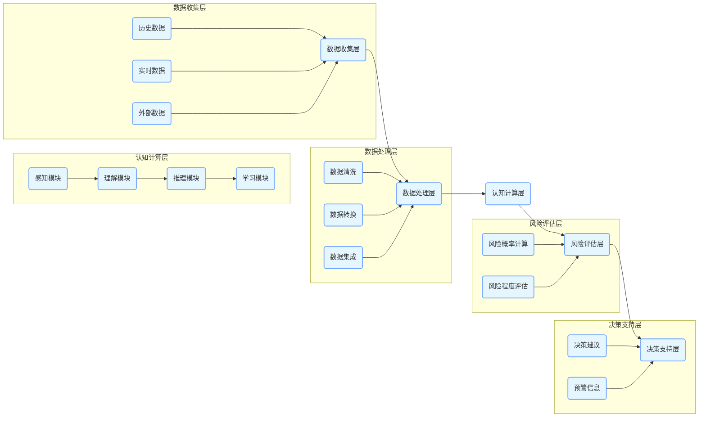

# 认知计算在智能风险评估系统中的创新应用

> 关键词：认知计算、智能风险评估系统、创新应用、数据处理、决策支持

> 摘要：本文深入探讨了认知计算在智能风险评估系统中的创新应用。首先介绍了相关背景，包括目的范围、预期读者等。接着阐述了认知计算和智能风险评估系统的核心概念及其联系，通过文本示意图和Mermaid流程图展示其架构。详细讲解了核心算法原理，并用Python代码进行具体实现。分析了相关数学模型和公式，并举例说明。通过项目实战展示代码案例及详细解释。探讨了实际应用场景，推荐了学习资源、开发工具框架和相关论文著作。最后总结了未来发展趋势与挑战，提供了常见问题解答和扩展阅读参考资料，旨在为认知计算在智能风险评估系统中的应用提供全面且深入的技术指导。

## 1. 背景介绍 
### 1.1 目的和范围
随着科技的飞速发展，各个领域面临的风险日益复杂多样。传统的风险评估方法往往难以应对海量、多源、异构的数据，以及复杂的风险场景。认知计算作为一种新兴的计算模式，具有理解、推理、学习和交互的能力，为智能风险评估系统带来了新的解决方案。本文的目的在于深入研究认知计算在智能风险评估系统中的创新应用，探讨其核心原理、算法实现、实际应用场景等方面，为相关领域的研究和实践提供理论支持和技术指导。

本文的范围涵盖了认知计算和智能风险评估系统的基本概念、核心算法、数学模型、项目实战以及实际应用等多个方面。通过对这些内容的详细阐述，全面展示认知计算在智能风险评估系统中的应用潜力和价值。

### 1.2 预期读者
本文的预期读者包括计算机科学、信息工程、风险管理等领域的专业人士，如程序员、软件架构师、风险评估师等。同时，也适合对认知计算和智能风险评估系统感兴趣的科研人员、学生以及企业管理人员阅读。这些读者可以从本文中获取关于认知计算在智能风险评估系统中应用的最新技术和实践经验，为其研究和工作提供参考。

### 1.3 文档结构概述
本文共分为十个部分，具体结构如下：
1. **背景介绍**：介绍本文的目的和范围、预期读者、文档结构概述以及相关术语表。
2. **核心概念与联系**：阐述认知计算和智能风险评估系统的核心概念，展示其联系和架构。
3. **核心算法原理 & 具体操作步骤**：详细讲解认知计算在智能风险评估系统中应用的核心算法原理，并使用Python代码进行具体实现。
4. **数学模型和公式 & 详细讲解 & 举例说明**：分析相关数学模型和公式，并通过具体例子进行说明。
5. **项目实战：代码实际案例和详细解释说明**：通过一个实际项目，展示代码的实现过程和详细解释。
6. **实际应用场景**：探讨认知计算在智能风险评估系统中的实际应用场景。
7. **工具和资源推荐**：推荐学习资源、开发工具框架和相关论文著作。
8. **总结：未来发展趋势与挑战**：总结认知计算在智能风险评估系统中的应用现状，分析未来发展趋势和面临的挑战。
9. **附录：常见问题与解答**：提供常见问题的解答，帮助读者更好地理解本文内容。
10. **扩展阅读 & 参考资料**：列出扩展阅读的相关资料和参考文献。

### 1.4 术语表
#### 1.4.1 核心术语定义
- **认知计算**：是一种模拟人类思维过程的计算模式，通过机器学习、自然语言处理、计算机视觉等技术，使计算机能够理解、推理、学习和交互。
- **智能风险评估系统**：是一种利用信息技术和数据分析方法，对各种风险进行评估和预测的系统。它能够自动收集、处理和分析大量的数据，为决策者提供准确的风险评估结果和决策建议。
- **机器学习**：是一门多领域交叉学科，涉及概率论、统计学、逼近论、凸分析、算法复杂度理论等多门学科。它专门研究计算机怎样模拟或实现人类的学习行为，以获取新的知识或技能，重新组织已有的知识结构使之不断改善自身的性能。
- **自然语言处理**：是计算机科学领域与人工智能领域中的一个重要方向。它研究能实现人与计算机之间用自然语言进行有效通信的各种理论和方法。

#### 1.4.2 相关概念解释
- **数据挖掘**：是指从大量的数据中通过算法搜索隐藏于其中信息的过程。数据挖掘通常与计算机科学有关，并通过统计、在线分析处理、情报检索、机器学习、专家系统（依靠过去的经验法则）和模式识别等诸多方法来实现上述目标。
- **知识图谱**：是一种基于图的数据结构，由节点（实体）和边（关系）组成。它能够将现实世界中的各种实体及其关系以图形化的方式表示出来，为认知计算提供丰富的知识支持。

#### 1.4.3 缩略词列表
- **AI**：Artificial Intelligence，人工智能
- **ML**：Machine Learning，机器学习
- **NLP**：Natural Language Processing，自然语言处理
- **RNN**：Recurrent Neural Network，循环神经网络
- **LSTM**：Long Short-Term Memory，长短期记忆网络

## 2. 核心概念与联系 
### 核心概念原理
#### 认知计算
认知计算的核心原理是模拟人类的思维过程，通过多种技术手段使计算机能够理解、处理和分析复杂的信息。它主要包括以下几个方面：
- **感知**：利用传感器、摄像头等设备收集外部环境的信息，如文本、图像、声音等。
- **理解**：通过自然语言处理、计算机视觉等技术对收集到的信息进行理解和分析，提取其中的关键信息和知识。
- **推理**：利用机器学习、知识图谱等技术对提取的信息进行推理和判断，得出结论和决策建议。
- **学习**：通过不断地学习和积累经验，提高计算机的认知能力和处理问题的能力。

#### 智能风险评估系统
智能风险评估系统的核心原理是利用信息技术和数据分析方法，对各种风险进行评估和预测。它主要包括以下几个方面：
- **数据收集**：收集与风险相关的各种数据，如历史数据、实时数据、外部数据等。
- **数据处理**：对收集到的数据进行清洗、转换、集成等处理，使其成为可供分析的有效数据。
- **风险评估**：利用机器学习、统计分析等方法对处理后的数据进行分析和评估，得出风险的概率和程度。
- **决策支持**：根据风险评估结果，为决策者提供决策建议和预警信息。

### 架构的文本示意图
```plaintext
智能风险评估系统
|
|-- 数据收集层
|   |-- 历史数据
|   |-- 实时数据
|   |-- 外部数据
|
|-- 数据处理层
|   |-- 数据清洗
|   |-- 数据转换
|   |-- 数据集成
|
|-- 认知计算层
|   |-- 感知模块
|   |   |-- 文本感知
|   |   |-- 图像感知
|   |   |-- 声音感知
|   |-- 理解模块
|   |   |-- 自然语言处理
|   |   |-- 计算机视觉
|   |-- 推理模块
|   |   |-- 机器学习
|   |   |-- 知识图谱
|   |-- 学习模块
|   |   |-- 深度学习
|   |   |-- 强化学习
|
|-- 风险评估层
|   |-- 风险概率计算
|   |-- 风险程度评估
|
|-- 决策支持层
|   |-- 决策建议
|   |-- 预警信息
```

### Mermaid流程图


## 3. 核心算法原理 & 具体操作步骤 
### 核心算法原理
在认知计算应用于智能风险评估系统中，常用的核心算法包括机器学习算法和深度学习算法。下面以支持向量机（SVM）和长短期记忆网络（LSTM）为例进行介绍。

#### 支持向量机（SVM）
支持向量机是一种二分类模型，其基本思想是在特征空间中找到一个最优的超平面，使得不同类别的样本能够被最大程度地分开。在风险评估中，可以将风险分为高风险和低风险两类，使用SVM算法进行分类预测。

#### 长短期记忆网络（LSTM）
长短期记忆网络是一种特殊的循环神经网络，能够有效地处理序列数据中的长期依赖关系。在风险评估中，许多数据具有时间序列特征，如股票价格、市场波动等，使用LSTM算法可以对这些时间序列数据进行建模和预测，从而评估风险的变化趋势。

### 具体操作步骤及Python代码实现
#### 数据准备
首先，我们需要准备风险评估所需的数据。假设我们有一个包含多个特征和风险标签的数据集，我们可以使用Python的`pandas`库来加载和处理数据。

```python
import pandas as pd

# 加载数据集
data = pd.read_csv('risk_data.csv')

# 分离特征和标签
X = data.drop('risk_label', axis=1)
y = data['risk_label']

# 划分训练集和测试集
from sklearn.model_selection import train_test_split
X_train, X_test, y_train, y_test = train_test_split(X, y, test_size=0.2, random_state=42)
```

#### SVM算法实现
```python
from sklearn.svm import SVC
from sklearn.metrics import accuracy_score

# 创建SVM分类器
svm_model = SVC(kernel='linear')

# 训练模型
svm_model.fit(X_train, y_train)

# 预测测试集
y_pred_svm = svm_model.predict(X_test)

# 计算准确率
accuracy_svm = accuracy_score(y_test, y_pred_svm)
print(f"SVM模型准确率: {accuracy_svm}")
```

#### LSTM算法实现
```python
import numpy as np
from tensorflow.keras.models import Sequential
from tensorflow.keras.layers import LSTM, Dense

# 将数据转换为适合LSTM输入的三维格式
X_train_lstm = np.array(X_train).reshape(X_train.shape[0], X_train.shape[1], 1)
X_test_lstm = np.array(X_test).reshape(X_test.shape[0], X_test.shape[1], 1)

# 创建LSTM模型
lstm_model = Sequential()
lstm_model.add(LSTM(50, input_shape=(X_train_lstm.shape[1], 1)))
lstm_model.add(Dense(1, activation='sigmoid'))

# 编译模型
lstm_model.compile(optimizer='adam', loss='binary_crossentropy', metrics=['accuracy'])

# 训练模型
lstm_model.fit(X_train_lstm, y_train, epochs=10, batch_size=32)

# 预测测试集
y_pred_lstm = lstm_model.predict(X_test_lstm)
y_pred_lstm = (y_pred_lstm > 0.5).astype(int)

# 计算准确率
accuracy_lstm = accuracy_score(y_test, y_pred_lstm)
print(f"LSTM模型准确率: {accuracy_lstm}")
```

## 4. 数学模型和公式 & 详细讲解 & 举例说明 
### 支持向量机（SVM）的数学模型和公式
#### 基本模型
支持向量机的基本模型是在特征空间中找到一个最优的超平面，使得不同类别的样本能够被最大程度地分开。对于一个二分类问题，假设训练数据集为 $\{(x_1, y_1), (x_2, y_2), \cdots, (x_n, y_n)\}$，其中 $x_i \in \mathbb{R}^d$ 是特征向量，$y_i \in \{-1, +1\}$ 是标签。超平面的方程可以表示为：

$$w^T x + b = 0$$

其中 $w \in \mathbb{R}^d$ 是超平面的法向量，$b \in \mathbb{R}$ 是偏置项。

#### 目标函数
支持向量机的目标是找到一个最优的超平面，使得间隔最大化。间隔是指超平面到最近样本点的距离，最大化间隔可以提高模型的泛化能力。目标函数可以表示为：

$$\max_{w, b} \frac{2}{\|w\|}$$

$$\text{s.t. } y_i(w^T x_i + b) \geq 1, i = 1, 2, \cdots, n$$

为了方便求解，我们可以将目标函数转化为最小化问题：

$$\min_{w, b} \frac{1}{2}\|w\|^2$$

$$\text{s.t. } y_i(w^T x_i + b) \geq 1, i = 1, 2, \cdots, n$$

#### 举例说明
假设我们有一个二维数据集，包含两个类别的样本点。我们可以使用支持向量机算法找到一个最优的超平面，将这两个类别分开。以下是一个简单的Python代码示例：

```python
import numpy as np
import matplotlib.pyplot as plt
from sklearn.svm import SVC

# 生成数据集
X = np.array([[3, 4], [1, 2], [4, 5], [2, 3], [5, 6], [1, 1]])
y = np.array([1, -1, 1, -1, 1, -1])

# 创建SVM分类器
svm_model = SVC(kernel='linear')

# 训练模型
svm_model.fit(X, y)

# 绘制样本点
plt.scatter(X[:, 0], X[:, 1], c=y, cmap=plt.cm.Paired)

# 绘制超平面
ax = plt.gca()
xlim = ax.get_xlim()
ylim = ax.get_ylim()

# 创建网格点
xx = np.linspace(xlim[0], xlim[1], 30)
yy = np.linspace(ylim[0], ylim[1], 30)
YY, XX = np.meshgrid(yy, xx)
xy = np.vstack([XX.ravel(), YY.ravel()]).T
Z = svm_model.decision_function(xy).reshape(XX.shape)

# 绘制超平面和间隔边界
ax.contour(XX, YY, Z, colors='k', levels=[-1, 0, 1], alpha=0.5, linestyles=['--', '-', '--'])

# 绘制支持向量
ax.scatter(svm_model.support_vectors_[:, 0], svm_model.support_vectors_[:, 1], s=100, facecolors='none', edgecolors='k')

plt.show()
```

### 长短期记忆网络（LSTM）的数学模型和公式
#### 基本结构
长短期记忆网络是一种特殊的循环神经网络，其基本结构包含输入门、遗忘门、输出门和细胞状态。

#### 输入门
输入门控制着新输入信息的多少，其计算公式为：

$$i_t = \sigma(W_{ii} x_t + W_{hi} h_{t-1} + b_i)$$

其中 $i_t$ 是输入门的输出，$x_t$ 是当前时刻的输入，$h_{t-1}$ 是上一时刻的隐藏状态，$W_{ii}$ 和 $W_{hi}$ 是权重矩阵，$b_i$ 是偏置项，$\sigma$ 是 sigmoid 函数。

#### 遗忘门
遗忘门控制着上一时刻细胞状态的遗忘程度，其计算公式为：

$$f_t = \sigma(W_{if} x_t + W_{hf} h_{t-1} + b_f)$$

其中 $f_t$ 是遗忘门的输出，$W_{if}$ 和 $W_{hf}$ 是权重矩阵，$b_f$ 是偏置项。

#### 细胞状态更新
细胞状态的更新公式为：

$$\tilde{C}_t = \tanh(W_{ic} x_t + W_{hc} h_{t-1} + b_c)$$

$$C_t = f_t \odot C_{t-1} + i_t \odot \tilde{C}_t$$

其中 $\tilde{C}_t$ 是候选细胞状态，$C_t$ 是当前时刻的细胞状态，$\odot$ 是逐元素相乘。

#### 输出门
输出门控制着当前时刻隐藏状态的输出，其计算公式为：

$$o_t = \sigma(W_{io} x_t + W_{ho} h_{t-1} + b_o)$$

$$h_t = o_t \odot \tanh(C_t)$$

其中 $o_t$ 是输出门的输出，$h_t$ 是当前时刻的隐藏状态。

#### 举例说明
假设我们要使用LSTM网络对一个时间序列进行预测。以下是一个简单的Python代码示例：

```python
import numpy as np
from tensorflow.keras.models import Sequential
from tensorflow.keras.layers import LSTM, Dense

# 生成时间序列数据
data = np.array([i for i in range(100)])
X = []
y = []
for i in range(len(data) - 10):
    X.append(data[i:i+10])
    y.append(data[i+10])
X = np.array(X)
y = np.array(y)

# 调整数据形状以适应LSTM输入
X = X.reshape(X.shape[0], X.shape[1], 1)

# 创建LSTM模型
model = Sequential()
model.add(LSTM(50, input_shape=(10, 1)))
model.add(Dense(1))

# 编译模型
model.compile(optimizer='adam', loss='mse')

# 训练模型
model.fit(X, y, epochs=100, batch_size=32)

# 预测
test_input = np.array(data[-10:])
test_input = test_input.reshape((1, 10, 1))
prediction = model.predict(test_input)
print(f"预测值: {prediction[0][0]}")
```

## 5. 项目实战：代码实际案例和详细解释说明 
### 5.1  开发环境搭建
为了实现认知计算在智能风险评估系统中的应用，我们需要搭建一个合适的开发环境。以下是具体的搭建步骤：

#### 安装Python
Python是一种广泛使用的编程语言，具有丰富的机器学习和数据分析库。我们可以从Python官方网站（https://www.python.org/downloads/）下载并安装Python。建议安装Python 3.7及以上版本。

#### 安装必要的库
我们需要安装一些必要的Python库，如`pandas`、`numpy`、`scikit-learn`、`tensorflow`等。可以使用`pip`命令进行安装：

```bash
pip install pandas numpy scikit-learn tensorflow matplotlib
```

#### 选择开发工具
可以选择使用Jupyter Notebook或PyCharm等开发工具。Jupyter Notebook是一种交互式的开发环境，适合进行数据分析和模型实验；PyCharm是一种专业的Python集成开发环境，适合进行大规模项目的开发。

### 5.2  源代码详细实现和代码解读
#### 数据加载和预处理
```python
import pandas as pd
from sklearn.preprocessing import StandardScaler
from sklearn.model_selection import train_test_split

# 加载数据集
data = pd.read_csv('risk_data.csv')

# 分离特征和标签
X = data.drop('risk_label', axis=1)
y = data['risk_label']

# 数据标准化
scaler = StandardScaler()
X = scaler.fit_transform(X)

# 划分训练集和测试集
X_train, X_test, y_train, y_test = train_test_split(X, y, test_size=0.2, random_state=42)
```
代码解读：
- 首先，使用`pandas`库的`read_csv`函数加载数据集。
- 然后，使用`drop`方法分离特征和标签。
- 接着，使用`StandardScaler`对特征数据进行标准化处理，使得数据具有零均值和单位方差，有助于提高模型的训练效果。
- 最后，使用`train_test_split`函数将数据集划分为训练集和测试集，测试集占比为20%。

#### 模型训练和评估
```python
from sklearn.svm import SVC
from sklearn.metrics import accuracy_score, classification_report

# 创建SVM分类器
svm_model = SVC(kernel='rbf')

# 训练模型
svm_model.fit(X_train, y_train)

# 预测测试集
y_pred = svm_model.predict(X_test)

# 计算准确率
accuracy = accuracy_score(y_test, y_pred)
print(f"模型准确率: {accuracy}")

# 打印分类报告
print(classification_report(y_test, y_pred))
```
代码解读：
- 首先，使用`SVC`类创建一个支持向量机分类器，选择径向基函数（RBF）作为核函数。
- 然后，使用`fit`方法对模型进行训练。
- 接着，使用`predict`方法对测试集进行预测。
- 最后，使用`accuracy_score`函数计算模型的准确率，并使用`classification_report`函数打印分类报告，包括精确率、召回率、F1值等指标。

### 5.3  代码解读与分析
#### 数据预处理的重要性
数据预处理是机器学习项目中非常重要的一步。通过数据标准化，可以消除不同特征之间的量纲差异，使得模型能够更好地学习数据的特征。同时，划分训练集和测试集可以评估模型的泛化能力，避免过拟合。

#### 模型选择和调优
在本项目中，我们选择了支持向量机作为分类模型。不同的模型适用于不同的数据集和问题，需要根据实际情况进行选择。同时，模型的参数也需要进行调优，如支持向量机的核函数、惩罚参数等。可以使用网格搜索、随机搜索等方法进行参数调优，以提高模型的性能。

#### 模型评估指标
除了准确率，我们还使用了分类报告中的精确率、召回率、F1值等指标来评估模型的性能。这些指标可以从不同的角度反映模型的分类效果，帮助我们更全面地了解模型的优缺点。

## 6. 实际应用场景 
### 金融领域
在金融领域，认知计算在智能风险评估系统中有着广泛的应用。例如：
- **信用风险评估**：银行和金融机构可以利用认知计算技术，对客户的信用历史、收入情况、消费行为等多源数据进行分析，评估客户的信用风险。通过自然语言处理技术，可以对客户的社交媒体数据、新闻报道等文本信息进行分析，获取更多的风险信息。
- **市场风险评估**：金融机构可以使用认知计算技术对股票、债券、期货等金融市场数据进行实时监测和分析，预测市场的波动和风险。通过机器学习算法，可以对历史数据进行建模，发现市场的规律和趋势，为投资决策提供支持。

### 医疗领域
在医疗领域，认知计算在智能风险评估系统中也发挥着重要作用。例如：
- **疾病风险评估**：医疗机构可以利用认知计算技术，对患者的病历、基因数据、生活习惯等多源数据进行分析，评估患者患某种疾病的风险。通过深度学习算法，可以对医学影像数据进行分析，辅助医生进行疾病诊断。
- **医疗事故风险评估**：医院可以使用认知计算技术对医疗过程中的各种数据进行监测和分析，评估医疗事故的风险。通过知识图谱技术，可以整合医疗领域的知识和经验，为医生提供决策支持，降低医疗事故的发生率。

### 交通领域
在交通领域，认知计算在智能风险评估系统中的应用也越来越广泛。例如：
- **交通事故风险评估**：交通管理部门可以利用认知计算技术，对交通流量、天气情况、道路状况等多源数据进行分析，评估交通事故的风险。通过计算机视觉技术，可以对交通监控视频进行分析，实时监测交通违法行为和事故隐患。
- **自动驾驶风险评估**：自动驾驶汽车制造商可以使用认知计算技术对车辆的传感器数据、行驶环境数据等进行分析，评估自动驾驶过程中的风险。通过强化学习算法，可以让自动驾驶汽车不断学习和优化行驶策略，提高行驶安全性。

## 7. 工具和资源推荐
### 7.1 学习资源推荐
#### 7.1.1 书籍推荐
- 《机器学习》（周志华）：这本书是机器学习领域的经典教材，全面介绍了机器学习的基本概念、算法和应用。
- 《深度学习》（Ian Goodfellow、Yoshua Bengio和Aaron Courville）：这本书是深度学习领域的权威著作，详细介绍了深度学习的原理、模型和算法。
- 《Python机器学习》（Sebastian Raschka）：这本书以Python为工具，介绍了机器学习的基本算法和实践应用。

#### 7.1.2 在线课程
- Coursera上的“机器学习”课程（Andrew Ng教授）：这是一门非常经典的机器学习课程，通过视频讲解、编程作业等方式，帮助学习者掌握机器学习的基本概念和算法。
- edX上的“深度学习”课程（由多家知名高校联合开设）：这门课程深入介绍了深度学习的原理和应用，包括神经网络、卷积神经网络、循环神经网络等。
- 网易云课堂上的“Python数据分析与机器学习实战”课程：这门课程结合实际案例，介绍了Python在数据分析和机器学习中的应用。

#### 7.1.3 技术博客和网站
- Medium：这是一个技术博客平台，上面有很多关于认知计算、机器学习、人工智能等领域的优质文章。
- Towards Data Science：这是一个专注于数据科学和机器学习的博客网站，提供了很多实用的技术文章和案例分析。
- GitHub：这是一个开源代码托管平台，上面有很多与认知计算和智能风险评估系统相关的开源项目，可以学习和参考。

### 7.2 开发工具框架推荐
#### 7.2.1 IDE和编辑器
- PyCharm：这是一个专业的Python集成开发环境，提供了丰富的代码编辑、调试、版本控制等功能，适合进行大规模项目的开发。
- Jupyter Notebook：这是一个交互式的开发环境，支持Python、R等多种编程语言，适合进行数据分析和模型实验。
- Visual Studio Code：这是一个轻量级的代码编辑器，支持多种编程语言和插件扩展，具有丰富的代码提示和调试功能。

#### 7.2.2 调试和性能分析工具
- TensorBoard：这是TensorFlow提供的一个可视化工具，可以用于监控模型的训练过程、可视化模型结构和分析性能指标。
- Py-Spy：这是一个Python性能分析工具，可以实时监控Python程序的CPU使用率、函数调用时间等信息，帮助开发者找出性能瓶颈。
- PDB：这是Python自带的调试器，可以在代码中设置断点，逐行调试程序，帮助开发者定位和解决问题。

#### 7.2.3 相关框架和库
- TensorFlow：这是一个开源的机器学习框架，提供了丰富的深度学习模型和算法，支持分布式训练和部署。
- PyTorch：这是另一个流行的深度学习框架，具有动态图机制，易于使用和调试，适合进行研究和开发。
- Scikit-learn：这是一个简单易用的机器学习库，提供了各种机器学习算法和工具，如分类、回归、聚类等。

### 7.3 相关论文著作推荐
#### 7.3.1 经典论文
- “Support-Vector Networks”（Cortes和Vapnik）：这篇论文首次提出了支持向量机的概念，奠定了支持向量机在机器学习领域的重要地位。
- “Long Short-Term Memory”（Hochreiter和Schmidhuber）：这篇论文提出了长短期记忆网络（LSTM），解决了传统循环神经网络的梯度消失问题，在自然语言处理、时间序列分析等领域得到了广泛应用。
- “ImageNet Classification with Deep Convolutional Neural Networks”（Krizhevsky、Sutskever和Hinton）：这篇论文提出了AlexNet模型，开创了深度学习在计算机视觉领域的应用先河。

#### 7.3.2 最新研究成果
- 可以关注顶级学术会议如NeurIPS（神经信息处理系统大会）、ICML（国际机器学习会议）、CVPR（计算机视觉与模式识别会议）等的最新研究成果，了解认知计算和智能风险评估系统领域的最新进展。
- 也可以关注知名学术期刊如Journal of Artificial Intelligence Research（JAIR）、Artificial Intelligence等的相关论文。

#### 7.3.3 应用案例分析
- 《人工智能：现代方法》（Stuart Russell和Peter Norvig）：这本书包含了很多人工智能的应用案例，包括认知计算在风险评估、决策支持等方面的应用。
- 一些行业报告和白皮书也会介绍认知计算在不同领域的应用案例，可以通过相关行业协会、咨询公司的网站获取。

## 8. 总结：未来发展趋势与挑战
### 未来发展趋势
#### 多模态融合
未来，认知计算在智能风险评估系统中将更加注重多模态数据的融合。除了传统的结构化数据，还将融合文本、图像、声音等非结构化数据，以获取更全面、准确的风险信息。例如，在金融领域，可以结合客户的财务报表、社交媒体文本、视频会议记录等多模态数据进行风险评估。

#### 强化学习的应用
强化学习将在智能风险评估系统中得到更广泛的应用。通过强化学习算法，系统可以在不断的实践中学习最优的风险评估策略，根据不同的风险场景做出实时决策。例如，在自动驾驶领域，强化学习可以让车辆根据实时路况和交通规则，不断优化行驶策略，降低事故风险。

#### 与区块链技术的结合
认知计算与区块链技术的结合将为智能风险评估系统带来新的发展机遇。区块链技术的去中心化、不可篡改等特点可以保证数据的安全性和可信度，为认知计算提供更可靠的数据基础。同时，认知计算可以对区块链上的数据进行分析和挖掘，发现潜在的风险和价值。例如，在供应链金融领域，区块链可以记录供应链上的交易信息，认知计算可以对这些信息进行分析，评估供应链的风险。

### 挑战
#### 数据隐私和安全
随着认知计算在智能风险评估系统中的应用，数据的隐私和安全问题变得越来越重要。系统需要处理大量的敏感数据，如个人隐私信息、商业机密等，如果这些数据被泄露或滥用，将带来严重的后果。因此，需要加强数据隐私保护技术的研究和应用，如加密技术、访问控制技术等。

#### 模型可解释性
深度学习等复杂模型在认知计算中取得了很好的效果，但这些模型往往缺乏可解释性。在智能风险评估系统中，决策者需要了解模型的决策依据，以便做出合理的决策。因此，需要研究和开发可解释的模型和算法，提高模型的透明度和可信度。

#### 计算资源和效率
认知计算需要处理大量的数据和复杂的模型，对计算资源的需求非常高。同时，为了满足实时风险评估的需求，系统需要具备较高的计算效率。因此，需要研究和开发高效的计算架构和算法，优化计算资源的利用，提高系统的计算效率。

## 9. 附录：常见问题与解答
### 问题1：认知计算和人工智能有什么区别？
认知计算是人工智能的一个子集，它更强调模拟人类的思维过程，具有理解、推理、学习和交互的能力。人工智能则是一个更广泛的概念，包括了认知计算、机器学习、自然语言处理、计算机视觉等多个领域。

### 问题2：在智能风险评估系统中，如何选择合适的算法？
选择合适的算法需要考虑多个因素，如数据类型、数据规模、问题复杂度等。如果数据是结构化的，且问题相对简单，可以选择传统的机器学习算法，如支持向量机、决策树等。如果数据是非结构化的，且问题具有序列特征，可以选择深度学习算法，如长短期记忆网络、卷积神经网络等。同时，还可以通过实验和比较不同算法的性能，选择最优的算法。

### 问题3：认知计算在智能风险评估系统中的应用是否会取代人类的决策？
认知计算在智能风险评估系统中的应用可以为人类提供更准确、全面的风险信息和决策建议，但不会取代人类的决策。人类具有丰富的经验、判断力和创造力，能够考虑到更多的因素和背景信息。认知计算可以作为人类决策的辅助工具，帮助人类做出更明智的决策。

### 问题4：如何提高认知计算在智能风险评估系统中的性能？
可以从以下几个方面提高认知计算在智能风险评估系统中的性能：
- **数据质量**：确保数据的准确性、完整性和一致性，对数据进行清洗和预处理。
- **模型选择和调优**：选择合适的模型，并对模型的参数进行调优，以提高模型的性能。
- **多模态融合**：融合多种类型的数据，获取更全面的信息。
- **计算资源优化**：合理利用计算资源，采用并行计算、分布式计算等技术，提高计算效率。

## 10. 扩展阅读 & 参考资料
### 扩展阅读
- 《人工智能时代的风险评估与管理》：深入探讨了人工智能在风险评估和管理领域的应用和挑战。
- 《认知计算：开启人工智能新时代》：介绍了认知计算的概念、技术和应用案例。

### 参考资料
- 周志华. 机器学习[M]. 清华大学出版社, 2016.
- Ian Goodfellow, Yoshua Bengio, Aaron Courville. 深度学习[M]. 人民邮电出版社, 2017.
- Sebastian Raschka. Python机器学习[M]. 机械工业出版社, 2018.

作者：AI天才研究院/AI Genius Institute & 禅与计算机程序设计艺术 /Zen And The Art of Computer Programming