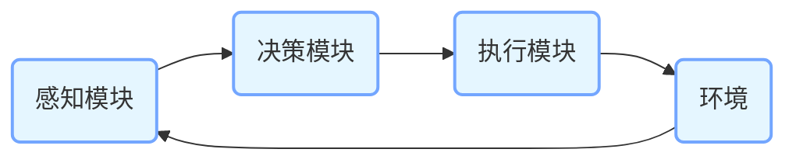
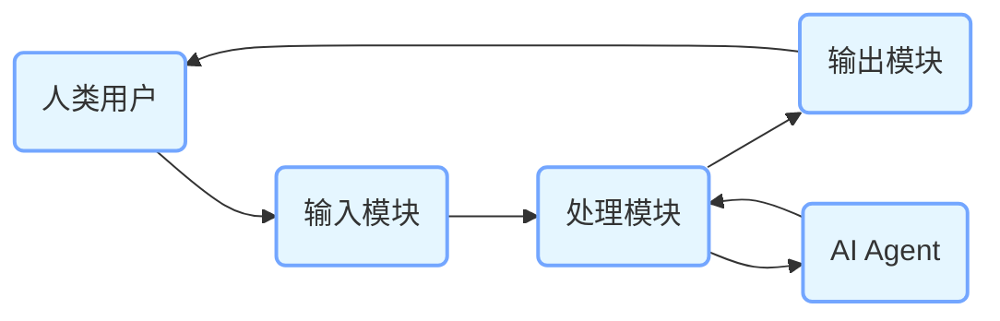

# 设计AI Agent的人机协作接口

> 关键词：AI Agent、人机协作接口、交互设计、通信协议、协作模式

> 摘要：本文聚焦于设计AI Agent的人机协作接口，旨在探讨如何构建高效、友好且安全的人机交互通道。首先介绍了相关背景知识，包括设计的目的、预期读者、文档结构和术语定义。接着阐述了核心概念，如AI Agent和人机协作接口的原理与架构，并给出相应的示意图和流程图。详细讲解了核心算法原理及操作步骤，运用Python代码进行示例。通过数学模型和公式进一步剖析设计的理论基础，并举例说明。提供了项目实战案例，涵盖开发环境搭建、源代码实现与解读。分析了实际应用场景，推荐了学习资源、开发工具框架和相关论文著作。最后总结了未来发展趋势与挑战，解答常见问题，并列出扩展阅读和参考资料。

## 1. 背景介绍 
### 1.1 目的和范围
设计AI Agent的人机协作接口的主要目的是促进人类与AI Agent之间的有效协作。随着人工智能技术的飞速发展，AI Agent在各个领域的应用越来越广泛，如智能客服、智能家居、自动驾驶等。然而，要实现人类与AI Agent的无缝协作，一个良好的人机协作接口至关重要。它可以提高协作效率、降低沟通成本、增强用户体验。

本文的范围涵盖了人机协作接口的设计原理、算法实现、实际应用等方面。我们将深入探讨如何设计一个具有高可用性、高交互性和高安全性的人机协作接口。

### 1.2 预期读者
本文的预期读者包括人工智能领域的研究人员、开发人员、软件架构师，以及对人机协作感兴趣的技术爱好者。对于研究人员，本文可以提供新的研究思路和方法；对于开发人员，能够帮助他们掌握设计人机协作接口的技术要点；对于软件架构师，有助于他们构建更加合理的系统架构；对于技术爱好者，可以让他们了解人机协作接口的基本原理和应用场景。

### 1.3 文档结构概述
本文将按照以下结构进行阐述：
1. **背景介绍**：介绍设计人机协作接口的目的、预期读者、文档结构和术语定义。
2. **核心概念与联系**：阐述AI Agent和人机协作接口的核心概念、原理和架构，并给出示意图和流程图。
3. **核心算法原理 & 具体操作步骤**：讲解核心算法原理，使用Python代码详细阐述具体操作步骤。
4. **数学模型和公式 & 详细讲解 & 举例说明**：通过数学模型和公式分析设计的理论基础，并举例说明。
5. **项目实战：代码实际案例和详细解释说明**：提供一个实际项目案例，包括开发环境搭建、源代码实现和代码解读。
6. **实际应用场景**：分析人机协作接口在不同领域的实际应用场景。
7. **工具和资源推荐**：推荐学习资源、开发工具框架和相关论文著作。
8. **总结：未来发展趋势与挑战**：总结人机协作接口的未来发展趋势和面临的挑战。
9. **附录：常见问题与解答**：解答读者可能遇到的常见问题。
10. **扩展阅读 & 参考资料**：列出扩展阅读的文献和参考资料。

### 1.4 术语表
#### 1.4.1 核心术语定义
- **AI Agent**：人工智能代理，是一种能够感知环境、自主决策并执行动作的软件实体。它可以根据预设的目标和规则，在不同的环境中进行交互和协作。
- **人机协作接口**：连接人类用户和AI Agent的桥梁，负责处理人类与AI Agent之间的信息交互和协作流程。它可以是图形用户界面（GUI）、命令行界面（CLI）、语音交互界面等。
- **交互协议**：规定了人类与AI Agent之间进行信息交换的格式和规则。常见的交互协议包括HTTP、WebSocket、MQTT等。
- **协作模式**：指人类与AI Agent之间的协作方式，如主从模式、伙伴模式、混合主动模式等。

#### 1.4.2 相关概念解释
- **感知**：AI Agent通过各种传感器（如摄像头、麦克风、传感器网络等）获取环境信息的过程。
- **决策**：AI Agent根据感知到的信息和预设的目标，选择合适的动作或策略的过程。
- **执行**：AI Agent将决策结果转化为实际动作，并在环境中执行的过程。

#### 1.4.3 缩略词列表
- **GUI**：Graphical User Interface，图形用户界面
- **CLI**：Command Line Interface，命令行界面
- **HTTP**：Hypertext Transfer Protocol，超文本传输协议
- **WebSocket**：一种在单个TCP连接上进行全双工通信的协议
- **MQTT**：Message Queuing Telemetry Transport，消息队列遥测传输协议

## 2. 核心概念与联系 

### 2.1 AI Agent的原理与架构
AI Agent通常由感知模块、决策模块和执行模块组成。感知模块负责收集环境信息，决策模块根据感知到的信息和预设的目标进行决策，执行模块将决策结果转化为实际动作。

其架构可以用以下示意图表示：



### 2.2 人机协作接口的原理与架构
人机协作接口的主要功能是实现人类与AI Agent之间的信息交互和协作流程。它可以分为输入模块、处理模块和输出模块。输入模块负责接收人类用户的输入信息，处理模块对输入信息进行处理和转换，输出模块将处理结果反馈给人类用户。

其架构可以用以下示意图表示：



### 2.3 核心概念的联系
AI Agent和人机协作接口是相互关联的。人机协作接口为人类与AI Agent之间提供了交互的通道，使得人类可以向AI Agent输入信息并获取其反馈。AI Agent则根据人机协作接口传递的信息进行感知、决策和执行，并将结果通过人机协作接口反馈给人类用户。

## 3. 核心算法原理 & 具体操作步骤 

### 3.1 核心算法原理
在设计人机协作接口时，常用的算法包括自然语言处理算法、机器学习算法和优化算法等。以下以自然语言处理算法为例，介绍其原理。

自然语言处理算法主要用于处理人类用户输入的自然语言信息。常见的自然语言处理任务包括文本分类、情感分析、命名实体识别等。其中，文本分类是将文本分为不同类别的任务。

文本分类的基本原理是通过训练一个分类模型，将输入的文本映射到不同的类别。常用的分类模型包括朴素贝叶斯分类器、支持向量机、深度学习模型等。

### 3.2 具体操作步骤
以下是使用Python实现一个简单的文本分类器的具体操作步骤：

```python
# 步骤1：导入必要的库
import numpy as np
from sklearn.feature_extraction.text import CountVectorizer
from sklearn.naive_bayes import MultinomialNB
from sklearn.model_selection import train_test_split

# 步骤2：准备数据集
documents = [
    "This is a positive review",
    "This is a negative review",
    "Another positive comment",
    "Another negative comment"
]
labels = [1, 0, 1, 0]

# 步骤3：将文本转换为特征向量
vectorizer = CountVectorizer()
X = vectorizer.fit_transform(documents)

# 步骤4：划分训练集和测试集
X_train, X_test, y_train, y_test = train_test_split(X, labels, test_size=0.2, random_state=42)

# 步骤5：训练分类模型
clf = MultinomialNB()
clf.fit(X_train, y_train)

# 步骤6：进行预测
new_documents = ["This is a great movie"]
new_X = vectorizer.transform(new_documents)
predictions = clf.predict(new_X)

print("预测结果:", predictions)
```

### 3.3 代码解释
- **步骤1**：导入必要的库，包括`numpy`、`CountVectorizer`、`MultinomialNB`和`train_test_split`。
- **步骤2**：准备数据集，包括文本数据和对应的标签。
- **步骤3**：使用`CountVectorizer`将文本转换为特征向量。
- **步骤4**：将数据集划分为训练集和测试集。
- **步骤5**：使用`MultinomialNB`训练分类模型。
- **步骤6**：对新的文本进行预测，并输出预测结果。

## 4. 数学模型和公式 & 详细讲解 & 举例说明 

### 4.1 数学模型
在文本分类中，常用的数学模型是朴素贝叶斯模型。朴素贝叶斯模型基于贝叶斯定理和特征条件独立假设。

贝叶斯定理的公式为：

$$P(C|X)=\frac{P(X|C)P(C)}{P(X)}$$

其中，$P(C|X)$ 表示在给定特征 $X$ 的条件下，类别 $C$ 的概率；$P(X|C)$ 表示在类别 $C$ 的条件下，特征 $X$ 的概率；$P(C)$ 表示类别 $C$ 的先验概率；$P(X)$ 表示特征 $X$ 的先验概率。

在朴素贝叶斯模型中，假设特征之间是条件独立的，即：

$$P(X|C)=\prod_{i=1}^{n}P(x_i|C)$$

其中，$x_i$ 表示特征 $X$ 的第 $i$ 个分量，$n$ 表示特征的维度。

### 4.2 详细讲解
朴素贝叶斯模型的训练过程主要是计算每个类别的先验概率 $P(C)$ 和每个特征在每个类别下的条件概率 $P(x_i|C)$。预测过程则是根据贝叶斯定理计算每个类别的后验概率 $P(C|X)$，并选择后验概率最大的类别作为预测结果。

### 4.3 举例说明
假设我们有一个文本分类问题，类别包括“体育”和“科技”，特征包括“篮球”、“足球”、“电脑”、“手机”。训练集中有以下文本：

| 文本 | 类别 |
| ---- | ---- |
| 篮球比赛很精彩 | 体育 |
| 足球世界杯很受欢迎 | 体育 |
| 电脑技术发展迅速 | 科技 |
| 手机功能越来越强大 | 科技 |

我们可以计算每个类别的先验概率：

$P(体育)=\frac{2}{4}=0.5$

$P(科技)=\frac{2}{4}=0.5$

然后计算每个特征在每个类别下的条件概率：

$P(篮球|体育)=\frac{1}{2}=0.5$

$P(足球|体育)=\frac{1}{2}=0.5$

$P(电脑|科技)=\frac{1}{2}=0.5$

$P(手机|科技)=\frac{1}{2}=0.5$

对于新的文本“篮球比赛很激烈”，我们可以计算其在每个类别下的后验概率：

$P(体育|篮球比赛很激烈)=P(篮球|体育)P(体育)=\ 0.5\times0.5 = 0.25$

$P(科技|篮球比赛很激烈)=P(篮球|科技)P(科技)=0\times0.5 = 0$

因为 $P(体育|篮球比赛很激烈)>P(科技|篮球比赛很激烈)$，所以预测该文本的类别为“体育”。

## 5. 项目实战：代码实际案例和详细解释说明 

### 5.1  开发环境搭建
本项目使用Python进行开发，需要安装以下库：
- `numpy`：用于数值计算
- `scikit-learn`：用于机器学习算法
- `Flask`：用于搭建Web服务器

可以使用以下命令进行安装：

```bash
pip install numpy scikit-learn flask
```

### 5.2  源代码详细实现和代码解读
以下是一个使用Flask搭建的简单人机协作接口的示例代码：

```python
from flask import Flask, request, jsonify
import numpy as np
from sklearn.feature_extraction.text import CountVectorizer
from sklearn.naive_bayes import MultinomialNB

app = Flask(__name__)

# 准备数据集
documents = [
    "This is a positive review",
    "This is a negative review",
    "Another positive comment",
    "Another negative comment"
]
labels = [1, 0, 1, 0]

# 将文本转换为特征向量
vectorizer = CountVectorizer()
X = vectorizer.fit_transform(documents)

# 训练分类模型
clf = MultinomialNB()
clf.fit(X, labels)

@app.route('/predict', methods=['POST'])
def predict():
    # 获取用户输入的文本
    data = request.get_json()
    text = data.get('text')
    
    # 将文本转换为特征向量
    new_X = vectorizer.transform([text])
    
    # 进行预测
    prediction = clf.predict(new_X)
    
    # 返回预测结果
    result = {
        'prediction': int(prediction[0])
    }
    return jsonify(result)

if __name__ == '__main__':
    app.run(debug=True)
```

### 5.3  代码解读与分析
- **导入必要的库**：导入`Flask`、`request`、`jsonify`、`numpy`、`CountVectorizer`和`MultinomialNB`。
- **准备数据集**：定义文本数据和对应的标签。
- **将文本转换为特征向量**：使用`CountVectorizer`将文本转换为特征向量。
- **训练分类模型**：使用`MultinomialNB`训练分类模型。
- **定义API接口**：使用`@app.route`装饰器定义一个POST请求的接口`/predict`。
- **获取用户输入的文本**：从请求的JSON数据中获取用户输入的文本。
- **进行预测**：将用户输入的文本转换为特征向量，并使用训练好的模型进行预测。
- **返回预测结果**：将预测结果以JSON格式返回给用户。

## 6. 实际应用场景 
### 6.1 智能客服
在智能客服场景中，人机协作接口可以实现用户与AI客服之间的自然语言交互。用户可以通过语音或文本向AI客服提出问题，AI客服通过人机协作接口接收用户的输入，进行分析和处理，并将结果反馈给用户。

### 6.2 智能家居
在智能家居场景中，人机协作接口可以实现用户与智能家居设备之间的交互。用户可以通过语音指令或手机APP向智能家居设备发送控制命令，AI Agent通过人机协作接口接收用户的指令，控制智能家居设备的运行。

### 6.3 自动驾驶
在自动驾驶场景中，人机协作接口可以实现驾驶员与自动驾驶系统之间的交互。驾驶员可以通过语音或手势向自动驾驶系统发出指令，自动驾驶系统通过人机协作接口接收驾驶员的指令，调整行驶策略。

### 6.4 金融服务
在金融服务场景中，人机协作接口可以实现用户与金融AI助手之间的交互。用户可以通过语音或文本向金融AI助手咨询投资建议、查询账户信息等，金融AI助手通过人机协作接口接收用户的请求，提供相应的服务。

## 7. 工具和资源推荐
### 7.1 学习资源推荐
#### 7.1.1 书籍推荐
- 《人工智能：一种现代的方法》：全面介绍了人工智能的基本概念、算法和应用。
- 《自然语言处理入门》：详细讲解了自然语言处理的基础知识和常用算法。
- 《机器学习》：系统介绍了机器学习的基本理论和方法。

#### 7.1.2 在线课程
- Coursera上的“人工智能基础”课程：由知名教授授课，涵盖了人工智能的核心内容。
- edX上的“自然语言处理”课程：提供了丰富的实践项目和案例分析。
- 中国大学MOOC上的“机器学习”课程：适合初学者入门。

#### 7.1.3 技术博客和网站
- 机器之心：提供人工智能领域的最新技术和研究成果。
- 深度学习论坛：汇集了大量深度学习相关的技术文章和讨论。
- 开源中国：提供开源项目和技术资源的分享平台。

### 7.2 开发工具框架推荐
#### 7.2.1 IDE和编辑器
- PyCharm：一款专业的Python集成开发环境，提供丰富的代码编辑、调试和部署功能。
- Visual Studio Code：一款轻量级的代码编辑器，支持多种编程语言和插件扩展。
- Jupyter Notebook：一种交互式的编程环境，适合数据分析和机器学习的开发。

#### 7.2.2 调试和性能分析工具
- Py-Spy：一款用于Python代码性能分析的工具，可以帮助开发者找出代码中的性能瓶颈。
- PDB：Python自带的调试器，可以帮助开发者调试代码中的错误。
- TensorBoard：一款用于深度学习模型可视化和调试的工具。

#### 7.2.3 相关框架和库
- TensorFlow：一款开源的深度学习框架，提供丰富的神经网络模型和工具。
- PyTorch：一款基于Python的深度学习框架，具有动态图和易用性的特点。
- NLTK：一款自然语言处理工具包，提供了丰富的文本处理功能和语料库。

### 7.3 相关论文著作推荐
#### 7.3.1 经典论文
- 《A Logical Calculus of the Ideas Immanent in Nervous Activity》：提出了神经网络的基本概念和模型。
- 《Learning Representations by Back-propagating Errors》：介绍了反向传播算法，是深度学习的重要基础。
- 《Attention Is All You Need》：提出了Transformer模型，在自然语言处理领域取得了巨大成功。

#### 7.3.2 最新研究成果
- 《GPT-3: Language Models are Few-Shot Learners》：介绍了GPT-3模型的原理和应用。
- 《DALL-E: Creating Images from Text》：展示了DALL-E模型在图像生成方面的能力。
- 《CLIP: Connecting Text and Images》：提出了CLIP模型，实现了文本和图像的跨模态理解。

#### 7.3.3 应用案例分析
- 《AI in Healthcare: A Review》：分析了人工智能在医疗领域的应用案例和挑战。
- 《Autonomous Vehicles: Technology, Challenges, and Opportunities》：探讨了自动驾驶技术的发展现状和未来趋势。
- 《AI in Finance: Applications and Challenges》：研究了人工智能在金融领域的应用场景和风险。

## 8. 总结：未来发展趋势与挑战
### 8.1 未来发展趋势
- **更加智能化**：未来的人机协作接口将具备更强的自然语言理解和生成能力，能够更好地理解人类的意图和情感，提供更加个性化的服务。
- **多模态交互**：除了文本和语音交互，未来的人机协作接口将支持更多的交互方式，如手势、表情、眼动等，实现更加自然和便捷的交互。
- **跨领域协作**：人机协作接口将在更多的领域得到应用，如医疗、教育、交通等，实现不同领域之间的协同工作。
- **与区块链结合**：将人机协作接口与区块链技术结合，可以提高数据的安全性和可信度，保障用户的隐私和权益。

### 8.2 挑战
- **安全性**：人机协作接口涉及大量的用户信息和敏感数据，如何保障数据的安全性和隐私性是一个重要的挑战。
- **可靠性**：在复杂的环境中，人机协作接口需要具备高可靠性，能够稳定地运行并准确地处理用户的请求。
- **伦理和法律问题**：随着人工智能的发展，人机协作接口可能会引发一系列的伦理和法律问题，如责任认定、算法偏见等。
- **用户接受度**：用户对人机协作接口的接受度也是一个挑战，需要设计出更加友好、易用的接口，提高用户的体验和满意度。

## 9. 附录：常见问题与解答
### 9.1 如何选择合适的交互协议？
选择合适的交互协议需要考虑以下因素：
- **实时性要求**：如果需要实时交互，如语音通话、实时监控等，建议选择WebSocket或MQTT协议。
- **数据量大小**：如果数据量较小，可以选择HTTP协议；如果数据量较大，建议选择更高效的协议，如gRPC。
- **安全性要求**：如果对数据安全性要求较高，建议选择具有加密功能的协议，如HTTPS。

### 9.2 如何提高人机协作接口的性能？
可以从以下几个方面提高人机协作接口的性能：
- **优化算法**：选择合适的算法，并对算法进行优化，提高处理速度和准确性。
- **缓存机制**：使用缓存机制，减少重复计算，提高响应速度。
- **分布式系统**：采用分布式系统架构，提高系统的并发处理能力。
- **硬件升级**：升级服务器硬件，提高系统的处理能力。

### 9.3 如何处理用户输入的异常情况？
处理用户输入的异常情况可以采用以下方法：
- **输入验证**：在接收用户输入时，进行输入验证，确保输入的合法性。
- **异常捕获**：在代码中使用异常捕获机制，捕获并处理可能出现的异常。
- **错误提示**：当出现异常时，向用户提供明确的错误提示，帮助用户解决问题。

## 10. 扩展阅读 & 参考资料
### 10.1 扩展阅读
- 《人工智能简史》：了解人工智能的发展历程和重要事件。
- 《人机共生》：探讨人类与人工智能的未来关系。
- 《智能时代》：分析人工智能对社会和经济的影响。

### 10.2 参考资料
- [Python官方文档](https://docs.python.org/3/)
- [scikit-learn官方文档](https://scikit-learn.org/stable/)
- [Flask官方文档](https://flask.palletsprojects.com/en/2.1.x/)

作者：AI天才研究院/AI Genius Institute & 禅与计算机程序设计艺术 /Zen And The Art of Computer Programming