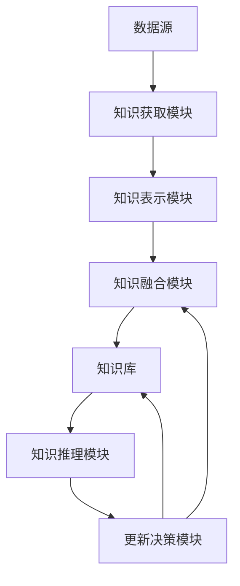

# 设计AI Agent的动态知识库更新机制

> 关键词：AI Agent、动态知识库、更新机制、知识表示、知识融合

> 摘要：本文围绕设计AI Agent的动态知识库更新机制展开。首先介绍相关背景知识，包括目的范围、预期读者等内容。接着阐述核心概念与联系，构建相应的架构与流程。深入探讨核心算法原理，并用Python代码详细说明操作步骤。从数学模型和公式角度进行理论剖析并举例。通过项目实战展示代码实现与解读。分析实际应用场景，推荐学习资源、开发工具和相关论文著作。最后总结未来发展趋势与挑战，解答常见问题并提供参考资料，旨在为AI Agent动态知识库更新机制的设计提供全面且深入的指导。

## 1. 背景介绍 
### 1.1 目的和范围
AI Agent作为人工智能领域的重要研究对象，其知识库是支撑其智能行为的关键基础。传统的知识库往往是静态的，难以适应不断变化的现实世界和用户需求。设计AI Agent的动态知识库更新机制的目的在于使AI Agent能够实时、高效地更新其知识库，以提高其对新知识的获取和利用能力，从而更好地完成各种任务，如自然语言处理、智能决策、机器人控制等。

本文章的范围涵盖了动态知识库更新机制的基本概念、核心算法、数学模型、实际应用等方面，旨在为研究人员和开发者提供一个全面的技术框架和实践指导。

### 1.2 预期读者
本文预期读者包括人工智能领域的研究人员、开发者、相关专业的学生以及对AI Agent和知识库技术感兴趣的技术爱好者。对于研究人员，本文可以为其深入研究动态知识库更新机制提供理论和实践参考；对于开发者，可帮助他们在实际项目中实现AI Agent的动态知识库更新功能；对于学生，有助于他们了解该领域的前沿知识和技术；对于技术爱好者，能让他们对AI Agent的工作原理和知识库更新机制有更深入的认识。

### 1.3 文档结构概述
本文将按照以下结构展开：首先介绍相关背景知识，包括目的、预期读者和文档结构等；接着阐述核心概念与联系，构建动态知识库更新机制的架构和流程；然后深入探讨核心算法原理，并给出Python代码实现；再从数学模型和公式角度进行详细讲解和举例；通过项目实战展示代码的实际应用和解读；分析动态知识库更新机制的实际应用场景；推荐相关的学习资源、开发工具和论文著作；最后总结未来发展趋势与挑战，解答常见问题并提供参考资料。

### 1.4 术语表
#### 1.4.1 核心术语定义
- **AI Agent**：人工智能代理，是一种能够感知环境、自主决策并采取行动以实现特定目标的智能实体。
- **动态知识库**：一种可以实时更新和扩展的知识库，能够随着时间和环境的变化不断调整其知识内容。
- **知识库更新机制**：用于管理和控制知识库中知识的添加、删除、修改等操作的一系列规则和算法。

#### 1.4.2 相关概念解释
- **知识表示**：将知识以计算机能够理解和处理的形式进行表示的方法，常见的知识表示方法包括语义网络、框架、产生式规则等。
- **知识融合**：将来自不同来源的知识进行整合和统一，以消除冲突和冗余，提高知识库的一致性和完整性。
- **知识推理**：根据知识库中的已有知识推导出新的知识的过程，是AI Agent实现智能决策和问题解决的重要手段。

#### 1.4.3 缩略词列表
- **KB**：Knowledge Base，知识库
- **ML**：Machine Learning，机器学习
- **NLP**：Natural Language Processing，自然语言处理

## 2. 核心概念与联系 

### 核心概念原理
AI Agent的动态知识库更新机制主要基于知识的获取、表示、融合和推理等过程。知识获取是指从各种数据源中收集新知识的过程，数据源可以包括文本、图像、传感器数据等。知识表示是将获取到的知识以合适的形式存储在知识库中，以便于计算机处理和管理。知识融合是对不同来源的知识进行整合和统一，以消除冲突和冗余。知识推理则是根据知识库中的已有知识推导出新的知识，以扩展知识库的内容。

### 架构的文本示意图
AI Agent的动态知识库更新机制主要由以下几个部分组成：
1. **数据源**：包括各种文本数据库、网络资源、传感器等，是新知识的来源。
2. **知识获取模块**：负责从数据源中提取新知识，并进行初步的处理和筛选。
3. **知识表示模块**：将获取到的知识转换为合适的表示形式，如语义网络、框架等。
4. **知识融合模块**：对不同来源的知识进行整合和统一，消除冲突和冗余。
5. **知识库**：存储经过处理和融合后的知识。
6. **知识推理模块**：根据知识库中的已有知识推导出新的知识。
7. **更新决策模块**：根据一定的规则和策略，决定是否对知识库进行更新以及如何更新。

### Mermaid 流程图


## 3. 核心算法原理 & 具体操作步骤 

### 核心算法原理
AI Agent的动态知识库更新机制主要涉及到知识获取、知识表示、知识融合和知识推理等算法。下面以基于机器学习的知识获取算法和基于规则的知识推理算法为例进行详细介绍。

#### 基于机器学习的知识获取算法
基于机器学习的知识获取算法主要是利用机器学习模型从大量的数据中自动提取新知识。常用的机器学习模型包括决策树、支持向量机、神经网络等。以神经网络为例，其基本原理是通过对大量的数据进行训练，学习数据中的特征和模式，从而实现对新知识的分类和预测。

#### 基于规则的知识推理算法
基于规则的知识推理算法是根据知识库中的规则和事实进行推理，以推导出新的知识。规则通常采用产生式规则的形式，即“如果……那么……”的形式。例如，规则“如果天气晴朗，那么可以去户外运动”，当事实“天气晴朗”成立时，就可以推导出“可以去户外运动”的结论。

### 具体操作步骤及Python源代码
#### 知识获取步骤及代码
```python
import pandas as pd
from sklearn.neural_network import MLPClassifier
from sklearn.model_selection import train_test_split
from sklearn.preprocessing import StandardScaler

# 加载数据
data = pd.read_csv('data.csv')
X = data.drop('label', axis=1)
y = data['label']

# 数据预处理
scaler = StandardScaler()
X = scaler.fit_transform(X)

# 划分训练集和测试集
X_train, X_test, y_train, y_test = train_test_split(X, y, test_size=0.2, random_state=42)

# 训练神经网络模型
model = MLPClassifier(hidden_layer_sizes=(100, 50), max_iter=1000)
model.fit(X_train, y_train)

# 预测新知识
new_data = [[1, 2, 3, 4, 5]]
new_data = scaler.transform(new_data)
prediction = model.predict(new_data)
print("预测结果:", prediction)
```

#### 知识推理步骤及代码
```python
# 定义规则库
rules = [
    {"if": "天气晴朗", "then": "可以去户外运动"},
    {"if": "天气下雨", "then": "需要带雨伞"}
]

# 定义事实库
facts = ["天气晴朗"]

# 进行推理
for rule in rules:
    if rule["if"] in facts:
        print("推理结果:", rule["then"])
```

## 4. 数学模型和公式 & 详细讲解 & 举例说明 

### 知识表示的数学模型
知识表示的数学模型主要包括逻辑表示、语义网络表示、框架表示等。以逻辑表示为例，逻辑表示是用逻辑公式来表示知识，常见的逻辑包括命题逻辑和谓词逻辑。

#### 命题逻辑
命题逻辑是研究命题之间逻辑关系的逻辑系统。命题是一个可以判断真假的陈述句。命题逻辑中的基本运算符包括与（$\land$）、或（$\lor$）、非（$\neg$）等。例如，命题“今天天气晴朗”可以用符号 $P$ 表示，命题“今天可以去户外运动”可以用符号 $Q$ 表示，那么规则“如果今天天气晴朗，那么今天可以去户外运动”可以用逻辑公式 $P \to Q$ 表示。

#### 谓词逻辑
谓词逻辑是在命题逻辑的基础上发展起来的，它可以处理更复杂的知识表示。谓词逻辑中引入了个体变量、谓词和量词等概念。例如，谓词 $Weather(x)$ 表示 $x$ 的天气情况，谓词 $OutdoorActivity(x)$ 表示 $x$ 是否可以进行户外运动，那么规则“如果 $x$ 的天气晴朗，那么 $x$ 可以进行户外运动”可以用谓词逻辑公式 $\forall x (Weather(x) = 晴朗 \to OutdoorActivity(x))$ 表示。

### 知识融合的数学模型
知识融合的数学模型主要是解决不同来源知识之间的冲突和冗余问题。常用的知识融合方法包括基于投票的方法、基于加权平均的方法等。以基于加权平均的方法为例，假设我们有 $n$ 个不同来源的知识 $K_1, K_2, \cdots, K_n$，每个知识的权重为 $w_1, w_2, \cdots, w_n$，且 $\sum_{i=1}^{n} w_i = 1$，那么融合后的知识 $K$ 可以表示为：
$$K = \sum_{i=1}^{n} w_i K_i$$

例如，假设有两个来源的知识 $K_1 = 0.6$ 和 $K_2 = 0.8$，它们的权重分别为 $w_1 = 0.4$ 和 $w_2 = 0.6$，那么融合后的知识为：
$$K = 0.4 \times 0.6 + 0.6 \times 0.8 = 0.72$$

## 5. 项目实战：代码实际案例和详细解释说明 

### 5.1  开发环境搭建
#### 操作系统
可以选择Windows、Linux或macOS等主流操作系统。

#### 编程语言
使用Python作为开发语言，Python具有丰富的库和工具，适合进行人工智能和机器学习开发。

#### 开发工具
推荐使用PyCharm作为集成开发环境（IDE），它提供了丰富的功能和插件，方便代码的编写、调试和管理。

#### 相关库
安装以下Python库：
- `pandas`：用于数据处理和分析。
- `scikit-learn`：用于机器学习算法的实现。
- `numpy`：用于数值计算。

可以使用以下命令进行安装：
```sh
pip install pandas scikit-learn numpy
```

### 5.2  源代码详细实现和代码解读
#### 知识获取模块
```python
import pandas as pd
from sklearn.neural_network import MLPClassifier
from sklearn.model_selection import train_test_split
from sklearn.preprocessing import StandardScaler

# 加载数据
data = pd.read_csv('data.csv')
X = data.drop('label', axis=1)
y = data['label']

# 数据预处理
scaler = StandardScaler()
X = scaler.fit_transform(X)

# 划分训练集和测试集
X_train, X_test, y_train, y_test = train_test_split(X, y, test_size=0.2, random_state=42)

# 训练神经网络模型
model = MLPClassifier(hidden_layer_sizes=(100, 50), max_iter=1000)
model.fit(X_train, y_train)

# 预测新知识
new_data = [[1, 2, 3, 4, 5]]
new_data = scaler.transform(new_data)
prediction = model.predict(new_data)
print("预测结果:", prediction)
```
代码解读：
1. **数据加载**：使用 `pandas` 库的 `read_csv` 函数加载数据文件 `data.csv`。
2. **数据预处理**：使用 `StandardScaler` 对数据进行标准化处理，以提高模型的训练效果。
3. **划分训练集和测试集**：使用 `train_test_split` 函数将数据划分为训练集和测试集，比例为 8:2。
4. **训练模型**：使用 `MLPClassifier` 训练一个多层感知器神经网络模型。
5. **预测新知识**：对新的数据进行标准化处理后，使用训练好的模型进行预测。

#### 知识推理模块
```python
# 定义规则库
rules = [
    {"if": "天气晴朗", "then": "可以去户外运动"},
    {"if": "天气下雨", "then": "需要带雨伞"}
]

# 定义事实库
facts = ["天气晴朗"]

# 进行推理
for rule in rules:
    if rule["if"] in facts:
        print("推理结果:", rule["then"])
```
代码解读：
1. **定义规则库**：使用列表存储规则，每个规则是一个字典，包含 `if` 和 `then` 两个键。
2. **定义事实库**：使用列表存储事实。
3. **进行推理**：遍历规则库，对于每个规则，如果其 `if` 条件在事实库中成立，则输出其 `then` 结论。

### 5.3  代码解读与分析
通过上述代码，我们实现了一个简单的AI Agent的动态知识库更新机制。知识获取模块利用机器学习模型从数据中提取新知识，知识推理模块根据规则和事实进行推理。在实际应用中，可以根据具体需求对代码进行扩展和优化，例如增加更多的知识获取方法、改进知识融合算法、优化规则库等。

## 6. 实际应用场景 
### 智能客服
在智能客服系统中，动态知识库更新机制可以实时更新客服知识库，以适应不断变化的客户问题和业务需求。例如，当有新的产品上线或业务规则发生变化时，知识库可以及时更新相关知识，使智能客服能够准确回答客户的问题。

### 智能医疗诊断
在智能医疗诊断系统中，动态知识库更新机制可以不断更新医学知识和病例数据，以提高诊断的准确性和效率。例如，当有新的疾病发现或治疗方法出现时，知识库可以及时更新相关知识，帮助医生做出更准确的诊断和治疗决策。

### 智能机器人
在智能机器人系统中，动态知识库更新机制可以使机器人实时学习和适应环境变化，提高其自主决策和行动能力。例如，当机器人遇到新的任务或环境时，知识库可以及时更新相关知识，使机器人能够更好地完成任务。

## 7. 工具和资源推荐
### 7.1 学习资源推荐
#### 7.1.1 书籍推荐
- 《人工智能：一种现代的方法》：全面介绍了人工智能的基本概念、算法和应用，是人工智能领域的经典教材。
- 《机器学习》：详细介绍了机器学习的各种算法和模型，是机器学习领域的权威著作。
- 《自然语言处理入门》：适合初学者学习自然语言处理的基础知识和技术。

#### 7.1.2 在线课程
- Coursera上的“Machine Learning”课程：由斯坦福大学教授Andrew Ng授课，是机器学习领域的经典课程。
- edX上的“Artificial Intelligence”课程：全面介绍了人工智能的基本概念、算法和应用。
- 中国大学MOOC上的“自然语言处理”课程：由国内知名高校教授授课，适合国内学生学习自然语言处理的知识和技术。

#### 7.1.3 技术博客和网站
- Medium：有很多人工智能和机器学习领域的优秀博客文章。
- arXiv：提供了大量的学术论文和研究成果。
- 机器之心：专注于人工智能领域的资讯和技术分享。

### 7.2 开发工具框架推荐
#### 7.2.1 IDE和编辑器
- PyCharm：功能强大的Python集成开发环境，适合进行人工智能和机器学习开发。
- Jupyter Notebook：交互式的开发环境，适合进行数据分析和模型训练。
- Visual Studio Code：轻量级的代码编辑器，支持多种编程语言和插件。

#### 7.2.2 调试和性能分析工具
- PDB：Python自带的调试工具，用于调试Python代码。
- TensorBoard：用于可视化TensorFlow模型的训练过程和性能指标。
- Pyflame：用于分析Python代码的性能瓶颈。

#### 7.2.3 相关框架和库
- TensorFlow：Google开发的深度学习框架，广泛应用于人工智能和机器学习领域。
- PyTorch：Facebook开发的深度学习框架，具有简洁易用的特点。
- NLTK：自然语言处理工具包，提供了丰富的自然语言处理算法和工具。

### 7.3 相关论文著作推荐
#### 7.3.1 经典论文
- “A Logical Calculus of the Ideas Immanent in Nervous Activity”：提出了神经元模型，是神经网络领域的经典论文。
- “Learning Representations by Back-propagating Errors”：提出了反向传播算法，是神经网络训练的核心算法。
- “Attention Is All You Need”：提出了Transformer模型，是自然语言处理领域的重要突破。

#### 7.3.2 最新研究成果
- 关注顶级学术会议如NeurIPS、ICML、ACL等的最新研究成果，了解人工智能和机器学习领域的前沿技术。

#### 7.3.3 应用案例分析
- 研究一些实际应用案例，如AlphaGo、Siri等，了解人工智能技术在实际应用中的实现方法和效果。

## 8. 总结：未来发展趋势与挑战
### 未来发展趋势
- **多模态知识融合**：未来的动态知识库更新