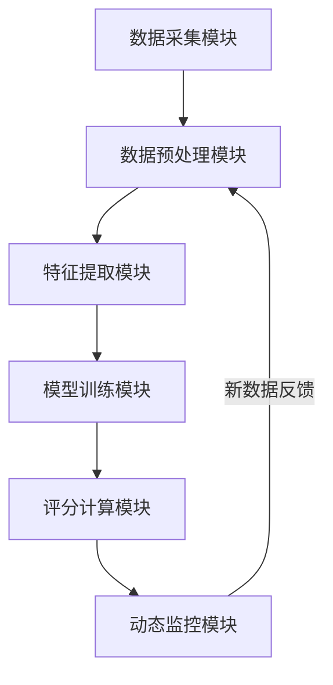

# 设计智能化的企业财务报表质量动态评分系统

> 关键词：智能化、企业财务报表、质量动态评分系统、数据挖掘、机器学习

> 摘要：本文旨在探讨如何设计智能化的企业财务报表质量动态评分系统。首先介绍了该系统设计的背景，包括目的、预期读者、文档结构和相关术语。接着阐述了核心概念与联系，包括系统的原理和架构，并通过Mermaid流程图进行展示。详细讲解了核心算法原理及具体操作步骤，使用Python代码进行说明。同时给出了数学模型和公式，并举例说明。通过项目实战，展示了开发环境搭建、源代码实现及代码解读。分析了该系统的实际应用场景，推荐了相关的工具和资源，包括学习资源、开发工具框架和论文著作。最后总结了未来发展趋势与挑战，解答了常见问题，并提供了扩展阅读和参考资料，为企业构建智能化的财务报表质量动态评分系统提供全面的技术指导。

## 1. 背景介绍 
### 1.1 目的和范围
企业财务报表是反映企业财务状况和经营成果的重要文件，其质量的高低直接影响到投资者、债权人、监管机构等利益相关者的决策。然而，目前对于企业财务报表质量的评估大多依赖于传统的人工分析方法，存在效率低、主观性强等问题。设计智能化的企业财务报表质量动态评分系统的目的在于利用先进的信息技术和数据分析方法，实现对企业财务报表质量的快速、客观、准确评估，并能实时跟踪财务报表质量的动态变化。

本系统的范围涵盖了对各类企业财务报表的分析，包括资产负债表、利润表、现金流量表等。系统将从多个维度对财务报表质量进行评估，如数据准确性、信息完整性、逻辑一致性等。

### 1.2 预期读者
本文的预期读者包括企业财务管理人员、审计人员、投资者、金融分析师以及对企业财务报表分析和智能化系统开发感兴趣的技术人员。对于财务管理人员和审计人员，该系统可以帮助他们更好地评估企业财务报表的质量，发现潜在的问题；对于投资者和金融分析师，系统提供的评分结果可以作为投资决策的参考依据；对于技术人员，本文提供的技术实现细节可以为他们开发类似的智能化系统提供借鉴。

### 1.3 文档结构概述
本文将按照以下结构进行组织：首先介绍核心概念与联系，包括系统的基本原理和架构；接着详细阐述核心算法原理及具体操作步骤，并给出Python代码实现；然后介绍数学模型和公式，并通过具体例子进行说明；通过项目实战展示系统的开发过程，包括开发环境搭建、源代码实现和代码解读；分析系统的实际应用场景；推荐相关的工具和资源；总结未来发展趋势与挑战；解答常见问题；最后提供扩展阅读和参考资料。

### 1.4 术语表
#### 1.4.1 核心术语定义
- **企业财务报表**：是企业对外提供的反映企业某一特定日期的财务状况和某一会计期间的经营成果、现金流量等会计信息的文件，主要包括资产负债表、利润表、现金流量表等。
- **财务报表质量**：指财务报表所提供信息的可靠性、相关性、完整性、及时性等特征的综合体现。高质量的财务报表能够准确、全面地反映企业的财务状况和经营成果，为利益相关者提供有用的决策依据。
- **动态评分系统**：是一种能够实时跟踪和评估对象状态变化，并根据预设的规则和算法给出相应评分的系统。在本系统中，动态评分系统将实时监测企业财务报表质量的变化，并及时调整评分结果。

#### 1.4.2 相关概念解释
- **数据挖掘**：是指从大量的数据中通过算法搜索隐藏于其中信息的过程。在本系统中，数据挖掘技术将用于从企业财务报表数据中提取有价值的信息和特征，为财务报表质量评估提供依据。
- **机器学习**：是一门多领域交叉学科，涉及概率论、统计学、逼近论、凸分析、算法复杂度理论等多门学科。它专门研究计算机怎样模拟或实现人类的学习行为，以获取新的知识或技能，重新组织已有的知识结构使之不断改善自身的性能。在本系统中，机器学习算法将用于构建财务报表质量评估模型，根据历史数据进行训练和预测。

#### 1.4.3 缩略词列表
- **AI**：Artificial Intelligence，人工智能
- **ML**：Machine Learning，机器学习
- **PCA**：Principal Component Analysis，主成分分析
- **SVM**：Support Vector Machine，支持向量机

## 2. 核心概念与联系 

### 核心概念原理
智能化的企业财务报表质量动态评分系统的核心原理是利用数据挖掘和机器学习技术，对企业财务报表数据进行分析和处理，提取与财务报表质量相关的特征，构建评估模型，根据模型对财务报表质量进行评分，并实时跟踪评分的动态变化。

系统首先对企业财务报表数据进行清洗和预处理，去除噪声和异常值，将数据转换为适合机器学习算法处理的格式。然后，利用特征工程技术从预处理后的数据中提取与财务报表质量相关的特征，如财务比率、趋势指标等。接着，选择合适的机器学习算法，如决策树、支持向量机、神经网络等，根据历史数据对模型进行训练，得到财务报表质量评估模型。最后，将待评估的企业财务报表数据输入到评估模型中，得到财务报表质量的评分，并根据新的数据实时更新评分结果。

### 架构的文本示意图
该系统主要由数据采集模块、数据预处理模块、特征提取模块、模型训练模块、评分计算模块和动态监控模块组成。
- **数据采集模块**：负责从企业的财务信息系统、审计报告等数据源中采集企业财务报表数据。
- **数据预处理模块**：对采集到的数据进行清洗、转换和标准化处理，去除噪声和异常值，将数据转换为适合机器学习算法处理的格式。
- **特征提取模块**：从预处理后的数据中提取与财务报表质量相关的特征，如财务比率、趋势指标等。
- **模型训练模块**：选择合适的机器学习算法，根据历史数据对模型进行训练，得到财务报表质量评估模型。
- **评分计算模块**：将待评估的企业财务报表数据输入到评估模型中，得到财务报表质量的评分。
- **动态监控模块**：实时监测企业财务报表数据的变化，根据新的数据更新评分结果，并及时发现财务报表质量的异常变化。

### Mermaid 流程图


## 3. 核心算法原理 & 具体操作步骤 

### 核心算法原理
本系统主要使用支持向量机（SVM）算法作为核心的机器学习算法。支持向量机是一种有监督的学习模型，可用于分类和回归分析。在本系统中，我们将使用支持向量机进行分类，将企业财务报表质量分为不同的等级，如高质量、中质量、低质量。

支持向量机的基本思想是在特征空间中找到一个最优的超平面，将不同类别的样本分开，使得不同类别样本到超平面的间隔最大。对于线性可分的数据集，支持向量机可以找到一个线性超平面将样本分开；对于线性不可分的数据集，支持向量机通过核函数将样本映射到高维空间，使得在高维空间中样本变得线性可分。

### 具体操作步骤
#### 步骤 1：数据准备
首先，从企业的财务信息系统、审计报告等数据源中采集企业财务报表数据，并将其存储在数据库中。然后，对采集到的数据进行清洗和预处理，去除噪声和异常值，将数据转换为适合机器学习算法处理的格式。

#### 步骤 2：特征提取
从预处理后的数据中提取与财务报表质量相关的特征，如财务比率、趋势指标等。常见的财务比率包括资产负债率、流动比率、毛利率等，趋势指标包括营业收入增长率、净利润增长率等。

#### 步骤 3：模型训练
将提取的特征作为输入，将企业财务报表质量的等级作为输出，划分训练集和测试集。使用支持向量机算法对训练集进行训练，得到财务报表质量评估模型。

#### 步骤 4：模型评估
使用测试集对训练好的模型进行评估，计算模型的准确率、召回率、F1值等指标，评估模型的性能。如果模型的性能不满足要求，可以调整模型的参数或选择其他的机器学习算法进行训练。

#### 步骤 5：评分计算
将待评估的企业财务报表数据输入到训练好的模型中，得到财务报表质量的等级，并根据预设的规则将等级转换为具体的评分。

#### 步骤 6：动态监控
实时监测企业财务报表数据的变化，根据新的数据更新评分结果，并及时发现财务报表质量的异常变化。

### Python源代码实现
```python
import pandas as pd
from sklearn.svm import SVC
from sklearn.model_selection import train_test_split
from sklearn.preprocessing import StandardScaler
from sklearn.metrics import accuracy_score, recall_score, f1_score

# 步骤 1：数据准备
# 假设我们已经从数据库中读取了数据，并存储在DataFrame中
data = pd.read_csv('financial_statement_data.csv')
X = data.drop('quality_level', axis=1)  # 特征数据
y = data['quality_level']  # 标签数据

# 数据标准化
scaler = StandardScaler()
X_scaled = scaler.fit_transform(X)

# 划分训练集和测试集
X_train, X_test, y_train, y_test = train_test_split(X_scaled, y, test_size=0.2, random_state=42)

# 步骤 3：模型训练
svm_model = SVC(kernel='rbf', C=1.0, gamma='scale')
svm_model.fit(X_train, y_train)

# 步骤 4：模型评估
y_pred = svm_model.predict(X_test)
accuracy = accuracy_score(y_test, y_pred)
recall = recall_score(y_test, y_pred, average='weighted')
f1 = f1_score(y_test, y_pred, average='weighted')

print(f"Accuracy: {accuracy}")
print(f"Recall: {recall}")
print(f"F1 Score: {f1}")

# 步骤 5：评分计算
# 假设我们有一个新的样本需要评估
new_sample = [[1.2, 0.8, 0.6, 0.4]]  # 新样本的特征数据
new_sample_scaled = scaler.transform(new_sample)
predicted_level = svm_model.predict(new_sample_scaled)

# 根据预设的规则将等级转换为具体的评分
score_mapping = {'high': 90, 'medium': 70, 'low': 30}
score = score_mapping[predicted_level[0]]
print(f"Predicted Score: {score}")
```

## 4. 数学模型和公式 & 详细讲解 & 举例说明 

### 支持向量机的数学模型
支持向量机的目标是在特征空间中找到一个最优的超平面 $w^T x + b = 0$，将不同类别的样本分开，使得不同类别样本到超平面的间隔最大。对于线性可分的数据集，支持向量机的优化问题可以表示为：

$$
\begin{aligned}
\min_{w,b} &\quad \frac{1}{2} \|w\|^2 \\
\text{s.t.} &\quad y_i (w^T x_i + b) \geq 1, \quad i = 1,2,\cdots,n
\end{aligned}
$$

其中，$w$ 是超平面的法向量，$b$ 是偏置项，$x_i$ 是第 $i$ 个样本的特征向量，$y_i$ 是第 $i$ 个样本的标签（$y_i \in \{-1, 1\}$），$n$ 是样本的数量。

对于线性不可分的数据集，支持向量机引入了松弛变量 $\xi_i \geq 0$，允许部分样本违反约束条件。此时，支持向量机的优化问题可以表示为：

$$
\begin{aligned}
\min_{w,b,\xi} &\quad \frac{1}{2} \|w\|^2 + C \sum_{i=1}^{n} \xi_i \\
\text{s.t.} &\quad y_i (w^T x_i + b) \geq 1 - \xi_i, \quad i = 1,2,\cdots,n \\
&\quad \xi_i \geq 0, \quad i = 1,2,\cdots,n
\end{aligned}
$$

其中，$C$ 是惩罚参数，用于控制对违反约束条件的样本的惩罚程度。

### 核函数
为了处理线性不可分的数据集，支持向量机引入了核函数 $K(x_i, x_j)$，将样本从原始特征空间映射到高维特征空间。常见的核函数包括线性核函数、多项式核函数、高斯核函数等。

- 线性核函数：$K(x_i, x_j) = x_i^T x_j$
- 多项式核函数：$K(x_i, x_j) = (\gamma x_i^T x_j + r)^d$，其中 $\gamma > 0$，$r$ 是常数，$d$ 是多项式的次数。
- 高斯核函数：$K(x_i, x_j) = \exp(-\gamma \|x_i - x_j\|^2)$，其中 $\gamma > 0$。

### 举例说明
假设我们有一个二维数据集，包含两个类别：正类和负类。我们可以使用支持向量机来找到一个最优的超平面将这两个类别分开。

```python
import numpy as np
import matplotlib.pyplot as plt
from sklearn.svm import SVC

# 生成数据集
np.random.seed(42)
X = np.r_[np.random.randn(20, 2) - [2, 2], np.random.randn(20, 2) + [2, 2]]
y = [0] * 20 + [1] * 20

# 训练支持向量机模型
svm_model = SVC(kernel='linear')
svm_model.fit(X, y)

# 绘制数据集和超平面
plt.scatter(X[:, 0], X[:, 1], c=y, cmap=plt.cm.Paired)
ax = plt.gca()
xlim = ax.get_xlim()
ylim = ax.get_ylim()

# 创建网格点
xx = np.linspace(xlim[0], xlim[1], 30)
yy = np.linspace(ylim[0], ylim[1], 30)
YY, XX = np.meshgrid(yy, xx)
xy = np.vstack([XX.ravel(), YY.ravel()]).T
Z = svm_model.decision_function(xy).reshape(XX.shape)

# 绘制决策边界和间隔边界
ax.contour(XX, YY, Z, colors='k', levels=[-1, 0, 1], alpha=0.5, linestyles=['--', '-', '--'])
plt.show()
```

在这个例子中，我们使用线性核函数的支持向量机来找到一个最优的超平面将两个类别分开。通过绘制决策边界和间隔边界，我们可以直观地看到支持向量机的工作原理。

## 5. 项目实战：代码实际案例和详细解释说明 

### 5.1  开发环境搭建
#### 操作系统
本项目可以在Windows、Linux或Mac OS等操作系统上进行开发。建议使用Linux操作系统，因为它具有更好的稳定性和开发环境支持。

#### 编程语言和库
本项目使用Python作为开发语言，需要安装以下Python库：
- **pandas**：用于数据处理和分析。
- **numpy**：用于数值计算。
- **scikit-learn**：用于机器学习算法的实现。
- **matplotlib**：用于数据可视化。

可以使用以下命令安装这些库：
```sh
pip install pandas numpy scikit-learn matplotlib
```

#### 数据库
本项目需要使用数据库来存储企业财务报表数据。可以选择关系型数据库，如MySQL、PostgreSQL，也可以选择非关系型数据库，如MongoDB。这里我们选择MySQL作为数据库。

安装MySQL数据库，并创建一个新的数据库和表来存储财务报表数据。

### 5.2  源代码详细实现和代码解读
以下是一个完整的项目实战代码示例，包括数据采集、数据预处理、特征提取、模型训练、评分计算和动态监控等步骤。

```python
import pandas as pd
import numpy as np
from sklearn.svm import SVC
from sklearn.model_selection import train_test_split
from sklearn.preprocessing import StandardScaler
from sklearn.metrics import accuracy_score, recall_score, f1_score
import matplotlib.pyplot as plt

# 步骤 1：数据采集
# 假设我们已经从MySQL数据库中读取了数据，并存储在DataFrame中
import mysql.connector

# 连接到MySQL数据库
mydb = mysql.connector.connect(
    host="localhost",
    user="your_username",
    password="your_password",
    database="financial_statement_db"
)

# 执行SQL查询，获取财务报表数据
mycursor = mydb.cursor()
mycursor.execute("SELECT * FROM financial_statements")
data = mycursor.fetchall()
columns = [desc[0] for desc in mycursor.description]
data = pd.DataFrame(data, columns=columns)

# 步骤 2：数据预处理
# 处理缺失值
data = data.dropna()

# 分离特征数据和标签数据
X = data.drop('quality_level', axis=1)
y = data['quality_level']

# 数据标准化
scaler = StandardScaler()
X_scaled = scaler.fit_transform(X)

# 步骤 3：特征提取
# 这里我们可以根据需要提取更多的特征，如财务比率、趋势指标等
# 例如，计算资产负债率
X['debt_to_asset_ratio'] = X['total_debt'] / X['total_assets']

# 步骤 4：模型训练
# 划分训练集和测试集
X_train, X_test, y_train, y_test = train_test_split(X_scaled, y, test_size=0.2, random_state=42)

# 创建支持向量机模型
svm_model = SVC(kernel='rbf', C=1.0, gamma='scale')

# 训练模型
svm_model.fit(X_train, y_train)

# 步骤 5：模型评估
y_pred = svm_model.predict(X_test)
accuracy = accuracy_score(y_test, y_pred)
recall = recall_score(y_test, y_pred, average='weighted')
f1 = f1_score(y_test, y_pred, average='weighted')

print(f"Accuracy: {accuracy}")
print(f"Recall: {recall}")
print(f"F1 Score: {f1}")

# 步骤 6：评分计算
# 假设我们有一个新的样本需要评估
new_sample = [[1.2, 0.8, 0.6, 0.4]]  # 新样本的特征数据
new_sample_scaled = scaler.transform(new_sample)
predicted_level = svm_model.predict(new_sample_scaled)

# 根据预设的规则将等级转换为具体的评分
score_mapping = {'high': 90, 'medium': 70, 'low': 30}
score = score_mapping[predicted_level[0]]
print(f"Predicted Score: {score}")

# 步骤 7：动态监控
# 模拟新数据的到来
new_data = pd.DataFrame({
    'feature1': [1.5],
    'feature2': [0.9],
    'feature3': [0.7],
    'feature4': [0.5]
})

# 数据预处理
new_data_scaled = scaler.transform(new_data)

# 预测新数据的质量等级
new_predicted_level = svm_model.predict(new_data_scaled)
new_score = score_mapping[new_predicted_level[0]]
print(f"New Predicted Score: {new_score}")

# 可视化评分的动态变化
scores = [score, new_score]
plt.plot([1, 2], scores, marker='o')
plt.xlabel('Time')
plt.ylabel('Score')
plt.title('Dynamic Score Monitoring')
plt.show()
```

### 5.3  代码解读与分析
- **数据采集**：使用`mysql.connector`库连接到MySQL数据库，并执行SQL查询获取财务报表数据。将查询结果存储在DataFrame中，方便后续的数据处理和分析。
- **数据预处理**：处理缺失值，使用`dropna()`方法删除包含缺失值的行。分离特征数据和标签数据，并使用`StandardScaler`对特征数据进行标准化处理，使得不同特征具有相同的尺度。
- **特征提取**：根据需要提取更多的特征，如财务比率、趋势指标等。这里我们计算了资产负债率作为一个新的特征。
- **模型训练**：使用`train_test_split`方法将数据集划分为训练集和测试集。创建支持向量机模型，并使用训练集对模型进行训练。
- **模型评估**：使用测试集对训练好的模型进行评估，计算模型的准确率、召回率和F1值，评估模型的性能。
- **评分计算**：对于新的样本，先对其特征数据进行标准化处理，然后使用训练好的模型预测其质量等级，并根据预设的规则将等级转换为具体的评分。
- **动态监控**：模拟新数据的到来，对新数据进行预处理和预测，得到新的评分。使用`matplotlib`库可视化评分的动态变化，方便用户实时监测财务报表质量的变化。

## 6. 实际应用场景 
### 投资者决策
投资者在进行投资决策时，需要对企业的财务状况进行评估。智能化的企业财务报表质量动态评分系统可以为投资者提供客观、准确的财务报表质量评分，帮助投资者快速了解企业财务报表的可靠性，从而降低投资风险。例如，投资者可以根据评分结果筛选出财务报表质量较高的企业进行投资，避免投资那些财务报表存在问题的企业。

### 审计工作
审计人员在进行审计工作时，可以使用该系统对企业财务报表进行初步评估。系统可以帮助审计人员快速发现财务报表中的潜在问题和异常情况，提高审计工作的效率和准确性。例如，系统可以通过对财务报表数据的分析，发现数据的逻辑不一致、异常波动等问题，为审计人员提供审计线索。

### 企业内部管理
企业内部管理人员可以使用该系统对企业自身的财务报表质量进行监控和评估。通过实时跟踪财务报表质量的动态变化，企业管理人员可以及时发现财务管理中存在的问题，采取相应的措施进行改进，提高企业的财务管理水平。例如，企业管理人员可以根据评分结果分析财务报表质量下降的原因，如会计核算不规范、内部控制制度不完善等，并及时采取措施加以解决。

### 监管机构监管
监管机构可以使用该系统对企业的财务报表进行监管。系统可以帮助监管机构快速识别财务报表质量较差的企业，加强对这些企业的监管力度，维护市场秩序。例如，监管机构可以根据评分结果对财务报表质量较低的企业进行重点检查，要求企业进行整改，对违规企业进行处罚。

## 7. 工具和资源推荐
### 7.1 学习资源推荐
#### 7.1.1 书籍推荐
- 《Python数据分析实战》：本书介绍了如何使用Python进行数据分析，包括数据处理、数据可视化、机器学习等方面的内容，适合初学者入门。
- 《机器学习实战》：本书通过实际案例介绍了机器学习的基本算法和应用，包括决策树、支持向量机、神经网络等，帮助读者快速掌握机器学习的实践技能。
- 《财务报表分析》：本书系统地介绍了财务报表分析的方法和技巧，包括资产负债表分析、利润表分析、现金流量表分析等，为读者提供了深入了解企业财务状况的工具。

#### 7.1.2 在线课程
- Coursera上的“机器学习”课程：由斯坦福大学教授Andrew Ng主讲，是一门非常经典的机器学习入门课程，涵盖了机器学习的基本概念、算法和应用。
- edX上的“Python for Data Science”课程：该课程介绍了如何使用Python进行数据分析，包括数据处理、数据可视化、机器学习等方面的内容，适合初学者学习。
- 中国大学MOOC上的“财务报表分析”课程：由国内知名高校的教授主讲，系统地介绍了财务报表分析的方法和技巧，帮助学生掌握财务报表分析的基本技能。

#### 7.1.3 技术博客和网站
- Medium：是一个技术博客平台，上面有很多关于机器学习、数据分析等方面的优质文章，读者可以从中获取最新的技术动态和实践经验。
- Kaggle：是一个数据科学竞赛平台，上面有很多公开的数据集和优秀的数据分析代码，读者可以通过参加竞赛和学习他人的代码来提高自己的数据分析能力。
- 知乎：是一个知识分享社区，上面有很多关于企业财务报表分析、机器学习等方面的问题和回答，读者可以从中获取不同的观点和思路。

### 7.2 开发工具框架推荐
#### 7.2.1 IDE和编辑器
- PyCharm：是一款专门为Python开发设计的集成开发环境（IDE），具有代码编辑、调试、代码分析等功能，适合Python开发者使用。
- Jupyter Notebook：是一个交互式的开发环境，支持Python、R等多种编程语言，适合数据分析和机器学习的实验和开发。
- Visual Studio Code：是一款轻量级的代码编辑器，支持多种编程语言和插件扩展，具有丰富的功能和良好的用户体验。

#### 7.2.2 调试和性能分析工具
- pdb：是Python自带的调试工具，可以帮助开发者在代码中设置断点、单步执行代码等，方便调试代码。
- cProfile：是Python自带的性能分析工具，可以帮助开发者分析代码的执行时间和性能瓶颈，优化代码性能。
- Scikit-learn中的GridSearchCV：可以帮助开发者进行模型参数调优，通过网格搜索的方式找到最优的模型参数，提高模型的性能。

#### 7.2.3 相关框架和库
- Pandas：是一个强大的数据处理和分析库，提供了DataFrame和Series等数据结构，方便进行数据的读取、处理和分析。
- Numpy：是一个用于数值计算的库，提供了高效的数组操作和数学函数，是许多机器学习和数据分析库的基础。
- Scikit-learn：是一个常用的机器学习库，提供了丰富的机器学习算法和工具，如分类、回归、聚类等，方便开发者进行机器学习模型的开发和训练。

### 7.3 相关论文著作推荐
#### 7.3.1 经典论文
- 《Support-Vector Networks》：介绍了支持向量机的基本原理和算法，是支持向量机领域的经典论文。
- 《Principal Component Analysis》：介绍了主成分分析的基本原理和算法，是数据降维和特征提取领域的经典论文。
- 《Financial Statement Analysis and Security Valuation》：系统地介绍了财务报表分析和证券估值的方法和理论，是财务报表分析领域的经典著作。

#### 7.3.2 最新研究成果
- 可以通过IEEE Xplore、ACM Digital Library等学术数据库搜索关于企业财务报表分析、机器学习在财务领域的应用等方面的最新研究成果。
- 关注顶级学术会议，如KDD（Knowledge Discovery and Data Mining）、ICML（International Conference on Machine Learning）等，了解该领域的最新研究动态。

#### 7.3.3 应用案例分析
- 可以通过阅读一些知名企业的财务分析报告和案例研究，了解智能化的企业财务报表质量动态评分系统在实际应用中的效果和经验。
- 关注行业报告和研究机构发布的相关报告，了解该领域的应用案例和发展趋势。

## 8. 总结：未来发展趋势与挑战
### 未来发展趋势
- **智能化程度不断提高**：随着人工智能技术的不断发展，智能化的企业财务报表质量动态评分系统将越来越智能化。系统将能够自动识别财务报表中的复杂问题和潜在风险，提供更加精准的评分和建议。
- **与其他系统的集成**：该系统将与企业的财务信息系统、审计系统等其他系统进行集成，实现数据的共享和交互。通过与其他系统的协同工作，提高企业财务管理的效率和准确性。
- **实时监测和预警**：系统将具备实时监测和预警功能，能够及时发现财务报表质量的异常变化，并及时向相关人员发出预警信息。这将帮助企业和监管机构及时采取措施，防范财务风险。
- **多维度评估**：未来的系统将不仅仅从财务数据的角度对财务报表质量进行评估，还将考虑非财务因素，如企业的战略规划、市场竞争力等，进行多维度的评估。

### 挑战
- **数据质量问题**：企业财务报表数据的质量直接影响到系统的评分结果。然而，实际中企业财务报表数据可能存在不准确、不完整、不一致等问题，需要对数据进行清洗和预处理，提高数据的质量。
- **模型的可解释性**：机器学习模型通常是黑盒模型，其决策过程难以解释。在企业财务报表质量评估中，模型的可解释性非常重要，需要开发可解释的机器学习模型，让用户能够理解模型的决策过程和依据。
- **法律法规和监管要求**：企业财务报表的编制和披露受到法律法规和监管要求的约束。在设计和开发智能化的企业财务报表质量动态评分系统时，需要考虑法律法规和监管要求，确保系统的合法性和合规性。
- **技术更新换代快**：人工智能技术发展迅速，新的算法和模型不断涌现。需要不断学习和掌握新的技术，及时更新系统的算法和模型，提高系统的性能和竞争力。

## 9. 附录：常见问题与解答
### 问题 1：系统的评分结果是否准确可靠？
系统的评分结果是基于机器学习模型和大量的历史数据进行训练和预测得到的。在数据质量和模型性能良好的情况下，评分结果具有较高的准确性和可靠性。然而，由于企业财务状况和市场环境的复杂性，评分结果可能存在一定的误差。因此，评分结果仅供参考，用户在使用时还需要结合其他信息进行综合判断。

### 问题 2：系统能否处理不同行业的企业财务报表？
系统可以处理不同行业的企业财务报表。在特征提取和模型训练过程中，可以考虑不同行业的特点，提取适合不同行业的特征，并使用不同行业的数据进行训练，提高系统的适应性和准确性。

### 问题 3：系统需要多长时间进行一次更新？
系统的更新时间取决于企业财务报表数据的更新频率和市场环境的变化情况。一般来说，可以根据企业的财务报告周期（如季度报告、年度报告）进行定期更新，也可以实时监测数据的变化，及时进行更新。

### 问题 4：如何提高系统的性能？
可以从以下几个方面提高系统的性能：
- 提高数据质量：对企业财务报表数据进行清洗和预处理，去除噪声和异常值，提高数据的准确性和完整性。
- 优化特征提取：根据业务需求和数据特点，提取更有价值的特征，提高模型的表达能力。
- 选择合适的模型：根据数据的特点和问题的复杂度，选择合适的机器学习模型，并进行模型参数调优，提高模型的性能。
- 增加数据量：使用更多的历史数据进行模型训练，提高模型的泛化能力。

## 10. 扩展阅读 & 参考资料
### 扩展阅读
- 《人工智能：现代方法》：全面介绍了人工智能的基本概念、算法和应用，帮助读者深入了解人工智能领域的知识。
- 《数据挖掘：概念与技术》：系统地介绍了数据挖掘的基本概念、算法和应用，适合对数据挖掘感兴趣的读者阅读。
- 《Python机器学习实战》：通过实际案例介绍了如何使用Python进行机器学习开发，帮助读者掌握机器学习的实践技能。

### 参考资料
- [Scikit-learn官方文档](https://scikit-learn.org/stable/documentation.html)
- [Pandas官方文档](https://pandas.pydata.org/docs/)
- [Numpy官方文档](https://numpy.org/doc/)

作者：AI天才研究院/AI Genius Institute & 禅与计算机程序设计艺术 /Zen And The Art of Computer Programming