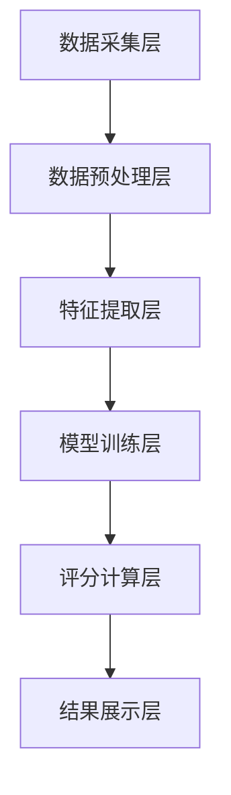

# 设计智能化的企业财务报表质量动态评分系统

> 关键词：企业财务报表、质量动态评分、智能化系统、数据分析、机器学习

> 摘要：本文旨在探讨如何设计智能化的企业财务报表质量动态评分系统。首先介绍了该系统设计的背景，包括目的、预期读者等内容。接着阐述了核心概念及相互联系，详细讲解了核心算法原理和具体操作步骤，给出了相关数学模型和公式。通过项目实战展示了系统开发环境搭建、源代码实现及解读。分析了系统的实际应用场景，推荐了相关学习资源、开发工具框架和论文著作。最后总结了未来发展趋势与挑战，并提供了常见问题解答和扩展阅读参考资料。

## 1. 背景介绍 
### 1.1 目的和范围
企业财务报表是反映企业财务状况和经营成果的重要文件，其质量的高低对于投资者、债权人、监管机构等利益相关者至关重要。然而，传统的财务报表质量评估方法往往依赖于人工分析，存在效率低、主观性强等问题。设计智能化的企业财务报表质量动态评分系统的目的在于利用先进的信息技术和数据分析方法，实现对企业财务报表质量的客观、准确、实时评估。

本系统的范围涵盖了各类企业的财务报表，包括资产负债表、利润表、现金流量表等。系统将对财务报表中的各项数据进行深入分析，从多个维度评估财务报表的质量，并给出动态评分。

### 1.2 预期读者
本系统的预期读者主要包括以下几类：
- **投资者**：帮助投资者评估企业财务报表的真实性和可靠性，从而做出更明智的投资决策。
- **债权人**：为债权人提供企业财务状况的准确信息，评估企业的偿债能力和信用风险。
- **监管机构**：协助监管机构对企业的财务报表进行监管，提高监管效率和准确性。
- **企业内部管理人员**：帮助企业内部管理人员了解自身财务报表的质量，发现潜在问题并及时改进。

### 1.3 文档结构概述
本文将按照以下结构进行阐述：
- 核心概念与联系：介绍与企业财务报表质量动态评分系统相关的核心概念及其相互关系。
- 核心算法原理 & 具体操作步骤：详细讲解系统所采用的核心算法原理，并给出具体的操作步骤。
- 数学模型和公式 & 详细讲解 & 举例说明：介绍系统所涉及的数学模型和公式，并进行详细讲解和举例说明。
- 项目实战：通过实际案例展示系统的开发过程，包括开发环境搭建、源代码实现和代码解读。
- 实际应用场景：分析系统在不同场景下的实际应用。
- 工具和资源推荐：推荐相关的学习资源、开发工具框架和论文著作。
- 总结：未来发展趋势与挑战：总结系统的未来发展趋势和面临的挑战。
- 附录：常见问题与解答：提供常见问题的解答。
- 扩展阅读 & 参考资料：提供扩展阅读的建议和参考资料。

### 1.4 术语表
#### 1.4.1 核心术语定义
- **企业财务报表**：反映企业在一定时期内财务状况、经营成果和现金流量的书面文件，包括资产负债表、利润表、现金流量表等。
- **财务报表质量**：指财务报表所提供信息的真实性、准确性、完整性和及时性。
- **动态评分**：根据企业财务报表数据的实时变化，对财务报表质量进行实时评估并给出的评分。
- **智能化系统**：利用人工智能技术，如机器学习、深度学习等，实现自动化决策和分析的系统。

#### 1.4.2 相关概念解释
- **数据分析**：对大量数据进行收集、整理、分析和解释，以发现数据中的规律和价值。
- **机器学习**：让计算机通过数据学习模式和规律，从而实现预测和决策的技术。
- **异常检测**：识别数据中与正常模式偏离较大的异常值或异常模式。

#### 1.4.3 缩略词列表
- **AI**：Artificial Intelligence，人工智能
- **ML**：Machine Learning，机器学习
- **PCA**：Principal Component Analysis，主成分分析

## 2. 核心概念与联系 
### 核心概念原理
企业财务报表质量动态评分系统的核心概念包括财务报表数据、特征提取、模型训练和评分计算。

- **财务报表数据**：是系统的输入，包括资产负债表、利润表、现金流量表等报表中的各项数据。
- **特征提取**：从财务报表数据中提取能够反映财务报表质量的特征，如财务比率、趋势指标等。
- **模型训练**：利用历史财务报表数据和对应的质量评分，训练机器学习模型，以学习财务报表数据与质量评分之间的关系。
- **评分计算**：将新的财务报表数据输入到训练好的模型中，计算出财务报表的质量评分。

### 架构的文本示意图
该系统的架构可以描述为以下几个部分：
1. **数据采集层**：负责收集企业的财务报表数据，可以从企业的财务系统、数据库或公开数据源中获取。
2. **数据预处理层**：对采集到的财务报表数据进行清洗、转换和归一化处理，以提高数据的质量和可用性。
3. **特征提取层**：从预处理后的数据中提取能够反映财务报表质量的特征。
4. **模型训练层**：利用历史数据和对应的质量评分，训练机器学习模型。
5. **评分计算层**：将新的财务报表数据输入到训练好的模型中，计算出财务报表的质量评分。
6. **结果展示层**：将计算得到的质量评分以直观的方式展示给用户，如报表、图表等。

### Mermaid 流程图


## 3. 核心算法原理 & 具体操作步骤 
### 核心算法原理
本系统采用机器学习中的回归算法来预测企业财务报表的质量评分。回归算法的基本思想是通过建立输入变量（财务报表特征）与输出变量（质量评分）之间的函数关系，来预测新的输入变量对应的输出值。

在本系统中，我们选择使用线性回归算法。线性回归算法的数学模型可以表示为：
$$y = \beta_0 + \beta_1x_1 + \beta_2x_2 + \cdots + \beta_nx_n + \epsilon$$
其中，$y$ 是质量评分，$x_1, x_2, \cdots, x_n$ 是财务报表特征，$\beta_0, \beta_1, \cdots, \beta_n$ 是回归系数，$\epsilon$ 是误差项。

### 具体操作步骤
以下是使用 Python 实现线性回归算法的具体操作步骤：

```python
import numpy as np
from sklearn.linear_model import LinearRegression
from sklearn.model_selection import train_test_split
from sklearn.preprocessing import StandardScaler

# 步骤 1: 准备数据
# 假设我们已经从财务报表中提取了特征 X 和对应的质量评分 y
X = np.array([[1, 2, 3], [4, 5, 6], [7, 8, 9], [10, 11, 12]])
y = np.array([10, 20, 30, 40])

# 步骤 2: 数据预处理
# 划分训练集和测试集
X_train, X_test, y_train, y_test = train_test_split(X, y, test_size=0.2, random_state=42)

# 数据标准化
scaler = StandardScaler()
X_train = scaler.fit_transform(X_train)
X_test = scaler.transform(X_test)

# 步骤 3: 模型训练
model = LinearRegression()
model.fit(X_train, y_train)

# 步骤 4: 模型评估
score = model.score(X_test, y_test)
print(f"模型得分: {score}")

# 步骤 5: 预测新的财务报表质量评分
new_X = np.array([[13, 14, 15]])
new_X = scaler.transform(new_X)
predicted_score = model.predict(new_X)
print(f"预测的财务报表质量评分: {predicted_score}")
```

## 4. 数学模型和公式 & 详细讲解 & 举例说明 
### 线性回归模型公式
线性回归模型的一般形式为：
$$y = \beta_0 + \beta_1x_1 + \beta_2x_2 + \cdots + \beta_nx_n + \epsilon$$
其中，$y$ 是因变量（质量评分），$x_1, x_2, \cdots, x_n$ 是自变量（财务报表特征），$\beta_0, \beta_1, \cdots, \beta_n$ 是回归系数，$\epsilon$ 是误差项。

### 详细讲解
线性回归的目标是找到一组最优的回归系数 $\beta_0, \beta_1, \cdots, \beta_n$，使得预测值 $\hat{y}$ 与真实值 $y$ 之间的误差最小。通常使用最小二乘法来估计回归系数，即最小化残差平方和：
$$S(\beta) = \sum_{i=1}^{m}(y_i - \hat{y}_i)^2 = \sum_{i=1}^{m}(y_i - (\beta_0 + \beta_1x_{i1} + \beta_2x_{i2} + \cdots + \beta_nx_{in}))^2$$
其中，$m$ 是样本数量，$y_i$ 是第 $i$ 个样本的真实值，$\hat{y}_i$ 是第 $i$ 个样本的预测值。

### 举例说明
假设我们有以下财务报表数据：
| 资产负债率 | 毛利率 | 净利率 | 质量评分 |
| --- | --- | --- | --- |
| 0.5 | 0.3 | 0.2 | 80 |
| 0.6 | 0.25 | 0.15 | 70 |
| 0.4 | 0.35 | 0.25 | 90 |

我们可以将资产负债率、毛利率和净利率作为自变量 $x_1, x_2, x_3$，质量评分作为因变量 $y$，建立线性回归模型：
$$y = \beta_0 + \beta_1x_1 + \beta_2x_2 + \beta_3x_3 + \epsilon$$

使用最小二乘法估计回归系数，得到模型的具体形式。然后，我们可以使用该模型预测新的财务报表的质量评分。

## 5. 项目实战：代码实际案例和详细解释说明 
### 5.1  开发环境搭建
为了实现智能化的企业财务报表质量动态评分系统，我们需要搭建以下开发环境：
- **Python**：选择 Python 作为开发语言，因为它具有丰富的数据分析和机器学习库。
- **Jupyter Notebook**：用于编写和运行代码，方便进行数据探索和模型调试。
- **相关库**：安装 numpy、pandas、scikit-learn 等库，用于数据处理、模型训练和评估。

### 5.2  源代码详细实现和代码解读
以下是一个完整的源代码示例，展示了如何实现企业财务报表质量动态评分系统：

```python
import numpy as np
import pandas as pd
from sklearn.linear_model import LinearRegression
from sklearn.model_selection import train_test_split
from sklearn.preprocessing import StandardScaler
from sklearn.metrics import mean_squared_error

# 步骤 1: 数据加载
data = pd.read_csv('financial_statements.csv')

# 步骤 2: 数据预处理
# 提取特征和目标变量
X = data.drop('quality_score', axis=1)
y = data['quality_score']

# 划分训练集和测试集
X_train, X_test, y_train, y_test = train_test_split(X, y, test_size=0.2, random_state=42)

# 数据标准化
scaler = StandardScaler()
X_train = scaler.fit_transform(X_train)
X_test = scaler.transform(X_test)

# 步骤 3: 模型训练
model = LinearRegression()
model.fit(X_train, y_train)

# 步骤 4: 模型评估
y_pred = model.predict(X_test)
mse = mean_squared_error(y_test, y_pred)
rmse = np.sqrt(mse)
print(f"均方误差 (MSE): {mse}")
print(f"均方根误差 (RMSE): {rmse}")

# 步骤 5: 预测新的财务报表质量评分
new_data = pd.read_csv('new_financial_statements.csv')
new_X = scaler.transform(new_data)
predicted_scores = model.predict(new_X)
print(f"预测的财务报表质量评分: {predicted_scores}")
```

### 5.3  代码解读与分析
- **数据加载**：使用 `pandas` 库的 `read_csv` 函数加载财务报表数据。
- **数据预处理**：
  - 提取特征和目标变量：使用 `drop` 函数删除目标变量列，得到特征矩阵 `X`；使用 `['quality_score']` 选择目标变量列，得到目标向量 `y`。
  - 划分训练集和测试集：使用 `train_test_split` 函数将数据划分为训练集和测试集，比例为 8:2。
  - 数据标准化：使用 `StandardScaler` 类对特征矩阵进行标准化处理，以提高模型的性能。
- **模型训练**：使用 `LinearRegression` 类创建线性回归模型，并使用 `fit` 方法对模型进行训练。
- **模型评估**：使用 `mean_squared_error` 函数计算模型的均方误差（MSE），并使用 `np.sqrt` 函数计算均方根误差（RMSE）。
- **预测新的财务报表质量评分**：加载新的财务报表数据，使用 `transform` 方法对其进行标准化处理，然后使用训练好的模型进行预测。

## 6. 实际应用场景 
### 投资者决策
投资者可以使用该系统评估企业财务报表的质量，从而判断企业的真实财务状况和经营成果。高质量的财务报表意味着企业提供的信息更加可靠，投资者可以更有信心地进行投资决策。

### 债权人评估
债权人可以利用该系统评估企业的偿债能力和信用风险。通过对企业财务报表质量的动态评分，债权人可以及时发现企业财务状况的变化，调整信贷政策。

### 监管机构监管
监管机构可以使用该系统对企业的财务报表进行实时监管，提高监管效率和准确性。系统可以帮助监管机构发现企业财务报表中的异常情况，及时进行调查和处理。

### 企业内部管理
企业内部管理人员可以使用该系统了解自身财务报表的质量，发现潜在问题并及时改进。通过对财务报表质量的动态监测，企业可以不断提高财务管理水平。

## 7. 工具和资源推荐
### 7.1 学习资源推荐
#### 7.1.1 书籍推荐
- 《Python 数据分析实战》：介绍了使用 Python 进行数据分析的基本方法和技巧。
- 《机器学习实战》：通过实际案例介绍了机器学习的各种算法和应用。
- 《财务报表分析》：详细讲解了财务报表的分析方法和技巧。

#### 7.1.2 在线课程
- Coursera 上的“机器学习”课程：由 Andrew Ng 教授授课，是机器学习领域的经典课程。
- edX 上的“Python 数据分析”课程：介绍了使用 Python 进行数据分析的方法和工具。

#### 7.1.3 技术博客和网站
- Medium：有很多关于数据分析和机器学习的优质文章。
- Kaggle：一个数据科学竞赛平台，提供了丰富的数据集和代码示例。

### 7.2 开发工具框架推荐
#### 7.2.1 IDE和编辑器
- PyCharm：一款功能强大的 Python 集成开发环境。
- Jupyter Notebook：适合进行数据探索和模型调试的交互式开发环境。

#### 7.2.2 调试和性能分析工具
- PDB：Python 自带的调试工具。
- cProfile：用于分析 Python 代码的性能。

#### 7.2.3 相关框架和库
- numpy：用于科学计算的基础库。
- pandas：用于数据处理和分析的库。
- scikit-learn：用于机器学习的库。

### 7.3 相关论文著作推荐
#### 7.3.1 经典论文
- Fama, E. F., & French, K. R. (1993). Common risk factors in the returns on stocks and bonds. *Journal of Financial Economics*, 33(1), 3-56.
- Altman, E. I. (1968). Financial ratios, discriminant analysis and the prediction of corporate bankruptcy. *The Journal of Finance*, 23(4), 589-609.

#### 7.3.2 最新研究成果
- 关注顶级金融和数据分析期刊，如 *Journal of Financial Economics*、*Journal of Accounting Research* 等，了解最新的研究成果。

#### 7.3.3 应用案例分析
- 可以参考一些知名企业或研究机构发布的财务报表分析案例，学习如何应用数据分析和机器学习方法评估财务报表质量。

## 8. 总结：未来发展趋势与挑战
### 未来发展趋势
- **智能化程度不断提高**：随着人工智能技术的不断发展，系统将能够自动识别和处理更多复杂的财务报表数据，提高评分的准确性和可靠性。
- **多源数据融合**：除了财务报表数据，系统将融合更多的外部数据，如行业数据、市场数据等，以更全面地评估企业的财务状况。
- **实时监测和预警**：系统将实现对企业财务报表质量的实时监测和预警，及时发现潜在问题并采取措施。

### 挑战
- **数据质量问题**：财务报表数据的质量直接影响系统的评分结果，如何确保数据的真实性、准确性和完整性是一个挑战。
- **模型可解释性**：机器学习模型往往是黑盒模型，如何解释模型的决策过程和评分结果是一个需要解决的问题。
- **法规和合规性**：在使用系统进行财务报表评估时，需要遵守相关的法规和合规要求，如何确保系统的合法性和合规性是一个挑战。

## 9. 附录：常见问题与解答
### 问题 1：如何选择合适的财务报表特征？
解答：选择合适的财务报表特征需要考虑多个因素，如特征的相关性、可解释性和稳定性。可以通过相关性分析、特征选择算法等方法来选择重要的特征。

### 问题 2：系统的评分结果是否可靠？
解答：系统的评分结果的可靠性取决于多个因素，如数据质量、模型选择和训练等。为了提高评分结果的可靠性，需要确保数据的质量，选择合适的模型，并进行充分的模型训练和评估。

### 问题 3：系统能否处理不同行业的财务报表数据？
解答：可以通过对不同行业的财务报表数据进行特征工程和模型调整，使系统能够处理不同行业的财务报表数据。同时，可以使用行业特定的模型来提高评分的准确性。

## 10. 扩展阅读 & 参考资料
### 扩展阅读
- 《人工智能与金融科技》：介绍了人工智能在金融领域的应用和发展趋势。
- 《数据挖掘与知识发现》：讲解了数据挖掘的方法和技术，对于理解财务报表数据分析有帮助。

### 参考资料
- 《Python 数据分析实战》，作者：Sebastian Raschka
- 《机器学习实战》，作者：Peter Harrington
- 《财务报表分析》，作者：马丁·弗里德森

作者：AI天才研究院/AI Genius Institute & 禅与计算机程序设计艺术 /Zen And The Art of Computer Programming