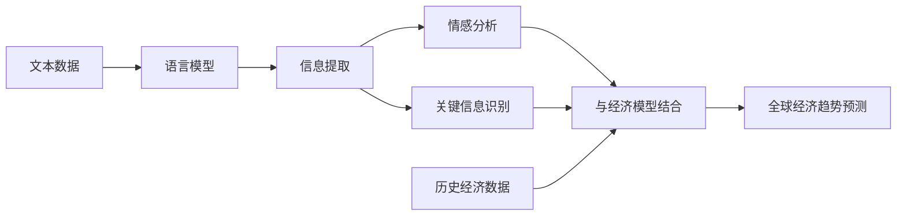

# 语言模型在全球经济趋势预测中的应用分析

> 关键词：语言模型、全球经济趋势预测、自然语言处理、数据挖掘、机器学习

> 摘要：本文聚焦于语言模型在全球经济趋势预测中的应用。首先介绍了相关背景，包括目的范围、预期读者等。接着阐述核心概念，如语言模型和经济趋势预测的原理及联系，并给出相应的文本示意图和Mermaid流程图。详细讲解了核心算法原理，结合Python源代码说明操作步骤，还介绍了相关的数学模型和公式。通过项目实战，展示了代码实际案例及详细解释。探讨了语言模型在全球经济趋势预测中的实际应用场景，推荐了学习资源、开发工具框架以及相关论文著作。最后总结未来发展趋势与挑战，提供常见问题解答和扩展阅读参考资料，旨在为利用语言模型进行全球经济趋势预测提供全面深入的分析。

## 1. 背景介绍 
### 1.1 目的和范围
随着全球经济的日益复杂和数据量的爆炸式增长，准确预测全球经济趋势变得愈发重要。传统的经济预测方法往往依赖于有限的经济指标和历史数据，难以全面捕捉经济活动中的复杂信息和潜在变化。语言模型作为自然语言处理领域的重要技术，能够处理和分析大量的文本数据，从中提取有价值的信息和模式。本研究的目的是深入探讨语言模型在全球经济趋势预测中的应用，分析其优势、局限性以及实际效果。研究范围涵盖了常见的语言模型，如GPT系列、BERT等，以及全球范围内的主要经济指标和市场动态。

### 1.2 预期读者
本文的预期读者包括经济学家、金融分析师、数据科学家、人工智能研究者以及对经济预测和语言模型应用感兴趣的专业人士。对于经济学家和金融分析师来说，了解语言模型在经济预测中的应用可以为他们提供新的分析视角和工具；数据科学家和人工智能研究者可以从技术层面深入探讨语言模型的优化和改进；而对普通读者来说，本文可以帮助他们了解语言模型在经济领域的实际应用和潜在影响。

### 1.3 文档结构概述
本文将按照以下结构进行组织：首先介绍核心概念，包括语言模型和全球经济趋势预测的基本原理以及它们之间的联系；然后详细阐述核心算法原理和具体操作步骤，通过Python代码进行说明；接着介绍相关的数学模型和公式，并举例说明其应用；通过项目实战展示语言模型在经济趋势预测中的实际应用，包括开发环境搭建、源代码实现和代码解读；探讨语言模型在不同经济场景中的实际应用；推荐相关的学习资源、开发工具框架和论文著作；最后总结未来发展趋势与挑战，提供常见问题解答和扩展阅读参考资料。

### 1.4 术语表
#### 1.4.1 核心术语定义
- **语言模型**：是一种基于概率统计的模型，用于计算一个句子或文本序列的概率。它可以预测下一个可能出现的单词或字符，从而生成自然语言文本。常见的语言模型包括基于规则的模型、统计语言模型和深度学习语言模型。
- **全球经济趋势预测**：是指对全球范围内的经济活动进行分析和预测，包括经济增长、通货膨胀、失业率、汇率等主要经济指标的变化趋势。预测方法可以基于历史数据、经济理论和统计模型等。
- **自然语言处理（NLP）**：是人工智能的一个重要领域，旨在让计算机理解、处理和生成自然语言。它涉及到文本分类、情感分析、命名实体识别、机器翻译等多个任务。
- **数据挖掘**：是从大量数据中提取有价值信息和知识的过程。它包括数据预处理、特征选择、模型训练和评估等步骤，常用于发现数据中的潜在模式和规律。
- **机器学习**：是一门多领域交叉学科，涉及概率论、统计学、逼近论、凸分析、算法复杂度理论等多门学科。它专门研究计算机怎样模拟或实现人类的学习行为，以获取新的知识或技能，重新组织已有的知识结构使之不断改善自身的性能。

#### 1.4.2 相关概念解释
- **文本嵌入**：是将文本数据转换为数值向量的过程。通过文本嵌入，可以将文本表示为计算机能够处理的数值形式，方便后续的机器学习和数据分析。常见的文本嵌入方法包括词袋模型、TF-IDF、Word2Vec、GloVe等。
- **情感分析**：是指对文本中表达的情感倾向进行分析和判断，通常分为积极、消极和中性三种情感。情感分析在经济领域中可以用于分析市场情绪、消费者信心等。
- **时间序列分析**：是一种统计方法，用于分析和预测随时间变化的数据序列。在经济趋势预测中，时间序列分析可以用于分析经济指标的历史数据，预测未来的变化趋势。

#### 1.4.3 缩略词列表
- **NLP**：Natural Language Processing（自然语言处理）
- **ML**：Machine Learning（机器学习）
- **TF-IDF**：Term Frequency-Inverse Document Frequency（词频 - 逆文档频率）
- **GPT**：Generative Pretrained Transformer（生成式预训练变换器）
- **BERT**：Bidirectional Encoder Representations from Transformers（基于变换器的双向编码器表示）

## 2. 核心概念与联系 

### 2.1 语言模型原理
语言模型的核心目标是计算一个文本序列的概率。对于一个由 $n$ 个单词组成的文本序列 $w_1, w_2, \cdots, w_n$，语言模型需要计算 $P(w_1, w_2, \cdots, w_n)$ 的值。根据链式法则，有：

$$P(w_1, w_2, \cdots, w_n) = P(w_1)P(w_2|w_1)P(w_3|w_1, w_2) \cdots P(w_n|w_1, w_2, \cdots, w_{n-1})$$

在实际应用中，由于计算复杂度的问题，通常采用简化的模型，如 $n$ - 元语法模型。$n$ - 元语法模型假设一个单词的出现只与前 $n-1$ 个单词有关，即：

$$P(w_i|w_1, w_2, \cdots, w_{i-1}) \approx P(w_i|w_{i-n+1}, w_{i-n+2}, \cdots, w_{i-1})$$

深度学习语言模型，如GPT和BERT，采用了神经网络架构，能够自动学习文本中的语义和语法信息。GPT是一种基于Transformer的生成式语言模型，通过自监督学习在大规模文本数据上进行预训练，然后可以在特定任务上进行微调。BERT则是一种双向编码器表示模型，通过掩码语言模型（Masked Language Model）和下一句预测（Next Sentence Prediction）任务进行预训练，能够捕捉文本的上下文信息。

### 2.2 全球经济趋势预测原理
全球经济趋势预测主要基于经济理论和历史数据。常见的经济指标包括国内生产总值（GDP）、通货膨胀率、失业率、利率、汇率等。预测方法可以分为定性预测和定量预测。定性预测主要基于专家意见和市场调研，如德尔菲法、市场调查法等；定量预测则基于数学模型和统计方法，如时间序列分析、回归分析、机器学习模型等。

时间序列分析是一种常用的定量预测方法，它通过分析经济指标的历史数据，找出数据中的趋势、季节性和周期性变化，然后建立预测模型。常见的时间序列模型包括自回归积分滑动平均模型（ARIMA）、季节性自回归积分滑动平均模型（SARIMA）等。机器学习模型，如神经网络、支持向量机等，也可以用于经济趋势预测，它们能够处理复杂的非线性关系，提高预测的准确性。

### 2.3 语言模型与全球经济趋势预测的联系
语言模型可以为全球经济趋势预测提供丰富的信息。大量的经济信息以文本形式存在，如新闻报道、企业财报、政府公告等。语言模型可以对这些文本数据进行处理和分析，提取其中的关键信息和情感倾向，从而为经济趋势预测提供新的视角和依据。

例如，通过对新闻报道的情感分析，可以了解市场参与者的情绪和信心，这对预测股票市场的走势和消费者行为有重要意义。语言模型还可以用于识别经济事件和政策变化，分析它们对经济的影响。此外，语言模型可以与传统的经济预测模型相结合，提高预测的准确性和可靠性。

### 2.4 文本示意图
```plaintext
语言模型
|
|-- 处理文本数据
|   |-- 新闻报道
|   |-- 企业财报
|   |-- 政府公告
|
|-- 提取信息和情感
|   |-- 关键信息
|   |-- 情感倾向
|
|-- 与经济预测模型结合
|   |-- 时间序列模型
|   |-- 机器学习模型
|
|-- 全球经济趋势预测
```

### 2.5 Mermaid流程图


## 3. 核心算法原理 & 具体操作步骤 

### 3.1 文本预处理算法
在使用语言模型进行经济趋势预测之前，需要对文本数据进行预处理。文本预处理的主要步骤包括分词、去除停用词、词干提取等。以下是一个使用Python的`nltk`库进行文本预处理的示例代码：

```python
import nltk
from nltk.corpus import stopwords
from nltk.stem import PorterStemmer
from nltk.tokenize import word_tokenize
import string

# 下载必要的nltk数据
nltk.download('punkt')
nltk.download('stopwords')

def preprocess_text(text):
    # 转换为小写
    text = text.lower()
    # 去除标点符号
    text = text.translate(str.maketrans('', '', string.punctuation))
    # 分词
    tokens = word_tokenize(text)
    # 去除停用词
    stop_words = set(stopwords.words('english'))
    tokens = [token for token in tokens if token not in stop_words]
    # 词干提取
    stemmer = PorterStemmer()
    tokens = [stemmer.stem(token) for token in tokens]
    return tokens

# 示例文本
text = "The global economy is facing some challenges due to the pandemic."
preprocessed_text = preprocess_text(text)
print(preprocessed_text)
```

### 3.2 文本嵌入算法
文本嵌入是将文本转换为数值向量的过程。常用的文本嵌入方法包括Word2Vec和BERT嵌入。以下是一个使用`gensim`库进行Word2Vec嵌入的示例代码：

```python
from gensim.models import Word2Vec

# 示例文本数据
sentences = [['global', 'economy', 'challenge', 'pandemic'],
             ['stock', 'market', 'fluctuate', 'uncertainty']]

# 训练Word2Vec模型
model = Word2Vec(sentences, min_count=1)

# 获取单词的向量表示
vector = model.wv['economy']
print(vector)
```

### 3.3 情感分析算法
情感分析可以使用预训练的语言模型，如`transformers`库中的BERT模型。以下是一个使用`transformers`库进行情感分析的示例代码：

```python
from transformers import AutoTokenizer, AutoModelForSequenceClassification
import torch

# 加载预训练模型和分词器
tokenizer = AutoTokenizer.from_pretrained('distilbert-base-uncased-finetuned-sst-2-english')
model = AutoModelForSequenceClassification.from_pretrained('distilbert-base-uncased-finetuned-sst-2-english')

# 示例文本
text = "The economy is booming."

# 对文本进行分词
inputs = tokenizer(text, return_tensors='pt')

# 进行情感分析
outputs = model(**inputs)
logits = outputs.logits
predicted_class_id = logits.argmax().item()
label = model.config.id2label[predicted_class_id]
print(f"Sentiment: {label}")
```

### 3.4 具体操作步骤
1. **数据收集**：收集与全球经济相关的文本数据，如新闻报道、企业财报、政府公告等。
2. **文本预处理**：对收集到的文本数据进行预处理，包括分词、去除停用词、词干提取等。
3. **文本嵌入**：将预处理后的文本转换为数值向量，以便后续的机器学习模型处理。
4. **特征提取**：从文本向量中提取有用的特征，如情感倾向、关键信息等。
5. **模型训练**：使用提取的特征和历史经济数据训练经济预测模型，如时间序列模型、机器学习模型等。
6. **模型评估**：使用测试数据对训练好的模型进行评估，评估指标包括均方误差（MSE）、平均绝对误差（MAE）等。
7. **预测和分析**：使用训练好的模型对未来的经济趋势进行预测，并进行分析和解释。

## 4. 数学模型和公式 & 详细讲解 & 举例说明 

### 4.1 语言模型概率公式
如前所述，语言模型的核心是计算文本序列的概率。对于一个由 $n$ 个单词组成的文本序列 $w_1, w_2, \cdots, w_n$，其概率可以表示为：

$$P(w_1, w_2, \cdots, w_n) = \prod_{i=1}^{n} P(w_i|w_1, w_2, \cdots, w_{i-1})$$

在 $n$ - 元语法模型中，假设一个单词的出现只与前 $n-1$ 个单词有关，则有：

$$P(w_i|w_1, w_2, \cdots, w_{i-1}) \approx P(w_i|w_{i-n+1}, w_{i-n+2}, \cdots, w_{i-1})$$

例如，对于一个二元语法模型（$n=2$），计算句子 "The dog runs" 的概率：

$$P(\text{The dog runs}) = P(\text{The})P(\text{dog}|\text{The})P(\text{runs}|\text{dog})$$

### 4.2 时间序列模型公式
自回归积分滑动平均模型（ARIMA）是一种常用的时间序列模型，其一般形式为 $ARIMA(p, d, q)$，其中 $p$ 是自回归项的阶数，$d$ 是差分的阶数，$q$ 是滑动平均项的阶数。

ARIMA模型的数学公式可以表示为：

$$\phi(B)(1 - B)^d y_t = \theta(B) \epsilon_t$$

其中，$\phi(B) = 1 - \phi_1 B - \phi_2 B^2 - \cdots - \phi_p B^p$ 是自回归多项式，$\theta(B) = 1 + \theta_1 B + \theta_2 B^2 + \cdots + \theta_q B^q$ 是滑动平均多项式，$B$ 是滞后算子，$y_t$ 是时间序列数据，$\epsilon_t$ 是白噪声序列。

例如，对于一个 $ARIMA(1, 1, 1)$ 模型，其公式为：

$$(1 - \phi_1 B)(1 - B) y_t = (1 + \theta_1 B) \epsilon_t$$

### 4.3 机器学习模型损失函数
在使用机器学习模型进行经济趋势预测时，通常需要定义一个损失函数来衡量模型的预测误差。常见的损失函数包括均方误差（MSE）和平均绝对误差（MAE）。

均方误差的公式为：

$$MSE = \frac{1}{n} \sum_{i=1}^{n} (y_i - \hat{y}_i)^2$$

其中，$y_i$ 是真实值，$\hat{y}_i$ 是预测值，$n$ 是样本数量。

平均绝对误差的公式为：

$$MAE = \frac{1}{n} \sum_{i=1}^{n} |y_i - \hat{y}_i|$$

例如，假设有一组真实值 $y = [1, 2, 3]$ 和预测值 $\hat{y} = [1.2, 1.8, 3.1]$，则均方误差为：

$$MSE = \frac{(1 - 1.2)^2 + (2 - 1.8)^2 + (3 - 3.1)^2}{3} = \frac{0.04 + 0.04 + 0.01}{3} = 0.03$$

平均绝对误差为：

$$MAE = \frac{|1 - 1.2| + |2 - 1.8| + |3 - 3.1|}{3} = \frac{0.2 + 0.2 + 0.1}{3} = 0.17$$

## 5. 项目实战：代码实际案例和详细解释说明 

### 5.1  开发环境搭建
在进行项目实战之前，需要搭建相应的开发环境。以下是具体的搭建步骤：

1. **安装Python**：建议使用Python 3.7及以上版本。可以从Python官方网站（https://www.python.org/downloads/）下载并安装。
2. **创建虚拟环境**：使用`virtualenv`或`conda`创建一个虚拟环境，以隔离项目的依赖。例如，使用`virtualenv`创建虚拟环境的命令如下：

```bash
pip install virtualenv
virtualenv myenv
source myenv/bin/activate  # 在Windows上使用 myenv\Scripts\activate
```

3. **安装必要的库**：安装项目所需的库，如`nltk`、`gensim`、`transformers`、`pandas`、`numpy`、`scikit-learn`等。可以使用`pip`进行安装：

```bash
pip install nltk gensim transformers pandas numpy scikit-learn
```

### 5.2  源代码详细实现和代码解读
以下是一个完整的项目实战代码示例，用于使用语言模型进行全球经济趋势预测：

```python
import nltk
from nltk.corpus import stopwords
from nltk.stem import PorterStemmer
from nltk.tokenize import word_tokenize
import string
from gensim.models import Word2Vec
from transformers import AutoTokenizer, AutoModelForSequenceClassification
import torch
import pandas as pd
import numpy as np
from sklearn.model_selection import train_test_split
from sklearn.linear_model import LinearRegression
from sklearn.metrics import mean_squared_error

# 下载必要的nltk数据
nltk.download('punkt')
nltk.download('stopwords')

# 文本预处理函数
def preprocess_text(text):
    text = text.lower()
    text = text.translate(str.maketrans('', '', string.punctuation))
    tokens = word_tokenize(text)
    stop_words = set(stopwords.words('english'))
    tokens = [token for token in tokens if token not in stop_words]
    stemmer = PorterStemmer()
    tokens = [stemmer.stem(token) for token in tokens]
    return tokens

# 情感分析函数
def sentiment_analysis(text):
    tokenizer = AutoTokenizer.from_pretrained('distilbert-base-uncased-finetuned-sst-2-english')
    model = AutoModelForSequenceClassification.from_pretrained('distilbert-base-uncased-finetuned-sst-2-english')
    inputs = tokenizer(text, return_tensors='pt')
    outputs = model(**inputs)
    logits = outputs.logits
    predicted_class_id = logits.argmax().item()
    label = model.config.id2label[predicted_class_id]
    if label == 'POSITIVE':
        return 1
    else:
        return 0

# 读取数据
data = pd.read_csv('economic_news.csv')

# 文本预处理
data['preprocessed_text'] = data['news_text'].apply(preprocess_text)

# 计算情感得分
data['sentiment_score'] = data['news_text'].apply(sentiment_analysis)

# 训练Word2Vec模型
sentences = data['preprocessed_text'].tolist()
model = Word2Vec(sentences, min_count=1)

# 提取文本特征
def get_text_features(tokens):
    vectors = [model.wv[token] for token in tokens if token in model.wv]
    if len(vectors) == 0:
        return np.zeros(model.vector_size)
    return np.mean(vectors, axis=0)

data['text_features'] = data['preprocessed_text'].apply(get_text_features)

# 准备训练数据
X = np.vstack(data['text_features'])
y = data['sentiment_score'].values

# 划分训练集和测试集
X_train, X_test, y_train, y_test = train_test_split(X, y, test_size=0.2, random_state=42)

# 训练线性回归模型
model = LinearRegression()
model.fit(X_train, y_train)

# 预测
y_pred = model.predict(X_test)

# 评估模型
mse = mean_squared_error(y_test, y_pred)
print(f"Mean Squared Error: {mse}")
```

### 5.3  代码解读与分析
1. **文本预处理**：定义了`preprocess_text`函数，用于对文本进行分词、去除停用词和词干提取等操作。
2. **情感分析**：定义了`sentiment_analysis`函数，使用预训练的BERT模型对文本进行情感分析，返回情感得分（1表示积极，0表示消极）。
3. **数据读取和预处理**：使用`pandas`库读取经济新闻数据，并对文本进行预处理和情感分析。
4. **Word2Vec模型训练**：使用`gensim`库训练Word2Vec模型，将文本转换为数值向量。
5. **特征提取**：定义了`get_text_features`函数，将文本向量转换为特征向量。
6. **模型训练和评估**：使用`scikit-learn`库的线性回归模型进行训练和预测，并使用均方误差评估模型的性能。

## 6. 实际应用场景 
### 6.1 股票市场预测
语言模型可以分析新闻报道、企业财报等文本数据，提取其中的关键信息和情感倾向，从而预测股票市场的走势。例如，当新闻报道中出现积极的经济数据和企业业绩时，股票市场可能会上涨；反之，当出现负面消息时，股票市场可能会下跌。通过对大量文本数据的实时分析，投资者可以及时调整投资策略，降低风险。

### 6.2 宏观经济指标预测
语言模型可以用于预测宏观经济指标，如GDP增长率、通货膨胀率、失业率等。通过分析政府公告、经济研究报告等文本数据，提取其中与宏观经济相关的信息，结合历史数据和统计模型，可以对宏观经济指标进行预测。这对于政府制定经济政策、企业进行战略规划具有重要意义。

### 6.3 消费者行为预测
语言模型可以分析社交媒体、在线评论等文本数据，了解消费者的需求、偏好和情感倾向，从而预测消费者的购买行为。例如，通过分析消费者对某产品的评价和反馈，可以预测该产品的市场需求和销售趋势。企业可以根据这些预测结果调整产品策略和营销策略，提高市场竞争力。

### 6.4 金融风险评估
语言模型可以用于评估金融风险，如信用风险、市场风险等。通过分析企业财报、新闻报道等文本数据，提取其中与金融风险相关的信息，如企业的财务状况、市场环境等，结合风险评估模型，可以对金融风险进行评估。金融机构可以根据评估结果采取相应的风险控制措施，保障金融安全。

## 7. 工具和资源推荐
### 7.1 学习资源推荐
#### 7.1.1 书籍推荐
- 《自然语言处理入门》：作者何晗，本书系统地介绍了自然语言处理的基本概念、算法和技术，适合初学者入门。
- 《深度学习》：作者Ian Goodfellow、Yoshua Bengio和Aaron Courville，本书是深度学习领域的经典著作，全面介绍了深度学习的理论和实践。
- 《Python自然语言处理》：作者Steven Bird、Ewan Klein和Edward Loper，本书通过Python代码示例详细介绍了自然语言处理的各个方面，是学习自然语言处理的实用指南。

#### 7.1.2 在线课程
- Coursera上的“Natural Language Processing Specialization”：由DeepLearning.AI提供，全面介绍了自然语言处理的基础知识和前沿技术。
- edX上的“Introduction to Artificial Intelligence”：由麻省理工学院提供，涵盖了人工智能的各个领域，包括自然语言处理。
- 哔哩哔哩上的相关教程：有许多关于自然语言处理和机器学习的免费教程，适合初学者学习。

#### 7.1.3 技术博客和网站
- Medium：有许多技术博主分享自然语言处理和经济预测的最新研究成果和实践经验。
- arXiv：是一个预印本平台，提供了大量的学术论文，包括自然语言处理和经济领域的研究。
- Towards Data Science：专注于数据科学和机器学习领域，有许多高质量的文章和教程。

### 7.2 开发工具框架推荐
#### 7.2.1 IDE和编辑器
- PyCharm：是一款专业的Python集成开发环境，提供了丰富的代码编辑、调试和项目管理功能。
- Jupyter Notebook：是一个交互式的开发环境，适合进行数据探索和模型实验。
- Visual Studio Code：是一款轻量级的代码编辑器，支持多种编程语言和插件扩展。

#### 7.2.2 调试和性能分析工具
- Py-Spy：是一个Python性能分析工具，可以实时监测Python程序的CPU使用情况和函数调用时间。
- TensorBoard：是TensorFlow的可视化工具，可以用于可视化模型的训练过程和性能指标。
- PDB：是Python的内置调试器，可以用于调试Python代码。

#### 7.2.3 相关框架和库
- NLTK：是Python中最常用的自然语言处理库，提供了丰富的文本处理工具和语料库。
- Gensim：是一个用于主题建模、文档索引和相似性检索的Python库，支持Word2Vec等文本嵌入方法。
- Transformers：是Hugging Face开发的一个自然语言处理库，提供了大量的预训练模型，如GPT、BERT等。
- Scikit-learn：是Python中常用的机器学习库，提供了各种机器学习算法和工具，如线性回归、决策树等。

### 7.3 相关论文著作推荐
#### 7.3.1 经典论文
- “Attention Is All You Need”：介绍了Transformer架构，是深度学习语言模型的重要基础。
- “BERT: Pre-training of Deep Bidirectional Transformers for Language Understanding”：提出了BERT模型，开创了双向编码器表示的先河。
- “Generative Pretraining from Pixels”：介绍了基于像素的生成式预训练模型，拓展了语言模型的应用范围。

#### 7.3.2 最新研究成果
- 在arXiv和顶级学术会议（如ACL、EMNLP等）上可以找到关于语言模型在经济领域应用的最新研究成果。
- 一些知名的学术期刊，如《Journal of Economic Perspectives》、《Review of Financial Studies》等，也会发表相关的研究论文。

#### 7.3.3 应用案例分析
- 一些金融机构和科技公司会发布关于语言模型在经济预测中的应用案例，如摩根大通、谷歌等。可以通过它们的官方网站或相关报告了解具体的应用情况和效果。

## 8. 总结：未来发展趋势与挑战
### 8.1 未来发展趋势
- **多模态融合**：未来的语言模型将与图像、音频等多模态数据进行融合，更全面地捕捉经济信息。例如，结合卫星图像和新闻报道分析农业、能源等行业的发展趋势。
- **个性化预测**：根据不同用户的需求和偏好，提供个性化的经济趋势预测服务。例如，为投资者提供符合其投资风格的股票市场预测。
- **实时预测**：随着数据处理技术的不断发展，语言模型将能够实现实时的经济趋势预测，及时反映市场变化。
- **跨领域应用**：语言模型在经济领域的应用将拓展到更多的跨领域场景，如经济与环境、经济与社会等。

### 8.2 挑战
- **数据质量和可靠性**：文本数据的质量和可靠性对经济趋势预测的准确性有重要影响。如何处理噪声数据、虚假信息和不一致的数据是一个挑战。
- **模型解释性**：深度学习语言模型通常是黑盒模型，难以解释其预测结果。在经济领域，模型的解释性对于决策者来说至关重要。
- **隐私和安全**：处理大量的文本数据涉及到用户隐私和数据安全问题。如何保护用户的隐私和数据安全是一个需要解决的问题。
- **经济复杂性**：全球经济是一个复杂的系统，受到多种因素的影响。语言模型如何准确捕捉这些复杂因素之间的关系是一个挑战。

## 9. 附录：常见问题与解答
### 9.1 语言模型在经济趋势预测中的准确性如何？
语言模型在经济趋势预测中的准确性受到多种因素的影响，如数据质量、模型选择、特征提取等。一般来说，结合多种数据源和模型可以提高预测的准确性。同时，需要对模型进行不断的评估和优化，以适应经济环境的变化。

### 9.2 如何选择适合的语言模型进行经济趋势预测？
选择适合的语言模型需要考虑多个因素，如数据规模、任务复杂度、计算资源等。对于大规模数据和复杂任务，可以选择预训练的深度学习语言模型，如GPT、BERT等；对于小规模数据和简单任务，可以选择传统的统计语言模型。

### 9.3 语言模型在经济趋势预测中需要注意哪些问题？
需要注意数据的质量和可靠性，避免使用虚假信息和噪声数据；同时，要关注模型的解释性，确保预测结果能够被决策者理解和接受；此外，还需要注意隐私和安全问题，保护用户的个人信息和数据安全。

### 9.4 如何将语言模型与传统经济预测模型相结合？
可以将语言模型提取的特征作为传统经济预测模型的输入，如将文本的情感得分、关键信息等作为时间序列模型或机器学习模型的特征。也可以将语言模型的预测结果与传统经济预测模型的结果进行融合，提高预测的准确性和可靠性。

## 10. 扩展阅读 & 参考资料
- 《人工智能时代的经济预测》
- 《自然语言处理与经济分析》
- 相关的学术论文和研究报告，可以在IEEE Xplore、ACM Digital Library等学术数据库中查找。
- 金融机构和科技公司的官方网站，如摩根大通、谷歌、百度等，会发布一些关于语言模型在经济领域应用的研究成果和实践经验。

作者：AI天才研究院/AI Genius Institute & 禅与计算机程序设计艺术 /Zen And The Art of Computer Programming