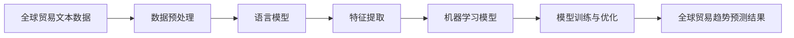

# 语言模型在全球贸易趋势预测中的应用

> 关键词：语言模型、全球贸易趋势预测、文本数据挖掘、机器学习、经济分析

> 摘要：本文聚焦于语言模型在全球贸易趋势预测中的应用。首先介绍了相关背景，包括目的、预期读者等内容。接着阐述了核心概念，如语言模型和全球贸易趋势预测的原理及联系，并给出相应的文本示意图和Mermaid流程图。详细讲解了核心算法原理及操作步骤，使用Python代码进行说明。深入探讨了数学模型和公式，并举例分析。通过项目实战，从开发环境搭建到源代码实现与解读进行了详细介绍。列举了实际应用场景，推荐了相关的工具和资源。最后总结了未来发展趋势与挑战，提供了常见问题解答和扩展阅读参考资料，旨在为利用语言模型进行全球贸易趋势预测提供全面且深入的技术指导。

## 1. 背景介绍 
### 1.1 目的和范围
随着全球经济一体化的加速，准确预测全球贸易趋势对于企业制定战略、政府制定政策都具有至关重要的意义。传统的贸易趋势预测方法主要依赖于经济数据和统计模型，但这些方法往往忽略了大量非结构化文本数据中蕴含的信息。语言模型作为一种强大的自然语言处理工具，能够对文本数据进行有效挖掘和分析，为全球贸易趋势预测提供新的视角和方法。本文的目的在于探讨语言模型在全球贸易趋势预测中的具体应用，涵盖从核心概念的理解到实际项目的实施，以及未来发展的展望等多个方面。

### 1.2 预期读者
本文预期读者包括从事国际贸易研究的学者、企业的市场分析师、政府经济部门的政策制定者、对自然语言处理和经济预测交叉领域感兴趣的技术人员以及相关专业的学生。这些读者可以从本文中获取关于语言模型在全球贸易趋势预测方面的理论知识和实践经验。

### 1.3 文档结构概述
本文首先介绍语言模型和全球贸易趋势预测的背景知识，包括目的、读者群体和文档结构等。然后详细阐述核心概念及其联系，给出原理和架构的示意图及流程图。接着讲解核心算法原理和具体操作步骤，并用Python代码进行说明。之后介绍数学模型和公式，并举例说明。通过项目实战部分，从开发环境搭建到代码实现和解读进行详细描述。列举语言模型在全球贸易趋势预测中的实际应用场景，推荐相关的学习资源、开发工具和论文著作。最后总结未来发展趋势与挑战，提供常见问题解答和扩展阅读参考资料。

### 1.4 术语表
#### 1.4.1 核心术语定义
- **语言模型**：是一种基于概率统计的模型，用于计算一个句子或一段文本出现的概率，能够对自然语言进行建模和处理。
- **全球贸易趋势预测**：通过对各种经济数据和信息的分析，预测全球贸易在未来一段时间内的发展方向和变化趋势。
- **文本数据挖掘**：从大量非结构化文本数据中提取有价值信息和知识的过程。

#### 1.4.2 相关概念解释
- **自然语言处理（NLP）**：是计算机科学与语言学的交叉领域，旨在让计算机理解、处理和生成人类语言。语言模型是自然语言处理中的重要工具。
- **机器学习**：是一门多领域交叉学科，涉及概率论、统计学、逼近论、凸分析、算法复杂度理论等多门学科。它专门研究计算机怎样模拟或实现人类的学习行为，以获取新的知识或技能，重新组织已有的知识结构使之不断改善自身的性能。在全球贸易趋势预测中，机器学习算法可用于对语言模型处理后的数据进行分析和预测。

#### 1.4.3 缩略词列表
- **NLP**：Natural Language Processing（自然语言处理）
- **LSTM**：Long Short - Term Memory（长短期记忆网络）
- **GRU**：Gated Recurrent Unit（门控循环单元）

## 2. 核心概念与联系 

### 核心概念原理
#### 语言模型原理
语言模型的核心目标是计算一个词序列 $w_1, w_2, \cdots, w_n$ 出现的概率 $P(w_1, w_2, \cdots, w_n)$。根据链式法则，这个概率可以分解为：
$$P(w_1, w_2, \cdots, w_n) = P(w_1)P(w_2|w_1)P(w_3|w_1, w_2)\cdots P(w_n|w_1, w_2, \cdots, w_{n - 1})$$
在实际应用中，为了简化计算，常常采用 $n$ - 元语法模型（$n$ - gram model）。例如，二元语法模型（bigram model）假设一个词的出现只依赖于它前面的一个词，即：
$$P(w_i|w_1, w_2, \cdots, w_{i - 1}) \approx P(w_i|w_{i - 1})$$
这样，$P(w_1, w_2, \cdots, w_n)$ 就可以近似表示为：
$$P(w_1, w_2, \cdots, w_n) \approx \prod_{i = 1}^{n}P(w_i|w_{i - 1})$$
其中，$P(w_i|w_{i - 1})$ 可以通过统计语料库中 $w_{i - 1}w_i$ 出现的频率与 $w_{i - 1}$ 出现的频率的比值来估计。

随着深度学习的发展，基于神经网络的语言模型逐渐成为主流，如循环神经网络（RNN）及其变体长短期记忆网络（LSTM）和门控循环单元（GRU）。这些模型能够更好地捕捉文本中的长距离依赖关系，从而提高语言模型的性能。

#### 全球贸易趋势预测原理
全球贸易趋势预测主要基于对各种经济数据和信息的分析。传统方法主要考虑宏观经济指标，如国内生产总值（GDP）、通货膨胀率、汇率等。而语言模型的引入，使得我们可以从大量的非结构化文本数据中挖掘有价值的信息，如新闻报道、社交媒体评论、企业财报等。这些文本数据中可能包含关于贸易政策变化、市场需求波动、企业战略调整等方面的信息，通过语言模型对这些文本进行处理和分析，可以提取出与全球贸易趋势相关的特征，进而用于预测。

### 架构的文本示意图
```plaintext
全球贸易文本数据（新闻、社交媒体、财报等）
    |
    |  数据预处理（清洗、分词、标注等）
    v
语言模型（n - gram、LSTM、GRU等）
    |
    |  特征提取（文本向量表示）
    v
机器学习模型（线性回归、决策树、神经网络等）
    |
    |  模型训练与优化
    v
全球贸易趋势预测结果
```

### Mermaid流程图


## 3. 核心算法原理 & 具体操作步骤 

### 核心算法原理
在使用语言模型进行全球贸易趋势预测时，主要涉及到两个核心算法：语言模型的训练和机器学习模型的训练。

#### 语言模型训练
以LSTM语言模型为例，LSTM是一种特殊的RNN，能够有效解决传统RNN中的梯度消失问题。LSTM的核心结构包括输入门、遗忘门和输出门。

输入门 $i_t$ 决定了当前输入 $x_t$ 有多少信息要加入到细胞状态 $C_t$ 中：
$$i_t=\sigma(W_{ii}x_t + W_{hi}h_{t - 1}+b_i)$$
遗忘门 $f_t$ 决定了上一时刻的细胞状态 $C_{t - 1}$ 有多少信息要被遗忘：
$$f_t=\sigma(W_{if}x_t + W_{hf}h_{t - 1}+b_f)$$
输出门 $o_t$ 决定了当前细胞状态 $C_t$ 有多少信息要输出到隐藏状态 $h_t$ 中：
$$o_t=\sigma(W_{io}x_t + W_{ho}h_{t - 1}+b_o)$$
候选细胞状态 $\tilde{C}_t$ 由当前输入 $x_t$ 和上一时刻隐藏状态 $h_{t - 1}$ 计算得到：
$$\tilde{C}_t=\tanh(W_{ic}x_t + W_{hc}h_{t - 1}+b_c)$$
细胞状态 $C_t$ 的更新公式为：
$$C_t = f_t\odot C_{t - 1}+i_t\odot\tilde{C}_t$$
隐藏状态 $h_t$ 的更新公式为：
$$h_t = o_t\odot\tanh(C_t)$$
其中，$\sigma$ 是 sigmoid 函数，$\tanh$ 是双曲正切函数，$W$ 是权重矩阵，$b$ 是偏置向量，$\odot$ 表示逐元素相乘。

#### 机器学习模型训练
在提取了文本特征后，需要使用机器学习模型进行全球贸易趋势预测。以线性回归模型为例，线性回归模型的目标是找到一组权重 $w$ 和偏置 $b$，使得预测值 $\hat{y}$ 与真实值 $y$ 之间的误差最小。线性回归模型的预测公式为：
$$\hat{y}=w^Tx + b$$
其中，$x$ 是输入特征向量。通常使用均方误差（MSE）作为损失函数：
$$L(w,b)=\frac{1}{n}\sum_{i = 1}^{n}(y_i-(w^Tx_i + b))^2$$
通过最小化损失函数 $L(w,b)$，可以得到最优的权重 $w$ 和偏置 $b$。

### 具体操作步骤
#### 数据收集
收集与全球贸易相关的文本数据，包括新闻报道、社交媒体评论、企业财报等。可以使用网络爬虫工具，如Scrapy，从互联网上抓取相关数据。

#### 数据预处理
- 清洗数据：去除文本中的噪声，如HTML标签、特殊字符等。
- 分词：将文本分割成单个的词语或符号。可以使用NLTK、jieba等分词工具。
- 标注：对分词后的文本进行词性标注、命名实体识别等操作，以便更好地理解文本的语义。

#### 语言模型训练
使用收集和预处理后的数据训练语言模型。可以使用Python中的深度学习框架，如TensorFlow、PyTorch来实现。以下是一个使用PyTorch实现LSTM语言模型的示例代码：

```python
import torch
import torch.nn as nn
import torch.optim as optim

# 定义LSTM语言模型
class LSTMLanguageModel(nn.Module):
    def __init__(self, vocab_size, embedding_dim, hidden_dim):
        super(LSTMLanguageModel, self).__init__()
        self.embedding = nn.Embedding(vocab_size, embedding_dim)
        self.lstm = nn.LSTM(embedding_dim, hidden_dim, batch_first=True)
        self.fc = nn.Linear(hidden_dim, vocab_size)

    def forward(self, x):
        embedded = self.embedding(x)
        output, _ = self.lstm(embedded)
        logits = self.fc(output)
        return logits

# 训练参数设置
vocab_size = 10000
embedding_dim = 128
hidden_dim = 256
learning_rate = 0.001
num_epochs = 10

# 初始化模型、损失函数和优化器
model = LSTMLanguageModel(vocab_size, embedding_dim, hidden_dim)
criterion = nn.CrossEntropyLoss()
optimizer = optim.Adam(model.parameters(), lr=learning_rate)

# 模拟训练数据
train_data = torch.randint(0, vocab_size, (100, 20))

# 训练模型
for epoch in range(num_epochs):
    optimizer.zero_grad()
    outputs = model(train_data)
    loss = criterion(outputs.view(-1, vocab_size), train_data.view(-1))
    loss.backward()
    optimizer.step()
    print(f'Epoch {epoch + 1}/{num_epochs}, Loss: {loss.item()}')
```

#### 特征提取
使用训练好的语言模型将文本数据转换为向量表示。可以使用模型的隐藏状态作为文本的特征。

#### 机器学习模型训练
使用提取的特征和对应的全球贸易趋势标签（如贸易增长率、贸易顺差等）训练机器学习模型。以下是一个使用Scikit - learn实现线性回归模型的示例代码：

```python
from sklearn.linear_model import LinearRegression
import numpy as np

# 模拟特征数据和标签数据
X = np.random.rand(100, 10)
y = np.random.rand(100)

# 初始化线性回归模型
model = LinearRegression()

# 训练模型
model.fit(X, y)

# 预测
new_X = np.random.rand(10, 10)
predictions = model.predict(new_X)
print(predictions)
```

#### 模型评估
使用测试数据对训练好的模型进行评估，常用的评估指标包括均方误差（MSE）、平均绝对误差（MAE）等。

## 4. 数学模型和公式 & 详细讲解 & 举例说明 

### 语言模型的数学模型和公式
#### n - 元语法模型
如前所述，$n$ - 元语法模型通过计算 $n$ 个连续词出现的概率来对文本进行建模。以二元语法模型为例，$P(w_i|w_{i - 1})$ 的计算公式为：
$$P(w_i|w_{i - 1})=\frac{count(w_{i - 1}, w_i)}{count(w_{i - 1})}$$
其中，$count(w_{i - 1}, w_i)$ 表示词对 $(w_{i - 1}, w_i)$ 在语料库中出现的次数，$count(w_{i - 1})$ 表示词 $w_{i - 1}$ 在语料库中出现的次数。

**举例说明**：假设语料库为 "I love natural language processing. I love machine learning."，计算 $P(language|natural)$。在语料库中，$count(natural, language)=1$，$count(natural)=1$，所以 $P(language|natural)=\frac{1}{1}=1$。

#### 神经网络语言模型
以LSTM语言模型为例，其数学模型和公式在前面已经详细介绍。这里通过一个简单的例子说明其计算过程。假设输入 $x_t$ 是一个长度为 $d$ 的向量，隐藏状态 $h_{t - 1}$ 是一个长度为 $h$ 的向量，输入门的权重矩阵 $W_{ii}$ 是一个 $h\times d$ 的矩阵，$W_{hi}$ 是一个 $h\times h$ 的矩阵，偏置向量 $b_i$ 是一个长度为 $h$ 的向量。

假设 $d = 3$，$h = 2$，$x_t=[1, 2, 3]^T$，$h_{t - 1}=[0.1, 0.2]^T$，$W_{ii}=\begin{bmatrix}0.1 & 0.2 & 0.3\\0.4 & 0.5 & 0.6\end{bmatrix}$，$W_{hi}=\begin{bmatrix}0.7 & 0.8\\0.9 & 1.0\end{bmatrix}$，$b_i=[0.01, 0.02]^T$。

首先计算 $W_{ii}x_t$：
$$W_{ii}x_t=\begin{bmatrix}0.1 & 0.2 & 0.3\\0.4 & 0.5 & 0.6\end{bmatrix}\begin{bmatrix}1\\2\\3\end{bmatrix}=\begin{bmatrix}0.1\times1 + 0.2\times2+0.3\times3\\0.4\times1 + 0.5\times2+0.6\times3\end{bmatrix}=\begin{bmatrix}1.4\\3.2\end{bmatrix}$$
然后计算 $W_{hi}h_{t - 1}$：
$$W_{hi}h_{t - 1}=\begin{bmatrix}0.7 & 0.8\\0.9 & 1.0\end{bmatrix}\begin{bmatrix}0.1\\0.2\end{bmatrix}=\begin{bmatrix}0.7\times0.1 + 0.8\times0.2\\0.9\times0.1 + 1.0\times0.2\end{bmatrix}=\begin{bmatrix}0.23\\0.29\end{bmatrix}$$
接着计算 $W_{ii}x_t + W_{hi}h_{t - 1}+b_i$：
$$\begin{bmatrix}1.4\\3.2\end{bmatrix}+\begin{bmatrix}0.23\\0.29\end{bmatrix}+\begin{bmatrix}0.01\\0.02\end{bmatrix}=\begin{bmatrix}1.64\\3.51\end{bmatrix}$$
最后通过sigmoid函数计算输入门 $i_t$：
$$i_t=\sigma\begin{bmatrix}1.64\\3.51\end{bmatrix}=\begin{bmatrix}\frac{1}{1 + e^{-1.64}}\\\frac{1}{1 + e^{-3.51}}\end{bmatrix}\approx\begin{bmatrix}0.83\\0.97\end{bmatrix}$$

### 机器学习模型的数学模型和公式
#### 线性回归模型
线性回归模型的预测公式为 $\hat{y}=w^Tx + b$，损失函数为 $L(w,b)=\frac{1}{n}\sum_{i = 1}^{n}(y_i-(w^Tx_i + b))^2$。通过最小化损失函数来求解最优的 $w$ 和 $b$。可以使用梯度下降法来实现，梯度下降法的更新公式为：
$$w = w-\alpha\frac{\partial L}{\partial w}$$
$$b = b-\alpha\frac{\partial L}{\partial b}$$
其中，$\alpha$ 是学习率。

**举例说明**：假设训练数据有两个样本 $(x_1, y_1)=(1, 2)$ 和 $(x_2, y_2)=(2, 3)$，线性回归模型为 $\hat{y}=wx + b$。损失函数为：
$$L(w,b)=\frac{1}{2}[(2-(w\times1 + b))^2+(3-(w\times2 + b))^2]$$
分别对 $w$ 和 $b$ 求偏导数：
$$\frac{\partial L}{\partial w}=(2-(w + b))\times(-1)+(3-(2w + b))\times(-2)$$
$$\frac{\partial L}{\partial b}=(2-(w + b))\times(-1)+(3-(2w + b))\times(-1)$$
假设初始 $w = 0$，$b = 0$，学习率 $\alpha = 0.1$。计算 $\frac{\partial L}{\partial w}$ 和 $\frac{\partial L}{\partial b}$ 的值，然后更新 $w$ 和 $b$：
$$\frac{\partial L}{\partial w}=(2-(0 + 0))\times(-1)+(3-(2\times0 + 0))\times(-2)=-2-6=-8$$
$$\frac{\partial L}{\partial b}=(2-(0 + 0))\times(-1)+(3-(2\times0 + 0))\times(-1)=-2 - 3=-5$$
$$w = 0-0.1\times(-8)=0.8$$
$$b = 0-0.1\times(-5)=0.5$$
重复上述步骤，直到损失函数收敛。

## 5. 项目实战：代码实际案例和详细解释说明 

### 5.1  开发环境搭建
#### 操作系统
可以选择Windows、Linux或macOS操作系统。建议使用Linux系统，如Ubuntu，因为它在开发和部署方面具有较好的稳定性和兼容性。

#### Python环境
安装Python 3.6及以上版本。可以使用Anaconda来管理Python环境，Anaconda提供了丰富的科学计算库和工具。安装完成后，创建一个新的虚拟环境：
```bash
conda create -n trade_prediction python=3.8
conda activate trade_prediction
```

#### 安装必要的库
在虚拟环境中安装所需的库，包括TensorFlow、PyTorch、Scikit - learn、NLTK、jieba等：
```bash
pip install tensorflow torch scikit-learn nltk jieba
```

### 5.2  源代码详细实现和代码解读
#### 数据收集和预处理
以下是一个使用Scrapy收集新闻数据并进行简单预处理的示例代码：

```python
import scrapy
import re
import nltk
from nltk.corpus import stopwords
from nltk.tokenize import word_tokenize
nltk.download('stopwords')
nltk.download('punkt')

class NewsSpider(scrapy.Spider):
    name = "news"
    start_urls = ['https://example.com/news']  # 替换为实际的新闻网站URL

    def parse(self, response):
        # 提取新闻文本
        news_text = response.css('div.news-content::text').getall()
        news_text = ' '.join(news_text)

        # 清洗数据
        news_text = re.sub(r'<[^>]+>', '', news_text)  # 去除HTML标签
        news_text = re.sub(r'[^\w\s]', '', news_text)  # 去除特殊字符

        # 分词
        tokens = word_tokenize(news_text.lower())

        # 去除停用词
        stop_words = set(stopwords.words('english'))
        filtered_tokens = [token for token in tokens if token not in stop_words]

        yield {
            'news_text': filtered_tokens
        }
```

#### 语言模型训练
以下是一个使用PyTorch训练LSTM语言模型的完整代码：

```python
import torch
import torch.nn as nn
import torch.optim as optim
from torch.utils.data import Dataset, DataLoader

# 定义数据集类
class NewsDataset(Dataset):
    def __init__(self, data):
        self.data = data

    def __len__(self):
        return len(self.data)

    def __getitem__(self, idx):
        return torch.tensor(self.data[idx], dtype=torch.long)

# 定义LSTM语言模型
class LSTMLanguageModel(nn.Module):
    def __init__(self, vocab_size, embedding_dim, hidden_dim):
        super(LSTMLanguageModel, self).__init__()
        self.embedding = nn.Embedding(vocab_size, embedding_dim)
        self.lstm = nn.LSTM(embedding_dim, hidden_dim, batch_first=True)
        self.fc = nn.Linear(hidden_dim, vocab_size)

    def forward(self, x):
        embedded = self.embedding(x)
        output, _ = self.lstm(embedded)
        logits = self.fc(output)
        return logits

# 训练参数设置
vocab_size = 10000
embedding_dim = 128
hidden_dim = 256
learning_rate = 0.001
num_epochs = 10
batch_size = 32

# 模拟训练数据
train_data = [torch.randint(0, vocab_size, (20,)).tolist() for _ in range(100)]
train_dataset = NewsDataset(train_data)
train_dataloader = DataLoader(train_dataset, batch_size=batch_size, shuffle=True)

# 初始化模型、损失函数和优化器
model = LSTMLanguageModel(vocab_size, embedding_dim, hidden_dim)
criterion = nn.CrossEntropyLoss()
optimizer = optim.Adam(model.parameters(), lr=learning_rate)

# 训练模型
for epoch in range(num_epochs):
    running_loss = 0.0
    for batch in train_dataloader:
        optimizer.zero_grad()
        outputs = model(batch)
        loss = criterion(outputs.view(-1, vocab_size), batch.view(-1))
        loss.backward()
        optimizer.step()
        running_loss += loss.item()
    print(f'Epoch {epoch + 1}/{num_epochs}, Loss: {running_loss / len(train_dataloader)}')
```

#### 特征提取和机器学习模型训练
以下是一个使用Scikit - learn进行特征提取和线性回归模型训练的示例代码：

```python
from sklearn.feature_extraction.text import TfidfVectorizer
from sklearn.linear_model import LinearRegression
import numpy as np

# 模拟文本数据和标签数据
text_data = ['This is a news about global trade', 'Another news related to trade policy']
labels = np.array([0.1, 0.2])

# 特征提取
vectorizer = TfidfVectorizer()
X = vectorizer.fit_transform(text_data)

# 初始化线性回归模型
model = LinearRegression()

# 训练模型
model.fit(X, labels)

# 预测
new_text = ['New news about trade growth']
new_X = vectorizer.transform(new_text)
predictions = model.predict(new_X)
print(predictions)
```

### 5.3  代码解读与分析
#### 数据收集和预处理代码解读
- `NewsSpider` 类继承自 `scrapy.Spider`，用于从新闻网站抓取新闻文本。
- `parse` 方法中，首先使用CSS选择器提取新闻文本，然后使用正则表达式去除HTML标签和特殊字符。
- 使用 `nltk` 库进行分词和去除停用词操作，最后将处理后的文本作为结果返回。

#### 语言模型训练代码解读
- `NewsDataset` 类继承自 `torch.utils.data.Dataset`，用于封装训练数据。
- `LSTMLanguageModel` 类定义了LSTM语言模型的结构，包括嵌入层、LSTM层和全连接层。
- 在训练过程中，使用 `DataLoader` 批量加载数据，通过 `CrossEntropyLoss` 计算损失，使用 `Adam` 优化器更新模型参数。

#### 特征提取和机器学习模型训练代码解读
- 使用 `TfidfVectorizer` 将文本数据转换为TF - IDF特征向量。
- 初始化线性回归模型并使用训练数据进行训练。
- 对于新的文本数据，使用相同的 `TfidfVectorizer` 进行特征提取，然后使用训练好的模型进行预测。

## 6. 实际应用场景 
### 企业战略规划
企业可以利用语言模型对全球贸易相关的新闻、行业报告等文本数据进行分析，预测全球贸易趋势。例如，通过分析贸易政策的变化、市场需求的波动等信息，企业可以提前调整生产计划、优化供应链布局、制定营销策略，以适应市场变化，提高企业的竞争力。

### 政府政策制定
政府经济部门可以使用语言模型分析全球贸易趋势，为制定贸易政策提供参考。例如，通过对贸易摩擦相关文本的分析，了解贸易摩擦的影响范围和程度，从而制定相应的应对政策，保护本国产业的发展。

### 金融投资决策
金融机构可以利用语言模型预测全球贸易趋势，为投资决策提供依据。例如，分析贸易数据和市场情绪，预测某些行业的发展前景，从而调整投资组合，降低投资风险。

### 学术研究
学术界可以使用语言模型对全球贸易趋势进行深入研究，探索贸易发展的规律和影响因素。例如，通过对历史贸易数据和相关文本的分析，研究贸易政策的有效性、贸易对经济增长的影响等问题。

## 7. 工具和资源推荐
### 7.1 学习资源推荐
#### 7.1.1 书籍推荐
- 《自然语言处理入门》：作者何晗，本书全面介绍了自然语言处理的基础知识和常用技术，适合初学者入门。
- 《Python自然语言处理》：作者Steven Bird、Ewan Klein和Edward Loper，本书使用Python语言介绍了自然语言处理的各种算法和应用，是学习自然语言处理的经典教材。
- 《机器学习》：作者周志华，本书系统地介绍了机器学习的基本概念、算法和应用，对于理解语言模型和机器学习模型在全球贸易趋势预测中的应用有很大帮助。

#### 7.1.2 在线课程
- Coursera上的“Natural Language Processing Specialization”：由斯坦福大学的教授授课，涵盖了自然语言处理的各个方面，包括语言模型、文本分类、情感分析等。
- edX上的“Introduction to Machine Learning”：由麻省理工学院的教授授课，介绍了机器学习的基本概念和算法，是学习机器学习的优质课程。

#### 7.1.3 技术博客和网站
- Medium上的自然语言处理和机器学习相关博客：许多专业人士会在Medium上分享他们的研究成果和实践经验，可以从中获取最新的技术动态。
- arXiv.org：是一个预印本数据库，包含了大量的学术论文，其中不乏关于语言模型和全球贸易趋势预测的研究成果。

### 7.2 开发工具框架推荐
#### 7.2.1 IDE和编辑器
- PyCharm：是一款专门为Python开发设计的集成开发环境，具有代码自动补全、调试、版本控制等功能，适合开发大型Python项目。
- Jupyter Notebook：是一个交互式的开发环境，可以实时运行代码、显示结果，非常适合进行数据探索和模型实验。

#### 7.2.2 调试和性能分析工具
- TensorBoard：是TensorFlow提供的可视化工具，可以用于监控模型的训练过程、分析模型的性能指标。
- PyTorch Profiler：是PyTorch提供的性能分析工具，可以帮助开发者找出代码中的性能瓶颈。

#### 7.2.3 相关框架和库
- TensorFlow：是Google开发的深度学习框架，具有强大的计算能力和丰富的工具库，适合开发大规模的深度学习模型。
- PyTorch：是Facebook开发的深度学习框架，具有动态图机制，易于使用和调试，适合快速开发和实验。
- Scikit - learn：是一个简单易用的机器学习库，提供了各种机器学习算法和工具，适合进行数据挖掘和分析。

### 7.3 相关论文著作推荐
#### 7.3.1 经典论文
- “Attention Is All You Need”：提出了Transformer模型，是当前自然语言处理领域的重要突破，为语言模型的发展奠定了基础。
- “Long Short - Term Memory”：介绍了LSTM模型的原理和应用，解决了传统RNN中的梯度消失问题。

#### 7.3.2 最新研究成果
- 在顶级学术会议如ACL（Association for Computational Linguistics）、EMNLP（Conference on Empirical Methods in Natural Language Processing）上发表的关于语言模型在经济预测领域应用的研究论文。

#### 7.3.3 应用案例分析
- 一些国际组织和研究机构发布的关于全球贸易趋势预测的报告，其中可能包含了使用语言模型进行预测的案例分析。

## 8. 总结：未来发展趋势与挑战
### 未来发展趋势
#### 多模态数据融合
未来，语言模型在全球贸易趋势预测中将不仅仅依赖于文本数据，还会融合图像、视频等多模态数据。例如，通过分析贸易相关的图片和视频，获取更多关于贸易商品、贸易场景等方面的信息，从而提高预测的准确性。

#### 强化学习与语言模型的结合
强化学习可以根据环境的反馈不断优化模型的决策，将强化学习与语言模型相结合，可以使模型在全球贸易趋势预测中更加智能地调整策略，适应不断变化的市场环境。

#### 跨领域应用拓展
语言模型在全球贸易趋势预测中的应用将拓展到更多的领域，如物流、金融科技等。例如，在物流领域，通过分析贸易文本数据和物流信息，优化物流路线和运输计划。

### 挑战
#### 数据质量和标注问题
高质量的数据是语言模型训练的基础，但全球贸易相关的文本数据往往存在噪声、不规范等问题，需要进行大量的数据清洗和预处理工作。此外，为了训练监督学习模型，需要对数据进行标注，而标注工作往往需要专业的知识和大量的人力成本。

#### 模型可解释性问题
深度学习模型，尤其是基于神经网络的语言模型，往往是一个“黑盒”，难以解释模型的决策过程和结果。在全球贸易趋势预测中，决策者需要了解模型的预测依据，因此提高模型的可解释性是一个亟待解决的问题。

#### 实时性和适应性问题
全球贸易市场变化迅速，语言模型需要具备实时处理和分析数据的能力，以及适应市场变化的能力。如何在保证预测准确性的前提下，提高模型的实时性和适应性是一个挑战。

## 9. 附录：常见问题与解答
### 问题1：语言模型在全球贸易趋势预测中的准确性如何？
语言模型的预测准确性受到多种因素的影响，如数据质量、模型选择、特征提取方法等。在实际应用中，需要不断优化模型和调整参数，结合其他经济数据和分析方法，以提高预测的准确性。

### 问题2：如何选择合适的语言模型和机器学习模型？
选择合适的语言模型和机器学习模型需要考虑数据规模、问题复杂度、计算资源等因素。对于小规模数据和简单问题，可以选择传统的 $n$ - 元语法模型和线性回归模型；对于大规模数据和复杂问题，可以选择基于神经网络的语言模型和深度学习模型。

### 问题3：语言模型在全球贸易趋势预测中需要注意哪些法律和合规问题？
在使用语言模型进行全球贸易趋势预测时，需要注意数据的合法性和合规性，遵守相关的法律法规，如数据保护法、知识产权法等。同时，在使用网络爬虫收集数据时，需要遵守网站的使用条款。

## 10. 扩展阅读 & 参考资料
### 扩展阅读
- 《深度学习》：作者Ian Goodfellow、Yoshua Bengio和Aaron Courville，本书全面介绍了深度学习的理论和实践，对于深入理解语言模型有很大帮助。
- 《人工智能：现代方法》：作者Stuart Russell和Peter Norvig，本书是人工智能领域的经典教材，涵盖了人工智能的各个方面，包括自然语言处理和机器学习。

### 参考资料
- 相关的学术论文和研究报告，如在ACM、IEEE等学术会议和期刊上发表的关于语言模型和全球贸易趋势预测的论文。
- 国际组织和政府机构发布的全球贸易统计数据和报告，如世界贸易组织（WTO）、国际货币基金组织（IMF）等发布的相关数据和报告。

作者：AI天才研究院/AI Genius Institute & 禅与计算机程序设计艺术 /Zen And The Art of Computer Programming