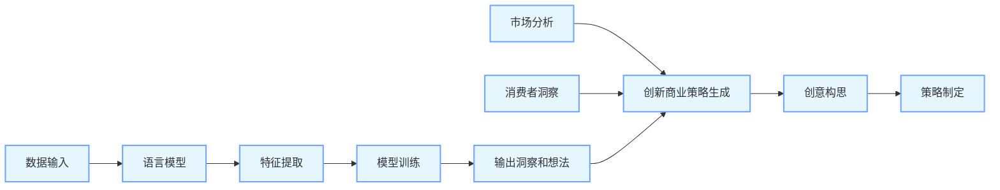

# 语言模型在创新商业策略生成中的应用探索

> 关键词：语言模型、创新商业策略、自然语言处理、策略生成、商业应用

> 摘要：本文聚焦于语言模型在创新商业策略生成领域的应用。首先介绍了研究的背景、目的、预期读者以及文档结构，阐述了相关术语。接着详细分析了语言模型和创新商业策略的核心概念及联系，给出了相应的原理和架构示意图与流程图。深入探讨了核心算法原理并结合 Python 代码进行说明，同时介绍了相关的数学模型和公式。通过项目实战展示了代码实现和解读，分析了实际应用场景。推荐了学习资源、开发工具框架以及相关论文著作。最后总结了未来发展趋势与挑战，解答了常见问题，并提供了扩展阅读和参考资料，旨在全面探索语言模型在创新商业策略生成中的价值和应用方法。

## 1. 背景介绍 
### 1.1 目的和范围
在当今竞争激烈的商业环境中，企业需要不断创新商业策略以保持竞争力。语言模型作为自然语言处理领域的重要成果，具有强大的文本生成和理解能力。本研究的目的在于探索如何利用语言模型为企业生成创新商业策略，具体范围涵盖了语言模型的基本原理、在商业策略生成中的应用方法、实际案例分析以及未来发展趋势等方面。

### 1.2 预期读者
本文预期读者包括企业管理者、市场营销人员、商业策略分析师、自然语言处理领域的研究人员和开发者等。对于企业管理者和市场营销人员，本文可帮助他们了解如何借助语言模型制定更具创新性的商业策略；对于研究人员和开发者，本文提供了技术实现和应用场景的参考。

### 1.3 文档结构概述
本文首先介绍相关背景知识，包括目的、预期读者和文档结构等。接着阐述语言模型和创新商业策略的核心概念及联系，分析核心算法原理并给出 Python 代码示例。然后介绍相关数学模型和公式，通过项目实战展示代码实现和解读。探讨实际应用场景，推荐学习资源、开发工具框架和相关论文著作。最后总结未来发展趋势与挑战，解答常见问题并提供扩展阅读和参考资料。

### 1.4 术语表
#### 1.4.1 核心术语定义
- **语言模型**：是一种对自然语言文本进行建模的统计模型，用于预测给定上下文下下一个词出现的概率。例如，在“今天天气很”之后，语言模型可以预测下一个词可能是“好”“晴朗”等。
- **创新商业策略**：指企业为了在市场中获得竞争优势，通过引入新的理念、方法或技术而制定的具有创新性的商业计划和行动方案。
- **自然语言处理（NLP）**：是计算机科学与语言学的交叉领域，旨在让计算机能够理解、处理和生成人类语言。

#### 1.4.2 相关概念解释
- **上下文**：在语言模型中，上下文是指当前词之前的文本信息，用于帮助模型预测下一个词。例如，在句子“我喜欢吃苹果，因为它很”中，“我喜欢吃苹果，因为它很”就是上下文。
- **商业洞察**：指对市场、竞争对手、消费者需求等方面的深入理解和分析，是制定商业策略的重要依据。

#### 1.4.3 缩略词列表
- **NLP**：Natural Language Processing（自然语言处理）
- **API**：Application Programming Interface（应用程序编程接口）

## 2. 核心概念与联系 

### 语言模型原理
语言模型的核心目标是学习语言的统计规律，从而能够对文本进行生成和预测。常见的语言模型包括基于规则的模型、统计语言模型和神经网络语言模型。

基于规则的模型通过手工编写的语法规则来处理语言，但其扩展性和灵活性较差。统计语言模型则利用大量的文本数据来统计词与词之间的共现频率，从而计算出给定上下文下下一个词出现的概率。例如，n-gram 模型就是一种典型的统计语言模型，它假设一个词的出现只与前 n-1 个词有关。

神经网络语言模型则利用神经网络来学习语言的表示和规律，具有更强的表达能力和泛化能力。例如，循环神经网络（RNN）及其变体长短期记忆网络（LSTM）和门控循环单元（GRU），以及Transformer 架构的语言模型如 GPT 和 BERT 等。

### 创新商业策略生成原理
创新商业策略的生成需要综合考虑市场环境、竞争对手、消费者需求等多方面因素。通常包括以下几个步骤：
1. **市场分析**：了解市场的规模、增长趋势、竞争格局等。
2. **消费者洞察**：分析消费者的需求、偏好、行为等。
3. **创意构思**：结合市场分析和消费者洞察，提出创新性的商业想法。
4. **策略制定**：将创意转化为具体的商业策略，包括产品定位、营销策略、运营策略等。

### 语言模型与创新商业策略生成的联系
语言模型可以在创新商业策略生成的各个环节发挥重要作用：
1. **市场分析和消费者洞察**：语言模型可以对大量的市场报告、消费者评论等文本数据进行分析，提取有价值的信息和洞察。例如，通过分析消费者在社交媒体上的评论，了解他们对产品的满意度和需求痛点。
2. **创意构思**：语言模型可以根据输入的信息生成创新性的商业想法。例如，输入市场需求和企业资源等信息，语言模型可以生成不同的产品概念和营销策略。
3. **策略制定**：语言模型可以帮助将创意转化为具体的商业策略。例如，生成详细的产品定位描述、营销文案和运营计划等。

### 文本示意图
```plaintext
语言模型
|
|-- 数据输入（市场报告、消费者评论等文本数据）
|
|-- 特征提取（词向量、语义表示等）
|
|-- 模型训练（神经网络训练）
|
|-- 输出（市场洞察、创意想法、商业策略文本等）
|
创新商业策略生成
|
|-- 市场分析
|   |-- 市场规模、增长趋势、竞争格局等信息提取
|
|-- 消费者洞察
|   |-- 消费者需求、偏好、行为等信息提取
|
|-- 创意构思
|   |-- 结合市场分析和消费者洞察生成创新性想法
|
|-- 策略制定
|   |-- 将创意转化为具体商业策略（产品定位、营销策略等）
```

### Mermaid 流程图


## 3. 核心算法原理 & 具体操作步骤 

### 语言模型的核心算法 - Transformer 架构
Transformer 是一种基于注意力机制的神经网络架构，它在自然语言处理领域取得了巨大的成功。Transformer 的核心组件包括多头注意力机制（Multi-Head Attention）和前馈神经网络（Feed Forward Network）。

#### 多头注意力机制
多头注意力机制允许模型在不同的表示子空间中并行地关注输入序列的不同部分。其计算公式如下：

$$\text{Attention}(Q, K, V) = \text{softmax}(\frac{QK^T}{\sqrt{d_k}})V$$

其中，$Q$ 是查询矩阵，$K$ 是键矩阵，$V$ 是值矩阵，$d_k$ 是键向量的维度。

多头注意力机制将多个单头注意力机制的输出拼接起来，然后通过一个线性变换得到最终的输出：

$$\text{MultiHead}(Q, K, V) = \text{Concat}(\text{head}_1, \ldots, \text{head}_h)W^O$$

其中，$\text{head}_i = \text{Attention}(QW_i^Q, KW_i^K, VW_i^V)$，$W_i^Q$，$W_i^K$，$W_i^V$ 和 $W^O$ 是可学习的参数矩阵。

#### 前馈神经网络
前馈神经网络由两个线性层和一个非线性激活函数（通常是 ReLU）组成：

$$FFN(x) = \max(0, xW_1 + b_1)W_2 + b_2$$

其中，$W_1$，$W_2$ 是权重矩阵，$b_1$，$b_2$ 是偏置向量。

### Python 代码实现
以下是一个简化的 Transformer 编码器层的 Python 代码示例：

```python
import torch
import torch.nn as nn
import torch.nn.functional as F

class MultiHeadAttention(nn.Module):
    def __init__(self, input_dim, num_heads):
        super(MultiHeadAttention, self).__init__()
        self.input_dim = input_dim
        self.num_heads = num_heads
        self.head_dim = input_dim // num_heads

        assert (
            self.head_dim * num_heads == input_dim
        ), "Input dimension must be divisible by number of heads"

        self.qkv_proj = nn.Linear(input_dim, 3 * input_dim)
        self.out_proj = nn.Linear(input_dim, input_dim)

    def forward(self, x):
        batch_size, seq_length, input_dim = x.size()
        qkv = self.qkv_proj(x)
        q, k, v = qkv.chunk(3, dim=-1)
        q = q.view(batch_size, seq_length, self.num_heads, self.head_dim).transpose(1, 2)
        k = k.view(batch_size, seq_length, self.num_heads, self.head_dim).transpose(1, 2)
        v = v.view(batch_size, seq_length, self.num_heads, self.head_dim).transpose(1, 2)

        attn_scores = torch.matmul(q, k.transpose(-2, -1)) / (self.head_dim ** 0.5)
        attn_probs = F.softmax(attn_scores, dim=-1)
        output = torch.matmul(attn_probs, v)
        output = output.transpose(1, 2).contiguous().view(batch_size, seq_length, input_dim)
        output = self.out_proj(output)
        return output

class FeedForwardNetwork(nn.Module):
    def __init__(self, input_dim, hidden_dim):
        super(FeedForwardNetwork, self).__init__()
        self.fc1 = nn.Linear(input_dim, hidden_dim)
        self.fc2 = nn.Linear(hidden_dim, input_dim)
        self.relu = nn.ReLU()

    def forward(self, x):
        x = self.fc1(x)
        x = self.relu(x)
        x = self.fc2(x)
        return x

class TransformerEncoderLayer(nn.Module):
    def __init__(self, input_dim, num_heads, hidden_dim, dropout):
        super(TransformerEncoderLayer, self).__init__()
        self.self_attn = MultiHeadAttention(input_dim, num_heads)
        self.feed_forward = FeedForwardNetwork(input_dim, hidden_dim)
        self.norm1 = nn.LayerNorm(input_dim)
        self.norm2 = nn.LayerNorm(input_dim)
        self.dropout = nn.Dropout(dropout)

    def forward(self, x):
        attn_output = self.self_attn(x)
        x = self.norm1(x + self.dropout(attn_output))
        ff_output = self.feed_forward(x)
        x = self.norm2(x + self.dropout(ff_output))
        return x

# 示例使用
input_dim = 512
num_heads = 8
hidden_dim = 2048
dropout = 0.1
batch_size = 32
seq_length = 10

x = torch.randn(batch_size, seq_length, input_dim)
encoder_layer = TransformerEncoderLayer(input_dim, num_heads, hidden_dim, dropout)
output = encoder_layer(x)
print(output.shape)
```

### 具体操作步骤
1. **数据预处理**：将文本数据进行分词、编码等处理，转换为模型可以接受的输入格式。
2. **模型训练**：使用大规模的文本数据对 Transformer 模型进行训练，优化模型的参数。
3. **策略生成**：将市场分析和消费者洞察等信息作为输入，通过训练好的语言模型生成创新商业策略文本。

## 4. 数学模型和公式 & 详细讲解 & 举例说明 

### 语言模型的概率表示
语言模型的核心任务是计算给定上下文 $c$ 下下一个词 $w$ 出现的概率 $P(w|c)$。对于一个长度为 $n$ 的句子 $w_1, w_2, \ldots, w_n$，语言模型可以计算其联合概率：

$$P(w_1, w_2, \ldots, w_n) = \prod_{i=1}^{n} P(w_i|w_1, \ldots, w_{i-1})$$

### n-gram 模型
n-gram 模型是一种简单的统计语言模型，它假设一个词的出现只与前 $n-1$ 个词有关。对于一个 $n$-gram 模型，下一个词 $w_i$ 的概率可以表示为：

$$P(w_i|w_1, \ldots, w_{i-1}) \approx P(w_i|w_{i-(n-1)}, \ldots, w_{i-1})$$

例如，对于一个 2-gram（即 bigram）模型，计算“苹果”在“吃”之后出现的概率 $P(\text{苹果}|\text{吃})$，可以通过统计语料库中“吃苹果”出现的次数与“吃”出现的次数的比值来估计。

### 最大似然估计
在训练语言模型时，通常使用最大似然估计来估计模型的参数。对于一个给定的训练语料库 $D = \{w_1^{(1)}, \ldots, w_{n_1}^{(1)}, \ldots, w_1^{(m)}, \ldots, w_{n_m}^{(m)}\}$，其中 $m$ 是句子的数量，$n_i$ 是第 $i$ 个句子的长度，模型的似然函数为：

$$L(\theta; D) = \prod_{i=1}^{m} P(w_1^{(i)}, \ldots, w_{n_i}^{(i)}; \theta)$$

其中，$\theta$ 是模型的参数。最大似然估计的目标是找到一组参数 $\theta$，使得似然函数 $L(\theta; D)$ 最大。通常，为了方便计算，会对似然函数取对数，得到对数似然函数：

$$\log L(\theta; D) = \sum_{i=1}^{m} \log P(w_1^{(i)}, \ldots, w_{n_i}^{(i)}; \theta)$$

### 举例说明
假设我们有一个简单的语料库：“我喜欢吃苹果”，“他喜欢吃香蕉”。我们要训练一个 2-gram 模型。

首先，统计所有的 2-gram 及其出现的次数：
- “我 喜欢”：1 次
- “喜欢 吃”：2 次
- “吃 苹果”：1 次
- “吃 香蕉”：1 次
- “他 喜欢”：1 次

然后，计算每个 2-gram 的概率：
- $P(\text{喜欢}|\text{我}) = \frac{1}{1} = 1$
- $P(\text{吃}|\text{喜欢}) = \frac{2}{2} = 1$
- $P(\text{苹果}|\text{吃}) = \frac{1}{2}$
- $P(\text{香蕉}|\text{吃}) = \frac{1}{2}$
- $P(\text{喜欢}|\text{他}) = \frac{1}{1} = 1$

## 5. 项目实战：代码实际案例和详细解释说明 

### 5.1  开发环境搭建
#### 操作系统
建议使用 Linux 系统，如 Ubuntu 18.04 或更高版本，因为 Linux 系统对深度学习开发有良好的支持。

#### Python 环境
安装 Python 3.7 或更高版本。可以使用 Anaconda 来管理 Python 环境，具体步骤如下：
1. 从 Anaconda 官方网站下载适合你操作系统的 Anaconda 安装包。
2. 运行安装包并按照提示进行安装。
3. 创建一个新的 Python 环境：
```bash
conda create -n lang_model python=3.8
conda activate lang_model
```

#### 依赖库安装
安装必要的深度学习库和自然语言处理库：
```bash
pip install torch transformers pandas numpy
```

### 5.2  源代码详细实现和代码解读
以下是一个使用 Hugging Face 的 Transformers 库生成创新商业策略的代码示例：

```python
from transformers import GPT2LMHeadModel, GPT2Tokenizer

# 加载预训练的 GPT-2 模型和分词器
tokenizer = GPT2Tokenizer.from_pretrained('gpt2')
model = GPT2LMHeadModel.from_pretrained('gpt2')

# 输入市场分析和消费者洞察信息
input_text = "市场需求增长迅速，消费者更注重产品的环保性和个性化。请生成一个创新商业策略。"

# 对输入文本进行编码
input_ids = tokenizer.encode(input_text, return_tensors='pt')

# 生成商业策略文本
output = model.generate(input_ids, max_length=200, num_beams=5, no_repeat_ngram_size=2, early_stopping=True)

# 对生成的文本进行解码
generated_text = tokenizer.decode(output[0], skip_special_tokens=True)

print(generated_text)
```

### 代码解读与分析
1. **模型和分词器加载**：使用 `GPT2Tokenizer.from_pretrained('gpt2')` 和 `GPT2LMHeadModel.from_pretrained('gpt2')` 分别加载预训练的 GPT-2 分词器和模型。
2. **输入文本编码**：使用分词器将输入的市场分析和消费者洞察信息编码为模型可以接受的输入格式。
3. **文本生成**：使用 `model.generate()` 方法生成商业策略文本。其中，`max_length` 控制生成文本的最大长度，`num_beams` 表示束搜索的束数，`no_repeat_ngram_size` 防止生成文本中出现重复的 n-gram，`early_stopping` 表示在生成到一定条件时停止生成。
4. **文本解码**：使用分词器将生成的编码文本解码为自然语言文本。

## 6. 实际应用场景 
### 新产品开发
语言模型可以根据市场需求和消费者偏好生成新产品的创意和概念。例如，通过分析消费者对智能家居产品的需求，语言模型可以生成新的智能家居产品功能和设计方案，帮助企业开发更符合市场需求的产品。

### 营销策略制定
语言模型可以生成创新的营销文案和推广策略。例如，根据产品特点和目标受众，生成吸引人的广告标语、社交媒体文案和促销活动方案，提高营销效果。

### 市场竞争分析
语言模型可以对竞争对手的产品和策略进行分析，为企业提供竞争情报。例如，通过分析竞争对手的官方网站、新闻报道和社交媒体内容，了解他们的产品优势、市场定位和营销策略，帮助企业制定应对策略。

### 客户服务优化
语言模型可以用于智能客服系统，自动回答客户的问题和解决客户的问题。例如，通过训练语言模型学习常见的客户问题和解决方案，实现快速、准确的客户服务，提高客户满意度。

## 7. 工具和资源推荐
### 7.1 学习资源推荐
#### 7.1.1 书籍推荐
- 《深度学习》（Deep Learning）：由 Ian Goodfellow、Yoshua Bengio 和 Aaron Courville 所著，是深度学习领域的经典教材，涵盖了神经网络、卷积神经网络、循环神经网络等内容。
- 《自然语言处理入门》（Natural Language Processing with Python）：由 Steven Bird、Ewan Klein 和 Edward Loper 所著，介绍了使用 Python 进行自然语言处理的基本方法和技术。
- 《Attention Is All You Need》论文解读书籍：帮助深入理解 Transformer 架构的原理和应用。

#### 7.1.2 在线课程
- Coursera 上的“深度学习专项课程”（Deep Learning Specialization）：由 Andrew Ng 教授授课，涵盖了深度学习的各个方面，包括神经网络、卷积神经网络、循环神经网络等。
- edX 上的“自然语言处理基础”（Foundations of Natural Language Processing）：介绍了自然语言处理的基本概念、方法和技术。
- Hugging Face 官方教程：提供了使用 Transformers 库进行自然语言处理的详细教程和示例代码。

#### 7.1.3 技术博客和网站
- Hugging Face 博客：发布了关于自然语言处理和语言模型的最新研究成果和应用案例。
- Towards Data Science：一个数据科学和机器学习领域的技术博客，有很多关于语言模型和自然语言处理的文章。
- arXiv.org：一个预印本论文库，提供了大量关于自然语言处理和机器学习的最新研究论文。

### 7.2 开发工具框架推荐
#### 7.2.1 IDE和编辑器
- PyCharm：一款专业的 Python 集成开发环境，提供了代码编辑、调试、版本控制等功能。
- Jupyter Notebook：一个交互式的开发环境，适合进行数据分析和模型实验。
- Visual Studio Code：一款轻量级的代码编辑器，支持多种编程语言和插件扩展。

#### 7.2.2 调试和性能分析工具
- TensorBoard：一个用于可视化深度学习模型训练过程和性能的工具，可以帮助开发者监控模型的训练进度、损失函数变化等。
- PyTorch Profiler：PyTorch 提供的性能分析工具，可以帮助开发者找出代码中的性能瓶颈。

#### 7.2.3 相关框架和库
- Hugging Face Transformers：一个开源的自然语言处理库，提供了多种预训练的语言模型和工具，方便开发者进行自然语言处理任务。
- SpaCy：一个快速、高效的自然语言处理库，提供了分词、词性标注、命名实体识别等功能。
- NLTK：一个经典的自然语言处理库，提供了丰富的语料库和工具，适合初学者学习自然语言处理。

### 7.3 相关论文著作推荐
#### 7.3.1 经典论文
- “Attention Is All You Need”：提出了 Transformer 架构，为现代语言模型的发展奠定了基础。
- “BERT: Pre-training of Deep Bidirectional Transformers for Language Understanding”：介绍了 BERT 模型，在自然语言处理任务中取得了显著的成果。
- “Generative Pretrained Transformer”（GPT）系列论文：包括 GPT、GPT-2 和 GPT-3 等论文，展示了生成式预训练语言模型的强大能力。

#### 7.3.2 最新研究成果
- 关注 arXiv.org 上关于自然语言处理和语言模型的最新论文，了解该领域的最新研究动态。
- 参加自然语言处理领域的国际会议，如 ACL（Association for Computational Linguistics）、EMNLP（Conference on Empirical Methods in Natural Language Processing）等，获取最新的研究成果。

#### 7.3.3 应用案例分析
- 阅读相关企业和研究机构发布的应用案例报告，了解语言模型在实际商业场景中的应用方法和效果。
- 分析 Kaggle 上的自然语言处理竞赛项目，学习其他开发者的解决方案和经验。

## 8. 总结：未来发展趋势与挑战
### 未来发展趋势
- **多模态融合**：未来的语言模型将不仅仅处理文本数据，还会融合图像、音频、视频等多模态数据，提供更丰富的信息和更全面的商业洞察。
- **个性化定制**：语言模型将能够根据不同企业的需求和特点，生成个性化的商业策略，提高策略的针对性和有效性。
- **与其他技术的结合**：语言模型将与区块链、物联网、人工智能等技术深度结合，创造出更多创新的商业应用场景。

### 挑战
- **数据质量和隐私问题**：语言模型的训练需要大量高质量的数据，但数据的收集、标注和管理存在一定的难度。同时，数据隐私问题也需要得到重视，确保企业和消费者的信息安全。
- **模型可解释性**：目前的语言模型大多是黑盒模型，难以解释其决策过程和生成结果的合理性。提高模型的可解释性是未来研究的重要方向。
- **技术门槛和成本**：开发和应用语言模型需要一定的技术实力和计算资源，对于一些中小企业来说，技术门槛和成本较高。如何降低技术门槛和成本，推广语言模型的应用，是需要解决的问题。

## 9. 附录：常见问题与解答
### 问题 1：语言模型生成的商业策略一定可行吗？
解答：语言模型生成的商业策略是基于其学习到的知识和模式，但并不一定完全可行。商业策略的可行性还需要结合实际的市场情况、企业资源和竞争环境等因素进行评估和调整。语言模型生成的策略可以作为参考和启发，帮助企业开拓思路。

### 问题 2：如何提高语言模型生成商业策略的质量？
解答：可以从以下几个方面提高语言模型生成商业策略的质量：
- 使用高质量的训练数据，包括行业报告、市场分析、成功案例等。
- 对语言模型进行微调，使其更符合特定行业和企业的需求。
- 结合人工的专业知识和经验，对生成的策略进行审核和优化。

### 问题 3：语言模型在商业策略生成中的应用是否会取代人类的决策？
解答：不会。语言模型在商业策略生成中可以提供有价值的信息和建议，但人类的决策仍然是不可或缺的。人类具有创造力、判断力和对复杂情况的综合分析能力，能够结合实际情况做出更明智的决策。语言模型只是辅助人类进行决策的工具。

## 10. 扩展阅读 & 参考资料
### 扩展阅读
- 《创新者的窘境》（The Innovator's Dilemma）：探讨了企业在创新过程中面临的挑战和机遇，对理解创新商业策略有一定的帮助。
- 《营销管理》（Marketing Management）：经典的营销学教材，介绍了市场营销的基本理论和方法，与商业策略制定密切相关。

### 参考资料
- Hugging Face 官方文档：https://huggingface.co/docs/transformers/index
- PyTorch 官方文档：https://pytorch.org/docs/stable/index.html
- 相关学术论文和研究报告

作者：AI天才研究院/AI Genius Institute & 禅与计算机程序设计艺术 /Zen And The Art of Computer Programming