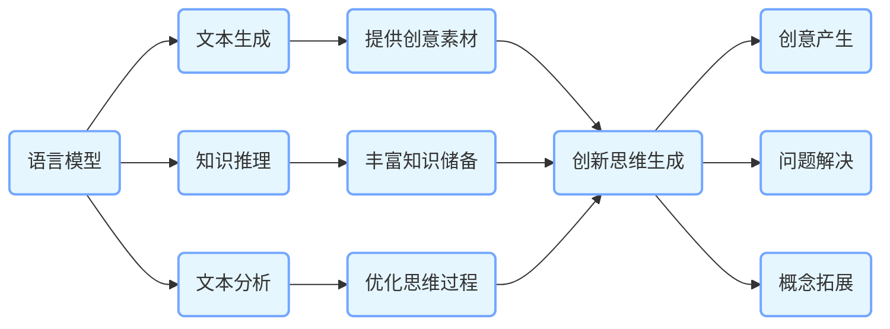

# 语言模型在创新思维生成中的应用研究

> 关键词：语言模型、创新思维、自然语言处理、文本生成、应用研究

> 摘要：本文围绕语言模型在创新思维生成中的应用展开深入研究。首先介绍了语言模型和创新思维的相关背景知识，阐述了研究的目的、范围及预期读者等内容。接着详细讲解了语言模型和创新思维的核心概念与联系，给出了原理和架构的文本示意图与 Mermaid 流程图。通过 Python 源代码阐述了核心算法原理及具体操作步骤，并介绍了相关的数学模型和公式。在项目实战部分，给出代码实际案例并进行详细解释说明。探讨了语言模型在创新思维生成中的实际应用场景，推荐了相关的学习资源、开发工具框架以及论文著作。最后总结了未来发展趋势与挑战，还设置了常见问题与解答以及扩展阅读和参考资料，旨在全面深入地探究语言模型在创新思维生成中的应用，为相关领域的研究和实践提供有价值的参考。

## 1. 背景介绍 
### 1.1 目的和范围
随着人工智能技术的飞速发展，语言模型作为自然语言处理领域的关键技术，取得了显著的进展。语言模型能够处理和生成自然语言文本，其应用范围也越来越广泛。创新思维是人类创造力的核心，在各个领域都起着至关重要的作用。本研究的目的在于探讨语言模型如何在创新思维生成中发挥作用，通过对语言模型的深入研究和应用，挖掘其在激发创新思维、辅助创新过程中的潜力。

研究范围涵盖了常见的语言模型，如基于规则的语言模型、统计语言模型以及当前流行的预训练语言模型（如 GPT 系列、BERT 等）。同时，涉及创新思维的多个方面，包括创意产生、问题解决、概念拓展等，分析语言模型在不同创新场景中的应用方式和效果。

### 1.2 预期读者
本文的预期读者包括自然语言处理领域的研究人员、对人工智能和创新思维感兴趣的开发者、企业中的创新团队成员以及相关领域的学者。对于研究人员来说，本文提供了语言模型在创新思维生成方面的研究思路和方法；开发者可以从中获取具体的技术实现和应用案例；创新团队成员能够了解如何借助语言模型来提升团队的创新能力；学者则可以在理论和实践方面获得新的启发。

### 1.3 文档结构概述
本文共分为十个部分。第一部分为背景介绍，阐述了研究的目的、范围、预期读者和文档结构概述，以及相关术语表。第二部分介绍语言模型和创新思维的核心概念与联系，通过文本示意图和 Mermaid 流程图进行详细说明。第三部分讲解核心算法原理及具体操作步骤，使用 Python 源代码进行阐述。第四部分介绍数学模型和公式，并进行详细讲解和举例说明。第五部分是项目实战，包括开发环境搭建、源代码详细实现和代码解读以及代码分析。第六部分探讨实际应用场景。第七部分推荐相关的工具和资源，包括学习资源、开发工具框架和论文著作。第八部分总结未来发展趋势与挑战。第九部分是附录，包含常见问题与解答。第十部分提供扩展阅读和参考资料。

### 1.4 术语表
#### 1.4.1 核心术语定义
- **语言模型**：是一种对自然语言文本进行建模的概率模型，用于计算一个句子或一段文本出现的概率，或者根据给定的上下文生成下一个词或文本序列。
- **创新思维**：是指以新颖独创的方法解决问题的思维过程，通过这种思维能突破常规思维的界限，以超常规甚至反常规的方法、视角去思考问题，提出与众不同的解决方案，从而产生新颖的、独到的、有社会意义的思维成果。
- **自然语言处理（NLP）**：是计算机科学、人工智能和语言学的交叉领域，旨在让计算机能够理解、处理和生成自然语言。
- **预训练语言模型**：是一种在大规模无监督文本数据上进行预训练的语言模型，通过学习文本中的语言模式和语义信息，能够在多种自然语言处理任务中取得较好的效果。

#### 1.4.2 相关概念解释
- **文本生成**：是自然语言处理中的一个重要任务，指的是根据给定的输入信息，如主题、关键词、上下文等，生成自然语言文本的过程。语言模型在文本生成中起着关键作用，通过对语言的概率分布进行建模，生成符合语法和语义的文本。
- **创意激发**：是创新思维生成的重要环节，指的是通过各种方法和手段，激发人们产生新颖、独特的想法和创意。语言模型可以通过提供多样化的文本、不同的视角和思路等方式，帮助人们激发创意。
- **知识图谱**：是一种语义网络，用于表示实体之间的关系和知识。在创新思维生成中，知识图谱可以为语言模型提供丰富的背景知识，帮助语言模型更好地理解文本和生成更有价值的内容。

#### 1.4.3 缩略词列表
- **NLP**：Natural Language Processing（自然语言处理）
- **GPT**：Generative Pretrained Transformer（生成式预训练变换器）
- **BERT**：Bidirectional Encoder Representations from Transformers（基于变换器的双向编码器表示）

## 2. 核心概念与联系 

### 语言模型的核心概念
语言模型的基本目标是对自然语言文本的概率分布进行建模。给定一个词序列 $w_1, w_2, \cdots, w_n$，语言模型的任务是计算该词序列出现的概率 $P(w_1, w_2, \cdots, w_n)$。根据链式法则，这个概率可以分解为：

$$P(w_1, w_2, \cdots, w_n) = P(w_1)P(w_2|w_1)P(w_3|w_1, w_2)\cdots P(w_n|w_1, w_2, \cdots, w_{n - 1})$$

在实际应用中，由于计算复杂度的问题，通常会采用一些简化的假设，如 $n$-gram 模型，假设当前词的概率只依赖于前 $n - 1$ 个词，即：

$$P(w_i|w_1, w_2, \cdots, w_{i - 1}) \approx P(w_i|w_{i - n + 1}, w_{i - n + 2}, \cdots, w_{i - 1})$$

现代的预训练语言模型，如 GPT 和 BERT，采用了深度学习技术，特别是变换器（Transformer）架构。变换器通过自注意力机制（Self-Attention）能够捕捉文本中的长距离依赖关系，从而更有效地建模语言的语义和语法信息。

### 创新思维的核心概念
创新思维是一种复杂的心理过程，它涉及到多个方面的因素，如知识储备、思维方式、创造力、问题解决能力等。创新思维的特点包括新颖性、独特性、灵活性和实用性等。新颖性指的是创新思维的成果具有独特的、前所未有的特点；独特性强调思维方式和解决方案的与众不同；灵活性表示能够从不同的角度和层面思考问题；实用性则要求创新思维的成果具有实际的应用价值。

### 语言模型与创新思维的联系
语言模型可以为创新思维生成提供多方面的支持。首先，语言模型可以通过文本生成的方式，为用户提供多样化的文本内容，这些内容可以作为创意激发的素材。例如，在写作过程中，语言模型可以生成不同风格、不同主题的文本段落，帮助作者拓展思路，产生新的创意。其次，语言模型可以通过知识推理和问答等功能，为用户提供相关的知识和信息，丰富用户的知识储备，从而促进创新思维的产生。此外，语言模型还可以对用户输入的文本进行分析和理解，提供反馈和建议，帮助用户优化思维过程和解决方案。

### 文本示意图
```plaintext
语言模型
|-- 基于规则的语言模型
|-- 统计语言模型
|   |-- n-gram 模型
|   |-- 隐马尔可夫模型
|-- 预训练语言模型
|   |-- GPT 系列
|   |-- BERT 系列

创新思维
|-- 创意产生
|-- 问题解决
|-- 概念拓展

语言模型与创新思维的联系
|-- 提供创意素材
|-- 丰富知识储备
|-- 优化思维过程
```

### Mermaid 流程图


## 3. 核心算法原理 & 具体操作步骤 

### 基于 n-gram 模型的语言模型原理
n-gram 模型是一种简单而有效的统计语言模型。它基于这样一个假设：当前词的出现概率只依赖于前 $n - 1$ 个词。以三元组（trigram，$n = 3$）模型为例，对于一个词序列 $w_1, w_2, \cdots, w_n$，其概率可以表示为：

$$P(w_1, w_2, \cdots, w_n) \approx \prod_{i = 3}^{n} P(w_i|w_{i - 2}, w_{i - 1})$$

其中，$P(w_i|w_{i - 2}, w_{i - 1})$ 可以通过统计语料库中 $w_{i - 2}, w_{i - 1}, w_i$ 同时出现的频率来估计：

$$P(w_i|w_{i - 2}, w_{i - 1}) = \frac{C(w_{i - 2}, w_{i - 1}, w_i)}{C(w_{i - 2}, w_{i - 1})}$$

其中，$C(w_{i - 2}, w_{i - 1}, w_i)$ 表示 $w_{i - 2}, w_{i - 1}, w_i$ 在语料库中同时出现的次数，$C(w_{i - 2}, w_{i - 1})$ 表示 $w_{i - 2}, w_{i - 1}$ 同时出现的次数。

### Python 实现 n-gram 语言模型
```python
from collections import defaultdict, Counter

class NGramLanguageModel:
    def __init__(self, n):
        self.n = n
        self.ngram_counts = defaultdict(Counter)
        self.context_counts = Counter()

    def train(self, corpus):
        """
        训练 n-gram 语言模型
        :param corpus: 语料库，一个包含多个句子的列表
        """
        for sentence in corpus:
            tokens = sentence.split()
            for i in range(len(tokens) - self.n + 1):
                context = tuple(tokens[i:i + self.n - 1])
                word = tokens[i + self.n - 1]
                self.ngram_counts[context][word] += 1
                self.context_counts[context] += 1

    def predict(self, context):
        """
        根据上下文预测下一个词
        :param context: 上下文，一个包含 n - 1 个词的元组
        :return: 下一个词的概率分布
        """
        if context not in self.ngram_counts:
            return {}
        total_count = self.context_counts[context]
        probabilities = {}
        for word, count in self.ngram_counts[context].items():
            probabilities[word] = count / total_count
        return probabilities

    def generate_text(self, initial_context, max_length=100):
        """
        生成文本
        :param initial_context: 初始上下文，一个包含 n - 1 个词的元组
        :param max_length: 生成文本的最大长度
        :return: 生成的文本
        """
        context = initial_context
        text = list(context)
        for _ in range(max_length):
            probabilities = self.predict(context)
            if not probabilities:
                break
            next_word = max(probabilities, key=probabilities.get)
            text.append(next_word)
            context = tuple(text[-self.n + 1:])
        return ' '.join(text)

# 示例用法
corpus = [
    "I like to play football",
    "She likes to read books",
    "They like to watch movies"
]

model = NGramLanguageModel(n=3)
model.train(corpus)

initial_context = ("I", "like")
generated_text = model.generate_text(initial_context)
print(generated_text)
```

### 具体操作步骤
1. **数据准备**：收集和整理语料库，将其划分为句子或段落。
2. **模型训练**：调用 `train` 方法，将语料库作为输入，训练 n-gram 语言模型。
3. **文本生成**：选择初始上下文，调用 `generate_text` 方法，生成文本。

## 4. 数学模型和公式 & 详细讲解 & 举例说明 

### n-gram 模型的数学模型和公式
如前面所述，n-gram 模型的核心公式是基于条件概率的分解：

$$P(w_1, w_2, \cdots, w_n) \approx \prod_{i = n}^{N} P(w_i|w_{i - n + 1}, w_{i - n + 2}, \cdots, w_{i - 1})$$

其中，$N$ 是词序列的长度。条件概率 $P(w_i|w_{i - n + 1}, w_{i - n + 2}, \cdots, w_{i - 1})$ 可以通过最大似然估计（MLE）来计算：

$$P(w_i|w_{i - n + 1}, w_{i - n + 2}, \cdots, w_{i - 1}) = \frac{C(w_{i - n + 1}, w_{i - n + 2}, \cdots, w_{i - 1}, w_i)}{C(w_{i - n + 1}, w_{i - n + 2}, \cdots, w_{i - 1})}$$

### 详细讲解
最大似然估计是一种常用的参数估计方法，它的基本思想是选择使观测数据出现概率最大的参数值。在 n-gram 模型中，我们通过统计语料库中不同 n-gram 出现的频率来估计条件概率。分母 $C(w_{i - n + 1}, w_{i - n + 2}, \cdots, w_{i - 1})$ 表示上下文 $(w_{i - n + 1}, w_{i - n + 2}, \cdots, w_{i - 1})$ 在语料库中出现的次数，分子 $C(w_{i - n + 1}, w_{i - n + 2}, \cdots, w_{i - 1}, w_i)$ 表示上下文和当前词 $w_i$ 同时出现的次数。

### 举例说明
假设我们有一个简单的语料库：

```plaintext
I like to play football
She likes to read books
They like to watch movies
```

我们要计算三元组模型中 $P(play|I, like)$ 的值。首先，统计 $C(I, like, play)$ 和 $C(I, like)$ 的值。在语料库中，$C(I, like, play) = 1$，$C(I, like) = 1$，所以 $P(play|I, like) = \frac{1}{1} = 1$。

### 预训练语言模型的数学基础
预训练语言模型通常基于变换器（Transformer）架构，其核心是自注意力机制（Self-Attention）。自注意力机制的数学表达式如下：

$$\text{Attention}(Q, K, V) = \text{softmax}(\frac{QK^T}{\sqrt{d_k}})V$$

其中，$Q$、$K$、$V$ 分别是查询（Query）、键（Key）和值（Value）矩阵，$d_k$ 是键的维度。$\text{softmax}$ 函数用于将分数转换为概率分布，使得注意力权重之和为 1。

## 5. 项目实战：代码实际案例和详细解释说明 

### 5.1  开发环境搭建
#### 操作系统
本项目可以在多种操作系统上进行开发，如 Windows、Linux（如 Ubuntu）和 macOS。

#### Python 环境
建议使用 Python 3.7 及以上版本。可以从 Python 官方网站（https://www.python.org/downloads/） 下载并安装 Python。

#### 依赖库安装
本项目需要安装以下依赖库：
- `torch`：用于深度学习计算，可通过以下命令安装：
```bash
pip install torch
```
- `transformers`：用于使用预训练语言模型，可通过以下命令安装：
```bash
pip install transformers
```

### 5.2  源代码详细实现和代码解读
以下是一个使用 Hugging Face 的 `transformers` 库调用 GPT-2 模型进行文本生成的示例代码：

```python
from transformers import GPT2LMHeadModel, GPT2Tokenizer

# 加载预训练的 GPT-2 模型和分词器
model_name = "gpt2"
tokenizer = GPT2Tokenizer.from_pretrained(model_name)
model = GPT2LMHeadModel.from_pretrained(model_name)

# 输入文本
input_text = "Once upon a time"

# 对输入文本进行分词
input_ids = tokenizer.encode(input_text, return_tensors="pt")

# 生成文本
output = model.generate(input_ids, max_length=100, num_beams=5, no_repeat_ngram_size=2, early_stopping=True)

# 将生成的文本解码
generated_text = tokenizer.decode(output[0], skip_special_tokens=True)

print(generated_text)
```

### 代码解读
1. **加载模型和分词器**：使用 `GPT2Tokenizer.from_pretrained` 和 `GPT2LMHeadModel.from_pretrained` 分别加载 GPT-2 模型的分词器和模型。
2. **输入文本处理**：将输入文本使用分词器进行分词，得到输入的词 ID 序列。
3. **文本生成**：调用模型的 `generate` 方法进行文本生成。`max_length` 参数指定生成文本的最大长度，`num_beams` 参数表示束搜索的束数，`no_repeat_ngram_size` 参数用于避免生成重复的 n-gram，`early_stopping` 参数表示在生成结束时提前停止。
4. **解码生成的文本**：使用分词器的 `decode` 方法将生成的词 ID 序列解码为自然语言文本。

### 5.3  代码解读与分析
#### 束搜索（Beam Search）
束搜索是一种在文本生成中常用的搜索算法，用于在生成过程中寻找最优的词序列。在每一步生成中，束搜索会保留得分最高的 $k$ 个候选词序列（$k$ 为束数），而不是只保留得分最高的一个。这样可以增加找到更优解的可能性，但同时也会增加计算复杂度。

#### 避免重复 n-gram
`no_repeat_ngram_size` 参数用于避免生成重复的 n-gram。在生成过程中，如果某个 n-gram 已经出现过，就会禁止再次生成该 n-gram，从而提高生成文本的多样性。

#### 提前停止（Early Stopping）
`early_stopping` 参数表示在生成结束时提前停止。当生成的文本达到最大长度或者遇到结束标记时，生成过程会停止。

## 6. 实际应用场景 
### 创意写作
语言模型可以为作家、编剧等创意工作者提供创意灵感和素材。例如，在写作小说时，语言模型可以根据给定的主题或情节梗概，生成不同风格的段落或章节，帮助作者拓展思路，丰富故事情节。在剧本创作中，语言模型可以生成角色对话、场景描述等内容，提高创作效率。

### 广告创意
在广告行业中，语言模型可以帮助广告创意团队生成吸引人的广告语、宣传文案等。通过输入产品特点、目标受众等信息，语言模型可以生成多种不同风格和表达方式的广告内容，供创意团队选择和修改。

### 产品创新
在产品研发过程中，语言模型可以辅助产品经理和研发团队进行创意构思和问题解决。例如，通过分析用户反馈和市场需求，语言模型可以提供新的产品功能建议、改进方案等，帮助团队发现潜在的创新点。

### 教育领域
在教育领域，语言模型可以用于辅助教学和学习。例如，为学生提供写作提示、解答问题、拓展知识等。教师可以利用语言模型生成多样化的教学材料，如练习题、案例分析等，提高教学效果。

## 7. 工具和资源推荐
### 7.1 学习资源推荐
#### 7.1.1 书籍推荐
- 《自然语言处理入门》：作者何晗，本书系统地介绍了自然语言处理的基本概念、方法和技术，适合初学者入门。
- 《深度学习》：作者 Ian Goodfellow、Yoshua Bengio 和 Aaron Courville，这本书是深度学习领域的经典教材，详细介绍了深度学习的理论和实践。
- 《Python 自然语言处理》：作者 Steven Bird、Ewan Klein 和 Edward Loper，本书通过 Python 语言介绍了自然语言处理的各种技术和应用。

#### 7.1.2 在线课程
- Coursera 上的 “Natural Language Processing Specialization”：由斯坦福大学的教授授课，系统地介绍了自然语言处理的各个方面。
- edX 上的 “Deep Learning for Natural Language Processing”：深入讲解了深度学习在自然语言处理中的应用。
- 哔哩哔哩上的一些自然语言处理相关课程，如 “动手学自然语言处理” 等，这些课程通常由国内的专业人士讲解，内容生动易懂。

#### 7.1.3 技术博客和网站
- Hugging Face 博客（https://huggingface.co/blog）：提供了关于预训练语言模型和自然语言处理的最新研究成果和技术应用。
- Medium 上的自然语言处理相关博客：有很多专业人士分享自然语言处理的技术和经验。
- 机器之心（https://www.alienclouds.cn/）：关注人工智能领域的最新动态和技术发展，有很多关于自然语言处理的深度报道和分析。

### 7.2 开发工具框架推荐
#### 7.2.1 IDE和编辑器
- PyCharm：是一款专业的 Python 集成开发环境，提供了丰富的代码编辑、调试和项目管理功能。
- Visual Studio Code：是一款轻量级的代码编辑器，支持多种编程语言，通过安装相关插件可以进行 Python 开发。
- Jupyter Notebook：是一种交互式的开发环境，适合进行数据探索和模型实验。

#### 7.2.2 调试和性能分析工具
- PyTorch Profiler：是 PyTorch 提供的性能分析工具，可以帮助开发者分析模型的性能瓶颈，优化代码。
- TensorBoard：是 TensorFlow 提供的可视化工具，也可以用于 PyTorch 模型的训练过程可视化和性能分析。
- cProfile：是 Python 自带的性能分析工具，可以分析 Python 代码的运行时间和函数调用情况。

#### 7.2.3 相关框架和库
- Hugging Face Transformers：提供了丰富的预训练语言模型和相关工具，方便开发者进行自然语言处理任务的开发。
- AllenNLP：是一个用于自然语言处理的深度学习框架，提供了很多预训练模型和工具，支持多种自然语言处理任务。
- NLTK：是一个常用的自然语言处理库，提供了丰富的语料库和工具，适合初学者进行自然语言处理的学习和实践。

### 7.3 相关论文著作推荐
#### 7.3.1 经典论文
- “Attention Is All You Need”：提出了变换器（Transformer）架构，为现代预训练语言模型的发展奠定了基础。
- “BERT: Pre-training of Deep Bidirectional Transformers for Language Understanding”：介绍了 BERT 模型，开启了预训练语言模型在自然语言处理中的广泛应用。
- “Generative Pretrained Transformer 2 (GPT-2): Language Models are Unsupervised Multitask Learners”：介绍了 GPT-2 模型，展示了生成式预训练语言模型的强大能力。

#### 7.3.2 最新研究成果
可以通过学术搜索引擎，如 Google Scholar、Semantic Scholar 等，搜索自然语言处理和语言模型领域的最新研究成果。关注顶级学术会议，如 ACL（Association for Computational Linguistics）、EMNLP（Conference on Empirical Methods in Natural Language Processing）等的论文。

#### 7.3.3 应用案例分析
一些学术期刊和会议会发表语言模型在各个领域的应用案例分析，如《ACM Transactions on Intelligent Systems and Technology》、《Journal of Artificial Intelligence Research》等。此外，一些企业和研究机构的官方博客也会分享语言模型的应用案例，如 Google AI 博客、OpenAI 博客等。

## 8. 总结：未来发展趋势与挑战
### 未来发展趋势
- **更强的语言理解和生成能力**：未来的语言模型将不断提高对自然语言的理解和生成能力，能够处理更加复杂和多样化的语言任务，生成更加自然、流畅和有逻辑的文本。
- **跨模态融合**：语言模型将与图像、音频等其他模态的信息进行融合，实现更加丰富和全面的信息处理和交互。例如，在图像描述、视频字幕生成等任务中，结合视觉信息和语言信息，生成更加准确和生动的文本描述。
- **个性化和定制化**：根据用户的个性化需求和偏好，为用户提供定制化的语言服务。例如，在智能写作助手、智能客服等应用中，根据用户的写作风格、业务需求等生成符合用户要求的文本。
- **知识增强**：将知识图谱、外部知识库等知识源与语言模型相结合，提高语言模型的知识水平和推理能力。这样，语言模型能够更好地理解和处理涉及专业知识和常识的文本，生成更有价值的内容。

### 挑战
- **数据隐私和安全**：语言模型的训练需要大量的文本数据，这些数据可能包含用户的隐私信息。如何在保证数据质量的同时，保护用户的隐私和数据安全是一个重要的挑战。
- **计算资源需求**：训练和运行大规模的语言模型需要大量的计算资源，如 GPU、TPU 等。如何降低计算成本，提高计算效率，是语言模型发展面临的一个关键问题。
- **模型可解释性**：目前的语言模型大多是基于深度学习的黑盒模型，其决策过程和推理机制难以解释。提高模型的可解释性，让用户更好地理解模型的输出结果，是语言模型应用中的一个重要挑战。
- **伦理和社会影响**：语言模型的广泛应用可能会带来一些伦理和社会问题，如虚假信息传播、偏见和歧视等。如何引导语言模型的健康发展，避免其带来的负面影响，是需要关注的重要问题。

## 9. 附录：常见问题与解答
### 1. 语言模型生成的文本质量如何保证？
语言模型生成的文本质量受到多种因素的影响，如模型的结构、训练数据、生成参数等。为了提高文本质量，可以采取以下措施：
- 选择合适的预训练模型，不同的模型在不同的任务上可能有不同的表现。
- 对训练数据进行清洗和预处理，保证数据的质量。
- 调整生成参数，如束搜索的束数、重复 n-gram 的限制等，以控制生成文本的多样性和连贯性。
- 对生成的文本进行后处理，如语法检查、语义纠错等。

### 2. 语言模型在创新思维生成中的应用有哪些局限性？
语言模型在创新思维生成中的应用存在以下局限性：
- **缺乏真正的创造力**：语言模型是基于已有的数据和模式进行生成的，缺乏真正的创造性思维和主观意识。它生成的内容可能只是对已有知识和信息的组合和扩展，难以产生全新的、突破性的创意。
- **理解能力有限**：虽然现代语言模型在语言理解方面取得了很大的进展，但仍然存在理解不准确、不深入的问题。对于一些复杂的语义和语境，语言模型可能无法正确理解，从而影响其在创新思维生成中的应用效果。
- **依赖数据质量**：语言模型的性能很大程度上依赖于训练数据的质量和多样性。如果训练数据存在偏差或局限性，语言模型生成的内容也可能存在相应的问题。

### 3. 如何选择适合的语言模型？
选择适合的语言模型需要考虑以下因素：
- **任务需求**：不同的语言模型在不同的任务上有不同的表现。例如，对于文本生成任务，GPT 系列模型可能更合适；对于文本分类、语义理解等任务，BERT 系列模型可能更有优势。
- **模型规模**：模型规模越大，通常其性能越好，但同时也需要更多的计算资源和时间。在选择模型时，需要根据自己的计算资源和时间限制来选择合适的模型规模。
- **数据量**：如果训练数据量较小，选择较小的模型可能更容易训练和优化；如果训练数据量较大，可以选择更大的模型来充分利用数据的信息。

## 10. 扩展阅读 & 参考资料
### 扩展阅读
- 《人工智能时代的创新思维》：探讨了人工智能技术对创新思维的影响和作用，以及如何在人工智能时代培养和提升创新思维能力。
- 《自然语言处理：从理论到实践》：深入介绍了自然语言处理的各种技术和方法，包括语言模型、文本分类、信息抽取等，适合对自然语言处理有一定基础的读者进一步学习。
- 《创意心理学》：从心理学的角度研究创意的产生过程和机制，对于理解创新思维的本质和提高创新能力有很大的帮助。

### 参考资料
- Hugging Face 官方文档（https://huggingface.co/docs）：提供了关于 `transformers` 库的详细文档和使用示例。
- PyTorch 官方文档（https://pytorch.org/docs/stable/index.html）：介绍了 PyTorch 的各种功能和使用方法。
- ACL Anthology（https://aclanthology.org/）：是自然语言处理领域的学术文献库，包含了大量的会议论文、期刊文章等。

作者：AI天才研究院/AI Genius Institute & 禅与计算机程序设计艺术 /Zen And The Art of Computer Programming