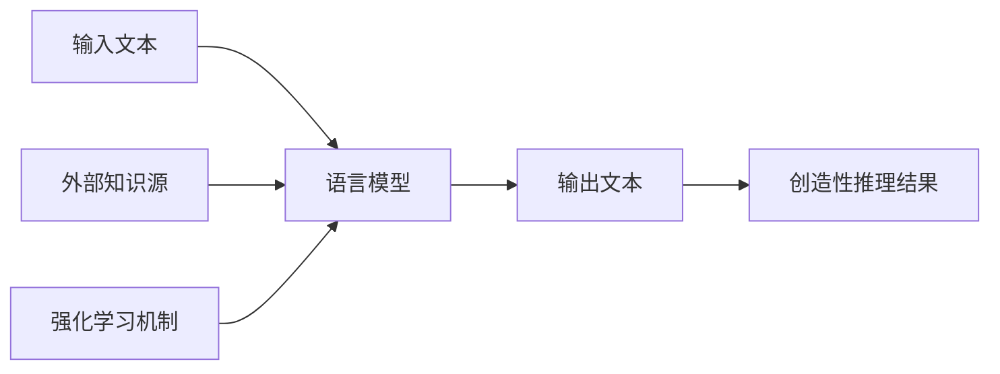

# 语言模型在创造性推理任务中的能力培养

> 关键词：语言模型、创造性推理、能力培养、自然语言处理、深度学习

> 摘要：本文聚焦于语言模型在创造性推理任务中的能力培养。首先介绍了相关背景，包括目的范围、预期读者等内容。接着阐述了语言模型及创造性推理的核心概念与联系，通过文本示意图和 Mermaid 流程图进行清晰展示。深入剖析了核心算法原理，结合 Python 代码详细说明具体操作步骤。讲解了相关数学模型和公式，并举例说明。通过项目实战，从开发环境搭建到源代码实现及解读，全面呈现语言模型在创造性推理任务中的应用。探讨了实际应用场景，推荐了相关工具和资源。最后总结未来发展趋势与挑战，提供常见问题解答和扩展阅读参考资料，旨在为提升语言模型在创造性推理任务中的能力提供全面且深入的指导。

## 1. 背景介绍 
### 1.1 目的和范围
随着自然语言处理技术的飞速发展，语言模型在各个领域得到了广泛应用。然而，当前的语言模型在创造性推理任务方面仍存在一定的局限性。本研究的目的在于深入探讨如何培养语言模型在创造性推理任务中的能力，提高其在面对复杂、需要创新思维的任务时的表现。范围涵盖了语言模型的基本原理、相关算法、数学模型，以及实际应用场景和能力培养的具体方法等多个方面。

### 1.2 预期读者
本文预期读者包括自然语言处理领域的研究人员、人工智能开发者、对语言模型和创造性推理感兴趣的技术爱好者，以及相关专业的学生。这些读者希望深入了解语言模型在创造性推理任务中的能力培养方法，为其研究、开发或学习提供参考。

### 1.3 文档结构概述
本文首先介绍背景信息，让读者对研究的目的和范围有清晰的认识。接着阐述核心概念与联系，帮助读者理解语言模型和创造性推理的基本原理和相互关系。然后详细讲解核心算法原理和具体操作步骤，结合 Python 代码进行说明。随后介绍相关数学模型和公式，并举例加深理解。通过项目实战展示语言模型在创造性推理任务中的具体应用。探讨实际应用场景，让读者了解其实际价值。推荐相关工具和资源，方便读者进一步学习和研究。最后总结未来发展趋势与挑战，提供常见问题解答和扩展阅读参考资料，为读者提供全面的知识体系。

### 1.4 术语表
#### 1.4.1 核心术语定义
- **语言模型**：是一种对自然语言文本进行建模的统计模型，用于预测文本序列中下一个词或字符的概率分布。
- **创造性推理**：指在面对问题时，能够突破常规思维，产生新颖、独特且合理的解决方案的推理过程。
- **自然语言处理（NLP）**：是计算机科学与人工智能领域中关注计算机与人类语言之间交互的一个分支，旨在让计算机能够理解、处理和生成自然语言。

#### 1.4.2 相关概念解释
- **深度学习**：是一种基于人工神经网络的机器学习方法，通过构建多层神经网络来自动学习数据的特征和模式。
- **Transformer 架构**：是一种基于注意力机制的深度学习架构，在自然语言处理任务中取得了显著的成果，被广泛应用于语言模型的构建。

#### 1.4.3 缩略词列表
- **NLP**：Natural Language Processing（自然语言处理）
- **RNN**：Recurrent Neural Network（循环神经网络）
- **LSTM**：Long Short-Term Memory（长短期记忆网络）
- **GPT**：Generative Pretrained Transformer（生成式预训练 Transformer）

## 2. 核心概念与联系 

### 语言模型的基本原理
语言模型的目标是对自然语言文本的概率分布进行建模。给定一个文本序列 $w_1, w_2, \cdots, w_n$，语言模型计算其联合概率 $P(w_1, w_2, \cdots, w_n)$。根据链式法则，该联合概率可以分解为条件概率的乘积：

$$P(w_1, w_2, \cdots, w_n) = \prod_{i=1}^{n} P(w_i | w_1, w_2, \cdots, w_{i-1})$$

早期的语言模型，如 n-gram 模型，基于统计方法，通过计算语料库中词序列的出现频率来估计条件概率。例如，在二元模型（bigram model）中，$P(w_i | w_{i-1})$ 可以通过统计 $w_{i-1}w_i$ 在语料库中出现的次数与 $w_{i-1}$ 出现的次数的比值来估计。

随着深度学习的发展，基于神经网络的语言模型逐渐成为主流。这些模型能够自动学习文本的语义和语法信息，从而更准确地估计条件概率。常见的神经网络架构包括循环神经网络（RNN）、长短期记忆网络（LSTM）和 Transformer 架构。

### 创造性推理的概念
创造性推理是一种高级的认知能力，它要求个体在面对问题时，不仅仅依赖于已有的知识和经验，还能够产生新颖、独特且合理的解决方案。在自然语言处理领域，创造性推理任务包括故事创作、诗歌生成、创意问答等。这些任务需要语言模型能够理解问题的背景和要求，同时具备一定的创新能力，生成富有创意的文本。

### 语言模型与创造性推理的联系
语言模型是实现创造性推理任务的基础。一个强大的语言模型能够提供丰富的语言表达能力和语义理解能力，为创造性推理提供支持。通过对大量文本数据的学习，语言模型可以掌握语言的规律和模式，从而在生成文本时能够遵循一定的语法和语义规则。

然而，单纯的语言模型往往缺乏创造性。为了培养语言模型在创造性推理任务中的能力，需要引入一些额外的机制和方法。例如，可以通过强化学习来引导语言模型生成更具创造性的文本，或者结合外部知识源来丰富语言模型的知识储备，从而促进创造性推理的实现。

### 文本示意图
语言模型与创造性推理的关系可以用以下文本示意图表示：

语言模型接收输入文本，经过内部的神经网络计算，生成输出文本。在创造性推理任务中，输入文本通常是问题描述或主题，输出文本则是创造性的解决方案或回答。为了提高语言模型在创造性推理任务中的能力，可以引入外部知识源和强化学习机制，对语言模型进行优化和调整。

### Mermaid 流程图


## 3. 核心算法原理 & 具体操作步骤 

### 基于 Transformer 架构的语言模型
Transformer 架构是当前自然语言处理领域中最先进的架构之一，它通过自注意力机制来捕捉文本中的长距离依赖关系。Transformer 架构由编码器和解码器两部分组成，在语言模型中，通常只使用解码器部分。

#### 自注意力机制
自注意力机制是 Transformer 架构的核心。给定输入序列 $x_1, x_2, \cdots, x_n$，自注意力机制计算每个位置的表示 $z_i$ 如下：

1. 首先，将输入序列中的每个元素 $x_i$ 分别映射到查询向量 $q_i$、键向量 $k_i$ 和值向量 $v_i$：

$$q_i = W_q x_i$$
$$k_i = W_k x_i$$
$$v_i = W_v x_i$$

其中，$W_q$、$W_k$ 和 $W_v$ 是可学习的权重矩阵。

2. 然后，计算查询向量 $q_i$ 与所有键向量 $k_j$ 的相似度得分：

$$\text{score}(q_i, k_j) = q_i^T k_j$$

3. 接着，对相似度得分进行缩放和平滑处理，得到注意力权重：

$$\text{attention}(q_i, k_j) = \frac{\exp(\text{score}(q_i, k_j) / \sqrt{d_k})}{\sum_{j=1}^{n} \exp(\text{score}(q_i, k_j) / \sqrt{d_k})}$$

其中，$d_k$ 是键向量的维度。

4. 最后，根据注意力权重对值向量进行加权求和，得到每个位置的表示 $z_i$：

$$z_i = \sum_{j=1}^{n} \text{attention}(q_i, k_j) v_j$$

#### 多头注意力机制
为了捕捉不同类型的依赖关系，Transformer 架构采用了多头注意力机制。多头注意力机制将自注意力机制重复多次，每次使用不同的权重矩阵 $W_q$、$W_k$ 和 $W_v$，然后将所有头的输出拼接起来，再通过一个线性变换得到最终的输出。

#### 前馈神经网络
在多头注意力机制之后，Transformer 架构还包含一个前馈神经网络，用于对每个位置的表示进行非线性变换。前馈神经网络通常由两个全连接层和一个激活函数组成。

### Python 代码实现
以下是一个简化的基于 Transformer 架构的语言模型的 Python 代码实现：

```python
import torch
import torch.nn as nn
import torch.nn.functional as F

# 自注意力机制
class SelfAttention(nn.Module):
    def __init__(self, input_dim, d_k, d_v):
        super(SelfAttention, self).__init__()
        self.W_q = nn.Linear(input_dim, d_k)
        self.W_k = nn.Linear(input_dim, d_k)
        self.W_v = nn.Linear(input_dim, d_v)

    def forward(self, x):
        q = self.W_q(x)
        k = self.W_k(x)
        v = self.W_v(x)

        scores = torch.matmul(q, k.transpose(-2, -1)) / torch.sqrt(torch.tensor(q.size(-1), dtype=torch.float32))
        attention_weights = F.softmax(scores, dim=-1)
        output = torch.matmul(attention_weights, v)
        return output

# 多头注意力机制
class MultiHeadAttention(nn.Module):
    def __init__(self, input_dim, num_heads, d_k, d_v):
        super(MultiHeadAttention, self).__init__()
        self.num_heads = num_heads
        self.d_k = d_k
        self.d_v = d_v
        self.heads = nn.ModuleList([SelfAttention(input_dim, d_k, d_v) for _ in range(num_heads)])
        self.W_o = nn.Linear(num_heads * d_v, input_dim)

    def forward(self, x):
        head_outputs = [head(x) for head in self.heads]
        concatenated = torch.cat(head_outputs, dim=-1)
        output = self.W_o(concatenated)
        return output

# 前馈神经网络
class FeedForward(nn.Module):
    def __init__(self, input_dim, hidden_dim):
        super(FeedForward, self).__init__()
        self.fc1 = nn.Linear(input_dim, hidden_dim)
        self.fc2 = nn.Linear(hidden_dim, input_dim)
        self.relu = nn.ReLU()

    def forward(self, x):
        x = self.fc1(x)
        x = self.relu(x)
        x = self.fc2(x)
        return x

# Transformer 解码器层
class TransformerDecoderLayer(nn.Module):
    def __init__(self, input_dim, num_heads, d_k, d_v, hidden_dim):
        super(TransformerDecoderLayer, self).__init__()
        self.self_attention = MultiHeadAttention(input_dim, num_heads, d_k, d_v)
        self.norm1 = nn.LayerNorm(input_dim)
        self.feed_forward = FeedForward(input_dim, hidden_dim)
        self.norm2 = nn.LayerNorm(input_dim)

    def forward(self, x):
        attn_output = self.self_attention(x)
        x = self.norm1(x + attn_output)
        ff_output = self.feed_forward(x)
        x = self.norm2(x + ff_output)
        return x

# 基于 Transformer 架构的语言模型
class TransformerLanguageModel(nn.Module):
    def __init__(self, vocab_size, input_dim, num_heads, d_k, d_v, hidden_dim, num_layers):
        super(TransformerLanguageModel, self).__init__()
        self.embedding = nn.Embedding(vocab_size, input_dim)
        self.decoder_layers = nn.ModuleList([TransformerDecoderLayer(input_dim, num_heads, d_k, d_v, hidden_dim) for _ in range(num_layers)])
        self.fc = nn.Linear(input_dim, vocab_size)

    def forward(self, x):
        x = self.embedding(x)
        for layer in self.decoder_layers:
            x = layer(x)
        x = self.fc(x)
        return x
```

### 具体操作步骤
1. **数据准备**：收集和整理用于训练的文本数据，并进行预处理，包括分词、构建词汇表等。
2. **模型初始化**：实例化 `TransformerLanguageModel` 类，设置模型的参数，如词汇表大小、输入维度、头数、$d_k$、$d_v$、隐藏维度和层数等。
3. **训练模型**：定义损失函数（如交叉熵损失）和优化器（如 Adam 优化器），然后进行模型训练。在训练过程中，将输入文本序列输入到模型中，得到预测的输出，计算损失并进行反向传播更新模型参数。
4. **评估模型**：使用验证集或测试集对训练好的模型进行评估，计算准确率、困惑度等指标，评估模型的性能。
5. **生成文本**：在训练好的模型上进行文本生成任务。给定一个输入文本，模型将生成下一个词或字符，不断重复这个过程，直到生成完整的文本。

## 4. 数学模型和公式 & 详细讲解 & 举例说明 

### 损失函数
在语言模型的训练过程中，通常使用交叉熵损失函数来衡量模型预测的概率分布与真实标签的概率分布之间的差异。给定一个文本序列 $w_1, w_2, \cdots, w_n$，模型的目标是最大化条件概率 $P(w_i | w_1, w_2, \cdots, w_{i-1})$。交叉熵损失函数定义如下：

$$L = -\frac{1}{N} \sum_{i=1}^{N} \log P(w_i | w_1, w_2, \cdots, w_{i-1})$$

其中，$N$ 是文本序列的长度。

### 优化算法
常见的优化算法包括随机梯度下降（SGD）、Adagrad、Adadelta、Adam 等。Adam 优化算法是一种自适应学习率的优化算法，它结合了 Adagrad 和 RMSProp 的优点，能够自适应地调整每个参数的学习率。Adam 优化算法的更新公式如下：

1. 初始化一阶矩估计 $m_0$ 和二阶矩估计 $v_0$ 为 0，时间步 $t = 0$。
2. 对于每个时间步 $t$：
    - 计算梯度 $g_t$。
    - 更新一阶矩估计 $m_t$：

$$m_t = \beta_1 m_{t-1} + (1 - \beta_1) g_t$$

    - 更新二阶矩估计 $v_t$：

$$v_t = \beta_2 v_{t-1} + (1 - \beta_2) g_t^2$$

    - 修正一阶矩估计 $\hat{m}_t$ 和二阶矩估计 $\hat{v}_t$：

$$\hat{m}_t = \frac{m_t}{1 - \beta_1^t}$$
$$\hat{v}_t = \frac{v_t}{1 - \beta_2^t}$$

    - 更新参数 $\theta_t$：

$$\theta_{t+1} = \theta_t - \frac{\alpha}{\sqrt{\hat{v}_t} + \epsilon} \hat{m}_t$$

其中，$\alpha$ 是学习率，$\beta_1$ 和 $\beta_2$ 是衰减率，通常分别设置为 0.9 和 0.999，$\epsilon$ 是一个小的常数，用于避免分母为 0。

### 困惑度
困惑度（Perplexity）是衡量语言模型性能的一个重要指标。困惑度定义为平均分支因子，即模型在每个位置上对下一个词的平均不确定性。给定一个文本序列 $w_1, w_2, \cdots, w_n$，困惑度计算公式如下：

$$\text{PP}(w_1, w_2, \cdots, w_n) = \sqrt[N]{\frac{1}{\prod_{i=1}^{N} P(w_i | w_1, w_2, \cdots, w_{i-1})}}$$

困惑度越低，说明模型对文本的预测能力越强。

### 举例说明
假设我们有一个简单的文本序列 "I like apples"，词汇表为 $\{ \text{I}, \text{like}, \text{apples}, \text{the}, \text{end} \}$，模型预测的条件概率如下：

- $P(\text{I} | \text{<start>}) = 0.8$
- $P(\text{like} | \text{I}) = 0.7$
- $P(\text{apples} | \text{I like}) = 0.6$

则该文本序列的交叉熵损失为：

$$L = -\frac{1}{3} (\log 0.8 + \log 0.7 + \log 0.6) \approx 0.36$$

困惑度为：

$$\text{PP} = \sqrt[3]{\frac{1}{0.8 \times 0.7 \times 0.6}} \approx 1.34$$

## 5. 项目实战：代码实际案例和详细解释说明 

### 5.1  开发环境搭建
1. **安装 Python**：确保你的系统中安装了 Python 3.6 或更高版本。
2. **安装 PyTorch**：根据你的系统和 CUDA 版本，选择合适的 PyTorch 版本进行安装。可以使用以下命令安装：

```sh
pip install torch torchvision
```

3. **安装其他依赖库**：安装必要的依赖库，如 `numpy`、`tqdm` 等：

```sh
pip install numpy tqdm
```

### 5.2  源代码详细实现和代码解读
以下是一个完整的基于 Transformer 架构的语言模型的训练和文本生成的代码示例：

```python
import torch
import torch.nn as nn
import torch.optim as optim
from torch.utils.data import Dataset, DataLoader
from tqdm import tqdm
import numpy as np

# 数据集类
class TextDataset(Dataset):
    def __init__(self, text, vocab, seq_length):
        self.text = text
        self.vocab = vocab
        self.seq_length = seq_length
        self.vocab_size = len(vocab)
        self.char_to_idx = {char: idx for idx, char in enumerate(vocab)}
        self.idx_to_char = {idx: char for idx, char in enumerate(vocab)}

    def __len__(self):
        return len(self.text) - self.seq_length

    def __getitem__(self, idx):
        input_seq = self.text[idx:idx+self.seq_length]
        target_seq = self.text[idx+1:idx+self.seq_length+1]

        input_ids = [self.char_to_idx[char] for char in input_seq]
        target_ids = [self.char_to_idx[char] for char in target_seq]

        input_tensor = torch.tensor(input_ids, dtype=torch.long)
        target_tensor = torch.tensor(target_ids, dtype=torch.long)

        return input_tensor, target_tensor

# 自注意力机制
class SelfAttention(nn.Module):
    def __init__(self, input_dim, d_k, d_v):
        super(SelfAttention, self).__init__()
        self.W_q = nn.Linear(input_dim, d_k)
        self.W_k = nn.Linear(input_dim, d_k)
        self.W_v = nn.Linear(input_dim, d_v)

    def forward(self, x):
        q = self.W_q(x)
        k = self.W_k(x)
        v = self.W_v(x)

        scores = torch.matmul(q, k.transpose(-2, -1)) / torch.sqrt(torch.tensor(q.size(-1), dtype=torch.float32))
        attention_weights = F.softmax(scores, dim=-1)
        output = torch.matmul(attention_weights, v)
        return output

# 多头注意力机制
class MultiHeadAttention(nn.Module):
    def __init__(self, input_dim, num_heads, d_k, d_v):
        super(MultiHeadAttention, self).__init__()
        self.num_heads = num_heads
        self.d_k = d_k
        self.d_v = d_v
        self.heads = nn.ModuleList([SelfAttention(input_dim, d_k, d_v) for _ in range(num_heads)])
        self.W_o = nn.Linear(num_heads * d_v, input_dim)

    def forward(self, x):
        head_outputs = [head(x) for head in self.heads]
        concatenated = torch.cat(head_outputs, dim=-1)
        output = self.W_o(concatenated)
        return output

# 前馈神经网络
class FeedForward(nn.Module):
    def __init__(self, input_dim, hidden_dim):
        super(FeedForward, self).__init__()
        self.fc1 = nn.Linear(input_dim, hidden_dim)
        self.fc2 = nn.Linear(hidden_dim, input_dim)
        self.relu = nn.ReLU()

    def forward(self, x):
        x = self.fc1(x)
        x = self.relu(x)
        x = self.fc2(x)
        return x

# Transformer 解码器层
class TransformerDecoderLayer(nn.Module):
    def __init__(self, input_dim, num_heads, d_k, d_v, hidden_dim):
        super(TransformerDecoderLayer, self).__init__()
        self.self_attention = MultiHeadAttention(input_dim, num_heads, d_k, d_v)
        self.norm1 = nn.LayerNorm(input_dim)
        self.feed_forward = FeedForward(input_dim, hidden_dim)
        self.norm2 = nn.LayerNorm(input_dim)

    def forward(self, x):
        attn_output = self.self_attention(x)
        x = self.norm1(x + attn_output)
        ff_output = self.feed_forward(x)
        x = self.norm2(x + ff_output)
        return x

# 基于 Transformer 架构的语言模型
class TransformerLanguageModel(nn.Module):
    def __init__(self, vocab_size, input_dim, num_heads, d_k, d_v, hidden_dim, num_layers):
        super(TransformerLanguageModel, self).__init__()
        self.embedding = nn.Embedding(vocab_size, input_dim)
        self.decoder_layers = nn.ModuleList([TransformerDecoderLayer(input_dim, num_heads, d_k, d_v, hidden_dim) for _ in range(num_layers)])
        self.fc = nn.Linear(input_dim, vocab_size)

    def forward(self, x):
        x = self.embedding(x)
        for layer in self.decoder_layers:
            x = layer(x)
        x = self.fc(x)
        return x

# 训练模型
def train_model(model, dataloader, criterion, optimizer, device, num_epochs):
    model.train()
    for epoch in range(num_epochs):
        running_loss = 0.0
        for inputs, targets in tqdm(dataloader, desc=f'Epoch {epoch+1}/{num_epochs}'):
            inputs = inputs.to(device)
            targets = targets.to(device)

            optimizer.zero_grad()
            outputs = model(inputs)
            loss = criterion(outputs.view(-1, outputs.size(-1)), targets.view(-1))
            loss.backward()
            optimizer.step()

            running_loss += loss.item()

        print(f'Epoch {epoch+1}/{num_epochs}, Loss: {running_loss / len(dataloader)}')

# 生成文本
def generate_text(model, vocab, char_to_idx, idx_to_char, start_text, max_length, device):
    model.eval()
    input_ids = [char_to_idx[char] for char in start_text]
    input_tensor = torch.tensor(input_ids, dtype=torch.long).unsqueeze(0).to(device)

    generated_text = start_text
    for _ in range(max_length):
        with torch.no_grad():
            outputs = model(input_tensor)
            probs = F.softmax(outputs[:, -1, :], dim=-1)
            next_idx = torch.multinomial(probs, num_samples=1).item()
            next_char = idx_to_char[next_idx]

            generated_text += next_char
            input_ids.append(next_idx)
            input_tensor = torch.tensor(input_ids, dtype=torch.long).unsqueeze(0).to(device)

    return generated_text

# 主函数
if __name__ == '__main__':
    # 数据准备
    text = "I like apples. They are delicious."
    vocab = sorted(list(set(text)))
    seq_length = 20
    dataset = TextDataset(text, vocab, seq_length)
    dataloader = DataLoader(dataset, batch_size=32, shuffle=True)

    # 模型初始化
    vocab_size = len(vocab)
    input_dim = 128
    num_heads = 4
    d_k = 32
    d_v = 32
    hidden_dim = 256
    num_layers = 2
    device = torch.device('cuda' if torch.cuda.is_available() else 'cpu')
    model = TransformerLanguageModel(vocab_size, input_dim, num_heads, d_k, d_v, hidden_dim, num_layers).to(device)

    # 定义损失函数和优化器
    criterion = nn.CrossEntropyLoss()
    optimizer = optim.Adam(model.parameters(), lr=0.001)

    # 训练模型
    num_epochs = 10
    train_model(model, dataloader, criterion, optimizer, device, num_epochs)

    # 生成文本
    start_text = "I like"
    max_length = 50
    char_to_idx = {char: idx for idx, char in enumerate(vocab)}
    idx_to_char = {idx: char for idx, char in enumerate(vocab)}
    generated_text = generate_text(model, vocab, char_to_idx, idx_to_char, start_text, max_length, device)
    print("Generated Text:", generated_text)
```

### 5.3  代码解读与分析
1. **数据集类 `TextDataset`**：用于加载和处理文本数据。将文本序列划分为输入序列和目标序列，并将字符转换为对应的索引。
2. **自注意力机制 `SelfAttention`**：实现了自注意力机制的计算过程，包括查询向量、键向量和值向量的计算，相似度得分的计算，注意力权重的计算和加权求和。
3. **多头注意力机制 `MultiHeadAttention`**：将自注意力机制重复多次，然后将所有头的输出拼接起来，再通过一个线性变换得到最终的输出。
4. **前馈神经网络 `FeedForward`**：对每个位置的表示进行非线性变换，由两个全连接层和一个激活函数组成。
5. **Transformer 解码器层 `TransformerDecoderLayer`**：包含自注意力机制、层归一化和前馈神经网络，用于对输入序列进行处理。
6. **基于 Transformer 架构的语言模型 `TransformerLanguageModel`**：包含嵌入层、多个 Transformer 解码器层和全连接层，用于对输入文本进行编码和解码。
7. **训练函数 `train_model`**：定义了模型的训练过程，包括前向传播、损失计算、反向传播和参数更新。
8. **生成文本函数 `generate_text`**：根据给定的起始文本，生成指定长度的文本。在生成过程中，根据模型预测的概率分布随机选择下一个字符。

## 6. 实际应用场景 
### 故事创作
语言模型在故事创作中可以发挥重要作用。通过输入故事的主题、情节或开头，语言模型可以生成富有创意的故事内容。例如，在儿童故事创作中，语言模型可以根据给定的角色和场景，生成有趣的故事情节，帮助作者快速构思故事。

### 诗歌生成
诗歌生成是创造性推理任务的一个典型应用。语言模型可以学习诗歌的韵律、节奏和语义，根据给定的主题或情感，生成具有诗意的诗歌。在文学创作和艺术领域，诗歌生成可以为诗人提供灵感，帮助他们创作出新颖的诗歌作品。

### 创意问答
在智能客服、智能助手等应用中，创意问答可以提供更丰富、更个性化的回答。语言模型可以根据用户的问题，结合相关知识和创意，生成独特的回答，提高用户体验。例如，在旅游咨询中，语言模型可以提供个性化的旅游建议和创意行程安排。

### 广告文案创作
广告文案创作需要吸引消费者的注意力，传达产品或服务的特点和优势。语言模型可以根据产品信息和目标受众，生成富有创意的广告文案。在市场营销领域，广告文案创作可以提高广告的效果和影响力。

## 7. 工具和资源推荐
### 7.1 学习资源推荐
#### 7.1.1 书籍推荐
- 《深度学习》（Deep Learning）：由 Ian Goodfellow、Yoshua Bengio 和 Aaron Courville 所著，是深度学习领域的经典教材，全面介绍了深度学习的基本原理和方法。
- 《自然语言处理入门》（Natural Language Processing with Python）：由 Steven Bird、Ewan Klein 和 Edward Loper 所著，介绍了使用 Python 进行自然语言处理的基本方法和技术。
- 《Attention Is All You Need》：Transformer 架构的原始论文，详细介绍了 Transformer 架构的原理和实现。

#### 7.1.2 在线课程
- Coursera 上的“深度学习专项课程”（Deep Learning Specialization）：由 Andrew Ng 教授讲授，涵盖了深度学习的各个方面，包括神经网络、卷积神经网络、循环神经网络等。
- edX 上的“自然语言处理”（Natural Language Processing）：由麻省理工学院（MIT）的教授讲授，介绍了自然语言处理的基本概念、方法和技术。
- 哔哩哔哩（B 站）上的相关视频教程：有许多关于自然语言处理和语言模型的视频教程，适合初学者学习。

#### 7.1.3 技术博客和网站
- Medium 上的自然语言处理相关博客：有许多自然语言处理领域的专家和学者在 Medium 上分享他们的研究成果和经验。
- arXiv.org：一个预印本数据库，提供了大量关于自然语言处理和语言模型的最新研究论文。
- Hugging Face 博客：Hugging Face 是自然语言处理领域的知名公司，其博客上有许多关于语言模型的技术文章和教程。

### 7.2 开发工具框架推荐
#### 7.2.1 IDE和编辑器
- PyCharm：是一款专门为 Python 开发设计的集成开发环境（IDE），提供了丰富的功能和插件，方便开发和调试 Python 代码。
- Visual Studio Code：是一款轻量级的代码编辑器，支持多种编程语言，包括 Python。它具有丰富的插件生态系统，可以扩展其功能。
- Jupyter Notebook：是一个交互式的开发环境，适合进行数据探索、模型训练和实验。它可以将代码、文本和可视化结果整合在一个文档中，方便分享和交流。

#### 7.2.2 调试和性能分析工具
- PyTorch Profiler：是 PyTorch 提供的性能分析工具，可以帮助开发者分析模型的性能瓶颈，优化代码。
- TensorBoard：是 TensorFlow 提供的可视化工具，也可以与 PyTorch 结合使用。它可以可视化模型的训练过程、损失曲线、准确率等指标，帮助开发者监控模型的训练状态。
- cProfile：是 Python 内置的性能分析工具，可以分析 Python 代码的运行时间和函数调用次数，帮助开发者找出性能瓶颈。

#### 7.2.3 相关框架和库
- PyTorch：是一个开源的深度学习框架，提供了丰富的神经网络模块和优化算法，方便开发者构建和训练语言模型。
- Hugging Face Transformers：是一个基于 PyTorch 和 TensorFlow 的自然语言处理库，提供了预训练的语言模型和各种自然语言处理任务的工具。
- NLTK：是一个开源的自然语言处理库，提供了丰富的语料库、词法分析器、句法分析器等工具，方便开发者进行自然语言处理任务。

### 7.3 相关论文著作推荐
#### 7.3.1 经典论文
- 《A Neural Probabilistic Language Model》：介绍了基于神经网络的语言模型的基本原理和方法，是语言模型领域的经典论文。
- 《Long Short-Term Memory》：介绍了长短期记忆网络（LSTM）的原理和实现，解决了循环神经网络（RNN）中的梯度消失问题。
- 《Attention Is All You Need》：提出了 Transformer 架构，是自然语言处理领域的重要突破。

#### 7.3.2 最新研究成果
- 《GPT-3: Language Models are Few-Shot Learners》：介绍了 GPT-3 语言模型的原理和性能，展示了语言模型在少样本学习方面的强大能力。
- 《BERT: Pre-training of Deep Bidirectional Transformers for Language Understanding》：提出了 BERT 语言模型，通过预训练和微调的方式，在自然语言处理任务中取得了显著的成果。
- 《XLNet: Generalized Autoregressive Pretraining for Language Understanding》：提出了 XLNet 语言模型，结合了自回归和自编码的优点，提高了语言模型的性能。

#### 7.3.3 应用案例分析
- 《Using Language Models for Creative Writing: A Case Study》：通过实际案例分析了语言模型在创意写作中的应用，探讨了语言模型在创造性推理任务中的能力和局限性。
- 《Applying Language Models in Advertising Copywriting: A Practical Guide》：介绍了语言模型在广告文案创作中的应用方法和技巧，提供了实际的应用案例和效果分析。
- 《Language Models for Intelligent Customer Service: Challenges and Solutions》：分析了语言模型在智能客服中的应用挑战和解决方案，通过实际案例展示了语言模型在提高客服效率和质量方面的作用。

## 8. 总结：未来发展趋势与挑战
### 未来发展趋势
1. **更强的创造性能力**：未来的语言模型将具备更强的创造性能力，能够生成更加新颖、独特且高质量的文本。通过引入更多的外部知识源和强化学习机制，语言模型将能够更好地理解问题的背景和要求，从而产生更具创意的解决方案。
2. **跨领域应用**：语言模型将在更多的领域得到应用，如医疗、金融、教育等。在医疗领域，语言模型可以帮助医生进行病历分析、疾病诊断和治疗建议；在金融领域，语言模型可以进行风险评估、市场预测和投资建议；在教育领域，语言模型可以辅助教学、提供个性化学习建议等。
3. **多模态融合**：未来的语言模型将与图像、音频等多模态信息进行融合，实现更加丰富和全面的信息处理。例如，在智能客服中，语言模型可以结合用户的语音和图像信息，更好地理解用户的需求，提供更准确的回答。
4. **个性化服务**：语言模型将能够根据用户的个性化需求和偏好，提供更加个性化的服务。例如，在内容推荐中，语言模型可以根据用户的历史浏览记录和兴趣爱好，推荐更加符合用户需求的内容。

### 挑战
1. **数据质量和隐私问题**：语言模型的训练需要大量的文本数据，数据的质量和隐私问题是一个重要的挑战。低质量的数据可能会影响模型的性能，而隐私问题则涉及到用户的个人信息保护。
2. **创造性评估标准**：目前，对于语言模型的创造性评估还没有一个统一的标准。如何准确地评估语言模型的创造性能力，是一个需要解决的问题。
3. **计算资源和效率**：训练和部署大规模的语言模型需要大量的计算资源和时间。如何提高语言模型的计算效率，降低计算成本，是一个亟待解决的问题。
4. **伦理和道德问题**：语言模型的应用可能会带来一些伦理和道德问题，如虚假信息传播、偏见和歧视等。如何确保语言模型的应用符合伦理和道德标准，是一个需要关注的问题。

## 9. 附录：常见问题与解答
### 1. 语言模型在创造性推理任务中存在哪些局限性？
语言模型在创造性推理任务中存在一些局限性，例如：
- **缺乏真实世界知识**：语言模型主要是基于文本数据进行训练的，缺乏对真实世界的直接感知和理解，可能会生成一些与现实不符的内容。
- **创造性不足**：虽然语言模型可以生成一些看似新颖的文本，但往往缺乏真正的创造性，只是对已有文本的组合和变形。
- **语义理解不准确**：语言模型在语义理解方面可能存在一定的误差，导致生成的文本在逻辑和语义上存在问题。

### 2. 如何提高语言模型在创造性推理任务中的能力？
可以通过以下方法提高语言模型在创造性推理任务中的能力：
- **引入外部知识源**：将外部知识源，如知识库、百科全书等，融入到语言模型中，丰富模型的知识储备，提高其对问题的理解能力。
- **强化学习**：使用强化学习算法来训练语言模型，通过奖励机制引导模型生成更具创造性的文本。
- **多模态融合**：将语言模型与图像、音频等多模态信息进行融合，提供更丰富的信息来源，促进创造性推理的实现。
- **数据增强**：对训练数据进行增强处理，如随机替换、插入、删除等，增加数据的多样性，提高模型的泛化能力。

### 3. 语言模型的训练时间和计算资源需求如何？
语言模型的训练时间和计算资源需求取决于模型的规模和复杂度。大规模的语言模型，如 GPT-3，需要大量的计算资源和时间进行训练。一般来说，训练一个中等规模的语言模型可能需要数天到数周的时间，并且需要使用多台 GPU 或 TPU 进行并行计算。

### 4. 如何选择适合的语言模型架构？
选择适合的语言模型架构需要考虑以下因素：
- **任务需求**：不同的任务对语言模型的要求不同，例如文本生成任务可能更适合使用基于生成式的语言模型，而文本分类任务可能更适合使用基于判别式的语言模型。
- **数据规模**：数据规模较大时，可以选择更复杂的语言模型架构，如 Transformer 架构；数据规模较小时，可以选择相对简单的语言模型架构，如 RNN 或 LSTM。
- **计算资源**：计算资源有限时，需要选择计算效率较高的语言模型架构；计算资源充足时，可以选择更强大的语言模型架构。

## 10. 扩展阅读 & 参考资料
1. Goodfellow, I., Bengio, Y., & Courville, A. (2016). Deep Learning. MIT Press.
2. Bird, S., Klein, E., & Loper, E. (2009). Natural Language Processing with Python. O'Reilly Media.
3. Vaswani, A., Shazeer, N., Parmar, N., Uszkoreit, J., Jones, L., Gomez, A. N., ... & Polosukhin, I. (2017). Attention is all you need. In Advances in neural information processing systems (pp. 5998-6008).
4. Brown, T. B., Mann, B., Ryder, N., Subbiah, M., Kaplan, J. D., Dhariwal, P., ... & Amodei, D. (2020). Language models are few-shot learners. Advances in Neural Information Processing Systems, 33, 1877-1901.
5. Devlin, J., Chang, M. W., Lee, K., & Toutanova, K. (2018). Bert: Pre-training of deep bidirectional transformers for language understanding. arXiv preprint arXiv:1810.04805.
6. Yang, Z., Dai, Z., Yang, Y., Carbonell, J., Salakhutdinov, R., & Le, Q. V. (2019). XLNet: Generalized autoregressive pretraining for language understanding. arXiv preprint arXiv:1906.08237.

作者：AI天才研究院/AI Genius Institute & 禅与计算机程序设计艺术 /Zen And The Art of Computer Programming