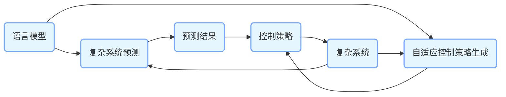

# 语言模型在复杂系统预测与自适应控制策略生成中的应用

> 关键词：语言模型；复杂系统预测；自适应控制策略；生成式人工智能；智能决策

> 摘要：本文深入探讨了语言模型在复杂系统预测与自适应控制策略生成中的应用。首先介绍了相关背景知识，包括研究目的、预期读者和文档结构等。接着详细阐述了语言模型、复杂系统预测和自适应控制策略的核心概念及它们之间的联系，并给出了相应的文本示意图和 Mermaid 流程图。通过 Python 代码讲解了核心算法原理和具体操作步骤，同时给出了数学模型和公式，并举例说明。结合实际项目，进行了开发环境搭建、源代码实现与解读。分析了语言模型在多个实际应用场景中的应用情况，推荐了学习资源、开发工具框架和相关论文著作。最后总结了未来发展趋势与挑战，解答了常见问题，并提供了扩展阅读和参考资料，旨在为相关领域的研究和实践提供全面而深入的指导。

## 1. 背景介绍 
### 1.1 目的和范围
随着科技的飞速发展，复杂系统在各个领域的应用日益广泛，如电力系统、交通系统、工业生产系统等。这些复杂系统具有高度的不确定性、非线性和动态性，对其进行准确预测和有效控制成为了亟待解决的问题。语言模型作为近年来人工智能领域的研究热点，展现出了强大的语言理解和生成能力。本研究的目的在于探索如何将语言模型应用于复杂系统的预测和自适应控制策略的生成，以提高复杂系统的运行效率和稳定性。

本研究的范围涵盖了语言模型的基本原理、复杂系统预测的方法、自适应控制策略的生成机制，以及如何将语言模型与这些领域相结合。通过理论分析、算法设计、实验验证等方法，深入探讨语言模型在复杂系统预测与自适应控制策略生成中的有效性和可行性。

### 1.2 预期读者
本文的预期读者包括人工智能、控制科学与工程、系统工程等领域的研究人员和学者，他们可以从本文中获取语言模型在复杂系统应用方面的最新研究成果和方法。同时，对于从事实际工程应用的工程师和技术人员，如电力工程师、交通工程师、工业自动化工程师等，本文也提供了实用的技术指导和案例参考，帮助他们将语言模型应用到实际的复杂系统中。此外，对人工智能和复杂系统感兴趣的学生和爱好者也可以通过本文了解相关领域的基础知识和前沿动态。

### 1.3 文档结构概述
本文共分为十个部分。第一部分为背景介绍，阐述了研究的目的和范围、预期读者以及文档的结构概述，并对相关术语进行了定义和解释。第二部分介绍了语言模型、复杂系统预测和自适应控制策略的核心概念及其相互联系，给出了文本示意图和 Mermaid 流程图。第三部分通过 Python 代码详细讲解了核心算法原理和具体操作步骤。第四部分给出了数学模型和公式，并进行了详细讲解和举例说明。第五部分结合实际项目，介绍了开发环境搭建、源代码实现和代码解读。第六部分分析了语言模型在不同实际应用场景中的应用情况。第七部分推荐了学习资源、开发工具框架和相关论文著作。第八部分总结了未来发展趋势与挑战。第九部分为附录，解答了常见问题。第十部分提供了扩展阅读和参考资料。

### 1.4 术语表
#### 1.4.1 核心术语定义
- **语言模型**：是一种基于统计学和机器学习的模型，用于对自然语言文本进行建模和生成。它可以根据输入的文本预测下一个可能出现的单词或字符，从而实现语言的理解和生成。
- **复杂系统**：是指由大量相互作用的组件组成的系统，这些组件之间的关系复杂且具有不确定性、非线性和动态性。例如，生态系统、社会系统、电力系统等都属于复杂系统。
- **复杂系统预测**：是指对复杂系统的未来状态、行为或性能进行预测的过程。通过分析历史数据和系统的内在规律，建立预测模型，以预测复杂系统在未来某个时刻的状态。
- **自适应控制策略**：是指根据系统的实时状态和环境变化，自动调整控制参数和控制方法的控制策略。它可以使系统在不同的工况下都能保持良好的性能和稳定性。

#### 1.4.2 相关概念解释
- **生成式人工智能**：是指能够生成新的、有意义的内容的人工智能技术。语言模型是生成式人工智能的一种典型代表，它可以生成自然语言文本、图像、音乐等内容。
- **智能决策**：是指利用人工智能技术进行决策的过程。通过对大量数据的分析和学习，智能决策系统可以提供最优的决策方案，帮助决策者做出更加科学、合理的决策。

#### 1.4.3 缩略词列表
- **GPT**：Generative Pretrained Transformer，生成式预训练变换器，是一种广泛应用的语言模型架构。
- **RNN**：Recurrent Neural Network，循环神经网络，是一种用于处理序列数据的神经网络模型。
- **LSTM**：Long Short-Term Memory，长短期记忆网络，是 RNN 的一种改进模型，能够有效处理长序列数据。

## 2. 核心概念与联系 

### 2.1 核心概念原理
#### 2.1.1 语言模型
语言模型的核心原理是基于概率统计和机器学习方法，对自然语言文本的概率分布进行建模。给定一个文本序列 $x_1, x_2, \cdots, x_n$，语言模型的目标是计算该序列出现的概率 $P(x_1, x_2, \cdots, x_n)$。根据链式法则，该概率可以分解为：

$$P(x_1, x_2, \cdots, x_n) = \prod_{i=1}^{n} P(x_i | x_1, x_2, \cdots, x_{i-1})$$

早期的语言模型主要基于统计方法，如 $n$-gram 模型。$n$-gram 模型假设当前单词的出现只与前 $n-1$ 个单词有关，即：

$$P(x_i | x_1, x_2, \cdots, x_{i-1}) \approx P(x_i | x_{i-(n-1)}, \cdots, x_{i-1})$$

近年来，基于深度学习的语言模型取得了巨大的成功，如 GPT、BERT 等。这些模型通常采用神经网络架构，如 Transformer，通过大规模的无监督学习来学习语言的模式和规律。

#### 2.1.2 复杂系统预测
复杂系统预测的核心原理是通过分析系统的历史数据和内在规律，建立预测模型，以预测系统的未来状态。常见的预测方法包括时间序列分析、机器学习、深度学习等。

时间序列分析方法通过对系统的历史数据进行建模，如 ARIMA 模型、指数平滑模型等，来预测系统的未来值。机器学习方法则利用各种机器学习算法，如决策树、支持向量机、神经网络等，对系统的历史数据进行学习和训练，以建立预测模型。深度学习方法，特别是循环神经网络（RNN）及其变体，如 LSTM、GRU 等，由于其能够处理序列数据的特性，在复杂系统预测中得到了广泛的应用。

#### 2.1.3 自适应控制策略
自适应控制策略的核心原理是根据系统的实时状态和环境变化，自动调整控制参数和控制方法，以保证系统的性能和稳定性。自适应控制可以分为模型参考自适应控制、自校正控制等。

模型参考自适应控制的基本思想是设计一个参考模型，该模型描述了系统期望的性能。控制器根据系统的实际输出和参考模型的输出之间的误差，自动调整控制参数，使系统的输出尽可能接近参考模型的输出。自校正控制则是通过在线估计系统的参数，根据估计结果自动调整控制参数，以适应系统的变化。

### 2.2 核心概念架构的文本示意图
```plaintext
语言模型
|
|-- 基于统计方法（n-gram模型）
|-- 基于深度学习方法（Transformer架构）

复杂系统预测
|
|-- 时间序列分析方法（ARIMA模型、指数平滑模型）
|-- 机器学习方法（决策树、支持向量机、神经网络）
|-- 深度学习方法（RNN、LSTM、GRU）

自适应控制策略
|
|-- 模型参考自适应控制
|-- 自校正控制

语言模型与复杂系统预测和自适应控制策略的联系
|
|-- 语言模型为复杂系统预测提供文本信息处理能力
|-- 语言模型为自适应控制策略生成提供智能决策支持
```

### 2.3 Mermaid 流程图


该流程图展示了语言模型、复杂系统预测和自适应控制策略生成之间的关系。语言模型为复杂系统预测和自适应控制策略生成提供支持，复杂系统的反馈信息又用于更新预测模型和控制策略。

## 3. 核心算法原理 & 具体操作步骤 

### 3.1 语言模型在复杂系统预测中的应用算法原理
在复杂系统预测中，语言模型可以用于处理和分析与系统相关的文本信息，如系统的运行日志、专家经验等。以下是一个基于语言模型的复杂系统预测的算法原理：

#### 3.1.1 数据预处理
首先，收集与复杂系统相关的文本数据和数值数据。对文本数据进行清洗、分词、去除停用词等预处理操作，将其转换为适合语言模型处理的格式。对数值数据进行归一化、标准化等预处理操作，以提高模型的训练效果。

#### 3.1.2 特征提取
使用语言模型对预处理后的文本数据进行特征提取。可以将文本数据输入到预训练的语言模型中，如 GPT、BERT 等，获取文本的特征向量。同时，将数值数据与文本特征向量进行融合，形成综合特征。

#### 3.1.3 模型训练
使用融合后的综合特征作为输入，构建预测模型。可以选择合适的机器学习或深度学习算法，如神经网络、决策树等，对模型进行训练。在训练过程中，使用历史数据进行监督学习，调整模型的参数，以提高预测的准确性。

#### 3.1.4 预测
将待预测的文本数据和数值数据进行预处理和特征提取，输入到训练好的预测模型中，得到复杂系统的预测结果。

### 3.2 Python 代码实现
以下是一个简单的 Python 代码示例，演示了如何使用语言模型进行复杂系统预测：

```python
import torch
from transformers import AutoTokenizer, AutoModel
from sklearn.model_selection import train_test_split
from sklearn.linear_model import LinearRegression
import numpy as np

# 加载预训练的语言模型和分词器
tokenizer = AutoTokenizer.from_pretrained('bert-base-uncased')
model = AutoModel.from_pretrained('bert-base-uncased')

# 示例文本数据和数值数据
text_data = ["System running normally", "High load detected"]
numeric_data = np.array([[10, 20], [30, 40]])
labels = np.array([0, 1])

# 文本数据预处理和特征提取
text_features = []
for text in text_data:
    inputs = tokenizer(text, return_tensors='pt')
    outputs = model(**inputs)
    text_feature = outputs.last_hidden_state.mean(dim=1).detach().numpy()
    text_features.append(text_feature)
text_features = np.concatenate(text_features, axis=0)

# 特征融合
features = np.concatenate([text_features, numeric_data], axis=1)

# 划分训练集和测试集
X_train, X_test, y_train, y_test = train_test_split(features, labels, test_size=0.2, random_state=42)

# 构建预测模型并训练
model = LinearRegression()
model.fit(X_train, y_train)

# 预测
predictions = model.predict(X_test)
print("Predictions:", predictions)
```

### 3.3 语言模型在自适应控制策略生成中的应用算法原理
在自适应控制策略生成中，语言模型可以用于理解系统的状态描述和任务要求，生成合适的控制策略。以下是一个基于语言模型的自适应控制策略生成的算法原理：

#### 3.3.1 状态描述和任务输入
获取复杂系统的实时状态描述和任务要求，将其转换为文本形式。

#### 3.3.2 语言模型推理
将状态描述和任务要求输入到预训练的语言模型中，进行推理。语言模型根据输入的文本生成控制策略的文本描述。

#### 3.3.3 策略转换
将语言模型生成的控制策略文本描述转换为可执行的控制指令，应用到复杂系统中。

### 3.4 Python 代码实现
以下是一个简单的 Python 代码示例，演示了如何使用语言模型生成自适应控制策略：

```python
from transformers import AutoTokenizer, AutoModelForCausalLM

# 加载预训练的语言模型和分词器
tokenizer = AutoTokenizer.from_pretrained('gpt2')
model = AutoModelForCausalLM.from_pretrained('gpt2')

# 系统状态描述和任务要求
state_description = "The system is running at high load"
task_requirement = "Reduce the load to a safe level"
input_text = f"State: {state_description}, Task: {task_requirement}, Control strategy:"

# 语言模型推理
input_ids = tokenizer.encode(input_text, return_tensors='pt')
output = model.generate(input_ids, max_length=100, num_beams=5, no_repeat_ngram_size=2, early_stopping=True)
control_strategy = tokenizer.decode(output[0], skip_special_tokens=True)

print("Control strategy:", control_strategy)
```

## 4. 数学模型和公式 & 详细讲解 & 举例说明 

### 4.1 语言模型的数学模型和公式
#### 4.1.1 基于 $n$-gram 模型的语言模型
在 $n$-gram 模型中，给定一个文本序列 $x_1, x_2, \cdots, x_n$，其概率可以表示为：

$$P(x_1, x_2, \cdots, x_n) = \prod_{i=1}^{n} P(x_i | x_{i-(n-1)}, \cdots, x_{i-1})$$

其中，$P(x_i | x_{i-(n-1)}, \cdots, x_{i-1})$ 可以通过统计语料库中 $x_{i-(n-1)}, \cdots, x_{i-1}, x_i$ 出现的频率来估计：

$$P(x_i | x_{i-(n-1)}, \cdots, x_{i-1}) = \frac{C(x_{i-(n-1)}, \cdots, x_{i-1}, x_i)}{C(x_{i-(n-1)}, \cdots, x_{i-1})}$$

其中，$C(\cdot)$ 表示在语料库中出现的次数。

例如，对于一个 2-gram 模型（即 bigram 模型），假设语料库中有以下句子：“I love you”，“You love me”。计算 $P(love | I)$ 的值：

在语料库中，“I love” 出现了 1 次，“I” 出现了 1 次，因此：

$$P(love | I) = \frac{C(I, love)}{C(I)} = \frac{1}{1} = 1$$

#### 4.1.2 基于 Transformer 架构的语言模型
Transformer 架构的核心是多头注意力机制。多头注意力机制可以表示为：

$$\text{MultiHead}(Q, K, V) = \text{Concat}(\text{head}_1, \cdots, \text{head}_h)W^O$$

其中，$\text{head}_i = \text{Attention}(QW_i^Q, KW_i^K, VW_i^V)$，$\text{Attention}(Q, K, V) = \text{softmax}(\frac{QK^T}{\sqrt{d_k}})V$。

$Q$、$K$、$V$ 分别是查询矩阵、键矩阵和值矩阵，$W_i^Q$、$W_i^K$、$W_i^V$ 是可学习的权重矩阵，$d_k$ 是键向量的维度，$W^O$ 是输出权重矩阵。

### 4.2 复杂系统预测的数学模型和公式
#### 4.2.1 ARIMA 模型
ARIMA（Autoregressive Integrated Moving Average）模型是一种常用的时间序列预测模型，其一般形式可以表示为：

$$\phi(B)(1 - B)^d y_t = \theta(B)\epsilon_t$$

其中，$\phi(B) = 1 - \phi_1 B - \cdots - \phi_p B^p$ 是自回归多项式，$\theta(B) = 1 + \theta_1 B + \cdots + \theta_q B^q$ 是移动平均多项式，$B$ 是后移算子，$d$ 是差分阶数，$y_t$ 是时间序列值，$\epsilon_t$ 是白噪声序列。

例如，对于一个 ARIMA(1, 1, 1) 模型，其具体形式为：

$$(1 - \phi_1 B)(1 - B) y_t = (1 + \theta_1 B)\epsilon_t$$

#### 4.2.2 神经网络模型
在神经网络模型中，假设输入层有 $n$ 个神经元，隐藏层有 $m$ 个神经元，输出层有 $k$ 个神经元。输入向量为 $x = [x_1, x_2, \cdots, x_n]^T$，隐藏层的输出向量为 $h = [h_1, h_2, \cdots, h_m]^T$，输出向量为 $y = [y_1, y_2, \cdots, y_k]^T$。

隐藏层的输出可以表示为：

$$h_j = f(\sum_{i=1}^{n} w_{ji} x_i + b_j)$$

其中，$w_{ji}$ 是输入层第 $i$ 个神经元到隐藏层第 $j$ 个神经元的权重，$b_j$ 是隐藏层第 $j$ 个神经元的偏置，$f(\cdot)$ 是激活函数，如 sigmoid 函数、ReLU 函数等。

输出层的输出可以表示为：

$$y_l = f(\sum_{j=1}^{m} v_{lj} h_j + c_l)$$

其中，$v_{lj}$ 是隐藏层第 $j$ 个神经元到输出层第 $l$ 个神经元的权重，$c_l$ 是输出层第 $l$ 个神经元的偏置。

### 4.3 自适应控制策略的数学模型和公式
#### 4.3.1 模型参考自适应控制
在模型参考自适应控制中，参考模型的输出 $y_m(t)$ 可以表示为：

$$y_m(t) = G_m(s) r(t)$$

其中，$G_m(s)$ 是参考模型的传递函数，$r(t)$ 是参考输入信号。

实际系统的输出 $y(t)$ 与参考模型的输出 $y_m(t)$ 之间的误差 $e(t)$ 为：

$$e(t) = y_m(t) - y(t)$$

控制器根据误差 $e(t)$ 调整控制参数，使误差逐渐减小。例如，对于一个简单的自适应控制器，控制输入 $u(t)$ 可以表示为：

$$u(t) = K(t) r(t)$$

其中，$K(t)$ 是自适应增益，其更新规则可以根据误差 $e(t)$ 进行设计，如：

$$\dot{K}(t) = \gamma e(t) r(t)$$

其中，$\gamma$ 是自适应增益调整参数。

#### 4.3.2 自校正控制
在自校正控制中，系统的参数 $\theta$ 是未知的，需要在线估计。假设系统的输出 $y(t)$ 可以表示为：

$$y(t) = \varphi^T(t) \theta + \epsilon(t)$$

其中，$\varphi(t)$ 是回归向量，$\epsilon(t)$ 是噪声。

使用递推最小二乘法（RLS）来估计系统的参数 $\theta$，其更新公式为：

$$\hat{\theta}(t) = \hat{\theta}(t - 1) + K(t)[y(t) - \varphi^T(t) \hat{\theta}(t - 1)]$$

其中，$\hat{\theta}(t)$ 是参数 $\theta$ 的估计值，$K(t)$ 是增益矩阵，其计算公式为：

$$K(t) = \frac{P(t - 1) \varphi(t)}{1 + \varphi^T(t) P(t - 1) \varphi(t)}$$

$$P(t) = [I - K(t) \varphi^T(t)] P(t - 1)$$

其中，$P(t)$ 是协方差矩阵，$I$ 是单位矩阵。

## 5. 项目实战：代码实际案例和详细解释说明 

### 5.1  开发环境搭建
#### 5.1.1 操作系统
建议使用 Linux 或 macOS 操作系统，因为这些操作系统对深度学习框架的支持更好。如果使用 Windows 操作系统，也可以进行开发，但可能会遇到一些兼容性问题。

#### 5.1.2 Python 环境
安装 Python 3.7 或更高版本。可以使用 Anaconda 来管理 Python 环境，它可以方便地创建和管理虚拟环境。

#### 5.1.3 深度学习框架
安装 PyTorch 和 Transformers 库。可以使用以下命令进行安装：

```bash
pip install torch
pip install transformers
```

#### 5.1.4 其他依赖库
安装 numpy、scikit-learn 等常用的 Python 库，用于数据处理和机器学习。可以使用以下命令进行安装：

```bash
pip install numpy scikit-learn
```

### 5.2  源代码详细实现和代码解读
#### 5.2.1 复杂系统预测代码实现
```python
import torch
from transformers import AutoTokenizer, AutoModel
from sklearn.model_selection import train_test_split
from sklearn.linear_model import LinearRegression
import numpy as np

# 加载预训练的语言模型和分词器
tokenizer = AutoTokenizer.from_pretrained('bert-base-uncased')
model = AutoModel.from_pretrained('bert-base-uncased')

# 示例文本数据和数值数据
text_data = ["System running normally", "High load detected"]
numeric_data = np.array([[10, 20], [30, 40]])
labels = np.array([0, 1])

# 文本数据预处理和特征提取
text_features = []
for text in text_data:
    inputs = tokenizer(text, return_tensors='pt')
    outputs = model(**inputs)
    text_feature = outputs.last_hidden_state.mean(dim=1).detach().numpy()
    text_features.append(text_feature)
text_features = np.concatenate(text_features, axis=0)

# 特征融合
features = np.concatenate([text_features, numeric_data], axis=1)

# 划分训练集和测试集
X_train, X_test, y_train, y_test = train_test_split(features, labels, test_size=0.2, random_state=42)

# 构建预测模型并训练
model = LinearRegression()
model.fit(X_train, y_train)

# 预测
predictions = model.predict(X_test)
print("Predictions:", predictions)
```

#### 5.2.2 代码解读
- **加载预训练的语言模型和分词器**：使用 `AutoTokenizer` 和 `AutoModel` 从 Hugging Face 的模型库中加载预训练的 BERT 模型和分词器。
- **数据准备**：定义示例文本数据、数值数据和标签。
- **文本数据预处理和特征提取**：使用分词器将文本数据转换为输入张量，输入到 BERT 模型中，获取文本的特征向量。
- **特征融合**：将文本特征向量和数值数据进行融合，形成综合特征。
- **划分训练集和测试集**：使用 `train_test_split` 函数将数据集划分为训练集和测试集。
- **构建预测模型并训练**：使用线性回归模型作为预测模型，对训练集进行训练。
- **预测**：使用训练好的模型对测试集进行预测，输出预测结果。

#### 5.2.3 自适应控制策略生成代码实现
```python
from transformers import AutoTokenizer, AutoModelForCausalLM

# 加载预训练的语言模型和分词器
tokenizer = AutoTokenizer.from_pretrained('gpt2')
model = AutoModelForCausalLM.from_pretrained('gpt2')

# 系统状态描述和任务要求
state_description = "The system is running at high load"
task_requirement = "Reduce the load to a safe level"
input_text = f"State: {state_description}, Task: {task_requirement}, Control strategy:"

# 语言模型推理
input_ids = tokenizer.encode(input_text, return_tensors='pt')
output = model.generate(input_ids, max_length=100, num_beams=5, no_repeat_ngram_size=2, early_stopping=True)
control_strategy = tokenizer.decode(output[0], skip_special_tokens=True)

print("Control strategy:", control_strategy)
```

#### 5.2.4 代码解读
- **加载预训练的语言模型和分词器**：使用 `AutoTokenizer` 和 `AutoModelForCausalLM` 从 Hugging Face 的模型库中加载预训练的 GPT-2 模型和分词器。
- **输入准备**：定义系统状态描述和任务要求，将其组合成输入文本。
- **语言模型推理**：使用分词器将输入文本编码为输入张量，输入到 GPT-2 模型中，进行推理。使用 `generate` 方法生成控制策略的文本描述。
- **解码输出**：使用分词器将生成的输出张量解码为文本，去除特殊标记，输出控制策略。

### 5.3  代码解读与分析
#### 5.3.1 复杂系统预测代码分析
在复杂系统预测代码中，使用了预训练的 BERT 模型进行文本特征提取，将文本数据转换为数值特征。然后将文本特征和数值数据进行融合，使用线性回归模型进行预测。这种方法可以充分利用文本信息和数值信息，提高预测的准确性。

然而，该代码也存在一些局限性。例如，使用线性回归模型可能无法处理复杂的非线性关系。可以考虑使用更复杂的机器学习或深度学习模型，如神经网络、决策树等。

#### 5.3.2 自适应控制策略生成代码分析
在自适应控制策略生成代码中，使用了预训练的 GPT-2 模型进行控制策略的生成。该模型具有强大的语言生成能力，可以根据输入的系统状态描述和任务要求生成合理的控制策略。

但是，该代码也存在一些问题。例如，生成的控制策略可能不够准确或具体，需要进一步的后处理和验证。可以考虑结合领域知识和规则，对生成的控制策略进行优化和调整。

## 6. 实际应用场景 
### 6.1 电力系统
在电力系统中，语言模型可以用于预测电力负荷和故障诊断。通过分析电力系统的运行日志、气象数据、用户用电信息等文本和数值数据，使用语言模型进行特征提取和预测模型训练，可以提高电力负荷预测的准确性。同时，在故障诊断方面，语言模型可以对故障描述文本进行分析，快速定位故障原因和位置，生成相应的维修策略。

### 6.2 交通系统
在交通系统中，语言模型可以用于交通流量预测和交通控制策略生成。通过分析交通监控数据、路况信息、天气预报等文本和数值数据，使用语言模型进行交通流量预测。根据预测结果，生成自适应的交通控制策略，如调整信号灯时长、引导车辆分流等，以提高交通系统的运行效率和安全性。

### 6.3 工业生产系统
在工业生产系统中，语言模型可以用于设备故障预测和生产调度优化。通过分析设备的运行数据、维修记录、操作手册等文本和数值数据，使用语言模型进行设备故障预测。根据预测结果，提前安排维修计划，减少设备停机时间。同时，在生产调度方面，语言模型可以根据订单需求、设备状态、原材料供应等信息，生成最优的生产调度策略，提高生产效率和质量。

### 6.4 医疗系统
在医疗系统中，语言模型可以用于疾病诊断和治疗方案推荐。通过分析患者的病历、症状描述、检查报告等文本和数值数据，使用语言模型进行疾病诊断。根据诊断结果，生成个性化的治疗方案推荐，为医生提供决策支持。

## 7. 工具和资源推荐
### 7.1 学习资源推荐
#### 7.1.1 书籍推荐
- 《深度学习》（Deep Learning）：由 Ian Goodfellow、Yoshua Bengio 和 Aaron Courville 所著，是深度学习领域的经典教材，涵盖了深度学习的基本原理、算法和应用。
- 《自然语言处理入门》（Natural Language Processing with Python）：由 Steven Bird、Ewan Klein 和 Edward Loper 所著，介绍了使用 Python 进行自然语言处理的基本方法和技术。
- 《复杂系统理论基础》（Fundamentals of Complex Systems）：由 George C. Bitbol 和 Christian George 所著，详细介绍了复杂系统的基本概念、理论和方法。

#### 7.1.2 在线课程
- Coursera 上的 “深度学习专项课程”（Deep Learning Specialization）：由 Andrew Ng 教授授课，包括神经网络、卷积神经网络、循环神经网络等深度学习的核心内容。
- edX 上的 “自然语言处理”（Natural Language Processing）：由 Columbia University 提供，介绍了自然语言处理的基本技术和应用。
- Udemy 上的 “复杂系统建模与仿真”（Complex Systems Modeling and Simulation）：介绍了复杂系统的建模和仿真方法，以及如何使用 Python 进行实现。

#### 7.1.3 技术博客和网站
- Hugging Face Blog：提供了关于自然语言处理和语言模型的最新研究成果和技术应用。
- Towards Data Science：是一个数据科学和机器学习领域的博客平台，有很多关于复杂系统预测和语言模型应用的文章。
- ArXiv：是一个预印本数据库，包含了大量关于人工智能、复杂系统等领域的最新研究论文。

### 7.2 开发工具框架推荐
#### 7.2.1 IDE和编辑器
- PyCharm：是一款专门为 Python 开发设计的集成开发环境，具有强大的代码编辑、调试和项目管理功能。
- Jupyter Notebook：是一个交互式的开发环境，适合进行数据分析、模型训练和实验验证。
- Visual Studio Code：是一款轻量级的代码编辑器，支持多种编程语言和插件扩展，可用于 Python 开发。

#### 7.2.2 调试和性能分析工具
- TensorBoard：是 TensorFlow 提供的一个可视化工具，可用于监控模型训练过程、查看模型性能指标等。
- Py-Spy：是一个用于 Python 程序性能分析的工具，可以实时查看 Python 程序的 CPU 使用率、函数调用时间等信息。
- PDB：是 Python 自带的调试器，可用于调试 Python 代码，查看变量值、执行流程等。

#### 7.2.3 相关框架和库
- PyTorch：是一个开源的深度学习框架，具有动态图计算、自动求导等优点，广泛应用于自然语言处理、计算机视觉等领域。
- Transformers：是 Hugging Face 开发的一个自然语言处理库，提供了丰富的预训练语言模型和工具，方便进行语言模型的使用和开发。
- Scikit-learn：是一个常用的机器学习库，提供了各种机器学习算法和工具，可用于数据处理、模型训练和评估。

### 7.3 相关论文著作推荐
#### 7.3.1 经典论文
- “Attention Is All You Need”：介绍了 Transformer 架构，是自然语言处理领域的经典论文，为后来的语言模型发展奠定了基础。
- “Long Short-Term Memory”：提出了长短期记忆网络（LSTM），解决了传统循环神经网络的梯度消失和梯度爆炸问题，在序列数据处理中得到了广泛应用。
- “A Mathematical Theory of Communication”：由 Claude Shannon 所著，奠定了信息论的基础，对复杂系统的分析和建模具有重要意义。

#### 7.3.2 最新研究成果
- “GPT-3: Language Models are Few-Shot Learners”：介绍了 GPT-3 语言模型，展示了其强大的语言生成和少样本学习能力。
- “BERT: Pre-training of Deep Bidirectional Transformers for Language Understanding”：提出了 BERT 模型，在自然语言处理的多个任务上取得了显著的性能提升。
- “Complex Systems: A Survey”：对复杂系统的研究现状和发展趋势进行了全面的综述。

#### 7.3.3 应用案例分析
- “Applying Language Models to Power System Load Forecasting”：介绍了如何将语言模型应用于电力系统负荷预测，提高预测的准确性。
- “Traffic Flow Prediction Using Deep Learning and Language Models”：探讨了使用深度学习和语言模型进行交通流量预测的方法和应用。
- “Industrial Fault Diagnosis Based on Language Models and Machine Learning”：研究了基于语言模型和机器学习的工业设备故障诊断方法。

## 8. 总结：未来发展趋势与挑战
### 8.1 未来发展趋势
#### 8.1.1 多模态融合
未来的语言模型将与图像、音频等多模态数据进行融合，以更全面地理解复杂系统的状态和信息。例如，在交通系统中，结合交通监控视频和文本描述进行交通流量预测和事故预警。

#### 8.1.2 强化学习与语言模型的结合
将强化学习与语言模型相结合，使语言模型能够在与环境的交互中不断学习和优化控制策略。例如，在机器人控制中，语言模型可以根据环境反馈生成更智能的控制指令。

#### 8.1.3 领域专用语言模型的发展
针对不同的领域，如医疗、金融、工业等，将开发领域专用的语言模型，以更好地满足领域的需求。这些模型将结合领域知识和数据进行训练，提高在特定领域的性能和应用效果。

#### 8.1.4 可解释性和可靠性的提升
随着语言模型在关键领域的应用越来越广泛，对其可解释性和可靠性的要求也越来越高。未来的研究将致力于提高语言模型的可解释性，使其决策过程更加透明和可理解，同时提高模型的可靠性和鲁棒性。

### 8.2 挑战
#### 8.2.1 数据质量和标注问题
复杂系统的数据通常具有多样性、不确定性和不完整性，数据质量难以保证。同时，对于一些任务，如复杂系统的故障诊断和控制策略生成，需要大量的标注数据，而标注数据的成本较高且难度较大。

#### 8.2.2 计算资源和效率问题
语言模型的训练和推理通常需要大量的计算资源，如 GPU 等。对于大规模的复杂系统应用，计算资源的需求将更加突出。同时，如何提高语言模型的计算效率，减少训练和推理时间，也是一个亟待解决的问题。

#### 8.2.3 模型的泛化能力和适应性问题
语言模型在不同的复杂系统和应用场景中可能表现出不同的性能。如何提高模型的泛化能力，使其能够在不同的环境和任务中都能保持良好的性能，以及如何使模型能够快速适应系统的变化，是当前面临的挑战之一。

#### 8.2.4 伦理和安全问题
随着语言模型在社会各个领域的广泛应用，伦理和安全问题也日益凸显。例如，语言模型可能生成虚假信息、偏见性内容等，对社会造成负面影响。同时，语言模型的应用也可能面临数据泄露、恶意攻击等安全风险。

## 9. 附录：常见问题与解答
### 9.1 语言模型在复杂系统预测中的准确性如何提高？
可以从以下几个方面提高语言模型在复杂系统预测中的准确性：
- **数据预处理**：对数据进行清洗、归一化、标准化等预处理操作，去除噪声和异常值，提高数据质量。
- **特征工程**：选择合适的特征提取方法，将文本数据和数值数据进行有效的融合，提取更有代表性的特征。
- **模型选择和调优**：选择合适的机器学习或深度学习模型，并对模型的参数进行调优，以提高模型的性能。
- **集成学习**：使用集成学习方法，如随机森林、梯度提升等，将多个模型的预测结果进行融合，提高预测的准确性。

### 9.2 如何评估语言模型生成的自适应控制策略的有效性？
可以从以下几个方面评估语言模型生成的自适应控制策略的有效性：
- **性能指标**：定义合适的性能指标，如系统的稳定性、效率、可靠性等，评估控制策略对系统性能的提升效果。
- **仿真实验**：使用系统的仿真模型，对生成的控制策略进行仿真实验，观察系统的响应和性能变化。
- **实际应用验证**：将生成的控制策略应用到实际系统中，进行实际验证，根据实际运行结果评估控制策略的有效性。

### 9.3 语言模型在复杂系统应用中需要注意哪些伦理和安全问题？
需要注意以下伦理和安全问题：
- **数据隐私**：保护复杂系统中的数据隐私，避免数据泄露和滥用。
- **偏见和公平性**：避免语言模型生成的结果存在偏见和不公平性，确保模型的决策过程是公正和客观的。
- **虚假信息和误导性内容**：防止语言模型生成虚假信息和误导性内容，对社会造成负面影响。
- **安全漏洞和攻击**：加强语言模型的安全防护，防止恶意攻击和利用，确保系统的安全性和可靠性。

### 9.4 如何选择适合复杂系统应用的语言模型？
可以从以下几个方面选择适合复杂系统应用的语言模型：
- **模型性能**：评估模型在相关任务上的性能，如预测准确性、生成质量等。
- **模型规模**：考虑模型的规模和计算资源需求，选择适合实际应用场景的模型。
- **领域适应性**：选择在相关领域有较好表现的模型，或者根据领域数据对模型进行微调。
- **可解释性**：对于一些需要解释决策过程的应用，选择具有较好可解释性的模型。

## 10. 扩展阅读 & 参考资料
### 10.1 扩展阅读
- 《人工智能：现代方法》（Artificial Intelligence: A Modern Approach）：全面介绍了人工智能的基本概念、算法和应用，是人工智能领域的经典教材。
- 《复杂》（Complexity: A Guided Tour）：由 Melanie Mitchell 所著，以通俗易懂的方式介绍了复杂系统的基本概念和研究方法。
- 《自然语言处理综论》（Speech and Language Processing）：由 Daniel Jurafsky 和 James H. Martin 所著，是自然语言处理领域的权威教材，涵盖了自然语言处理的各个方面。

### 10.2 参考资料
- Hugging Face 官方文档：https://huggingface.co/docs
- PyTorch 官方文档：https://pytorch.org/docs/stable/index.html
- Scikit-learn 官方文档：https://scikit-learn.org/stable/documentation.html

作者：AI天才研究院/AI Genius Institute & 禅与计算机程序设计艺术 /Zen And The Art of Computer Programming