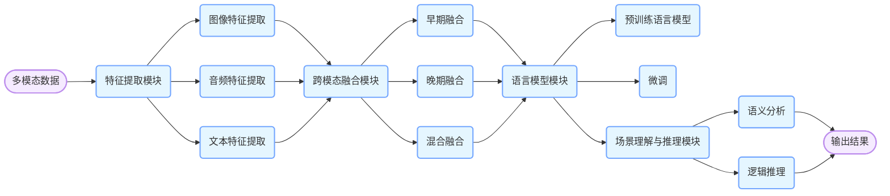

# 语言模型在多模态场景理解与推理中的进展

> 关键词：语言模型；多模态场景；理解与推理；进展；跨模态融合

> 摘要：本文聚焦于语言模型在多模态场景理解与推理中的进展。首先介绍了研究背景，包括目的、预期读者、文档结构和相关术语。接着阐述了核心概念及联系，给出了相应的文本示意图和Mermaid流程图。详细讲解了核心算法原理，并用Python代码进行说明，同时给出了数学模型和公式及具体例子。通过项目实战展示了代码案例和详细解释。探讨了实际应用场景，推荐了相关工具和资源，包括学习资源、开发工具框架和论文著作。最后总结了未来发展趋势与挑战，提供了常见问题解答和扩展阅读参考资料。旨在全面深入地剖析语言模型在多模态场景中的应用与发展，为相关研究和实践提供有价值的参考。

## 1. 背景介绍 
### 1.1 目的和范围
随着人工智能技术的飞速发展，单一模态的数据处理已经难以满足复杂场景的需求。多模态数据融合与处理成为了当前研究的热点之一。语言模型作为人工智能领域的重要组成部分，在自然语言处理方面取得了显著的成果。将语言模型应用于多模态场景的理解与推理，能够结合图像、音频、文本等多种模态的数据，实现更全面、深入的场景感知和智能决策。

本文的目的在于深入探讨语言模型在多模态场景理解与推理中的进展情况。范围涵盖了核心概念、算法原理、数学模型、项目实战、应用场景、工具资源等多个方面，旨在为读者提供一个全面且系统的视角，了解语言模型在多模态领域的最新发展动态和技术细节。

### 1.2 预期读者
本文的预期读者主要包括人工智能领域的研究人员、开发者、学生以及对多模态技术感兴趣的专业人士。对于研究人员，本文可以提供最新的研究进展和技术思路，启发新的研究方向；对于开发者，能够帮助他们掌握相关算法和技术，应用于实际项目开发；对于学生，有助于他们系统地学习语言模型在多模态场景中的应用知识；对于其他专业人士，可以作为了解该领域的科普性资料。

### 1.3 文档结构概述
本文将按照以下结构进行组织：
- 核心概念与联系：介绍语言模型、多模态场景理解与推理的核心概念，以及它们之间的联系，并通过文本示意图和Mermaid流程图进行直观展示。
- 核心算法原理 & 具体操作步骤：详细讲解语言模型在多模态场景中应用的核心算法原理，并用Python代码进行具体实现和解释。
- 数学模型和公式 & 详细讲解 & 举例说明：给出相关的数学模型和公式，进行详细解释，并通过具体例子加深理解。
- 项目实战：通过一个实际项目案例，展示代码的实现过程和详细解读，帮助读者掌握实际应用技巧。
- 实际应用场景：探讨语言模型在多模态场景理解与推理中的实际应用领域和案例。
- 工具和资源推荐：推荐相关的学习资源、开发工具框架和论文著作，方便读者进一步深入学习和研究。
- 总结：未来发展趋势与挑战：总结语言模型在多模态场景中的发展趋势，分析面临的挑战。
- 附录：常见问题与解答：提供常见问题的解答，帮助读者解决可能遇到的疑惑。
- 扩展阅读 & 参考资料：列出相关的扩展阅读资料和参考文献，供读者进一步查阅。

### 1.4 术语表
#### 1.4.1 核心术语定义
- **语言模型**：是一种基于概率统计的模型，用于预测一个词序列出现的概率。它可以根据前面的词来预测下一个词，在自然语言处理中有着广泛的应用，如机器翻译、文本生成等。
- **多模态**：指的是同时使用多种不同的信息模态，如文本、图像、音频、视频等。多模态数据能够提供更丰富、全面的信息，有助于更准确地理解和描述现实世界。
- **场景理解与推理**：场景理解是指对给定场景中的各种元素、关系和语义信息进行识别和理解；推理则是在理解的基础上，根据已有的知识和规则，对场景中的未知信息进行推断和预测。
- **跨模态融合**：将不同模态的数据进行整合和处理，使得模型能够综合利用各种模态的信息，提高对场景的理解和推理能力。

#### 1.4.2 相关概念解释
- **特征提取**：从原始的多模态数据中提取出具有代表性和区分性的特征，以便后续的处理和分析。不同模态的数据需要采用不同的特征提取方法，如文本可以使用词向量、图像可以使用卷积神经网络提取特征。
- **注意力机制**：是一种模拟人类注意力的机制，能够自动地关注数据中的重要部分，忽略不重要的部分。在多模态场景中，注意力机制可以帮助模型更好地融合不同模态的信息。
- **预训练模型**：在大规模数据集上进行无监督学习得到的模型。预训练模型可以学习到通用的语言和特征表示，然后在具体的任务上进行微调，能够提高模型的性能和训练效率。

#### 1.4.3 缩略词列表
- **NLP**：Natural Language Processing，自然语言处理
- **CNN**：Convolutional Neural Network，卷积神经网络
- **RNN**：Recurrent Neural Network，循环神经网络
- **Transformer**：一种基于注意力机制的神经网络架构
- **BERT**：Bidirectional Encoder Representations from Transformers，一种预训练的语言模型

## 2. 核心概念与联系 

### 核心概念原理
语言模型在多模态场景理解与推理中的核心原理是将语言信息与其他模态（如图像、音频等）的信息进行融合，以实现对复杂场景的全面理解和推理。

从语言模型的角度来看，它能够处理文本数据，理解语义信息，生成自然语言描述。在多模态场景中，语言模型可以作为一个中心模块，将其他模态的数据转换为文本表示，或者与其他模态的特征进行交互。

对于多模态数据，不同模态的数据具有不同的特点和信息。例如，图像数据包含丰富的视觉信息，音频数据包含声音特征。通过特征提取技术，可以将这些不同模态的数据转换为统一的特征表示，然后与语言模型进行融合。

跨模态融合是实现多模态场景理解与推理的关键步骤。它可以采用多种方法，如早期融合、晚期融合和混合融合。早期融合是在特征提取阶段就将不同模态的数据进行融合；晚期融合是在各个模态的特征分别处理后再进行融合；混合融合则结合了早期融合和晚期融合的优点。

### 架构的文本示意图
```plaintext
多模态数据（图像、音频、文本）
|
|-- 特征提取模块
|   |-- 图像特征提取（如CNN）
|   |-- 音频特征提取（如MFCC）
|   |-- 文本特征提取（如词向量）
|
|-- 跨模态融合模块
|   |-- 早期融合
|   |-- 晚期融合
|   |-- 混合融合
|
|-- 语言模型模块
|   |-- 预训练语言模型（如BERT）
|   |-- 微调
|
|-- 场景理解与推理模块
|   |-- 语义分析
|   |-- 逻辑推理
|
|-- 输出结果（场景描述、决策等）
```

### Mermaid流程图


## 3. 核心算法原理 & 具体操作步骤 

### 核心算法原理
在多模态场景中，常用的算法是基于Transformer架构的模型。Transformer架构通过注意力机制能够有效地捕捉序列数据中的长距离依赖关系，非常适合处理多模态数据。

以图像和文本的多模态处理为例，首先使用卷积神经网络（CNN）对图像进行特征提取，得到图像特征。同时，使用词向量将文本转换为向量表示。然后，将图像特征和文本特征进行融合，可以采用拼接、加权求和等方式。

接着，将融合后的特征输入到Transformer模型中。Transformer模型由多个编码器和解码器层组成，每个层包含多头注意力机制和前馈神经网络。多头注意力机制可以让模型同时关注不同位置的信息，提高模型的表达能力。

在训练过程中，通常采用预训练和微调的策略。预训练阶段，使用大规模的无监督数据对模型进行训练，让模型学习到通用的特征表示。微调阶段，在具体的多模态任务数据集上对模型进行微调，调整模型的参数以适应具体任务。

### 具体操作步骤及Python代码实现

#### 步骤1：安装必要的库
```python
import torch
import torchvision
from torchvision.models import resnet50
import torch.nn as nn
import torch.optim as optim
from transformers import BertTokenizer, BertModel
```

#### 步骤2：图像特征提取
```python
# 加载预训练的ResNet50模型
resnet = resnet50(pretrained=True)
# 去掉最后一层全连接层
resnet = nn.Sequential(*list(resnet.children())[:-1])
resnet.eval()

def extract_image_features(image):
    with torch.no_grad():
        features = resnet(image)
        features = features.view(features.size(0), -1)
    return features
```

#### 步骤3：文本特征提取
```python
# 加载BERT分词器和模型
tokenizer = BertTokenizer.from_pretrained('bert-base-uncased')
bert_model = BertModel.from_pretrained('bert-base-uncased')
bert_model.eval()

def extract_text_features(text):
    inputs = tokenizer(text, return_tensors='pt')
    with torch.no_grad():
        outputs = bert_model(**inputs)
        features = outputs.last_hidden_state.mean(dim=1)
    return features
```

#### 步骤4：跨模态融合
```python
class MultiModalFusion(nn.Module):
    def __init__(self, image_dim, text_dim, hidden_dim):
        super(MultiModalFusion, self).__init__()
        self.image_fc = nn.Linear(image_dim, hidden_dim)
        self.text_fc = nn.Linear(text_dim, hidden_dim)
        self.fc = nn.Linear(hidden_dim * 2, hidden_dim)

    def forward(self, image_features, text_features):
        image_features = self.image_fc(image_features)
        text_features = self.text_fc(text_features)
        combined_features = torch.cat((image_features, text_features), dim=1)
        combined_features = self.fc(combined_features)
        return combined_features
```

#### 步骤5：模型训练
```python
# 初始化模型
image_dim = 2048
text_dim = 768
hidden_dim = 512
fusion_model = MultiModalFusion(image_dim, text_dim, hidden_dim)

# 定义损失函数和优化器
criterion = nn.CrossEntropyLoss()
optimizer = optim.Adam(fusion_model.parameters(), lr=0.001)

# 模拟训练数据
num_samples = 10
image_data = torch.randn(num_samples, 3, 224, 224)
text_data = ["This is a sample text" for _ in range(num_samples)]
labels = torch.randint(0, 2, (num_samples,))

# 训练过程
for epoch in range(10):
    optimizer.zero_grad()
    image_features = extract_image_features(image_data)
    text_features = []
    for text in text_data:
        text_features.append(extract_text_features(text))
    text_features = torch.cat(text_features, dim=0)
    combined_features = fusion_model(image_features, text_features)
    outputs = nn.Linear(hidden_dim, 2)(combined_features)
    loss = criterion(outputs, labels)
    loss.backward()
    optimizer.step()
    print(f'Epoch {epoch+1}, Loss: {loss.item()}')
```

## 4. 数学模型和公式 & 详细讲解 & 举例说明 

### 数学模型和公式
#### 特征提取
- **图像特征提取**：假设输入的图像为 $I \in \mathbb{R}^{H \times W \times C}$，其中 $H$ 是图像的高度，$W$ 是图像的宽度，$C$ 是图像的通道数。使用卷积神经网络（CNN）进行特征提取，设 CNN 模型为 $f_{CNN}$，则提取的图像特征 $F_{I}$ 为：
$$F_{I} = f_{CNN}(I)$$
- **文本特征提取**：设输入的文本为 $T = [w_1, w_2, \cdots, w_n]$，其中 $w_i$ 是文本中的第 $i$ 个词。使用词向量将文本转换为向量表示，设词向量模型为 $f_{word}$，则文本的词向量表示为 $V_T = [f_{word}(w_1), f_{word}(w_2), \cdots, f_{word}(w_n)]$。再使用预训练的语言模型（如 BERT）对词向量进行处理，设 BERT 模型为 $f_{BERT}$，则提取的文本特征 $F_{T}$ 为：
$$F_{T} = f_{BERT}(V_T)$$

#### 跨模态融合
- **拼接融合**：将图像特征 $F_{I}$ 和文本特征 $F_{T}$ 进行拼接，得到融合后的特征 $F_{combined}$：
$$F_{combined} = [F_{I}; F_{T}]$$
- **加权求和融合**：给图像特征和文本特征分别赋予权重 $\alpha$ 和 $\beta$（$\alpha + \beta = 1$），则融合后的特征为：
$$F_{combined} = \alpha F_{I} + \beta F_{T}$$

#### Transformer模型
- **多头注意力机制**：设输入的特征序列为 $X = [x_1, x_2, \cdots, x_n]$，多头注意力机制将输入特征分别投影到查询（$Q$）、键（$K$）和值（$V$）三个空间，即：
$$Q = XW_Q$$
$$K = XW_K$$
$$V = XW_V$$
其中 $W_Q$、$W_K$ 和 $W_V$ 是可学习的投影矩阵。然后计算注意力分数：
$$Attention(Q, K, V) = \text{softmax}\left(\frac{QK^T}{\sqrt{d_k}}\right)V$$
其中 $d_k$ 是查询和键的维度。多头注意力机制将多个注意力头的结果拼接起来：
$$MultiHead(Q, K, V) = \text{Concat}(head_1, head_2, \cdots, head_h)W_O$$
其中 $head_i = Attention(QW_{Q_i}, KW_{K_i}, VW_{V_i})$，$W_{Q_i}$、$W_{K_i}$、$W_{V_i}$ 和 $W_O$ 是可学习的矩阵。

### 详细讲解
- **特征提取**：图像特征提取使用 CNN 可以有效地捕捉图像的局部特征和空间结构。CNN 通过卷积层、池化层等操作，将输入图像转换为具有代表性的特征向量。文本特征提取使用词向量和预训练的语言模型，词向量将每个词转换为低维向量表示，预训练的语言模型可以学习到文本的语义信息。
- **跨模态融合**：拼接融合简单直接，将不同模态的特征直接连接在一起，保留了所有的信息。加权求和融合则考虑了不同模态的重要性，通过调整权重可以灵活地分配不同模态的贡献。
- **Transformer模型**：多头注意力机制可以让模型同时关注不同位置的信息，提高模型的表达能力。通过多次投影和注意力计算，模型可以学习到不同的特征表示，从而更好地处理序列数据。

### 举例说明
假设我们有一张包含一只猫的图像和一段描述“这是一只可爱的猫”的文本。
- **图像特征提取**：使用 ResNet50 对图像进行特征提取，得到一个 2048 维的特征向量 $F_{I}$。
- **文本特征提取**：使用 BERT 对文本进行处理，得到一个 768 维的特征向量 $F_{T}$。
- **跨模态融合**：采用拼接融合的方式，将 $F_{I}$ 和 $F_{T}$ 拼接成一个 2816 维的特征向量 $F_{combined}$。
- **Transformer模型**：将 $F_{combined}$ 输入到 Transformer 模型中，模型通过多头注意力机制对特征进行处理，学习到图像和文本之间的关联信息，最终输出对场景的理解和推理结果。

## 5. 项目实战：代码实际案例和详细解释说明 

### 5.1  开发环境搭建
#### 硬件环境
- 一台配备 NVIDIA GPU 的计算机，建议使用 NVIDIA Tesla V100 或更高性能的 GPU，以加速模型的训练和推理过程。
- 至少 16GB 的内存，以确保能够处理大规模的数据集和模型参数。

#### 软件环境
- **操作系统**：Ubuntu 18.04 或更高版本。
- **Python**：Python 3.7 或更高版本。
- **深度学习框架**：PyTorch 1.8 或更高版本，用于构建和训练深度学习模型。
- **其他依赖库**：torchvision、transformers、numpy、pandas 等。

#### 安装步骤
1. 安装 CUDA 和 cuDNN：根据 NVIDIA GPU 的型号和操作系统版本，下载并安装相应的 CUDA 和 cuDNN 版本。
2. 创建虚拟环境：使用 virtualenv 或 conda 创建一个新的 Python 虚拟环境。
```bash
# 使用 virtualenv
virtualenv -p python3.7 multimodal_env
source multimodal_env/bin/activate

# 使用 conda
conda create -n multimodal_env python=3.7
conda activate multimodal_env
```
3. 安装 PyTorch 和相关库：
```bash
pip install torch torchvision torchaudio --extra-index-url https://download.pytorch.org/whl/cu113
pip install transformers numpy pandas
```

### 5.2  源代码详细实现和代码解读

#### 数据集准备
我们使用一个包含图像和文本描述的多模态数据集，例如 COCO 数据集。首先，需要下载并预处理数据集。
```python
import os
import json
from PIL import Image
import torch
from torch.utils.data import Dataset

class MultiModalDataset(Dataset):
    def __init__(self, image_dir, annotation_file, transform=None):
        self.image_dir = image_dir
        self.annotations = json.load(open(annotation_file))
        self.transform = transform

    def __len__(self):
        return len(self.annotations)

    def __getitem__(self, idx):
        annotation = self.annotations[idx]
        image_id = annotation['image_id']
        image_path = os.path.join(self.image_dir, f'{image_id}.jpg')
        image = Image.open(image_path).convert('RGB')
        text = annotation['caption']

        if self.transform:
            image = self.transform(image)

        return image, text
```

#### 模型定义
```python
import torch
import torch.nn as nn
from torchvision.models import resnet50
from transformers import BertModel

class MultiModalModel(nn.Module):
    def __init__(self, image_dim=2048, text_dim=768, hidden_dim=512):
        super(MultiModalModel, self).__init__()
        self.resnet = resnet50(pretrained=True)
        self.resnet = nn.Sequential(*list(self.resnet.children())[:-1])
        self.bert = BertModel.from_pretrained('bert-base-uncased')
        self.image_fc = nn.Linear(image_dim, hidden_dim)
        self.text_fc = nn.Linear(text_dim, hidden_dim)
        self.fc = nn.Linear(hidden_dim * 2, hidden_dim)
        self.output_fc = nn.Linear(hidden_dim, 1)

    def forward(self, images, texts):
        # 图像特征提取
        image_features = self.resnet(images)
        image_features = image_features.view(image_features.size(0), -1)
        image_features = self.image_fc(image_features)

        # 文本特征提取
        text_outputs = self.bert(**texts)
        text_features = text_outputs.last_hidden_state.mean(dim=1)
        text_features = self.text_fc(text_features)

        # 跨模态融合
        combined_features = torch.cat((image_features, text_features), dim=1)
        combined_features = self.fc(combined_features)

        # 输出
        outputs = self.output_fc(combined_features)
        return outputs
```

#### 训练代码
```python
import torch
import torch.nn as nn
import torch.optim as optim
from torchvision import transforms
from torch.utils.data import DataLoader
from dataset import MultiModalDataset
from model import MultiModalModel
from transformers import BertTokenizer

# 数据预处理
transform = transforms.Compose([
    transforms.Resize((224, 224)),
    transforms.ToTensor(),
    transforms.Normalize(mean=[0.485, 0.456, 0.406], std=[0.229, 0.224, 0.225])
])

# 加载数据集
image_dir = 'path/to/images'
annotation_file = 'path/to/annotations.json'
dataset = MultiModalDataset(image_dir, annotation_file, transform=transform)
dataloader = DataLoader(dataset, batch_size=32, shuffle=True)

# 初始化模型、损失函数和优化器
model = MultiModalModel()
criterion = nn.BCEWithLogitsLoss()
optimizer = optim.Adam(model.parameters(), lr=0.001)

# 训练过程
num_epochs = 10
device = torch.device('cuda' if torch.cuda.is_available() else 'cpu')
model.to(device)
tokenizer = BertTokenizer.from_pretrained('bert-base-uncased')

for epoch in range(num_epochs):
    running_loss = 0.0
    for images, texts in dataloader:
        images = images.to(device)
        inputs = tokenizer(texts, return_tensors='pt', padding=True, truncation=True).to(device)
        labels = torch.randint(0, 2, (images.size(0), 1)).float().to(device)

        optimizer.zero_grad()
        outputs = model(images, inputs)
        loss = criterion(outputs, labels)
        loss.backward()
        optimizer.step()

        running_loss += loss.item()

    print(f'Epoch {epoch+1}, Loss: {running_loss / len(dataloader)}')
```

### 5.3  代码解读与分析
#### 数据集准备
- `MultiModalDataset` 类继承自 `torch.utils.data.Dataset`，用于加载图像和文本数据。`__init__` 方法初始化数据集的图像目录和标注文件，`__len__` 方法返回数据集的长度，`__getitem__` 方法根据索引返回图像和文本数据。

#### 模型定义
- `MultiModalModel` 类继承自 `nn.Module`，包含图像特征提取模块（ResNet50）、文本特征提取模块（BERT）、跨模态融合模块和输出模块。`forward` 方法定义了模型的前向传播过程，首先分别提取图像和文本特征，然后进行跨模态融合，最后输出预测结果。

#### 训练代码
- 数据预处理使用 `transforms.Compose` 对图像进行缩放、转换为张量和归一化处理。
- 使用 `DataLoader` 加载数据集，设置批量大小和是否打乱数据。
- 初始化模型、损失函数和优化器，并将模型移动到 GPU 上。
- 在训练过程中，通过循环遍历数据集，将图像和文本数据输入到模型中，计算损失并进行反向传播和参数更新。

## 6. 实际应用场景 
### 智能安防
在智能安防领域，语言模型结合图像和视频数据可以实现更高级的场景理解和推理。例如，监控摄像头可以实时捕捉视频画面，同时配备语音传感器收集周围的声音信息。语言模型可以对视频中的人物行为、物体特征进行识别和描述，结合声音信息判断是否存在异常情况，如盗窃、暴力行为等。通过对多模态数据的分析和推理，系统可以及时发出警报，并提供详细的事件描述，帮助安保人员快速做出决策。

### 智能医疗
在医疗领域，多模态数据包括患者的病历文本、医学影像（如X光、CT、MRI等）和生命体征数据（如心率、血压等）。语言模型可以将这些多模态数据进行融合，辅助医生进行疾病诊断和治疗方案制定。例如，通过分析病历文本中的症状描述和医学影像中的病变特征，语言模型可以提供可能的疾病诊断建议和相关的治疗参考。此外，在远程医疗中，语言模型可以处理患者的语音描述和视频图像，为医生提供更全面的患者信息。

### 智能交通
智能交通系统中，多模态数据包括交通摄像头拍摄的道路图像、车辆传感器收集的行驶数据和交通广播的语音信息。语言模型可以对这些数据进行分析和推理，实现交通流量预测、交通事故预警和智能导航等功能。例如，通过分析道路图像中的车辆密度和行驶速度，结合交通广播中的路况信息，语言模型可以预测交通拥堵情况，并为驾驶员提供最佳的行驶路线。

### 智能家居
在智能家居场景中，语言模型可以结合语音指令、摄像头图像和传感器数据，实现更智能的家居控制和场景理解。例如，用户可以通过语音指令控制家电设备，同时摄像头可以识别房间内的人员和物体，传感器可以收集环境信息（如温度、湿度等）。语言模型可以根据这些多模态数据，自动调整家居设备的状态，提供个性化的服务。例如，当检测到用户回家时，自动打开灯光、调节温度和播放音乐。

## 7. 工具和资源推荐
### 7.1 学习资源推荐
#### 7.1.1 书籍推荐
- 《深度学习》（Deep Learning）：由 Ian Goodfellow、Yoshua Bengio 和 Aaron Courville 合著，是深度学习领域的经典教材，涵盖了神经网络、卷积神经网络、循环神经网络等基础知识，对于理解语言模型和多模态技术的原理有很大帮助。
- 《自然语言处理入门》（Natural Language Processing with Python）：介绍了使用 Python 进行自然语言处理的基本方法和技术，包括文本预处理、词向量、语言模型等内容，适合初学者入门。
- 《计算机视觉：算法与应用》（Computer Vision: Algorithms and Applications）：详细讲解了计算机视觉的基本算法和应用，如图像特征提取、目标检测、图像分割等，对于多模态场景中的图像数据处理有重要的参考价值。

#### 7.1.2 在线课程
- Coursera 上的“深度学习专项课程”（Deep Learning Specialization）：由 Andrew Ng 教授授课，包括深度学习基础、卷积神经网络、循环神经网络等多个模块，课程内容丰富，讲解详细，是学习深度学习的优质资源。
- edX 上的“自然语言处理基础”（Foundations of Natural Language Processing）：介绍了自然语言处理的基本概念和技术，包括语言模型、文本分类、机器翻译等，适合初学者学习。
- Udemy 上的“计算机视觉实战课程”（Computer Vision A-Z™: Hands-On Computer Vision with OpenCV & Deep Learning）：通过实际项目案例，讲解了计算机视觉的应用和实践技巧，包括图像识别、目标检测、人脸识别等内容。

#### 7.1.3 技术博客和网站
- arXiv.org：是一个开放的预印本服务器，提供了大量的学术论文，包括人工智能、机器学习、自然语言处理等领域的最新研究成果。可以通过搜索关键词获取相关的研究论文和技术报告。
- Medium：是一个技术博客平台，有许多人工智能领域的专家和开发者分享他们的经验和见解。可以关注一些知名的博主和主题标签，如“深度学习”、“自然语言处理”、“多模态技术”等。
- Towards Data Science：是一个专注于数据科学和人工智能的博客网站，提供了许多关于机器学习、深度学习、数据分析等方面的文章和教程，内容丰富且具有一定的深度。

### 7.2 开发工具框架推荐
#### 7.2.1 IDE和编辑器
- PyCharm：是一款专业的 Python 集成开发环境，具有代码编辑、调试、代码分析等功能，支持多种 Python 框架和库，适合开发深度学习和自然语言处理项目。
- Jupyter Notebook：是一个交互式的开发环境，支持 Python、R 等多种编程语言。可以通过浏览器进行代码编写、运行和可视化展示，非常适合进行数据探索和模型实验。
- Visual Studio Code：是一款轻量级的代码编辑器，具有丰富的插件和扩展功能，支持多种编程语言和开发框架。可以通过安装相关的插件，实现 Python 开发、代码调试、版本控制等功能。

#### 7.2.2 调试和性能分析工具
- PyTorch Profiler：是 PyTorch 自带的性能分析工具，可以帮助开发者分析模型的训练和推理过程中的性能瓶颈，如 GPU 使用率、内存占用等。通过使用 PyTorch Profiler，可以优化模型的性能，提高训练效率。
- TensorBoard：是 TensorFlow 提供的可视化工具，也可以与 PyTorch 结合使用。可以用于可视化模型的训练过程、损失曲线、准确率曲线等，帮助开发者监控模型的训练状态和性能。
- NVIDIA Nsight Systems：是 NVIDIA 提供的性能分析工具，专门用于分析 GPU 应用程序的性能。可以帮助开发者深入了解 GPU 的使用情况，优化代码以提高 GPU 利用率。

#### 7.2.3 相关框架和库
- PyTorch：是一个开源的深度学习框架，具有动态图机制，易于使用和调试。提供了丰富的神经网络层和优化算法，支持多种硬件平台，广泛应用于自然语言处理、计算机视觉等领域。
- TensorFlow：是另一个流行的深度学习框架，具有强大的分布式训练和部署能力。提供了高级的深度学习 API 和工具，适合大规模的工业应用和研究项目。
- Transformers：是 Hugging Face 开发的一个自然语言处理库，提供了许多预训练的语言模型，如 BERT、GPT-2 等。可以方便地进行模型的加载、微调和解码，加速自然语言处理任务的开发。
- TorchVision：是 PyTorch 的计算机视觉库，提供了许多预训练的图像模型和数据集，如图像分类、目标检测、图像分割等。可以帮助开发者快速搭建和训练计算机视觉模型。

### 7.3 相关论文著作推荐
#### 7.3.1 经典论文
- “Attention Is All You Need”：提出了 Transformer 架构，通过多头注意力机制实现了高效的序列建模，是自然语言处理和深度学习领域的经典论文。
- “BERT: Pre-training of Deep Bidirectional Transformers for Language Understanding”：介绍了 BERT 预训练语言模型，通过双向编码器表示学习到了强大的语言特征，在多个自然语言处理任务中取得了优异的成绩。
- “Faster R-CNN: Towards Real-Time Object Detection with Region Proposal Networks”：提出了 Faster R-CNN 目标检测算法，通过引入区域提议网络（RPN）提高了目标检测的速度和准确性，是计算机视觉领域的重要论文。

#### 7.3.2 最新研究成果
- 可以关注每年的顶级学术会议，如 NeurIPS（神经信息处理系统大会）、ICML（国际机器学习会议）、ACL（计算语言学协会年会）等，这些会议上会发布许多关于语言模型和多模态技术的最新研究成果。
- 也可以关注一些知名的学术期刊，如 Journal of Artificial Intelligence Research（JAIR）、Artificial Intelligence（AI）等，这些期刊会发表高质量的学术论文。

#### 7.3.3 应用案例分析
- 可以参考一些实际的应用案例和开源项目，如 OpenAI 的 GPT 系列模型在文本生成、对话系统等方面的应用，以及 Google 的 CLIP 模型在多模态理解和推理方面的应用。通过分析这些案例，可以了解语言模型在实际场景中的应用方法和技巧。

## 8. 总结：未来发展趋势与挑战
### 未来发展趋势
#### 更强大的预训练模型
随着计算资源的不断增加和算法的不断改进，未来将会出现更强大的预训练语言模型和多模态模型。这些模型将具有更高的性能和更强的泛化能力，能够在更多的任务和场景中取得优异的成绩。例如，可能会出现融合更多模态信息（如触觉、嗅觉等）的模型，实现更全面的场景理解和推理。

#### 跨领域融合
语言模型在多模态场景中的应用将越来越多地与其他领域进行融合，如医疗、金融、教育等。通过结合不同领域的知识和数据，语言模型可以为这些领域提供更智能的解决方案。例如，在医疗领域，语言模型可以与医学知识图谱相结合，实现更精准的疾病诊断和治疗建议。

#### 可解释性和可信赖性
随着语言模型在关键领域的应用越来越广泛，其可解释性和可信赖性将成为重要的研究方向。未来的模型不仅要具有高准确率，还要能够解释其决策过程和推理依据，以确保模型的可靠性和安全性。例如，在自动驾驶领域，语言模型需要能够解释其对交通场景的理解和决策，以便人类驾驶员能够信任和干预。

#### 端到端的多模态学习
目前的多模态学习方法通常是将不同模态的数据分别处理，然后进行融合。未来的发展趋势是实现端到端的多模态学习，即模型能够直接从原始的多模态数据中学习，而不需要进行复杂的特征提取和融合步骤。这样可以提高模型的效率和性能，同时减少人工干预。

### 挑战
#### 数据获取和标注
多模态数据的获取和标注是一个具有挑战性的问题。不同模态的数据来源不同，格式和质量也存在差异，需要进行大量的预处理和清洗工作。此外，多模态数据的标注需要专业的知识和技能，标注成本较高。如何有效地获取和标注大规模的多模态数据是未来需要解决的问题之一。

#### 计算资源需求
训练和推理大规模的多模态模型需要大量的计算资源，包括 GPU、内存和存储等。这对于大多数研究机构和企业来说是一个巨大的挑战。如何优化模型结构和算法，降低计算资源需求，提高模型的训练和推理效率是未来的研究重点。

#### 跨模态语义理解
不同模态的数据具有不同的语义表示，如何实现跨模态的语义理解是一个关键问题。例如，图像中的物体和文本中的描述之间的语义关联需要进行深入的研究。目前的方法在处理复杂的跨模态语义关系时还存在一定的局限性，需要进一步探索和改进。

#### 模型的鲁棒性和泛化能力
多模态模型在实际应用中需要面对各种复杂的场景和噪声数据，其鲁棒性和泛化能力是一个重要的挑战。模型需要能够在不同的数据集和任务上保持良好的性能，同时对噪声和异常数据具有较强的抵抗能力。如何提高模型的鲁棒性和泛化能力是未来需要解决的问题之一。

## 9. 附录：常见问题与解答
### 问题1：如何选择合适的特征提取方法？
解答：选择合适的特征提取方法需要考虑数据的模态和特点。对于图像数据，可以使用卷积神经网络（CNN），如 ResNet、VGG 等，这些模型在图像特征提取方面具有良好的性能。对于文本数据，可以使用词向量和预训练的语言模型，如 Word2Vec、BERT 等。对于音频数据，可以使用梅尔频率倒谱系数（MFCC）、深度神经网络等方法进行特征提取。此外，还可以根据具体的任务和数据集进行实验和比较，选择最适合的特征提取方法。

### 问题2：跨模态融合有哪些常用的方法？
解答：常用的跨模态融合方法包括早期融合、晚期融合和混合融合。早期融合是在特征提取阶段就将不同模态的数据进行融合，例如将图像特征和文本特征直接拼接在一起。晚期融合是在各个模态的特征分别处理后再进行融合，例如将图像分类结果和文本分类结果进行加权求和。混合融合则结合了早期融合和晚期融合的优点，在不同的层次上进行融合。

### 问题3：如何评估多模态模型的性能？
解答：评估多模态模型的性能可以使用多种指标，具体取决于任务的类型。对于分类任务，可以使用准确率、召回率、F1 值等指标。对于回归任务，可以使用均方误差（MSE）、平均绝对误差（MAE）等指标。此外，还可以使用一些专门的多模态评估指标，如跨模态相似度、跨模态检索准确率等。在评估时，需要使用独立的测试数据集，以确保评估结果的可靠性。

### 问题4：多模态模型的训练时间较长，如何优化训练效率？
解答：可以从以下几个方面优化多模态模型的训练效率：
- **使用预训练模型**：预训练模型可以学习到通用的特征表示，在具体任务上进行微调可以减少训练时间。
- **优化模型结构**：选择合适的模型结构，减少模型的参数数量，提高训练效率。
- **使用分布式训练**：利用多个 GPU 或多个计算节点进行分布式训练，加速模型的训练过程。
- **数据增强**：通过数据增强技术增加训练数据的多样性，提高模型的泛化能力，同时减少过拟合的风险。

### 问题5：多模态模型在实际应用中可能会遇到哪些问题？
解答：多模态模型在实际应用中可能会遇到以下问题：
- **数据质量问题**：不同模态的数据质量可能存在差异，如图像模糊、音频噪声等，会影响模型的性能。
- **计算资源限制**：训练和推理大规模的多模态模型需要大量的计算资源，可能会受到硬件设备的限制。
- **跨模态语义理解问题**：不同模态的数据具有不同的语义表示，如何实现跨模态的语义理解是一个挑战。
- **模型的可解释性问题**：多模态模型通常比较复杂，难以解释其决策过程和推理依据，在一些关键领域的应用可能会受到限制。

## 10. 扩展阅读 & 参考资料
### 扩展阅读
- 《人工智能：现代方法》（Artificial Intelligence: A Modern Approach）：全面介绍了人工智能的基本概念、算法和应用，是人工智能领域的经典教材。
- 《神经网络与深度学习》（Neural Networks and Deep Learning）：深入讲解了神经网络和深度学习的原理和算法，对于理解语言模型和多模态技术的基础有很大帮助。
- 《多模态机器学习：基础与应用》（Multimodal Machine Learning: Foundations and Applications）：专门介绍了多模态机器学习的理论和方法，包括多模态数据处理、跨模态融合、多模态模型评估等内容。

### 参考资料
- Goodfellow, I., Bengio, Y., & Courville, A. (2016). Deep Learning. MIT Press.
- Devlin, J., Chang, M. W., Lee, K., & Toutanova, K. (2018). BERT: Pre-training of Deep Bidirectional Transformers for Language Understanding. arXiv preprint arXiv:1810.04805.
- Ren, S., He, K., Girshick, R., & Sun, J. (2015). Faster R-CNN: Towards Real-Time Object Detection with Region Proposal Networks. Advances in neural information processing systems.
- Vaswani, A., Shazeer, N., Parmar, N., Uszkoreit, J., Jones, L., Gomez, A. N.,... & Polosukhin, I. (2017). Attention is all you need. Advances in neural information processing systems.

作者：AI天才研究院/AI Genius Institute & 禅与计算机程序设计艺术 /Zen And The Art of Computer Programming