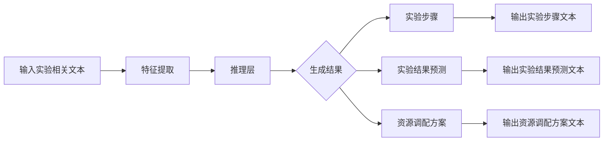

# 语言模型在多步骤实验设计中的能力

> 关键词：语言模型、多步骤实验设计、实验规划、推理能力、泛化能力

> 摘要：本文聚焦于语言模型在多步骤实验设计中的能力。随着人工智能技术的飞速发展，语言模型展现出了强大的文本处理和推理能力，这使其在实验设计领域的应用潜力逐渐凸显。多步骤实验设计涉及复杂的逻辑规划、资源调配以及对实验结果的预期等多个方面。文章将深入探讨语言模型在多步骤实验设计中的核心概念、算法原理、数学模型，通过项目实战展示其具体应用，并分析其在不同场景下的实际应用价值。同时，还会推荐相关的学习资源、开发工具和研究成果，最后对语言模型在多步骤实验设计中的未来发展趋势与挑战进行总结。

## 1. 背景介绍 
### 1.1 目的和范围
本文章的主要目的是全面深入地研究语言模型在多步骤实验设计中的能力表现。多步骤实验设计广泛应用于科学研究、工程实践、医学实验等多个领域，语言模型能否有效地辅助甚至主导这一过程是当前的研究热点。我们的研究范围涵盖语言模型在多步骤实验设计中的各个环节，包括实验目标的理解、实验步骤的规划、实验资源的分配、实验结果的预测等，旨在为相关领域的研究者和实践者提供全面的理论和实践指导。

### 1.2 预期读者
本文预期读者包括但不限于人工智能领域的研究者、实验设计专业人员、相关专业的学生以及对语言模型和实验设计感兴趣的技术爱好者。希望通过本文的阐述，能为不同层次的读者提供有价值的信息和见解，帮助他们更好地理解和应用语言模型在多步骤实验设计中的能力。

### 1.3 文档结构概述
本文将按照以下结构进行阐述：首先介绍语言模型在多步骤实验设计中的背景知识，包括目的、预期读者和文档结构概述等；接着深入探讨核心概念与联系，通过文本示意图和 Mermaid 流程图展示其原理和架构；然后详细讲解核心算法原理和具体操作步骤，并结合 Python 源代码进行阐述；之后介绍数学模型和公式，并举例说明；再通过项目实战展示代码实际案例和详细解释说明；接着分析语言模型在多步骤实验设计中的实际应用场景；推荐相关的工具和资源；最后总结语言模型在多步骤实验设计中的未来发展趋势与挑战，并提供常见问题与解答以及扩展阅读和参考资料。

### 1.4 术语表
#### 1.4.1 核心术语定义
- **语言模型**：是一种基于概率统计或深度学习技术，对自然语言文本进行建模的模型，能够预测给定文本序列的下一个词或生成符合语法和语义的文本。
- **多步骤实验设计**：指包含多个相互关联的实验步骤，需要综合考虑实验目标、资源、时间等因素，以达到预期实验结果的过程。
- **推理能力**：语言模型根据已知信息，通过逻辑推理得出新结论的能力。
- **泛化能力**：语言模型能够将在训练数据中学习到的知识应用到未见过的实验设计任务中的能力。

#### 1.4.2 相关概念解释
- **实验规划**：在多步骤实验设计中，对实验的整体流程、步骤顺序、时间安排等进行规划的过程。
- **资源调配**：根据实验需求，合理分配实验所需的人力、物力、财力等资源的过程。
- **实验结果预期**：在实验开始前，根据实验设计和相关知识，对实验可能产生的结果进行预测的过程。

#### 1.4.3 缩略词列表
- **GPT**：Generative Pretrained Transformer，生成式预训练 Transformer。
- **BERT**：Bidirectional Encoder Representations from Transformers，基于 Transformer 的双向编码器表示。

## 2. 核心概念与联系 

### 核心概念原理
语言模型在多步骤实验设计中的核心原理在于其强大的语言理解和生成能力。语言模型通过大量的文本数据进行训练，学习到语言的语法、语义和语用等方面的知识。在多步骤实验设计中，语言模型可以理解实验相关的文本描述，包括实验目标、实验条件、实验材料等信息。基于这些信息，语言模型可以运用其推理能力，生成合理的实验步骤、预测实验结果，并进行资源调配等操作。

例如，对于一个化学实验设计任务，语言模型可以理解实验的目标是合成某种化合物，然后根据化学知识和实验经验，生成一系列的实验步骤，如准备实验材料、控制反应条件、进行分离和提纯等。同时，语言模型还可以根据实验步骤和实验条件，预测实验可能产生的结果，如产物的纯度、产量等。

### 架构的文本示意图
语言模型在多步骤实验设计中的架构可以分为以下几个部分：
1. **输入层**：接收实验相关的文本描述，包括实验目标、实验条件、实验材料等信息。
2. **特征提取层**：对输入的文本进行特征提取，将文本转换为向量表示，以便后续的处理。
3. **推理层**：基于提取的特征，运用语言模型的推理能力，生成实验步骤、预测实验结果、进行资源调配等操作。
4. **输出层**：将推理层生成的结果转换为自然语言文本，输出给用户。

### Mermaid 流程图


## 3. 核心算法原理 & 具体操作步骤 

### 核心算法原理
语言模型在多步骤实验设计中常用的算法是基于 Transformer 架构的深度学习算法。Transformer 架构通过自注意力机制（Self-Attention Mechanism）能够有效地捕捉文本中的长距离依赖关系，从而提高语言模型的语言理解和生成能力。

下面是一个简单的基于 PyTorch 实现的 Transformer 语言模型的代码示例：
```python
import torch
import torch.nn as nn
import torch.nn.functional as F

class TransformerModel(nn.Module):
    def __init__(self, ntoken, ninp, nhead, nhid, nlayers, dropout=0.5):
        super(TransformerModel, self).__init__()
        self.model_type = 'Transformer'
        self.src_mask = None
        self.pos_encoder = PositionalEncoding(ninp, dropout)
        encoder_layers = nn.TransformerEncoderLayer(ninp, nhead, nhid, dropout)
        self.transformer_encoder = nn.TransformerEncoder(encoder_layers, nlayers)
        self.encoder = nn.Embedding(ntoken, ninp)
        self.ninp = ninp
        self.decoder = nn.Linear(ninp, ntoken)

        self.init_weights()

    def _generate_square_subsequent_mask(self, sz):
        mask = (torch.triu(torch.ones(sz, sz)) == 1).transpose(0, 1)
        mask = mask.float().masked_fill(mask == 0, float('-inf')).masked_fill(mask == 1, float(0.0))
        return mask

    def init_weights(self):
        initrange = 0.1
        self.encoder.weight.data.uniform_(-initrange, initrange)
        self.decoder.bias.data.zero_()
        self.decoder.weight.data.uniform_(-initrange, initrange)

    def forward(self, src):
        if self.src_mask is None or self.src_mask.size(0) != len(src):
            device = src.device
            mask = self._generate_square_subsequent_mask(len(src)).to(device)
            self.src_mask = mask

        src = self.encoder(src) * math.sqrt(self.ninp)
        src = self.pos_encoder(src)
        output = self.transformer_encoder(src, self.src_mask)
        output = self.decoder(output)
        return output

class PositionalEncoding(nn.Module):
    def __init__(self, d_model, dropout=0.1, max_len=5000):
        super(PositionalEncoding, self).__init__()
        self.dropout = nn.Dropout(p=dropout)

        pe = torch.zeros(max_len, d_model)
        position = torch.arange(0, max_len, dtype=torch.float).unsqueeze(1)
        div_term = torch.exp(torch.arange(0, d_model, 2).float() * (-math.log(10000.0) / d_model))
        pe[:, 0::2] = torch.sin(position * div_term)
        pe[:, 1::2] = torch.cos(position * div_term)
        pe = pe.unsqueeze(0).transpose(0, 1)
        self.register_buffer('pe', pe)

    def forward(self, x):
        x = x + self.pe[:x.size(0), :]
        return self.dropout(x)
```

### 具体操作步骤
1. **数据预处理**：将实验相关的文本数据进行清洗、分词、编码等处理，将文本转换为模型可以处理的格式。
2. **模型训练**：使用预处理后的数据对语言模型进行训练，调整模型的参数，使其能够更好地理解和生成实验相关的文本。
3. **实验设计生成**：将实验目标、实验条件等信息输入到训练好的语言模型中，模型根据输入信息生成实验步骤、实验结果预测、资源调配方案等。
4. **结果评估**：对生成的实验设计结果进行评估，检查其合理性和可行性。如果结果不理想，可以调整模型的参数或重新进行训练。

## 4. 数学模型和公式 & 详细讲解 & 举例说明 

### 数学模型
语言模型的核心数学模型是基于概率统计的，其目标是计算给定文本序列的概率。对于一个长度为 $T$ 的文本序列 $w_1, w_2, \cdots, w_T$，语言模型的概率可以表示为：
$$P(w_1, w_2, \cdots, w_T) = \prod_{t=1}^{T} P(w_t | w_1, w_2, \cdots, w_{t-1})$$

其中，$P(w_t | w_1, w_2, \cdots, w_{t-1})$ 表示在给定前面 $t-1$ 个词的条件下，第 $t$ 个词出现的概率。

### 详细讲解
在实际应用中，由于计算 $P(w_t | w_1, w_2, \cdots, w_{t-1})$ 的复杂度较高，通常采用一些近似方法。例如，n-gram 模型假设第 $t$ 个词的出现只与前面 $n-1$ 个词有关，即：
$$P(w_t | w_1, w_2, \cdots, w_{t-1}) \approx P(w_t | w_{t-n+1}, w_{t-n+2}, \cdots, w_{t-1})$$

另外，基于深度学习的语言模型通过神经网络来学习文本的概率分布。例如，Transformer 模型通过自注意力机制来捕捉文本中的长距离依赖关系，从而提高语言模型的性能。

### 举例说明
假设我们有一个简单的文本序列 “I like to play football”，我们可以使用 2-gram 模型来计算其概率。首先，我们需要计算每个 2-gram 的概率，例如：
$$P(like | I) = \frac{count(I\ like)}{count(I)}$$
$$P(to | like) = \frac{count(like\ to)}{count(like)}$$
$$P(play | to) = \frac{count(to\ play)}{count(to)}$$
$$P(football | play) = \frac{count(play\ football)}{count(play)}$$

然后，根据 2-gram 模型的公式，文本序列 “I like to play football” 的概率可以表示为：
$$P(I\ like\ to\ play\ football) = P(like | I) \times P(to | like) \times P(play | to) \times P(football | play)$$

## 5. 项目实战：代码实际案例和详细解释说明 

### 5.1  开发环境搭建
- **操作系统**：推荐使用 Linux 或 macOS 系统，也可以使用 Windows 系统。
- **编程语言**：Python 3.7 及以上版本。
- **深度学习框架**：PyTorch 1.7 及以上版本。
- **其他依赖库**：`numpy`、`pandas`、`transformers` 等。

可以使用以下命令安装所需的依赖库：
```bash
pip install torch numpy pandas transformers
```

### 5.2  源代码详细实现和代码解读
以下是一个简单的使用 Hugging Face 的 Transformers 库实现的语言模型在多步骤实验设计中的代码示例：
```python
from transformers import AutoTokenizer, AutoModelForCausalLM

# 加载预训练的语言模型和分词器
tokenizer = AutoTokenizer.from_pretrained("gpt2")
model = AutoModelForCausalLM.from_pretrained("gpt2")

# 定义实验目标文本
experiment_goal = "设计一个简单的化学实验来制备氢气"

# 对实验目标文本进行编码
input_ids = tokenizer.encode(experiment_goal, return_tensors="pt")

# 生成实验步骤
output = model.generate(input_ids, max_length=200, num_beams=5, no_repeat_ngram_size=2, early_stopping=True)

# 解码生成的文本
experiment_steps = tokenizer.decode(output[0], skip_special_tokens=True)

print("实验步骤：", experiment_steps)
```

### 代码解读与分析
1. **加载预训练的语言模型和分词器**：使用 `AutoTokenizer.from_pretrained` 和 `AutoModelForCausalLM.from_pretrained` 函数加载预训练的 GPT-2 语言模型和分词器。
2. **定义实验目标文本**：将实验目标以文本的形式定义为 `experiment_goal`。
3. **对实验目标文本进行编码**：使用分词器将实验目标文本转换为模型可以处理的输入 ID。
4. **生成实验步骤**：使用模型的 `generate` 方法生成实验步骤，通过设置 `max_length`、`num_beams`、`no_repeat_ngram_size` 等参数来控制生成的文本长度和质量。
5. **解码生成的文本**：使用分词器将生成的输入 ID 解码为自然语言文本。
6. **输出实验步骤**：将生成的实验步骤打印输出。

## 6. 实际应用场景 
### 科学研究
在科学研究中，多步骤实验设计是非常常见的。语言模型可以帮助研究人员快速生成实验方案，提高实验设计的效率。例如，在生物学研究中，语言模型可以根据研究目标，生成细胞培养、基因编辑等实验步骤；在物理学研究中，语言模型可以生成实验装置的搭建、实验数据的采集等步骤。

### 工程实践
在工程实践中，语言模型可以应用于产品研发、工艺优化等多步骤实验设计中。例如，在软件开发中，语言模型可以根据软件需求，生成测试用例、调试步骤等；在机械制造中，语言模型可以生成零件加工、装配等实验步骤。

### 医学实验
在医学实验中，语言模型可以帮助医生和研究人员设计药物临床试验、疾病诊断实验等。例如，语言模型可以根据疾病的类型和患者的特征，生成药物剂量、治疗周期等实验方案；在疾病诊断实验中，语言模型可以生成样本采集、检测方法等步骤。

## 7. 工具和资源推荐
### 7.1 学习资源推荐
#### 7.1.1 书籍推荐
- 《深度学习》（Deep Learning）：由 Ian Goodfellow、Yoshua Bengio 和 Aaron Courville 合著，是深度学习领域的经典教材，涵盖了语言模型等多个方面的内容。
- 《自然语言处理入门》（Natural Language Processing in Action）：由 Hobson Lane、Cole Howard 和 Hannes Hapke 合著，介绍了自然语言处理的基本概念和技术，包括语言模型的应用。

#### 7.1.2 在线课程
- Coursera 上的 “Natural Language Processing Specialization”：由斯坦福大学的教授授课，系统地介绍了自然语言处理的各个方面，包括语言模型的原理和应用。
- edX 上的 “Deep Learning for Natural Language Processing”：由华盛顿大学的教授授课，深入探讨了深度学习在自然语言处理中的应用，包括语言模型的训练和优化。

#### 7.1.3 技术博客和网站
- Hugging Face Blog：提供了关于语言模型的最新研究成果和应用案例，以及 Transformers 库的使用教程。
- Towards Data Science：一个数据科学和人工智能领域的技术博客，有很多关于语言模型的技术文章和实践经验分享。

### 7.2 开发工具框架推荐
#### 7.2.1 IDE和编辑器
- PyCharm：一个功能强大的 Python 集成开发环境，提供了代码编辑、调试、版本控制等功能。
- Visual Studio Code：一个轻量级的代码编辑器，支持多种编程语言和插件，适合快速开发和调试。

#### 7.2.2 调试和性能分析工具
- PyTorch Profiler：PyTorch 自带的性能分析工具，可以帮助开发者分析模型的性能瓶颈，优化代码。
- TensorBoard：一个可视化工具，可以帮助开发者可视化模型的训练过程和性能指标。

#### 7.2.3 相关框架和库
- Hugging Face Transformers：一个强大的自然语言处理库，提供了多种预训练的语言模型和工具，方便开发者快速实现语言模型的应用。
- AllenNLP：一个深度学习框架，专注于自然语言处理任务，提供了丰富的工具和模型，帮助开发者进行自然语言处理的研究和开发。

### 7.3 相关论文著作推荐
#### 7.3.1 经典论文
- “Attention Is All You Need”：介绍了 Transformer 架构，是语言模型领域的经典论文。
- “BERT: Pre-training of Deep Bidirectional Transformers for Language Understanding”：提出了 BERT 模型，开创了预训练语言模型的新时代。

#### 7.3.2 最新研究成果
- 关注 ACL（Association for Computational Linguistics）、EMNLP（Conference on Empirical Methods in Natural Language Processing）等自然语言处理领域的顶级会议，获取最新的研究成果。

#### 7.3.3 应用案例分析
- 一些知名的科研机构和企业会发布语言模型在不同领域的应用案例，可以通过他们的官方网站或研究报告获取相关信息。

## 8. 总结：未来发展趋势与挑战
### 未来发展趋势
- **更强的推理能力**：未来的语言模型将不断提高其推理能力，能够更好地理解复杂的实验设计任务，生成更加合理和可行的实验方案。
- **多模态融合**：语言模型将与图像、音频等多模态数据进行融合，从而在多步骤实验设计中获取更多的信息，提高实验设计的准确性和效率。
- **个性化定制**：根据不同用户的需求和偏好，语言模型将提供个性化的实验设计方案，满足用户的特定需求。

### 挑战
- **知识的准确性和完整性**：语言模型的知识来源于训练数据，可能存在知识不准确或不完整的问题。在多步骤实验设计中，这可能导致实验方案的不合理或不可行。
- **伦理和法律问题**：语言模型生成的实验设计方案可能涉及伦理和法律问题，如实验的安全性、数据的隐私等。需要建立相应的伦理和法律规范，确保语言模型的应用符合道德和法律要求。
- **计算资源的需求**：训练和运行大规模的语言模型需要大量的计算资源，这对硬件设备和计算成本提出了很高的要求。需要不断优化算法和硬件技术，降低计算资源的需求。

## 9. 附录：常见问题与解答
### 问题 1：语言模型生成的实验设计方案一定可行吗？
答：不一定。语言模型生成的实验设计方案是基于其学习到的知识和模式，可能存在不合理或不可行的情况。在使用语言模型生成的实验设计方案时，需要专业人员进行评估和验证。

### 问题 2：如何提高语言模型在多步骤实验设计中的性能？
答：可以通过以下方法提高语言模型在多步骤实验设计中的性能：使用更多、更优质的训练数据；调整模型的参数和架构；结合领域知识进行微调等。

### 问题 3：语言模型在多步骤实验设计中可以替代人类专家吗？
答：不能。语言模型可以辅助人类专家进行多步骤实验设计，提高设计效率和准确性，但不能完全替代人类专家。人类专家具有丰富的领域知识和实践经验，能够对实验设计方案进行综合评估和决策。

## 10. 扩展阅读 & 参考资料
- Goodfellow, I., Bengio, Y., & Courville, A. (2016). Deep Learning. MIT Press.
- Lane, H., Howard, C., & Hapke, H. (2019). Natural Language Processing in Action. Manning Publications.
- Vaswani, A., Shazeer, N., Parmar, N., Uszkoreit, J., Jones, L., Gomez, A. N., ... & Polosukhin, I. (2017). Attention Is All You Need. Advances in Neural Information Processing Systems.
- Devlin, J., Chang, M. W., Lee, K., & Toutanova, K. (2018). BERT: Pre-training of Deep Bidirectional Transformers for Language Understanding. arXiv preprint arXiv:1810.04805.

作者：AI天才研究院/AI Genius Institute & 禅与计算机程序设计艺术 /Zen And The Art of Computer Programming