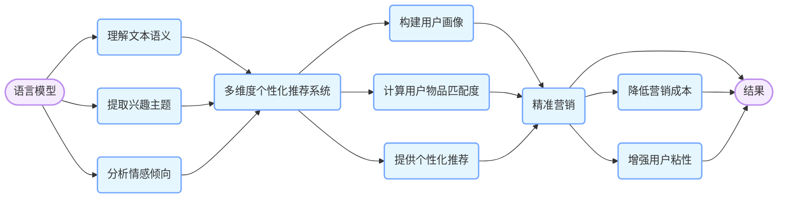

# 语言模型在多维度个性化推荐系统中的精准营销应用

> 关键词：语言模型、多维度个性化推荐系统、精准营销、用户画像、推荐算法

> 摘要：本文深入探讨了语言模型在多维度个性化推荐系统中的精准营销应用。首先介绍了相关背景，包括目的范围、预期读者等内容。接着阐述了核心概念及联系，通过文本示意图和 Mermaid 流程图进行说明。详细讲解了核心算法原理和具体操作步骤，结合 Python 代码进行展示。给出了数学模型和公式，并举例说明。通过项目实战，展示代码实际案例并进行详细解释。分析了实际应用场景，推荐了相关工具和资源，包括学习资源、开发工具框架和论文著作等。最后总结了未来发展趋势与挑战，提供常见问题解答和扩展阅读参考资料，旨在为相关领域的研究和实践提供全面而深入的指导。

## 1. 背景介绍 
### 1.1 目的和范围
在当今数字化的商业环境中，精准营销已经成为企业提升竞争力和实现业务增长的关键策略。多维度个性化推荐系统作为精准营销的重要手段，能够根据用户的不同特征和需求，为其提供个性化的产品或服务推荐。而语言模型的发展为多维度个性化推荐系统带来了新的机遇和挑战。

本文的目的在于深入研究语言模型在多维度个性化推荐系统中的精准营销应用，探讨如何利用语言模型更好地理解用户的意图、偏好和需求，从而提高推荐系统的准确性和有效性。具体范围包括语言模型的核心概念、相关算法原理、数学模型，以及在实际项目中的应用案例和常见问题解答等。

### 1.2 预期读者
本文的预期读者主要包括以下几类人群：
- **技术开发者**：对推荐系统、语言模型和精准营销技术感兴趣的程序员、软件工程师等，希望通过本文了解如何将语言模型应用到多维度个性化推荐系统中，实现精准营销功能。
- **市场营销人员**：希望借助技术手段提升营销效果的市场营销专业人士，通过本文了解语言模型在精准营销中的应用原理和实际案例，为制定营销策略提供参考。
- **研究人员**：从事计算机科学、信息管理、市场营销等相关领域研究的学者和研究人员，希望通过本文获取语言模型在多维度个性化推荐系统中应用的最新研究成果和发展趋势。

### 1.3 文档结构概述
本文将按照以下结构进行详细阐述：
- **核心概念与联系**：介绍语言模型、多维度个性化推荐系统和精准营销的核心概念，并通过文本示意图和 Mermaid 流程图展示它们之间的联系。
- **核心算法原理 & 具体操作步骤**：详细讲解语言模型在多维度个性化推荐系统中应用的核心算法原理，并给出具体的操作步骤，同时使用 Python 代码进行实现。
- **数学模型和公式 & 详细讲解 & 举例说明**：给出相关的数学模型和公式，并进行详细讲解，通过具体的例子说明其应用。
- **项目实战：代码实际案例和详细解释说明**：通过一个实际的项目案例，展示如何使用语言模型实现多维度个性化推荐系统的精准营销功能，包括开发环境搭建、源代码实现和代码解读。
- **实际应用场景**：分析语言模型在多维度个性化推荐系统中的实际应用场景，以及如何在不同场景中实现精准营销。
- **工具和资源推荐**：推荐相关的学习资源、开发工具框架和论文著作，帮助读者进一步深入学习和研究。
- **总结：未来发展趋势与挑战**：总结语言模型在多维度个性化推荐系统中精准营销应用的未来发展趋势，并分析面临的挑战。
- **附录：常见问题与解答**：对读者可能遇到的常见问题进行解答，提供技术支持和帮助。
- **扩展阅读 & 参考资料**：提供相关的扩展阅读资料和参考文献，方便读者进一步深入研究。

### 1.4 术语表
#### 1.4.1 核心术语定义
- **语言模型**：是一种对自然语言文本进行建模的数学模型，用于预测文本序列中下一个可能出现的单词或字符。常见的语言模型包括基于统计的语言模型和基于深度学习的语言模型，如循环神经网络（RNN）、长短时记忆网络（LSTM）、Transformer 等。
- **多维度个性化推荐系统**：是一种根据用户的多个维度特征（如年龄、性别、兴趣爱好、购买历史等），为用户提供个性化推荐的系统。通过综合考虑多个维度的信息，可以更准确地了解用户的需求和偏好，从而提供更符合用户期望的推荐结果。
- **精准营销**：是指企业通过精准定位目标客户群体，根据客户的个性化需求和偏好，制定针对性的营销策略，以提高营销效果和投资回报率的一种营销方式。
- **用户画像**：是指通过对用户的行为数据、社交数据、交易数据等多源数据进行分析和挖掘，构建出的用户特征模型。用户画像可以帮助企业更好地了解用户的需求、偏好和行为习惯，从而为精准营销提供支持。

#### 1.4.2 相关概念解释
- **深度学习**：是一种基于人工神经网络的机器学习方法，通过构建多层神经网络模型，自动从大量数据中学习特征和模式。深度学习在自然语言处理、计算机视觉等领域取得了显著的成果，为语言模型的发展提供了强大的技术支持。
- **自然语言处理（NLP）**：是指让计算机能够理解、处理和生成自然语言文本的技术。自然语言处理包括文本分类、情感分析、机器翻译、信息提取等多个任务，语言模型是自然语言处理中的重要基础技术。
- **推荐算法**：是指用于实现推荐系统的算法，常见的推荐算法包括基于内容的推荐算法、协同过滤算法、深度学习推荐算法等。不同的推荐算法适用于不同的应用场景和数据特点。

#### 1.4.3 缩略词列表
- **RNN**：Recurrent Neural Network，循环神经网络
- **LSTM**：Long Short-Term Memory，长短时记忆网络
- **GRU**：Gated Recurrent Unit，门控循环单元
- **Transformer**：一种基于注意力机制的深度学习模型
- **NLP**：Natural Language Processing，自然语言处理

## 2. 核心概念与联系 
### 核心概念原理
#### 语言模型
语言模型的核心原理是对自然语言文本的概率分布进行建模。给定一个文本序列 $w_1, w_2, \cdots, w_n$，语言模型的目标是计算该序列出现的概率 $P(w_1, w_2, \cdots, w_n)$。根据链式法则，该概率可以表示为：

$$P(w_1, w_2, \cdots, w_n) = \prod_{i=1}^{n} P(w_i | w_1, w_2, \cdots, w_{i-1})$$

早期的语言模型通常采用 $n$-gram 模型，它假设当前单词的出现只与前 $n - 1$ 个单词有关。例如，在二元模型（$n = 2$）中，$P(w_i | w_1, w_2, \cdots, w_{i-1}) \approx P(w_i | w_{i-1})$。

随着深度学习的发展，基于神经网络的语言模型逐渐成为主流。例如，循环神经网络（RNN）及其变体（如 LSTM 和 GRU）可以处理变长的文本序列，通过不断更新隐藏状态来捕捉文本中的上下文信息。Transformer 模型则引入了注意力机制，能够更有效地处理长序列文本，并在语言建模任务中取得了优异的成绩。

#### 多维度个性化推荐系统
多维度个性化推荐系统的核心原理是通过收集用户的多维度特征信息，构建用户画像，并根据用户画像为用户提供个性化的推荐。用户的多维度特征包括人口统计学特征（如年龄、性别、职业等）、行为特征（如浏览历史、购买历史、搜索记录等）、兴趣爱好特征（如喜欢的电影、音乐、书籍等）。

推荐系统通常采用协同过滤、基于内容的推荐、深度学习推荐等算法，根据用户的特征信息和物品的特征信息，计算用户与物品之间的相似度或匹配度，从而为用户推荐最相关的物品。

#### 精准营销
精准营销的核心原理是通过精准定位目标客户群体，深入了解客户的需求和偏好，制定针对性的营销策略，以提高营销效果和投资回报率。精准营销需要借助大数据分析、人工智能等技术手段，对客户数据进行挖掘和分析，实现对客户的精准画像和个性化推荐。

### 核心概念之间的联系
语言模型可以为多维度个性化推荐系统提供更丰富的语义信息，帮助系统更好地理解用户的需求和偏好。例如，通过对用户的搜索查询、评论等文本数据进行语言模型处理，可以提取用户的兴趣主题和情感倾向，从而更准确地构建用户画像。

多维度个性化推荐系统是精准营销的重要工具，通过为用户提供个性化的推荐，可以提高用户的满意度和忠诚度，从而促进销售和业务增长。而精准营销的需求又推动了多维度个性化推荐系统的不断发展和完善。

### 文本示意图
```plaintext
+------------------+        +------------------------+        +----------------+
|    语言模型      | -----> | 多维度个性化推荐系统  | -----> |    精准营销    |
+------------------+        +------------------------+        +----------------+
| - 理解文本语义    |        | - 构建用户画像        |        | - 提高营销效果 |
| - 提取兴趣主题    |        | - 计算用户物品匹配度  |        | - 降低营销成本 |
| - 分析情感倾向    |        | - 提供个性化推荐      |        | - 增强用户粘性 |
+------------------+        +------------------------+        +----------------+
```

### Mermaid 流程图


## 3. 核心算法原理 & 具体操作步骤 
### 核心算法原理
#### 基于注意力机制的语言模型在推荐中的应用
在多维度个性化推荐系统中，我们可以使用基于注意力机制的语言模型（如 Transformer）来处理用户的文本数据，提取用户的兴趣特征。Transformer 模型的核心是多头注意力机制，它可以让模型在处理每个位置的输入时，关注输入序列的不同部分。

多头注意力机制的计算公式如下：

$$\text{MultiHead}(Q, K, V) = \text{Concat}(\text{head}_1, \cdots, \text{head}_h)W^O$$

其中，$\text{head}_i = \text{Attention}(QW_i^Q, KW_i^K, VW_i^V)$，$\text{Attention}(Q, K, V) = \text{softmax}(\frac{QK^T}{\sqrt{d_k}})V$。

$Q$、$K$、$V$ 分别是查询矩阵、键矩阵和值矩阵，$W_i^Q$、$W_i^K$、$W_i^V$ 和 $W^O$ 是可学习的参数矩阵，$d_k$ 是键向量的维度。

#### 结合多维度特征的推荐算法
在得到用户的文本特征后，我们可以将其与用户的其他多维度特征（如年龄、性别、购买历史等）进行融合，然后使用深度学习模型（如多层感知机）进行推荐。具体步骤如下：
1. 将用户的文本特征和其他多维度特征进行拼接，得到用户的综合特征向量。
2. 将综合特征向量输入到多层感知机中，通过多个全连接层进行非线性变换。
3. 最后，输出用户对每个物品的预测得分，根据得分进行排序，为用户推荐得分较高的物品。

### 具体操作步骤
#### 数据预处理
1. 收集用户的文本数据（如搜索查询、评论等）和其他多维度特征数据（如年龄、性别、购买历史等）。
2. 对文本数据进行清洗和分词处理，去除停用词和标点符号。
3. 将文本数据转换为数字序列，例如使用词嵌入（如 Word2Vec、GloVe 或 BERT 嵌入）将每个单词转换为固定长度的向量。

#### 训练语言模型
1. 使用大规模的文本数据对基于注意力机制的语言模型（如 Transformer）进行预训练。
2. 在预训练的基础上，使用用户的文本数据对语言模型进行微调，使其更好地适应推荐任务。

#### 特征提取和融合
1. 使用微调后的语言模型对用户的文本数据进行处理，提取用户的文本特征。
2. 将用户的文本特征和其他多维度特征进行拼接，得到用户的综合特征向量。

#### 训练推荐模型
1. 将用户的综合特征向量和物品的特征向量作为输入，构建深度学习推荐模型（如多层感知机）。
2. 使用训练数据对推荐模型进行训练，优化模型的参数，使其能够准确地预测用户对物品的偏好。

#### 推荐生成
1. 对于新的用户，使用训练好的语言模型提取其文本特征，并与其他多维度特征进行融合，得到用户的综合特征向量。
2. 将用户的综合特征向量输入到训练好的推荐模型中，得到用户对每个物品的预测得分。
3. 根据预测得分对物品进行排序，为用户推荐得分较高的物品。

### Python 代码实现
```python
import torch
import torch.nn as nn
import torch.optim as optim
from torch.utils.data import Dataset, DataLoader

# 定义基于 Transformer 的语言模型
class TransformerLanguageModel(nn.Module):
    def __init__(self, vocab_size, embedding_dim, num_heads, num_layers):
        super(TransformerLanguageModel, self).__init__()
        self.embedding = nn.Embedding(vocab_size, embedding_dim)
        self.transformer_encoder = nn.TransformerEncoder(
            nn.TransformerEncoderLayer(embedding_dim, num_heads),
            num_layers
        )
        self.fc = nn.Linear(embedding_dim, vocab_size)

    def forward(self, x):
        x = self.embedding(x)
        x = self.transformer_encoder(x)
        x = self.fc(x)
        return x

# 定义推荐模型
class RecommendationModel(nn.Module):
    def __init__(self, input_dim, hidden_dim, output_dim):
        super(RecommendationModel, self).__init__()
        self.fc1 = nn.Linear(input_dim, hidden_dim)
        self.relu = nn.ReLU()
        self.fc2 = nn.Linear(hidden_dim, output_dim)

    def forward(self, x):
        x = self.fc1(x)
        x = self.relu(x)
        x = self.fc2(x)
        return x

# 定义数据集类
class RecommendationDataset(Dataset):
    def __init__(self, user_features, item_features, labels):
        self.user_features = user_features
        self.item_features = item_features
        self.labels = labels

    def __len__(self):
        return len(self.labels)

    def __getitem__(self, idx):
        user_feature = self.user_features[idx]
        item_feature = self.item_features[idx]
        label = self.labels[idx]
        return user_feature, item_feature, label

# 训练推荐模型
def train_recommendation_model(recommendation_model, train_loader, criterion, optimizer, num_epochs):
    for epoch in range(num_epochs):
        running_loss = 0.0
        for user_features, item_features, labels in train_loader:
            optimizer.zero_grad()
            inputs = torch.cat((user_features, item_features), dim=1)
            outputs = recommendation_model(inputs)
            loss = criterion(outputs, labels)
            loss.backward()
            optimizer.step()
            running_loss += loss.item()
        print(f'Epoch {epoch + 1}, Loss: {running_loss / len(train_loader)}')

# 示例数据
vocab_size = 1000
embedding_dim = 128
num_heads = 4
num_layers = 2
input_dim = 256
hidden_dim = 128
output_dim = 1
num_epochs = 10
batch_size = 32

# 初始化语言模型
language_model = TransformerLanguageModel(vocab_size, embedding_dim, num_heads, num_layers)

# 示例用户和物品特征数据
user_features = torch.randn(100, 128)
item_features = torch.randn(100, 128)
labels = torch.randint(0, 2, (100, 1)).float()

# 创建数据集和数据加载器
dataset = RecommendationDataset(user_features, item_features, labels)
train_loader = DataLoader(dataset, batch_size=batch_size, shuffle=True)

# 初始化推荐模型
recommendation_model = RecommendationModel(input_dim, hidden_dim, output_dim)
criterion = nn.MSELoss()
optimizer = optim.Adam(recommendation_model.parameters(), lr=0.001)

# 训练推荐模型
train_recommendation_model(recommendation_model, train_loader, criterion, optimizer, num_epochs)
```

## 4. 数学模型和公式 & 详细讲解 & 举例说明 
### 语言模型的数学模型和公式
#### 基于统计的语言模型
在 $n$-gram 模型中，给定一个文本序列 $w_1, w_2, \cdots, w_n$，其概率可以近似表示为：

$$P(w_1, w_2, \cdots, w_n) \approx \prod_{i=1}^{n} P(w_i | w_{i - n + 1}, \cdots, w_{i - 1})$$

其中，$P(w_i | w_{i - n + 1}, \cdots, w_{i - 1})$ 可以通过统计语料库中 $n$-gram 的出现频率来估计：

$$P(w_i | w_{i - n + 1}, \cdots, w_{i - 1}) = \frac{C(w_{i - n + 1}, \cdots, w_{i - 1}, w_i)}{C(w_{i - n + 1}, \cdots, w_{i - 1})}$$

其中，$C(w_{i - n + 1}, \cdots, w_{i - 1}, w_i)$ 表示 $n$-gram $(w_{i - n + 1}, \cdots, w_{i - 1}, w_i)$ 在语料库中出现的次数，$C(w_{i - n + 1}, \cdots, w_{i - 1})$ 表示 $(n - 1)$-gram $(w_{i - n + 1}, \cdots, w_{i - 1})$ 在语料库中出现的次数。

例如，在二元模型（$n = 2$）中，假设语料库中 “the dog” 出现了 100 次，“the” 出现了 500 次，则 $P(\text{dog} | \text{the}) = \frac{100}{500} = 0.2$。

#### 基于神经网络的语言模型
以循环神经网络（RNN）为例，RNN 的隐藏状态更新公式为：

$$h_t = \tanh(W_{hh}h_{t - 1} + W_{xh}x_t + b_h)$$

其中，$h_t$ 是时刻 $t$ 的隐藏状态，$x_t$ 是时刻 $t$ 的输入向量，$W_{hh}$ 和 $W_{xh}$ 是可学习的权重矩阵，$b_h$ 是偏置向量。

输出层的计算公式为：

$$y_t = W_{hy}h_t + b_y$$

其中，$y_t$ 是时刻 $t$ 的输出向量，$W_{hy}$ 是可学习的权重矩阵，$b_y$ 是偏置向量。

最后，通过 softmax 函数将输出向量转换为概率分布：

$$P(w_t | w_1, \cdots, w_{t - 1}) = \text{softmax}(y_t)$$

### 推荐算法的数学模型和公式
#### 协同过滤算法
在基于用户的协同过滤算法中，计算用户 $u$ 和用户 $v$ 之间的相似度通常使用皮尔逊相关系数：

$$\text{sim}(u, v) = \frac{\sum_{i \in I_{uv}} (r_{ui} - \bar{r}_u)(r_{vi} - \bar{r}_v)}{\sqrt{\sum_{i \in I_{uv}} (r_{ui} - \bar{r}_u)^2 \sum_{i \in I_{uv}} (r_{vi} - \bar{r}_v)^2}}$$

其中，$r_{ui}$ 是用户 $u$ 对物品 $i$ 的评分，$\bar{r}_u$ 是用户 $u$ 的平均评分，$I_{uv}$ 是用户 $u$ 和用户 $v$ 都评分过的物品集合。

对于用户 $u$ 未评分的物品 $j$，预测评分的计算公式为：

$$\hat{r}_{uj} = \bar{r}_u + \frac{\sum_{v \in N(u)} \text{sim}(u, v)(r_{vj} - \bar{r}_v)}{\sum_{v \in N(u)} |\text{sim}(u, v)|}$$

其中，$N(u)$ 是与用户 $u$ 最相似的 $k$ 个用户集合。

#### 深度学习推荐算法
在深度学习推荐模型中，假设用户的特征向量为 $u$，物品的特征向量为 $i$，模型的输出为预测得分 $\hat{y}$，则可以使用均方误差（MSE）作为损失函数：

$$L = \frac{1}{n} \sum_{i = 1}^{n} (y_i - \hat{y}_i)^2$$

其中，$y_i$ 是真实评分，$\hat{y}_i$ 是预测评分，$n$ 是样本数量。

模型通过反向传播算法更新参数，以最小化损失函数。

### 结合语言模型和推荐算法的数学模型
在结合语言模型和推荐算法的多维度个性化推荐系统中，我们可以将用户的文本特征 $t$、其他多维度特征 $f$ 和物品的特征 $i$ 进行融合，然后输入到深度学习模型中进行预测。

假设深度学习模型的输入向量为 $x = [t; f; i]$，其中 $[;]$ 表示向量拼接操作。模型的输出为预测得分 $\hat{y}$，则损失函数仍然可以使用均方误差：

$$L = \frac{1}{n} \sum_{i = 1}^{n} (y_i - \hat{y}_i)^2$$

通过不断调整模型的参数，使得损失函数最小化，从而提高推荐系统的准确性。

例如，假设用户的文本特征 $t$ 是一个长度为 128 的向量，其他多维度特征 $f$ 是一个长度为 64 的向量，物品的特征 $i$ 是一个长度为 128 的向量，则输入向量 $x$ 的长度为 $128 + 64 + 128 = 320$。将 $x$ 输入到多层感知机中，经过多个全连接层的非线性变换，最终输出预测得分 $\hat{y}$。

## 5. 项目实战：代码实际案例和详细解释说明 
### 5.1  开发环境搭建
#### 操作系统
建议使用 Linux 系统（如 Ubuntu 18.04 或更高版本）或 macOS 系统，因为这些系统对深度学习开发的支持较好。

#### 编程语言和版本
使用 Python 3.7 或更高版本，Python 是深度学习开发中最常用的编程语言，具有丰富的库和工具。

#### 深度学习框架
使用 PyTorch 作为深度学习框架，PyTorch 是一个开源的深度学习框架，具有动态图机制，易于使用和调试。可以通过以下命令安装 PyTorch：

```bash
pip install torch torchvision
```

#### 其他依赖库
还需要安装一些其他的依赖库，如 NumPy、Pandas、Scikit-learn 等，可以使用以下命令进行安装：

```bash
pip install numpy pandas scikit-learn
```

### 5.2  源代码详细实现和代码解读
#### 数据准备
首先，我们需要准备用户的文本数据、其他多维度特征数据和物品的特征数据。假设我们有一个 CSV 文件 `data.csv`，包含以下列：`user_id`、`text`、`age`、`gender`、`item_id`、`rating`。

```python
import pandas as pd

# 读取数据
data = pd.read_csv('data.csv')

# 提取用户文本数据
user_texts = data['text'].tolist()

# 提取用户其他多维度特征数据
user_features = data[['age', 'gender']].values

# 提取物品特征数据（这里假设物品特征是随机生成的）
item_features = np.random.randn(len(data), 128)

# 提取标签数据
labels = data['rating'].values
```

#### 文本预处理
对用户的文本数据进行预处理，包括分词、去除停用词、转换为数字序列等操作。

```python
import nltk
from nltk.corpus import stopwords
from nltk.tokenize import word_tokenize
from sklearn.feature_extraction.text import CountVectorizer

nltk.download('punkt')
nltk.download('stopwords')

# 分词和去除停用词
stop_words = set(stopwords.words('english'))
tokenized_texts = []
for text in user_texts:
    tokens = word_tokenize(text.lower())
    filtered_tokens = [token for token in tokens if token.isalpha() and token not in stop_words]
    tokenized_texts.append(' '.join(filtered_tokens))

# 使用词袋模型将文本转换为数字序列
vectorizer = CountVectorizer()
text_features = vectorizer.fit_transform(tokenized_texts).toarray()
```

#### 特征融合
将用户的文本特征、其他多维度特征和物品的特征进行融合。

```python
import numpy as np

# 特征融合
user_all_features = np.hstack((text_features, user_features))

# 合并用户特征和物品特征
input_features = np.hstack((user_all_features, item_features))
```

#### 模型定义和训练
定义深度学习推荐模型，并使用训练数据进行训练。

```python
import torch
import torch.nn as nn
import torch.optim as optim
from torch.utils.data import Dataset, DataLoader

# 定义推荐模型
class RecommendationModel(nn.Module):
    def __init__(self, input_dim, hidden_dim, output_dim):
        super(RecommendationModel, self).__init__()
        self.fc1 = nn.Linear(input_dim, hidden_dim)
        self.relu = nn.ReLU()
        self.fc2 = nn.Linear(hidden_dim, output_dim)

    def forward(self, x):
        x = self.fc1(x)
        x = self.relu(x)
        x = self.fc2(x)
        return x

# 定义数据集类
class RecommendationDataset(Dataset):
    def __init__(self, input_features, labels):
        self.input_features = input_features
        self.labels = labels

    def __len__(self):
        return len(self.labels)

    def __getitem__(self, idx):
        input_feature = self.input_features[idx]
        label = self.labels[idx]
        return torch.tensor(input_feature, dtype=torch.float32), torch.tensor(label, dtype=torch.float32)

# 划分训练集和测试集
train_size = int(0.8 * len(input_features))
train_input_features = input_features[:train_size]
train_labels = labels[:train_size]
test_input_features = input_features[train_size:]
test_labels = labels[train_size:]

# 创建数据集和数据加载器
train_dataset = RecommendationDataset(train_input_features, train_labels)
train_loader = DataLoader(train_dataset, batch_size=32, shuffle=True)

test_dataset = RecommendationDataset(test_input_features, test_labels)
test_loader = DataLoader(test_dataset, batch_size=32, shuffle=False)

# 初始化推荐模型
input_dim = input_features.shape[1]
hidden_dim = 128
output_dim = 1
recommendation_model = RecommendationModel(input_dim, hidden_dim, output_dim)

# 定义损失函数和优化器
criterion = nn.MSELoss()
optimizer = optim.Adam(recommendation_model.parameters(), lr=0.001)

# 训练模型
num_epochs = 10
for epoch in range(num_epochs):
    running_loss = 0.0
    for inputs, labels in train_loader:
        optimizer.zero_grad()
        outputs = recommendation_model(inputs)
        loss = criterion(outputs.squeeze(), labels)
        loss.backward()
        optimizer.step()
        running_loss += loss.item()
    print(f'Epoch {epoch + 1}, Loss: {running_loss / len(train_loader)}')
```

### 5.3  代码解读与分析
#### 数据准备部分
- 读取 CSV 文件，提取用户的文本数据、其他多维度特征数据、物品的特征数据和标签数据。
- 对用户的文本数据进行预处理，包括分词、去除停用词和使用词袋模型转换为数字序列。
- 将用户的文本特征、其他多维度特征和物品的特征进行融合，得到输入特征。

#### 模型定义部分
- 定义了一个简单的多层感知机模型 `RecommendationModel`，包含两个全连接层和一个 ReLU 激活函数。
- 定义了数据集类 `RecommendationDataset`，用于封装输入特征和标签数据。

#### 模型训练部分
- 划分训练集和测试集，创建数据加载器。
- 初始化推荐模型、损失函数和优化器。
- 使用训练数据对模型进行训练，通过反向传播算法更新模型的参数。

#### 代码分析
- 该代码实现了一个基本的多维度个性化推荐系统，结合了用户的文本特征和其他多维度特征，使用深度学习模型进行推荐。
- 代码中使用了词袋模型对文本进行处理，这种方法简单但可能无法捕捉到文本的语义信息。可以考虑使用更先进的语言模型（如 BERT）来提取文本特征。
- 模型的结构比较简单，可以根据实际情况进行调整和优化，例如增加隐藏层的数量或使用更复杂的模型架构。

## 6. 实际应用场景 
### 电商平台
在电商平台中，语言模型可以用于分析用户的搜索查询、商品评论等文本数据，提取用户的兴趣和需求。例如，通过对用户的搜索查询进行语义分析，了解用户想要购买的商品类型、品牌、价格范围等信息，从而为用户提供更精准的商品推荐。

同时，语言模型还可以用于生成商品描述和推荐理由，提高用户对商品的了解和购买意愿。例如，根据商品的特点和用户的偏好，自动生成个性化的商品推荐文案，吸引用户购买。

### 社交媒体平台
在社交媒体平台中，语言模型可以用于分析用户的社交动态、评论、私信等文本数据，构建用户画像。例如，通过分析用户的社交动态，了解用户的兴趣爱好、情感倾向、社交关系等信息，从而为用户推荐更感兴趣的内容和好友。

此外，语言模型还可以用于实现智能聊天机器人，与用户进行自然语言交互，回答用户的问题，提供个性化的服务和建议。

### 在线教育平台
在在线教育平台中，语言模型可以用于分析学生的学习记录、作业、讨论等文本数据，了解学生的学习情况和需求。例如，通过分析学生的作业和讨论内容，发现学生的薄弱知识点，为学生提供针对性的学习资源和辅导建议。

同时，语言模型还可以用于生成教学内容和测试题目，提高教学效率和质量。例如，根据教学大纲和学生的学习情况，自动生成个性化的教学课件和测试题目，帮助学生更好地掌握知识。

### 金融服务领域
在金融服务领域，语言模型可以用于分析客户的咨询、投诉、投资偏好等文本数据，为客户提供个性化的金融服务。例如，通过分析客户的咨询内容，了解客户的金融需求，为客户推荐合适的金融产品和服务。

此外，语言模型还可以用于风险评估和预警，通过分析新闻、公告等文本信息，及时发现潜在的风险因素，为金融机构提供决策支持。

## 7. 工具和资源推荐
### 7.1 学习资源推荐
#### 7.1.1 书籍推荐
- 《深度学习》（Deep Learning）：由 Ian Goodfellow、Yoshua Bengio 和 Aaron Courville 合著，是深度学习领域的经典教材，全面介绍了深度学习的基本概念、算法和应用。
- 《自然语言处理入门》（Natural Language Processing with Python）：由 Steven Bird、Ewan Klein 和 Edward Loper 合著，是自然语言处理领域的入门书籍，使用 Python 语言介绍了自然语言处理的基本技术和方法。
- 《推荐系统实践》：由项亮著，详细介绍了推荐系统的基本原理、算法和实践案例，是推荐系统领域的经典书籍。

#### 7.1.2 在线课程
- Coursera 上的 “Deep Learning Specialization”：由 Andrew Ng 教授主讲，是深度学习领域的经典在线课程，包括深度学习基础、卷积神经网络、循环神经网络等多个模块。
- edX 上的 “Natural Language Processing”：由 Carnegie Mellon University 开设，介绍了自然语言处理的基本概念、算法和应用，包括语言模型、文本分类、情感分析等内容。
- Udemy 上的 “Recommender Systems in Python”：介绍了如何使用 Python 实现推荐系统，包括基于内容的推荐、协同过滤、深度学习推荐等算法。

#### 7.1.3 技术博客和网站
- Medium：是一个技术博客平台，上面有很多关于深度学习、自然语言处理、推荐系统等领域的优秀文章和教程。
- arXiv：是一个预印本论文平台，上面有很多最新的学术研究成果和论文，可以及时了解相关领域的最新动态。
- KDnuggets：是一个数据科学和机器学习领域的网站，提供了大量的技术文章、教程、案例分析等资源。

### 7.2 开发工具框架推荐
#### 7.2.1 IDE和编辑器
- PyCharm：是一个专业的 Python 集成开发环境，具有代码编辑、调试、版本控制等功能，适合开发深度学习和推荐系统项目。
- Jupyter Notebook：是一个交互式的开发环境，支持 Python、R 等多种编程语言，可以方便地进行数据探索、模型训练和结果展示。
- Visual Studio Code：是一个轻量级的代码编辑器，支持多种编程语言和插件，具有丰富的扩展功能，适合快速开发和调试代码。

#### 7.2.2 调试和性能分析工具
- TensorBoard：是 TensorFlow 提供的一个可视化工具，可以用于可视化模型的训练过程、损失函数变化、参数分布等信息，帮助开发者进行调试和优化。
- PyTorch Profiler：是 PyTorch 提供的一个性能分析工具，可以用于分析模型的性能瓶颈、内存使用情况等信息，帮助开发者优化模型的性能。
- cProfile：是 Python 标准库中的一个性能分析工具，可以用于分析 Python 代码的性能瓶颈，找出耗时较长的函数和代码段。

#### 7.2.3 相关框架和库
- PyTorch：是一个开源的深度学习框架，具有动态图机制，易于使用和调试，广泛应用于自然语言处理、计算机视觉等领域。
- TensorFlow：是一个开源的深度学习框架，具有静态图机制，适合大规模分布式训练，广泛应用于工业界和学术界。
- Scikit-learn：是一个开源的机器学习库，提供了丰富的机器学习算法和工具，包括分类、回归、聚类、降维等算法，适合快速开发和实验。
- NLTK：是一个开源的自然语言处理库，提供了丰富的自然语言处理工具和数据集，包括分词、词性标注、命名实体识别等功能，适合自然语言处理的入门和实验。

### 7.3 相关论文著作推荐
#### 7.3.1 经典论文
- “Attention Is All You Need”：提出了 Transformer 模型，是自然语言处理领域的里程碑式论文，为后续的语言模型发展奠定了基础。
- “Deep Neural Networks for YouTube Recommendations”：介绍了 YouTube 推荐系统的深度学习架构和算法，是推荐系统领域的经典论文。
- “Matrix Factorization Techniques for Recommender Systems”：介绍了矩阵分解技术在推荐系统中的应用，是协同过滤算法的经典论文。

#### 7.3.2 最新研究成果
- 在 arXiv 上搜索 “language model for recommendation systems” 可以找到很多关于语言模型在推荐系统中应用的最新研究成果。
- 关注顶级学术会议（如 SIGKDD、WWW、RecSys 等）的论文，这些会议上会发布很多推荐系统和自然语言处理领域的最新研究成果。

#### 7.3.3 应用案例分析
- 《智能商业》：由曾鸣著，介绍了很多互联网企业的智能商业应用案例，包括推荐系统、精准营销等方面的应用，对实际应用具有很好的参考价值。
- 一些大型互联网公司（如阿里巴巴、腾讯、字节跳动等）的技术博客会分享他们在推荐系统和精准营销方面的实践经验和应用案例，可以关注这些博客获取更多的应用案例分析。

## 8. 总结：未来发展趋势与挑战
### 未来发展趋势
#### 融合更多模态信息
未来的多维度个性化推荐系统将不仅仅局限于文本信息，还会融合图像、音频、视频等更多模态的信息。例如，在电商平台中，可以结合商品的图片和视频信息，为用户提供更直观、更全面的商品推荐。语言模型也将不断发展，能够更好地处理多模态信息，提高推荐系统的准确性和多样性。

#### 强化学习与推荐系统的结合
强化学习可以让推荐系统在与用户的交互过程中不断学习和优化推荐策略，从而提高用户的满意度和长期价值。未来，强化学习将与语言模型和多维度个性化推荐系统深度结合，实现更加智能、自适应的推荐。例如，推荐系统可以根据用户的实时反馈，动态调整推荐策略，为用户提供更符合其当前需求的推荐。

#### 隐私保护与联邦学习
随着用户对隐私保护的关注度不断提高，推荐系统需要在保护用户隐私的前提下实现精准营销。联邦学习是一种新兴的技术，它可以在不泄露用户数据的情况下进行模型训练。未来，语言模型和推荐系统将更多地采用联邦学习技术，实现数据的本地化处理和模型的分布式训练，从而保护用户的隐私。

#### 可解释性推荐
目前的推荐系统大多是基于深度学习模型，这些模型往往是黑盒模型，难以解释推荐结果的原因。未来，可解释性推荐将成为研究的热点。语言模型可以在可解释性推荐中发挥重要作用，通过生成自然语言的解释，帮助用户理解推荐结果的依据，提高用户对推荐系统的信任度。

### 挑战
#### 数据质量和多样性
多维度个性化推荐系统需要大量高质量、多样化的数据来训练模型。然而，实际应用中数据往往存在噪声、缺失值和不平衡等问题，这会影响模型的性能。此外，不同领域和场景的数据特点差异较大，如何获取和处理这些多样化的数据是一个挑战。

#### 模型复杂度和计算资源
随着语言模型和推荐系统的不断发展，模型的复杂度也越来越高。训练和部署这些复杂的模型需要大量的计算资源和时间，这对于中小企业来说是一个巨大的挑战。如何在有限的计算资源下提高模型的性能和效率是一个亟待解决的问题。

#### 用户隐私和数据安全
在精准营销中，推荐系统需要收集和分析用户的大量个人信息，这涉及到用户的隐私和数据安全问题。如何在保护用户隐私的前提下，合理利用用户数据进行精准营销是一个重要的挑战。同时，还需要防止数据泄露和滥用，保障用户的合法权益。

#### 语义理解和上下文感知
虽然语言模型在语义理解方面取得了很大的进展，但仍然存在一些挑战。例如，语言的歧义性、隐喻和文化背景等因素会影响模型对文本的理解。此外，推荐系统需要更好地感知用户的上下文信息，如时间、地点、场景等，才能提供更精准的推荐。如何提高语言模型的语义理解能力和上下文感知能力是未来的研究方向之一。

## 9. 附录：常见问题与解答
### 问题 1：语言模型在多维度个性化推荐系统中的作用是什么？
语言模型可以帮助推荐系统更好地理解用户的文本数据，如搜索查询、评论等。通过对文本数据进行语义分析，语言模型可以提取用户的兴趣主题、情感倾向等信息，从而更准确地构建用户画像。此外，语言模型还可以用于生成个性化的推荐文案，提高用户对推荐结果的接受度。

### 问题 2：如何选择合适的语言模型和推荐算法？
选择合适的语言模型和推荐算法需要考虑多个因素，如数据规模、数据类型、应用场景等。如果数据规模较小，可以选择一些轻量级的语言模型和简单的推荐算法；如果数据规模较大，可以选择更强大的语言模型（如 Transformer 系列模型）和复杂的推荐算法（如深度学习推荐算法）。此外，还需要根据应用场景的特点选择合适的算法，如电商平台适合使用基于内容的推荐和协同过滤算法，社交媒体平台适合使用基于社交关系的推荐算法。

### 问题 3：如何评估多维度个性化推荐系统的性能？
评估多维度个性化推荐系统的性能可以使用多种指标，如准确率、召回率、F1 值、平均精度均值（MAP）、归一化折损累积增益（NDCG）等。这些指标可以从不同的角度评估推荐系统的性能，如推荐的准确性、多样性、新颖性等。此外，还可以通过用户反馈和 A/B 测试等方法来评估推荐系统的实际效果。

### 问题 4：在实际应用中，如何处理用户的隐私和数据安全问题？
在实际应用中，需要采取一系列措施来处理用户的隐私和数据安全问题。首先，需要遵守相关的法律法规，如《中华人民共和国网络安全法》、《通用数据保护条例》（GDPR）等。其次，需要对用户数据进行加密处理，防止数据泄露。此外，还可以采用联邦学习等技术，在不泄露用户数据的情况下进行模型训练。最后，需要建立完善的用户数据管理制度，明确数据的使用目的和范围，保障用户的合法权益。

### 问题 5：如何提高语言模型在推荐系统中的性能？
提高语言模型在推荐系统中的性能可以从以下几个方面入手：
- **数据预处理**：对文本数据进行清洗、分词、去除停用词等预处理操作，提高数据的质量。
- **模型选择和调优**：选择合适的语言模型，并对模型的参数进行调优，以提高模型的性能。
- **特征融合**：将语言模型提取的文本特征与其他多维度特征进行融合，提高推荐系统的准确性。
- **模型集成**：将多个语言模型或推荐算法进行集成，综合利用它们的优势，提高推荐系统的性能。

## 10. 扩展阅读 & 参考资料
### 扩展阅读
- 《人工智能时代的精准营销》：深入探讨了人工智能技术在精准营销中的应用，包括推荐系统、个性化广告等方面的内容。
- 《自然语言处理实战：基于 PyTorch 和 TensorFlow 2》：详细介绍了自然语言处理的实战技术，包括语言模型、文本分类、情感分析等任务的实现。
- 《深度学习推荐系统实战》：结合实际案例，介绍了深度学习推荐系统的设计和实现方法，包括数据处理、模型构建、算法优化等方面的内容。

### 参考资料
- Goodfellow, I., Bengio, Y., & Courville, A. (2016). Deep Learning. MIT Press.
- Bird, S., Klein, E., & Loper, E. (2009). Natural Language Processing with Python. O'Reilly Media.