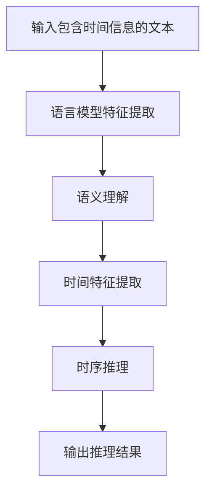

# 语言模型在时序推理任务中的优化方法

> 关键词：语言模型、时序推理任务、优化方法、深度学习、自然语言处理

> 摘要：本文聚焦于语言模型在时序推理任务中的优化方法。随着自然语言处理技术的不断发展，语言模型在诸多领域取得了显著成果，但在处理时序推理任务时仍面临诸多挑战。文章首先介绍了相关背景知识，包括目的范围、预期读者等内容；接着阐述了核心概念与联系，通过文本示意图和 Mermaid 流程图直观呈现；详细讲解了核心算法原理及具体操作步骤，并结合 Python 源代码进行说明；深入探讨了数学模型和公式，并举例分析；通过项目实战给出代码实际案例及详细解释；介绍了实际应用场景；推荐了相关工具和资源；最后总结了未来发展趋势与挑战，还提供了常见问题与解答及扩展阅读参考资料，旨在为研究者和开发者提供全面且深入的技术指导，以提升语言模型在时序推理任务中的性能。

## 1. 背景介绍 
### 1.1 目的和范围
在当今的自然语言处理领域，时序推理任务具有重要地位。例如在事件预测、故事理解、对话系统中的时间逻辑处理等场景中，都需要语言模型能够准确地理解和处理与时间相关的信息。然而，现有的语言模型在处理这类任务时，往往存在对时间信息捕捉不精准、时序逻辑推理能力不足等问题。本文的目的在于深入研究并探讨语言模型在时序推理任务中的优化方法，旨在提高语言模型在该任务上的性能和效果。范围涵盖了从基础的核心概念讲解到具体的算法原理、数学模型，再到项目实战和实际应用场景等多个方面，全面且系统地对语言模型在时序推理任务中的优化进行剖析。

### 1.2 预期读者
本文预期读者包括自然语言处理领域的研究者、人工智能相关专业的学生、从事深度学习和语言模型开发的工程师等。对于希望深入了解语言模型在时序推理任务中优化技术的人员，以及想要在实际项目中应用相关技术的开发者都具有一定的参考价值。

### 1.3 文档结构概述
本文首先在背景介绍部分阐述了研究的目的、范围、预期读者等内容。接着进入核心概念与联系章节，详细解释相关概念并通过示意图和流程图呈现其关系。核心算法原理 & 具体操作步骤章节结合 Python 代码讲解优化算法。数学模型和公式章节用数学语言描述相关原理并举例说明。项目实战部分通过实际代码案例展示优化方法的应用。实际应用场景章节介绍了该优化方法在不同领域的应用。工具和资源推荐章节为读者提供学习和开发所需的相关资源。总结部分探讨未来发展趋势与挑战。附录部分解答常见问题。最后提供扩展阅读和参考资料。

### 1.4 术语表
#### 1.4.1 核心术语定义
- **语言模型**：是一种概率模型，用于计算一个句子或一段文本出现的概率，它可以根据给定的上下文预测下一个词或字符。
- **时序推理任务**：指需要处理与时间顺序相关信息的任务，例如判断事件发生的先后顺序、预测未来事件等。
- **优化方法**：为了提高语言模型在时序推理任务中的性能而采用的一系列技术和策略。

#### 1.4.2 相关概念解释
- **深度学习**：是机器学习的一个分支领域，它通过构建多层神经网络来学习数据的复杂模式和特征，在自然语言处理中被广泛应用于语言模型的训练。
- **自然语言处理**：是计算机科学与人工智能领域的一个重要方向，旨在让计算机能够理解、处理和生成人类语言。

#### 1.4.3 缩略词列表
- **NLP**：Natural Language Processing，自然语言处理
- **RNN**：Recurrent Neural Network，循环神经网络
- **LSTM**：Long Short - Term Memory，长短期记忆网络
- **GRU**：Gated Recurrent Unit，门控循环单元

## 2. 核心概念与联系 
### 语言模型与时序推理任务的基本概念
语言模型是自然语言处理中的核心组件，它的主要目标是对语言的概率分布进行建模。常见的语言模型包括基于统计的语言模型和基于深度学习的语言模型。基于统计的语言模型如 n - 元语法模型，它通过统计语料库中相邻词的出现频率来计算句子的概率。而基于深度学习的语言模型如循环神经网络（RNN）及其变体 LSTM、GRU 等，以及Transformer 架构的语言模型，它们能够更好地捕捉语言中的长距离依赖关系。

时序推理任务则是关注时间信息在文本中的表达和推理。在自然语言中，时间信息可以通过时间词（如“昨天”“明天”）、时间短语（如“一个月前”）以及事件之间的逻辑关系来体现。时序推理任务要求语言模型能够理解这些时间信息，并根据文本中的线索进行时间顺序的判断、事件的排序等操作。

### 核心概念原理和架构的文本示意图
语言模型在时序推理任务中的工作原理可以描述为：输入包含时间信息的文本，语言模型对文本进行特征提取和语义理解，然后根据提取的时间特征和语义信息进行时序推理，最终输出推理结果。例如，在一个故事理解任务中，输入的文本是一系列事件描述，语言模型需要从中提取时间信息和事件信息，判断事件发生的先后顺序，从而理解整个故事的逻辑。

### Mermaid 流程图


## 3. 核心算法原理 & 具体操作步骤 
### 基于 LSTM 的时序推理优化算法原理
LSTM 是一种特殊的循环神经网络，它通过门控机制来解决传统 RNN 中的梯度消失和梯度爆炸问题，能够更好地捕捉长序列中的时间信息。在时序推理任务中，LSTM 可以对输入的文本序列进行处理，学习到文本中时间信息的依赖关系。

LSTM 单元包含三个门：输入门 $i_t$、遗忘门 $f_t$ 和输出门 $o_t$，以及一个细胞状态 $C_t$。其计算公式如下：

输入门：
$$i_t = \sigma(W_{ii}x_t + W_{hi}h_{t - 1}+b_i)$$

遗忘门：
$$f_t = \sigma(W_{if}x_t + W_{hf}h_{t - 1}+b_f)$$

输出门：
$$o_t = \sigma(W_{io}x_t + W_{ho}h_{t - 1}+b_o)$$

候选细胞状态：
$$\tilde{C}_t=\tanh(W_{ic}x_t + W_{hc}h_{t - 1}+b_c)$$

细胞状态更新：
$$C_t = f_t \odot C_{t - 1}+i_t\odot\tilde{C}_t$$

隐藏状态更新：
$$h_t = o_t\odot\tanh(C_t)$$

其中，$x_t$ 是当前时刻的输入，$h_{t - 1}$ 是上一时刻的隐藏状态，$W$ 是权重矩阵，$b$ 是偏置向量，$\sigma$ 是 sigmoid 函数，$\tanh$ 是双曲正切函数，$\odot$ 表示逐元素相乘。

### 具体操作步骤及 Python 源代码实现
以下是一个使用 PyTorch 实现基于 LSTM 的时序推理模型的示例代码：

```python
import torch
import torch.nn as nn

class LSTMTimeReasoningModel(nn.Module):
    def __init__(self, input_size, hidden_size, num_layers, output_size):
        super(LSTMTimeReasoningModel, self).__init__()
        self.hidden_size = hidden_size
        self.num_layers = num_layers
        self.lstm = nn.LSTM(input_size, hidden_size, num_layers, batch_first=True)
        self.fc = nn.Linear(hidden_size, output_size)

    def forward(self, x):
        # 初始化隐藏状态和细胞状态
        h0 = torch.zeros(self.num_layers, x.size(0), self.hidden_size).to(x.device)
        c0 = torch.zeros(self.num_layers, x.size(0), self.hidden_size).to(x.device)

        # 前向传播 LSTM
        out, _ = self.lstm(x, (h0, c0))

        # 取最后一个时间步的输出
        out = out[:, -1, :]

        # 全连接层
        out = self.fc(out)
        return out
```

在上述代码中，我们定义了一个 `LSTMTimeReasoningModel` 类，它继承自 `nn.Module`。在 `__init__` 方法中，我们初始化了 LSTM 层和全连接层。在 `forward` 方法中，我们首先初始化隐藏状态和细胞状态，然后将输入数据通过 LSTM 层进行处理，取最后一个时间步的输出，最后通过全连接层得到最终的输出。

### 训练过程
以下是一个简单的训练过程示例：

```python
# 定义超参数
input_size = 10
hidden_size = 20
num_layers = 2
output_size = 2
batch_size = 32
num_epochs = 10
learning_rate = 0.001

# 初始化模型
model = LSTMTimeReasoningModel(input_size, hidden_size, num_layers, output_size)

# 定义损失函数和优化器
criterion = nn.CrossEntropyLoss()
optimizer = torch.optim.Adam(model.parameters(), lr=learning_rate)

# 模拟训练数据
train_data = torch.randn(batch_size, 5, input_size)
train_labels = torch.randint(0, output_size, (batch_size,))

# 训练模型
for epoch in range(num_epochs):
    # 前向传播
    outputs = model(train_data)
    loss = criterion(outputs, train_labels)

    # 反向传播和优化
    optimizer.zero_grad()
    loss.backward()
    optimizer.step()

    if (epoch + 1) % 1 == 0:
        print(f'Epoch [{epoch + 1}/{num_epochs}], Loss: {loss.item():.4f}')
```

在训练过程中，我们首先定义了超参数，然后初始化模型、损失函数和优化器。接着模拟了训练数据，在每个 epoch 中进行前向传播、计算损失、反向传播和参数更新，最后打印出每个 epoch 的损失值。

## 4. 数学模型和公式 & 详细讲解 & 举例说明 
### 基于概率的时序推理模型
在时序推理任务中，我们可以基于概率模型来描述事件发生的时间顺序。假设我们有一系列事件 $E = \{e_1, e_2, \cdots, e_n\}$，每个事件都有一个对应的时间戳 $T = \{t_1, t_2, \cdots, t_n\}$。我们的目标是计算事件之间的时间顺序关系的概率。

#### 条件概率模型
我们可以使用条件概率来描述事件之间的时间顺序关系。例如，给定事件 $e_i$ 和 $e_j$，我们可以计算 $P(t_i < t_j|e_i, e_j)$，即事件 $e_i$ 发生在事件 $e_j$ 之前的概率。根据贝叶斯定理，我们有：

$$P(t_i < t_j|e_i, e_j)=\frac{P(e_i, e_j|t_i < t_j)P(t_i < t_j)}{P(e_i, e_j)}$$

其中，$P(e_i, e_j|t_i < t_j)$ 表示在事件 $e_i$ 发生在事件 $e_j$ 之前的条件下，事件 $e_i$ 和 $e_j$ 同时发生的概率，$P(t_i < t_j)$ 是事件 $e_i$ 发生在事件 $e_j$ 之前的先验概率，$P(e_i, e_j)$ 是事件 $e_i$ 和 $e_j$ 同时发生的概率。

#### 举例说明
假设我们有两个事件 $e_1$：“小明吃早饭” 和 $e_2$：“小明去上班”。根据常识，我们知道通常情况下小明会先吃早饭再去上班，即 $P(t_1 < t_2)$ 比较大。如果我们观察到一些文本信息，例如 “小明吃完早饭就去上班了”，那么 $P(e_1, e_2|t_1 < t_2)$ 也会比较大。通过计算上述条件概率，我们可以更准确地判断事件之间的时间顺序。

### 基于深度学习的时序推理模型的数学基础
在基于深度学习的时序推理模型中，如前面介绍的 LSTM 模型，其数学基础主要基于神经网络的前向传播和反向传播算法。

#### 前向传播
在 LSTM 模型的前向传播过程中，我们根据输入的文本序列 $x = \{x_1, x_2, \cdots, x_T\}$ 计算隐藏状态序列 $h = \{h_1, h_2, \cdots, h_T\}$ 和细胞状态序列 $C = \{C_1, C_2, \cdots, C_T\}$。每个时间步的计算都是基于前面的公式进行的。

#### 反向传播
在训练过程中，我们使用反向传播算法来更新模型的参数。假设我们的损失函数为 $L$，我们需要计算损失函数对每个参数的梯度，例如对权重矩阵 $W$ 和偏置向量 $b$ 的梯度。根据链式法则，我们有：

$$\frac{\partial L}{\partial W}=\sum_{t = 1}^{T}\frac{\partial L}{\partial h_t}\frac{\partial h_t}{\partial W}$$

$$\frac{\partial L}{\partial b}=\sum_{t = 1}^{T}\frac{\partial L}{\partial h_t}\frac{\partial h_t}{\partial b}$$

通过不断更新参数，我们可以使模型的输出逐渐接近真实的标签，从而提高模型在时序推理任务中的性能。

## 5. 项目实战：代码实际案例和详细解释说明 
### 5.1  开发环境搭建
#### 安装 Python
首先，确保你已经安装了 Python 环境。建议使用 Python 3.6 及以上版本。你可以从 Python 官方网站（https://www.python.org/downloads/） 下载并安装适合你操作系统的 Python 版本。

#### 安装 PyTorch
PyTorch 是一个广泛使用的深度学习框架，我们将使用它来实现我们的时序推理模型。可以根据你的 CUDA 版本和操作系统选择合适的安装命令。例如，如果你使用的是 CPU 版本，可以使用以下命令安装：

```sh
pip install torch torchvision
```

如果你使用的是 GPU 版本，需要根据你的 CUDA 版本选择相应的安装命令，具体可以参考 PyTorch 官方文档（https://pytorch.org/get-started/locally/）。

#### 安装其他依赖库
除了 PyTorch，我们还需要安装一些其他的依赖库，如 `numpy`、`pandas` 等。可以使用以下命令安装：

```sh
pip install numpy pandas
```

### 5.2  源代码详细实现和代码解读
#### 数据预处理
在实际项目中，我们首先需要对输入的文本数据进行预处理。以下是一个简单的数据预处理示例：

```python
import numpy as np
import torch
from torch.utils.data import Dataset, DataLoader

class TimeReasoningDataset(Dataset):
    def __init__(self, data, labels):
        self.data = data
        self.labels = labels

    def __len__(self):
        return len(self.data)

    def __getitem__(self, idx):
        sample = {
            'data': torch.tensor(self.data[idx], dtype=torch.float32),
            'label': torch.tensor(self.labels[idx], dtype=torch.long)
        }
        return sample

# 模拟数据
data = np.random.randn(100, 5, 10)
labels = np.random.randint(0, 2, 100)

# 创建数据集和数据加载器
dataset = TimeReasoningDataset(data, labels)
dataloader = DataLoader(dataset, batch_size=32, shuffle=True)
```

在上述代码中，我们定义了一个 `TimeReasoningDataset` 类，它继承自 `torch.utils.data.Dataset`。在 `__init__` 方法中，我们初始化了数据和标签。在 `__len__` 方法中，我们返回数据集的长度。在 `__getitem__` 方法中，我们根据索引返回一个样本，包括数据和标签。最后，我们创建了数据集和数据加载器。

#### 模型定义
我们使用前面定义的 `LSTMTimeReasoningModel` 类作为我们的模型：

```python
class LSTMTimeReasoningModel(nn.Module):
    def __init__(self, input_size, hidden_size, num_layers, output_size):
        super(LSTMTimeReasoningModel, self).__init__()
        self.hidden_size = hidden_size
        self.num_layers = num_layers
        self.lstm = nn.LSTM(input_size, hidden_size, num_layers, batch_first=True)
        self.fc = nn.Linear(hidden_size, output_size)

    def forward(self, x):
        h0 = torch.zeros(self.num_layers, x.size(0), self.hidden_size).to(x.device)
        c0 = torch.zeros(self.num_layers, x.size(0), self.hidden_size).to(x.device)
        out, _ = self.lstm(x, (h0, c0))
        out = out[:, -1, :]
        out = self.fc(out)
        return out
```

#### 训练过程
以下是完整的训练过程代码：

```python
# 定义超参数
input_size = 10
hidden_size = 20
num_layers = 2
output_size = 2
num_epochs = 10
learning_rate = 0.001

# 初始化模型
model = LSTMTimeReasoningModel(input_size, hidden_size, num_layers, output_size)

# 定义损失函数和优化器
criterion = nn.CrossEntropyLoss()
optimizer = torch.optim.Adam(model.parameters(), lr=learning_rate)

# 训练模型
for epoch in range(num_epochs):
    running_loss = 0.0
    for i, batch in enumerate(dataloader):
        inputs = batch['data']
        labels = batch['label']

        # 前向传播
        outputs = model(inputs)
        loss = criterion(outputs, labels)

        # 反向传播和优化
        optimizer.zero_grad()
        loss.backward()
        optimizer.step()

        running_loss += loss.item()

    print(f'Epoch [{epoch + 1}/{num_epochs}], Loss: {running_loss / len(dataloader):.4f}')
```

### 5.3  代码解读与分析
#### 数据预处理部分
数据预处理的主要目的是将原始数据转换为模型可以接受的格式。在我们的示例中，我们使用 `TimeReasoningDataset` 类将数据和标签封装成一个数据集，然后使用 `DataLoader` 类将数据集分成多个批次进行训练。这样可以提高训练效率，并且方便处理大规模数据。

#### 模型定义部分
`LSTMTimeReasoningModel` 类定义了我们的时序推理模型。它包含一个 LSTM 层和一个全连接层。LSTM 层用于处理输入的文本序列，学习其中的时间信息和语义信息。全连接层用于将 LSTM 层的输出映射到最终的分类结果。

#### 训练过程部分
在训练过程中，我们使用交叉熵损失函数来计算模型的输出和真实标签之间的损失。然后使用反向传播算法计算损失函数对模型参数的梯度，并使用 Adam 优化器更新模型的参数。通过多个 epoch 的训练，模型的性能会逐渐提高。

## 6. 实际应用场景 
### 事件预测
在新闻事件预测、股票市场趋势预测等场景中，语言模型的时序推理能力可以发挥重要作用。例如，通过分析新闻文本中事件的发展脉络和时间信息，语言模型可以预测未来可能发生的事件。在股票市场中，通过分析财经新闻和公告中的时间相关信息，预测股票价格的走势。

### 故事理解
在自然语言处理的故事理解任务中，语言模型需要理解故事中事件的先后顺序和逻辑关系。通过优化语言模型的时序推理能力，可以更准确地理解故事的情节和含义，例如在智能阅读助手、故事生成系统等应用中。

### 对话系统
在对话系统中，时间信息的处理非常重要。例如，用户可能会询问关于过去、现在或未来的问题，对话系统需要根据时间信息进行合理的回答。优化语言模型的时序推理能力可以提高对话系统的智能性和准确性，使其更好地满足用户的需求。

## 7. 工具和资源推荐
### 7.1 学习资源推荐
#### 7.1.1 书籍推荐
- 《深度学习》（Deep Learning）：由 Ian Goodfellow、Yoshua Bengio 和 Aaron Courville 所著，是深度学习领域的经典教材，涵盖了神经网络、优化算法等基础知识，对于理解语言模型的原理有很大帮助。
- 《自然语言处理入门》：详细介绍了自然语言处理的基本概念、算法和应用，适合初学者学习。

#### 7.1.2 在线课程
- Coursera 上的“深度学习专项课程”（Deep Learning Specialization）：由 Andrew Ng 教授授课，内容涵盖了深度学习的各个方面，包括循环神经网络、Transformer 架构等，对于学习语言模型和时序推理有很大的帮助。
- edX 上的“自然语言处理”（Natural Language Processing）课程：提供了自然语言处理的系统学习内容，包括语言模型、文本分类、信息抽取等。

#### 7.1.3 技术博客和网站
- arXiv.org：是一个收集物理学、数学、计算机科学等领域预印本论文的网站，上面有很多关于语言模型和时序推理的最新研究成果。
- Medium 上的 AI 相关博客：有很多优秀的技术文章，涵盖了自然语言处理、深度学习等领域的最新技术和实践经验。

### 7.2 开发工具框架推荐
#### 7.2.1 IDE和编辑器
- PyCharm：是一款专业的 Python 集成开发环境，提供了代码编辑、调试、版本控制等功能，非常适合开发深度学习项目。
- Visual Studio Code：是一款轻量级的代码编辑器，支持多种编程语言和插件扩展，也可以用于开发深度学习项目。

#### 7.2.2 调试和性能分析工具
- TensorBoard：是 TensorFlow 提供的一个可视化工具，可以用于查看模型的训练过程、损失曲线、准确率等指标，帮助开发者调试和优化模型。
- PyTorch Profiler：是 PyTorch 提供的性能分析工具，可以帮助开发者分析模型的性能瓶颈，优化代码效率。

#### 7.2.3 相关框架和库
- PyTorch：是一个开源的深度学习框架，提供了丰富的神经网络模块和优化算法，方便开发者实现语言模型和时序推理模型。
- Hugging Face Transformers：是一个基于 PyTorch 和 TensorFlow 的自然语言处理库，提供了预训练的语言模型和工具，方便开发者快速实现各种自然语言处理任务。

### 7.3 相关论文著作推荐
#### 7.3.1 经典论文
- “Long Short-Term Memory”：由 Sepp Hochreiter 和 Jürgen Schmidhuber 发表，介绍了 LSTM 网络的原理和结构，是循环神经网络领域的经典论文。
- “Attention Is All You Need”：由 Vaswani 等人发表，提出了 Transformer 架构，为自然语言处理领域带来了革命性的变化。

#### 7.3.2 最新研究成果
- 关注 ACL（Association for Computational Linguistics）、EMNLP（Conference on Empirical Methods in Natural Language Processing）等自然语言处理领域的顶级会议，上面有很多关于语言模型和时序推理的最新研究成果。

#### 7.3.3 应用案例分析
- 可以在 Google Scholar 等学术搜索引擎上搜索关于语言模型在时序推理任务中的应用案例分析，了解实际应用中的技术细节和经验教训。

## 8. 总结：未来发展趋势与挑战
### 未来发展趋势
#### 多模态融合
未来的语言模型在时序推理任务中可能会融合更多的模态信息，如视觉、音频等。例如，在故事理解任务中，结合图像和文本信息可以更全面地理解故事的情节和时间顺序。

#### 强化学习与语言模型的结合
强化学习可以通过奖励机制来引导语言模型进行更好的时序推理。例如，在对话系统中，通过强化学习训练语言模型，使其能够根据用户的反馈不断优化回答的时间逻辑。

#### 预训练模型的进一步优化
随着预训练模型技术的不断发展，未来的预训练模型可能会更好地捕捉时间信息和时序逻辑，从而提高在时序推理任务中的性能。

### 挑战
#### 时间信息的复杂表达
自然语言中时间信息的表达非常复杂，存在模糊性、隐喻性等问题。如何准确地捕捉和理解这些时间信息是语言模型在时序推理任务中面临的一大挑战。

#### 大规模数据的处理
为了训练出性能优良的语言模型，需要大量的标注数据。然而，标注时间相关的数据是一项非常耗时和费力的工作，如何高效地获取和处理大规模的时间标注数据是一个亟待解决的问题。

#### 计算资源的限制
训练和优化语言模型需要大量的计算资源，特别是对于一些复杂的模型架构。如何在有限的计算资源下提高模型的性能和效率是一个重要的挑战。

## 9. 附录：常见问题与解答
### 问题 1：如何选择合适的语言模型架构用于时序推理任务？
解答：选择合适的语言模型架构需要考虑任务的复杂度、数据量的大小等因素。如果数据量较小，可以选择简单的循环神经网络（如 RNN、LSTM、GRU）；如果数据量较大，可以考虑使用 Transformer 架构的语言模型。同时，还可以根据任务的特点进行一些改进和优化。

### 问题 2：如何处理时间信息的模糊性？
解答：处理时间信息的模糊性可以采用概率模型、语义理解等方法。例如，通过计算事件发生的概率来处理模糊的时间信息；通过语义理解来推断时间信息的大致范围。

### 问题 3：在训练语言模型时，如何提高模型的时序推理能力？
解答：可以通过以下几种方法提高模型的时序推理能力：1. 增加时间标注数据的比例；2. 设计合适的损失函数，引导模型学习时间信息；3. 采用多任务学习的方法，结合其他相关任务来提高模型的性能。

## 10. 扩展阅读 & 参考资料
- 《自然语言处理实战》
- 《深度学习实战》
- ACL、EMNLP 等会议的相关论文
- Hugging Face 官方文档
- PyTorch 官方文档

作者：AI天才研究院/AI Genius Institute & 禅与计算机程序设计艺术 /Zen And The Art of Computer Programming