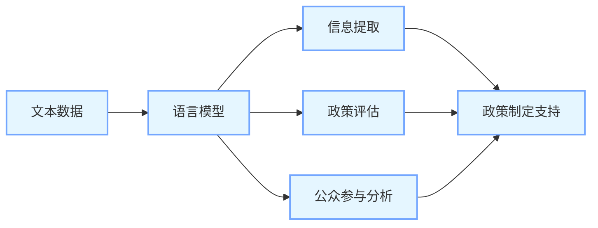

# 语言模型在环境政策制定支持中的应用研究

> 关键词：语言模型；环境政策制定；自然语言处理；信息提取；决策支持

> 摘要：本文聚焦于语言模型在环境政策制定支持中的应用。首先介绍了研究的背景、目的、预期读者、文档结构和相关术语。接着阐述了语言模型及环境政策制定的核心概念与联系，并给出了相应的原理和架构示意图以及流程图。详细讲解了语言模型在环境政策制定中涉及的核心算法原理和具体操作步骤，包括Python代码示例。通过数学模型和公式进一步剖析了其工作机制，并举例说明。结合实际项目，介绍了开发环境搭建、源代码实现和代码解读。探讨了语言模型在环境政策制定中的实际应用场景，推荐了相关的学习资源、开发工具框架和论文著作。最后总结了未来发展趋势与挑战，解答了常见问题，并提供了扩展阅读和参考资料，旨在为利用语言模型支持环境政策制定提供全面的技术参考和理论指导。

## 1. 背景介绍 
### 1.1 目的和范围
随着全球环境问题日益严峻，环境政策的制定变得愈发重要和复杂。环境政策的制定需要综合考虑大量的信息，包括环境数据、科学研究成果、社会经济状况以及公众意见等。语言模型作为自然语言处理领域的重要技术，具有强大的文本理解、生成和分析能力，可以为环境政策制定提供有效的支持。

本研究的目的在于探讨语言模型在环境政策制定支持中的应用，分析其在信息提取、政策评估、公众参与等方面的作用和潜力。研究范围涵盖了各种类型的语言模型，如基于规则的模型、统计模型和深度学习模型，以及它们在环境政策制定不同阶段的应用。

### 1.2 预期读者
本文的预期读者包括环境政策制定者、环境科学研究人员、自然语言处理技术开发者以及对环境政策和语言技术交叉领域感兴趣的专业人士。对于环境政策制定者，本文可以帮助他们了解语言模型在政策制定过程中的应用价值，为决策提供新的思路和方法；对于环境科学研究人员，本文可以为他们在环境信息分析和政策评估方面提供技术支持；对于自然语言处理技术开发者，本文可以为他们开拓新的应用场景，促进技术的创新和发展。

### 1.3 文档结构概述
本文将按照以下结构进行组织：
1. **背景介绍**：阐述研究的目的、范围、预期读者和文档结构，介绍相关术语。
2. **核心概念与联系**：解释语言模型和环境政策制定的核心概念，分析它们之间的联系，并给出原理和架构示意图以及流程图。
3. **核心算法原理 & 具体操作步骤**：详细讲解语言模型在环境政策制定中涉及的核心算法原理，包括词法分析、句法分析、语义理解等，并给出Python代码示例。
4. **数学模型和公式 & 详细讲解 & 举例说明**：通过数学模型和公式进一步剖析语言模型的工作机制，并举例说明其在环境政策制定中的应用。
5. **项目实战：代码实际案例和详细解释说明**：结合实际项目，介绍开发环境搭建、源代码实现和代码解读。
6. **实际应用场景**：探讨语言模型在环境政策制定中的实际应用场景，如信息提取、政策评估、公众参与等。
7. **工具和资源推荐**：推荐相关的学习资源、开发工具框架和论文著作。
8. **总结：未来发展趋势与挑战**：总结语言模型在环境政策制定支持中的应用现状，分析未来发展趋势和面临的挑战。
9. **附录：常见问题与解答**：解答读者在阅读过程中可能遇到的常见问题。
10. **扩展阅读 & 参考资料**：提供相关的扩展阅读材料和参考资料。

### 1.4 术语表
#### 1.4.1 核心术语定义
- **语言模型**：是一种对语言进行建模的统计模型，用于预测文本序列的概率分布。它可以根据已有的文本数据学习语言的规律和模式，从而对新的文本进行生成、理解和分析。
- **环境政策制定**：是指政府或其他决策主体为了解决环境问题，实现可持续发展目标，制定和实施一系列政策措施的过程。
- **自然语言处理**：是一门研究如何让计算机理解和处理人类自然语言的学科，包括词法分析、句法分析、语义理解、文本生成等技术。
- **信息提取**：是指从大量的文本数据中提取出有用的信息，如实体、关系、事件等。
- **政策评估**：是指对政策的实施效果、影响和价值进行评价和分析的过程。

#### 1.4.2 相关概念解释
- **深度学习**：是一种基于人工神经网络的机器学习方法，通过构建多层神经网络来学习数据的特征和模式。在语言模型中，深度学习模型如循环神经网络（RNN）、长短期记忆网络（LSTM）和变换器（Transformer）等取得了显著的成果。
- **预训练模型**：是指在大规模文本数据上进行无监督学习训练得到的语言模型。这些模型可以学习到丰富的语言知识和模式，然后在特定的任务上进行微调，以提高模型的性能。
- **知识图谱**：是一种以图的形式表示知识的方法，由实体、关系和属性组成。在环境政策制定中，知识图谱可以用于整合和管理环境领域的知识，为政策制定提供知识支持。

#### 1.4.3 缩略词列表
- **NLP**：Natural Language Processing，自然语言处理
- **RNN**：Recurrent Neural Network，循环神经网络
- **LSTM**：Long Short-Term Memory，长短期记忆网络
- **Transformer**：变换器
- **BERT**：Bidirectional Encoder Representations from Transformers，基于变换器的双向编码器表示

## 2. 核心概念与联系 

### 语言模型核心概念
语言模型是自然语言处理领域的基础技术之一，其主要目标是计算一个文本序列的概率。给定一个文本序列 $w_1, w_2, \cdots, w_n$，语言模型的任务是估计 $P(w_1, w_2, \cdots, w_n)$ 的值。常见的语言模型包括基于规则的模型、统计模型和深度学习模型。

基于规则的语言模型通过人工编写的语法规则来生成和理解文本，其优点是解释性强，但缺点是规则的编写和维护成本高，难以处理复杂的语言现象。统计语言模型则基于大量的文本数据，通过统计方法来估计文本序列的概率，如 $n$-gram 模型。深度学习语言模型则利用神经网络来学习语言的特征和模式，具有更强的表达能力和泛化能力，如 RNN、LSTM 和 Transformer 等。

### 环境政策制定核心概念
环境政策制定是一个复杂的过程，涉及到多个利益相关者和多个环节。一般来说，环境政策制定包括问题识别、目标设定、方案设计、政策评估和政策实施等环节。在每个环节中，都需要收集和分析大量的信息，包括环境数据、科学研究成果、社会经济状况以及公众意见等。

### 核心概念联系
语言模型在环境政策制定中可以发挥重要的作用。首先，语言模型可以用于信息提取，从大量的环境报告、科学文献、新闻报道等文本数据中提取出有用的信息，如环境问题的类型、严重程度、影响范围等，为政策制定者提供决策支持。其次，语言模型可以用于政策评估，通过对政策文本的分析和理解，评估政策的可行性、有效性和公平性。此外，语言模型还可以用于公众参与，通过对公众意见的分析和理解，了解公众对环境政策的需求和期望，提高政策的民主性和科学性。

### 原理和架构示意图
以下是语言模型在环境政策制定支持中的原理和架构示意图：



该示意图展示了语言模型在环境政策制定支持中的工作流程。首先，收集大量的文本数据，包括环境报告、科学文献、新闻报道、公众意见等。然后，将这些文本数据输入到语言模型中进行处理。语言模型可以进行信息提取、政策评估和公众参与分析等任务。最后，将处理结果提供给政策制定者，为政策制定提供支持。

## 3. 核心算法原理 & 具体操作步骤 

### 词法分析
词法分析是自然语言处理的第一步，其任务是将文本序列分割成一个个单词或词元。在Python中，可以使用`nltk`库进行词法分析。以下是一个简单的示例代码：

```python
import nltk
nltk.download('punkt')

text = "The government should take more effective measures to protect the environment."
tokens = nltk.word_tokenize(text)
print(tokens)
```

### 句法分析
句法分析的任务是分析句子的语法结构，确定单词之间的句法关系。在Python中，可以使用`spaCy`库进行句法分析。以下是一个示例代码：

```python
import spacy

nlp = spacy.load("en_core_web_sm")
text = "The government should take more effective measures to protect the environment."
doc = nlp(text)

for token in doc:
    print(token.text, token.dep_, token.head.text)
```

### 语义理解
语义理解是自然语言处理的核心任务之一，其任务是理解文本的语义信息。在深度学习中，常用的语义理解模型是基于 Transformer 架构的预训练模型，如 BERT。以下是一个使用`transformers`库进行语义理解的示例代码：

```python
from transformers import AutoTokenizer, AutoModel
import torch

tokenizer = AutoTokenizer.from_pretrained('bert-base-uncased')
model = AutoModel.from_pretrained('bert-base-uncased')

text = "The government should take more effective measures to protect the environment."
inputs = tokenizer(text, return_tensors='pt')
outputs = model(**inputs)

last_hidden_states = outputs.last_hidden_state
print(last_hidden_states.shape)
```

### 具体操作步骤
1. **数据收集**：收集与环境政策制定相关的文本数据，包括环境报告、科学文献、新闻报道、公众意见等。
2. **数据预处理**：对收集到的文本数据进行预处理，包括清洗、分词、词性标注、句法分析等。
3. **模型选择和训练**：选择合适的语言模型，如 BERT、GPT 等，并在预处理后的数据上进行微调训练。
4. **信息提取和分析**：使用训练好的语言模型对文本数据进行信息提取和分析，如实体识别、关系抽取、事件提取等。
5. **政策评估和决策支持**：根据信息提取和分析的结果，对环境政策进行评估，并为政策制定者提供决策支持。

## 4. 数学模型和公式 & 详细讲解 & 举例说明 

### 语言模型的数学定义
语言模型的核心任务是计算一个文本序列 $w_1, w_2, \cdots, w_n$ 的概率 $P(w_1, w_2, \cdots, w_n)$。根据链式法则，该概率可以表示为：

$$P(w_1, w_2, \cdots, w_n) = \prod_{i=1}^{n} P(w_i | w_1, w_2, \cdots, w_{i-1})$$

### $n$-gram 模型
$n$-gram 模型是一种简单的统计语言模型，它假设一个单词的出现只与前面的 $n-1$ 个单词有关。因此，$n$-gram 模型可以将上述概率近似表示为：

$$P(w_i | w_1, w_2, \cdots, w_{i-1}) \approx P(w_i | w_{i-n+1}, w_{i-n+2}, \cdots, w_{i-1})$$

例如，对于一个 2-gram（即 bigram）模型，$P(w_i | w_{i-1})$ 可以通过统计语料库中 $w_{i-1}w_i$ 出现的频率来估计：

$$P(w_i | w_{i-1}) = \frac{C(w_{i-1}w_i)}{C(w_{i-1})}$$

其中，$C(w_{i-1}w_i)$ 表示 $w_{i-1}w_i$ 在语料库中出现的次数，$C(w_{i-1})$ 表示 $w_{i-1}$ 在语料库中出现的次数。

### 举例说明
假设我们有一个简单的语料库："The dog runs fast. The cat sleeps."。我们可以使用 bigram 模型来计算句子 "The dog sleeps." 的概率。

首先，计算各个 bigram 的概率：
- $P(dog | The) = \frac{C(The dog)}{C(The)} = \frac{1}{2}$
- $P(sleeps | dog) = \frac{C(dog sleeps)}{C(dog)} = 0$

由于 $P(sleeps | dog) = 0$，所以句子 "The dog sleeps." 的概率为 0。

### 深度学习语言模型
深度学习语言模型如 Transformer 则通过神经网络来学习语言的特征和模式。以 BERT 为例，它是一个基于 Transformer 架构的双向编码器，通过在大规模文本数据上进行无监督学习，学习到了丰富的语言知识和模式。在微调阶段，BERT 可以在特定的任务上进行训练，如文本分类、命名实体识别等。

## 5. 项目实战：代码实际案例和详细解释说明 

### 5.1  开发环境搭建
1. **安装 Python**：确保你已经安装了 Python 3.6 或更高版本。
2. **安装必要的库**：使用`pip`安装以下库：
```bash
pip install nltk spacy transformers
```
3. **下载必要的数据**：使用以下代码下载`nltk`和`spaCy`所需的数据：
```python
import nltk
nltk.download('punkt')

import spacy
spacy.cli.download("en_core_web_sm")
```

### 5.2  源代码详细实现和代码解读
以下是一个使用 BERT 进行环境文本分类的示例代码：

```python
import torch
from torch.utils.data import Dataset, DataLoader
from transformers import AutoTokenizer, AutoModelForSequenceClassification, AdamW
from sklearn.model_selection import train_test_split
import pandas as pd

# 定义数据集类
class EnvironmentDataset(Dataset):
    def __init__(self, texts, labels, tokenizer, max_length):
        self.texts = texts
        self.labels = labels
        self.tokenizer = tokenizer
        self.max_length = max_length

    def __len__(self):
        return len(self.texts)

    def __getitem__(self, idx):
        text = str(self.texts[idx])
        label = self.labels[idx]
        encoding = self.tokenizer.encode_plus(
            text,
            add_special_tokens=True,
            max_length=self.max_length,
            padding='max_length',
            truncation=True,
            return_tensors='pt'
        )
        return {
            'input_ids': encoding['input_ids'].flatten(),
            'attention_mask': encoding['attention_mask'].flatten(),
            'labels': torch.tensor(label, dtype=torch.long)
        }

# 加载数据
data = pd.read_csv('environment_data.csv')
texts = data['text'].tolist()
labels = data['label'].tolist()

# 划分训练集和测试集
train_texts, test_texts, train_labels, test_labels = train_test_split(texts, labels, test_size=0.2, random_state=42)

# 初始化 tokenizer 和模型
tokenizer = AutoTokenizer.from_pretrained('bert-base-uncased')
model = AutoModelForSequenceClassification.from_pretrained('bert-base-uncased', num_labels=len(set(labels)))

# 创建数据集和数据加载器
train_dataset = EnvironmentDataset(train_texts, train_labels, tokenizer, max_length=128)
test_dataset = EnvironmentDataset(test_texts, test_labels, tokenizer, max_length=128)

train_dataloader = DataLoader(train_dataset, batch_size=16, shuffle=True)
test_dataloader = DataLoader(test_dataset, batch_size=16, shuffle=False)

# 定义优化器和训练参数
optimizer = AdamW(model.parameters(), lr=2e-5)
device = torch.device('cuda' if torch.cuda.is_available() else 'cpu')
model.to(device)

# 训练模型
num_epochs = 3
for epoch in range(num_epochs):
    model.train()
    total_loss = 0
    for batch in train_dataloader:
        input_ids = batch['input_ids'].to(device)
        attention_mask = batch['attention_mask'].to(device)
        labels = batch['labels'].to(device)

        optimizer.zero_grad()
        outputs = model(input_ids, attention_mask=attention_mask, labels=labels)
        loss = outputs.loss
        total_loss += loss.item()

        loss.backward()
        optimizer.step()

    print(f'Epoch {epoch + 1}, Loss: {total_loss / len(train_dataloader)}')

# 评估模型
model.eval()
correct_predictions = 0
total_predictions = 0
with torch.no_grad():
    for batch in test_dataloader:
        input_ids = batch['input_ids'].to(device)
        attention_mask = batch['attention_mask'].to(device)
        labels = batch['labels'].to(device)

        outputs = model(input_ids, attention_mask=attention_mask)
        logits = outputs.logits
        predictions = torch.argmax(logits, dim=1)

        correct_predictions += (predictions == labels).sum().item()
        total_predictions += labels.size(0)

accuracy = correct_predictions / total_predictions
print(f'Test Accuracy: {accuracy}')
```

### 5.3  代码解读与分析
1. **数据集类**：`EnvironmentDataset`类用于封装数据集，将文本数据转换为适合 BERT 模型输入的格式。
2. **数据加载**：使用`pandas`库加载数据，并将其划分为训练集和测试集。
3. **模型初始化**：使用`transformers`库初始化 BERT 模型和 tokenizer。
4. **数据加载器**：使用`DataLoader`类创建训练集和测试集的数据加载器。
5. **优化器和训练参数**：定义优化器`AdamW`和训练参数，如学习率、设备等。
6. **训练模型**：在训练过程中，将数据输入到模型中，计算损失并进行反向传播和参数更新。
7. **评估模型**：在测试集上评估模型的性能，计算准确率。

## 6. 实际应用场景 
### 信息提取
语言模型可以从大量的环境报告、科学文献、新闻报道等文本数据中提取出有用的信息，如环境问题的类型、严重程度、影响范围等。例如，通过命名实体识别技术，可以识别出文本中的环境实体，如污染物质、污染源、受影响地区等；通过关系抽取技术，可以提取出实体之间的关系，如污染物质与污染源之间的关系、污染物质与受影响地区之间的关系等。

### 政策评估
语言模型可以对环境政策文本进行分析和理解，评估政策的可行性、有效性和公平性。例如，通过文本分类技术，可以将政策文本分为不同的类型，如环境保护政策、资源管理政策等；通过情感分析技术，可以分析政策文本的情感倾向，了解政策制定者对环境问题的态度和决心；通过文本生成技术，可以生成政策评估报告，为政策制定者提供决策支持。

### 公众参与
语言模型可以用于分析公众对环境政策的意见和反馈，了解公众的需求和期望，提高政策的民主性和科学性。例如，通过对社交媒体、在线论坛等平台上的公众言论进行分析，可以了解公众对环境问题的关注度、对政策的满意度等；通过文本摘要技术，可以生成公众意见的摘要，为政策制定者提供参考。

### 知识图谱构建
语言模型可以用于构建环境领域的知识图谱，整合和管理环境领域的知识。例如，通过实体识别和关系抽取技术，可以从文本数据中提取出环境实体和实体之间的关系，构建知识图谱；通过知识推理技术，可以从知识图谱中挖掘出隐含的知识，为环境政策制定提供知识支持。

## 7. 工具和资源推荐
### 7.1 学习资源推荐
#### 7.1.1 书籍推荐
- 《自然语言处理入门》：作者何晗，本书系统地介绍了自然语言处理的基础知识和常用技术，适合初学者阅读。
- 《深度学习》：作者 Ian Goodfellow、Yoshua Bengio 和 Aaron Courville，本书是深度学习领域的经典教材，介绍了深度学习的基本原理和方法。
- 《环境政策分析与制定》：作者 Paul R. Portney 和 Robert N. Stavins，本书介绍了环境政策分析和制定的基本理论和方法，适合环境政策研究人员阅读。

#### 7.1.2 在线课程
- Coursera 上的“Natural Language Processing Specialization”：由斯坦福大学教授授课，系统地介绍了自然语言处理的基础知识和常用技术。
- edX 上的“Deep Learning Specialization”：由吴恩达教授授课，介绍了深度学习的基本原理和方法。
- 中国大学 MOOC 上的“环境政策与管理”：由国内高校教授授课，介绍了环境政策的制定和管理方法。

#### 7.1.3 技术博客和网站
- Hugging Face Blog：提供了关于自然语言处理和深度学习的最新技术和研究成果。
- Towards Data Science：是一个数据科学和机器学习领域的博客平台，提供了大量的技术文章和案例分析。
- 中国环境科学学会官网：提供了环境科学领域的最新研究成果和政策动态。

### 7.2 开发工具框架推荐
#### 7.2.1 IDE和编辑器
- PyCharm：是一款专门为 Python 开发设计的集成开发环境，提供了丰富的代码编辑、调试和测试功能。
- Jupyter Notebook：是一个交互式的开发环境，适合进行数据分析和模型训练。
- Visual Studio Code：是一款轻量级的代码编辑器，支持多种编程语言和插件扩展。

#### 7.2.2 调试和性能分析工具
- TensorBoard：是 TensorFlow 提供的可视化工具，可以用于监控模型的训练过程和性能指标。
- Py-Spy：是一个 Python 性能分析工具，可以用于分析 Python 程序的性能瓶颈。
- Pylint：是一个 Python 代码检查工具，可以用于检查 Python 代码的语法错误和代码规范。

#### 7.2.3 相关框架和库
- Transformers：是 Hugging Face 开发的一个自然语言处理框架，提供了大量的预训练模型和工具，方便用户进行自然语言处理任务的开发。
- NLTK：是一个自然语言处理工具包，提供了丰富的自然语言处理功能，如词法分析、句法分析、语义理解等。
- SpaCy：是一个高效的自然语言处理库，提供了快速的词法分析、句法分析和实体识别功能。

### 7.3 相关论文著作推荐
#### 7.3.1 经典论文
- “Attention Is All You Need”：提出了 Transformer 架构，是自然语言处理领域的经典论文。
- “BERT: Pre-training of Deep Bidirectional Transformers for Language Understanding”：提出了 BERT 模型，在自然语言处理任务中取得了显著的成果。
- “Convolutional Neural Networks for Sentence Classification”：将卷积神经网络应用于文本分类任务，为文本分类提供了新的思路和方法。

#### 7.3.2 最新研究成果
- 关注 ACL（Association for Computational Linguistics）、EMNLP（Conference on Empirical Methods in Natural Language Processing）等自然语言处理领域的顶级会议，获取最新的研究成果。
- 关注环境科学领域的顶级期刊，如《Environmental Science & Technology》、《Journal of Environmental Management》等，了解环境政策制定的最新研究动态。

#### 7.3.3 应用案例分析
- 可以参考一些实际的环境政策制定项目案例，了解语言模型在实际应用中的效果和挑战。例如，一些政府部门或科研机构发布的环境政策评估报告，可能会介绍语言模型在政策评估中的应用情况。

## 8. 总结：未来发展趋势与挑战
### 未来发展趋势
- **多模态融合**：未来的语言模型可能会与图像、音频等多模态数据进行融合，以获取更全面的环境信息。例如，结合卫星图像和文本数据，更准确地监测环境变化。
- **知识增强**：将知识图谱等知识表示方法与语言模型相结合，增强语言模型的知识理解和推理能力，为环境政策制定提供更深入的知识支持。
- **个性化服务**：根据不同的政策制定者和利益相关者的需求，提供个性化的环境政策支持服务，如定制化的信息提取和政策评估。
- **跨领域应用**：语言模型在环境政策制定中的应用可能会拓展到其他相关领域，如能源政策、交通政策等，实现更广泛的跨领域决策支持。

### 挑战
- **数据质量和标注**：环境领域的文本数据往往存在噪声、不规范等问题，且标注数据的成本较高。如何提高数据质量和获取足够的标注数据是一个挑战。
- **模型可解释性**：深度学习语言模型往往是黑盒模型，其决策过程难以解释。在环境政策制定中，需要模型具有较好的可解释性，以便政策制定者理解和信任模型的输出。
- **伦理和法律问题**：语言模型在处理公众意见和敏感信息时，需要考虑伦理和法律问题，如隐私保护、数据安全等。
- **技术适应性**：环境问题具有复杂性和动态性，语言模型需要不断适应新的环境数据和政策需求，提高模型的泛化能力和适应性。

## 9. 附录：常见问题与解答
### 问题1：语言模型在环境政策制定中的应用是否会取代人类决策？
解答：不会。语言模型可以为环境政策制定提供信息提取、政策评估等支持，但最终的决策仍然需要人类政策制定者根据多方面的因素进行综合考虑。语言模型的输出只是一种参考，人类决策还需要考虑社会、经济、政治等因素。

### 问题2：如何选择适合环境政策制定的语言模型？
解答：选择适合的语言模型需要考虑多个因素，如任务类型、数据规模、计算资源等。对于简单的文本分类任务，可以选择轻量级的预训练模型；对于复杂的语义理解任务，可以选择更强大的模型，如 BERT、GPT 等。同时，还需要考虑模型的可解释性和适应性。

### 问题3：语言模型在处理环境领域的专业术语时是否会存在困难？
解答：语言模型在处理环境领域的专业术语时可能会存在一定的困难。为了提高模型对专业术语的处理能力，可以使用领域特定的预训练模型，或者在训练数据中加入更多的专业术语和相关文本。

### 问题4：如何评估语言模型在环境政策制定中的性能？
解答：可以使用多种指标来评估语言模型在环境政策制定中的性能，如准确率、召回率、F1 值等。对于信息提取任务，可以评估实体识别和关系抽取的准确率；对于政策评估任务，可以评估分类的准确率和情感分析的一致性。同时，还可以通过人工评估和实际应用效果来综合评估模型的性能。

## 10. 扩展阅读 & 参考资料
### 扩展阅读
- 《人工智能时代的环境治理》：探讨了人工智能技术在环境治理中的应用和挑战。
- 《自然语言处理实战》：提供了更多自然语言处理技术的实际应用案例。
- 《环境政策与可持续发展》：深入分析了环境政策与可持续发展的关系。

### 参考资料
- 相关的学术论文和研究报告，如 ACL、EMNLP 等会议的论文。
- 环境科学领域的权威期刊和书籍。
- 自然语言处理和深度学习领域的开源代码和文档，如 Hugging Face 的 Transformers 库。

作者：AI天才研究院/AI Genius Institute & 禅与计算机程序设计艺术 /Zen And The Art of Computer Programming