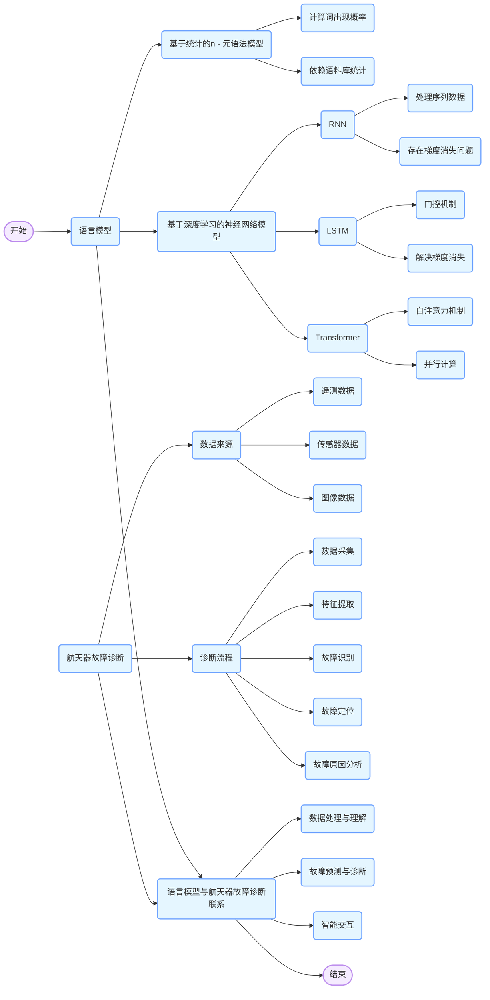

# 语言模型在航天器故障诊断中的应用探索

> 关键词：语言模型、航天器故障诊断、自然语言处理、数据分析、智能诊断系统

> 摘要：本文聚焦于语言模型在航天器故障诊断中的应用。首先介绍了航天器故障诊断的背景和重要性，详细阐述了语言模型的核心概念、算法原理及相关数学模型。通过项目实战展示了如何运用语言模型进行故障诊断的具体代码实现和解读。分析了语言模型在航天器故障诊断中的实际应用场景，推荐了相关的学习资源、开发工具和论文著作。最后总结了该领域的未来发展趋势与挑战，并提供常见问题解答和扩展阅读参考资料，旨在为利用语言模型提升航天器故障诊断能力提供全面的技术指导和深入思考。

## 1. 背景介绍 
### 1.1 目的和范围
航天器在太空环境中面临着复杂多变的情况，故障的发生可能会导致任务失败甚至危及宇航员的生命安全。因此，及时、准确地诊断航天器故障至关重要。本文章的目的是探索语言模型在航天器故障诊断中的应用，研究如何利用语言模型处理航天器运行过程中产生的各种数据和信息，实现更高效、智能的故障诊断。范围涵盖了语言模型的基本原理、相关算法、数学模型，以及在实际项目中的应用，同时分析其在不同场景下的应用可能性和面临的挑战。

### 1.2 预期读者
本文预期读者包括从事航天器故障诊断相关工作的工程师、科研人员，对人工智能在航天领域应用感兴趣的技术爱好者，以及相关专业的高校师生。对于工程师和科研人员，本文可提供新的技术思路和方法；对于技术爱好者，能帮助他们了解语言模型在航天领域的前沿应用；对于高校师生，可作为学习和研究的参考资料。

### 1.3 文档结构概述
本文首先介绍相关背景知识，包括目的、预期读者和文档结构等内容。接着阐述语言模型和航天器故障诊断的核心概念及其联系，通过文本示意图和 Mermaid 流程图进行直观展示。然后详细讲解语言模型的核心算法原理，用 Python 代码进行说明，并给出相关的数学模型和公式及举例。之后通过项目实战展示语言模型在航天器故障诊断中的具体应用，包括开发环境搭建、源代码实现和代码解读。分析语言模型在实际场景中的应用，推荐相关的学习资源、开发工具和论文著作。最后总结未来发展趋势与挑战，提供常见问题解答和扩展阅读参考资料。

### 1.4 术语表
#### 1.4.1 核心术语定义
- **语言模型**：是一种基于概率统计的模型，用于计算一个句子或一段文本出现的概率，能够学习语言的语法、语义和上下文信息。
- **航天器故障诊断**：通过对航天器运行过程中的各种数据和信息进行分析，识别航天器是否发生故障，并确定故障的类型、位置和原因的过程。
- **自然语言处理（NLP）**：是计算机科学与语言学的交叉领域，研究如何让计算机处理和理解人类语言，包括文本分类、情感分析、机器翻译等任务。

#### 1.4.2 相关概念解释
- **深度学习**：是一种基于人工神经网络的机器学习方法，通过多层神经网络自动学习数据的特征和模式，在图像识别、语音识别、自然语言处理等领域取得了显著的成果。
- **循环神经网络（RNN）**：是一种专门处理序列数据的神经网络，能够考虑序列数据的上下文信息，常用于自然语言处理和时间序列分析。
- **长短期记忆网络（LSTM）**：是一种特殊的 RNN，能够解决传统 RNN 在处理长序列数据时的梯度消失问题，更好地捕捉序列数据的长期依赖关系。

#### 1.4.3 缩略词列表
- **NLP**：Natural Language Processing（自然语言处理）
- **RNN**：Recurrent Neural Network（循环神经网络）
- **LSTM**：Long Short-Term Memory（长短期记忆网络）
- **GPT**：Generative Pretrained Transformer（生成式预训练变换器）

## 2. 核心概念与联系 

### 语言模型核心概念
语言模型是自然语言处理领域的重要基础，它的目标是根据给定的文本序列预测下一个可能出现的词或字符。常见的语言模型有基于统计的 n - 元语法模型和基于深度学习的神经网络模型。

#### 基于统计的 n - 元语法模型
n - 元语法模型假设一个词的出现只与它前面的 $n - 1$ 个词有关。例如，二元语法模型（$n = 2$）计算 $P(w_i|w_{i - 1})$，即给定前一个词 $w_{i - 1}$ 时，当前词 $w_i$ 出现的概率。其原理是通过统计语料库中各个 $n$ - 元组的出现频率来估计概率。

#### 基于深度学习的神经网络模型
随着深度学习的发展，神经网络语言模型逐渐成为主流。如 RNN、LSTM 和 Transformer 等模型，它们能够自动学习语言的复杂模式和语义信息。以 LSTM 为例，它通过门控机制来控制信息的流动，解决了传统 RNN 在处理长序列时的梯度消失问题，从而更好地捕捉文本的长期依赖关系。

### 航天器故障诊断核心概念
航天器故障诊断是一个复杂的系统工程，涉及到多个学科领域的知识和技术。其核心是对航天器运行过程中产生的各种数据进行分析和处理，包括遥测数据、传感器数据、图像数据等，以识别故障的发生、定位故障的位置和确定故障的原因。

### 核心概念联系
语言模型在航天器故障诊断中的应用主要体现在以下几个方面：
- **数据处理与理解**：航天器产生的大量数据中包含了自然语言描述的信息，如故障报告、操作手册等。语言模型可以对这些文本数据进行处理和理解，提取有用的信息，帮助诊断人员更好地分析故障。
- **故障预测与诊断**：通过对历史故障数据和相关文本信息的学习，语言模型可以预测故障的发生概率，并辅助诊断人员确定故障的类型和原因。
- **智能交互**：语言模型可以实现人机之间的自然语言交互，诊断人员可以通过语音或文本输入问题，语言模型给出相应的诊断建议和解决方案。

### 文本示意图
```plaintext
语言模型
|-- 基于统计的 n - 元语法模型
|   |-- 计算词出现概率
|   |-- 依赖语料库统计
|-- 基于深度学习的神经网络模型
|   |-- RNN
|   |   |-- 处理序列数据
|   |   |-- 存在梯度消失问题
|   |-- LSTM
|   |   |-- 门控机制
|   |   |-- 解决梯度消失
|   |-- Transformer
|       |-- 自注意力机制
|       |-- 并行计算

航天器故障诊断
|-- 数据来源
|   |-- 遥测数据
|   |-- 传感器数据
|   |-- 图像数据
|-- 诊断流程
|   |-- 数据采集
|   |-- 特征提取
|   |-- 故障识别
|   |-- 故障定位
|   |-- 故障原因分析

语言模型与航天器故障诊断联系
|-- 数据处理与理解
|-- 故障预测与诊断
|-- 智能交互
```

### Mermaid 流程图


## 3. 核心算法原理 & 具体操作步骤 

### 基于 LSTM 的语言模型算法原理
LSTM 是一种特殊的循环神经网络，它通过门控机制来控制信息的流动，能够有效地处理长序列数据。LSTM 单元包含输入门、遗忘门和输出门，其工作原理如下：

#### 遗忘门
遗忘门决定了上一时刻的细胞状态 $C_{t - 1}$ 中有多少信息需要被遗忘。遗忘门的输出 $f_t$ 是一个 $[0, 1]$ 之间的向量，通过 sigmoid 函数计算得到：
$$f_t = \sigma(W_f[h_{t - 1}, x_t] + b_f)$$
其中，$W_f$ 是遗忘门的权重矩阵，$b_f$ 是偏置向量，$h_{t - 1}$ 是上一时刻的隐藏状态，$x_t$ 是当前时刻的输入。

#### 输入门
输入门决定了当前时刻的输入 $x_t$ 中有多少信息需要被加入到细胞状态中。输入门的输出 $i_t$ 同样通过 sigmoid 函数计算：
$$i_t = \sigma(W_i[h_{t - 1}, x_t] + b_i)$$
同时，还需要计算一个候选细胞状态 $\tilde{C}_t$：
$$\tilde{C}_t = \tanh(W_C[h_{t - 1}, x_t] + b_C)$$

#### 细胞状态更新
根据遗忘门和输入门的输出，更新细胞状态 $C_t$：
$$C_t = f_t \odot C_{t - 1} + i_t \odot \tilde{C}_t$$
其中，$\odot$ 表示逐元素相乘。

#### 输出门
输出门决定了当前时刻的隐藏状态 $h_t$ 的输出。输出门的输出 $o_t$ 通过 sigmoid 函数计算：
$$o_t = \sigma(W_o[h_{t - 1}, x_t] + b_o)$$
然后，根据更新后的细胞状态 $C_t$ 计算隐藏状态 $h_t$：
$$h_t = o_t \odot \tanh(C_t)$$

### Python 代码实现
```python
import torch
import torch.nn as nn

class LSTMModel(nn.Module):
    def __init__(self, input_size, hidden_size, num_layers, output_size):
        super(LSTMModel, self).__init__()
        self.hidden_size = hidden_size
        self.num_layers = num_layers
        self.lstm = nn.LSTM(input_size, hidden_size, num_layers, batch_first=True)
        self.fc = nn.Linear(hidden_size, output_size)

    def forward(self, x):
        # 初始化隐藏状态和细胞状态
        h0 = torch.zeros(self.num_layers, x.size(0), self.hidden_size).to(x.device)
        c0 = torch.zeros(self.num_layers, x.size(0), self.hidden_size).to(x.device)

        # 前向传播 LSTM
        out, _ = self.lstm(x, (h0, c0))

        # 取最后一个时间步的输出
        out = out[:, -1, :]

        # 通过全连接层
        out = self.fc(out)
        return out

# 示例使用
input_size = 10
hidden_size = 20
num_layers = 2
output_size = 5
model = LSTMModel(input_size, hidden_size, num_layers, output_size)

# 生成随机输入数据
batch_size = 32
seq_length = 15
x = torch.randn(batch_size, seq_length, input_size)

# 前向传播
output = model(x)
print(output.shape)
```

### 具体操作步骤
1. **数据准备**：收集航天器故障相关的文本数据，并进行预处理，包括分词、去除停用词、词向量编码等。
2. **模型定义**：使用上述代码定义一个 LSTM 语言模型，根据实际需求调整输入大小、隐藏层大小、层数和输出大小。
3. **模型训练**：将预处理后的数据划分为训练集和验证集，使用训练集对模型进行训练，同时使用验证集进行模型评估和调优。
4. **故障诊断应用**：将训练好的模型应用于航天器故障诊断，输入故障相关的文本信息，模型输出故障类型或诊断建议。

## 4. 数学模型和公式 & 详细讲解 & 举例说明 

### 基于 n - 元语法模型的数学公式
n - 元语法模型假设一个词的出现只与它前面的 $n - 1$ 个词有关。对于一个长度为 $m$ 的句子 $w_1, w_2, \cdots, w_m$，其出现的概率可以表示为：
$$P(w_1, w_2, \cdots, w_m) = \prod_{i = 1}^{m} P(w_i|w_{i - n + 1}, \cdots, w_{i - 1})$$
其中，$P(w_i|w_{i - n + 1}, \cdots, w_{i - 1})$ 可以通过最大似然估计来计算：
$$P(w_i|w_{i - n + 1}, \cdots, w_{i - 1}) = \frac{Count(w_{i - n + 1}, \cdots, w_{i - 1}, w_i)}{Count(w_{i - n + 1}, \cdots, w_{i - 1})}$$
其中，$Count(\cdot)$ 表示某个 $n$ - 元组在语料库中出现的次数。

### 举例说明
假设我们有一个简单的语料库：“I love programming. Programming is fun.”，我们要计算二元语法模型下 $P(programming|love)$ 的概率。

首先，统计 $Count(love, programming)$ 和 $Count(love)$：
- $Count(love, programming) = 1$
- $Count(love) = 1$

则 $P(programming|love) = \frac{Count(love, programming)}{Count(love)} = 1$

### 基于 LSTM 的损失函数
在训练 LSTM 语言模型时，通常使用交叉熵损失函数。对于一个多分类问题，假设模型的输出为 $\hat{y}$，真实标签为 $y$，交叉熵损失函数的定义为：
$$L = -\sum_{i = 1}^{N} y_i \log(\hat{y}_i)$$
其中，$N$ 是类别数。

### 举例说明
假设我们有一个三分类问题，模型的输出 $\hat{y} = [0.1, 0.3, 0.6]$，真实标签 $y = [0, 0, 1]$。则交叉熵损失为：
$$L = -(0 \times \log(0.1) + 0 \times \log(0.3) + 1 \times \log(0.6)) \approx 0.5108$$

## 5. 项目实战：代码实际案例和详细解释说明 

### 5.1  开发环境搭建
#### 操作系统
建议使用 Linux 系统，如 Ubuntu 18.04 或更高版本，也可以使用 Windows 10 或 macOS。

#### 编程语言和库
- **Python**：建议使用 Python 3.7 或更高版本。
- **深度学习框架**：使用 PyTorch 作为深度学习框架，可通过以下命令安装：
```sh
pip install torch torchvision
```
- **自然语言处理库**：使用 NLTK 和 SpaCy 进行文本预处理，可通过以下命令安装：
```sh
pip install nltk spacy
python -m spacy download en_core_web_sm
```

#### 代码编辑器
推荐使用 PyCharm 或 Visual Studio Code 作为代码编辑器。

### 5.2  源代码详细实现和代码解读
```python
import torch
import torch.nn as nn
import torch.optim as optim
from torch.utils.data import Dataset, DataLoader
import nltk
from nltk.corpus import stopwords
from nltk.tokenize import word_tokenize
import spacy
import pandas as pd
import numpy as np

# 下载 NLTK 数据
nltk.download('punkt')
nltk.download('stopwords')

# 加载 SpaCy 模型
nlp = spacy.load('en_core_web_sm')

# 定义数据集类
class SpacecraftFaultDataset(Dataset):
    def __init__(self, data, labels, tokenizer, max_length):
        self.data = data
        self.labels = labels
        self.tokenizer = tokenizer
        self.max_length = max_length

    def __len__(self):
        return len(self.data)

    def __getitem__(self, idx):
        text = self.data[idx]
        label = self.labels[idx]

        # 文本预处理
        tokens = self.tokenizer(text)
        tokens = [token.lower() for token in tokens if token.isalpha()]
        stop_words = set(stopwords.words('english'))
        tokens = [token for token in tokens if token not in stop_words]
        tokens = tokens[:self.max_length]

        # 词向量编码
        input_ids = []
        for token in tokens:
            try:
                input_ids.append(nlp.vocab.strings[token])
            except:
                input_ids.append(0)

        # 填充
        while len(input_ids) < self.max_length:
            input_ids.append(0)

        input_ids = torch.tensor(input_ids, dtype=torch.long)
        label = torch.tensor(label, dtype=torch.long)

        return input_ids, label

# 定义 LSTM 模型
class LSTMModel(nn.Module):
    def __init__(self, vocab_size, embedding_dim, hidden_dim, num_classes):
        super(LSTMModel, self).__init__()
        self.embedding = nn.Embedding(vocab_size, embedding_dim)
        self.lstm = nn.LSTM(embedding_dim, hidden_dim, batch_first=True)
        self.fc = nn.Linear(hidden_dim, num_classes)

    def forward(self, x):
        embedded = self.embedding(x)
        out, _ = self.lstm(embedded)
        out = out[:, -1, :]
        out = self.fc(out)
        return out

# 加载数据
data = pd.read_csv('spacecraft_fault_data.csv')
texts = data['text'].tolist()
labels = data['label'].tolist()

# 划分训练集和测试集
train_size = int(0.8 * len(texts))
train_texts = texts[:train_size]
train_labels = labels[:train_size]
test_texts = texts[train_size:]
test_labels = labels[train_size:]

# 创建数据集和数据加载器
train_dataset = SpacecraftFaultDataset(train_texts, train_labels, word_tokenize, max_length=50)
train_loader = DataLoader(train_dataset, batch_size=32, shuffle=True)
test_dataset = SpacecraftFaultDataset(test_texts, test_labels, word_tokenize, max_length=50)
test_loader = DataLoader(test_dataset, batch_size=32, shuffle=False)

# 初始化模型、损失函数和优化器
vocab_size = len(nlp.vocab.strings)
embedding_dim = 100
hidden_dim = 128
num_classes = len(set(labels))
model = LSTMModel(vocab_size, embedding_dim, hidden_dim, num_classes)
criterion = nn.CrossEntropyLoss()
optimizer = optim.Adam(model.parameters(), lr=0.001)

# 训练模型
num_epochs = 10
for epoch in range(num_epochs):
    model.train()
    running_loss = 0.0
    for inputs, labels in train_loader:
        optimizer.zero_grad()
        outputs = model(inputs)
        loss = criterion(outputs, labels)
        loss.backward()
        optimizer.step()
        running_loss += loss.item()
    print(f'Epoch {epoch + 1}/{num_epochs}, Loss: {running_loss / len(train_loader)}')

# 测试模型
model.eval()
correct = 0
total = 0
with torch.no_grad():
    for inputs, labels in test_loader:
        outputs = model(inputs)
        _, predicted = torch.max(outputs.data, 1)
        total += labels.size(0)
        correct += (predicted == labels).sum().item()
print(f'Test Accuracy: {100 * correct / total}%')
```

### 5.3  代码解读与分析
1. **数据加载和预处理**：使用 `pandas` 库加载航天器故障数据，将文本数据和标签分别存储在 `texts` 和 `labels` 列表中。然后将数据划分为训练集和测试集。
2. **数据集类**：定义了 `SpacecraftFaultDataset` 类，用于封装数据集。在 `__getitem__` 方法中，对文本数据进行预处理，包括分词、去除停用词、词向量编码和填充，最后将数据转换为 PyTorch 张量。
3. **LSTM 模型**：定义了 `LSTMModel` 类，包含一个嵌入层、一个 LSTM 层和一个全连接层。在 `forward` 方法中，实现了模型的前向传播过程。
4. **训练和测试**：使用交叉熵损失函数和 Adam 优化器对模型进行训练，训练过程中打印每个 epoch 的损失值。训练完成后，在测试集上评估模型的准确率。

## 6. 实际应用场景 
### 故障报告分析
航天器在运行过程中会产生大量的故障报告，这些报告通常以自然语言的形式描述故障的现象、发生时间和可能的原因。语言模型可以对这些故障报告进行分析，提取关键信息，如故障类型、故障部件等，帮助诊断人员快速了解故障情况。

### 操作手册理解
航天器的操作手册包含了各种操作流程和注意事项，语言模型可以帮助操作人员理解手册内容，在遇到故障时提供相应的操作建议。例如，当航天器某个系统出现故障时，语言模型可以根据操作手册的内容，指导操作人员进行故障排除。

### 故障预测
通过对历史故障数据和相关文本信息的学习，语言模型可以预测航天器未来可能出现的故障。例如，根据航天器的运行状态和环境数据，结合历史故障记录，语言模型可以预测某个部件在未来一段时间内发生故障的概率，提前采取预防措施。

### 智能交互诊断系统
构建基于语言模型的智能交互诊断系统，诊断人员可以通过语音或文本输入问题，系统根据问题提供相应的诊断建议和解决方案。这种交互方式可以提高故障诊断的效率，减少人工分析的工作量。

## 7. 工具和资源推荐
### 7.1 学习资源推荐
#### 7.1.1 书籍推荐
- 《自然语言处理入门》：由何晗编写，全面介绍了自然语言处理的基础知识和常用技术，适合初学者入门。
- 《深度学习》：由 Ian Goodfellow、Yoshua Bengio 和 Aaron Courville 编写，是深度学习领域的经典教材，对神经网络和语言模型有深入的讲解。
- 《Python 自然语言处理》：由 Steven Bird、Ewan Klein 和 Edward Loper 编写，介绍了如何使用 Python 进行自然语言处理，包含大量的代码示例。

#### 7.1.2 在线课程
- Coursera 上的“Natural Language Processing Specialization”：由斯坦福大学的教授授课，涵盖了自然语言处理的各个方面，包括语言模型、文本分类、机器翻译等。
- edX 上的“Deep Learning for Natural Language Processing”：介绍了深度学习在自然语言处理中的应用，包括 RNN、LSTM 和 Transformer 等模型。
- 哔哩哔哩上的“自然语言处理入门教程”：由国内知名学者讲解，内容通俗易懂，适合初学者学习。

#### 7.1.3 技术博客和网站
- Medium：上面有很多关于自然语言处理和语言模型的技术文章，涵盖了最新的研究成果和应用案例。
- arXiv：是一个预印本平台，提供了大量的学术论文，包括自然语言处理领域的最新研究。
- 机器之心：专注于人工智能领域的技术报道和分析，有很多关于语言模型在各个领域应用的文章。

### 7.2 开发工具框架推荐
#### 7.2.1 IDE和编辑器
- PyCharm：是一款专门为 Python 开发设计的集成开发环境，具有强大的代码编辑、调试和项目管理功能。
- Visual Studio Code：是一款轻量级的代码编辑器，支持多种编程语言，有丰富的插件可以扩展功能。
- Jupyter Notebook：是一个交互式的开发环境，适合进行数据分析和模型实验，支持 Python、R 等多种编程语言。

#### 7.2.2 调试和性能分析工具
- PyTorch Profiler：是 PyTorch 自带的性能分析工具，可以帮助开发者分析模型的运行时间和内存使用情况，找出性能瓶颈。
- TensorBoard：是 TensorFlow 提供的可视化工具，也可以用于 PyTorch 模型的可视化，能够展示模型的训练过程、损失曲线和准确率等信息。
- VS Code Debugger：可以方便地对 Python 代码进行调试，支持单步执行、断点调试等功能。

#### 7.2.3 相关框架和库
- PyTorch：是一个开源的深度学习框架，提供了丰富的神经网络模块和优化算法，广泛应用于自然语言处理和计算机视觉等领域。
- TensorFlow：是另一个流行的深度学习框架，具有强大的分布式训练和部署能力。
- Hugging Face Transformers：是一个专门用于自然语言处理的库，提供了各种预训练的语言模型，如 BERT、GPT - 2 等，方便开发者快速构建自然语言处理模型。

### 7.3 相关论文著作推荐
#### 7.3.1 经典论文
- “Long Short-Term Memory”：由 Sepp Hochreiter 和 Jürgen Schmidhuber 发表，介绍了 LSTM 模型的原理和应用。
- “Attention Is All You Need”：由 Google 团队发表，提出了 Transformer 模型，是自然语言处理领域的重要突破。
- “A Neural Probabilistic Language Model”：由 Yoshua Bengio 等人发表，开创了神经网络语言模型的先河。

#### 7.3.2 最新研究成果
- 关注 arXiv 上关于自然语言处理和航天器故障诊断的最新论文，了解该领域的前沿研究动态。
- 参加相关的学术会议，如 ACL（Association for Computational Linguistics）、EMNLP（Conference on Empirical Methods in Natural Language Processing）等，获取最新的研究成果。

#### 7.3.3 应用案例分析
- 查阅航天领域的专业期刊和会议论文，了解语言模型在航天器故障诊断中的实际应用案例，学习他人的经验和方法。

## 8. 总结：未来发展趋势与挑战
### 未来发展趋势
- **多模态融合**：将语言模型与图像、音频等多模态数据相结合，能够更全面地分析航天器故障。例如，结合故障图像和文本描述，提高故障诊断的准确性。
- **强化学习与语言模型的结合**：通过强化学习让语言模型在与环境的交互中不断学习和优化，实现更智能的故障诊断和决策。
- **预训练模型的应用**：利用大规模预训练语言模型，如 GPT - 3、BERT 等，进行微调后应用于航天器故障诊断，减少训练时间和数据需求。

### 挑战
- **数据稀缺性**：航天器故障数据通常非常稀缺，难以满足语言模型的训练需求。需要采用数据增强、迁移学习等方法来解决数据不足的问题。
- **模型可解释性**：语言模型通常是黑盒模型，难以解释其决策过程。在航天器故障诊断中，需要提高模型的可解释性，以便诊断人员理解和信任模型的输出。
- **实时性要求**：航天器故障诊断需要在短时间内给出诊断结果，对模型的实时性提出了很高的要求。需要优化模型结构和算法，提高模型的推理速度。

## 9. 附录：常见问题与解答
### 问题 1：语言模型在航天器故障诊断中的准确率如何保证？
答：可以通过以下方法保证语言模型的准确率：
- 收集大量的高质量故障数据进行训练，提高模型的泛化能力。
- 采用合适的模型结构和算法，如 LSTM、Transformer 等，以更好地捕捉数据的特征和模式。
- 进行模型评估和调优，使用交叉验证等方法选择最优的模型参数。

### 问题 2：如何处理航天器故障数据中的噪声和异常值？
答：可以采用以下方法处理噪声和异常值：
- 数据清洗：去除数据中的无效信息和重复数据。
- 特征选择：选择与故障诊断相关的特征，减少噪声的影响。
- 异常检测：使用统计方法或机器学习算法检测和处理异常值。

### 问题 3：语言模型在航天器故障诊断中的计算资源需求如何？
答：语言模型的计算资源需求取决于模型的规模和复杂度。对于小型模型，普通的计算机即可满足需求；对于大型预训练模型，需要使用 GPU 或 TPU 等高性能计算设备。可以通过模型压缩、量化等方法减少计算资源需求。

## 10. 扩展阅读 & 参考资料
- 《航天故障诊断技术》
- 《人工智能及其应用》
- 相关的学术论文：“Fault Diagnosis of Spacecraft Systems Using Machine Learning Techniques”、“Natural Language Processing for Spacecraft Anomaly Detection”等。
- 航天领域的官方网站和报告，如 NASA、ESA 等的官方网站，获取最新的航天器故障诊断技术和应用案例。

作者：AI天才研究院/AI Genius Institute & 禅与计算机程序设计艺术 /Zen And The Art of Computer Programming