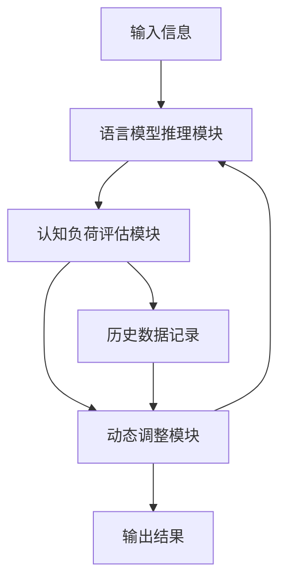

# 语言模型推理能力的认知负荷动态平衡研究

> 关键词：语言模型、推理能力、认知负荷、动态平衡、人工智能

> 摘要：本文聚焦于语言模型推理能力的认知负荷动态平衡研究。首先介绍了该研究的背景，包括目的、预期读者、文档结构等内容。接着阐述了语言模型推理能力、认知负荷等核心概念及其联系，并给出相应的原理和架构示意图与流程图。详细讲解了核心算法原理，结合 Python 代码进行具体操作步骤的说明。通过数学模型和公式对相关概念进行深入分析，并举例说明。以项目实战的方式展示代码实际案例，包括开发环境搭建、源代码实现及解读。探讨了语言模型推理能力的认知负荷动态平衡在实际中的应用场景，推荐了相关的学习资源、开发工具框架和论文著作。最后总结了未来发展趋势与挑战，解答了常见问题，并提供扩展阅读和参考资料，旨在为语言模型领域的研究和实践提供全面且深入的指导。

## 1. 背景介绍 
### 1.1 目的和范围
在当今人工智能领域，语言模型取得了显著的发展。语言模型的推理能力是衡量其性能的重要指标之一，然而在推理过程中，认知负荷的平衡是一个关键问题。本研究的目的在于深入探讨语言模型推理能力与认知负荷之间的动态平衡关系。范围涵盖了从语言模型推理的基本原理到认知负荷的量化分析，以及如何实现两者之间的动态平衡。通过研究，我们旨在提高语言模型在不同场景下的推理效率和准确性，减少不必要的认知资源消耗。

### 1.2 预期读者
本文预期读者包括人工智能领域的研究人员、程序员、软件架构师，以及对语言模型和认知科学感兴趣的学生和爱好者。对于研究人员，本文提供了新的研究视角和思路；对于程序员和软件架构师，有助于他们在实际开发中优化语言模型的推理性能；对于学生和爱好者，可以帮助他们深入理解语言模型推理的复杂机制。

### 1.3 文档结构概述
本文将按照以下结构展开：首先介绍相关背景知识，包括目的、读者群体和文档结构等；接着阐述核心概念及其联系，给出原理和架构示意图与流程图；然后详细讲解核心算法原理和具体操作步骤，结合 Python 代码进行说明；通过数学模型和公式深入分析相关概念，并举例说明；以项目实战的方式展示代码实际案例，包括开发环境搭建、源代码实现及解读；探讨实际应用场景；推荐相关的学习资源、开发工具框架和论文著作；最后总结未来发展趋势与挑战，解答常见问题，并提供扩展阅读和参考资料。

### 1.4 术语表
#### 1.4.1 核心术语定义
- **语言模型**：是一种基于统计学或机器学习的模型，用于预测文本序列中下一个词的概率分布。它可以根据给定的上下文信息生成自然语言文本。
- **推理能力**：指语言模型根据输入的信息，运用逻辑规则和知识进行分析、判断和推导，得出合理结论的能力。
- **认知负荷**：在认知心理学中，认知负荷是指人在完成某项任务时所消耗的认知资源的总量。在语言模型中，认知负荷可以理解为模型在推理过程中所需要处理的信息复杂度和计算量。
- **动态平衡**：指在语言模型的推理过程中，认知负荷随着输入信息和推理任务的变化而不断调整，以达到一种最优的状态，使得推理效率和准确性都能得到保障。

#### 1.4.2 相关概念解释
- **上下文信息**：在语言模型中，上下文信息是指输入文本中当前词之前的所有词所提供的语义和语法信息。它对于语言模型预测下一个词和进行推理非常重要。
- **逻辑规则**：是指用于推理的一系列规则和原则，如演绎推理、归纳推理等。语言模型需要学习和运用这些逻辑规则来提高推理能力。
- **知识表示**：是指将知识以一种计算机能够理解和处理的方式进行表示。在语言模型中，知识可以通过预训练的方式嵌入到模型的参数中。

#### 1.4.3 缩略词列表
- **NLP**：Natural Language Processing，自然语言处理
- **RNN**：Recurrent Neural Network，循环神经网络
- **LSTM**：Long Short-Term Memory，长短期记忆网络
- **Transformer**：一种基于注意力机制的深度学习模型架构

## 2. 核心概念与联系 
### 核心概念原理
#### 语言模型推理能力
语言模型的推理能力是基于其对大量文本数据的学习和理解。通过预训练，语言模型可以学习到语言的语法、语义和逻辑规则。在推理过程中，模型根据输入的上下文信息，运用所学的知识进行分析和判断，预测下一个可能的词或得出合理的结论。例如，在问答系统中，语言模型需要根据用户的问题，从知识库中查找相关信息，并进行推理和回答。

#### 认知负荷
认知负荷可以分为内在认知负荷、外在认知负荷和相关认知负荷。内在认知负荷是由任务本身的复杂度决定的，例如推理任务的难度、所需的知识量等。外在认知负荷是由学习环境和教学方法等因素引起的，例如输入信息的呈现方式、模型的训练方式等。相关认知负荷是指学习者为了将新知识与已有知识整合而消耗的认知资源。在语言模型中，内在认知负荷主要取决于推理任务的复杂度，外在认知负荷可能与模型的架构和训练数据的质量有关，相关认知负荷则与模型的知识表示和推理机制有关。

#### 动态平衡
动态平衡是指在语言模型的推理过程中，认知负荷随着输入信息和推理任务的变化而不断调整。当推理任务较简单时，模型可以降低认知负荷，提高推理效率；当推理任务较复杂时，模型需要增加认知负荷，以保证推理的准确性。通过动态平衡，语言模型可以在不同的场景下都能达到较好的性能。

### 架构的文本示意图
```plaintext
输入信息 -> 语言模型推理模块 -> 认知负荷评估模块 -> 动态调整模块 -> 输出结果
|                                       |
|                                       v
|                                 历史数据记录
|                                       |
|                                       v
|                                 反馈机制
```
在这个架构中，输入信息首先进入语言模型推理模块进行推理。认知负荷评估模块对推理过程中的认知负荷进行评估，动态调整模块根据评估结果对模型的参数或推理策略进行调整。历史数据记录模块记录每次推理的相关信息，反馈机制将调整后的结果反馈给模型，以实现动态平衡。

### Mermaid 流程图


## 3. 核心算法原理 & 具体操作步骤 
### 核心算法原理
为了实现语言模型推理能力的认知负荷动态平衡，我们可以采用一种基于强化学习的方法。强化学习是一种通过智能体与环境进行交互，不断学习最优策略的机器学习方法。在这个问题中，智能体是语言模型，环境是推理任务和输入信息。智能体的目标是在完成推理任务的同时，尽可能地降低认知负荷。

具体来说，我们可以定义一个奖励函数，该函数综合考虑推理的准确性和认知负荷。当推理结果正确且认知负荷较低时，智能体将获得较高的奖励；反之，将获得较低的奖励。智能体通过不断地尝试不同的推理策略，根据奖励函数的反馈来调整自己的行为，最终找到最优的推理策略，实现认知负荷的动态平衡。

### 具体操作步骤及 Python 代码实现
以下是一个简化的 Python 代码示例，展示了如何使用强化学习实现语言模型推理能力的认知负荷动态平衡。

```python
import numpy as np
import random

# 定义语言模型推理模块
class LanguageModel:
    def __init__(self):
        self.strategies = [0, 1, 2]  # 三种不同的推理策略
        self.current_strategy = random.choice(self.strategies)

    def infer(self, input_info, strategy):
        # 模拟推理过程
        if strategy == 0:
            # 简单策略，认知负荷低，但准确性可能不高
            result = random.choice([True, False])
            cognitive_load = 1
        elif strategy == 1:
            # 中等策略，认知负荷适中，准确性适中
            result = random.choices([True, False], weights=[0.7, 0.3])[0]
            cognitive_load = 2
        else:
            # 复杂策略，认知负荷高，但准确性高
            result = True
            cognitive_load = 3
        return result, cognitive_load

# 定义认知负荷评估模块
def evaluate_cognitive_load(cognitive_load):
    return cognitive_load

# 定义奖励函数
def reward_function(result, cognitive_load):
    if result:
        reward = 10 - cognitive_load  # 推理正确，认知负荷越低，奖励越高
    else:
        reward = -10 - cognitive_load  # 推理错误，认知负荷越高，惩罚越严重
    return reward

# 定义动态调整模块
def dynamic_adjustment(model, reward):
    if reward > 0:
        # 奖励为正，增加当前策略的选择概率
        model.strategies = [model.current_strategy] * 3 + [s for s in model.strategies if s!= model.current_strategy]
    else:
        # 奖励为负，减少当前策略的选择概率
        model.strategies = [s for s in model.strategies if s!= model.current_strategy]
    model.current_strategy = random.choice(model.strategies)

# 主循环
model = LanguageModel()
for i in range(100):
    input_info = "example input"
    result, cognitive_load = model.infer(input_info, model.current_strategy)
    cognitive_load_score = evaluate_cognitive_load(cognitive_load)
    reward = reward_function(result, cognitive_load_score)
    dynamic_adjustment(model, reward)
    print(f"Step {i}: Strategy {model.current_strategy}, Result {result}, Cognitive Load {cognitive_load}, Reward {reward}")
```

### 代码解释
1. **LanguageModel 类**：模拟语言模型的推理过程，包含三种不同的推理策略，每种策略对应不同的推理准确性和认知负荷。
2. **evaluate_cognitive_load 函数**：对认知负荷进行评估，这里简单地返回认知负荷的值。
3. **reward_function 函数**：根据推理结果和认知负荷计算奖励值，推理正确且认知负荷低时奖励高，推理错误且认知负荷高时惩罚严重。
4. **dynamic_adjustment 函数**：根据奖励值调整语言模型的推理策略，奖励为正时增加当前策略的选择概率，奖励为负时减少当前策略的选择概率。
5. **主循环**：模拟语言模型的推理过程，不断进行推理、评估认知负荷、计算奖励和调整策略。

## 4. 数学模型和公式 & 详细讲解 & 举例说明 
### 数学模型
我们可以用一个马尔可夫决策过程（MDP）来描述语言模型推理能力的认知负荷动态平衡问题。MDP 是一种用于描述智能体在环境中进行决策的数学模型，由状态空间 $S$、动作空间 $A$、转移概率 $P(s'|s,a)$、奖励函数 $R(s,a,s')$ 和折扣因子 $\gamma$ 组成。

- **状态空间 $S$**：表示语言模型在推理过程中的所有可能状态，包括输入信息、当前的推理策略和历史推理记录等。
- **动作空间 $A$**：表示语言模型可以采取的所有推理策略。
- **转移概率 $P(s'|s,a)$**：表示在状态 $s$ 下采取动作 $a$ 后转移到状态 $s'$ 的概率。
- **奖励函数 $R(s,a,s')$**：表示在状态 $s$ 下采取动作 $a$ 并转移到状态 $s'$ 时获得的奖励。
- **折扣因子 $\gamma$**：用于权衡当前奖励和未来奖励的重要性，取值范围为 $[0,1]$。

### 数学公式
智能体的目标是最大化长期累积奖励，即：
$$V^*(s) = \max_{\pi} \mathbb{E} \left[ \sum_{t=0}^{\infty} \gamma^t R(s_t, a_t, s_{t+1}) | s_0 = s, \pi \right]$$
其中，$V^*(s)$ 表示状态 $s$ 的最优值函数，$\pi$ 表示策略，$s_t$ 表示第 $t$ 时刻的状态，$a_t$ 表示第 $t$ 时刻采取的动作。

为了找到最优策略，我们可以使用 Q - 学习算法，其更新公式为：
$$Q(s,a) \leftarrow Q(s,a) + \alpha \left[ R(s,a,s') + \gamma \max_{a'} Q(s',a') - Q(s,a) \right]$$
其中，$Q(s,a)$ 表示在状态 $s$ 下采取动作 $a$ 的价值，$\alpha$ 是学习率。

### 详细讲解
在语言模型推理能力的认知负荷动态平衡问题中，状态 $s$ 可以表示为输入信息和当前的推理策略，动作 $a$ 表示选择的推理策略。转移概率 $P(s'|s,a)$ 取决于推理的结果和环境的变化。奖励函数 $R(s,a,s')$ 综合考虑了推理的准确性和认知负荷。

Q - 学习算法通过不断地更新 $Q$ 值，使得智能体能够逐渐找到最优策略。具体来说，智能体在每个状态下选择具有最大 $Q$ 值的动作，然后根据实际获得的奖励和下一个状态的最大 $Q$ 值来更新当前状态和动作的 $Q$ 值。

### 举例说明
假设语言模型有三种推理策略：简单策略（$a_1$）、中等策略（$a_2$）和复杂策略（$a_3$）。输入信息为 $s_1$，当前状态下的 $Q$ 值如下：
$$Q(s_1,a_1) = 5, Q(s_1,a_2) = 8, Q(s_1,a_3) = 3$$
智能体将选择具有最大 $Q$ 值的动作 $a_2$ 进行推理。假设推理结果正确，获得奖励 $R = 10$，下一个状态为 $s_2$，$s_2$ 下的最大 $Q$ 值为 $\max_{a'} Q(s_2,a') = 6$。学习率 $\alpha = 0.1$，折扣因子 $\gamma = 0.9$，则根据 Q - 学习算法的更新公式：
$$Q(s_1,a_2) \leftarrow 8 + 0.1 \left[ 10 + 0.9 \times 6 - 8 \right] = 8 + 0.1 \times 7.4 = 8.74$$
通过不断地进行这样的更新，智能体将逐渐找到最优策略，实现认知负荷的动态平衡。

## 5. 项目实战：代码实际案例和详细解释说明 
### 5.1  开发环境搭建
#### 操作系统
建议使用 Linux 或 macOS 操作系统，因为它们对机器学习和深度学习的支持较好。Windows 系统也可以使用，但可能需要额外的配置。

#### Python 环境
安装 Python 3.7 或以上版本。可以使用 Anaconda 来管理 Python 环境，它可以方便地安装和管理各种 Python 库。

#### 深度学习框架
使用 PyTorch 作为深度学习框架，它具有简单易用、灵活性高的特点。可以通过以下命令安装 PyTorch：
```bash
pip install torch torchvision
```

#### 其他依赖库
安装 numpy、matplotlib 等常用的 Python 库，用于数据处理和可视化：
```bash
pip install numpy matplotlib
```

### 5.2  源代码详细实现和代码解读
以下是一个基于 PyTorch 实现的更完整的语言模型推理能力的认知负荷动态平衡的代码示例：

```python
import torch
import torch.nn as nn
import torch.optim as optim
import numpy as np
import random

# 定义语言模型
class LanguageModel(nn.Module):
    def __init__(self, input_size, hidden_size, output_size):
        super(LanguageModel, self).__init__()
        self.fc1 = nn.Linear(input_size, hidden_size)
        self.relu = nn.ReLU()
        self.fc2 = nn.Linear(hidden_size, output_size)

    def forward(self, x):
        out = self.fc1(x)
        out = self.relu(out)
        out = self.fc2(out)
        return out

# 定义环境
class Environment:
    def __init__(self):
        self.input_size = 10
        self.output_size = 2
        self.hidden_size = 20
        self.model = LanguageModel(self.input_size, self.hidden_size, self.output_size)
        self.strategies = [0, 1, 2]  # 三种不同的推理策略
        self.current_strategy = random.choice(self.strategies)
        self.optimizer = optim.Adam(self.model.parameters(), lr=0.001)
        self.criterion = nn.CrossEntropyLoss()

    def step(self, strategy):
        # 生成随机输入
        input_info = torch.randn(1, self.input_size)
        target = torch.randint(0, self.output_size, (1,))

        # 根据策略调整模型的训练强度
        if strategy == 0:
            # 简单策略，认知负荷低
            num_epochs = 1
        elif strategy == 1:
            # 中等策略，认知负荷适中
            num_epochs = 3
        else:
            # 复杂策略，认知负荷高
            num_epochs = 5

        # 训练模型
        for epoch in range(num_epochs):
            outputs = self.model(input_info)
            loss = self.criterion(outputs, target)
            self.optimizer.zero_grad()
            loss.backward()
            self.optimizer.step()

        # 评估推理结果
        with torch.no_grad():
            outputs = self.model(input_info)
            _, predicted = torch.max(outputs.data, 1)
            result = (predicted == target).item()

        # 计算认知负荷
        cognitive_load = num_epochs

        return result, cognitive_load

# 定义 Q - 学习智能体
class QLearningAgent:
    def __init__(self, num_states, num_actions, learning_rate=0.1, discount_factor=0.9):
        self.num_states = num_states
        self.num_actions = num_actions
        self.learning_rate = learning_rate
        self.discount_factor = discount_factor
        self.q_table = np.zeros((num_states, num_actions))

    def choose_action(self, state):
        if random.uniform(0, 1) < 0.1:
            # 探索：随机选择动作
            action = random.choice(range(self.num_actions))
        else:
            # 利用：选择具有最大 Q 值的动作
            action = np.argmax(self.q_table[state, :])
        return action

    def update_q_table(self, state, action, reward, next_state):
        max_q_next = np.max(self.q_table[next_state, :])
        self.q_table[state, action] += self.learning_rate * (reward + self.discount_factor * max_q_next - self.q_table[state, action])

# 主循环
env = Environment()
agent = QLearningAgent(num_states=1, num_actions=3)
num_episodes = 100

for episode in range(num_episodes):
    state = 0
    action = agent.choose_action(state)
    result, cognitive_load = env.step(action)

    # 计算奖励
    if result:
        reward = 10 - cognitive_load
    else:
        reward = -10 - cognitive_load

    next_state = 0
    agent.update_q_table(state, action, reward, next_state)

    print(f"Episode {episode}: Action {action}, Result {result}, Cognitive Load {cognitive_load}, Reward {reward}")
```

### 代码解读
1. **LanguageModel 类**：定义了一个简单的全连接神经网络作为语言模型，用于进行推理。
2. **Environment 类**：模拟了语言模型的推理环境，包括生成随机输入、根据不同策略调整训练强度、训练模型和评估推理结果等功能。
3. **QLearningAgent 类**：实现了 Q - 学习算法，包括选择动作和更新 Q 表的功能。
4. **主循环**：在每个回合中，智能体选择一个动作，环境根据动作进行推理并返回结果和认知负荷，智能体根据结果计算奖励并更新 Q 表。

### 5.3  代码解读与分析
- **模型选择**：使用简单的全连接神经网络作为语言模型，方便演示和理解。在实际应用中，可以使用更复杂的模型，如 Transformer。
- **策略调整**：通过不同的训练强度来模拟不同的推理策略，简单策略训练次数少，认知负荷低；复杂策略训练次数多，认知负荷高。
- **奖励计算**：奖励综合考虑了推理的准确性和认知负荷，推理正确且认知负荷低时奖励高，推理错误且认知负荷高时惩罚严重。
- **Q - 学习算法**：通过不断更新 Q 表，智能体逐渐找到最优策略，实现认知负荷的动态平衡。

## 6. 实际应用场景 
### 智能客服系统
在智能客服系统中，语言模型需要根据用户的问题进行推理并提供准确的答案。不同的问题复杂度不同，对认知负荷的要求也不同。通过实现认知负荷的动态平衡，语言模型可以根据问题的难度选择合适的推理策略，提高回答的准确性和效率。例如，对于简单的常见问题，使用简单的推理策略，快速给出答案；对于复杂的问题，使用复杂的推理策略，深入分析问题并提供准确的解决方案。

### 机器翻译系统
在机器翻译系统中，语言模型需要将源语言翻译成目标语言。不同的句子结构和语义复杂度对认知负荷的要求也不同。通过动态平衡认知负荷，语言模型可以在保证翻译质量的前提下，提高翻译速度。例如，对于简单的句子，使用简单的翻译策略，快速完成翻译；对于复杂的句子，使用复杂的翻译策略，考虑更多的上下文信息和语义关系，提高翻译的准确性。

### 智能写作辅助系统
在智能写作辅助系统中，语言模型可以帮助用户生成文章、修改语法错误等。不同的写作任务对认知负荷的要求也不同。通过实现认知负荷的动态平衡，语言模型可以根据写作任务的难度选择合适的推理策略，提高写作的质量和效率。例如，对于简单的文章生成任务，使用简单的推理策略，快速生成初稿；对于复杂的文章修改任务，使用复杂的推理策略，深入分析文章的逻辑和语法结构，提供更准确的修改建议。

## 7. 工具和资源推荐
### 7.1 学习资源推荐
#### 7.1.1 书籍推荐
- 《深度学习》（Deep Learning）：由 Ian Goodfellow、Yoshua Bengio 和 Aaron Courville 所著，是深度学习领域的经典教材，涵盖了深度学习的基本原理、算法和应用。
- 《自然语言处理入门》（Natural Language Processing with Python）：由 Steven Bird、Ewan Klein 和 Edward Loper 所著，介绍了使用 Python 进行自然语言处理的基本方法和技术。
- 《强化学习：原理与 Python 实现》（Reinforcement Learning: An Introduction）：由 Richard S. Sutton 和 Andrew G. Barto 所著，是强化学习领域的经典教材，详细介绍了强化学习的基本原理和算法。

#### 7.1.2 在线课程
- Coursera 上的“深度学习专项课程”（Deep Learning Specialization）：由 Andrew Ng 教授授课，涵盖了深度学习的各个方面，包括神经网络、卷积神经网络、循环神经网络等。
- edX 上的“自然语言处理”（Natural Language Processing）：由 Carnegie Mellon University 提供，介绍了自然语言处理的基本概念、算法和应用。
- Udemy 上的“强化学习实战”（Reinforcement Learning in Action）：通过实际案例介绍了强化学习的应用和实现。

#### 7.1.3 技术博客和网站
- Medium：上面有很多关于人工智能、深度学习和自然语言处理的技术博客和文章，涵盖了最新的研究成果和实践经验。
- arXiv：是一个预印本服务器，提供了大量的学术论文，包括人工智能和自然语言处理领域的最新研究成果。
- Hugging Face：是一个专注于自然语言处理的开源社区，提供了丰富的预训练模型、数据集和工具。

### 7.2 开发工具框架推荐
#### 7.2.1 IDE和编辑器
- PyCharm：是一款专门为 Python 开发设计的集成开发环境，具有代码编辑、调试、自动补全、版本控制等功能。
- Jupyter Notebook：是一个交互式的开发环境，适合进行数据探索、模型训练和可视化。
- Visual Studio Code：是一款轻量级的代码编辑器，支持多种编程语言和插件，具有丰富的扩展功能。

#### 7.2.2 调试和性能分析工具
- TensorBoard：是 TensorFlow 提供的一个可视化工具，可以用于监控模型的训练过程、可视化模型的结构和性能指标。
- PyTorch Profiler：是 PyTorch 提供的一个性能分析工具，可以用于分析模型的计算性能、内存使用情况等。
- cProfile：是 Python 标准库中的一个性能分析工具，可以用于分析 Python 代码的执行时间和函数调用关系。

#### 7.2.3 相关框架和库
- PyTorch：是一个开源的深度学习框架，具有简单易用、灵活性高的特点，广泛应用于自然语言处理、计算机视觉等领域。
- TensorFlow：是另一个流行的深度学习框架，具有强大的分布式训练和部署能力。
- Transformers：是 Hugging Face 开发的一个自然语言处理库，提供了大量的预训练模型和工具，方便进行语言模型的开发和应用。

### 7.3 相关论文著作推荐
#### 7.3.1 经典论文
- “Attention Is All You Need”：提出了 Transformer 架构，是自然语言处理领域的重要突破。
- “Deep Q-Networks”：提出了深度 Q 网络（DQN）算法，是强化学习领域的经典算法。
- “Long Short-Term Memory”：介绍了长短期记忆网络（LSTM），解决了循环神经网络中的梯度消失问题。

#### 7.3.2 最新研究成果
- 关注 arXiv 上的最新论文，了解语言模型推理能力和认知负荷动态平衡领域的最新研究进展。
- 参加相关的学术会议，如 ACL（Association for Computational Linguistics）、NeurIPS（Neural Information Processing Systems）等，了解最新的研究成果和趋势。

#### 7.3.3 应用案例分析
- 分析一些实际应用中的案例，如智能客服系统、机器翻译系统等，了解如何在实际项目中应用语言模型推理能力的认知负荷动态平衡技术。

## 8. 总结：未来发展趋势与挑战
### 未来发展趋势
- **更强大的语言模型**：随着技术的不断发展，语言模型的规模和性能将不断提升，能够处理更复杂的推理任务和更高的认知负荷。
- **多模态融合**：将语言模型与图像、音频等多模态信息进行融合，实现更全面的推理和理解，提高认知负荷的动态平衡能力。
- **个性化推理**：根据用户的偏好和历史记录，为用户提供个性化的推理策略，进一步优化认知负荷的分配。
- **强化学习与其他技术的结合**：将强化学习与深度学习、知识图谱等技术相结合，提高语言模型的推理能力和认知负荷的动态平衡效果。

### 挑战
- **计算资源消耗**：处理复杂的推理任务和高认知负荷需要大量的计算资源，如何在有限的资源下实现高效的推理是一个挑战。
- **数据质量和标注**：高质量的数据和准确的标注对于语言模型的训练和推理至关重要，但数据的收集和标注是一个耗时耗力的过程。
- **可解释性**：语言模型的推理过程往往是黑盒的，如何提高模型的可解释性，让用户理解模型的决策过程，是一个亟待解决的问题。
- **伦理和安全问题**：随着语言模型的广泛应用，伦理和安全问题也日益凸显，如虚假信息传播、隐私泄露等，需要制定相应的规范和措施来保障用户的权益。

## 9. 附录：常见问题与解答
### 1. 什么是认知负荷？
认知负荷是指人在完成某项任务时所消耗的认知资源的总量。在语言模型中，认知负荷可以理解为模型在推理过程中所需要处理的信息复杂度和计算量。

### 2. 为什么要实现语言模型推理能力的认知负荷动态平衡？
实现语言模型推理能力的认知负荷动态平衡可以提高模型在不同场景下的推理效率和准确性，减少不必要的认知资源消耗。当推理任务较简单时，模型可以降低认知负荷，提高推理速度；当推理任务较复杂时，模型可以增加认知负荷，保证推理的准确性。

### 3. 如何评估语言模型的认知负荷？
可以从多个方面评估语言模型的认知负荷，如推理所需的计算量、处理的信息复杂度、模型的训练强度等。在实际应用中，可以根据具体的任务和场景选择合适的评估指标。

### 4. 强化学习在语言模型推理能力的认知负荷动态平衡中有什么作用？
强化学习可以帮助语言模型在推理过程中不断学习最优策略，根据推理结果和认知负荷调整自己的行为，实现认知负荷的动态平衡。通过定义合适的奖励函数，智能体可以在完成推理任务的同时，尽可能地降低认知负荷。

### 5. 如何提高语言模型的推理能力？
可以通过以下方法提高语言模型的推理能力：
- 增加训练数据的数量和质量，让模型学习到更多的知识和规律。
- 使用更复杂的模型架构，如 Transformer，提高模型的表达能力。
- 引入外部知识，如知识图谱，帮助模型更好地理解和推理。
- 采用强化学习等方法，优化模型的推理策略。

## 10. 扩展阅读 & 参考资料
### 扩展阅读
- 《人工智能：现代方法》（Artificial Intelligence: A Modern Approach）：全面介绍了人工智能的基本概念、算法和应用，是人工智能领域的经典教材。
- 《深度学习实战》（Deep Learning in Practice）：通过实际案例介绍了深度学习在各个领域的应用和实现，包括自然语言处理、计算机视觉等。
- 《自然语言处理：从理论到实践》（Natural Language Processing: From Theory to Practice）：详细介绍了自然语言处理的基本原理、算法和应用，适合初学者和有一定基础的读者。

### 参考资料
- Goodfellow, I., Bengio, Y., & Courville, A. (2016). Deep Learning. MIT Press.
- Bird, S., Klein, E., & Loper, E. (2009). Natural Language Processing with Python. O'Reilly Media.
- Sutton, R. S., & Barto, A. G. (2018). Reinforcement Learning: An Introduction. MIT Press.
- Vaswani, A., Shazeer, N., Parmar, N., Uszkoreit, J., Jones, L., Gomez, A. N.,... & Polosukhin, I. (2017). Attention is all you need. Advances in neural information processing systems, 5998-6008.
- Mnih, V., Kavukcuoglu, K., Silver, D., Rusu, A. A., Veness, J., Bellemare, M. G.,... & Petersen, S. (2015). Human-level control through deep reinforcement learning. Nature, 518(7540), 529-533.
- Hochreiter, S., & Schmidhuber, J. (1997). Long short-term memory. Neural computation, 9(8), 1735-1780.

作者：AI天才研究院/AI Genius Institute & 禅与计算机程序设计艺术 /Zen And The Art of Computer Programming