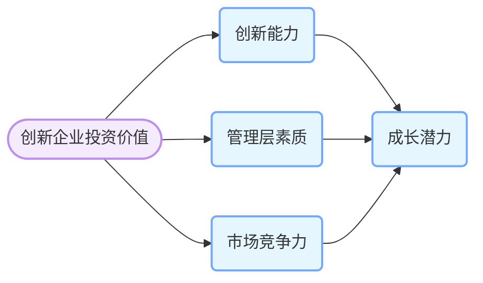

# 费雪的创新企业投资法则

> 关键词：费雪、创新企业、投资法则、成长股投资、基本面分析

> 摘要：本文深入探讨了费雪的创新企业投资法则。从背景介绍入手，阐述了该法则的目的、适用读者群体等信息。详细剖析了核心概念及联系，介绍了核心算法原理和具体操作步骤，并运用数学模型和公式进行进一步说明。通过项目实战案例，展示了该法则在实际投资中的应用。同时，列举了该法则的实际应用场景，推荐了相关的学习资源、开发工具框架以及论文著作。最后对未来发展趋势与挑战进行总结，还提供了常见问题解答和扩展阅读参考资料，旨在帮助投资者更好地理解和运用费雪的创新企业投资法则，提升投资决策的科学性和准确性。

## 1. 背景介绍 
### 1.1 目的和范围
费雪的创新企业投资法则旨在为投资者提供一套系统的方法，用于评估和选择具有长期成长潜力的创新企业进行投资。该法则主要关注企业的创新能力、管理层素质、产品或服务的市场竞争力等关键因素，帮助投资者识别那些能够在未来实现持续增长并为股东带来丰厚回报的企业。其范围涵盖了各个行业的创新型企业，无论是科技、医疗、消费还是其他领域，只要企业具备创新特质且符合法则中的评估标准，都可以成为投资的候选对象。

### 1.2 预期读者
本文的预期读者主要包括各类投资者，如个人投资者、机构投资者等。对于初涉投资领域的新手来说，费雪的创新企业投资法则可以作为入门指南，帮助他们建立正确的投资理念和方法；对于有一定投资经验的专业人士，该法则可以为他们提供新的思路和视角，进一步优化投资组合。此外，企业管理者、创业者也可以从该法则中了解投资者的关注点，从而更好地经营和发展企业。

### 1.3 文档结构概述
本文将按照以下结构展开：首先介绍费雪的创新企业投资法则的核心概念与联系，通过文本示意图和 Mermaid 流程图清晰展示相关概念之间的关系；接着阐述核心算法原理和具体操作步骤，并用 Python 源代码进行详细说明；然后运用数学模型和公式对法则进行量化分析，并举例说明；通过项目实战案例，展示该法则在实际投资中的应用，包括开发环境搭建、源代码实现和代码解读；列举该法则的实际应用场景；推荐相关的学习资源、开发工具框架以及论文著作；最后对未来发展趋势与挑战进行总结，提供常见问题解答和扩展阅读参考资料。

### 1.4 术语表
#### 1.4.1 核心术语定义
- **创新企业**：指那些在技术、产品、服务、商业模式等方面具有创新性，能够创造新的市场需求或显著提升现有市场效率的企业。
- **成长股**：是指发行股票的上市公司的销售额和利润额持续增长，且其增长速度快于整个国家和本行业的增长速度的股票。
- **定性分析**：是指对研究对象进行“质”的方面的分析，主要是运用归纳和演绎、分析与综合以及抽象与概括等方法，对获得的各种材料进行思维加工，从而能去粗取精、去伪存真、由此及彼、由表及里，达到认识事物本质、揭示内在规律。
- **定量分析**：是对社会现象的数量特征、数量关系与数量变化的分析，通过对数据的收集、整理和分析，以数学模型和统计方法为工具，对研究对象进行量化描述和预测。

#### 1.4.2 相关概念解释
- **创新溢价**：由于创新企业具有独特的技术、产品或商业模式，能够在市场中获得竞争优势，从而可能获得比传统企业更高的估值，这种因创新而产生的估值提升被称为创新溢价。
- **护城河**：是指企业通过各种方式建立起来的一种可持续的竞争优势，能够抵御竞争对手的侵蚀，保护企业的市场份额和盈利能力，如品牌优势、技术专利、成本优势等。

#### 1.4.3 缩略词列表
- **PE**：市盈率（Price-to-Earnings Ratio），是指股票价格除以每股收益（EPS）的比率，用于衡量股票的估值水平。
- **ROE**：净资产收益率（Return on Equity），是净利润与平均股东权益的百分比，反映了股东权益的收益水平，用以衡量公司运用自有资本的效率。

## 2. 核心概念与联系 

费雪的创新企业投资法则的核心概念主要包括创新能力、管理层素质、产品或服务的市场竞争力、成长潜力等。这些概念之间相互关联，共同构成了评估创新企业投资价值的基础。

### 文本示意图
```plaintext
                创新企业投资价值
                    |
        ┌──────────┼──────────┐
        │          │          │
  创新能力    管理层素质    市场竞争力
        │          │          │
        └──────────┼──────────┘
                    │
               成长潜力
```

### Mermaid 流程图


从流程图和示意图可以看出，创新能力、管理层素质和市场竞争力是影响创新企业投资价值的三个关键因素，而这三个因素又共同作用于企业的成长潜力。创新能力是企业持续发展的动力源泉，能够帮助企业推出具有竞争力的产品或服务；管理层素质决定了企业的战略决策和运营管理水平，对企业的发展方向和效率起着关键作用；市场竞争力则反映了企业在市场中的地位和盈利能力。这三个因素相互促进、相互影响，共同决定了企业的成长潜力，而成长潜力最终决定了企业的投资价值。

## 3. 核心算法原理 & 具体操作步骤 

### 核心算法原理
费雪的创新企业投资法则主要基于定性分析和定量分析相结合的方法。定性分析主要关注企业的创新能力、管理层素质、企业文化等非量化因素，通过对企业的深入调研和分析，评估企业的内在价值和发展潜力。定量分析则主要关注企业的财务指标，如营收增长率、净利润增长率、毛利率、ROE 等，通过对这些指标的计算和比较，评估企业的盈利能力和财务健康状况。

### 具体操作步骤
1. **筛选创新企业**：通过行业研究、新闻报道、专业机构推荐等渠道，筛选出具有创新特质的企业。可以关注企业的研发投入、专利数量、新产品推出频率等指标，初步确定候选企业名单。
2. **定性分析**
    - **创新能力评估**：考察企业的技术研发实力、创新团队的素质、创新文化的建设等方面。可以通过了解企业的研发投入占比、研发人员数量和质量、与科研机构的合作情况等进行评估。
    - **管理层素质评估**：考察管理层的战略眼光、决策能力、管理经验、团队凝聚力等方面。可以通过了解管理层的背景经历、过往业绩、对企业的长期规划等进行评估。
    - **企业文化评估**：考察企业的价值观、经营理念、团队氛围等方面。良好的企业文化能够吸引和留住优秀人才，促进企业的创新和发展。
3. **定量分析**
    - **财务指标计算**：计算企业的营收增长率、净利润增长率、毛利率、ROE 等财务指标，并与同行业企业进行比较。可以使用以下 Python 代码计算这些指标：

```python
import pandas as pd

# 假设已经获取了企业的财务数据，存储在 DataFrame 中
# 列名分别为 'revenue'（营收）、'net_income'（净利润）、'gross_profit'（毛利）、'equity'（股东权益）
financial_data = pd.DataFrame({
    'revenue': [100, 120, 150, 180],
    'net_income': [10, 12, 15, 18],
    'gross_profit': [30, 36, 45, 54],
    'equity': [50, 60, 70, 80]
})

# 计算营收增长率
revenue_growth_rate = (financial_data['revenue'].pct_change() * 100).dropna()
print('营收增长率：', revenue_growth_rate)

# 计算净利润增长率
net_income_growth_rate = (financial_data['net_income'].pct_change() * 100).dropna()
print('净利润增长率：', net_income_growth_rate)

# 计算毛利率
gross_margin = (financial_data['gross_profit'] / financial_data['revenue'] * 100)
print('毛利率：', gross_margin)

# 计算 ROE
roe = (financial_data['net_income'] / financial_data['equity'] * 100)
print('ROE：', roe)
```

    - **财务健康状况评估**：考察企业的资产负债率、流动比率、速动比率等指标，评估企业的财务风险和偿债能力。
4. **综合评估**：根据定性分析和定量分析的结果，对企业进行综合评估。对于在创新能力、管理层素质、市场竞争力和财务状况等方面表现优秀的企业，可以给予较高的投资评级。
5. **投资决策**：根据综合评估结果，结合自身的投资目标、风险承受能力等因素，做出投资决策。可以选择直接投资股票，也可以通过投资基金等方式间接参与创新企业的投资。

## 4. 数学模型和公式 & 详细讲解 & 举例说明 

### 数学模型和公式
#### 1. 营收增长率
营收增长率是指企业本期营业收入较上期营业收入的增长幅度，计算公式为：
$$营收增长率 = \frac{本期营收 - 上期营收}{上期营收} \times 100\%$$

#### 2. 净利润增长率
净利润增长率是指企业本期净利润较上期净利润的增长幅度，计算公式为：
$$净利润增长率 = \frac{本期净利润 - 上期净利润}{上期净利润} \times 100\%$$

#### 3. 毛利率
毛利率是指毛利占营业收入的百分比，反映了企业产品或服务的盈利能力，计算公式为：
$$毛利率 = \frac{毛利}{营业收入} \times 100\%$$
其中，毛利 = 营业收入 - 营业成本。

#### 4. ROE
ROE 是指净利润与平均股东权益的百分比，反映了股东权益的收益水平，计算公式为：
$$ROE = \frac{净利润}{平均股东权益} \times 100\%$$
其中，平均股东权益 = （期初股东权益 + 期末股东权益）/ 2。

### 详细讲解
- **营收增长率**：营收增长率是衡量企业业务扩张能力的重要指标。较高的营收增长率表明企业的市场份额在扩大，产品或服务的需求在增加，具有较好的发展前景。但需要注意的是，营收增长率的增长必须是可持续的，不能仅仅依靠短期的促销活动或市场波动来实现。
- **净利润增长率**：净利润增长率是衡量企业盈利能力增长的重要指标。与营收增长率相比，净利润增长率更能反映企业的实际盈利情况。如果企业的营收增长但净利润没有相应增长，可能是由于成本上升、费用增加等原因导致的，需要进一步分析。
- **毛利率**：毛利率反映了企业产品或服务的附加值和盈利能力。较高的毛利率意味着企业在产品或服务的定价上具有一定的优势，或者在成本控制方面做得较好。不同行业的毛利率水平差异较大，一般来说，高科技、医药等行业的毛利率相对较高，而传统制造业、零售业等行业的毛利率相对较低。
- **ROE**：ROE 是衡量企业运用自有资本效率的重要指标。较高的 ROE 表明企业能够有效地利用股东投入的资金创造利润，具有较强的盈利能力和股东回报能力。但需要注意的是，ROE 也可能受到财务杠杆的影响，如果企业通过大量举债来提高 ROE，可能会增加企业的财务风险。

### 举例说明
假设某创新企业在过去三年的财务数据如下：

| 年份 | 营收（万元） | 净利润（万元） | 毛利（万元） | 股东权益（万元） |
| ---- | ---- | ---- | ---- | ---- |
| 2020 | 1000 | 100 | 300 | 500 |
| 2021 | 1200 | 120 | 360 | 600 |
| 2022 | 1500 | 150 | 450 | 700 |

#### 1. 营收增长率
2021 年营收增长率 = $\frac{1200 - 1000}{1000} \times 100\% = 20\%$
2022 年营收增长率 = $\frac{1500 - 1200}{1200} \times 100\% = 25\%$

#### 2. 净利润增长率
2021 年净利润增长率 = $\frac{120 - 100}{100} \times 100\% = 20\%$
2022 年净利润增长率 = $\frac{150 - 120}{120} \times 100\% = 25\%$

#### 3. 毛利率
2020 年毛利率 = $\frac{300}{1000} \times 100\% = 30\%$
2021 年毛利率 = $\frac{360}{1200} \times 100\% = 30\%$
2022 年毛利率 = $\frac{450}{1500} \times 100\% = 30\%$

#### 4. ROE
2020 年 ROE = $\frac{100}{500} \times 100\% = 20\%$
2021 年 ROE = $\frac{120}{600} \times 100\% = 20\%$
2022 年 ROE = $\frac{150}{700} \times 100\% \approx 21.43\%$

从以上计算结果可以看出，该企业在过去三年中营收和净利润均保持了较高的增长率，毛利率稳定在 30%，ROE 也维持在较高水平，说明该企业具有较好的盈利能力和成长潜力。

## 5. 项目实战：代码实际案例和详细解释说明 
### 5.1  开发环境搭建
为了实现费雪的创新企业投资法则的量化分析，我们可以使用 Python 进行开发。以下是开发环境搭建的步骤：
1. **安装 Python**：从 Python 官方网站（https://www.python.org/downloads/）下载并安装 Python 3.x 版本。
2. **安装必要的库**：使用以下命令安装必要的 Python 库：
```sh
pip install pandas numpy matplotlib
```
- **pandas**：用于数据处理和分析。
- **numpy**：用于数值计算。
- **matplotlib**：用于数据可视化。

### 5.2  源代码详细实现和代码解读
以下是一个完整的 Python 代码示例，用于实现费雪的创新企业投资法则的量化分析：

```python
import pandas as pd
import numpy as np
import matplotlib.pyplot as plt

# 假设已经获取了多家企业的财务数据，存储在 DataFrame 中
# 列名分别为 'company_name'（企业名称）、'revenue'（营收）、'net_income'（净利润）、'gross_profit'（毛利）、'equity'（股东权益）
financial_data = pd.DataFrame({
    'company_name': ['Company A', 'Company B', 'Company C'],
    'revenue': [1000, 1200, 1500],
    'net_income': [100, 120, 150],
    'gross_profit': [300, 360, 450],
    'equity': [500, 600, 700]
})

# 计算各项财务指标
financial_data['revenue_growth_rate'] = (financial_data['revenue'].pct_change() * 100).dropna()
financial_data['net_income_growth_rate'] = (financial_data['net_income'].pct_change() * 100).dropna()
financial_data['gross_margin'] = (financial_data['gross_profit'] / financial_data['revenue'] * 100)
financial_data['roe'] = (financial_data['net_income'] / financial_data['equity'] * 100)

# 筛选出符合条件的企业
# 假设筛选条件为：营收增长率 > 20%，净利润增长率 > 20%，毛利率 > 30%，ROE > 20%
filtered_data = financial_data[
    (financial_data['revenue_growth_rate'] > 20) &
    (financial_data['net_income_growth_rate'] > 20) &
    (financial_data['gross_margin'] > 30) &
    (financial_data['roe'] > 20)
]

# 输出筛选结果
print('符合条件的企业：')
print(filtered_data[['company_name', 'revenue_growth_rate', 'net_income_growth_rate', 'gross_margin', 'roe']])

# 数据可视化
plt.figure(figsize=(10, 6))
plt.bar(filtered_data['company_name'], filtered_data['roe'])
plt.xlabel('企业名称')
plt.ylabel('ROE (%)')
plt.title('符合条件企业的 ROE 对比')
plt.show()
```

### 代码解读与分析
1. **数据准备**：首先，我们创建了一个包含多家企业财务数据的 DataFrame，包括企业名称、营收、净利润、毛利和股东权益等信息。
2. **财务指标计算**：使用 pandas 的 `pct_change()` 方法计算营收增长率和净利润增长率，使用简单的数学运算计算毛利率和 ROE，并将计算结果添加到 DataFrame 中。
3. **企业筛选**：根据预设的筛选条件，对企业进行筛选，筛选出营收增长率、净利润增长率、毛利率和 ROE 都满足要求的企业。
4. **结果输出**：输出符合条件的企业的相关财务指标信息，方便投资者进行分析和比较。
5. **数据可视化**：使用 matplotlib 库绘制符合条件企业的 ROE 柱状图，直观地展示企业之间的 ROE 差异。

通过以上代码，我们可以快速、准确地筛选出符合费雪创新企业投资法则的企业，并对其财务指标进行可视化分析，为投资决策提供参考。

## 6. 实际应用场景 
### 个人投资者
对于个人投资者来说，费雪的创新企业投资法则可以帮助他们在众多的股票中筛选出具有成长潜力的创新企业进行投资。通过对企业的创新能力、管理层素质、市场竞争力和财务状况等方面进行深入分析，个人投资者可以降低投资风险，提高投资回报。例如，个人投资者可以使用该法则筛选出科技、医疗等行业中具有创新特质的企业，长期持有这些企业的股票，分享企业成长带来的红利。

### 机构投资者
机构投资者如基金公司、保险公司等，通常管理着大量的资金，需要进行多元化的投资组合管理。费雪的创新企业投资法则可以为机构投资者提供一种科学的投资决策方法，帮助他们在不同行业和不同企业之间进行资产配置。机构投资者可以使用该法则筛选出一批具有潜力的创新企业，将其纳入投资组合中，以提高投资组合的整体收益和抗风险能力。

### 企业管理者
企业管理者可以从费雪的创新企业投资法则中了解投资者的关注点，从而更好地经营和发展企业。例如，企业管理者可以通过加强技术研发、提升管理层素质、优化产品或服务等方式，提高企业的创新能力和市场竞争力，以吸引更多的投资者关注和投资。同时，企业管理者还可以借鉴该法则中的财务分析方法，对企业的财务状况进行评估和优化，提高企业的盈利能力和财务健康状况。

## 7. 工具和资源推荐
### 7.1 学习资源推荐
#### 7.1.1 书籍推荐
- 《怎样选择成长股》：菲利普·费雪的经典著作，详细阐述了他的成长股投资理论和方法，是学习费雪投资法则的必读之书。
- 《聪明的投资者》：本杰明·格雷厄姆的经典著作，被誉为投资界的圣经，书中介绍了价值投资的基本理念和方法，对理解费雪的投资法则有很大的帮助。
- 《财务报表分析与证券定价》：斯蒂芬·佩因曼的著作，系统地介绍了财务报表分析的方法和技巧，以及如何运用财务报表分析进行证券定价，对于深入理解费雪的投资法则中的财务分析部分非常有帮助。

#### 7.1.2 在线课程
- Coursera 上的“投资学原理”课程：由知名高校的教授授课，系统地介绍了投资学的基本原理和方法，包括股票投资、债券投资、基金投资等方面的内容。
- 网易云课堂上的“财务报表分析实战”课程：通过实际案例讲解财务报表分析的方法和技巧，帮助学员掌握如何从财务报表中获取有用的信息，评估企业的财务状况和经营业绩。

#### 7.1.3 技术博客和网站
- 雪球网：国内知名的投资社区，汇聚了大量的投资者和投资专家，提供了丰富的股票分析、投资策略、行业研究等内容。
- 东方财富网：国内领先的财经网站，提供了全面的财经资讯、股票行情、财务数据等信息，方便投资者进行投资分析和决策。

### 7.2 开发工具框架推荐
#### 7.2.1 IDE和编辑器
- PyCharm：一款专业的 Python 集成开发环境，提供了丰富的代码编辑、调试、版本控制等功能，适合 Python 开发者使用。
- Jupyter Notebook：一种交互式的开发环境，支持 Python、R 等多种编程语言，方便用户进行数据分析和可视化。

#### 7.2.2 调试和性能分析工具
- PDB：Python 自带的调试工具，可以帮助开发者在代码中设置断点、单步执行代码、查看变量值等，方便进行代码调试。
- cProfile：Python 自带的性能分析工具，可以帮助开发者分析代码的执行时间和函数调用情况，找出代码中的性能瓶颈。

#### 7.2.3 相关框架和库
- pandas：用于数据处理和分析的 Python 库，提供了丰富的数据结构和数据操作方法，方便用户进行财务数据的处理和分析。
- numpy：用于数值计算的 Python 库，提供了高效的数组和矩阵运算功能，在财务指标计算等方面有广泛的应用。
- matplotlib：用于数据可视化的 Python 库，提供了丰富的绘图函数和工具，方便用户将财务数据可视化，直观地展示分析结果。

### 7.3 相关论文著作推荐
#### 7.3.1 经典论文
- 《The Capital Asset Pricing Model: Theory and Evidence》：由 Eugene F. Fama 和 Kenneth R. French 撰写，对资本资产定价模型进行了深入的研究和探讨，是现代金融理论的经典之作。
- 《Efficient Capital Markets: A Review of Theory and Empirical Work》：由 Eugene F. Fama 撰写，对有效市场假说进行了系统的阐述和总结，对投资理论和实践产生了深远的影响。

#### 7.3.2 最新研究成果
- 《Machine Learning for Asset Managers》：由 Marcos Lopez de Prado 撰写，介绍了机器学习在资产管理中的应用，为投资者提供了新的投资分析和决策方法。
- 《Factor-Based Investing》：由 Andrew Ang 撰写，对因子投资理论和方法进行了深入的研究和探讨，为投资者提供了一种新的资产配置思路。

#### 7.3.3 应用案例分析
- 《Case Studies in Finance: Managing for Corporate Value Creation》：由 Aswath Damodaran 撰写，通过实际案例分析，介绍了企业财务管理和价值创造的方法和技巧，对理解费雪的投资法则在企业中的应用有很大的帮助。

## 8. 总结：未来发展趋势与挑战
### 未来发展趋势
- **科技与投资的深度融合**：随着科技的不断发展，人工智能、大数据、区块链等技术将在投资领域得到更广泛的应用。这些技术可以帮助投资者更快速、准确地获取和分析信息，提高投资决策的科学性和准确性。例如，通过人工智能算法可以对海量的财务数据和新闻资讯进行分析，挖掘出有价值的投资线索；通过区块链技术可以实现投资交易的透明化和可追溯性，降低投资风险。
- **创新企业的多元化发展**：未来，创新企业将不仅仅局限于科技领域，还将在医疗、消费、能源等各个行业涌现。这些创新企业将通过技术创新、商业模式创新等方式，创造新的市场需求和商业机会。投资者需要不断拓宽投资视野，关注不同行业的创新企业，以获取更多的投资机会。
- **可持续投资的兴起**：随着社会对环境保护、社会责任等问题的关注度不断提高，可持续投资将成为未来投资的重要趋势。投资者将更加关注企业的环境、社会和治理（ESG）表现，选择那些具有良好 ESG 表现的创新企业进行投资。这不仅有助于推动企业的可持续发展，也符合投资者的长期利益。

### 挑战
- **信息过载与虚假信息**：在信息爆炸的时代，投资者面临着海量的信息，如何从这些信息中筛选出有价值的信息是一个挑战。同时，虚假信息的存在也增加了投资者的决策难度，容易导致投资失误。
- **创新企业的不确定性**：创新企业通常具有较高的不确定性，其技术研发、市场推广等方面都存在风险。投资者需要具备较强的风险识别和承受能力，才能在投资创新企业时获得较好的回报。
- **市场竞争加剧**：随着越来越多的投资者关注创新企业，市场竞争将日益加剧。这可能导致创新企业的估值偏高，投资回报率下降。投资者需要更加谨慎地选择投资标的，避免盲目跟风。

## 9. 附录：常见问题与解答
### 问题 1：费雪的创新企业投资法则适用于所有行业吗？
答：费雪的创新企业投资法则适用于大多数行业，但不同行业的创新特点和评估标准可能会有所不同。例如，科技行业的创新主要体现在技术研发和产品创新方面，而消费行业的创新可能更多地体现在商业模式和营销手段的创新方面。投资者在应用该法则时，需要结合不同行业的特点进行具体分析。

### 问题 2：如何评估企业的创新能力？
答：可以从以下几个方面评估企业的创新能力：
- **研发投入**：企业的研发投入占比是衡量其创新意愿和能力的重要指标。较高的研发投入通常意味着企业更加重视技术创新。
- **专利数量和质量**：专利是企业创新成果的重要体现，专利数量和质量可以反映企业的技术实力和创新能力。
- **新产品推出频率**：企业能够频繁推出新产品，说明其具有较强的创新能力和市场响应能力。
- **创新团队素质**：创新团队的素质和经验对企业的创新能力起着关键作用。可以通过了解创新团队的成员背景、研发成果等方面来评估其素质。

### 问题 3：财务指标在费雪的创新企业投资法则中起到什么作用？
答：财务指标在费雪的创新企业投资法则中起到重要的辅助作用。通过对企业的营收增长率、净利润增长率、毛利率、ROE 等财务指标的分析，可以评估企业的盈利能力、成长潜力和财务健康状况。财务指标可以帮助投资者筛选出具有投资价值的企业，并对企业的投资价值进行量化评估。但需要注意的是，财务指标只是投资决策的一个方面，不能仅仅依靠财务指标来做出投资决策，还需要结合企业的创新能力、管理层素质等非量化因素进行综合分析。

## 10. 扩展阅读 & 参考资料
- 《投资最重要的事》，霍华德·马克斯著
- 《金融炼金术》，乔治·索罗斯著
- 财经杂志《财新》、《证券市场周刊》等
- 投资研究机构的报告，如晨星、穆迪等

作者：AI天才研究院/AI Genius Institute & 禅与计算机程序设计艺术 /Zen And The Art of Computer Programming