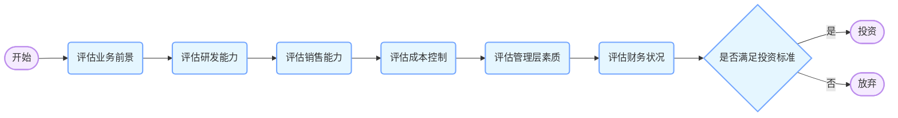

# 费雪的十五个投资点及其现代应用

> 关键词：费雪、十五个投资点、投资分析、现代应用、价值投资

> 摘要：本文围绕费雪的十五个投资点展开深入探讨。首先介绍了费雪投资理论提出的背景以及相关的核心概念，详细阐述了十五个投资点的原理和具体内容。接着通过数学模型和公式对投资点背后的逻辑进行分析，并结合实际案例说明其应用。在项目实战部分，展示了如何运用费雪的投资点进行股票投资分析，包括开发环境搭建、源代码实现和解读。还探讨了其在现代金融市场中的实际应用场景，推荐了相关的学习资源、开发工具和论文著作。最后总结了费雪投资理论未来的发展趋势与挑战，以及常见问题的解答和参考资料，旨在帮助投资者更好地理解和运用费雪的投资智慧。

## 1. 背景介绍 
### 1.1 目的和范围
本文章的目的在于全面、深入地介绍费雪的十五个投资点，并探讨其在现代投资领域的应用。费雪作为投资界的传奇人物，其投资理论具有重要的价值和影响力。我们将详细剖析这十五个投资点的内涵、原理和实践方法，帮助投资者更好地理解和运用这些投资原则。范围涵盖了费雪投资理论的基本概念、核心算法、数学模型、实际应用案例以及相关的学习资源和工具推荐等方面。

### 1.2 预期读者
本文预期读者包括对投资领域感兴趣的初学者、有一定投资经验的投资者、金融专业的学生以及从事金融研究和投资分析的专业人士。无论是想要系统学习投资理论的新手，还是希望进一步提升投资分析能力的老手，都能从本文中获得有价值的信息和启发。

### 1.3 文档结构概述
本文将按照以下结构进行阐述：首先介绍费雪投资理论的背景和相关概念，包括术语表的解释；接着详细讲解十五个投资点的核心概念、联系以及原理；通过Python代码阐述相关的核心算法和具体操作步骤；用数学模型和公式对投资点进行进一步分析，并举例说明；在项目实战部分展示如何运用这些投资点进行实际的投资分析；探讨其在现代金融市场中的应用场景；推荐相关的学习资源、开发工具和论文著作；最后总结未来发展趋势与挑战，解答常见问题并提供参考资料。

### 1.4 术语表
#### 1.4.1 核心术语定义
- **费雪的十五个投资点**：是由投资大师菲利普·费雪（Philip A. Fisher）提出的一系列用于评估公司投资价值的要点，涵盖了公司的业务、管理、财务等多个方面。
- **价值投资**：一种投资策略，强调通过分析公司的内在价值来选择投资标的，寻找被市场低估的股票，以获取长期的投资回报。
- **内在价值**：公司的真实价值，基于其未来的盈利能力、资产状况、竞争优势等因素进行评估。

#### 1.4.2 相关概念解释
- **竞争优势**：公司在市场中相对于竞争对手所具有的独特优势，如技术领先、品牌优势、成本优势等，能够帮助公司获得更高的市场份额和利润。
- **管理层能力**：公司管理层在制定战略、组织运营、决策管理等方面的能力和素质，对公司的发展和业绩有着重要影响。
- **财务健康**：公司的财务状况良好，包括合理的资产负债结构、稳定的现金流、盈利能力等，能够保证公司的持续运营和发展。

#### 1.4.3 缩略词列表
- **EPS**：Earnings Per Share，每股收益，反映公司普通股股东的每股盈利情况。
- **ROE**：Return on Equity，净资产收益率，衡量公司运用自有资本的效率和盈利能力。

## 2. 核心概念与联系 
费雪的十五个投资点是一套全面而系统的投资分析框架，旨在帮助投资者筛选出具有长期投资价值的公司。这些投资点相互关联，共同构成了一个完整的评估体系。

### 核心概念原理
费雪认为，投资者应该关注公司的基本面，寻找那些具有持续竞争优势、优秀管理层和良好财务状况的公司。十五个投资点从不同角度对公司进行评估，包括公司的业务前景、研发能力、销售能力、成本控制、管理层素质等。通过对这些方面的综合分析，投资者可以更准确地判断公司的投资价值。

### 架构的文本示意图
|投资点分类|具体投资点|
|---|---|
|业务前景|1. 公司的产品或服务有无充分市场潜力，至少几年内营业额能否大幅成长<br>2. 为了进一步提高总体销售水平，发现新的产品增长点，管理层是否决心继续开发新产品或新工艺|
|研发能力|3. 与公司的规模相比，公司的研发努力有多大的效果|
|销售能力|4. 公司有没有高人一等的销售组织|
|成本控制|5. 公司的利润率高不高<br>6. 公司做了什么事，以维持或改善利润率|
|管理层素质|7. 公司的劳资和人事关系是否很好<br>8. 公司的高级主管关系很好吗<br>9. 公司管理阶层的深度够吗<br>10. 公司的成本分析和会计记录做得如何<br>11. 对于公司的短期和长期利润目标，管理层是否有令人信服的态度<br>12. 公司是否在所处领域有独到之处<br>13. 公司是否有短期或长期的盈余展望|
|财务状况|14. 公司的股东权益报酬率是否令人满意<br>15. 公司是否把每一分钱都花在刀刃上|

### Mermaid 流程图


## 3. 核心算法原理 & 具体操作步骤 
### 核心算法原理
在运用费雪的十五个投资点进行投资分析时，我们可以将每个投资点看作一个评估指标，通过对每个指标进行打分，然后综合计算得分来判断公司的投资价值。以下是一个简单的Python代码示例，用于演示如何实现这个过程：

```python
# 定义每个投资点的权重
weights = {
    1: 0.1, 2: 0.1, 3: 0.08, 4: 0.08, 5: 0.08, 6: 0.08, 7: 0.08, 8: 0.08, 9: 0.08, 10: 0.06, 11: 0.06, 12: 0.06, 13: 0.06, 14: 0.06, 15: 0.06
}

# 定义每个投资点的得分（0 - 10分）
scores = {
    1: 8, 2: 7, 3: 6, 4: 7, 5: 7, 6: 6, 7: 8, 8: 7, 9: 7, 10: 6, 11: 7, 12: 6, 13: 7, 14: 7, 15: 6
}

# 计算综合得分
total_score = 0
for i in range(1, 16):
    total_score += weights[i] * scores[i]

print(f"综合得分: {total_score}")
```

### 具体操作步骤
1. **确定权重**：根据每个投资点的重要性，确定其在综合评估中的权重。权重的分配可以根据投资者的个人经验和偏好进行调整。
2. **打分**：对每个投资点进行评估，并给出相应的得分（0 - 10分）。得分的高低反映了公司在该投资点上的表现。
3. **计算综合得分**：将每个投资点的得分乘以其权重，然后相加得到综合得分。综合得分越高，说明公司的投资价值越高。
4. **决策**：根据综合得分，判断是否对该公司进行投资。可以设定一个阈值，当综合得分超过阈值时，考虑投资；否则，放弃投资。

## 4. 数学模型和公式 & 详细讲解 & 举例说明 
### 数学模型和公式
设 $w_i$ 为第 $i$ 个投资点的权重，$s_i$ 为第 $i$ 个投资点的得分，$n$ 为投资点的总数（$n = 15$），则综合得分 $S$ 的计算公式为：

$$S = \sum_{i = 1}^{n} w_i s_i$$

### 详细讲解
这个公式的原理是将每个投资点的得分按照其重要性进行加权求和，得到一个综合的评估分数。权重 $w_i$ 反映了每个投资点在整体评估中的相对重要性，得分 $s_i$ 反映了公司在该投资点上的表现。通过加权求和，可以更全面、客观地评估公司的投资价值。

### 举例说明
假设我们对一家公司的十五个投资点进行评估，得到的得分和权重如下表所示：

|投资点编号|权重 $w_i$|得分 $s_i$|
|---|---|---|
|1|0.1|8|
|2|0.1|7|
|3|0.08|6|
|4|0.08|7|
|5|0.08|7|
|6|0.08|6|
|7|0.08|8|
|8|0.08|7|
|9|0.08|7|
|10|0.06|6|
|11|0.06|7|
|12|0.06|6|
|13|0.06|7|
|14|0.06|7|
|15|0.06|6|

将这些值代入公式 $S = \sum_{i = 1}^{n} w_i s_i$ 中，可得：

$$
\begin{align*}
S &= 0.1\times8 + 0.1\times7 + 0.08\times6 + 0.08\times7 + 0.08\times7 + 0.08\times6 + 0.08\times8 + 0.08\times7 + 0.08\times7 + 0.06\times6 + 0.06\times7 + 0.06\times6 + 0.06\times7 + 0.06\times7 + 0.06\times6\\
&= 0.8 + 0.7 + 0.48 + 0.56 + 0.56 + 0.48 + 0.64 + 0.56 + 0.56 + 0.36 + 0.42 + 0.36 + 0.42 + 0.42 + 0.36\\
&= 7.02
\end{align*}
$$

综合得分 $S = 7.02$，我们可以根据这个得分来判断该公司的投资价值。如果我们设定的阈值为 7 分，那么该公司达到了投资标准，可以进一步考虑投资。

## 5. 项目实战：代码实际案例和详细解释说明 
### 5.1  开发环境搭建
为了实现运用费雪的十五个投资点进行投资分析的项目，我们需要搭建以下开发环境：
- **Python 环境**：建议使用 Python 3.7 及以上版本。可以从 Python 官方网站（https://www.python.org/downloads/）下载并安装。
- **开发工具**：推荐使用 PyCharm 或 VS Code 作为开发工具。这些工具提供了丰富的代码编辑和调试功能，方便我们进行项目开发。
- **相关库**：需要安装 `pandas` 和 `numpy` 库，用于数据处理和分析。可以使用以下命令进行安装：
```sh
pip install pandas numpy
```

### 5.2  源代码详细实现和代码解读
以下是一个完整的 Python 代码示例，用于实现运用费雪的十五个投资点进行投资分析的功能：

```python
import pandas as pd
import numpy as np

# 定义每个投资点的权重
weights = {
    1: 0.1, 2: 0.1, 3: 0.08, 4: 0.08, 5: 0.08, 6: 0.08, 7: 0.08, 8: 0.08, 9: 0.08, 10: 0.06, 11: 0.06, 12: 0.06, 13: 0.06, 14: 0.06, 15: 0.06
}

# 定义投资点的名称
investment_points = {
    1: "公司的产品或服务有无充分市场潜力，至少几年内营业额能否大幅成长",
    2: "为了进一步提高总体销售水平，发现新的产品增长点，管理层是否决心继续开发新产品或新工艺",
    3: "与公司的规模相比，公司的研发努力有多大的效果",
    4: "公司有没有高人一等的销售组织",
    5: "公司的利润率高不高",
    6: "公司做了什么事，以维持或改善利润率",
    7: "公司的劳资和人事关系是否很好",
    8: "公司的高级主管关系很好吗",
    9: "公司管理阶层的深度够吗",
    10: "公司的成本分析和会计记录做得如何",
    11: "对于公司的短期和长期利润目标，管理层是否有令人信服的态度",
    12: "公司是否在所处领域有独到之处",
    13: "公司是否有短期或长期的盈余展望",
    14: "公司的股东权益报酬率是否令人满意",
    15: "公司是否把每一分钱都花在刀刃上"
}

# 定义一个函数，用于输入每个投资点的得分
def input_scores():
    scores = {}
    for i in range(1, 16):
        while True:
            try:
                score = int(input(f"请输入 {investment_points[i]} 的得分（0 - 10分）: "))
                if 0 <= score <= 10:
                    scores[i] = score
                    break
                else:
                    print("得分必须在 0 - 10 分之间，请重新输入。")
            except ValueError:
                print("输入无效，请输入一个整数。")
    return scores

# 定义一个函数，用于计算综合得分
def calculate_total_score(scores, weights):
    total_score = 0
    for i in range(1, 16):
        total_score += weights[i] * scores[i]
    return total_score

# 主程序
if __name__ == "__main__":
    print("欢迎使用费雪的十五个投资点投资分析系统！")
    scores = input_scores()
    total_score = calculate_total_score(scores, weights)
    print(f"综合得分: {total_score}")
    if total_score >= 7:
        print("该公司达到了投资标准，可以进一步考虑投资。")
    else:
        print("该公司未达到投资标准，建议谨慎考虑。")
```

### 5.3  代码解读与分析
- **权重和投资点名称的定义**：通过字典 `weights` 定义了每个投资点的权重，通过字典 `investment_points` 定义了每个投资点的名称，方便后续的输入提示和输出显示。
- **输入得分的函数 `input_scores`**：该函数通过循环提示用户输入每个投资点的得分，并进行有效性检查，确保得分在 0 - 10 分之间。
- **计算综合得分的函数 `calculate_total_score`**：该函数根据输入的得分和权重，使用加权求和的方法计算综合得分。
- **主程序**：在主程序中，首先欢迎用户使用系统，然后调用 `input_scores` 函数获取用户输入的得分，再调用 `calculate_total_score` 函数计算综合得分，最后根据综合得分判断是否达到投资标准，并输出相应的提示信息。

## 6. 实际应用场景 
费雪的十五个投资点在现代投资领域有着广泛的应用场景，以下是一些常见的应用场景：
- **股票投资**：投资者可以运用十五个投资点对上市公司进行评估，筛选出具有投资价值的股票。通过对公司的业务前景、管理层素质、财务状况等方面的分析，判断公司的长期发展潜力和投资价值。
- **基金投资**：基金经理在选择投资标的时，可以参考十五个投资点的原则，评估基金所投资的公司的质量。同时，投资者在选择基金时，也可以了解基金经理的投资策略是否符合费雪的投资理念。
- **风险投资**：风险投资家在评估创业公司的投资价值时，可以运用十五个投资点的方法，考察创业公司的产品创新能力、市场潜力、管理团队等方面的情况，从而做出投资决策。
- **企业并购**：在企业并购过程中，收购方可以使用十五个投资点对目标企业进行全面评估，了解目标企业的优势和劣势，为并购决策提供依据。

## 7. 工具和资源推荐
### 7.1 学习资源推荐
#### 7.1.1 书籍推荐
- 《怎样选择成长股》（Common Stocks and Uncommon Profits）：菲利普·费雪的经典著作，详细阐述了他的投资理念和十五个投资点的内容，是学习费雪投资理论的必读之书。
- 《聪明的投资者》（The Intelligent Investor）：本杰明·格雷厄姆的著作，与费雪的投资理论相互补充，强调了价值投资的重要性和方法。
- 《投资最重要的事》（The Most Important Thing Illuminated）：霍华德·马克斯的著作，探讨了投资中的各种重要问题和原则，对投资者有很大的启发。

#### 7.1.2 在线课程
- Coursera 平台上的“投资学原理”课程：由知名大学的教授授课，系统地介绍了投资学的基本原理和方法，包括价值投资、股票分析等内容。
- edX 平台上的“金融市场”课程：涵盖了金融市场的各个方面，包括股票市场、债券市场、基金市场等，对理解投资环境和投资策略有很大帮助。

#### 7.1.3 技术博客和网站
- 雪球网（https://xueqiu.com/）：国内知名的投资交流社区，提供了丰富的股票分析、投资策略分享等内容，投资者可以在这里学习到其他投资者的经验和见解。
- 晨星网（https://www.morningstar.cn/）：提供专业的基金评级、分析和研究报告，对基金投资者有很大的参考价值。

### 7.2 开发工具框架推荐
#### 7.2.1 IDE和编辑器
- PyCharm：一款专业的 Python 集成开发环境，提供了丰富的代码编辑、调试和分析功能，适合进行 Python 项目开发。
- VS Code：一款轻量级的代码编辑器，支持多种编程语言，具有丰富的插件生态系统，可以方便地进行 Python 开发。

#### 7.2.2 调试和性能分析工具
- `pdb`：Python 内置的调试器，可以帮助开发者定位和解决代码中的问题。
- `cProfile`：Python 标准库中的性能分析工具，可以分析代码的执行时间和性能瓶颈。

#### 7.2.3 相关框架和库
- `pandas`：用于数据处理和分析的 Python 库，提供了丰富的数据结构和数据操作方法，方便进行投资数据的处理和分析。
- `numpy`：Python 的数值计算库，提供了高效的数组操作和数学函数，是进行数据分析和科学计算的基础库。

### 7.3 相关论文著作推荐
#### 7.3.1 经典论文
- “The Theory of Investment Value”（投资价值理论）：由约翰·伯尔·威廉姆斯（John Burr Williams）撰写，提出了股票内在价值的贴现现金流模型，对价值投资理论的发展产生了重要影响。
- “Security Analysis”（证券分析）：本杰明·格雷厄姆和戴维·多德（David Dodd）的经典著作，奠定了价值投资的理论基础。

#### 7.3.2 最新研究成果
- 关注顶级金融学术期刊，如《Journal of Finance》（金融杂志）、《Review of Financial Studies》（金融研究评论）等，了解投资领域的最新研究成果和发展趋势。

#### 7.3.3 应用案例分析
- 可以参考一些知名投资机构的研究报告和案例分析，了解他们在实际投资中如何运用费雪的投资理论和其他投资策略。

## 8. 总结：未来发展趋势与挑战
### 未来发展趋势
- **与科技的融合**：随着科技的不断发展，大数据、人工智能等技术将在投资分析中得到更广泛的应用。投资者可以利用这些技术更高效地收集和分析数据，运用费雪的投资点进行更准确的投资决策。
- **全球视野**：在全球化的背景下，投资者的视野将更加开阔，不再局限于本国市场。费雪的投资理论可以应用于全球范围内的公司评估，帮助投资者寻找具有投资价值的国际企业。
- **可持续投资**：越来越多的投资者开始关注企业的社会责任和可持续发展能力。费雪的投资点可以进一步扩展，将环境、社会和治理（ESG）因素纳入评估体系，以满足投资者对可持续投资的需求。

### 挑战
- **数据质量和可靠性**：运用费雪的投资点进行分析需要大量的数据支持，但数据的质量和可靠性可能存在问题。不准确或不完整的数据可能导致错误的投资决策。
- **市场变化的不确定性**：金融市场是复杂多变的，公司的经营状况和市场环境可能随时发生变化。投资者需要不断更新和调整对公司的评估，以适应市场的变化。
- **主观判断的影响**：在评估每个投资点时，不可避免地会受到投资者主观判断的影响。不同的投资者可能对同一公司的评估结果存在差异，这增加了投资决策的难度。

## 9. 附录：常见问题与解答
### 问题 1：如何确定每个投资点的权重？
答：每个投资点的权重可以根据投资者的个人经验、投资目标和市场情况进行调整。一般来说，对于投资者认为比较重要的投资点，可以赋予较高的权重；对于相对次要的投资点，可以赋予较低的权重。也可以参考一些专业投资机构的研究报告和建议来确定权重。

### 问题 2：费雪的十五个投资点适用于所有类型的公司吗？
答：费雪的十五个投资点是一个通用的投资分析框架，但并不是适用于所有类型的公司。对于一些新兴行业的公司，可能需要根据其特点对投资点进行适当的调整和补充。例如，对于科技初创公司，可能需要更关注其技术创新能力和团队的技术背景。

### 问题 3：如何获取评估公司所需的数据？
答：可以通过多种途径获取评估公司所需的数据，如公司的年报、季报、招股说明书等公开披露的信息；金融数据提供商，如 Bloomberg、Wind 等；行业研究报告和新闻媒体等。

### 问题 4：综合得分达到多少可以考虑投资？
答：综合得分的阈值可以根据投资者的风险偏好和投资目标来确定。一般来说，得分越高，公司的投资价值越高。投资者可以根据自己的经验和市场情况设定一个合适的阈值，如 7 分或 8 分。

## 10. 扩展阅读 & 参考资料
- 菲利普·费雪. 《怎样选择成长股》. 海南出版社.
- 本杰明·格雷厄姆. 《聪明的投资者》. 人民邮电出版社.
- 霍华德·马克斯. 《投资最重要的事》. 中信出版社.
- John Burr Williams. “The Theory of Investment Value”. Harvard University Press.
- Benjamin Graham, David Dodd. “Security Analysis”. McGraw - Hill.
- 雪球网：https://xueqiu.com/
- 晨星网：https://www.morningstar.cn/

作者：AI天才研究院/AI Genius Institute & 禅与计算机程序设计艺术 /Zen And The Art of Computer Programming