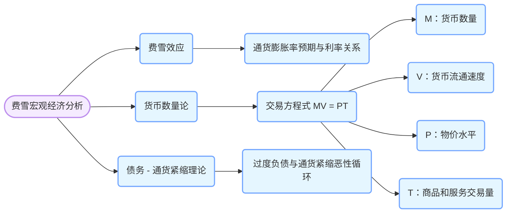

# 费雪的宏观经济分析：把握大趋势

> 关键词：费雪、宏观经济分析、大趋势、经济理论、经济预测

> 摘要：本文围绕费雪的宏观经济分析展开，深入探讨其核心概念、算法原理、数学模型等内容。通过详细的理论阐述与实际案例分析，展示费雪宏观经济分析在把握经济大趋势方面的重要作用。同时介绍了相关的开发环境搭建、实际应用场景、工具和资源推荐等内容，最后对费雪宏观经济分析的未来发展趋势与挑战进行总结，并提供常见问题解答及扩展阅读参考资料，旨在帮助读者全面理解和运用费雪的宏观经济分析方法。

## 1. 背景介绍 
### 1.1 目的和范围
费雪作为经济学领域的重要人物，其宏观经济分析理论在经济研究和实践中具有广泛的应用。本文的目的在于深入剖析费雪的宏观经济分析方法，包括其核心概念、算法原理、数学模型等，帮助读者理解如何运用这些理论来把握宏观经济的大趋势。范围涵盖费雪宏观经济分析的基本理论、实际应用案例以及相关的工具和资源推荐等方面。

### 1.2 预期读者
本文预期读者包括经济学专业的学生、研究人员，金融行业从业者，以及对宏观经济分析感兴趣的普通读者。无论是希望深入学习经济学理论的专业人士，还是想要了解宏观经济趋势以做出合理决策的非专业人士，都能从本文中获得有价值的信息。

### 1.3 文档结构概述
本文共分为十个部分。第一部分为背景介绍，阐述文章的目的、范围、预期读者和文档结构。第二部分介绍费雪宏观经济分析的核心概念与联系，包括相关原理和架构的示意图。第三部分讲解核心算法原理和具体操作步骤，并使用Python源代码进行详细阐述。第四部分介绍数学模型和公式，并进行详细讲解和举例说明。第五部分通过项目实战，展示代码实际案例并进行详细解释。第六部分探讨费雪宏观经济分析的实际应用场景。第七部分推荐相关的学习资源、开发工具框架和论文著作。第八部分总结费雪宏观经济分析的未来发展趋势与挑战。第九部分为附录，提供常见问题与解答。第十部分列出扩展阅读和参考资料。

### 1.4 术语表
#### 1.4.1 核心术语定义
- **费雪效应**：是由著名的经济学家费雪第一个揭示了通货膨胀率预期与利率之间关系的一个发现，它指出当通货膨胀率预期上升时，利率也将上升。
- **货币数量论**：是一种用流通中的货币数量的变动来说明商品价格变动的货币理论，费雪提出了交易方程式 $MV = PT$，其中 $M$ 为货币数量，$V$ 为货币流通速度，$P$ 为物价水平，$T$ 为商品和服务的交易量。
- **债务 - 通货紧缩理论**：费雪认为，经济衰退是由过度负债和通货紧缩相互作用引起的。当经济中出现过度负债时，债务人会被迫出售资产来偿还债务，这会导致资产价格下降，进而引发通货紧缩，进一步加重债务人的负担，形成恶性循环。

#### 1.4.2 相关概念解释
- **宏观经济分析**：是指以国民经济总体活动为对象，通过对一些宏观经济指标的分析，研究国民经济中各有关总量的决定及其变化，以解决宏观经济运行中的各种问题。
- **经济趋势**：是指经济活动在一定时期内的发展方向和变化态势，包括经济增长、通货膨胀、失业等方面的趋势。

#### 1.4.3 缩略词列表
- **GDP**：国内生产总值（Gross Domestic Product），是指一个国家（或地区）所有常住单位在一定时期内生产活动的最终成果。
- **CPI**：消费者物价指数（Consumer Price Index），是反映居民家庭一般所购买的消费品和服务项目价格水平变动情况的宏观经济指标。

## 2. 核心概念与联系 
费雪的宏观经济分析主要基于几个核心概念，包括费雪效应、货币数量论和债务 - 通货紧缩理论。这些概念之间相互联系，共同构成了费雪宏观经济分析的理论框架。

### 核心概念原理和架构的文本示意图
```plaintext
费雪宏观经济分析
|-- 费雪效应
|   |-- 通货膨胀率预期与利率的关系
|-- 货币数量论
|   |-- 交易方程式 MV = PT
|   |   |-- M：货币数量
|   |   |-- V：货币流通速度
|   |   |-- P：物价水平
|   |   |-- T：商品和服务的交易量
|-- 债务 - 通货紧缩理论
|   |-- 过度负债与通货紧缩的恶性循环
```

### Mermaid 流程图


费雪效应表明通货膨胀率预期会影响利率水平。当人们预期通货膨胀率上升时，为了保持实际利率不变，名义利率会相应上升。货币数量论则强调货币数量、货币流通速度、物价水平和商品服务交易量之间的关系。如果货币数量增加，而货币流通速度和商品服务交易量不变，物价水平就会上升。债务 - 通货紧缩理论指出，过度负债会导致债务人出售资产，从而引发资产价格下降和通货紧缩，进一步加重债务负担，形成恶性循环。

## 3. 核心算法原理 & 具体操作步骤 
### 费雪效应的算法原理及 Python 实现
费雪效应可以用公式表示为：$i = r + \pi^e$，其中 $i$ 为名义利率，$r$ 为实际利率，$\pi^e$ 为预期通货膨胀率。

以下是一个简单的 Python 代码示例，用于计算名义利率：
```python
def fisher_effect(real_interest_rate, expected_inflation_rate):
    """
    计算名义利率
    :param real_interest_rate: 实际利率
    :param expected_inflation_rate: 预期通货膨胀率
    :return: 名义利率
    """
    nominal_interest_rate = real_interest_rate + expected_inflation_rate
    return nominal_interest_rate

# 示例数据
real_rate = 0.03  # 实际利率为 3%
expected_inflation = 0.02  # 预期通货膨胀率为 2%

# 计算名义利率
nominal_rate = fisher_effect(real_rate, expected_inflation)
print(f"名义利率为: {nominal_rate * 100}%")
```
### 代码解释
在上述代码中，定义了一个名为 `fisher_effect` 的函数，该函数接受实际利率和预期通货膨胀率作为参数，根据费雪效应公式计算名义利率并返回结果。然后，使用示例数据调用该函数并打印出计算得到的名义利率。

### 货币数量论的算法原理及 Python 实现
货币数量论的交易方程式为 $MV = PT$，如果已知其中三个变量的值，可以求解第四个变量。以下是一个求解物价水平 $P$ 的 Python 代码示例：
```python
def quantity_theory_of_money(money_supply, velocity, transactions):
    """
    根据货币数量论计算物价水平
    :param money_supply: 货币数量
    :param velocity: 货币流通速度
    :param transactions: 商品和服务的交易量
    :return: 物价水平
    """
    price_level = (money_supply * velocity) / transactions
    return price_level

# 示例数据
money = 1000  # 货币数量
velocity = 2  # 货币流通速度
transactions = 500  # 商品和服务的交易量

# 计算物价水平
price = quantity_theory_of_money(money, velocity, transactions)
print(f"物价水平为: {price}")
```
### 代码解释
在这个代码中，定义了一个名为 `quantity_theory_of_money` 的函数，该函数接受货币数量、货币流通速度和商品服务交易量作为参数，根据交易方程式计算物价水平并返回结果。然后，使用示例数据调用该函数并打印出计算得到的物价水平。

## 4. 数学模型和公式 & 详细讲解 & 举例说明 
### 费雪效应公式
费雪效应的公式为 $i = r + \pi^e$，其中：
- $i$ 表示名义利率，是指银行公布的利率，它包含了通货膨胀因素。
- $r$ 表示实际利率，是指剔除通货膨胀因素后投资者实际获得的利率。
- $\pi^e$ 表示预期通货膨胀率，是人们对未来一段时间内通货膨胀率的预期。

举例说明：假设实际利率为 $3\%$，预期通货膨胀率为 $2\%$，根据费雪效应公式，名义利率 $i = 3\% + 2\% = 5\%$。这意味着在预期通货膨胀率为 $2\%$ 的情况下，为了获得 $3\%$ 的实际利率，名义利率需要达到 $5\%$。

### 货币数量论交易方程式
交易方程式 $MV = PT$ 中：
- $M$ 代表货币数量，是指在一定时期内流通中的货币总量。
- $V$ 代表货币流通速度，是指单位货币在一定时期内的平均周转次数。
- $P$ 代表物价水平，是指商品和服务的平均价格。
- $T$ 代表商品和服务的交易量，是指在一定时期内实际交易的商品和服务的数量。

举例说明：假设货币数量 $M = 1000$，货币流通速度 $V = 2$，商品和服务的交易量 $T = 500$，根据交易方程式可以计算出物价水平 $P$：
$$P=\frac{MV}{T}=\frac{1000\times2}{500}=4$$

### 债务 - 通货紧缩理论相关公式
虽然债务 - 通货紧缩理论没有一个像费雪效应和货币数量论那样简洁的公式，但可以用一些数学关系来描述其核心思想。假设初始债务为 $D_0$，资产价格为 $A_0$，物价水平为 $P_0$。当债务人出售资产偿还债务时，资产价格下降到 $A_1$，物价水平下降到 $P_1$。债务人的实际债务负担 $D_{real}$ 可以表示为：
$$D_{real}=\frac{D_0}{P}$$
随着物价水平 $P$ 的下降，实际债务负担 $D_{real}$ 会增加。例如，初始债务 $D_0 = 100$，物价水平 $P_0 = 1$，实际债务负担 $D_{real0}=\frac{100}{1}=100$。当物价水平下降到 $P_1 = 0.8$ 时，实际债务负担 $D_{real1}=\frac{100}{0.8}=125$，实际债务负担增加了。

## 5. 项目实战：代码实际案例和详细解释说明 
### 5.1  开发环境搭建
要运行上述代码，需要搭建一个 Python 开发环境。以下是具体步骤：
1. **安装 Python**：从 Python 官方网站（https://www.python.org/downloads/）下载并安装适合你操作系统的 Python 版本。建议安装 Python 3.7 及以上版本。
2. **安装开发工具**：可以选择使用集成开发环境（IDE），如 PyCharm、Visual Studio Code 等，也可以使用文本编辑器，如 Sublime Text、Notepad++ 等。这里以 PyCharm 为例，从 JetBrains 官方网站（https://www.jetbrains.com/pycharm/download/）下载并安装 PyCharm 社区版。
3. **创建项目**：打开 PyCharm，选择“Create New Project”，选择项目的存储路径和 Python 解释器，然后点击“Create”创建项目。

### 5.2  源代码详细实现和代码解读
以下是一个结合费雪效应和货币数量论的完整 Python 代码示例：
```python
def fisher_effect(real_interest_rate, expected_inflation_rate):
    """
    计算名义利率
    :param real_interest_rate: 实际利率
    :param expected_inflation_rate: 预期通货膨胀率
    :return: 名义利率
    """
    nominal_interest_rate = real_interest_rate + expected_inflation_rate
    return nominal_interest_rate

def quantity_theory_of_money(money_supply, velocity, transactions):
    """
    根据货币数量论计算物价水平
    :param money_supply: 货币数量
    :param velocity: 货币流通速度
    :param transactions: 商品和服务的交易量
    :return: 物价水平
    """
    price_level = (money_supply * velocity) / transactions
    return price_level

# 示例数据
real_rate = 0.03  # 实际利率为 3%
expected_inflation = 0.02  # 预期通货膨胀率为 2%
money = 1000  # 货币数量
velocity = 2  # 货币流通速度
transactions = 500  # 商品和服务的交易量

# 计算名义利率
nominal_rate = fisher_effect(real_rate, expected_inflation)
print(f"名义利率为: {nominal_rate * 100}%")

# 计算物价水平
price = quantity_theory_of_money(money, velocity, transactions)
print(f"物价水平为: {price}")
```
### 代码解读
- **函数定义**：定义了两个函数 `fisher_effect` 和 `quantity_theory_of_money`，分别用于计算名义利率和物价水平。
- **数据准备**：定义了示例数据，包括实际利率、预期通货膨胀率、货币数量、货币流通速度和商品服务交易量。
- **计算过程**：调用 `fisher_effect` 函数计算名义利率，调用 `quantity_theory_of_money` 函数计算物价水平，并将结果打印输出。

### 5.3  代码解读与分析
通过上述代码，我们可以看到如何运用费雪的宏观经济分析理论进行实际计算。费雪效应和货币数量论是费雪宏观经济分析的重要组成部分，通过代码实现可以更直观地理解这些理论的应用。在实际应用中，我们可以根据不同的经济数据，灵活调整输入参数，计算出相应的名义利率和物价水平，从而帮助我们分析宏观经济趋势。

## 6. 实际应用场景 
### 货币政策制定
央行在制定货币政策时，可以运用费雪的宏观经济分析理论。例如，根据费雪效应，央行可以通过调整名义利率来影响实际利率和通货膨胀预期。如果央行想要抑制通货膨胀，可以提高名义利率，使实际利率上升，从而减少投资和消费，降低通货膨胀压力。同时，货币数量论也可以为央行控制货币供应量提供参考，通过调节货币数量来影响物价水平。

### 投资决策
投资者在进行投资决策时，也可以考虑费雪的宏观经济分析理论。例如，根据费雪效应，当预期通货膨胀率上升时，名义利率也会上升，债券价格会下降。因此，投资者可以根据通货膨胀预期和利率变化情况，调整投资组合，减少债券投资，增加股票、房地产等抗通胀资产的投资。货币数量论可以帮助投资者分析货币供应量对资产价格的影响，从而做出更合理的投资决策。

### 企业经营决策
企业在制定经营策略时，也需要关注宏观经济趋势。例如，根据债务 - 通货紧缩理论，企业需要合理控制债务水平，避免过度负债。当经济出现通货紧缩迹象时，企业应谨慎投资，减少库存，降低成本，以应对可能的经济衰退。同时，企业也可以根据费雪效应和货币数量论，分析利率和物价水平的变化对企业成本和收益的影响，调整产品价格和生产规模。

## 7. 工具和资源推荐
### 7.1 学习资源推荐
#### 7.1.1 书籍推荐
- 《利息理论》（Irving Fisher）：费雪的经典著作，深入阐述了利息的本质、利率的决定因素等内容，是学习费雪经济理论的重要参考书籍。
- 《货币、信用与商业》（Alfred Marshall）：虽然不是专门关于费雪的书籍，但其中涉及到的货币理论和宏观经济分析方法与费雪的理论有一定的关联，可以帮助读者拓宽知识面。
- 《宏观经济学》（N. Gregory Mankiw）：一本经典的宏观经济学教材，其中包含了费雪效应、货币数量论等相关内容的介绍，适合初学者系统学习宏观经济学知识。

#### 7.1.2 在线课程
- Coursera 平台上的“宏观经济学原理”课程：由知名大学的教授授课，系统讲解宏观经济学的基本原理和方法，包括费雪的宏观经济分析理论。
- edX 平台上的“货币经济学”课程：深入探讨货币理论和货币政策，对费雪的货币数量论等内容有详细的讲解。

#### 7.1.3 技术博客和网站
- 经济观察网（https://www.eeo.com.cn/）：提供丰富的经济资讯和分析文章，其中不乏关于宏观经济分析和费雪经济理论的应用案例。
- 国家统计局网站（https://data.stats.gov.cn/）：可以获取到最新的宏观经济数据，如 GDP、CPI 等，有助于读者进行实际的经济分析。

### 7.2 开发工具框架推荐
#### 7.2.1 IDE和编辑器
- PyCharm：一款专业的 Python 集成开发环境，具有代码自动补全、调试、版本控制等功能，适合 Python 开发。
- Visual Studio Code：一款轻量级的代码编辑器，支持多种编程语言，通过安装相关插件可以实现 Python 开发的高效工作。

#### 7.2.2 调试和性能分析工具
- PDB：Python 自带的调试工具，可以帮助开发者逐行调试代码，查找问题。
- cProfile：Python 标准库中的性能分析工具，可以分析代码的运行时间和函数调用次数，帮助优化代码性能。

#### 7.2.3 相关框架和库
- NumPy：一个用于科学计算的 Python 库，提供了高效的数组操作和数学函数，在进行经济数据处理和计算时非常有用。
- Pandas：一个用于数据处理和分析的 Python 库，提供了 DataFrame 等数据结构，方便对宏观经济数据进行整理和分析。

### 7.3 相关论文著作推荐
#### 7.3.1 经典论文
- Irving Fisher, "The Debt - Deflation Theory of Great Depressions", Econometrica, 1933. 这篇论文提出了债务 - 通货紧缩理论，对经济衰退的原因进行了深入分析。
- Irving Fisher, "The Purchasing Power of Money", Macmillan, 1911. 该论文详细阐述了货币数量论，是费雪在货币理论方面的重要著作。

#### 7.3.2 最新研究成果
- 可以通过学术数据库，如 Web of Science、EconLit 等，搜索关于费雪宏观经济分析理论的最新研究论文，了解该领域的前沿动态。

#### 7.3.3 应用案例分析
- 一些金融机构和研究机构会发布关于费雪宏观经济分析理论在实际应用中的案例报告，如央行的货币政策报告、投资银行的研究报告等，可以从中学习到实际应用的经验和方法。

## 8. 总结：未来发展趋势与挑战
### 未来发展趋势
- **与其他经济理论的融合**：费雪的宏观经济分析理论可能会与其他经济理论，如凯恩斯主义、新古典主义等进一步融合，形成更加完善的宏观经济分析框架。通过结合不同理论的优势，可以更准确地解释经济现象和预测经济趋势。
- **大数据和人工智能的应用**：随着大数据和人工智能技术的发展，费雪的宏观经济分析理论可以借助这些技术进行更深入的研究和应用。例如，利用大数据分析更多的经济数据，提高经济预测的准确性；利用人工智能算法对经济模型进行优化和改进。
- **国际经济合作与协调**：在全球化的背景下，费雪的宏观经济分析理论可以用于国际经济合作与协调。各国央行和政府可以通过交流和合作，运用费雪的理论制定更加协调一致的货币政策和财政政策，共同应对全球性的经济问题。

### 挑战
- **经济数据的准确性和可靠性**：费雪的宏观经济分析理论依赖于准确和可靠的经济数据。然而，在实际中，经济数据的收集和统计可能存在误差和滞后性，这会影响到理论的应用效果和经济预测的准确性。
- **经济环境的复杂性**：现代经济环境越来越复杂，受到多种因素的影响，如科技进步、政治局势、自然灾害等。这些因素的不确定性增加了运用费雪宏观经济分析理论进行经济预测和决策的难度。
- **理论的局限性**：费雪的宏观经济分析理论虽然具有重要的价值，但也存在一定的局限性。例如，货币数量论假设货币流通速度和商品服务交易量是稳定的，但在实际中，这些因素可能会受到多种因素的影响而发生变化，从而影响理论的适用性。

## 9. 附录：常见问题与解答
### 问题 1：费雪效应是否在所有情况下都成立？
答：费雪效应是一种理论上的关系，在现实中可能会受到多种因素的影响而不完全成立。例如，市场的不确定性、政策干预、金融市场的不完善等因素都可能导致名义利率与预期通货膨胀率之间的关系偏离费雪效应。

### 问题 2：如何准确估计预期通货膨胀率？
答：准确估计预期通货膨胀率是一个具有挑战性的问题。常见的方法包括：参考历史通货膨胀数据、分析宏观经济指标（如 GDP 增长率、失业率等）、关注央行的货币政策和通货膨胀目标、调查市场参与者的通货膨胀预期等。然而，这些方法都存在一定的局限性，因此预期通货膨胀率的估计往往存在一定的误差。

### 问题 3：货币数量论是否适用于所有经济情况？
答：货币数量论的有效性取决于一些假设条件，如货币流通速度和商品服务交易量的稳定性。在现实中，这些假设条件可能并不总是成立。例如，在经济危机期间，货币流通速度可能会急剧下降，导致货币数量与物价水平之间的关系变得复杂。因此，货币数量论在不同的经济情况下的适用性可能会有所不同。

## 10. 扩展阅读 & 参考资料
### 扩展阅读
- 《资本与利息》（Eugen von Böhm - Bawerk）：探讨了资本和利息的本质，与费雪的利息理论有一定的关联，可以帮助读者更深入地理解利息的概念。
- 《就业、利息和货币通论》（John Maynard Keynes）：凯恩斯的经典著作，提出了与费雪不同的宏观经济理论，对比阅读可以加深对宏观经济分析的理解。

### 参考资料
- Fisher, Irving. The Theory of Interest. Macmillan, 1930.
- Samuelson, Paul A., and William D. Nordhaus. Economics. McGraw - Hill, 2009.
- Mankiw, N. Gregory. Macroeconomics. Worth Publishers, 2019.

作者：AI天才研究院/AI Genius Institute & 禅与计算机程序设计艺术 /Zen And The Art of Computer Programming