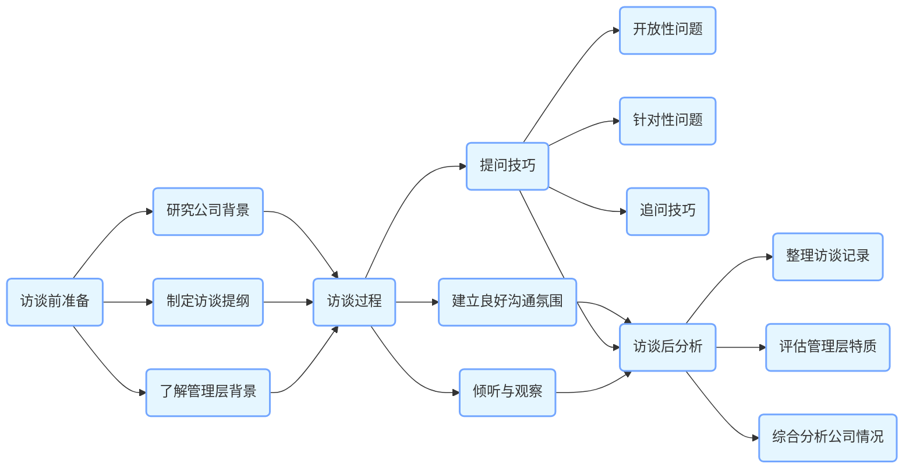

# 费雪的管理层访谈技巧：深入了解公司

> 关键词：费雪、管理层访谈、公司了解、投资分析、访谈技巧

> 摘要：本文围绕费雪的管理层访谈技巧展开，旨在阐述如何通过与公司管理层的有效沟通深入了解公司。详细介绍了费雪管理层访谈技巧的背景、核心概念，深入剖析其核心算法原理及具体操作步骤，借助数学模型和公式对相关要点进行解释。通过项目实战展示实际应用中的代码案例并进行解读，探讨其在不同场景下的实际应用。同时，推荐了相关的学习资源、开发工具框架以及论文著作，最后总结其未来发展趋势与挑战，解答常见问题并提供扩展阅读与参考资料，帮助读者全面掌握利用费雪的管理层访谈技巧深入了解公司的方法和要点。

## 1. 背景介绍 
### 1.1 目的和范围
在投资领域，准确评估一家公司的价值至关重要。而管理层在公司的运营和发展中起着核心作用，他们的决策、战略眼光和执行能力直接影响公司的未来走向。费雪的管理层访谈技巧旨在为投资者、分析师等提供一种深入了解公司管理层的方法，从而更全面、准确地评估公司的内在价值、发展潜力和风险状况。本文章的范围涵盖了费雪管理层访谈技巧的理论基础、实际操作方法、应用场景以及相关的学习资源等方面，旨在帮助读者系统地掌握这一重要技巧。

### 1.2 预期读者
本文预期读者包括但不限于投资者，无论是个人投资者还是机构投资者，都可以通过学习费雪的管理层访谈技巧，提高对投资标的的分析能力；金融分析师，他们可以利用这些技巧为客户提供更准确的投资建议；企业管理者，通过了解这些访谈技巧，可以更好地理解投资者和外部人士的关注点，提升公司的管理和沟通水平；以及对公司分析和投资领域感兴趣的研究人员和学生等。

### 1.3 文档结构概述
本文首先介绍费雪管理层访谈技巧的背景信息，包括目的、预期读者和文档结构等。接着阐述核心概念与联系，展示其原理和架构。然后深入讲解核心算法原理及具体操作步骤，并结合数学模型和公式进行说明。通过项目实战展示实际应用案例并进行详细解读。探讨该技巧在不同场景下的实际应用。推荐相关的学习资源、开发工具框架和论文著作。最后总结未来发展趋势与挑战，解答常见问题并提供扩展阅读与参考资料。

### 1.4 术语表
#### 1.4.1 核心术语定义
- **费雪的管理层访谈技巧**：由投资大师菲利普·费雪提出的一系列通过与公司管理层进行有效沟通，以深入了解公司经营、战略、管理等多方面情况的方法和策略。
- **管理层**：指公司中负责决策、管理和运营的高级管理人员，如首席执行官（CEO）、首席财务官（CFO）、首席运营官（COO）等。
- **公司内在价值**：公司未来预期现金流的现值，是评估公司投资价值的重要指标。

#### 1.4.2 相关概念解释
- **投资分析**：对投资对象的各种信息进行收集、整理、分析和评估，以确定投资的可行性和价值的过程。
- **定性分析**：基于对公司的非量化因素，如管理层素质、企业文化、行业竞争地位等进行的分析和评估。
- **定量分析**：通过对公司的财务数据、统计指标等量化信息进行的分析和评估。

#### 1.4.3 缩略词列表
- **CEO**：Chief Executive Officer，首席执行官
- **CFO**：Chief Financial Officer，首席财务官
- **COO**：Chief Operating Officer，首席运营官

## 2. 核心概念与联系 
费雪的管理层访谈技巧基于这样一个核心观点：公司的管理层是公司成功的关键因素之一。通过与管理层的深入交流，可以获取关于公司的第一手信息，了解他们的战略规划、决策过程、管理风格以及对行业趋势的看法等。这些信息对于评估公司的未来发展潜力和风险具有重要意义。

### 核心概念原理
费雪认为，一个优秀的管理层应该具备以下几个方面的特质：
- **诚信正直**：管理层的诚信是公司长期发展的基础。只有诚信的管理层才能赢得投资者、客户和员工的信任。
- **创新能力**：在快速变化的市场环境中，公司需要不断创新才能保持竞争力。管理层的创新能力决定了公司能否推出新产品、开拓新市场。
- **战略眼光**：管理层需要具备长远的战略眼光，能够准确把握行业发展趋势，制定出符合公司实际情况的发展战略。
- **执行能力**：再好的战略也需要有强大的执行能力才能实现。管理层需要能够有效地组织和协调公司的资源，确保战略的顺利实施。

### 架构的文本示意图
```plaintext
费雪的管理层访谈技巧
|-- 访谈前准备
|   |-- 研究公司背景
|   |-- 制定访谈提纲
|   |-- 了解管理层背景
|-- 访谈过程
|   |-- 建立良好沟通氛围
|   |-- 提问技巧
|   |   |-- 开放性问题
|   |   |-- 针对性问题
|   |   |-- 追问技巧
|   |-- 倾听与观察
|-- 访谈后分析
|   |-- 整理访谈记录
|   |-- 评估管理层特质
|   |-- 综合分析公司情况
```

### Mermaid 流程图


## 3. 核心算法原理 & 具体操作步骤 
### 核心算法原理
费雪的管理层访谈技巧可以看作是一个信息收集、处理和分析的过程。其核心算法原理可以用以下步骤来描述：
1. **信息收集**：通过访谈前的研究和访谈过程中的提问，收集关于公司和管理层的各种信息。
2. **信息处理**：对收集到的信息进行整理和分类，提取关键信息。
3. **信息分析**：根据提取的关键信息，评估管理层的特质和公司的情况，从而得出对公司的综合评价。

### 具体操作步骤
#### 访谈前准备
```python
# 步骤 1: 研究公司背景
def research_company_background(company_name):
    # 收集公司的基本信息，如业务范围、市场份额、财务状况等
    company_info = {}
    # 模拟从公开资料中获取信息
    company_info['business_scope'] = '生产和销售电子产品'
    company_info['market_share'] = 10
    company_info['financial_status'] = '良好'
    return company_info

# 步骤 2: 制定访谈提纲
def create_interview_outline(company_info):
    outline = []
    # 根据公司背景制定问题
    if company_info['business_scope'] == '生产和销售电子产品':
        outline.append('公司未来的产品研发方向是什么？')
        outline.append('如何应对电子产品市场的激烈竞争？')
    if company_info['market_share'] < 20:
        outline.append('公司有哪些扩大市场份额的计划？')
    return outline

# 步骤 3: 了解管理层背景
def get_management_background(company_name):
    management_info = {}
    # 模拟从公开资料中获取管理层信息
    management_info['ceo_name'] = '张三'
    management_info['ceo_experience'] = '有10年电子产品行业经验'
    return management_info

# 示例使用
company_name = 'ABC 公司'
company_info = research_company_background(company_name)
outline = create_interview_outline(company_info)
management_info = get_management_background(company_name)

print('公司背景信息:', company_info)
print('访谈提纲:', outline)
print('管理层背景信息:', management_info)
```
#### 访谈过程
```python
# 步骤 4: 建立良好沟通氛围
def build_good_communication_atmosphere():
    print('您好，非常感谢您抽出时间接受我们的访谈。')

# 步骤 5: 提问技巧
def ask_questions(outline):
    for question in outline:
        answer = input(question + ' ')
        # 可以在这里对回答进行初步处理
        print('回答:', answer)

# 步骤 6: 倾听与观察
def listen_and_observe():
    # 模拟倾听和观察的过程
    print('仔细倾听管理层的回答，并观察他们的表情、语气等。')

# 示例使用
build_good_communication_atmosphere()
ask_questions(outline)
listen_and_observe()
```
#### 访谈后分析
```python
# 步骤 7: 整理访谈记录
def organize_interview_records():
    # 模拟整理访谈记录的过程
    print('将访谈过程中的回答进行整理，形成文字记录。')

# 步骤 8: 评估管理层特质
def evaluate_management_traits():
    # 模拟评估管理层特质的过程
    print('根据访谈记录，评估管理层的诚信、创新能力、战略眼光和执行能力等特质。')

# 步骤 9: 综合分析公司情况
def comprehensive_analysis(company_info, management_info):
    # 模拟综合分析公司情况的过程
    print('结合公司背景信息和管理层特质评估结果，对公司的未来发展潜力和风险进行综合分析。')

# 示例使用
organize_interview_records()
evaluate_management_traits()
comprehensive_analysis(company_info, management_info)
```

## 4. 数学模型和公式 & 详细讲解 & 举例说明 
### 数学模型
我们可以建立一个简单的数学模型来评估公司的投资价值，其中管理层的特质是一个重要的因素。假设公司的投资价值 $V$ 可以表示为：
$$V = \alpha \times F + \beta \times M + \gamma \times E$$
其中：
- $F$ 表示公司的财务状况，如净利润、资产负债率等，可以通过财务报表进行量化。
- $M$ 表示管理层的特质得分，通过对管理层的诚信、创新能力、战略眼光和执行能力等方面进行评估得到。
- $E$ 表示行业环境因素，如行业增长率、竞争程度等。
- $\alpha$、$\beta$、$\gamma$ 分别是相应因素的权重，且 $\alpha + \beta + \gamma = 1$。

### 详细讲解
- **财务状况 $F$**：财务状况是公司基本面的重要体现。净利润反映了公司的盈利能力，资产负债率反映了公司的偿债能力。可以通过对公司过去几年的财务报表进行分析，计算出各项财务指标的平均值或趋势值，作为 $F$ 的取值。
- **管理层特质得分 $M$**：对管理层的特质进行评估可以采用打分的方式。例如，将诚信、创新能力、战略眼光和执行能力分别设定为 0 - 10 分的评分标准，然后根据访谈结果和其他信息进行打分，最后取平均值作为 $M$ 的取值。
- **行业环境因素 $E$**：行业环境因素会影响公司的发展前景。可以通过收集行业研究报告、统计数据等，对行业增长率、竞争程度等进行量化分析，作为 $E$ 的取值。
- **权重 $\alpha$、$\beta$、$\gamma$**：权重的确定需要根据具体情况进行调整。一般来说，如果投资者更注重公司的财务状况，可以适当提高 $\alpha$ 的权重；如果认为管理层的特质对公司的发展至关重要，可以提高 $\beta$ 的权重。

### 举例说明
假设一家公司的财务状况 $F = 7$（满分 10 分），管理层特质得分 $M = 8$，行业环境因素 $E = 6$。投资者认为财务状况、管理层特质和行业环境因素的权重分别为 $\alpha = 0.4$，$\beta = 0.4$，$\gamma = 0.2$。则该公司的投资价值 $V$ 为：
$$V = 0.4 \times 7 + 0.4 \times 8 + 0.2 \times 6$$
$$V = 2.8 + 3.2 + 1.2$$
$$V = 7.2$$

这表明该公司具有一定的投资价值，投资者可以根据这个结果进一步评估是否进行投资。

## 5. 项目实战：代码实际案例和详细解释说明 
### 5.1  开发环境搭建
为了实现费雪的管理层访谈技巧的相关代码，我们可以使用 Python 语言进行开发。以下是搭建开发环境的步骤：
1. **安装 Python**：从 Python 官方网站（https://www.python.org/downloads/）下载并安装 Python 3.x 版本。
2. **安装开发工具**：推荐使用 PyCharm 或 VS Code 作为开发工具。可以从官方网站下载并安装相应的版本。
3. **创建虚拟环境（可选）**：为了避免不同项目之间的依赖冲突，建议使用虚拟环境。可以使用 `venv` 模块创建虚拟环境：
```bash
python -m venv myenv
```
4. **激活虚拟环境**：
- 在 Windows 上：
```bash
myenv\Scripts\activate
```
- 在 Linux 或 macOS 上：
```bash
source myenv/bin/activate
```

### 5.2  源代码详细实现和代码解读
```python
# 定义公司类
class Company:
    def __init__(self, name, business_scope, market_share, financial_status):
        self.name = name
        self.business_scope = business_scope
        self.market_share = market_share
        self.financial_status = financial_status

    def __str__(self):
        return f'公司名称: {self.name}, 业务范围: {self.business_scope}, 市场份额: {self.market_share}%, 财务状况: {self.financial_status}'

# 定义管理层类
class Management:
    def __init__(self, ceo_name, ceo_experience):
        self.ceo_name = ceo_name
        self.ceo_experience = ceo_experience

    def __str__(self):
        return f'CEO 姓名: {self.ceo_name}, CEO 经验: {self.ceo_experience}'

# 定义访谈类
class Interview:
    def __init__(self, company, management):
        self.company = company
        self.management = management
        self.outline = []

    def research_company_background(self):
        print('研究公司背景信息:', self.company)

    def create_interview_outline(self):
        if self.company.business_scope == '生产和销售电子产品':
            self.outline.append('公司未来的产品研发方向是什么？')
            self.outline.append('如何应对电子产品市场的激烈竞争？')
        if self.company.market_share < 20:
            self.outline.append('公司有哪些扩大市场份额的计划？')
        print('访谈提纲:', self.outline)

    def get_management_background(self):
        print('了解管理层背景信息:', self.management)

    def build_good_communication_atmosphere(self):
        print('您好，非常感谢您抽出时间接受我们的访谈。')

    def ask_questions(self):
        for question in self.outline:
            answer = input(question + ' ')
            print('回答:', answer)

    def listen_and_observe(self):
        print('仔细倾听管理层的回答，并观察他们的表情、语气等。')

    def organize_interview_records(self):
        print('将访谈过程中的回答进行整理，形成文字记录。')

    def evaluate_management_traits(self):
        print('根据访谈记录，评估管理层的诚信、创新能力、战略眼光和执行能力等特质。')

    def comprehensive_analysis(self):
        print('结合公司背景信息和管理层特质评估结果，对公司的未来发展潜力和风险进行综合分析。')

# 示例使用
company = Company('ABC 公司', '生产和销售电子产品', 10, '良好')
management = Management('张三', '有 10 年电子产品行业经验')
interview = Interview(company, management)

interview.research_company_background()
interview.create_interview_outline()
interview.get_management_background()
interview.build_good_communication_atmosphere()
interview.ask_questions()
interview.listen_and_observe()
interview.organize_interview_records()
interview.evaluate_management_traits()
interview.comprehensive_analysis()
```
### 5.3  代码解读与分析
- **Company 类**：用于表示公司的基本信息，包括公司名称、业务范围、市场份额和财务状况。通过 `__init__` 方法进行初始化，`__str__` 方法用于打印公司信息。
- **Management 类**：用于表示管理层的基本信息，包括 CEO 姓名和 CEO 经验。同样通过 `__init__` 方法进行初始化，`__str__` 方法用于打印管理层信息。
- **Interview 类**：用于实现访谈的整个流程，包括访谈前准备、访谈过程和访谈后分析。各个方法分别对应访谈流程的不同步骤，如 `research_company_background` 方法用于研究公司背景，`create_interview_outline` 方法用于制定访谈提纲等。

通过这个代码示例，我们可以清晰地看到费雪的管理层访谈技巧的实现过程，从访谈前的准备工作到访谈过程中的提问和观察，再到访谈后的分析和评估，都得到了很好的体现。

## 6. 实际应用场景 
### 投资决策
投资者在进行投资决策时，需要对投资标的进行全面的评估。通过费雪的管理层访谈技巧，投资者可以与公司管理层进行深入交流，了解公司的战略规划、业务发展方向、竞争优势等信息，从而更准确地评估公司的投资价值。例如，在决定是否投资一家科技公司时，投资者可以通过访谈了解公司的研发团队实力、新产品研发计划以及对行业技术趋势的看法，以此来判断公司的未来发展潜力。

### 尽职调查
在企业并购、重组等重大交易中，尽职调查是必不可少的环节。通过与目标公司的管理层进行访谈，调查方可以深入了解目标公司的运营情况、财务状况、法律风险等信息。例如，在并购一家制造企业时，调查方可以通过访谈了解公司的生产流程、供应链管理、质量控制等方面的情况，以便发现潜在的问题和风险。

### 行业研究
研究机构和分析师在进行行业研究时，可以通过与行业内代表性公司的管理层进行访谈，获取行业的一手信息。例如，了解行业的发展趋势、竞争格局、政策环境等。这些信息对于撰写行业研究报告、提供投资建议等具有重要的参考价值。

### 企业管理咨询
管理咨询公司在为企业提供咨询服务时，可以通过与企业管理层的访谈，深入了解企业的管理现状、战略目标、面临的问题等。例如，在为一家传统企业提供数字化转型咨询服务时，咨询顾问可以通过访谈了解企业的信息化基础、员工对数字化转型的认知和接受程度等，从而制定出更符合企业实际情况的咨询方案。

## 7. 工具和资源推荐
### 7.1 学习资源推荐
#### 7.1.1 书籍推荐
- 《怎样选择成长股》（菲利普·费雪著）：费雪的经典著作，详细阐述了他的投资理念和方法，包括管理层访谈技巧等内容。
- 《聪明的投资者》（本杰明·格雷厄姆著）：价值投资的经典之作，虽然重点不在管理层访谈，但对于理解投资分析的整体框架和方法有很大帮助。
- 《财务报表分析》（杰拉尔德·I·怀特等著）：帮助读者掌握财务报表分析的方法和技巧，对于结合管理层访谈信息评估公司的财务状况有重要作用。

#### 7.1.2 在线课程
- Coursera 上的“投资分析与组合管理”课程：由知名大学的教授授课，涵盖了投资分析的各个方面，包括公司分析和管理层评估。
- edX 上的“财务决策原理”课程：介绍了财务决策的基本原理和方法，对于理解公司的财务运作和管理层的决策有一定的帮助。

#### 7.1.3 技术博客和网站
- Seeking Alpha：一个专业的投资研究网站，提供了大量的公司分析文章和投资者的观点，其中不乏关于管理层访谈和公司评估的内容。
- 雪球网：国内知名的投资交流社区，投资者可以在上面分享自己的投资经验和对公司的分析，也可以找到一些关于管理层访谈的讨论。

### 7.2 开发工具框架推荐
#### 7.2.1 IDE和编辑器
- PyCharm：一款专业的 Python 集成开发环境，提供了丰富的代码编辑、调试和管理功能，适合开发与管理层访谈技巧相关的 Python 代码。
- VS Code：一款轻量级的代码编辑器，支持多种编程语言，通过安装相关插件可以实现强大的开发功能，也可以用于 Python 代码的开发。

#### 7.2.2 调试和性能分析工具
- PyCharm 的调试功能：可以方便地设置断点、单步执行代码，帮助开发者快速定位和解决代码中的问题。
- cProfile：Python 内置的性能分析工具，可以对代码的运行时间和函数调用情况进行分析，帮助开发者优化代码性能。

#### 7.2.3 相关框架和库
- Pandas：用于数据处理和分析的 Python 库，可以帮助开发者处理和分析从访谈中获取的大量数据。
- Matplotlib：用于数据可视化的 Python 库，可以将分析结果以图表的形式展示出来，方便用户理解和决策。

### 7.3 相关论文著作推荐
#### 7.3.1 经典论文
- “The Role of Management in Firm Performance”（由知名学者撰写，探讨了管理层在公司绩效中的作用，为管理层访谈技巧提供了理论支持。）
- “Evaluating Management Quality: A Framework for Investors”（提出了评估管理层质量的框架和方法，对于深入理解管理层访谈技巧有重要的参考价值。）

#### 7.3.2 最新研究成果
- 关注顶级金融学术期刊，如《Journal of Finance》《Review of Financial Studies》等，这些期刊上会发表关于公司治理、管理层评估等方面的最新研究成果。

#### 7.3.3 应用案例分析
- 一些知名投资机构的研究报告，如高盛、摩根士丹利等，会包含对具体公司的分析和评估，其中可能会涉及到管理层访谈的应用案例。

## 8. 总结：未来发展趋势与挑战
### 未来发展趋势
- **数字化和智能化**：随着信息技术的不断发展，未来的管理层访谈可能会更多地借助数字化工具和智能化技术。例如，利用视频会议系统进行远程访谈，提高访谈的效率和便利性；利用自然语言处理技术对访谈记录进行自动分析和挖掘，提取关键信息。
- **多维度分析**：除了传统的财务分析和管理层特质评估，未来的管理层访谈可能会更加注重多维度分析。例如，结合大数据分析公司的客户反馈、社交媒体舆情等信息，更全面地了解公司的市场形象和品牌影响力；考虑环境、社会和治理（ESG）因素，评估公司的可持续发展能力。
- **国际化合作**：在全球化的背景下，企业的跨国经营越来越普遍。未来的管理层访谈可能会涉及更多的国际合作和交流。投资者和分析师需要了解不同国家和地区的文化差异、商业环境和法律法规，以便更好地与国际企业的管理层进行沟通和交流。

### 挑战
- **信息真实性和可靠性**：在访谈过程中，管理层可能会出于各种原因提供不真实或不准确的信息。投资者和分析师需要具备辨别信息真伪的能力，通过多渠道验证信息的可靠性。
- **访谈技巧的提升**：随着市场环境的变化和企业的发展，管理层的特点和需求也在不断变化。投资者和分析师需要不断提升自己的访谈技巧，以适应不同的访谈场景和对象。
- **数据安全和隐私保护**：在数字化和智能化的背景下，访谈过程中会涉及到大量的企业和个人信息。如何确保这些信息的安全和隐私，防止信息泄露和滥用，是未来需要面对的重要挑战。

## 9. 附录：常见问题与解答
### 问题 1：如何确保访谈问题的针对性和有效性？
解答：在访谈前，需要对公司进行充分的研究，了解公司的业务范围、市场地位、财务状况等信息。根据这些信息制定访谈提纲，确保问题与公司的实际情况相关。同时，问题应该具有开放性和引导性，能够激发管理层的思考和表达，获取更有价值的信息。

### 问题 2：如果管理层不愿意回答某些问题，应该怎么办？
解答：首先，要尊重管理层的意愿，不要强行追问。可以尝试换一种方式提问，或者从其他角度引导管理层回答问题。如果问题确实涉及到公司的敏感信息，管理层有权拒绝回答，此时可以记录下这个情况，并在后续的分析中进行考虑。

### 问题 3：如何评估管理层的诚信度？
解答：可以通过多方面的信息来评估管理层的诚信度。例如，查看公司的历史记录，是否存在违规行为或财务造假等情况；了解管理层的个人声誉和口碑；在访谈过程中，观察管理层的言行举止，是否前后一致、逻辑合理等。

### 问题 4：访谈后如何进行有效的分析和总结？
解答：访谈后，首先要整理访谈记录，确保信息的准确性和完整性。然后，根据访谈提纲和研究目的，对访谈内容进行分类和归纳，提取关键信息。接着，结合公司的其他信息，如财务报表、行业研究报告等，对管理层的特质和公司的情况进行综合分析。最后，形成分析报告，总结访谈的主要发现和结论。

## 10. 扩展阅读 & 参考资料
- 菲利普·费雪的其他著作，如《投资突围战》等。
- 相关的金融和投资类书籍，如《金融炼金术》《漫步华尔街》等。
- 各大金融机构和研究机构发布的行业研究报告和投资分析报告。
- 相关的学术论文数据库，如知网、万方数据等，可以查找关于公司治理、管理层评估等方面的学术论文。

作者：AI天才研究院/AI Genius Institute & 禅与计算机程序设计艺术 /Zen And The Art of Computer Programming