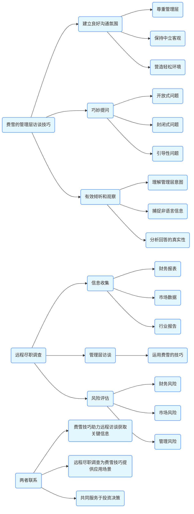

# 费雪的管理层访谈技巧：远程尽职调查的新方法

> 关键词：费雪、管理层访谈技巧、远程尽职调查、新方法、投资决策

> 摘要：本文聚焦于费雪的管理层访谈技巧在远程尽职调查中的应用。首先介绍相关背景，让读者了解其目的、预期读者等信息。接着阐述核心概念与联系，包括费雪访谈技巧的原理及与远程尽职调查的关联。通过核心算法原理与具体操作步骤的讲解，呈现如何有效运用该技巧。同时给出数学模型和公式，结合举例说明其内在逻辑。在项目实战部分，以实际案例展示该技巧在远程尽职调查中的应用并进行详细解读。探讨其实际应用场景，为投资者和相关从业者提供参考。还推荐了学习该技巧所需的工具和资源，最后总结未来发展趋势与挑战，解答常见问题并提供扩展阅读与参考资料，助力读者全面掌握费雪的管理层访谈技巧在远程尽职调查中的新方法。

## 1. 背景介绍 
### 1.1 目的和范围
在当今全球化和数字化的时代，投资活动日益频繁，远程尽职调查成为了评估目标企业的重要手段。而管理层作为企业的核心决策和执行团队，其能力、素质和战略眼光对企业的发展起着关键作用。费雪的管理层访谈技巧旨在通过有效的沟通和提问，深入了解管理层的特质、企业的运营状况、战略规划等信息，为投资者提供全面、准确的决策依据。

本文的范围主要涵盖费雪管理层访谈技巧的核心概念、操作方法、在远程尽职调查中的应用案例，以及相关的工具资源和未来发展趋势等方面。通过对这些内容的详细阐述，帮助读者掌握这一在远程尽职调查中具有重要价值的新方法。

### 1.2 预期读者
本文预期读者包括各类投资者，如风险投资家、私募股权投资者、股票投资者等，他们在投资决策过程中需要对目标企业进行尽职调查，而管理层访谈是其中关键的一环。同时，企业的战略分析师、咨询师等专业人士也可以从本文中获取有用的信息，用于评估企业的竞争力和发展潜力。此外，对商业调研和沟通技巧感兴趣的学生和研究人员也能从中学习到实用的知识和方法。

### 1.3 文档结构概述
本文将按照以下结构进行阐述：首先介绍相关背景信息，包括目的、预期读者和文档结构概述等内容。接着深入探讨核心概念与联系，明确费雪管理层访谈技巧的原理和与远程尽职调查的关系。然后详细讲解核心算法原理和具体操作步骤，结合 Python 代码进行说明。再通过数学模型和公式进一步剖析其内在逻辑，并举例说明。在项目实战部分，展示实际案例并进行详细解读。之后探讨该技巧的实际应用场景，为读者提供参考。随后推荐相关的工具和资源，帮助读者深入学习和实践。最后总结未来发展趋势与挑战，解答常见问题并提供扩展阅读与参考资料。

### 1.4 术语表
#### 1.4.1 核心术语定义
- **费雪的管理层访谈技巧**：由投资大师菲利普·费雪（Philip Fisher）提出的一系列用于与企业管理层进行有效沟通和深入了解的方法和策略，旨在评估管理层的能力、企业的发展前景等。
- **远程尽职调查**：在无法进行现场实地考察的情况下，通过网络、电话等远程方式对目标企业进行全面调查和评估的过程。
- **投资决策**：投资者在对各种投资机会进行分析、评估后，做出是否投资以及如何投资的决策过程。

#### 1.4.2 相关概念解释
- **管理层素质**：包括管理层的专业知识、领导能力、创新精神、团队协作能力、道德品质等方面，这些因素直接影响企业的运营和发展。
- **企业战略规划**：企业为实现长期发展目标而制定的一系列行动计划和决策，包括市场定位、产品研发、市场营销等方面。
- **尽职调查的全面性**：指在尽职调查过程中，对目标企业的各个方面进行全面、深入的调查和了解，包括财务状况、经营业绩、市场竞争力、法律合规等。

#### 1.4.3 缩略词列表
- **DD**：尽职调查（Due Diligence）

## 2. 核心概念与联系 

### 费雪的管理层访谈技巧原理
费雪认为，与企业管理层的有效沟通是了解企业真实情况的关键。他的访谈技巧基于对人性和企业运营的深刻理解，通过提问、倾听和观察等方式，挖掘管理层的真实想法和企业的潜在价值。其核心原理在于建立良好的沟通氛围，让管理层愿意坦诚地分享信息，同时通过巧妙的提问引导管理层提供有价值的见解。

### 与远程尽职调查的联系
在远程尽职调查中，由于无法进行面对面的交流，信息获取的难度相对增加。费雪的管理层访谈技巧可以帮助调查人员在远程环境下更好地与管理层沟通，弥补无法实地考察的不足。通过有效的远程访谈，可以了解管理层的思维方式、决策过程和对企业未来的规划，从而对企业的发展潜力和投资价值做出更准确的判断。

### 文本示意图
```plaintext
费雪的管理层访谈技巧
├── 建立良好沟通氛围
│   ├── 尊重管理层
│   ├── 保持中立客观
│   └── 营造轻松环境
├── 巧妙提问
│   ├── 开放式问题
│   ├── 封闭式问题
│   └── 引导性问题
└── 有效倾听和观察
    ├── 理解管理层意图
    ├── 捕捉非语言信息
    └── 分析回答的真实性

远程尽职调查
├── 信息收集
│   ├── 财务报表
│   ├── 市场数据
│   └── 行业报告
├── 管理层访谈
│   └── 运用费雪的技巧
└── 风险评估
    ├── 财务风险
    ├── 市场风险
    └── 管理风险

两者联系
├── 费雪技巧助力远程访谈获取关键信息
├── 远程尽职调查为费雪技巧提供应用场景
└── 共同服务于投资决策
```

### Mermaid 流程图


## 3. 核心算法原理 & 具体操作步骤 

### 核心算法原理
费雪的管理层访谈技巧的核心算法原理可以类比为一个信息收集和分析的过程。在这个过程中，通过提问获取管理层的回答，然后对这些回答进行分析和评估，以推断管理层的能力、企业的运营状况和发展前景。

可以将其抽象为一个函数，输入为提问的问题集合 $Q$ 和管理层的回答集合 $A$，输出为对管理层和企业的评估结果 $R$。即：

$R = f(Q, A)$

其中，函数 $f$ 代表了一系列的分析和评估规则，包括对回答的逻辑分析、内容深度分析、与其他信息的关联性分析等。

### 具体操作步骤

#### 步骤 1：准备阶段
- **了解目标企业**：收集目标企业的基本信息，包括行业地位、市场份额、产品或服务特点、财务状况等。
- **确定访谈目标**：明确通过访谈想要了解的关键信息，如管理层的战略规划、企业的竞争优势、面临的挑战等。
- **设计问题**：根据访谈目标，设计一系列有针对性的问题，包括开放式问题和封闭式问题。例如：
```python
# 开放式问题示例
open_questions = [
    "请您谈谈公司未来的发展战略是什么？",
    "在当前市场环境下，公司面临的最大挑战是什么，您打算如何应对？"
]

# 封闭式问题示例
closed_questions = [
    "公司去年的研发投入占比是否超过了 10%？",
    "公司是否有计划在未来一年内推出新的产品线？"
]
```

#### 步骤 2：建立沟通氛围
- **自我介绍**：在访谈开始时，向管理层介绍自己的身份和访谈的目的，让管理层感到被尊重和信任。
- **营造轻松环境**：可以通过一些轻松的话题开场，缓解紧张气氛，如询问管理层对行业近期热点事件的看法。

#### 步骤 3：提问阶段
- **按照问题顺序提问**：先提出开放式问题，让管理层有机会充分表达自己的观点和想法。然后根据管理层的回答，适时提出封闭式问题进行确认和补充。
```python
for question in open_questions:
    print(question)
    answer = input("请回答：")
    # 这里可以对回答进行初步处理和记录
    print(f"回答记录：{answer}")

for question in closed_questions:
    print(question)
    answer = input("请回答（是/否）：")
    # 处理封闭式问题的回答
    if answer.lower() == "是":
        print("回答为是")
    elif answer.lower() == "否":
        print("回答为否")
    else:
        print("回答无效，请输入 是 或 否")
```

#### 步骤 4：倾听和观察阶段
- **认真倾听**：在管理层回答问题时，要认真倾听，理解其意图和观点。
- **观察非语言信息**：虽然是远程访谈，但可以通过管理层的语气、语速、停顿等非语言信息，判断其回答的真实性和可信度。

#### 步骤 5：分析阶段
- **整理回答**：将管理层的回答进行整理和分类，提取关键信息。
- **分析评估**：根据整理的信息，运用预设的分析规则进行评估，得出对管理层和企业的评估结果。
```python
# 简单示例：分析开放式问题回答的字数，判断回答的详细程度
def analyze_open_answer(answer):
    word_count = len(answer.split())
    if word_count > 100:
        return "详细"
    elif word_count > 50:
        return "一般"
    else:
        return "简略"

# 对之前记录的开放式问题回答进行分析
for answer in open_answers:
    result = analyze_open_answer(answer)
    print(f"回答详细程度：{result}")
```

## 4. 数学模型和公式 & 详细讲解 & 举例说明 

### 数学模型
我们可以建立一个基于多因素评估的数学模型来评估管理层和企业的情况。假设我们考虑以下几个因素：管理层的专业能力 $C_p$、战略眼光 $C_s$、团队协作能力 $C_t$、企业的财务状况 $F$、市场竞争力 $M$。

综合评估得分 $S$ 可以表示为：

$$S = w_pC_p + w_sC_s + w_tC_t + w_fF + w_mM$$

其中，$w_p$、$w_s$、$w_t$、$w_f$、$w_m$ 分别是各因素的权重，且满足：

$$w_p + w_s + w_t + w_f + w_m = 1$$

### 详细讲解
- **因素解释**：
    - **管理层的专业能力 $C_p$**：可以通过管理层的教育背景、工作经验、专业技能等方面进行评估，得分范围可以设定为 0 - 10 分。
    - **战略眼光 $C_s$**：根据管理层对企业未来发展的规划和决策，以及对市场趋势的判断能力来评估，同样得分范围为 0 - 10 分。
    - **团队协作能力 $C_t$**：通过了解管理层与团队成员的合作情况、团队的凝聚力等方面进行评估，得分范围 0 - 10 分。
    - **企业的财务状况 $F$**：可以依据企业的财务报表，如利润率、资产负债率、现金流等指标进行量化评估，得分范围 0 - 10 分。
    - **市场竞争力 $M$**：考虑企业的市场份额、产品或服务的差异化程度、品牌影响力等因素，得分范围 0 - 10 分。
- **权重确定**：权重的确定需要根据具体的投资目标和行业特点来进行。例如，对于科技行业的企业，可能更看重管理层的专业能力和战略眼光，因此 $w_p$ 和 $w_s$ 的权重可以相对较高；而对于传统制造业企业，可能企业的财务状况和市场竞争力更为重要，$w_f$ 和 $w_m$ 的权重可以适当提高。

### 举例说明
假设我们对一家科技企业进行评估，各因素的权重设定为：$w_p = 0.3$，$w_s = 0.25$，$w_t = 0.15$，$w_f = 0.15$，$w_m = 0.15$。

通过访谈和调查，得到以下评估结果：
- 管理层的专业能力 $C_p = 8$ 分
- 战略眼光 $C_s = 7$ 分
- 团队协作能力 $C_t = 6$ 分
- 企业的财务状况 $F = 7$ 分
- 市场竞争力 $M = 6$ 分

则综合评估得分 $S$ 为：

$$
\begin{align*}
S &= 0.3\times8 + 0.25\times7 + 0.15\times6 + 0.15\times7 + 0.15\times6\\
&= 2.4 + 1.75 + 0.9 + 1.05 + 0.9\\
&= 7
\end{align*}
$$

根据这个得分，我们可以对该企业的整体情况有一个初步的判断，7 分表明该企业具有一定的优势，但也存在一些可以改进的地方。

## 5. 项目实战：代码实际案例和详细解释说明 

### 5.1  开发环境搭建
在进行基于费雪管理层访谈技巧的远程尽职调查项目实战时，我们可以使用 Python 语言进行开发。以下是开发环境搭建的步骤：

#### 安装 Python
首先，从 Python 官方网站（https://www.python.org/downloads/） 下载并安装适合你操作系统的 Python 版本。建议安装 Python 3.7 及以上版本。

#### 安装必要的库
在命令行中使用以下命令安装所需的库：
```bash
pip install pandas  # 用于数据处理和分析
pip install matplotlib  # 用于数据可视化
```

### 5.2  源代码详细实现和代码解读

```python
import pandas as pd
import matplotlib.pyplot as plt

# 定义问题和答案类
class QuestionAnswer:
    def __init__(self, question, answer):
        self.question = question
        self.answer = answer

    def __str__(self):
        return f"问题：{self.question}\n回答：{self.answer}"

# 模拟远程访谈过程
def remote_interview(open_questions, closed_questions):
    qa_list = []
    for question in open_questions:
        answer = input(question + " ")
        qa = QuestionAnswer(question, answer)
        qa_list.append(qa)

    for question in closed_questions:
        while True:
            answer = input(question + " (是/否) ")
            if answer.lower() in ["是", "否"]:
                qa = QuestionAnswer(question, answer)
                qa_list.append(qa)
                break
            else:
                print("回答无效，请输入 是 或 否")
    return qa_list

# 分析开放式问题回答的字数
def analyze_open_answer(answer):
    word_count = len(answer.split())
    if word_count > 100:
        return "详细"
    elif word_count > 50:
        return "一般"
    else:
        return "简略"

# 分析访谈结果
def analyze_interview_results(qa_list):
    open_qa = [qa for qa in qa_list if "请您谈谈" in qa.question]
    open_analysis = []
    for qa in open_qa:
        result = analyze_open_answer(qa.answer)
        open_analysis.append(result)

    closed_qa = [qa for qa in qa_list if "是否" in qa.question]
    closed_answers = [qa.answer for qa in closed_qa]

    analysis_df =