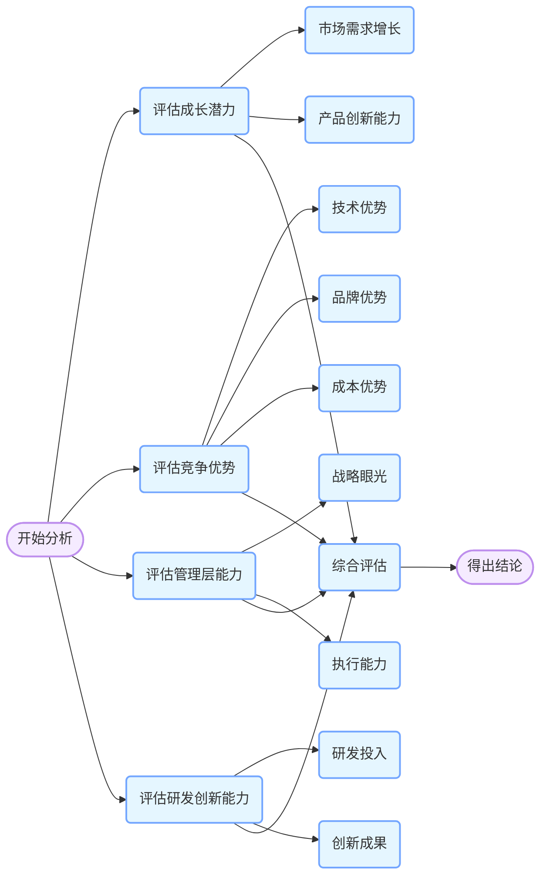

# 费雪的行业分析方法

> 关键词：费雪、行业分析方法、成长型投资、竞争优势、财务分析

> 摘要：本文围绕费雪的行业分析方法展开，深入探讨这一方法的核心概念、算法原理、数学模型等内容。通过项目实战案例展示该方法在实际中的应用，介绍其适用的实际场景，并推荐相关的学习工具和资源。最后对费雪行业分析方法的未来发展趋势与挑战进行总结，同时给出常见问题解答及扩展阅读参考资料，旨在帮助读者全面理解和运用费雪的行业分析方法进行投资决策。

## 1. 背景介绍 
### 1.1 目的和范围
本文章的主要目的是深入剖析费雪的行业分析方法，为投资者、金融分析师以及对行业研究感兴趣的人士提供全面且深入的指导。范围涵盖费雪行业分析方法的核心概念、原理、具体操作步骤，通过实际案例展示其应用，同时探讨其在不同行业和市场环境中的适用性，以及相关的工具和资源推荐。

### 1.2 预期读者
预期读者包括专业的金融投资者，他们可以借助费雪的行业分析方法优化投资组合，提高投资回报率；金融分析师，用于对不同行业进行深入研究和评估；以及对金融投资和行业分析有兴趣的初学者，帮助他们建立起系统的行业分析思维和方法。

### 1.3 文档结构概述
本文首先介绍费雪行业分析方法的背景信息，包括目的、预期读者和文档结构。接着阐述核心概念与联系，用文本示意图和Mermaid流程图展示其原理和架构。然后详细讲解核心算法原理和具体操作步骤，并给出Python源代码示例。之后介绍数学模型和公式，结合实际例子进行说明。通过项目实战案例，从开发环境搭建到源代码实现和解读，全面展示该方法的应用。再探讨实际应用场景，推荐相关的工具和资源。最后总结未来发展趋势与挑战，提供常见问题解答和扩展阅读参考资料。

### 1.4 术语表
#### 1.4.1 核心术语定义
- **费雪的行业分析方法**：由菲利普·费雪（Philip A. Fisher）提出的一种用于评估行业和公司投资价值的分析方法，重点关注公司的成长潜力、竞争优势和管理层能力等因素。
- **成长型投资**：一种投资策略，强调投资于具有高成长潜力的公司或行业，以获取长期的资本增值。
- **竞争优势**：企业在市场中相对于竞争对手所具有的独特优势，如技术优势、品牌优势、成本优势等。
- **管理层能力**：指公司管理层在制定战略、组织运营、决策等方面的能力和素质。

#### 1.4.2 相关概念解释
- **行业生命周期**：一个行业从诞生、成长、成熟到衰退的过程，不同阶段具有不同的特点和投资机会。
- **护城河**：由巴菲特提出的概念，类似于费雪所说的竞争优势，指企业抵御竞争对手的能力，如专利、品牌忠诚度等。
- **定性分析**：通过对公司的非财务因素，如管理团队、企业文化、市场定位等进行分析，评估公司的投资价值。

#### 1.4.3 缩略词列表
- ROE：Return on Equity，净资产收益率，衡量公司盈利能力的指标。
- EPS：Earnings Per Share，每股收益，反映公司每股的盈利水平。

## 2. 核心概念与联系 
费雪的行业分析方法核心在于寻找具有长期成长潜力的行业和公司。其主要概念包括公司的成长潜力、竞争优势、管理层能力和研发创新能力等。这些概念相互关联，共同构成了费雪行业分析的框架。

### 文本示意图
```plaintext
费雪的行业分析方法
|-- 成长潜力
|   |-- 市场需求增长
|   |-- 产品创新能力
|-- 竞争优势
|   |-- 技术优势
|   |-- 品牌优势
|   |-- 成本优势
|-- 管理层能力
|   |-- 战略眼光
|   |-- 执行能力
|-- 研发创新能力
|   |-- 研发投入
|   |-- 创新成果
```

### Mermaid 流程图


从流程图可以看出，费雪的行业分析方法需要对成长潜力、竞争优势、管理层能力和研发创新能力等多个方面进行评估，最后综合这些评估结果得出对行业或公司的分析结论。

## 3. 核心算法原理 & 具体操作步骤 
### 核心算法原理
费雪的行业分析方法并非基于严格的数学算法，而是一种定性与定量相结合的分析方法。其核心原理是通过对行业和公司的多个关键因素进行评估，判断其是否具有长期投资价值。主要考虑的因素包括：
- 销售增长：关注公司销售额的长期增长趋势，反映市场对其产品或服务的需求情况。
- 利润增长：衡量公司盈利能力的提升，与销售增长、成本控制等因素相关。
- 利润率：反映公司在销售过程中获取利润的能力，高利润率通常意味着公司具有较强的竞争优势。
- 研发投入：研发能力是公司保持竞争力和实现成长的重要因素，研发投入的多少体现了公司对创新的重视程度。

### 具体操作步骤
1. **收集信息**：收集行业和公司的相关信息，包括财务报表、行业报告、新闻资讯等。
2. **分析成长潜力**：
    - 研究市场需求：了解行业的市场规模、增长趋势以及未来的发展前景。
    - 评估产品创新能力：考察公司的产品线、新产品研发计划以及技术创新能力。
3. **评估竞争优势**：
    - 技术优势：分析公司的技术水平、专利情况以及研发团队的实力。
    - 品牌优势：评估公司品牌的知名度、美誉度和忠诚度。
    - 成本优势：比较公司与竞争对手的成本结构，判断其是否具有成本领先优势。
4. **考察管理层能力**：
    - 战略眼光：了解管理层的战略规划和决策能力，判断其是否能够把握行业发展趋势。
    - 执行能力：考察管理层在实施战略和管理运营方面的能力。
5. **分析研发创新能力**：
    - 研发投入：查看公司的研发费用占比，了解其对研发的重视程度。
    - 创新成果：关注公司的新产品推出情况、技术突破以及专利申请数量等。
6. **综合评估**：根据以上各项评估结果，对行业和公司进行综合打分，判断其投资价值。

### Python 源代码示例
```python
import pandas as pd

# 定义评估指标权重
weights = {
    'sales_growth': 0.2,
    'profit_growth': 0.2,
    'profit_margin': 0.2,
    'r_d_investment': 0.2,
    'management_ability': 0.1,
    'competitive_advantage': 0.1
}

# 定义评估函数
def evaluate_company(data):
    score = 0
    for key, weight in weights.items():
        score += data[key] * weight
    return score

# 示例数据
company_data = {
    'sales_growth': 0.2,
    'profit_growth': 0.15,
    'profit_margin': 0.3,
    'r_d_investment': 0.1,
    'management_ability': 0.8,
    'competitive_advantage': 0.7
}

# 计算评估得分
company_score = evaluate_company(company_data)
print(f"公司评估得分: {company_score}")
```
在上述代码中，我们首先定义了各项评估指标的权重，然后定义了一个评估函数`evaluate_company`，用于计算公司的综合得分。最后，我们给出了一个示例数据，调用评估函数计算公司的得分并输出结果。

## 4. 数学模型和公式 & 详细讲解 & 举例说明 
### 数学模型和公式
费雪的行业分析方法虽然不是完全基于数学模型，但可以用一些公式来辅助分析。以下是一些常用的指标和公式：

#### 净资产收益率（ROE）
$$ROE = \frac{净利润}{净资产} \times 100\%$$
ROE反映了公司利用自有资本获取收益的能力，是衡量公司盈利能力的重要指标。一般来说，ROE越高，说明公司的盈利能力越强。

#### 每股收益（EPS）
$$EPS = \frac{净利润}{总股本}$$
EPS表示每股股票所享有的公司净利润，是投资者关注的重要指标之一。EPS的增长通常意味着公司的盈利能力在提升。

#### 销售增长率
$$销售增长率 = \frac{本期销售额 - 上期销售额}{上期销售额} \times 100\%$$
销售增长率反映了公司销售额的增长情况，是评估公司成长潜力的重要指标。持续的销售增长通常意味着公司的产品或服务受到市场的欢迎。

### 详细讲解
- **ROE**：ROE的高低受到多个因素的影响，包括净利润率、总资产周转率和权益乘数。净利润率反映了公司在销售过程中获取利润的能力，总资产周转率反映了公司资产的运营效率，权益乘数反映了公司的财务杠杆水平。通过分析ROE的构成因素，可以深入了解公司的盈利能力和经营状况。
- **EPS**：EPS的增长可以来自净利润的增加或总股本的减少。投资者通常更关注EPS的持续增长，因为这意味着公司的盈利能力在不断提升。同时，EPS也可以用于计算市盈率（PE），从而评估公司的估值水平。
- **销售增长率**：销售增长率的计算可以帮助投资者了解公司的市场份额变化和业务发展趋势。如果一个公司的销售增长率持续高于行业平均水平，说明该公司在市场中具有较强的竞争力和成长潜力。

### 举例说明
假设公司A的净利润为1000万元，净资产为5000万元，总股本为2000万股，本期销售额为5000万元，上期销售额为4000万元。则：
- **ROE**：
$$ROE = \frac{1000}{5000} \times 100\% = 20\%$$
这表明公司A每投入1元的净资产，可以获得0.2元的净利润，盈利能力较强。
- **EPS**：
$$EPS = \frac{1000}{2000} = 0.5$$
即每股股票享有0.5元的净利润。
- **销售增长率**：
$$销售增长率 = \frac{5000 - 4000}{4000} \times 100\% = 25\%$$
说明公司A的销售额在本期有了25%的增长，具有较强的成长潜力。

## 5. 项目实战：代码实际案例和详细解释说明 
### 5.1 开发环境搭建
为了实现费雪的行业分析方法的项目实战，我们需要搭建一个Python开发环境。以下是具体步骤：
1. **安装Python**：从Python官方网站（https://www.python.org/downloads/）下载并安装Python 3.x版本。
2. **安装必要的库**：使用`pip`命令安装以下库：
    - `pandas`：用于数据处理和分析。
    - `numpy`：用于数值计算。
    - `matplotlib`：用于数据可视化。
```bash
pip install pandas numpy matplotlib
```
3. **选择开发工具**：可以选择使用Jupyter Notebook、PyCharm等开发工具。这里以Jupyter Notebook为例，安装方法如下：
```bash
pip install jupyter
```
安装完成后，在命令行中输入`jupyter notebook`，即可启动Jupyter Notebook服务器，在浏览器中打开使用。

### 5.2 源代码详细实现和代码解读
以下是一个完整的项目实战代码示例，用于对多个公司进行综合评估：

```python
import pandas as pd
import numpy as np
import matplotlib.pyplot as plt

# 定义评估指标权重
weights = {
    'sales_growth': 0.2,
    'profit_growth': 0.2,
    'profit_margin': 0.2,
    'r_d_investment': 0.2,
    'management_ability': 0.1,
    'competitive_advantage': 0.1
}

# 定义评估函数
def evaluate_company(data):
    score = 0
    for key, weight in weights.items():
        score += data[key] * weight
    return score

# 示例数据
companies_data = [
    {
        'company_name': '公司A',
        'sales_growth': 0.2,
        'profit_growth': 0.15,
        'profit_margin': 0.3,
        'r_d_investment': 0.1,
        'management_ability': 0.8,
        'competitive_advantage': 0.7
    },
    {
        'company_name': '公司B',
        'sales_growth': 0.1,
        'profit_growth': 0.1,
        'profit_margin': 0.2,
        'r_d_investment': 0.05,
        'management_ability': 0.6,
        'competitive_advantage': 0.5
    },
    {
        'company_name': '公司C',
        'sales_growth': 0.3,
        'profit_growth': 0.2,
        'profit_margin': 0.4,
        'r_d_investment': 0.15,
        'management_ability': 0.9,
        'competitive_advantage': 0.8
    }
]

# 计算每个公司的评估得分
scores = []
for company in companies_data:
    score = evaluate_company(company)
    scores.append(score)

# 将数据转换为DataFrame
df = pd.DataFrame(companies_data)
df['score'] = scores

# 按得分排序
df = df.sort_values(by='score', ascending=False)

# 打印评估结果
print(df[['company_name', 'score']])

# 可视化评估结果
plt.bar(df['company_name'], df['score'])
plt.xlabel('公司名称')
plt.ylabel('评估得分')
plt.title('公司综合评估得分')
plt.show()
```

### 代码解读与分析
1. **定义评估指标权重**：`weights`字典定义了各项评估指标的权重，用于计算公司的综合得分。
2. **定义评估函数**：`evaluate_company`函数接受一个公司的数据字典作为输入，根据权重计算公司的综合得分。
3. **示例数据**：`companies_data`列表包含了多个公司的评估数据，每个公司的数据以字典形式存储。
4. **计算评估得分**：通过循环遍历每个公司的数据，调用`evaluate_company`函数计算得分，并将得分存储在`scores`列表中。
5. **数据处理和排序**：将公司数据和得分转换为`pandas`的`DataFrame`，并按得分降序排序。
6. **打印评估结果**：打印每个公司的名称和评估得分。
7. **可视化评估结果**：使用`matplotlib`库绘制柱状图，直观展示每个公司的评估得分。

通过这个项目实战，我们可以对多个公司进行综合评估，并根据评估结果进行比较和分析，为投资决策提供参考。

## 6. 实际应用场景 
费雪的行业分析方法在多个实际应用场景中具有重要价值：

### 股票投资
投资者可以使用费雪的行业分析方法评估不同行业和公司的投资价值，选择具有成长潜力的股票进行投资。通过分析公司的成长潜力、竞争优势和管理层能力等因素，投资者可以找到被低估的优质股票，实现长期的资本增值。

### 基金投资
基金经理可以运用该方法筛选具有投资价值的行业和公司，构建投资组合。通过对不同行业和公司的综合评估，基金经理可以分散投资风险，提高基金的回报率。

### 行业研究
金融分析师和研究机构可以使用费雪的行业分析方法对不同行业进行深入研究，了解行业的发展趋势、竞争格局和投资机会。这有助于为企业决策、政策制定提供参考依据。

### 企业战略规划
企业管理层可以借鉴费雪的行业分析方法，评估自身的竞争优势和成长潜力，制定合理的战略规划。通过分析行业的市场需求、技术发展趋势等因素，企业可以确定自身的发展方向，提高市场竞争力。

## 7. 工具和资源推荐
### 7.1 学习资源推荐
#### 7.1.1 书籍推荐
- 《怎样选择成长股》（*Common Stocks and Uncommon Profits*）：菲利普·费雪的经典著作，详细阐述了他的投资理念和行业分析方法。
- 《聪明的投资者》（*The Intelligent Investor*）：本杰明·格雷厄姆的经典投资书籍，对价值投资和行业分析有深入的探讨。
- 《金融炼金术》（*The Alchemy of Finance*）：乔治·索罗斯的著作，介绍了他的投资哲学和对金融市场的分析方法。

#### 7.1.2 在线课程
- Coursera上的“投资学原理”（*Principles of Investing*）课程：由知名教授授课，涵盖了投资分析的基本原理和方法。
- edX上的“金融市场”（*Financial Markets*）课程：耶鲁大学教授罗伯特·席勒（Robert Shiller）主讲，深入讲解金融市场的运行机制和投资策略。

#### 7.1.3 技术博客和网站
- 雪球网（https://xueqiu.com/）：国内知名的投资社区，提供股票、基金等投资产品的分析和讨论。
- Seeking Alpha（https://seekingalpha.com/）：全球知名的金融分析网站，提供大量的股票分析报告和投资建议。

### 7.2 开发工具框架推荐
#### 7.2.1 IDE和编辑器
- PyCharm：专业的Python集成开发环境，具有强大的代码编辑、调试和分析功能。
- Jupyter Notebook：交互式的开发环境，适合进行数据探索和分析，支持多种编程语言。

#### 7.2.2 调试和性能分析工具
- `pdb`：Python内置的调试工具，可以帮助开发者定位代码中的错误。
- `cProfile`：Python的性能分析工具，用于分析代码的执行时间和性能瓶颈。

#### 7.2.3 相关框架和库
- `pandas`：用于数据处理和分析的Python库，提供了丰富的数据结构和函数。
- `numpy`：用于数值计算的Python库，支持高效的数组操作和数学运算。
- `matplotlib`：用于数据可视化的Python库，可以绘制各种类型的图表。

### 7.3 相关论文著作推荐
#### 7.3.1 经典论文
- “The Capital Asset Pricing Model: Theory and Evidence”：对资本资产定价模型进行了深入的理论和实证研究。
- “Efficient Capital Markets: A Review of Theory and Empirical Work”：有效市场假说的经典论文，探讨了金融市场的效率问题。

#### 7.3.2 最新研究成果
- 关注顶级金融学术期刊，如《Journal of Finance》、《Review of Financial Studies》等，了解行业分析和投资领域的最新研究成果。

#### 7.3.3 应用案例分析
- 一些金融研究机构和咨询公司会发布行业分析和投资案例报告，可以通过关注这些报告了解费雪行业分析方法在实际中的应用。

## 8. 总结：未来发展趋势与挑战
### 未来发展趋势
- **数据驱动的分析**：随着大数据和人工智能技术的发展，费雪的行业分析方法将更加依赖于数据驱动。通过收集和分析大量的行业和公司数据，可以更准确地评估公司的成长潜力和竞争优势。
- **跨学科融合**：行业分析将不再局限于金融领域，而是与经济学、管理学、统计学等多个学科进行融合。跨学科的分析方法可以提供更全面、深入的行业洞察。
- **可持续投资**：越来越多的投资者开始关注企业的社会责任和可持续发展。费雪的行业分析方法将更加注重对企业的环境、社会和治理（ESG）因素的评估，以适应可持续投资的发展趋势。

### 挑战
- **数据质量和可靠性**：数据的质量和可靠性是影响行业分析结果的关键因素。在收集和分析数据时，需要确保数据的准确性和完整性，避免因数据误差导致的分析错误。
- **市场不确定性**：金融市场充满了不确定性，行业和公司的发展受到多种因素的影响，如宏观经济环境、政策变化、技术创新等。如何在不确定性中准确评估行业和公司的投资价值是一个挑战。
- **新兴行业的分析**：随着科技的不断发展，新兴行业如人工智能、区块链、生物科技等不断涌现。这些新兴行业具有独特的特点和发展规律，传统的行业分析方法可能不再适用，需要开发新的分析方法和工具。

## 9. 附录：常见问题与解答
### 问题1：费雪的行业分析方法适用于所有行业吗？
解答：费雪的行业分析方法具有一定的通用性，但并不是适用于所有行业。一些新兴行业或特殊行业可能需要结合其自身特点进行调整和补充。例如，对于科技行业，可能更注重研发创新能力和技术领先优势；对于传统制造业，可能更关注成本控制和生产效率。

### 问题2：如何获取准确的行业和公司数据？
解答：可以通过以下途径获取准确的行业和公司数据：
- 公司年报和财务报表：上市公司会定期公布年报和财务报表，其中包含了公司的财务状况、经营成果等重要信息。
- 行业研究报告：专业的研究机构和咨询公司会发布行业研究报告，提供行业的市场规模、发展趋势、竞争格局等信息。
- 金融数据平台：如Wind、东方财富等金融数据平台，提供了丰富的行业和公司数据。

### 问题3：评估管理层能力有哪些具体方法？
解答：评估管理层能力可以从以下几个方面入手：
- 战略规划：了解管理层的战略眼光和决策能力，考察公司的战略规划是否符合行业发展趋势。
- 执行能力：关注公司的战略实施情况和业绩表现，评估管理层的执行能力。
- 团队建设：考察管理层的团队建设能力和领导风格，了解公司的人才储备和发展情况。
- 市场声誉：了解管理层在市场上的声誉和口碑，关注其过往的业绩和决策记录。

### 问题4：费雪的行业分析方法与其他分析方法有什么区别？
解答：费雪的行业分析方法注重公司的成长潜力、竞争优势和管理层能力等因素，强调定性分析与定量分析相结合。与其他分析方法相比，它更关注公司的长期发展前景，而不是短期的财务指标。例如，价值投资方法更注重公司的估值和股息分配；技术分析方法主要通过研究股票价格和成交量的走势来预测市场趋势。

## 10. 扩展阅读 & 参考资料
### 扩展阅读
- 《彼得·林奇的成功投资》（*One Up on Wall Street*）：彼得·林奇是著名的基金经理，他的投资理念和方法对投资者有很大的启发。
- 《巴菲特致股东的信》（*The Essays of Warren Buffett*）：沃伦·巴菲特是全球知名的投资大师，他的信件中包含了丰富的投资智慧和经验。

### 参考资料
- Fisher, Philip A. *Common Stocks and Uncommon Profits*. Harper & Brothers, 1958.
- Graham, Benjamin. *The Intelligent Investor*. HarperBusiness, 2003.
- Shiller, Robert J. *Irrational Exuberance*. Princeton University Press, 2000.

作者：AI天才研究院/AI Genius Institute & 禅与计算机程序设计艺术 /Zen And The Art of Computer Programming