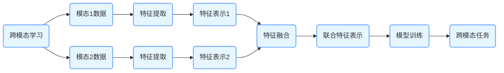

# 跨模态学习在AI系统能力拓展中的重要性

> 关键词：跨模态学习、AI系统、能力拓展、多模态数据、深度学习

> 摘要：本文深入探讨了跨模态学习在AI系统能力拓展中的重要性。首先介绍了跨模态学习的背景知识，包括其目的、预期读者等。接着阐述了跨模态学习的核心概念与联系，通过文本示意图和Mermaid流程图进行详细说明。详细讲解了核心算法原理和具体操作步骤，并结合Python源代码进行阐述。同时给出了相关的数学模型和公式，辅以举例说明。通过项目实战展示了跨模态学习的代码实现和详细解释。探讨了跨模态学习的实际应用场景，推荐了相关的工具和资源。最后总结了跨模态学习的未来发展趋势与挑战，还给出了常见问题与解答以及扩展阅读和参考资料，旨在全面展现跨模态学习对AI系统能力提升的关键作用。

## 1. 背景介绍 
### 1.1 目的和范围
在当今的人工智能领域，数据的多样性和复杂性不断增加。单一模态的数据（如图像、文本、音频等）已经无法满足复杂场景下对信息全面理解和处理的需求。跨模态学习旨在打破不同模态数据之间的壁垒，实现多种模态信息的有效融合和交互。本文章的目的在于深入探讨跨模态学习在AI系统能力拓展中的关键作用，范围涵盖跨模态学习的基本概念、核心算法、数学模型、实际应用等多个方面，旨在为读者全面呈现跨模态学习的全貌及其对AI系统的重要意义。

### 1.2 预期读者
本文预期读者包括人工智能领域的研究人员、开发者、学生以及对跨模态学习和AI系统发展感兴趣的技术爱好者。对于研究人员，本文可以提供跨模态学习领域的前沿知识和研究思路；对于开发者，能为其在实际项目中应用跨模态学习技术提供参考和指导；对于学生，有助于其系统地学习跨模态学习的相关知识；对于技术爱好者，则可以帮助他们了解这一领域的最新动态和发展趋势。

### 1.3 文档结构概述
本文首先介绍跨模态学习的背景知识，包括目的、预期读者等。然后阐述跨模态学习的核心概念与联系，通过文本示意图和Mermaid流程图直观展示。接着详细讲解核心算法原理和具体操作步骤，结合Python源代码进行说明。给出相关的数学模型和公式，并举例说明。通过项目实战展示跨模态学习的代码实现和详细解释。探讨跨模态学习的实际应用场景，推荐相关的工具和资源。最后总结跨模态学习的未来发展趋势与挑战，还给出常见问题与解答以及扩展阅读和参考资料。

### 1.4 术语表
#### 1.4.1 核心术语定义
- **跨模态学习**：是指对不同模态的数据（如图像、文本、音频等）进行联合学习和分析，挖掘不同模态数据之间的内在联系和互补信息，以实现更全面、更准确的信息理解和处理。
- **多模态数据**：指包含多种不同类型信息的数据，例如同时包含图像和对应的文字描述的数据，或者包含音频和视频的多媒体数据等。
- **模态**：表示数据的不同表现形式，常见的模态有视觉模态（如图像、视频）、听觉模态（如音频）、语言模态（如文本）等。

#### 1.4.2 相关概念解释
- **特征提取**：从原始数据中提取出具有代表性和区分性的特征的过程。在跨模态学习中，需要对不同模态的数据分别进行特征提取，以便后续的融合和分析。
- **特征融合**：将不同模态提取的特征进行组合和整合的过程，旨在将多种模态的信息优势结合起来，提高模型的性能和对信息的理解能力。

#### 1.4.3 缩略词列表
- **CNN**：Convolutional Neural Network，卷积神经网络，常用于图像等视觉模态数据的特征提取。
- **RNN**：Recurrent Neural Network，循环神经网络，常用于处理序列数据，如文本等语言模态数据。
- **LSTM**：Long Short - Term Memory，长短期记忆网络，是RNN的一种改进形式，能够更好地处理长序列数据。

## 2. 核心概念与联系 
跨模态学习的核心在于理解不同模态数据之间的关系，并将它们有效地融合在一起。不同模态的数据具有各自独特的特征和信息，例如图像包含丰富的视觉信息，文本包含语义信息，音频包含声音特征等。通过跨模态学习，可以挖掘这些不同模态数据之间的内在联系，实现信息的互补和增强。

### 文本示意图
```plaintext
         跨模态学习
           /       \
    模态1数据     模态2数据
     (如图像)       (如文本)
       |              |
  特征提取         特征提取
       |              |
  特征表示1       特征表示2
       \            /
        特征融合
           |
      联合特征表示
           |
       模型训练
           |
      跨模态任务
  (如图像文本匹配等)
```

### Mermaid流程图


在这个流程中，首先从不同模态的数据开始，分别对其进行特征提取，得到各自的特征表示。然后将这些特征表示进行融合，形成联合特征表示。基于联合特征表示进行模型训练，最后应用于各种跨模态任务中，如跨模态检索、图像文本匹配等。

## 3. 核心算法原理 & 具体操作步骤 
### 核心算法原理
跨模态学习的核心算法通常涉及到深度学习模型的应用，下面以图像 - 文本跨模态学习为例，介绍一种常见的算法原理。

我们的目标是学习图像和文本之间的跨模态表示，使得在同一特征空间中，相关的图像和文本能够距离更近，不相关的则距离更远。常用的方法是使用对比学习，通过构建正样本对（相关的图像 - 文本对）和负样本对（不相关的图像 - 文本对），让模型学习到不同模态之间的关联。

### 具体操作步骤
1. **数据准备**：收集包含图像和对应文本描述的数据集，将数据集划分为训练集、验证集和测试集。
2. **特征提取**：
    - 对于图像数据，使用预训练的卷积神经网络（如ResNet）提取图像特征。
    - 对于文本数据，使用预训练的语言模型（如BERT）提取文本特征。
3. **特征投影**：将图像特征和文本特征投影到同一特征空间中，使得它们具有相同的维度。
4. **对比学习**：定义对比损失函数，通过优化该损失函数来训练模型，使得正样本对的距离尽可能小，负样本对的距离尽可能大。
5. **模型评估**：使用验证集和测试集对训练好的模型进行评估，计算相关的评估指标（如准确率、召回率等）。

### Python源代码实现
```python
import torch
import torch.nn as nn
import torch.optim as optim
from torchvision.models import resnet50
from transformers import BertModel, BertTokenizer

# 定义图像特征提取器
class ImageEncoder(nn.Module):
    def __init__(self):
        super(ImageEncoder, self).__init__()
        self.resnet = resnet50(pretrained=True)
        self.resnet.fc = nn.Identity()  # 去掉最后一层全连接层

    def forward(self, images):
        features = self.resnet(images)
        return features

# 定义文本特征提取器
class TextEncoder(nn.Module):
    def __init__(self):
        super(TextEncoder, self).__init__()
        self.bert = BertModel.from_pretrained('bert-base-uncased')

    def forward(self, input_ids, attention_mask):
        outputs = self.bert(input_ids=input_ids, attention_mask=attention_mask)
        pooled_output = outputs.pooler_output
        return pooled_output

# 定义跨模态模型
class CrossModalModel(nn.Module):
    def __init__(self, image_dim, text_dim, embedding_dim):
        super(CrossModalModel, self).__init__()
        self.image_encoder = ImageEncoder()
        self.text_encoder = TextEncoder()
        self.image_projection = nn.Linear(image_dim, embedding_dim)
        self.text_projection = nn.Linear(text_dim, embedding_dim)

    def forward(self, images, input_ids, attention_mask):
        image_features = self.image_encoder(images)
        text_features = self.text_encoder(input_ids, attention_mask)
        image_embeddings = self.image_projection(image_features)
        text_embeddings = self.text_projection(text_features)
        return image_embeddings, text_embeddings

# 定义对比损失函数
class ContrastiveLoss(nn.Module):
    def __init__(self, temperature=0.1):
        super(ContrastiveLoss, self).__init__()
        self.temperature = temperature
        self.criterion = nn.CrossEntropyLoss()

    def forward(self, image_embeddings, text_embeddings):
        logits = torch.matmul(image_embeddings, text_embeddings.T) / self.temperature
        labels = torch.arange(logits.size(0)).to(logits.device)
        loss_image_text = self.criterion(logits, labels)
        loss_text_image = self.criterion(logits.T, labels)
        loss = (loss_image_text + loss_text_image) / 2
        return loss

# 训练过程示例
def train_model(model, dataloader, optimizer, criterion, device, num_epochs=10):
    model.train()
    for epoch in range(num_epochs):
        running_loss = 0.0
        for images, input_ids, attention_mask in dataloader:
            images = images.to(device)
            input_ids = input_ids.to(device)
            attention_mask = attention_mask.to(device)

            optimizer.zero_grad()
            image_embeddings, text_embeddings = model(images, input_ids, attention_mask)
            loss = criterion(image_embeddings, text_embeddings)
            loss.backward()
            optimizer.step()

            running_loss += loss.item()

        print(f'Epoch {epoch + 1}/{num_epochs}, Loss: {running_loss / len(dataloader)}')
```

在上述代码中，首先定义了图像特征提取器 `ImageEncoder` 和文本特征提取器 `TextEncoder`，然后将它们组合在 `CrossModalModel` 中。通过 `ContrastiveLoss` 定义了对比损失函数，最后实现了训练过程 `train_model`。

## 4. 数学模型和公式 & 详细讲解 & 举例说明 
### 数学模型和公式
在对比学习中，常用的损失函数是InfoNCE（Info - Noise Contrastive Estimation）损失，其数学公式如下：

设图像特征表示为 $\mathbf{v} \in \mathbb{R}^{d}$，文本特征表示为 $\mathbf{t} \in \mathbb{R}^{d}$，其中 $d$ 是特征维度。对于一个包含 $N$ 个样本的小批量数据，图像特征矩阵为 $\mathbf{V} = [\mathbf{v}_1, \mathbf{v}_2, \cdots, \mathbf{v}_N]^T \in \mathbb{R}^{N \times d}$，文本特征矩阵为 $\mathbf{T} = [\mathbf{t}_1, \mathbf{t}_2, \cdots, \mathbf{t}_N]^T \in \mathbb{R}^{N \times d}$。

InfoNCE损失的计算公式为：

$$
L_{image - text} = -\frac{1}{N} \sum_{i=1}^{N} \log \frac{\exp(\mathbf{v}_i^T \mathbf{t}_i / \tau)}{\sum_{j=1}^{N} \exp(\mathbf{v}_i^T \mathbf{t}_j / \tau)}
$$

$$
L_{text - image} = -\frac{1}{N} \sum_{i=1}^{N} \log \frac{\exp(\mathbf{t}_i^T \mathbf{v}_i / \tau)}{\sum_{j=1}^{N} \exp(\mathbf{t}_i^T \mathbf{v}_j / \tau)}
$$

最终的对比损失为：

$$
L = \frac{L_{image - text} + L_{text - image}}{2}
$$

其中，$\tau$ 是温度参数，用于控制分布的平滑程度。

### 详细讲解
InfoNCE损失的核心思想是通过对比正样本对（相关的图像 - 文本对）和负样本对（不相关的图像 - 文本对）的相似度，让模型学习到不同模态之间的关联。具体来说，对于每个图像特征 $\mathbf{v}_i$，它与对应的文本特征 $\mathbf{t}_i$ 构成正样本对，与其他文本特征 $\mathbf{t}_j (j \neq i)$ 构成负样本对。通过计算正样本对的相似度得分与所有样本对（包括正样本对和负样本对）的相似度得分的比值的对数，得到图像到文本的损失 $L_{image - text}$。同理，计算文本到图像的损失 $L_{text - image}$，最后取两者的平均值作为最终的对比损失 $L$。

### 举例说明
假设我们有一个小批量数据，包含 $N = 3$ 个样本，图像特征矩阵 $\mathbf{V}$ 和文本特征矩阵 $\mathbf{T}$ 如下：

$$
\mathbf{V} = \begin{bmatrix}
1 & 2 \\
3 & 4 \\
5 & 6
\end{bmatrix}, \quad
\mathbf{T} = \begin{bmatrix}
2 & 3 \\
4 & 5 \\
6 & 7
\end{bmatrix}
$$

温度参数 $\tau = 0.1$。

首先计算图像到文本的相似度得分矩阵 $\mathbf{S}_{image - text}$：

$$
\mathbf{S}_{image - text} = \frac{\mathbf{V} \mathbf{T}^T}{\tau} = \begin{bmatrix}
\frac{1\times2 + 2\times3}{0.1} & \frac{1\times4 + 2\times5}{0.1} & \frac{1\times6 + 2\times7}{0.1} \\
\frac{3\times2 + 4\times3}{0.1} & \frac{3\times4 + 4\times5}{0.1} & \frac{3\times6 + 4\times7}{0.1} \\
\frac{5\times2 + 6\times3}{0.1} & \frac{5\times4 + 6\times5}{0.1} & \frac{5\times6 + 6\times7}{0.1}
\end{bmatrix} = \begin{bmatrix}
80 & 140 & 200 \\
180 & 320 & 460 \\
280 & 500 & 720
\end{bmatrix}
$$

然后计算 $L_{image - text}$：

$$
L_{image - text} = -\frac{1}{3} \left( \log \frac{\exp(80)}{\exp(80) + \exp(140) + \exp(200)} + \log \frac{\exp(320)}{\exp(180) + \exp(320) + \exp(460)} + \log \frac{\exp(720)}{\exp(280) + \exp(500) + \exp(720)} \right)
$$

同理计算 $L_{text - image}$，最后得到最终的对比损失 $L$。

## 5. 项目实战：代码实际案例和详细解释说明 
### 5.1  开发环境搭建
1. **安装Python**：建议使用Python 3.7及以上版本，可以从Python官方网站（https://www.python.org/downloads/）下载并安装。
2. **安装深度学习框架**：使用PyTorch作为深度学习框架，可以根据自己的CUDA版本选择合适的安装方式，具体安装命令可以参考PyTorch官方网站（https://pytorch.org/get-started/locally/）。
3. **安装其他依赖库**：安装`torchvision`用于图像处理，`transformers`用于使用预训练的语言模型，以及`numpy`、`matplotlib`等常用库。可以使用以下命令进行安装：
```sh
pip install torchvision transformers numpy matplotlib
```

### 5.2  源代码详细实现和代码解读
以下是一个完整的图像 - 文本跨模态学习的项目实战代码：

```python
import torch
import torch.nn as nn
import torch.optim as optim
from torchvision.models import resnet50
from torchvision.transforms import transforms
from transformers import BertModel, BertTokenizer
from torch.utils.data import Dataset, DataLoader
import os
from PIL import Image

# 自定义数据集类
class ImageTextDataset(Dataset):
    def __init__(self, image_dir, text_file, transform=None):
        self.image_dir = image_dir
        self.text_file = text_file
        self.transform = transform
        self.image_files = os.listdir(image_dir)
        with open(text_file, 'r', encoding='utf-8') as f:
            self.texts = f.readlines()

    def __len__(self):
        return len(self.image_files)

    def __getitem__(self, idx):
        image_file = self.image_files[idx]
        image_path = os.path.join(self.image_dir, image_file)
        image = Image.open(image_path).convert('RGB')
        if self.transform:
            image = self.transform(image)

        text = self.texts[idx].strip()
        tokenizer = BertTokenizer.from_pretrained('bert-base-uncased')
        encoding = tokenizer(text, return_tensors='pt', padding='max_length', truncation=True, max_length=128)
        input_ids = encoding['input_ids'].squeeze(0)
        attention_mask = encoding['attention_mask'].squeeze(0)

        return image, input_ids, attention_mask

# 定义图像特征提取器
class ImageEncoder(nn.Module):
    def __init__(self):
        super(ImageEncoder, self).__init__()
        self.resnet = resnet50(pretrained=True)
        self.resnet.fc = nn.Identity()  # 去掉最后一层全连接层

    def forward(self, images):
        features = self.resnet(images)
        return features

# 定义文本特征提取器
class TextEncoder(nn.Module):
    def __init__(self):
        super(TextEncoder, self).__init__()
        self.bert = BertModel.from_pretrained('bert-base-uncased')

    def forward(self, input_ids, attention_mask):
        outputs = self.bert(input_ids=input_ids, attention_mask=attention_mask)
        pooled_output = outputs.pooler_output
        return pooled_output

# 定义跨模态模型
class CrossModalModel(nn.Module):
    def __init__(self, image_dim, text_dim, embedding_dim):
        super(CrossModalModel, self).__init__()
        self.image_encoder = ImageEncoder()
        self.text_encoder = TextEncoder()
        self.image_projection = nn.Linear(image_dim, embedding_dim)
        self.text_projection = nn.Linear(text_dim, embedding_dim)

    def forward(self, images, input_ids, attention_mask):
        image_features = self.image_encoder(images)
        text_features = self.text_encoder(input_ids, attention_mask)
        image_embeddings = self.image_projection(image_features)
        text_embeddings = self.text_projection(text_features)
        return image_embeddings, text_embeddings

# 定义对比损失函数
class ContrastiveLoss(nn.Module):
    def __init__(self, temperature=0.1):
        super(ContrastiveLoss, self).__init__()
        self.temperature = temperature
        self.criterion = nn.CrossEntropyLoss()

    def forward(self, image_embeddings, text_embeddings):
        logits = torch.matmul(image_embeddings, text_embeddings.T) / self.temperature
        labels = torch.arange(logits.size(0)).to(logits.device)
        loss_image_text = self.criterion(logits, labels)
        loss_text_image = self.criterion(logits.T, labels)
        loss = (loss_image_text + loss_text_image) / 2
        return loss

# 训练过程
def train_model(model, dataloader, optimizer, criterion, device, num_epochs=10):
    model.train()
    for epoch in range(num_epochs):
        running_loss = 0.0
        for images, input_ids, attention_mask in dataloader:
            images = images.to(device)
            input_ids = input_ids.to(device)
            attention_mask = attention_mask.to(device)

            optimizer.zero_grad()
            image_embeddings, text_embeddings = model(images, input_ids, attention_mask)
            loss = criterion(image_embeddings, text_embeddings)
            loss.backward()
            optimizer.step()

            running_loss += loss.item()

        print(f'Epoch {epoch + 1}/{num_epochs}, Loss: {running_loss / len(dataloader)}')

# 主函数
if __name__ == '__main__':
    # 数据路径
    image_dir = 'path/to/images'
    text_file = 'path/to/texts.txt'

    # 数据预处理
    transform = transforms.Compose([
        transforms.Resize((224, 224)),
        transforms.ToTensor(),
        transforms.Normalize(mean=[0.485, 0.456, 0.406], std=[0.229, 0.224, 0.225])
    ])

    # 创建数据集和数据加载器
    dataset = ImageTextDataset(image_dir, text_file, transform)
    dataloader = DataLoader(dataset, batch_size=32, shuffle=True)

    # 设备选择
    device = torch.device('cuda' if torch.cuda.is_available() else 'cpu')

    # 模型初始化
    image_dim = 2048
    text_dim = 768
    embedding_dim = 512
    model = CrossModalModel(image_dim, text_dim, embedding_dim).to(device)

    # 优化器和损失函数
    optimizer = optim.Adam(model.parameters(), lr=1e-4)
    criterion = ContrastiveLoss()

    # 训练模型
    train_model(model, dataloader, optimizer, criterion, device, num_epochs=10)
```

### 代码解读与分析
1. **自定义数据集类 `ImageTextDataset`**：用于加载图像和对应的文本数据。在 `__getitem__` 方法中，读取图像并进行预处理，同时对文本进行分词和编码，返回图像、输入ID和注意力掩码。
2. **图像特征提取器 `ImageEncoder`**：使用预训练的ResNet50模型提取图像特征，去掉最后一层全连接层，以得到图像的特征表示。
3. **文本特征提取器 `TextEncoder`**：使用预训练的BERT模型提取文本特征，通过 `pooler_output` 得到文本的特征表示。
4. **跨模态模型 `CrossModalModel`**：将图像特征提取器和文本特征提取器组合在一起，并通过线性投影层将图像和文本特征投影到同一特征空间中。
5. **对比损失函数 `ContrastiveLoss`**：实现了InfoNCE损失，通过计算正样本对和负样本对的相似度得分，得到最终的对比损失。
6. **训练过程 `train_model`**：在每个epoch中，遍历数据加载器，计算损失并进行反向传播和参数更新。

## 6. 实际应用场景 
跨模态学习在多个领域都有广泛的应用，以下是一些常见的实际应用场景：

### 图像 - 文本检索
在图像 - 文本检索中，用户可以输入文本描述来检索相关的图像，或者输入图像来检索相关的文本描述。跨模态学习可以学习图像和文本之间的关联，将它们映射到同一特征空间中，从而实现高效准确的跨模态检索。例如，在一个图像数据库中，用户输入“一只可爱的小狗在草地上玩耍”，系统可以通过跨模态学习模型检索出相关的小狗在草地上玩耍的图像。

### 视频理解与描述
在视频理解与描述任务中，跨模态学习可以结合视频中的视觉信息和音频信息，对视频内容进行更全面的理解和描述。例如，在智能监控系统中，通过分析视频中的画面和声音，系统可以准确地识别出事件的类型（如打架、火灾等）并生成相应的描述。

### 多模态情感分析
在多模态情感分析中，结合文本、语音和面部表情等多种模态的数据，可以更准确地分析用户的情感状态。例如，在智能客服系统中，通过分析用户的文本输入、语音语调以及面部表情等信息，系统可以更好地理解用户的情绪，提供更个性化的服务。

### 医疗诊断
在医疗领域，跨模态学习可以结合医学图像（如X光、CT等）和病历文本等多模态数据，辅助医生进行疾病诊断。例如，通过分析患者的X光图像和病历描述，系统可以帮助医生更准确地判断疾病的类型和严重程度。

## 7. 工具和资源推荐
### 7.1 学习资源推荐
#### 7.1.1 书籍推荐
- 《深度学习》（Deep Learning）：由Ian Goodfellow、Yoshua Bengio和Aaron Courville合著，是深度学习领域的经典教材，涵盖了深度学习的基本原理、算法和应用。
- 《Python深度学习》（Deep Learning with Python）：由Francois Chollet编写，通过Python代码和实例详细介绍了深度学习的实践方法，适合初学者。

#### 7.1.2 在线课程
- Coursera上的“深度学习专项课程”（Deep Learning Specialization）：由Andrew Ng教授讲授，系统地介绍了深度学习的各个方面，包括神经网络、卷积神经网络、循环神经网络等。
- edX上的“强化学习基础”（Foundations of Reinforcement Learning）：介绍了强化学习的基本概念和算法，对于理解跨模态学习中的一些优化算法有帮助。

#### 7.1.3 技术博客和网站
- Medium：上面有很多关于人工智能和跨模态学习的技术文章，作者来自世界各地的研究人员和开发者。
- arXiv：提供了大量的学术论文，包括跨模态学习领域的最新研究成果。

### 7.2 开发工具框架推荐
#### 7.2.1 IDE和编辑器
- PyCharm：是一款专业的Python集成开发环境，提供了丰富的代码编辑、调试和项目管理功能。
- Visual Studio Code：是一款轻量级的代码编辑器，支持多种编程语言和插件，适合快速开发和调试。

#### 7.2.2 调试和性能分析工具
- PyTorch Profiler：可以帮助用户分析PyTorch模型的性能瓶颈，优化模型的训练和推理速度。
- TensorBoard：是TensorFlow的可视化工具，也可以与PyTorch结合使用，用于可视化模型的训练过程和性能指标。

#### 7.2.3 相关框架和库
- PyTorch：是一个开源的深度学习框架，提供了丰富的神经网络层和优化算法，方便用户进行跨模态学习模型的开发。
- Transformers：是Hugging Face开发的一个自然语言处理库，提供了多种预训练的语言模型，如BERT、GPT等，可用于文本特征提取。

### 7.3 相关论文著作推荐
#### 7.3.1 经典论文
- "Distributed Representations of Words and Phrases and their Compositionality"：介绍了Word2Vec模型，为词向量的表示和学习奠定了基础。
- "ImageNet Classification with Deep Convolutional Neural Networks"：提出了AlexNet模型，开创了深度学习在计算机视觉领域的应用。

#### 7.3.2 最新研究成果
- 关注arXiv上关于跨模态学习的最新论文，了解该领域的前沿研究动态。

#### 7.3.3 应用案例分析
- 一些顶级学术会议（如CVPR、ICML、NeurIPS等）上的论文会介绍跨模态学习在实际应用中的案例和方法，可以从中学习到具体的应用技巧和经验。

## 8. 总结：未来发展趋势与挑战
### 未来发展趋势
1. **更复杂的多模态融合**：未来的跨模态学习将不仅仅局限于图像、文本和音频等常见模态的融合，还会涉及到更多复杂的模态，如触觉、嗅觉等，以实现更全面的信息感知和理解。
2. **跨模态生成**：跨模态生成技术将得到进一步发展，例如根据文本描述生成逼真的图像，或者根据图像生成相关的文本故事等，为创意设计和内容创作提供更多的可能性。
3. **强化跨模态交互**：实现更加自然和高效的跨模态交互，例如通过语音和手势等多种方式与AI系统进行交互，提升用户体验。
4. **跨模态知识图谱**：构建跨模态知识图谱，将不同模态的数据和知识进行整合，为智能决策和推理提供更丰富的信息支持。

### 挑战
1. **数据对齐问题**：不同模态的数据在时间和空间上的对齐是一个难题，例如在视频理解中，如何准确地将音频和视频中的信息进行对齐，需要更有效的方法和技术。
2. **计算资源需求**：跨模态学习模型通常比较复杂，需要大量的计算资源和时间进行训练和推理，如何优化模型结构和算法，降低计算成本是一个挑战。
3. **语义鸿沟问题**：不同模态的数据之间存在语义鸿沟，例如图像中的视觉信息和文本中的语义信息如何进行有效的关联和转换，需要深入的研究和探索。
4. **伦理和隐私问题**：随着跨模态学习的应用越来越广泛，涉及到的数据也越来越多样化，如何保护用户的隐私和数据安全，避免伦理问题的发生，是需要关注的重要问题。

## 9. 附录：常见问题与解答
### 问题1：跨模态学习和单模态学习有什么区别？
单模态学习只处理单一类型的数据，如只处理图像或只处理文本。而跨模态学习则关注不同模态数据之间的关系和融合，通过挖掘不同模态数据的互补信息，实现更全面、更准确的信息理解和处理。

### 问题2：跨模态学习中如何选择合适的特征提取方法？
选择合适的特征提取方法需要考虑数据的模态和特点。对于图像数据，常用的方法是使用卷积神经网络（如ResNet、VGG等）；对于文本数据，可以使用预训练的语言模型（如BERT、GPT等）。此外，还可以根据具体的任务和数据情况进行特征工程和优化。

### 问题3：跨模态学习模型的训练时间通常比较长，如何加速训练过程？
可以采取以下方法加速训练过程：
1. 使用GPU进行计算，利用GPU的并行计算能力提高训练速度。
2. 优化模型结构，减少模型的参数数量和复杂度。
3. 使用数据增强技术，增加训练数据的多样性，提高模型的泛化能力，减少过拟合的风险。
4. 采用分布式训练方法，利用多个GPU或多个计算节点进行并行训练。

### 问题4：跨模态学习在实际应用中可能会遇到哪些问题？
在实际应用中，跨模态学习可能会遇到以下问题：
1. 数据质量问题：不同模态的数据可能存在噪声、缺失值等问题，需要进行数据清洗和预处理。
2. 模态不平衡问题：不同模态的数据量可能存在不平衡，需要采取相应的方法进行处理，如数据采样、加权损失等。
3. 模型可解释性问题：跨模态学习模型通常比较复杂，难以解释其决策过程和结果，需要研究可解释性方法。
4. 部署和优化问题：将跨模态学习模型部署到实际应用中时，需要考虑模型的性能、效率和资源占用等问题，进行相应的优化。

## 10. 扩展阅读 & 参考资料
1. Goodfellow, I., Bengio, Y., & Courville, A. (2016). Deep Learning. MIT Press.
2. Chollet, F. (2017). Deep Learning with Python. Manning Publications.
3. LeCun, Y., Bengio, Y., & Hinton, G. (2015). Deep learning. Nature, 521(7553), 436 - 444.
4. Vaswani, A., Shazeer, N., Parmar, N., Uszkoreit, J., Jones, L., Gomez, A. N., ... & Polosukhin, I. (2017). Attention is all you need. In Advances in neural information processing systems (pp. 5998 - 6008).
5. Devlin, J., Chang, M. W., Lee, K., & Toutanova, K. (2018). Bert: Pre - training of deep bidirectional transformers for language understanding. arXiv preprint arXiv:1810.04805.

作者：AI天才研究院/AI Genius Institute & 禅与计算机程序设计艺术 /Zen And The Art of Computer Programming