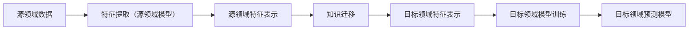

# 迁移学习：让AI Agent快速适应新领域

> 关键词：迁移学习、AI Agent、新领域适应、机器学习、知识迁移

> 摘要：本文围绕迁移学习展开，旨在深入探讨如何让AI Agent快速适应新领域。首先介绍了迁移学习的背景知识，包括目的、预期读者、文档结构和相关术语。接着阐述了迁移学习的核心概念与联系，给出了原理和架构的文本示意图及Mermaid流程图。详细讲解了核心算法原理，并使用Python代码进行说明，同时给出了数学模型和公式及具体例子。通过项目实战展示了迁移学习的实际应用，包括开发环境搭建、源代码实现与解读。探讨了迁移学习的实际应用场景，推荐了相关的学习资源、开发工具框架和论文著作。最后总结了迁移学习的未来发展趋势与挑战，提供了常见问题解答和扩展阅读参考资料。

## 1. 背景介绍 
### 1.1 目的和范围
在人工智能的发展历程中，传统的机器学习模型通常需要在大量标注数据上进行训练，才能达到较好的性能。然而，在很多实际应用场景中，获取大规模的标注数据是非常困难且昂贵的。例如，在医疗影像诊断领域，标注大量的医学图像需要专业医生花费大量的时间和精力。迁移学习的出现为解决这一问题提供了有效的途径。

本文的目的是全面介绍迁移学习的原理、算法、应用和发展趋势，重点关注如何利用迁移学习让AI Agent快速适应新领域。我们将探讨迁移学习在不同领域的应用，如计算机视觉、自然语言处理、语音识别等，并通过实际案例展示迁移学习的有效性和实用性。

### 1.2 预期读者
本文的预期读者包括人工智能领域的研究人员、开发者、数据科学家以及对迁移学习感兴趣的技术爱好者。对于初学者，本文可以作为一个系统的入门教程，帮助他们了解迁移学习的基本概念和方法；对于有一定经验的专业人士，本文提供了深入的技术分析和最新的研究成果，可供他们进一步探索和研究。

### 1.3 文档结构概述
本文将按照以下结构进行组织：
1. **背景介绍**：介绍迁移学习的目的、预期读者、文档结构和相关术语。
2. **核心概念与联系**：阐述迁移学习的核心概念、原理和架构，给出文本示意图和Mermaid流程图。
3. **核心算法原理 & 具体操作步骤**：详细讲解迁移学习的核心算法原理，并使用Python代码进行说明。
4. **数学模型和公式 & 详细讲解 & 举例说明**：给出迁移学习的数学模型和公式，并通过具体例子进行详细讲解。
5. **项目实战：代码实际案例和详细解释说明**：通过一个实际项目展示迁移学习的应用，包括开发环境搭建、源代码实现与解读。
6. **实际应用场景**：探讨迁移学习在不同领域的实际应用场景。
7. **工具和资源推荐**：推荐相关的学习资源、开发工具框架和论文著作。
8. **总结：未来发展趋势与挑战**：总结迁移学习的未来发展趋势和面临的挑战。
9. **附录：常见问题与解答**：提供常见问题的解答。
10. **扩展阅读 & 参考资料**：提供扩展阅读的建议和相关参考资料。

### 1.4 术语表
#### 1.4.1 核心术语定义
- **迁移学习（Transfer Learning）**：是一种机器学习技术，它将从一个或多个源领域学到的知识迁移到目标领域，以提高目标领域的学习性能。
- **AI Agent**：指能够感知环境、做出决策并采取行动的人工智能实体。
- **源领域（Source Domain）**：是指已经有大量数据和知识的领域。
- **目标领域（Target Domain）**：是指需要应用迁移学习来提高性能的领域。
- **特征迁移（Feature Transfer）**：是指将源领域的特征表示迁移到目标领域。
- **模型迁移（Model Transfer）**：是指将源领域训练好的模型迁移到目标领域。

#### 1.4.2 相关概念解释
- **领域适应（Domain Adaptation）**：是迁移学习的一种特殊情况，主要关注如何减少源领域和目标领域之间的分布差异。
- **多任务学习（Multi - task Learning）**：与迁移学习有一定的关联，它同时学习多个相关任务，通过共享知识来提高各个任务的性能。
- **元学习（Meta - Learning）**：旨在学习如何快速学习，它可以为迁移学习提供更有效的学习策略。

#### 1.4.3 缩略词列表
- **ML**：Machine Learning，机器学习
- **DL**：Deep Learning，深度学习
- **CNN**：Convolutional Neural Network，卷积神经网络
- **RNN**：Recurrent Neural Network，循环神经网络
- **LSTM**：Long Short - Term Memory，长短期记忆网络

## 2. 核心概念与联系 

### 核心概念原理
迁移学习的核心思想是利用源领域和目标领域之间的相似性，将源领域学到的知识迁移到目标领域，从而减少目标领域所需的训练数据和时间。在传统的机器学习中，每个任务都需要独立地进行训练，而迁移学习打破了这种孤立的学习模式，通过知识共享来提高学习效率。

例如，在图像识别任务中，我们可以先在大规模的图像数据集（如ImageNet）上训练一个卷积神经网络（CNN），这个数据集包含了各种不同类别的图像。然后，当我们需要处理一个新的图像识别任务（如识别特定类型的植物）时，由于植物图像和ImageNet数据集中的图像在视觉特征上有一定的相似性，我们可以将在ImageNet上训练好的CNN模型的部分参数迁移到新的任务中，只需要在少量的植物图像数据上进行微调，就可以得到一个性能较好的模型。

### 架构的文本示意图
```plaintext
源领域数据
    |
    | 特征提取（源领域模型）
    v
源领域特征表示
    |
    | 知识迁移
    v
目标领域特征表示
    |
    | 目标领域模型训练
    v
目标领域预测模型
```

### Mermaid流程图


## 3. 核心算法原理 & 具体操作步骤 

### 核心算法原理
迁移学习有多种算法，这里我们以基于特征迁移的方法为例进行介绍。基于特征迁移的方法主要是通过提取源领域和目标领域的特征，然后寻找一种合适的方式将源领域的特征表示迁移到目标领域。

常见的基于特征迁移的算法有：
- **主成分分析（PCA）**：PCA是一种无监督的特征降维方法，它可以将高维数据投影到低维空间中，同时保留数据的主要信息。在迁移学习中，我们可以先对源领域和目标领域的数据分别进行PCA降维，然后将源领域的主成分空间迁移到目标领域。
- **深度神经网络特征迁移**：在深度学习中，预训练的深度神经网络（如ResNet、VGG等）已经在大规模数据集上学习到了丰富的特征表示。我们可以将预训练模型的部分层（如卷积层）的参数固定，然后在目标领域的数据上对模型的后续层进行微调。

### 具体操作步骤及Python代码实现

#### 步骤1：数据加载和预处理
```python
import numpy as np
from sklearn.datasets import load_iris
from sklearn.model_selection import train_test_split
from sklearn.preprocessing import StandardScaler

# 加载源领域数据
source_data = load_iris()
X_source = source_data.data
y_source = source_data.target

# 加载目标领域数据（这里假设目标领域数据和源领域数据类似）
target_data = load_iris()
X_target = target_data.data
y_target = target_data.target

# 数据预处理
scaler = StandardScaler()
X_source = scaler.fit_transform(X_source)
X_target = scaler.transform(X_target)

# 划分训练集和测试集
X_source_train, X_source_test, y_source_train, y_source_test = train_test_split(X_source, y_source, test_size=0.2, random_state=42)
X_target_train, X_target_test, y_target_train, y_target_test = train_test_split(X_target, y_target, test_size=0.2, random_state=42)
```

#### 步骤2：源领域模型训练
```python
from sklearn.svm import SVC

# 训练源领域模型
source_model = SVC()
source_model.fit(X_source_train, y_source_train)

# 评估源领域模型
source_score = source_model.score(X_source_test, y_source_test)
print(f"源领域模型准确率: {source_score}")
```

#### 步骤3：特征迁移和目标领域模型训练
```python
# 这里简单地将源领域模型的特征表示直接用于目标领域
X_target_train_transformed = source_model.decision_function(X_target_train)
X_target_test_transformed = source_model.decision_function(X_target_test)

# 训练目标领域模型
target_model = SVC()
target_model.fit(X_target_train_transformed, y_target_train)

# 评估目标领域模型
target_score = target_model.score(X_target_test_transformed, y_target_test)
print(f"目标领域模型准确率: {target_score}")
```

## 4. 数学模型和公式 & 详细讲解 & 举例说明 

### 数学模型和公式
在迁移学习中，我们通常假设源领域的数据分布为 $P_S(x_S, y_S)$，目标领域的数据分布为 $P_T(x_T, y_T)$，其中 $x$ 表示特征向量，$y$ 表示标签。迁移学习的目标是在目标领域的少量标注数据和源领域的大量数据的帮助下，学习一个预测函数 $f_T: x_T \rightarrow y_T$，使得在目标领域的损失函数 $L_T(f_T)$ 最小化。

一种常见的损失函数可以表示为：
$$L_T(f_T) = \frac{1}{n_T} \sum_{i = 1}^{n_T} l(f_T(x_{T_i}), y_{T_i}) + \lambda \cdot d(P_S(x_S), P_T(x_T))$$
其中，$n_T$ 是目标领域的样本数量，$l$ 是损失函数（如交叉熵损失、均方误差损失等），$\lambda$ 是一个超参数，用于平衡目标领域的损失和源领域与目标领域之间的分布差异 $d(P_S(x_S), P_T(x_T))$。

### 详细讲解
- **目标领域损失项**：$\frac{1}{n_T} \sum_{i = 1}^{n_T} l(f_T(x_{T_i}), y_{T_i})$ 表示目标领域模型在目标领域数据上的损失。这部分损失反映了模型对目标领域数据的拟合程度。
- **分布差异项**：$\lambda \cdot d(P_S(x_S), P_T(x_T))$ 表示源领域和目标领域之间的分布差异。常见的分布差异度量方法有最大均值差异（MMD）、Kullback - Leibler散度（KL散度）等。通过最小化这部分损失，可以使源领域和目标领域的数据分布更加接近，从而提高迁移学习的性能。

### 举例说明
假设我们有一个源领域数据集 $S$ 包含1000个样本，目标领域数据集 $T$ 包含100个样本。我们使用交叉熵损失函数 $l$，并选择最大均值差异（MMD）作为分布差异度量方法。

首先，我们训练一个源领域模型 $f_S$，然后将其特征表示迁移到目标领域。在训练目标领域模型 $f_T$ 时，我们根据上述损失函数进行优化。通过调整超参数 $\lambda$，我们可以平衡目标领域的损失和分布差异。当 $\lambda$ 较大时，模型会更注重源领域和目标领域的分布匹配；当 $\lambda$ 较小时，模型会更注重目标领域的损失。

## 5. 项目实战：代码实际案例和详细解释说明 

### 5.1  开发环境搭建
#### 操作系统
本文的项目可以在Windows、Linux或macOS操作系统上运行。建议使用Linux系统，因为它在机器学习和深度学习开发中具有更好的稳定性和性能。

#### 编程语言和库
- **Python**：建议使用Python 3.7及以上版本。
- **深度学习框架**：可以选择TensorFlow或PyTorch。本文以PyTorch为例进行开发。
- **其他库**：NumPy、Pandas、Scikit - learn等。

#### 安装步骤
```bash
# 创建虚拟环境
python -m venv transfer_learning_env
source transfer_learning_env/bin/activate

# 安装所需库
pip install torch torchvision numpy pandas scikit-learn
```

### 5.2  源代码详细实现和代码解读
#### 项目背景
我们将使用迁移学习来解决一个图像分类问题。具体来说，我们将在CIFAR - 10数据集上预训练一个ResNet模型，然后将其迁移到一个自定义的小图像数据集上进行微调。

#### 代码实现

```python
import torch
import torch.nn as nn
import torch.optim as optim
import torchvision
import torchvision.transforms as transforms
from torch.utils.data import DataLoader

# 数据预处理
transform = transforms.Compose([
    transforms.RandomCrop(32, padding=4),
    transforms.RandomHorizontalFlip(),
    transforms.ToTensor(),
    transforms.Normalize((0.5, 0.5, 0.5), (0.5, 0.5, 0.5))
])

# 加载CIFAR - 10数据集
trainset = torchvision.datasets.CIFAR10(root='./data', train=True,
                                        download=True, transform=transform)
trainloader = DataLoader(trainset, batch_size=32, shuffle=True)

testset = torchvision.datasets.CIFAR10(root='./data', train=False,
                                       download=True, transform=transform)
testloader = DataLoader(testset, batch_size=32, shuffle=False)

# 加载预训练的ResNet模型
model = torchvision.models.resnet18(pretrained=True)
num_ftrs = model.fc.in_features
model.fc = nn.Linear(num_ftrs, 10)  # 修改最后一层的输出维度为10（CIFAR - 10有10个类别）

# 定义损失函数和优化器
criterion = nn.CrossEntropyLoss()
optimizer = optim.SGD(model.parameters(), lr=0.001, momentum=0.9)

# 训练模型
device = torch.device("cuda:0" if torch.cuda.is_available() else "cpu")
model.to(device)

for epoch in range(5):  # 训练5个epoch
    running_loss = 0.0
    for i, data in enumerate(trainloader, 0):
        inputs, labels = data[0].to(device), data[1].to(device)

        optimizer.zero_grad()

        outputs = model(inputs)
        loss = criterion(outputs, labels)
        loss.backward()
        optimizer.step()

        running_loss += loss.item()
        if i % 200 == 199:
            print(f'[{epoch + 1}, {i + 1:5d}] loss: {running_loss / 200:.3f}')
            running_loss = 0.0

print('Finished Training')

# 保存预训练模型
torch.save(model.state_dict(), 'resnet18_cifar10.pth')

# 加载自定义小图像数据集（这里假设已经有自定义数据集）
# 自定义数据集的加载和预处理代码省略

# 迁移学习：加载预训练模型并修改最后一层
transfer_model = torchvision.models.resnet18(pretrained=False)
transfer_model.load_state_dict(torch.load('resnet18_cifar10.pth'))
num_ftrs = transfer_model.fc.in_features
transfer_model.fc = nn.Linear(num_ftrs, num_classes_of_custom_dataset)  # 修改最后一层的输出维度为自定义数据集的类别数

# 冻结除最后一层外的所有层
for param in transfer_model.parameters():
    param.requires_grad = False
for param in transfer_model.fc.parameters():
    param.requires_grad = True

# 定义新的优化器和损失函数
optimizer_transfer = optim.SGD(transfer_model.fc.parameters(), lr=0.001, momentum=0.9)
criterion_transfer = nn.CrossEntropyLoss()

# 在自定义数据集上进行微调
transfer_model.to(device)
for epoch in range(3):  # 微调3个epoch
    running_loss = 0.0
    for i, data in enumerate(custom_trainloader, 0):
        inputs, labels = data[0].to(device), data[1].to(device)

        optimizer_transfer.zero_grad()

        outputs = transfer_model(inputs)
        loss = criterion_transfer(outputs, labels)
        loss.backward()
        optimizer_transfer.step()

        running_loss += loss.item()
        if i % 100 == 99:
            print(f'[{epoch + 1}, {i + 1:5d}] transfer loss: {running_loss / 100:.3f}')
            running_loss = 0.0

print('Finished Transfer Learning')
```

### 5.3  代码解读与分析
#### 预训练模型训练部分
- **数据预处理**：使用`transforms.Compose`定义了一系列的数据预处理操作，包括随机裁剪、随机水平翻转、转换为张量和归一化。
- **数据集加载**：使用`torchvision.datasets.CIFAR10`加载CIFAR - 10数据集，并使用`DataLoader`创建数据加载器。
- **模型加载和修改**：加载预训练的ResNet18模型，并修改最后一层的输出维度为10，以适应CIFAR - 10数据集的10个类别。
- **训练过程**：定义损失函数和优化器，然后在CIFAR - 10数据集上训练模型5个epoch。

#### 迁移学习部分
- **加载预训练模型**：加载之前训练好的ResNet18模型。
- **修改最后一层**：根据自定义数据集的类别数修改最后一层的输出维度。
- **冻结参数**：冻结除最后一层外的所有层的参数，只训练最后一层。
- **微调过程**：定义新的优化器和损失函数，然后在自定义数据集上微调模型3个epoch。

通过这种方式，我们可以利用在CIFAR - 10数据集上预训练的模型的知识，快速适应自定义数据集的分类任务。

## 6. 实际应用场景 
### 计算机视觉领域
- **图像分类**：在实际的图像分类任务中，可能没有足够的标注数据来训练一个高精度的模型。通过迁移学习，可以利用在大规模图像数据集（如ImageNet）上预训练的模型，将其特征表示迁移到目标数据集上，从而提高分类性能。例如，在医学图像分类中，由于医学图像的标注成本较高，迁移学习可以帮助我们在少量标注数据的情况下实现准确的分类。
- **目标检测**：目标检测任务需要识别图像中的物体并定位其位置。预训练的目标检测模型（如Faster R - CNN、YOLO等）可以在大规模的目标检测数据集上学习到物体的特征和检测模式。当应用于新的目标检测场景时，可以通过迁移学习对模型进行微调，使其快速适应新的目标类型和场景。

### 自然语言处理领域
- **文本分类**：在文本分类任务中，不同领域的文本数据可能具有不同的语言风格和主题。通过迁移学习，可以利用在大规模通用文本数据集（如Wikipedia）上预训练的语言模型（如BERT、GPT等），将其语言知识迁移到特定领域的文本分类任务中。例如，在新闻文本分类、情感分析等任务中，迁移学习可以显著提高分类的准确率。
- **机器翻译**：机器翻译需要学习不同语言之间的语义和语法转换。预训练的翻译模型可以在大规模的平行语料库上学习到语言之间的映射关系。当应用于新的语言对或特定领域的翻译任务时，可以通过迁移学习对模型进行微调，提高翻译的质量。

### 语音识别领域
- **特定领域语音识别**：在一些特定领域，如医疗、金融等，语音数据的收集和标注比较困难。通过迁移学习，可以利用在通用语音数据集上预训练的语音识别模型，将其声学特征和语言模型迁移到特定领域的语音识别任务中。例如，在医疗语音记录的转录任务中，迁移学习可以帮助模型更好地理解医学术语和专业词汇。

## 7. 工具和资源推荐
### 7.1 学习资源推荐
#### 7.1.1 书籍推荐
- 《迁移学习》：本书全面介绍了迁移学习的理论、方法和应用，是迁移学习领域的经典著作。
- 《深度学习》：虽然不是专门针对迁移学习的书籍，但它涵盖了深度学习的基础知识和常见模型，对于理解迁移学习的技术原理有很大帮助。

#### 7.1.2 在线课程
- Coursera上的“Deep Learning Specialization”：由Andrew Ng教授授课，其中包含了深度学习的多个方面，包括迁移学习的相关内容。
- edX上的“Introduction to Artificial Intelligence”：该课程介绍了人工智能的基本概念和方法，对迁移学习也有一定的涉及。

#### 7.1.3 技术博客和网站
- Medium：上面有很多关于迁移学习的技术文章和实践经验分享。
- arXiv：可以获取到迁移学习领域的最新研究论文。

### 7.2 开发工具框架推荐
#### 7.2.1 IDE和编辑器
- PyCharm：是一款专业的Python集成开发环境，具有强大的代码编辑、调试和项目管理功能。
- Jupyter Notebook：适合进行交互式的代码开发和数据分析，方便展示和分享代码和实验结果。

#### 7.2.2 调试和性能分析工具
- TensorBoard：是TensorFlow提供的可视化工具，可以用于监控模型的训练过程、可视化模型结构和分析模型性能。
- PyTorch Profiler：可以帮助我们分析PyTorch模型的性能瓶颈，找出需要优化的部分。

#### 7.2.3 相关框架和库
- TensorFlow：是一个广泛使用的深度学习框架，提供了丰富的工具和库来支持迁移学习的开发。
- PyTorch：是另一个流行的深度学习框架，具有简洁易用的API和良好的灵活性，适合进行研究和开发。
- Scikit - learn：是一个强大的机器学习库，提供了多种机器学习算法和工具，包括特征提取、模型选择等，对迁移学习也有一定的支持。

### 7.3 相关论文著作推荐
#### 7.3.1 经典论文
- “Domain Adaptation via Transfer Component Analysis”：提出了一种基于迁移成分分析的领域适应方法，是迁移学习领域的经典论文之一。
- “How transferable are features in deep neural networks?”：探讨了深度神经网络中特征的可迁移性问题，对理解迁移学习的机制有重要意义。

#### 7.3.2 最新研究成果
- 可以关注每年在机器学习和人工智能领域的顶级会议（如NeurIPS、ICML、CVPR等）上发表的关于迁移学习的论文，了解最新的研究进展。

#### 7.3.3 应用案例分析
- 一些实际应用案例的论文可以帮助我们更好地理解迁移学习在不同领域的应用方法和效果。例如，在医疗影像、自然语言处理等领域的应用案例分析。

## 8. 总结：未来发展趋势与挑战
### 未来发展趋势
- **跨领域迁移学习**：未来的迁移学习将不仅仅局限于相似领域之间的知识迁移，而是朝着跨领域的方向发展。例如，将计算机视觉领域的知识迁移到自然语言处理领域，或者将医疗领域的知识迁移到金融领域。
- **无监督和半监督迁移学习**：目前的迁移学习方法大多需要一定数量的标注数据。未来，无监督和半监督迁移学习将成为研究的热点，通过利用大量的无标注数据来提高迁移学习的性能。
- **与其他技术的融合**：迁移学习将与强化学习、元学习等其他人工智能技术进行更深入的融合，以实现更高效的学习和决策。例如，通过元学习来学习如何更好地进行迁移学习，或者将迁移学习应用于强化学习中的策略迁移。

### 挑战
- **领域差异度量**：准确地度量源领域和目标领域之间的差异是迁移学习的关键问题之一。目前的方法还存在一定的局限性，未来需要研究更有效的领域差异度量方法。
- **负迁移问题**：在某些情况下，迁移学习可能会导致负迁移，即迁移过来的知识反而降低了目标领域的性能。如何避免负迁移是迁移学习面临的一个重要挑战。
- **可解释性**：随着迁移学习模型的复杂度不断增加，模型的可解释性变得越来越重要。如何解释迁移学习模型的决策过程和知识迁移机制是一个亟待解决的问题。

## 9. 附录：常见问题与解答
### 问题1：迁移学习一定能提高目标领域的性能吗？
不一定。迁移学习的效果取决于源领域和目标领域之间的相似性、数据的质量和数量等因素。如果源领域和目标领域差异较大，或者迁移的知识不适合目标领域，可能会导致负迁移，降低目标领域的性能。

### 问题2：如何选择合适的源领域？
选择合适的源领域需要考虑以下几个因素：
- **相似性**：源领域和目标领域在数据特征、任务类型等方面应该具有一定的相似性。
- **数据规模**：源领域应该有足够多的数据，以便学习到丰富的知识。
- **可用性**：源领域的数据和模型应该是可获取和可使用的。

### 问题3：在迁移学习中，如何处理源领域和目标领域的数据分布差异？
可以采用以下方法来处理数据分布差异：
- **领域适应方法**：如最大均值差异（MMD）、Kullback - Leibler散度（KL散度）等，通过最小化源领域和目标领域的数据分布差异来提高迁移学习的性能。
- **特征变换**：对源领域和目标领域的数据进行特征变换，使其分布更加接近。例如，使用主成分分析（PCA）、线性判别分析（LDA）等方法进行特征降维和变换。

### 问题4：迁移学习和多任务学习有什么区别？
迁移学习主要关注将一个或多个源领域的知识迁移到目标领域，以提高目标领域的学习性能；而多任务学习是同时学习多个相关任务，通过共享知识来提高各个任务的性能。迁移学习强调领域之间的知识迁移，而多任务学习强调任务之间的知识共享。

## 10. 扩展阅读 & 参考资料
### 扩展阅读
- 《人工智能：现代方法》：这本书涵盖了人工智能的各个方面，包括机器学习、知识表示、推理等，可以帮助读者更全面地了解人工智能领域。
- 《机器学习实战》：通过实际案例介绍了机器学习的各种算法和应用，对于理解迁移学习的实际应用有很大帮助。

### 参考资料
- [1] Pan S J, Yang Q. A survey on transfer learning[J]. IEEE Transactions on Knowledge and Data Engineering, 2010, 22(10): 1345 - 1359.
- [2] Yosinski J, Clune J, Bengio Y, et al. How transferable are features in deep neural networks?[C]//Advances in neural information processing systems. 2014: 3320 - 3328.
- [3] Long M, Wang J, Ding G, et al. Domain adaptation via transfer component analysis[J]. IEEE Transactions on Neural Networks, 2011, 22(2): 199 - 210.

作者：AI天才研究院/AI Genius Institute & 禅与计算机程序设计艺术 /Zen And The Art of Computer Programming