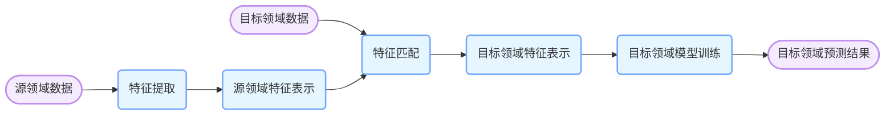

# 迁移学习：让AI Agent快速适应新领域

> 关键词：迁移学习、AI Agent、新领域适应、知识迁移、机器学习

> 摘要：本文围绕迁移学习展开，旨在深入探讨如何利用迁移学习使AI Agent快速适应新领域。首先介绍迁移学习的背景知识，包括其目的、适用读者群体等。接着阐述核心概念与联系，剖析迁移学习的原理和架构。详细讲解核心算法原理并给出Python代码示例，同时介绍相关数学模型和公式。通过项目实战展示迁移学习的具体应用，包括开发环境搭建、代码实现与解读。探讨迁移学习的实际应用场景，推荐相关的学习资源、开发工具框架以及论文著作。最后总结迁移学习的未来发展趋势与挑战，解答常见问题并提供扩展阅读和参考资料，帮助读者全面深入地理解迁移学习在AI Agent适应新领域中的重要作用。

## 1. 背景介绍 
### 1.1 目的和范围
在人工智能的发展过程中，AI Agent面临着在不同领域中快速适应并发挥作用的需求。传统的机器学习方法往往需要大量的数据和计算资源来训练模型，当面对新的领域时，重新收集和标注数据进行训练不仅耗时费力，而且可能由于数据不足导致模型性能不佳。迁移学习作为一种有效的解决方案，旨在将在一个或多个源领域中学习到的知识迁移到目标领域，从而使AI Agent能够快速适应新领域，减少对目标领域数据的依赖，提高学习效率和模型性能。

本文的范围涵盖迁移学习的基本概念、核心算法、数学模型、项目实战、实际应用场景以及相关的工具和资源推荐等方面，旨在为读者提供一个全面、深入的关于迁移学习的知识体系，帮助读者理解如何利用迁移学习让AI Agent快速适应新领域。

### 1.2 预期读者
本文预期读者包括对人工智能、机器学习领域感兴趣的初学者，希望深入了解迁移学习技术的专业人士，以及从事相关研究和开发工作的科研人员、工程师等。无论是想要拓宽技术视野的爱好者，还是希望在实际项目中应用迁移学习的专业人员，都能从本文中获得有价值的信息。

### 1.3 文档结构概述
本文将按照以下结构进行阐述：
1. 背景介绍：介绍迁移学习的目的、预期读者和文档结构概述，以及相关术语。
2. 核心概念与联系：详细解释迁移学习的核心概念，包括其原理和架构，并通过文本示意图和Mermaid流程图进行直观展示。
3. 核心算法原理 & 具体操作步骤：讲解迁移学习的核心算法原理，使用Python源代码详细阐述具体操作步骤。
4. 数学模型和公式 & 详细讲解 & 举例说明：介绍迁移学习中的数学模型和公式，并通过具体例子进行详细讲解。
5. 项目实战：代码实际案例和详细解释说明：通过实际项目案例，展示迁移学习的应用过程，包括开发环境搭建、源代码实现和代码解读。
6. 实际应用场景：探讨迁移学习在不同领域的实际应用场景。
7. 工具和资源推荐：推荐学习迁移学习的相关资源，包括书籍、在线课程、技术博客和网站，以及开发工具框架和相关论文著作。
8. 总结：未来发展趋势与挑战：总结迁移学习的发展趋势和面临的挑战。
9. 附录：常见问题与解答：解答读者在学习和应用迁移学习过程中常见的问题。
10. 扩展阅读 & 参考资料：提供扩展阅读的建议和相关参考资料。

### 1.4 术语表
#### 1.4.1 核心术语定义
- **迁移学习（Transfer Learning）**：一种机器学习技术，旨在将在一个或多个源领域中学习到的知识迁移到目标领域，以提高目标领域的学习效率和性能。
- **AI Agent（人工智能智能体）**：能够感知环境、做出决策并采取行动的人工智能实体。
- **源领域（Source Domain）**：知识的来源领域，通常是已经有大量数据和成熟模型的领域。
- **目标领域（Target Domain）**：需要应用迁移学习知识的新领域，通常数据较少或标注成本较高。
- **特征迁移（Feature Transfer）**：将源领域的特征表示迁移到目标领域，以帮助目标领域的模型学习。
- **模型迁移（Model Transfer）**：直接使用源领域训练好的模型，或对其进行微调，应用到目标领域。
- **知识迁移（Knowledge Transfer）**：将源领域的知识（如特征、模型参数、规则等）迁移到目标领域的过程。

#### 1.4.2 相关概念解释
- **领域自适应（Domain Adaptation）**：迁移学习的一种特殊情况，主要关注在源领域和目标领域数据分布存在差异的情况下，如何调整模型以适应目标领域。
- **多任务学习（Multi - Task Learning）**：同时学习多个相关任务，通过共享模型参数或特征表示，提高各个任务的学习性能。与迁移学习有一定的关联，都涉及到知识的共享和复用。
- **元学习（Meta - Learning）**：学习如何学习，通过在多个任务上进行训练，使模型能够快速适应新的任务。与迁移学习有相似的目标，都是为了提高模型的泛化能力和适应新环境的能力。

#### 1.4.3 缩略词列表
- **ML（Machine Learning）**：机器学习
- **DL（Deep Learning）**：深度学习
- **CNN（Convolutional Neural Network）**：卷积神经网络
- **RNN（Recurrent Neural Network）**：循环神经网络
- **GAN（Generative Adversarial Network）**：生成对抗网络

## 2. 核心概念与联系 
迁移学习的核心思想是利用源领域和目标领域之间的相似性，将源领域中学习到的知识迁移到目标领域，从而减少目标领域的学习成本和提高学习效率。其基本原理可以通过以下几个方面来理解：

### 2.1 特征层面的迁移
源领域和目标领域可能在某些特征上具有相似性。例如，在图像识别任务中，不同类别的图像可能具有相似的边缘、纹理等底层特征。通过提取源领域的特征表示，并将其应用到目标领域，可以帮助目标领域的模型更快地学习到有用的信息。

### 2.2 模型层面的迁移
可以直接使用源领域训练好的模型，或者对其进行微调后应用到目标领域。例如，在图像分类任务中，可以使用在大规模图像数据集（如ImageNet）上预训练好的卷积神经网络，然后在目标领域的图像数据集上进行微调，以适应目标领域的分类任务。

### 2.3 知识层面的迁移
除了特征和模型，源领域的其他知识（如规则、先验知识等）也可以迁移到目标领域。例如，在医疗诊断领域，可以将医学专家的知识和经验作为先验知识，应用到目标领域的诊断模型中，提高模型的准确性和可靠性。

### 2.4 文本示意图
```plaintext
源领域数据  -- 特征提取  -- 源领域特征表示
                                 |
                                 V
目标领域数据  -- 特征匹配  -- 目标领域特征表示  -- 目标领域模型训练  -- 目标领域预测结果
```

### 2.5 Mermaid流程图


## 3. 核心算法原理 & 具体操作步骤 
### 3.1 基于特征的迁移学习算法
基于特征的迁移学习算法主要通过提取源领域和目标领域的特征，并寻找它们之间的映射关系，将源领域的特征表示迁移到目标领域。以下是一个简单的基于特征的迁移学习算法的Python实现示例：

```python
import numpy as np
from sklearn.decomposition import PCA
from sklearn.preprocessing import StandardScaler

# 生成示例数据
# 源领域数据
X_source = np.random.rand(100, 10)
y_source = np.random.randint(0, 2, 100)

# 目标领域数据
X_target = np.random.rand(50, 10)
y_target = np.random.randint(0, 2, 50)

# 特征标准化
scaler = StandardScaler()
X_source_scaled = scaler.fit_transform(X_source)
X_target_scaled = scaler.transform(X_target)

# 主成分分析（PCA）进行特征降维
pca = PCA(n_components=5)
X_source_pca = pca.fit_transform(X_source_scaled)
X_target_pca = pca.transform(X_target_scaled)

# 可以使用降维后的特征进行目标领域的模型训练
from sklearn.linear_model import LogisticRegression

model = LogisticRegression()
model.fit(X_source_pca, y_source)
predictions = model.predict(X_target_pca)
```

### 3.2 具体操作步骤
1. **数据预处理**：对源领域和目标领域的数据进行标准化、归一化等预处理操作，以确保数据的一致性和可比性。
2. **特征提取**：使用合适的特征提取方法（如PCA、SIFT、HOG等）提取源领域和目标领域的特征表示。
3. **特征匹配**：寻找源领域和目标领域特征之间的映射关系，例如通过线性变换、非线性映射等方法。
4. **目标领域模型训练**：使用迁移后的特征表示，在目标领域的数据上训练模型。
5. **模型评估**：使用目标领域的测试数据对训练好的模型进行评估，检查模型的性能。

### 3.3 基于模型的迁移学习算法
基于模型的迁移学习算法主要是直接使用源领域训练好的模型，或者对其进行微调后应用到目标领域。以下是一个使用预训练的卷积神经网络进行图像分类迁移学习的Python实现示例：

```python
import torch
import torch.nn as nn
import torch.optim as optim
from torchvision import models, datasets, transforms

# 数据预处理
transform = transforms.Compose([
    transforms.Resize(256),
    transforms.CenterCrop(224),
    transforms.ToTensor(),
    transforms.Normalize(mean=[0.485, 0.456, 0.406], std=[0.229, 0.224, 0.225])
])

# 加载源领域的预训练模型（如ResNet18）
model = models.resnet18(pretrained=True)

# 冻结模型的所有参数
for param in model.parameters():
    param.requires_grad = False

# 修改模型的最后一层全连接层以适应目标领域的分类任务
num_ftrs = model.fc.in_features
model.fc = nn.Linear(num_ftrs, 2)  # 假设目标领域有2个类别

# 加载目标领域的数据集
train_dataset = datasets.ImageFolder(root='path/to/train_data', transform=transform)
train_loader = torch.utils.data.DataLoader(train_dataset, batch_size=32, shuffle=True)

# 定义损失函数和优化器
criterion = nn.CrossEntropyLoss()
optimizer = optim.SGD(model.fc.parameters(), lr=0.001, momentum=0.9)

# 训练模型
device = torch.device("cuda:0" if torch.cuda.is_available() else "cpu")
model = model.to(device)

for epoch in range(10):
    running_loss = 0.0
    for i, data in enumerate(train_loader, 0):
        inputs, labels = data[0].to(device), data[1].to(device)

        optimizer.zero_grad()

        outputs = model(inputs)
        loss = criterion(outputs, labels)
        loss.backward()
        optimizer.step()

        running_loss += loss.item()
    print(f'Epoch {epoch + 1}, Loss: {running_loss / len(train_loader)}')
```

### 3.4 具体操作步骤
1. **加载预训练模型**：从公开的模型库中加载在源领域上预训练好的模型。
2. **冻结模型参数**：根据需要，冻结模型的部分或全部参数，以避免在目标领域训练时对源领域的知识进行过度修改。
3. **修改模型结构**：根据目标领域的任务需求，修改模型的最后一层或几层，以适应目标领域的分类或回归任务。
4. **加载目标领域数据集**：准备目标领域的训练数据和测试数据。
5. **定义损失函数和优化器**：选择合适的损失函数和优化器，用于训练目标领域的模型。
6. **训练模型**：在目标领域的数据上对模型进行训练，更新模型的参数。
7. **模型评估**：使用目标领域的测试数据对训练好的模型进行评估，检查模型的性能。

## 4. 数学模型和公式 & 详细讲解 & 举例说明 
### 4.1 基于特征的迁移学习数学模型
#### 4.1.1 特征提取
在基于特征的迁移学习中，常用的特征提取方法是主成分分析（PCA）。PCA的目标是找到数据的主成分，使得数据在这些主成分上的投影方差最大。设输入数据矩阵为 $X \in \mathbb{R}^{n \times d}$，其中 $n$ 是样本数量，$d$ 是特征维度。PCA的数学模型可以表示为：

$$
\max_{W} \text{Var}(XW)
$$

其中 $W \in \mathbb{R}^{d \times k}$ 是投影矩阵，$k$ 是降维后的特征维度。通过求解上述优化问题，可以得到投影矩阵 $W$，从而将原始数据 $X$ 投影到 $k$ 维空间中，得到降维后的特征表示 $X_{pca} = XW$。

#### 4.1.2 特征匹配
在特征匹配阶段，常用的方法是寻找源领域特征 $X_s$ 和目标领域特征 $X_t$ 之间的线性变换 $A$，使得 $X_tA$ 尽可能接近 $X_s$。可以通过最小化以下损失函数来求解线性变换 $A$：

$$
\min_{A} \|X_tA - X_s\|_F^2
$$

其中 $\|\cdot\|_F$ 表示矩阵的Frobenius范数。通过求解上述优化问题，可以得到线性变换矩阵 $A$，从而将目标领域的特征 $X_t$ 进行变换，使其与源领域的特征更加相似。

### 4.2 基于模型的迁移学习数学模型
#### 4.2.1 模型微调
在基于模型的迁移学习中，模型微调的目标是在目标领域的数据上对预训练模型进行微调，以适应目标领域的任务。设预训练模型的参数为 $\theta_0$，目标领域的训练数据为 $\{(x_i, y_i)\}_{i = 1}^{n_t}$，其中 $x_i$ 是输入样本，$y_i$ 是对应的标签。模型微调的数学模型可以表示为：

$$
\min_{\theta} \sum_{i = 1}^{n_t} L(f(x_i; \theta), y_i) + \lambda \|\theta - \theta_0\|^2
$$

其中 $L$ 是损失函数，$f(x; \theta)$ 是模型的输出，$\lambda$ 是正则化参数。通过求解上述优化问题，可以得到微调后的模型参数 $\theta$。

### 4.3 举例说明
#### 4.3.1 基于特征的迁移学习举例
假设我们有一个源领域数据集 $X_s$ 包含100个样本，每个样本有10个特征，目标领域数据集 $X_t$ 包含50个样本，每个样本也有10个特征。我们可以使用PCA将源领域和目标领域的特征降维到5维，然后使用线性回归模型在源领域的特征上进行训练，最后将训练好的模型应用到目标领域的降维特征上进行预测。

```python
import numpy as np
from sklearn.decomposition import PCA
from sklearn.linear_model import LinearRegression

# 生成示例数据
X_source = np.random.rand(100, 10)
y_source = np.random.rand(100)

X_target = np.random.rand(50, 10)

# PCA降维
pca = PCA(n_components=5)
X_source_pca = pca.fit_transform(X_source)
X_target_pca = pca.transform(X_target)

# 训练线性回归模型
model = LinearRegression()
model.fit(X_source_pca, y_source)

# 预测目标领域数据
predictions = model.predict(X_target_pca)
print(predictions)
```

#### 4.3.2 基于模型的迁移学习举例
假设我们要使用预训练的ResNet18模型进行图像分类迁移学习，目标领域是一个二分类任务。我们可以加载预训练的ResNet18模型，冻结其参数，修改最后一层全连接层，然后在目标领域的图像数据集上进行微调。

```python
import torch
import torch.nn as nn
import torch.optim as optim
from torchvision import models, datasets, transforms

# 数据预处理
transform = transforms.Compose([
    transforms.Resize(256),
    transforms.CenterCrop(224),
    transforms.ToTensor(),
    transforms.Normalize(mean=[0.485, 0.456, 0.406], std=[0.229, 0.224