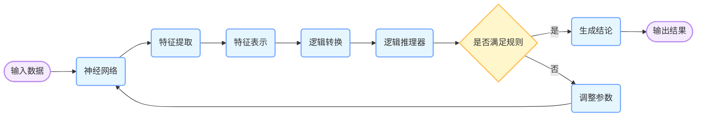

# 透明AI系统构建中神经逻辑推理的实现策略

> 关键词：透明AI系统、神经逻辑推理、实现策略、可解释性、人工智能

> 摘要：本文聚焦于透明AI系统构建中神经逻辑推理的实现策略。首先介绍了透明AI系统及神经逻辑推理的背景知识，包括目的、预期读者等内容。接着阐述了核心概念与联系，给出了原理和架构的示意图与流程图。详细讲解了核心算法原理并结合Python代码进行说明，分析了相关数学模型和公式。通过项目实战展示了代码实现和解读过程。探讨了实际应用场景，推荐了相关的工具和资源，最后总结了未来发展趋势与挑战，解答了常见问题并提供扩展阅读和参考资料，旨在为构建透明AI系统中的神经逻辑推理提供全面且深入的技术指导。

## 1. 背景介绍 
### 1.1 目的和范围
随着人工智能技术的广泛应用，其黑盒性质引发了诸多问题，如难以解释决策过程、缺乏可信度等。透明AI系统旨在解决这些问题，使AI的决策过程和推理逻辑能够被人类理解。神经逻辑推理作为实现透明AI的关键技术之一，结合了神经网络的强大学习能力和逻辑推理的可解释性。本文的目的是深入探讨在透明AI系统构建中神经逻辑推理的实现策略，范围涵盖从核心概念、算法原理到实际应用等多个方面。

### 1.2 预期读者
本文预期读者包括人工智能领域的研究人员、开发者、软件架构师以及对透明AI和神经逻辑推理感兴趣的技术爱好者。研究人员可以从中获取新的研究思路和方法，开发者能够学习到具体的实现技术，软件架构师可以借鉴相关策略进行系统设计，技术爱好者则可以了解该领域的前沿知识。

### 1.3 文档结构概述
本文将按照以下结构展开：首先介绍相关背景知识，包括目的、读者和结构概述以及术语表。接着阐述核心概念与联系，包括原理和架构的示意图与流程图。然后详细讲解核心算法原理并结合Python代码进行说明，分析相关数学模型和公式。通过项目实战展示代码实现和解读过程。探讨实际应用场景，推荐相关的工具和资源。最后总结未来发展趋势与挑战，解答常见问题并提供扩展阅读和参考资料。

### 1.4 术语表
#### 1.4.1 核心术语定义
- **透明AI系统**：指能够以人类可理解的方式解释其决策过程和推理逻辑的人工智能系统。
- **神经逻辑推理**：将神经网络的学习能力与逻辑推理相结合，通过神经网络学习数据中的模式和规律，并利用逻辑规则进行推理的技术。
- **可解释性**：指AI系统能够以人类可理解的方式解释其决策过程和推理依据的特性。

#### 1.4.2 相关概念解释
- **神经网络**：一种模仿人类神经系统的计算模型，由大量的神经元组成，通过学习数据中的模式和规律来进行预测和分类。
- **逻辑推理**：根据已知的事实和规则，通过一定的推理方法得出新的结论的过程。
- **知识图谱**：一种以图的形式表示知识的方法，由实体和关系组成，用于存储和管理领域知识。

#### 1.4.3 缩略词列表
- **AI**：Artificial Intelligence，人工智能
- **ML**：Machine Learning，机器学习
- **DL**：Deep Learning，深度学习
- **NN**：Neural Network，神经网络

## 2. 核心概念与联系 
### 核心概念原理
神经逻辑推理的核心原理是将神经网络和逻辑推理相结合。神经网络具有强大的学习能力，能够从大量的数据中学习到复杂的模式和规律。而逻辑推理则具有明确的推理规则和可解释性，能够根据已知的事实和规则得出新的结论。在透明AI系统中，神经逻辑推理通过神经网络学习数据中的特征和模式，并将其转化为逻辑表示，然后利用逻辑推理规则进行推理，从而得出可解释的决策结果。

### 架构的文本示意图
```plaintext
+-------------------+         +-------------------+         +-------------------+
|     输入数据      |         |     神经网络      |         |     逻辑推理器    |
+-------------------+         +-------------------+         +-------------------+
| - 原始数据         | ------> | - 特征提取层       | ------> | - 逻辑规则库       |
| - 结构化数据       |         | - 隐藏层           |         | - 推理引擎         |
| - 非结构化数据     |         | - 输出层           |         | - 结论生成器       |
+-------------------+         +-------------------+         +-------------------+
```

### Mermaid 流程图


## 3. 核心算法原理 & 具体操作步骤 
### 核心算法原理
神经逻辑推理的核心算法主要包括两个部分：神经网络学习和逻辑推理。神经网络学习用于从输入数据中提取特征和模式，逻辑推理则用于根据提取的特征和预先定义的逻辑规则进行推理。

### 具体操作步骤
1. **数据预处理**：对输入数据进行清洗、归一化等预处理操作，以便神经网络能够更好地学习。
2. **神经网络训练**：使用预处理后的数据训练神经网络，使其能够学习到数据中的特征和模式。
3. **特征提取**：通过训练好的神经网络提取输入数据的特征表示。
4. **逻辑转换**：将提取的特征表示转换为逻辑表示，以便进行逻辑推理。
5. **逻辑推理**：根据逻辑规则和逻辑表示进行推理，得出结论。
6. **结果输出**：将推理结果输出，并进行可视化展示。

### Python源代码详细阐述
```python
import numpy as np
import torch
import torch.nn as nn
import torch.optim as optim

# 定义神经网络模型
class NeuralNetwork(nn.Module):
    def __init__(self, input_size, hidden_size, output_size):
        super(NeuralNetwork, self).__init__()
        self.fc1 = nn.Linear(input_size, hidden_size)
        self.relu = nn.ReLU()
        self.fc2 = nn.Linear(hidden_size, output_size)

    def forward(self, x):
        out = self.fc1(x)
        out = self.relu(out)
        out = self.fc2(out)
        return out

# 数据预处理
def preprocess_data(data):
    # 归一化处理
    data = (data - np.mean(data, axis=0)) / np.std(data, axis=0)
    return torch.tensor(data, dtype=torch.float32)

# 训练神经网络
def train_network(model, train_data, train_labels, epochs, learning_rate):
    criterion = nn.CrossEntropyLoss()
    optimizer = optim.Adam(model.parameters(), lr=learning_rate)

    for epoch in range(epochs):
        outputs = model(train_data)
        loss = criterion(outputs, train_labels)

        optimizer.zero_grad()
        loss.backward()
        optimizer.step()

        if (epoch + 1) % 100 == 0:
            print(f'Epoch [{epoch + 1}/{epochs}], Loss: {loss.item():.4f}')

# 特征提取
def extract_features(model, data):
    with torch.no_grad():
        features = model.fc1(data)
        features = model.relu(features)
    return features

# 逻辑推理
def logical_reasoning(features, rules):
    # 简单示例：如果特征的第一个元素大于0，则返回True
    results = []
    for feature in features:
        if feature[0] > 0:
            results.append(True)
        else:
            results.append(False)
    return results

# 主函数
def main():
    # 生成示例数据
    input_size = 10
    hidden_size = 20
    output_size = 2
    num_samples = 100

    data = np.random.randn(num_samples, input_size)
    labels = np.random.randint(0, output_size, num_samples)

    # 数据预处理
    train_data = preprocess_data(data)
    train_labels = torch.tensor(labels, dtype=torch.long)

    # 初始化神经网络模型
    model = NeuralNetwork(input_size, hidden_size, output_size)

    # 训练神经网络
    epochs = 500
    learning_rate = 0.001
    train_network(model, train_data, train_labels, epochs, learning_rate)

    # 特征提取
    features = extract_features(model, train_data)

    # 定义逻辑规则
    rules = []

    # 逻辑推理
    results = logical_reasoning(features, rules)

    print("推理结果:", results)

if __name__ == "__main__":
    main()
```

## 4. 数学模型和公式 & 详细讲解 & 举例说明 
### 神经网络数学模型
神经网络的基本数学模型可以表示为一个多层的非线性映射。假设输入层有 $n$ 个神经元，隐藏层有 $m$ 个神经元，输出层有 $k$ 个神经元。对于第 $l$ 层的第 $j$ 个神经元，其输入可以表示为：

$$
z_{j}^{(l)} = \sum_{i=1}^{n_{l-1}} w_{ji}^{(l)} x_{i}^{(l-1)} + b_{j}^{(l)}
$$

其中，$w_{ji}^{(l)}$ 是第 $l-1$ 层的第 $i$ 个神经元到第 $l$ 层的第 $j$ 个神经元的权重，$x_{i}^{(l-1)}$ 是第 $l-1$ 层的第 $i$ 个神经元的输出，$b_{j}^{(l)}$ 是第 $l$ 层的第 $j$ 个神经元的偏置。

神经元的输出可以通过激活函数进行非线性变换：

$$
x_{j}^{(l)} = f(z_{j}^{(l)})
$$

其中，$f$ 是激活函数，常见的激活函数有Sigmoid函数、ReLU函数等。

### 逻辑推理数学模型
逻辑推理可以基于逻辑规则进行，例如，假设有一个逻辑规则：如果 $A$ 为真且 $B$ 为真，则 $C$ 为真。可以用逻辑表达式表示为：

$$
A \land B \rightarrow C
$$

在实际推理中，可以将特征表示转换为逻辑变量，然后根据逻辑规则进行推理。

### 举例说明
假设我们有一个简单的二分类问题，输入数据有两个特征 $x_1$ 和 $x_2$，神经网络的隐藏层有一个神经元，输出层有一个神经元。神经网络的输入可以表示为：

$$
z_1^{(1)} = w_{11}^{(1)} x_1 + w_{12}^{(1)} x_2 + b_1^{(1)}
$$

假设激活函数为ReLU函数，则隐藏层神经元的输出为：

$$
x_1^{(1)} = \max(0, z_1^{(1)})
$$

输出层神经元的输入为：

$$
z_1^{(2)} = w_{11}^{(2)} x_1^{(1)} + b_1^{(2)}
$$

输出层神经元的输出可以通过Sigmoid函数进行变换，得到分类概率：

$$
p = \frac{1}{1 + e^{-z_1^{(2)}}}
$$

假设我们有一个逻辑规则：如果 $x_1 > 0$ 且 $x_2 > 0$，则分类结果为正类。可以将特征表示转换为逻辑变量 $A = (x_1 > 0)$ 和 $B = (x_2 > 0)$，然后根据逻辑规则进行推理。

## 5. 项目实战：代码实际案例和详细解释说明 
### 5.1  开发环境搭建
#### 操作系统
建议使用Linux系统，如Ubuntu 18.04及以上版本，也可以使用Windows 10或macOS系统。

#### Python环境
安装Python 3.7及以上版本，可以使用Anaconda或Miniconda来管理Python环境。

#### 依赖库安装
安装以下依赖库：
```bash
pip install torch numpy
```

### 5.2  源代码详细实现和代码解读
```python
import numpy as np
import torch
import torch.nn as nn
import torch.optim as optim

# 定义神经网络模型
class NeuralNetwork(nn.Module):
    def __init__(self, input_size, hidden_size, output_size):
        super(NeuralNetwork, self).__init__()
        self.fc1 = nn.Linear(input_size, hidden_size)
        self.relu = nn.ReLU()
        self.fc2 = nn.Linear(hidden_size, output_size)

    def forward(self, x):
        out = self.fc1(x)
        out = self.relu(out)
        out = self.fc2(out)
        return out

# 数据预处理
def preprocess_data(data):
    # 归一化处理
    data = (data - np.mean(data, axis=0)) / np.std(data, axis=0)
    return torch.tensor(data, dtype=torch.float32)

# 训练神经网络
def train_network(model, train_data, train_labels, epochs, learning_rate):
    criterion = nn.CrossEntropyLoss()
    optimizer = optim.Adam(model.parameters(), lr=learning_rate)

    for epoch in range(epochs):
        outputs = model(train_data)
        loss = criterion(outputs, train_labels)

        optimizer.zero_grad()
        loss.backward()
        optimizer.step()

        if (epoch + 1) % 100 == 0:
            print(f'Epoch [{epoch + 1}/{epochs}], Loss: {loss.item():.4f}')

# 特征提取
def extract_features(model, data):
    with torch.no_grad():
        features = model.fc1(data)
        features = model.relu(features)
    return features

# 逻辑推理
def logical_reasoning(features, rules):
    # 简单示例：如果特征的第一个元素大于0，则返回True
    results = []
    for feature in features:
        if feature[0] > 0:
            results.append(True)
        else:
            results.append(False)
    return results

# 主函数
def main():
    # 生成示例数据
    input_size = 10
    hidden_size = 20
    output_size = 2
    num_samples = 100

    data = np.random.randn(num_samples, input_size)
    labels = np.random.randint(0, output_size, num_samples)

    # 数据预处理
    train_data = preprocess_data(data)
    train_labels = torch.tensor(labels, dtype=torch.long)

    # 初始化神经网络模型
    model = NeuralNetwork(input_size, hidden_size, output_size)

    # 训练神经网络
    epochs = 500
    learning_rate = 0.001
    train_network(model, train_data, train_labels, epochs, learning_rate)

    # 特征提取
    features = extract_features(model, train_data)

    # 定义逻辑规则
    rules = []

    # 逻辑推理
    results = logical_reasoning(features, rules)

    print("推理结果:", results)

if __name__ == "__main__":
    main()
```

### 代码解读与分析
- **神经网络模型定义**：`NeuralNetwork` 类继承自 `nn.Module`，定义了一个简单的两层神经网络，包括一个输入层、一个隐藏层和一个输出层。
- **数据预处理**：`preprocess_data` 函数对输入数据进行归一化处理，将数据的均值变为0，标准差变为1。
- **神经网络训练**：`train_network` 函数使用交叉熵损失函数和Adam优化器对神经网络进行训练。
- **特征提取**：`extract_features` 函数从训练好的神经网络中提取隐藏层的特征表示。
- **逻辑推理**：`logical_reasoning` 函数根据特征表示进行简单的逻辑推理，判断特征的第一个元素是否大于0。
- **主函数**：`main` 函数生成示例数据，调用上述函数进行数据预处理、神经网络训练、特征提取和逻辑推理，并输出推理结果。

## 6. 实际应用场景 
### 医疗诊断
在医疗诊断中，透明AI系统中的神经逻辑推理可以帮助医生理解AI模型的诊断结果。例如，通过神经逻辑推理可以分析患者的症状、检查结果等数据，结合医学知识图谱和逻辑规则，得出诊断结论并解释推理过程，为医生提供参考。

### 金融风险评估
在金融领域，神经逻辑推理可以用于评估客户的信用风险。通过分析客户的财务数据、信用记录等信息，利用神经网络学习数据中的模式和规律，再结合金融领域的逻辑规则进行推理，得出客户的信用风险评估结果，并解释评估依据，帮助金融机构做出更明智的决策。

### 自动驾驶
在自动驾驶中，透明AI系统中的神经逻辑推理可以提高自动驾驶系统的安全性和可靠性。通过分析传感器数据、地图信息等，神经网络学习驾驶场景中的模式和规律，逻辑推理则根据交通规则和安全准则进行决策，并解释决策过程，使人类能够理解自动驾驶系统的行为。

## 7. 工具和资源推荐
### 7.1 学习资源推荐
#### 7.1.1 书籍推荐
- 《深度学习》（Deep Learning）：由Ian Goodfellow、Yoshua Bengio和Aaron Courville所著，是深度学习领域的经典教材，涵盖了神经网络、优化算法等方面的知识。
- 《人工智能：一种现代的方法》（Artificial Intelligence: A Modern Approach）：由Stuart Russell和Peter Norvig所著，全面介绍了人工智能的各个领域，包括逻辑推理、机器学习等。

#### 7.1.2 在线课程
- Coursera上的“深度学习专项课程”（Deep Learning Specialization）：由Andrew Ng教授授课，包括神经网络、卷积神经网络等多个课程，适合初学者学习深度学习。
- edX上的“人工智能导论”（Introduction to Artificial Intelligence）：由麻省理工学院（MIT）的Patrick Winston教授授课，介绍了人工智能的基本概念和方法。

#### 7.1.3 技术博客和网站
- Medium上的Towards Data Science：是一个专注于数据科学和人工智能的技术博客，有很多关于神经网络、逻辑推理等方面的文章。
- arXiv.org：是一个预印本数据库，提供了大量的人工智能领域的最新研究论文。

### 7.2 开发工具框架推荐
#### 7.2.1 IDE和编辑器
- PyCharm：是一款专门为Python开发设计的集成开发环境（IDE），提供了代码编辑、调试、版本控制等功能。
- Jupyter Notebook：是一个交互式的开发环境，适合进行数据分析和模型开发，支持Python、R等多种编程语言。

#### 7.2.2 调试和性能分析工具
- TensorBoard：是TensorFlow提供的一个可视化工具，可以用于可视化训练过程中的损失函数、准确率等指标，帮助开发者调试和优化模型。
- PyTorch Profiler：是PyTorch提供的一个性能分析工具，可以用于分析模型的运行时间、内存使用等情况，帮助开发者优化模型性能。

#### 7.2.3 相关框架和库
- PyTorch：是一个开源的深度学习框架，提供了丰富的神经网络层和优化算法，易于使用和扩展。
- TensorFlow：是另一个广泛使用的深度学习框架，提供了分布式训练、模型部署等功能。

### 7.3 相关论文著作推荐
#### 7.3.1 经典论文
- “Deep Learning” by Yann LeCun, Yoshua Bengio, and Geoffrey Hinton：发表于Nature杂志，是深度学习领域的经典综述论文，介绍了深度学习的发展历程、基本原理和应用领域。
- “A Logical Calculus of the Ideas Immanent in Nervous Activity” by Warren S. McCulloch and Walter Pitts：发表于1943年，提出了第一个人工神经网络模型，开创了神经网络研究的先河。

#### 7.3.2 最新研究成果
- “Neuro-Symbolic Concept Learner: Interpreting Scenes, Words, and Sentences From Natural Supervision” by Honghua Dong, et al.：提出了一种神经符号概念学习器，结合了神经网络和符号推理，能够从自然监督中学习概念和语言。
- “Logic Tensor Networks” by Artur d’Avila Garcez, et al.：介绍了逻辑张量网络，将逻辑推理和张量计算相结合，用于处理复杂的逻辑推理问题。

#### 7.3.3 应用案例分析
- “Interpretable Machine Learning for Healthcare: An Overview” by Finale Doshi-Velez and Been Kim：综述了可解释机器学习在医疗领域的应用，介绍了多种可解释性方法和技术。
- “Explainable AI in Finance: A Survey” by Luca Costabello, et al.：对可解释人工智能在金融领域的应用进行了综述，分析了可解释性在金融决策中的重要性和挑战。

## 8. 总结：未来发展趋势与挑战
### 未来发展趋势
- **融合更多知识源**：未来的神经逻辑推理将融合更多的知识源，如知识图谱、领域规则等，以提高推理的准确性和可解释性。
- **增强可解释性**：随着对AI可解释性的要求越来越高，神经逻辑推理将不断发展和完善可解释性技术，使推理过程更加透明和易于理解。
- **应用领域拓展**：神经逻辑推理将在更多的领域得到应用，如教育、法律、农业等，为各领域的决策提供支持。

### 挑战
- **数据质量和规模**：神经逻辑推理需要大量高质量的数据进行训练，但在实际应用中，数据的质量和规模往往难以满足要求。
- **逻辑规则的获取和表示**：如何获取和表示有效的逻辑规则是神经逻辑推理面临的一个挑战，逻辑规则的准确性和完整性直接影响推理的结果。
- **计算资源消耗**：神经逻辑推理通常需要大量的计算资源，如何优化算法和模型结构，降低计算资源消耗是一个亟待解决的问题。

## 9. 附录：常见问题与解答
### 问题1：神经逻辑推理和传统逻辑推理有什么区别？
传统逻辑推理基于明确的逻辑规则和符号系统，推理过程是确定性的，但难以处理复杂的、不确定的信息。神经逻辑推理结合了神经网络的学习能力和逻辑推理的可解释性，能够从数据中学习到模式和规律，并利用逻辑规则进行推理，更适合处理复杂的、不确定的信息。

### 问题2：如何评估神经逻辑推理的性能？
可以从以下几个方面评估神经逻辑推理的性能：
- **推理准确性**：通过比较推理结果和真实结果的一致性来评估推理的准确性。
- **可解释性**：评估推理过程是否能够以人类可理解的方式进行解释。
- **计算效率**：评估推理过程的计算时间和资源消耗。

### 问题3：神经逻辑推理在实际应用中存在哪些挑战？
神经逻辑推理在实际应用中存在以下挑战：
- **数据质量和规模**：需要大量高质量的数据进行训练，但数据的质量和规模往往难以满足要求。
- **逻辑规则的获取和表示**：如何获取和表示有效的逻辑规则是一个挑战，逻辑规则的准确性和完整性直接影响推理的结果。
- **计算资源消耗**：神经逻辑推理通常需要大量的计算资源，如何优化算法和模型结构，降低计算资源消耗是一个亟待解决的问题。

## 10. 扩展阅读 & 参考资料
### 扩展阅读
- 《可解释人工智能》（Explainable Artificial Intelligence）：深入探讨了可解释人工智能的理论和方法，包括神经逻辑推理等技术。
- 《知识图谱：方法、实践与应用》：介绍了知识图谱的构建方法和应用场景，对神经逻辑推理中知识图谱的应用有一定的参考价值。

### 参考资料
- Goodfellow, I., Bengio, Y., & Courville, A. (2016). Deep Learning. MIT Press.
- Russell, S. J., & Norvig, P. (2020). Artificial Intelligence: A Modern Approach. Pearson.
- LeCun, Y., Bengio, Y., & Hinton, G. (2015). Deep learning. Nature, 521(7553), 436-444.
- McCulloch, W. S., & Pitts, W. (1943). A logical calculus of the ideas immanent in nervous activity. The bulletin of mathematical biophysics, 5(4), 115-133.

作者：AI天才研究院/AI Genius Institute & 禅与计算机程序设计艺术 /Zen And The Art of Computer Programming