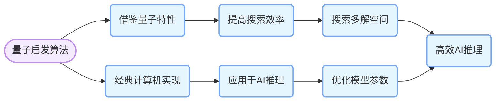

# 量子启发算法在高效AI推理中的应用研究

> 关键词：量子启发算法、高效AI推理、量子计算、人工智能、算法应用

> 摘要：本文深入探讨了量子启发算法在高效AI推理中的应用。首先介绍了研究的背景、目的、预期读者、文档结构和相关术语。接着阐述了量子启发算法和AI推理的核心概念及其联系，并给出了相应的文本示意图和Mermaid流程图。详细讲解了核心算法原理，通过Python源代码进行了具体操作步骤的说明，同时给出了相关的数学模型和公式，并举例说明。通过项目实战展示了代码的实际案例和详细解释。分析了量子启发算法在AI推理中的实际应用场景，推荐了相关的学习资源、开发工具框架和论文著作。最后总结了未来发展趋势与挑战，提供了常见问题与解答以及扩展阅读和参考资料，旨在为该领域的研究和实践提供全面而深入的指导。

## 1. 背景介绍 
### 1.1 目的和范围
随着人工智能技术的飞速发展，AI推理在各个领域的应用越来越广泛，如自然语言处理、计算机视觉、智能医疗等。然而，传统的AI推理算法在处理大规模数据和复杂任务时，面临着计算效率低、资源消耗大等问题。量子计算作为一种新兴的计算范式，具有强大的并行计算能力和解决复杂问题的潜力。量子启发算法是基于量子计算的原理和思想，但在经典计算机上实现的算法，它可以在一定程度上模拟量子计算的优势，为提高AI推理的效率提供了新的途径。

本研究的目的是深入探讨量子启发算法在高效AI推理中的应用，分析其原理、优势和局限性，通过理论分析和实验验证，展示量子启发算法在不同AI推理任务中的性能表现，并为实际应用提供指导。研究范围涵盖了常见的量子启发算法，如量子退火算法、量子遗传算法等，以及在图像分类、语音识别、推荐系统等AI推理任务中的应用。

### 1.2 预期读者
本文的预期读者包括人工智能领域的研究人员、工程师、开发者，以及对量子计算和AI推理交叉领域感兴趣的学生和爱好者。对于从事AI算法优化和性能提升的专业人士，本文可以提供新的思路和方法；对于初学者，本文可以帮助他们了解量子启发算法在AI推理中的基本概念和应用场景。

### 1.3 文档结构概述
本文将按照以下结构进行组织：
- 核心概念与联系：介绍量子启发算法和AI推理的核心概念，以及它们之间的联系，并通过文本示意图和Mermaid流程图进行直观展示。
- 核心算法原理 & 具体操作步骤：详细讲解常见量子启发算法的原理，并使用Python源代码展示具体的操作步骤。
- 数学模型和公式 & 详细讲解 & 举例说明：给出量子启发算法的数学模型和公式，进行详细讲解，并通过具体例子说明其应用。
- 项目实战：代码实际案例和详细解释说明：通过一个实际的AI推理项目，展示量子启发算法的应用，包括开发环境搭建、源代码实现和代码解读。
- 实际应用场景：分析量子启发算法在不同AI推理场景中的应用，如计算机视觉、自然语言处理等。
- 工具和资源推荐：推荐相关的学习资源、开发工具框架和论文著作，帮助读者进一步深入学习和研究。
- 总结：未来发展趋势与挑战：总结量子启发算法在高效AI推理中的应用现状，分析未来的发展趋势和面临的挑战。
- 附录：常见问题与解答：提供常见问题的解答，帮助读者解决在学习和实践过程中遇到的问题。
- 扩展阅读 & 参考资料：列出相关的扩展阅读材料和参考资料，方便读者进一步探索。

### 1.4 术语表
#### 1.4.1 核心术语定义
- **量子启发算法**：基于量子计算的原理和思想，但在经典计算机上实现的算法，旨在利用量子特性（如叠加、纠缠等）来提高算法的性能。
- **AI推理**：在人工智能系统中，根据已有的模型和输入数据，得出相应的输出结果的过程，如分类、预测等。
- **量子退火算法**：一种基于量子力学中退火过程的优化算法，用于寻找复杂函数的全局最优解。
- **量子遗传算法**：结合量子计算和遗传算法的思想，通过量子比特和量子门操作来进行染色体的编码和进化，以提高搜索效率。

#### 1.4.2 相关概念解释
- **量子叠加**：量子系统可以同时处于多个状态的叠加态，这使得量子计算机可以同时处理多个计算任务，从而提高计算效率。
- **量子纠缠**：两个或多个量子比特之间存在一种特殊的关联，使得一个量子比特的状态变化会瞬间影响其他量子比特的状态，即使它们之间的距离很远。
- **全局最优解**：在一个优化问题中，使得目标函数取得最大值或最小值的解。

#### 1.4.3 缩略词列表
- **AI**：Artificial Intelligence，人工智能
- **QC**：Quantum Computing，量子计算
- **QAA**：Quantum Annealing Algorithm，量子退火算法
- **QGA**：Quantum Genetic Algorithm，量子遗传算法

## 2. 核心概念与联系 

### 量子启发算法核心概念
量子启发算法是一类模拟量子计算特性的经典算法。它借鉴了量子力学中的一些概念，如量子叠加、量子纠缠等，以改进传统算法的性能。量子叠加允许量子系统同时处于多个状态的叠加态，在量子启发算法中，这意味着可以同时搜索多个解空间，从而提高搜索效率。量子纠缠则提供了一种强大的关联机制，使得算法能够更好地利用解之间的相互关系。

### AI推理核心概念
AI推理是指在人工智能系统中，根据已训练好的模型和输入数据，得出相应输出结果的过程。例如，在图像分类任务中，输入一张图像，模型通过推理判断该图像属于哪个类别。AI推理的效率对于实际应用至关重要，尤其是在处理大规模数据和实时性要求较高的场景中。

### 两者联系
量子启发算法可以应用于AI推理的多个环节，以提高推理效率。例如，在模型训练阶段，量子启发算法可以用于优化模型的参数，加快收敛速度；在推理阶段，量子启发算法可以用于搜索最优的推理路径，减少计算量。通过将量子启发算法与AI推理相结合，可以充分发挥两者的优势，提高人工智能系统的性能。

### 文本示意图
```plaintext
             量子启发算法
               /        \
              /          \
  借鉴量子特性      经典计算机实现
              |            |
              |            |
  提高搜索效率    应用于AI推理
              |            |
              |            |
  搜索多解空间  优化模型参数
                        |
                        |
                   高效AI推理
```

### Mermaid流程图


## 3. 核心算法原理 & 具体操作步骤 

### 量子退火算法原理
量子退火算法基于量子力学中的退火过程，通过引入量子涨落来帮助系统跳出局部最优解，从而找到全局最优解。在量子退火过程中，系统的哈密顿量包含一个初始的量子项和一个逐渐减小的量子涨落项，随着时间的推移，量子涨落逐渐消失，系统最终收敛到一个经典的基态，这个基态对应着问题的最优解。

### 量子退火算法Python实现
```python
import numpy as np

# 定义目标函数，这里以简单的二次函数为例
def objective_function(x):
    return (x - 2) ** 2

# 量子退火算法实现
def quantum_annealing(num_steps, initial_state, annealing_rate):
    current_state = initial_state
    for step in range(num_steps):
        # 生成一个随机的量子涨落
        quantum_fluctuation = np.random.normal(0, 1)
        new_state = current_state + quantum_fluctuation
        # 计算当前状态和新状态的目标函数值
        current_energy = objective_function(current_state)
        new_energy = objective_function(new_state)
        # 判断是否接受新状态
        if new_energy < current_energy or np.random.rand() < np.exp((current_energy - new_energy) / annealing_rate):
            current_state = new_state
        # 逐渐减小退火率
        annealing_rate *= 0.99
    return current_state

# 初始化参数
num_steps = 1000
initial_state = 0
annealing_rate = 1

# 运行量子退火算法
result = quantum_annealing(num_steps, initial_state, annealing_rate)
print("最优解:", result)
```
### 代码解释
1. **目标函数**：`objective_function` 定义了我们要优化的目标函数，这里使用了一个简单的二次函数 $(x - 2)^2$，其最小值在 $x = 2$ 处。
2. **量子退火算法**：`quantum_annealing` 函数实现了量子退火算法的核心逻辑。在每一步中，生成一个随机的量子涨落，计算新状态的目标函数值，并根据一定的概率决定是否接受新状态。随着步数的增加，退火率逐渐减小，模拟量子涨落的消失。
3. **参数初始化**：设置了算法的步数、初始状态和初始退火率。
4. **运行算法**：调用 `quantum_annealing` 函数并输出最优解。

### 量子遗传算法原理
量子遗传算法结合了量子计算和遗传算法的思想。它使用量子比特来编码染色体，通过量子门操作来实现染色体的进化。量子比特可以处于 $|0\rangle$ 和 $|1\rangle$ 的叠加态，这使得算法可以同时搜索多个解空间。在每一代中，通过选择、交叉和变异等操作来更新染色体，逐步逼近最优解。

### 量子遗传算法Python实现
```python
import numpy as np

# 定义目标函数，这里以简单的二次函数为例
def objective_function(x):
    return (x - 2) ** 2

# 量子比特编码
def quantum_encoding(num_bits):
    # 初始化量子比特为等概率叠加态
    qubits = np.ones((num_bits, 2)) / np.sqrt(2)
    return qubits

# 量子门操作（简单的旋转门）
def quantum_gate(qubits, angle):
    rotation_matrix = np.array([[np.cos(angle), -np.sin(angle)], [np.sin(angle), np.cos(angle)]])
    new_qubits = np.dot(qubits, rotation_matrix)
    return new_qubits

# 测量量子比特
def measure(qubits):
    probabilities = qubits[:, 0] ** 2
    states = np.random.binomial(1, probabilities)
    return states

# 量子遗传算法实现
def quantum_genetic_algorithm(num_generations, num_bits, population_size, angle):
    population = [quantum_encoding(num_bits) for _ in range(population_size)]
    for generation in range(num_generations):
        # 测量种群中的每个个体
        decoded_population = [measure(qubits) for qubits in population]
        # 将二进制编码转换为实数
        real_population = [int(''.join(map(str, individual)), 2) for individual in decoded_population]
        # 计算适应度值
        fitness_values = [1 / (1 + objective_function(x)) for x in real_population]
        # 选择操作（轮盘赌选择）
        total_fitness = sum(fitness_values)
        selection_probabilities = [fitness / total_fitness for fitness in fitness_values]
        selected_indices = np.random.choice(population_size, population_size, p=selection_probabilities)
        new_population = [population[i] for i in selected_indices]
        # 交叉操作（简单的单点交叉）
        for i in range(0, population_size, 2):
            crossover_point = np.random.randint(1, num_bits)
            new_population[i][crossover_point:], new_population[i + 1][crossover_point:] = \
                new_population[i + 1][crossover_point:], new_population[i][crossover_point:]
        # 变异操作（量子门操作）
        for qubits in new_population:
            qubits = quantum_gate(qubits, angle)
        population = new_population
    # 测量最终种群并找到最优解
    decoded_population = [measure(qubits) for qubits in population]
    real_population = [int(''.join(map(str, individual)), 2) for individual in decoded_population]
    fitness_values = [1 / (1 + objective_function(x)) for x in real_population]
    best_index = np.argmax(fitness_values)
    best_solution = real_population[best_index]
    return best_solution

# 初始化参数
num_generations = 100
num_bits = 10
population_size = 50
angle = 0.1

# 运行量子遗传算法
result = quantum_genetic_algorithm(num_generations, num_bits, population_size, angle)
print("最优解:", result)
```
### 代码解释
1. **目标函数**：同样使用了简单的二次函数 $(x - 2)^2$ 作为目标函数。
2. **量子比特编码**：`quantum_encoding` 函数将染色体编码为量子比特，初始状态为等概率叠加态。
3. **量子门操作**：`quantum_gate` 函数实现了一个简单的旋转门操作，用于更新量子比特的状态。
4. **测量量子比特**：`measure` 函数根据量子比特的概率分布进行测量，得到一个二进制状态。
5. **量子遗传算法**：`quantum_genetic_algorithm` 函数实现了量子遗传算法的核心逻辑，包括选择、交叉和变异等操作。在每一代中，先测量种群中的个体，计算适应度值，然后进行选择、交叉和变异操作，更新种群。最后测量最终种群并找到最优解。
6. **参数初始化**：设置了算法的代数、量子比特数、种群大小和旋转门的角度。
7. **运行算法**：调用 `quantum_genetic_algorithm` 函数并输出最优解。

## 4. 数学模型和公式 & 详细讲解 & 举例说明 

### 量子退火算法数学模型
量子退火算法的核心是通过一个随时间变化的哈密顿量 $H(t)$ 来描述系统的演化。哈密顿量通常由两部分组成：一个初始的量子项 $H_0$ 和一个逐渐减小的量子涨落项 $H_1(t)$，即：
$$H(t)=(1 - s(t))H_0 + s(t)H_1(t)$$
其中，$s(t)$ 是一个随时间单调增加的函数，$0\leq s(t)\leq 1$，通常取 $s(t)=\frac{t}{T}$，$T$ 是总的退火时间。

在量子退火过程中，系统的状态 $\psi(t)$ 满足薛定谔方程：
$$i\hbar\frac{\partial\psi(t)}{\partial t}=H(t)\psi(t)$$
随着时间的推移，量子涨落项逐渐消失，系统最终收敛到一个经典的基态，这个基态对应着问题的最优解。

### 举例说明
考虑一个简单的优化问题：最小化函数 $f(x)=(x - 2)^2$。我们可以将这个问题转化为一个量子退火问题，通过定义合适的哈密顿量来求解。

假设我们使用一个一维的量子系统来表示变量 $x$，量子态 $|x\rangle$ 对应着 $x$ 的取值。初始时，系统处于一个均匀的叠加态，通过量子退火过程，系统逐渐收敛到 $f(x)$ 最小的状态。

### 量子遗传算法数学模型
量子遗传算法使用量子比特来编码染色体。一个量子比特可以表示为：
$$|\psi\rangle=\alpha|0\rangle+\beta|1\rangle$$
其中，$\alpha$ 和 $\beta$ 是复数，满足 $|\alpha|^2+|\beta|^2 = 1$。$|\alpha|^2$ 和 $|\beta|^2$ 分别表示测量量子比特得到 $|0\rangle$ 和 $|1\rangle$ 的概率。

在量子遗传算法中，通过量子门操作来更新量子比特的状态。例如，一个简单的旋转门操作可以表示为：
$$R(\theta)=\begin{bmatrix}\cos\theta&-\sin\theta\\\sin\theta&\cos\theta\end{bmatrix}$$
其中，$\theta$ 是旋转角度。

通过不断地进行选择、交叉和变异等操作，量子遗传算法逐步逼近最优解。

### 举例说明
假设我们要优化一个二进制编码的问题，每个染色体由 4 个量子比特组成。初始时，每个量子比特处于等概率叠加态，即 $\alpha=\beta=\frac{1}{\sqrt{2}}$。通过量子门操作，我们可以改变量子比特的状态，从而搜索不同的解空间。在每一代中，测量量子比特得到二进制编码，计算适应度值，然后进行选择、交叉和变异操作，更新种群。

## 5. 项目实战：代码实际案例和详细解释说明 

### 5.1  开发环境搭建
#### 安装Python
首先，确保你已经安装了Python 3.x 版本。你可以从Python官方网站（https://www.python.org/downloads/） 下载并安装适合你操作系统的Python版本。

#### 安装必要的库
在本项目中，我们主要使用 `numpy` 库进行数值计算。可以使用以下命令来安装 `numpy`：
```sh
pip install numpy
```

### 5.2  源代码详细实现和代码解读
我们将使用量子启发算法来优化一个简单的神经网络的权重，以提高其在图像分类任务中的性能。以下是具体的代码实现：

```python
import numpy as np
from sklearn.datasets import load_digits
from sklearn.model_selection import train_test_split
from sklearn.preprocessing import StandardScaler

# 定义神经网络类
class NeuralNetwork:
    def __init__(self, input_size, hidden_size, output_size):
        self.input_size = input_size
        self.hidden_size = hidden_size
        self.output_size = output_size
        # 初始化权重
        self.weights_input_hidden = np.random.randn(self.input_size, self.hidden_size)
        self.weights_hidden_output = np.random.randn(self.hidden_size, self.output_size)

    def sigmoid(self, x):
        return 1 / (1 + np.exp(-x))

    def forward(self, X):
        # 前向传播
        self.hidden_input = np.dot(X, self.weights_input_hidden)
        self.hidden_output = self.sigmoid(self.hidden_input)
        self.final_input = np.dot(self.hidden_output, self.weights_hidden_output)
        self.final_output = self.sigmoid(self.final_input)
        return self.final_output

    def loss(self, X, y):
        # 计算损失函数
        output = self.forward(X)
        loss = np.mean((output - y) ** 2)
        return loss

# 量子退火算法优化神经网络权重
def quantum_annealing_optimization(neural_network, X, y, num_steps, annealing_rate):
    current_weights_input_hidden = neural_network.weights_input_hidden.copy()
    current_weights_hidden_output = neural_network.weights_hidden_output.copy()
    current_loss = neural_network.loss(X, y)
    for step in range(num_steps):
        # 生成随机的量子涨落
        quantum_fluctuation_input_hidden = np.random.normal(0, 1, current_weights_input_hidden.shape)
        quantum_fluctuation_hidden_output = np.random.normal(0, 1, current_weights_hidden_output.shape)
        new_weights_input_hidden = current_weights_input_hidden + quantum_fluctuation_input_hidden
        new_weights_hidden_output = current_weights_hidden_output + quantum_fluctuation_hidden_output
        # 更新神经网络的权重
        neural_network.weights_input_hidden = new_weights_input_hidden
        neural_network.weights_hidden_output = new_weights_hidden_output
        # 计算新的损失函数值
        new_loss = neural_network.loss(X, y)
        # 判断是否接受新的权重
        if new_loss < current_loss or np.random.rand() < np.exp((current_loss - new_loss) / annealing_rate):
            current_weights_input_hidden = new_weights_input_hidden
            current_weights_hidden_output = new_weights_hidden_output
            current_loss = new_loss
        # 逐渐减小退火率
        annealing_rate *= 0.99
    # 更新神经网络的最终权重
    neural_network.weights_input_hidden = current_weights_input_hidden
    neural_network.weights_hidden_output = current_weights_hidden_output
    return neural_network

# 加载数据集
digits = load_digits()
X = digits.data
y = digits.target
# 数据预处理
scaler = StandardScaler()
X = scaler.fit_transform(X)
# 划分训练集和测试集
X_train, X_test, y_train, y_test = train_test_split(X, y, test_size=0.2, random_state=42)
# 将标签转换为独热编码
y_train_one_hot = np.eye(10)[y_train]

# 初始化神经网络
input_size = X_train.shape[1]
hidden_size = 10
output_size = 10
neural_network = NeuralNetwork(input_size, hidden_size, output_size)

# 初始化量子退火算法参数
num_steps = 1000
annealing_rate = 1

# 运行量子退火算法优化神经网络
optimized_neural_network = quantum_annealing_optimization(neural_network, X_train, y_train_one_hot, num_steps, annealing_rate)

# 评估优化后的神经网络
output = optimized_neural_network.forward(X_test)
predictions = np.argmax(output, axis=1)
accuracy = np.mean(predictions == y_test)
print("优化后的准确率:", accuracy)
```

### 代码解读
1. **神经网络类**：`NeuralNetwork` 类定义了一个简单的两层神经网络，包括输入层、隐藏层和输出层。`sigmoid` 函数用于激活神经元，`forward` 方法实现了前向传播过程，`loss` 方法计算了均方误差损失函数。
2. **量子退火算法优化**：`quantum_annealing_optimization` 函数实现了量子退火算法来优化神经网络的权重。在每一步中，生成随机的量子涨落，更新权重，计算新的损失函数值，并根据一定的概率决定是否接受新的权重。随着步数的增加，退火率逐渐减小。
3. **数据加载和预处理**：使用 `sklearn` 库加载手写数字数据集，并进行标准化处理。将数据集划分为训练集和测试集，将标签转换为独热编码。
4. **初始化神经网络和量子退火算法参数**：设置神经网络的输入层、隐藏层和输出层的大小，以及量子退火算法的步数和初始退火率。
5. **运行量子退火算法**：调用 `quantum_annealing_optimization` 函数优化神经网络的权重。
6. **评估优化后的神经网络**：使用优化后的神经网络对测试集进行预测，并计算准确率。

### 5.3  代码解读与分析
通过使用量子退火算法优化神经网络的权重，我们可以在一定程度上提高神经网络的性能。量子退火算法的优势在于它可以通过引入量子涨落来帮助系统跳出局部最优解，从而找到更优的权重组合。

在代码中，我们通过不断地更新权重并计算损失函数值，根据一定的概率接受新的权重，模拟了量子退火的过程。随着退火率的逐渐减小，系统逐渐收敛到一个较优的解。

需要注意的是，量子退火算法的性能受到多个因素的影响，如步数、退火率的初始值和衰减率等。在实际应用中，需要根据具体问题进行参数调整，以达到最佳的优化效果。

## 6. 实际应用场景 
### 计算机视觉
在计算机视觉领域，量子启发算法可以用于图像分类、目标检测、图像分割等任务。例如，在图像分类任务中，传统的深度学习模型需要大量的训练数据和计算资源来优化模型的参数。量子启发算法可以帮助加速模型的训练过程，提高分类准确率。通过优化模型的权重和偏置，量子启发算法可以更快地找到全局最优解，从而减少训练时间和计算成本。

### 自然语言处理
在自然语言处理领域，量子启发算法可以应用于文本分类、情感分析、机器翻译等任务。例如，在文本分类任务中，量子启发算法可以用于优化词向量的表示和分类器的参数。通过引入量子特性，算法可以更好地处理文本数据的复杂性和不确定性，提高分类的性能。

### 推荐系统
在推荐系统中，量子启发算法可以用于优化推荐算法的参数，提高推荐的准确性和多样性。例如，通过量子退火算法可以搜索用户和物品之间的最优匹配，从而为用户提供更个性化的推荐。量子遗传算法可以用于优化推荐模型的结构，提高模型的泛化能力。

### 智能医疗
在智能医疗领域，量子启发算法可以用于疾病诊断、药物研发等任务。例如，在疾病诊断中，量子启发算法可以分析患者的医疗数据，如病历、影像等，帮助医生更准确地诊断疾病。在药物研发中，量子启发算法可以用于优化药物分子的结构，提高药物的疗效和安全性。

## 7. 工具和资源推荐
### 7.1 学习资源推荐
#### 7.1.1 书籍推荐
- 《量子计算与量子信息》：这本书是量子计算领域的经典教材，全面介绍了量子计算的基本概念、原理和算法，适合对量子计算感兴趣的初学者和专业人士阅读。
- 《人工智能：一种现代的方法》：这本书是人工智能领域的权威教材，涵盖了人工智能的各个方面，包括机器学习、自然语言处理、计算机视觉等，对理解AI推理有很大的帮助。
- 《量子启发式优化算法》：专门介绍了量子启发算法的原理、应用和实现，对于深入学习量子启发算法在AI推理中的应用非常有帮助。

#### 7.1.2 在线课程
- Coursera上的“量子计算基础”：由知名大学的教授授课，系统地介绍了量子计算的基础知识和算法。
- edX上的“人工智能导论”：全面介绍了人工智能的基本概念、算法和应用，适合初学者入门。
- Udemy上的“量子启发算法实战”：通过实际案例讲解量子启发算法的应用，帮助学习者快速掌握相关技术。

#### 7.1.3 技术博客和网站
- Quantum Computing Report：提供了量子计算领域的最新研究成果、行业动态和技术趋势。
- Towards Data Science：发布了大量关于人工智能、机器学习和量子计算的技术文章和案例分析。
- Medium上的量子计算和人工智能相关专栏：有许多专业人士分享他们的研究和实践经验。

### 7.2 开发工具框架推荐
#### 7.2.1 IDE和编辑器
- PyCharm：是一款功能强大的Python集成开发环境，支持代码编辑、调试、版本控制等功能，适合开发量子启发算法和AI推理相关的项目。
- Jupyter Notebook：是一个交互式的开发环境，支持代码、文本、图表等多种形式的展示，非常适合进行算法的实验和验证。
- Visual Studio Code：是一款轻量级的代码编辑器，支持多种编程语言和插件，具有丰富的扩展功能，可用于快速开发和调试。

#### 7.2.2 调试和性能分析工具
- Python的 `pdb` 模块：是Python内置的调试工具，可以帮助开发者定位代码中的问题和错误。
- `cProfile` 模块：用于分析Python代码的性能，找出代码中的瓶颈和耗时操作。
- TensorBoard：是TensorFlow提供的可视化工具，可以用于监控模型的训练过程和性能指标。

#### 7.2.3 相关框架和库
- Qiskit：是IBM开发的量子计算框架，提供了量子算法的实现和模拟功能，可用于开发和测试量子启发算法。
- PennyLane：是一个开源的量子机器学习库，支持多种量子计算平台和机器学习框架，方便开发者将量子计算和机器学习相结合。
- NumPy：是Python中用于科学计算的基础库，提供了高效的数组操作和数学函数，在量子启发算法和AI推理中经常使用。

### 7.3 相关论文著作推荐
#### 7.3.1 经典论文
- "Quantum Computing in the NISQ era and beyond"：介绍了量子计算在近期（NISQ时代）和未来的发展趋势和挑战。
- "A Practical Quantum Algorithm for Linear Systems of Equations"：提出了一种用于求解线性方程组的量子算法，为量子计算在科学计算中的应用提供了理论基础。
- "Quantum-inspired evolutionary algorithm for a class of combinatorial optimization"：首次提出了量子启发的进化算法，为量子启发算法的发展奠定了基础。

#### 7.3.2 最新研究成果
- 关注arXiv上的量子计算和人工智能相关的预印本论文，了解最新的研究动态和成果。
- 参加国际量子计算和人工智能领域的学术会议，如QIP、NeurIPS等，获取最新的研究进展。

#### 7.3.3 应用案例分析
- 查阅IEEE、ACM等学术期刊和会议上发表的关于量子启发算法在AI推理中的应用案例，学习实际应用中的经验和技巧。
- 关注科技公司和研究机构发布的技术报告和白皮书，了解他们在该领域的实践和探索。

## 8. 总结：未来发展趋势与挑战
### 未来发展趋势
#### 算法创新
未来，量子启发算法将不断创新和发展。研究人员将探索更多基于量子特性的算法设计方法，结合不同的优化策略，开发出更高效、更强大的量子启发算法。例如，将量子退火算法与深度学习相结合，开发出适用于大规模数据和复杂任务的新型算法。

#### 跨领域融合
量子启发算法将与更多领域进行深度融合，如生物信息学、金融科技、交通运输等。通过将量子启发算法应用于这些领域的实际问题中，可以解决传统算法难以解决的复杂问题，提高这些领域的效率和性能。

#### 硬件支持
随着量子计算硬件的不断发展，量子启发算法将得到更好的支持。未来，可能会出现专门用于运行量子启发算法的硬件设备，进一步提高算法的计算速度和效率。同时，量子计算硬件的发展也将推动量子启发算法的理论研究和应用实践。

### 挑战
#### 理论基础不完善
目前，量子启发算法的理论基础还不够完善。虽然已经有一些理论研究，但对于量子启发算法的收敛性、复杂度等问题还缺乏深入的理解。需要进一步加强理论研究，建立更加完善的理论体系，为算法的设计和应用提供理论支持。

#### 硬件限制
尽管量子计算硬件取得了一定的进展，但目前仍然存在很多限制。量子比特的数量有限、噪声较大等问题限制了量子启发算法的实际应用。需要不断改进量子计算硬件技术，提高量子比特的质量和数量，降低噪声的影响，以满足量子启发算法的计算需求。

#### 应用难度大
将量子启发算法应用于实际问题中还面临着很多挑战。需要对实际问题进行深入的分析和建模，将其转化为适合量子启发算法求解的形式。同时，还需要根据不同的应用场景进行算法的优化和调整，以达到最佳的性能。

## 9. 附录：常见问题与解答
### 量子启发算法和量子算法有什么区别？
量子算法是基于量子力学原理在量子计算机上运行的算法，利用量子比特的叠加、纠缠等特性进行计算。而量子启发算法是在经典计算机上实现的算法，它借鉴了量子计算的思想和原理，但不依赖于量子计算机的硬件支持。量子启发算法可以在一定程度上模拟量子算法的优势，提高算法的性能。

### 量子启发算法在实际应用中的效果如何？
量子启发算法在一些实际应用中已经取得了较好的效果。例如，在优化问题、机器学习等领域，量子启发算法可以帮助提高算法的搜索效率和收敛速度，找到更优的解。然而，量子启发算法的效果也受到多种因素的影响，如问题的复杂度、算法的参数设置等。在实际应用中，需要根据具体问题进行算法的选择和优化。

### 学习量子启发算法需要具备哪些知识？
学习量子启发算法需要具备一定的数学基础，如线性代数、概率论、量子力学等。同时，还需要掌握编程语言，如Python，以便实现算法和进行实验验证。此外，了解人工智能和机器学习的基本概念和算法也有助于更好地理解量子启发算法在AI推理中的应用。

### 量子启发算法的发展前景如何？
量子启发算法具有广阔的发展前景。随着量子计算技术的不断发展和应用需求的增加，量子启发算法将在更多领域得到应用。它可以为解决复杂问题提供新的思路和方法，推动人工智能、优化问题等领域的发展。同时，量子启发算法的研究也将促进量子计算和经典计算的融合，为未来的计算技术发展奠定基础。

## 10. 扩展阅读 & 参考资料
### 扩展阅读
- 《量子计算与人工智能的融合之路》
- 《从量子力学到智能算法：探索量子启发算法的奥秘》
- 《量子启发算法在复杂系统优化中的应用》

### 参考资料
- Nielsen, M. A., & Chuang, I. L. (2010). Quantum Computation and Quantum Information. Cambridge University Press.
- Russell, S. J., & Norvig, P. (2020). Artificial Intelligence: A Modern Approach. Pearson.
- Han, K. H., & Kim, J. H. (2002). Quantum-inspired evolutionary algorithm for a class of combinatorial optimization. IEEE Transactions on Evolutionary Computation, 6(6), 580-593.

作者：AI天才研究院/AI Genius Institute & 禅与计算机程序设计艺术 /Zen And The Art of Computer Programming