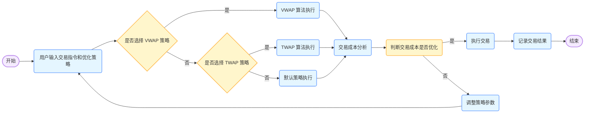

# 金融市场交易成本优化系统

> 关键词：金融市场、交易成本优化、算法交易、数学模型、系统开发

> 摘要：本文围绕金融市场交易成本优化系统展开，深入探讨其核心概念、算法原理、数学模型等内容。通过详细的代码示例和实际案例分析，阐述如何构建一个有效的交易成本优化系统。同时，介绍了该系统在金融市场中的实际应用场景，推荐了相关的学习资源、开发工具和论文著作。最后，对系统的未来发展趋势与挑战进行总结，并提供常见问题解答和扩展阅读参考资料。

## 1. 背景介绍 
### 1.1 目的和范围
在金融市场中，交易成本是投资者和金融机构关注的重要因素之一。交易成本包括佣金、买卖价差、市场冲击成本等，这些成本的高低直接影响到投资收益。金融市场交易成本优化系统的目的是通过合理的算法和策略，降低交易过程中的成本，提高投资回报率。

本系统的范围涵盖了股票、债券、期货等多种金融市场，旨在为投资者和金融机构提供一个通用的交易成本优化解决方案。系统将考虑市场流动性、交易规模、交易时机等多种因素，实现交易成本的最小化。

### 1.2 预期读者
本文的预期读者包括金融从业者、算法交易开发者、金融科技研究人员以及对金融市场交易成本优化感兴趣的技术爱好者。对于金融从业者，本文可以帮助他们了解如何利用技术手段降低交易成本；对于算法交易开发者，本文提供了具体的算法实现和代码示例；对于金融科技研究人员，本文可以作为相关研究的参考资料；对于技术爱好者，本文可以让他们了解金融市场中的技术应用。

### 1.3 文档结构概述
本文将按照以下结构进行组织：
1. **背景介绍**：介绍系统的目的、范围、预期读者和文档结构，以及相关术语的定义。
2. **核心概念与联系**：阐述交易成本优化系统的核心概念，包括交易成本的构成、优化策略的类型等，并通过文本示意图和 Mermaid 流程图展示其架构。
3. **核心算法原理 & 具体操作步骤**：详细讲解用于交易成本优化的核心算法，如 VWAP（成交量加权平均价格）算法、TWAP（时间加权平均价格）算法等，并使用 Python 源代码进行实现。
4. **数学模型和公式 & 详细讲解 & 举例说明**：介绍交易成本优化的数学模型和公式，如市场冲击成本模型、交易执行成本模型等，并通过具体的例子进行说明。
5. **项目实战：代码实际案例和详细解释说明**：通过一个实际的项目案例，展示如何搭建开发环境、实现交易成本优化系统的源代码，并对代码进行详细解读和分析。
6. **实际应用场景**：介绍交易成本优化系统在金融市场中的实际应用场景，如机构投资者的大额交易、高频交易等。
7. **工具和资源推荐**：推荐相关的学习资源、开发工具和论文著作，帮助读者进一步深入学习和研究交易成本优化系统。
8. **总结：未来发展趋势与挑战**：对交易成本优化系统的未来发展趋势进行总结，并分析可能面临的挑战。
9. **附录：常见问题与解答**：提供常见问题的解答，帮助读者解决在学习和实践过程中遇到的问题。
10. **扩展阅读 & 参考资料**：提供扩展阅读的建议和相关参考资料，方便读者进一步探索相关领域的知识。

### 1.4 术语表
#### 1.4.1 核心术语定义
- **交易成本**：指在金融市场中进行交易时所产生的各种费用，包括佣金、买卖价差、市场冲击成本等。
- **市场冲击成本**：指由于大规模交易导致市场价格变动而产生的额外成本。
- **VWAP（成交量加权平均价格）**：一种交易策略，通过在一段时间内按照成交量的比例进行交易，以达到接近市场平均价格的目的。
- **TWAP（时间加权平均价格）**：一种交易策略，通过在一段时间内均匀地进行交易，以达到接近市场平均价格的目的。
- **算法交易**：指利用计算机算法自动执行交易指令的交易方式。

#### 1.4.2 相关概念解释
- **流动性**：指市场中资产能够以合理价格快速买卖的能力。流动性越高，交易成本越低。
- **交易规模**：指一次交易中买卖的资产数量。交易规模越大，市场冲击成本越高。
- **交易时机**：指选择在何时进行交易。不同的交易时机可能会导致不同的交易成本。

#### 1.4.3 缩略词列表
- **VWAP**：Volume - Weighted Average Price（成交量加权平均价格）
- **TWAP**：Time - Weighted Average Price（时间加权平均价格）
- **API**：Application Programming Interface（应用程序编程接口）

## 2. 核心概念与联系 
### 核心概念原理
金融市场交易成本优化系统的核心在于通过合理的策略和算法，降低交易过程中的各种成本。交易成本主要包括以下几个方面：
1. **佣金**：投资者向券商支付的交易手续费，通常按照交易金额的一定比例收取。
2. **买卖价差**：指买入价和卖出价之间的差额，是市场流动性的一种体现。
3. **市场冲击成本**：当投资者进行大规模交易时，会对市场价格产生影响，导致交易价格偏离正常水平，从而产生额外的成本。

为了降低交易成本，常见的优化策略有以下几种：
1. **VWAP 策略**：该策略根据市场成交量的分布，在一段时间内按照成交量的比例进行交易，使得交易价格接近市场成交量加权平均价格。这样可以避免在成交量较低时进行大规模交易，从而减少市场冲击成本。
2. **TWAP 策略**：该策略在一段时间内均匀地进行交易，不考虑成交量的分布。通过将大订单拆分成多个小订单，在不同的时间点进行交易，降低市场冲击成本。

### 架构的文本示意图
```
金融市场交易成本优化系统架构

用户界面层
|
|-- 交易指令输入
|-- 优化策略选择
|-- 结果展示
|
业务逻辑层
|
|-- 交易成本分析模块
|   |-- 佣金计算
|   |-- 买卖价差计算
|   |-- 市场冲击成本计算
|
|-- 优化策略执行模块
|   |-- VWAP 算法
|   |-- TWAP 算法
|
数据存储层
|
|-- 历史交易数据
|-- 市场行情数据
|-- 优化策略参数
|
外部接口层
|
|-- 券商交易接口
|-- 市场行情数据源接口
```

### Mermaid 流程图


## 3. 核心算法原理 & 具体操作步骤 
### VWAP 算法原理
VWAP（成交量加权平均价格）算法的核心思想是在一段时间内，按照市场成交量的比例进行交易，使得交易价格接近市场成交量加权平均价格。具体步骤如下：
1. **确定交易时间段**：选择一个合适的交易时间段，例如一天或几个小时。
2. **获取市场成交量数据**：从市场行情数据源中获取该时间段内每个时间点的成交量。
3. **计算 VWAP**：根据成交量数据，计算该时间段内的 VWAP。计算公式为：
   $$VWAP=\frac{\sum_{i = 1}^{n}P_{i}V_{i}}{\sum_{i = 1}^{n}V_{i}}$$
   其中，$P_{i}$ 是第 $i$ 个时间点的价格，$V_{i}$ 是第 $i$ 个时间点的成交量，$n$ 是时间点的总数。
4. **分配交易订单**：根据 VWAP 和成交量分布，将总交易订单分配到各个时间点进行交易。

### Python 代码实现
```python
import pandas as pd

def calculate_vwap(prices, volumes):
    """
    计算 VWAP
    :param prices: 价格列表
    :param volumes: 成交量列表
    :return: VWAP
    """
    total_volume = sum(volumes)
    price_volume_product = [p * v for p, v in zip(prices, volumes)]
    vwap = sum(price_volume_product) / total_volume
    return vwap

def vwap_strategy(total_order, prices, volumes):
    """
    VWAP 交易策略
    :param total_order: 总交易订单数量
    :param prices: 价格列表
    :param volumes: 成交量列表
    :return: 每个时间点的交易订单数量
    """
    total_volume = sum(volumes)
    order_allocations = []
    for volume in volumes:
        allocation = total_order * (volume / total_volume)
        order_allocations.append(allocation)
    return order_allocations

# 示例数据
prices = [100, 101, 102, 103, 104]
volumes = [1000, 1500, 2000, 1200, 800]
total_order = 5000

# 计算 VWAP
vwap = calculate_vwap(prices, volumes)
print(f"VWAP: {vwap}")

# 执行 VWAP 策略
order_allocations = vwap_strategy(total_order, prices, volumes)
print(f"每个时间点的交易订单数量: {order_allocations}")
```

### TWAP 算法原理
TWAP（时间加权平均价格）算法的核心思想是在一段时间内均匀地进行交易，不考虑成交量的分布。具体步骤如下：
1. **确定交易时间段**：选择一个合适的交易时间段，例如一天或几个小时。
2. **确定交易次数**：根据交易时间段和交易频率，确定需要进行的交易次数。
3. **分配交易订单**：将总交易订单平均分配到各个交易时间点进行交易。

### Python 代码实现
```python
def twap_strategy(total_order, num_trades):
    """
    TWAP 交易策略
    :param total_order: 总交易订单数量
    :param num_trades: 交易次数
    :return: 每个时间点的交易订单数量
    """
    order_per_trade = total_order / num_trades
    order_allocations = [order_per_trade] * num_trades
    return order_allocations

# 示例数据
total_order = 5000
num_trades = 5

# 执行 TWAP 策略
order_allocations = twap_strategy(total_order, num_trades)
print(f"每个时间点的交易订单数量: {order_allocations}")
```

## 4. 数学模型和公式 & 详细讲解 & 举例说明 
### 市场冲击成本模型
市场冲击成本是指由于大规模交易导致市场价格变动而产生的额外成本。常见的市场冲击成本模型有线性模型和平方根模型。

#### 线性模型
线性模型假设市场冲击成本与交易规模成正比。计算公式为：
$$C_{s}=k \cdot \frac{Q}{V}$$
其中，$C_{s}$ 是市场冲击成本，$k$ 是市场冲击系数，$Q$ 是交易规模，$V$ 是市场成交量。

**举例说明**：假设市场冲击系数 $k = 0.01$，交易规模 $Q = 1000$ 股，市场成交量 $V = 10000$ 股。则市场冲击成本为：
$$C_{s}=0.01 \cdot \frac{1000}{10000}=0.001$$

#### 平方根模型
平方根模型假设市场冲击成本与交易规模的平方根成正比。计算公式为：
$$C_{s}=k \cdot \sqrt{\frac{Q}{V}}$$
**举例说明**：假设市场冲击系数 $k = 0.01$，交易规模 $Q = 1000$ 股，市场成交量 $V = 10000$ 股。则市场冲击成本为：
$$C_{s}=0.01 \cdot \sqrt{\frac{1000}{10000}}\approx0.0032$$

### 交易执行成本模型
交易执行成本包括佣金、买卖价差和市场冲击成本。计算公式为：
$$C_{e}=C_{c}+C_{s}+C_{s}$$
其中，$C_{e}$ 是交易执行成本，$C_{c}$ 是佣金成本，$C_{s}$ 是买卖价差成本，$C_{s}$ 是市场冲击成本。

**举例说明**：假设佣金成本 $C_{c}=0.001$，买卖价差成本 $C_{s}=0.002$，市场冲击成本 $C_{s}=0.003$。则交易执行成本为：
$$C_{e}=0.001 + 0.002+0.003 = 0.006$$

## 5. 项目实战：代码实际案例和详细解释说明 
### 5.1  开发环境搭建
#### 安装 Python
首先，需要安装 Python 环境。可以从 Python 官方网站（https://www.python.org/downloads/）下载适合自己操作系统的 Python 版本，并按照安装向导进行安装。

#### 安装必要的库
本项目需要使用以下 Python 库：
- `pandas`：用于数据处理和分析。
- `numpy`：用于数值计算。

可以使用以下命令安装这些库：
```sh
pip install pandas numpy
```

#### 选择开发工具
可以选择使用 PyCharm、Jupyter Notebook 等开发工具进行项目开发。这里以 Jupyter Notebook 为例，安装命令如下：
```sh
pip install jupyter
```

### 5.2  源代码详细实现和代码解读
```python
import pandas as pd
import numpy as np

# 定义市场冲击成本计算函数（线性模型）
def market_impact_cost_linear(k, Q, V):
    """
    计算线性模型的市场冲击成本
    :param k: 市场冲击系数
    :param Q: 交易规模
    :param V: 市场成交量
    :return: 市场冲击成本
    """
    return k * (Q / V)

# 定义交易执行成本计算函数
def transaction_execution_cost(commission, spread, market_impact):
    """
    计算交易执行成本
    :param commission: 佣金成本
    :param spread: 买卖价差成本
    :param market_impact: 市场冲击成本
    :return: 交易执行成本
    """
    return commission + spread + market_impact

# 示例数据
k = 0.01  # 市场冲击系数
Q = 1000  # 交易规模
V = 10000  # 市场成交量
commission = 0.001  # 佣金成本
spread = 0.002  # 买卖价差成本

# 计算市场冲击成本
market_impact = market_impact_cost_linear(k, Q, V)
print(f"市场冲击成本: {market_impact}")

# 计算交易执行成本
execution_cost = transaction_execution_cost(commission, spread, market_impact)
print(f"交易执行成本: {execution_cost}")
```

### 5.3  代码解读与分析
1. **市场冲击成本计算函数**：`market_impact_cost_linear` 函数根据线性模型计算市场冲击成本。输入参数包括市场冲击系数 $k$、交易规模 $Q$ 和市场成交量 $V$，输出为市场冲击成本。
2. **交易执行成本计算函数**：`transaction_execution_cost` 函数计算交易执行成本，输入参数包括佣金成本、买卖价差成本和市场冲击成本，输出为交易执行成本。
3. **示例数据**：定义了市场冲击系数、交易规模、市场成交量、佣金成本和买卖价差成本等示例数据。
4. **计算市场冲击成本和交易执行成本**：调用 `market_impact_cost_linear` 函数和 `transaction_execution_cost` 函数，计算市场冲击成本和交易执行成本，并打印结果。

## 6. 实际应用场景 
### 机构投资者的大额交易
机构投资者在进行大额交易时，由于交易规模较大，容易对市场价格产生影响，导致较高的市场冲击成本。金融市场交易成本优化系统可以帮助机构投资者制定合理的交易策略，如采用 VWAP 或 TWAP 策略，将大订单拆分成多个小订单，在不同的时间点进行交易，从而降低市场冲击成本。

### 高频交易
高频交易是指利用计算机算法在极短的时间内进行大量交易的交易方式。在高频交易中，交易成本的微小差异可能会对交易收益产生重大影响。交易成本优化系统可以帮助高频交易员实时监测市场行情，根据市场情况及时调整交易策略，降低交易成本。

### 资产配置和组合管理
在资产配置和组合管理过程中，投资者需要频繁地进行交易，以调整资产组合的权重。交易成本优化系统可以帮助投资者在进行资产配置和组合管理时，选择最优的交易时机和交易方式，降低交易成本，提高投资收益。

## 7. 工具和资源推荐
### 7.1 学习资源推荐
#### 7.1.1 书籍推荐
- 《算法交易：策略、分析与应用》：本书详细介绍了算法交易的基本原理、策略和应用，包括 VWAP、TWAP 等常见的交易策略。
- 《金融市场微观结构理论》：该书深入探讨了金融市场的微观结构，包括交易成本的形成机制和影响因素，对于理解交易成本优化系统的原理具有重要的参考价值。

#### 7.1.2 在线课程
- Coursera 上的“金融市场与投资管理”课程：该课程涵盖了金融市场的基本概念、投资组合理论和交易策略等内容，对于初学者来说是一个很好的入门课程。
- edX 上的“算法交易与定量分析”课程：该课程重点介绍了算法交易的原理和实践，包括交易成本优化、风险控制等方面的内容。

#### 7.1.3 技术博客和网站
- QuantNet：一个专注于量化金融领域的社区，提供了大量的技术文章、论坛讨论和学习资源。
- Towards Data Science：一个数据科学和机器学习领域的博客平台，上面有很多关于金融数据分析和算法交易的文章。

### 7.2 开发工具框架推荐
#### 7.2.1 IDE和编辑器
- PyCharm：一款功能强大的 Python 集成开发环境，提供了代码编辑、调试、版本控制等一系列功能，适合专业的 Python 开发者。
- Jupyter Notebook：一个交互式的开发环境，支持多种编程语言，适合数据探索和分析。

#### 7.2.2 调试和性能分析工具
- Py-Spy：一个用于 Python 代码性能分析的工具，可以帮助开发者找出代码中的性能瓶颈。
- PDB：Python 自带的调试器，可以帮助开发者调试代码，找出代码中的错误。

#### 7.2.3 相关框架和库
- Pandas：一个用于数据处理和分析的 Python 库，提供了丰富的数据结构和数据操作方法，非常适合金融数据分析。
- NumPy：一个用于数值计算的 Python 库，提供了高效的多维数组对象和数学函数，是金融算法实现的基础。

### 7.3 相关论文著作推荐
#### 7.3.1 经典论文
- "Optimal Execution of Portfolio Transactions" by Almgren and Chriss：该论文提出了一种基于市场冲击成本模型的最优交易执行策略，是算法交易领域的经典论文之一。
- "The Microstructure of Financial Markets" by O'Hara：该论文系统地介绍了金融市场的微观结构理论，对于理解交易成本的形成机制具有重要的参考价值。

#### 7.3.2 最新研究成果
- 可以关注《Journal of Financial Economics》、《Review of Financial Studies》等金融领域的顶级学术期刊，了解最新的研究成果。

#### 7.3.3 应用案例分析
- 一些金融机构和量化投资公司会发布他们的交易策略和应用案例，可以通过关注这些公司的官方网站或研究报告，了解交易成本优化系统在实际中的应用情况。

## 8. 总结：未来发展趋势与挑战
### 未来发展趋势
1. **智能化和自动化**：随着人工智能和机器学习技术的不断发展，金融市场交易成本优化系统将越来越智能化和自动化。系统可以通过学习历史数据和市场行情，自动调整交易策略，实现交易成本的最优控制。
2. **多市场和多资产覆盖**：未来的交易成本优化系统将不仅仅局限于股票市场，还将覆盖债券、期货、外汇等多个金融市场，以及多种资产类型。系统可以根据不同市场和资产的特点，制定个性化的交易策略。
3. **与风险管理的融合**：交易成本优化系统将与风险管理系统更加紧密地融合。系统可以在降低交易成本的同时，考虑风险因素，实现风险和收益的平衡。

### 挑战
1. **数据质量和实时性**：交易成本优化系统需要大量的历史数据和实时市场行情数据来进行分析和决策。数据的质量和实时性直接影响到系统的性能和效果。因此，如何获取高质量的实时数据是一个挑战。
2. **市场不确定性**：金融市场具有高度的不确定性，市场行情随时可能发生变化。交易成本优化系统需要能够快速适应市场变化，及时调整交易策略。然而，准确预测市场变化是非常困难的，这给系统的设计和实现带来了挑战。
3. **合规性要求**：金融市场受到严格的监管，交易成本优化系统需要符合相关的法律法规和监管要求。如何在满足合规性要求的前提下，实现交易成本的优化是一个需要解决的问题。

## 9. 附录：常见问题与解答
### 1. 交易成本优化系统是否适用于所有投资者？
交易成本优化系统适用于大多数投资者，尤其是那些进行频繁交易或大额交易的投资者。对于小额投资者来说，交易成本可能相对较低，使用交易成本优化系统的效果可能不太明显。

### 2. 如何选择合适的优化策略？
选择合适的优化策略需要考虑多个因素，如交易规模、交易频率、市场流动性等。一般来说，VWAP 策略适用于成交量较大的市场，而 TWAP 策略适用于成交量较为平稳的市场。投资者可以根据自己的实际情况选择合适的策略。

### 3. 交易成本优化系统能否保证一定降低交易成本？
交易成本优化系统不能保证一定降低交易成本，因为金融市场具有不确定性，市场行情随时可能发生变化。系统只是通过合理的策略和算法，尽可能地降低交易成本，但不能完全消除市场风险。

### 4. 如何评估交易成本优化系统的性能？
可以通过以下几个指标来评估交易成本优化系统的性能：
- 交易成本降低率：比较使用系统前后的交易成本，计算交易成本的降低率。
- 执行偏差：比较实际交易价格与目标价格（如 VWAP 或 TWAP）之间的偏差。
- 风险调整后的收益：考虑交易成本和风险因素，计算风险调整后的收益。

## 10. 扩展阅读 & 参考资料
### 扩展阅读
- 《量化投资：策略与技术》：该书介绍了量化投资的基本概念、策略和技术，对于深入理解金融市场交易成本优化系统具有一定的帮助。
- 《金融科技：重塑未来金融生态》：该书探讨了金融科技的发展趋势和应用场景，包括算法交易、区块链等技术在金融领域的应用。

### 参考资料
- Almgren, R., & Chriss, N. (2001). Optimal execution of portfolio transactions. Journal of Risk, 3(2), 5-39.
- O'Hara, M. (1995). Market microstructure theory. Blackwell Publishers.

作者：AI天才研究院/AI Genius Institute & 禅与计算机程序设计艺术 /Zen And The Art of Computer Programming