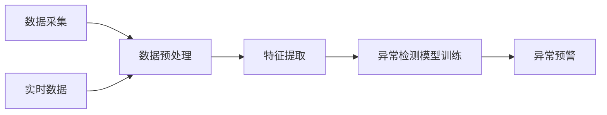

# 金融市场异常检测系统

> 关键词：金融市场、异常检测、机器学习、数据分析、风险预警

> 摘要：本文聚焦于金融市场异常检测系统，深入探讨其核心概念、算法原理、数学模型以及实际应用等方面。在金融领域，异常交易行为可能带来巨大风险，构建有效的异常检测系统至关重要。通过对相关技术的研究和实际案例分析，旨在为从业者提供全面的技术指导和实践经验，帮助他们更好地应对金融市场的不确定性和风险。

## 1. 背景介绍 
### 1.1 目的和范围
金融市场的稳定与安全对于经济发展至关重要。然而，市场中存在着各种异常交易行为，如内幕交易、操纵市场等，这些行为不仅损害了投资者的利益，也破坏了市场的公平性和有效性。金融市场异常检测系统的目的就是及时发现这些异常行为，为监管机构、金融机构和投资者提供风险预警，保障金融市场的正常运行。

本文章的范围涵盖了金融市场异常检测系统的各个方面，包括核心概念、算法原理、数学模型、实际应用场景等。同时，还提供了详细的代码案例和开发环境搭建步骤，帮助读者更好地理解和实践。

### 1.2 预期读者
本文预期读者包括金融领域的从业者，如金融分析师、风险管理人员、监管人员等，他们需要了解异常检测技术在金融市场中的应用，以更好地应对市场风险。同时，也适合计算机科学领域的研究者和开发者，他们对机器学习、数据分析等技术在金融领域的应用感兴趣，希望通过实际案例深入学习相关技术。

### 1.3 文档结构概述
本文将按照以下结构进行组织：
1. 背景介绍：介绍金融市场异常检测系统的目的、范围、预期读者和文档结构。
2. 核心概念与联系：阐述金融市场异常检测系统的核心概念，包括异常的定义、检测方法的分类等，并通过文本示意图和 Mermaid 流程图展示其架构。
3. 核心算法原理 & 具体操作步骤：详细讲解常用的异常检测算法原理，如基于统计的方法、基于机器学习的方法等，并使用 Python 源代码进行具体实现。
4. 数学模型和公式 & 详细讲解 & 举例说明：介绍异常检测中涉及的数学模型和公式，如概率分布、距离度量等，并通过具体例子进行详细讲解。
5. 项目实战：代码实际案例和详细解释说明：通过一个实际的金融市场异常检测项目，展示如何搭建开发环境、实现源代码，并对代码进行详细解读和分析。
6. 实际应用场景：介绍金融市场异常检测系统在不同场景下的应用，如股票市场、期货市场等。
7. 工具和资源推荐：推荐相关的学习资源、开发工具框架和论文著作，帮助读者进一步深入学习和研究。
8. 总结：未来发展趋势与挑战：总结金融市场异常检测系统的发展现状，分析未来的发展趋势和面临的挑战。
9. 附录：常见问题与解答：解答读者在学习和实践过程中可能遇到的常见问题。
10. 扩展阅读 & 参考资料：提供相关的扩展阅读材料和参考资料，方便读者进一步深入学习。

### 1.4 术语表
#### 1.4.1 核心术语定义
- **金融市场异常**：指金融市场中偏离正常交易模式的行为或事件，如异常的交易价格、交易量、交易频率等。
- **异常检测**：通过对数据的分析和处理，识别出数据中与正常模式不同的异常点或异常模式的过程。
- **机器学习**：一门多领域交叉学科，涉及概率论、统计学、逼近论、凸分析、算法复杂度理论等多门学科。它专门研究计算机怎样模拟或实现人类的学习行为，以获取新的知识或技能，重新组织已有的知识结构使之不断改善自身的性能。
- **风险预警**：通过对各种风险因素的监测和分析，提前发出可能发生风险的信号，以便采取相应的措施进行防范和应对。

#### 1.4.2 相关概念解释
- **监督学习**：一种机器学习方法，在监督学习中，模型通过学习已知的输入数据和对应的输出标签来进行训练，然后用于预测未知数据的输出。
- **无监督学习**：另一种机器学习方法，无监督学习中，模型不需要已知的输出标签，而是通过对输入数据的特征进行分析和聚类，发现数据中的内在结构和模式。
- **特征工程**：指对原始数据进行预处理和转换，提取出有价值的特征，以便更好地用于机器学习模型的训练和预测。

#### 1.4.3 缩略词列表
- **PCA**：Principal Component Analysis，主成分分析
- **SVM**：Support Vector Machine，支持向量机
- **KNN**：K-Nearest Neighbors，K近邻算法
- **LSTM**：Long Short-Term Memory，长短期记忆网络

## 2. 核心概念与联系 
### 核心概念原理
金融市场异常检测系统的核心在于如何定义和识别异常。异常的定义通常基于对正常交易模式的理解和建模。正常交易模式可以通过历史数据进行学习和统计分析得到，例如，股票的价格波动通常在一定的范围内，交易量也有一定的规律。当交易数据偏离这些正常模式时，就可能被认为是异常。

异常检测的方法可以分为基于统计的方法、基于机器学习的方法和基于深度学习的方法等。基于统计的方法通过计算数据的统计特征，如均值、方差、分位数等，来判断数据是否异常。基于机器学习的方法则利用机器学习算法，如聚类算法、分类算法等，对数据进行建模和分析，以识别异常。基于深度学习的方法则使用深度神经网络，如卷积神经网络（CNN）、长短期记忆网络（LSTM）等，来自动学习数据的特征和模式，从而实现异常检测。

### 架构的文本示意图
金融市场异常检测系统的架构通常包括数据采集、数据预处理、特征提取、异常检测模型训练和异常预警等模块。具体架构如下：
1. **数据采集**：从金融市场数据源，如证券交易所、银行等，采集交易数据，包括交易价格、交易量、交易时间等。
2. **数据预处理**：对采集到的数据进行清洗、去噪、归一化等处理，以提高数据的质量和可用性。
3. **特征提取**：从预处理后的数据中提取有价值的特征，如技术指标、统计特征等，以便用于异常检测模型的训练。
4. **异常检测模型训练**：使用提取的特征对异常检测模型进行训练，选择合适的模型和算法，如基于统计的方法、基于机器学习的方法等。
5. **异常预警**：将实时采集到的数据输入到训练好的异常检测模型中，进行异常检测。如果检测到异常，及时发出预警信号，通知相关人员进行处理。

### Mermaid 流程图


## 3. 核心算法原理 & 具体操作步骤 
### 基于统计的异常检测方法
#### 原理
基于统计的异常检测方法通过计算数据的统计特征，如均值、方差、分位数等，来判断数据是否异常。常用的方法包括 Z-Score 方法和箱线图方法。

Z-Score 方法是一种基于正态分布的异常检测方法，它通过计算数据点与均值的偏离程度来判断数据是否异常。具体公式为：
$$Z = \frac{x - \mu}{\sigma}$$
其中，$x$ 是数据点，$\mu$ 是数据的均值，$\sigma$ 是数据的标准差。当 $|Z|$ 大于某个阈值时，认为该数据点是异常点。

箱线图方法是一种基于数据分位数的异常检测方法，它通过绘制数据的箱线图来判断数据是否异常。箱线图由下四分位数（$Q_1$）、中位数（$Q_2$）、上四分位数（$Q_3$）、下限和上限组成。下限和上限的计算公式为：
$$下限 = Q_1 - 1.5 \times IQR$$
$$上限 = Q_3 + 1.5 \times IQR$$
其中，$IQR = Q_3 - Q_1$ 是四分位距。当数据点小于下限或大于上限时，认为该数据点是异常点。

#### Python 源代码实现
```python
import numpy as np

# Z-Score 方法
def z_score_anomaly_detection(data, threshold=3):
    mean = np.mean(data)
    std = np.std(data)
    z_scores = np.abs((data - mean) / std)
    anomalies = data[z_scores > threshold]
    return anomalies

# 箱线图方法
def boxplot_anomaly_detection(data):
    q1 = np.percentile(data, 25)
    q3 = np.percentile(data, 75)
    iqr = q3 - q1
    lower_bound = q1 - 1.5 * iqr
    upper_bound = q3 + 1.5 * iqr
    anomalies = data[(data < lower_bound) | (data > upper_bound)]
    return anomalies

# 示例数据
data = np.array([1, 2, 3, 4, 5, 100, 6, 7, 8, 9])

# 使用 Z-Score 方法进行异常检测
z_score_anomalies = z_score_anomaly_detection(data)
print("Z-Score 方法检测到的异常点:", z_score_anomalies)

# 使用箱线图方法进行异常检测
boxplot_anomalies = boxplot_anomaly_detection(data)
print("箱线图方法检测到的异常点:", boxplot_anomalies)
```

### 基于机器学习的异常检测方法
#### 原理
基于机器学习的异常检测方法利用机器学习算法，如聚类算法、分类算法等，对数据进行建模和分析，以识别异常。常用的方法包括 K-Means 聚类算法和 One-Class SVM 算法。

K-Means 聚类算法是一种无监督学习算法，它通过将数据点划分为不同的簇，使得同一簇内的数据点相似度较高，不同簇内的数据点相似度较低。异常点通常位于簇的边缘或远离簇中心。

One-Class SVM 算法是一种有监督学习算法，它通过学习正常数据的分布，构建一个超平面，将正常数据与异常数据分开。当新的数据点位于超平面之外时，认为该数据点是异常点。

#### Python 源代码实现
```python
from sklearn.cluster import KMeans
from sklearn.svm import OneClassSVM
import numpy as np

# K-Means 聚类算法
def kmeans_anomaly_detection(data, n_clusters=2, threshold=2):
    kmeans = KMeans(n_clusters=n_clusters)
    kmeans.fit(data.reshape(-1, 1))
    centroids = kmeans.cluster_centers_
    labels = kmeans.labels_
    distances = []
    for i in range(len(data)):
        cluster_label = labels[i]
        centroid = centroids[cluster_label]
        distance = np.abs(data[i] - centroid)
        distances.append(distance)
    distances = np.array(distances)
    anomalies = data[distances > threshold]
    return anomalies

# One-Class SVM 算法
def one_class_svm_anomaly_detection(data, nu=0.1):
    one_class_svm = OneClassSVM(nu=nu)
    one_class_svm.fit(data.reshape(-1, 1))
    predictions = one_class_svm.predict(data.reshape(-1, 1))
    anomalies = data[predictions == -1]
    return anomalies

# 示例数据
data = np.array([1, 2, 3, 4, 5, 100, 6, 7, 8, 9])

# 使用 K-Means 聚类算法进行异常检测
kmeans_anomalies = kmeans_anomaly_detection(data)
print("K-Means 聚类算法检测到的异常点:", kmeans_anomalies)

# 使用 One-Class SVM 算法进行异常检测
one_class_svm_anomalies = one_class_svm_anomaly_detection(data)
print("One-Class SVM 算法检测到的异常点:", one_class_svm_anomalies)
```

## 4. 数学模型和公式 & 详细讲解 & 举例说明 
### 概率分布模型
在金融市场异常检测中，常常假设数据服从某种概率分布，如正态分布、泊松分布等。通过对数据的概率分布进行建模，可以计算数据点的概率密度，从而判断数据点是否异常。

#### 正态分布
正态分布是一种常见的概率分布，其概率密度函数为：
$$f(x) = \frac{1}{\sigma \sqrt{2\pi}} e^{-\frac{(x - \mu)^2}{2\sigma^2}}$$
其中，$\mu$ 是均值，$\sigma$ 是标准差。

假设某股票的价格服从正态分布，均值为 $\mu = 50$，标准差为 $\sigma = 5$。现在有一个新的价格数据点 $x = 65$，我们可以计算该数据点的概率密度：
```python
import numpy as np
from scipy.stats import norm

mu = 50
sigma = 5
x = 65

pdf = norm.pdf(x, mu, sigma)
print("数据点 x = 65 的概率密度:", pdf)
```

### 距离度量模型
距离度量模型用于计算数据点之间的距离，从而判断数据点是否异常。常用的距离度量方法包括欧氏距离、曼哈顿距离等。

#### 欧氏距离
欧氏距离是最常用的距离度量方法，其计算公式为：
$$d(x, y) = \sqrt{\sum_{i=1}^{n} (x_i - y_i)^2}$$
其中，$x$ 和 $y$ 是两个数据点，$n$ 是数据点的维度。

假设我们有两个数据点 $x = [1, 2, 3]$ 和 $y = [4, 5, 6]$，我们可以计算它们之间的欧氏距离：
```python
import numpy as np

x = np.array([1, 2, 3])
y = np.array([4, 5, 6])

euclidean_distance = np.linalg.norm(x - y)
print("数据点 x 和 y 之间的欧氏距离:", euclidean_distance)
```

## 5. 项目实战：代码实际案例和详细解释说明 
### 5.1  开发环境搭建
为了实现金融市场异常检测系统，我们需要搭建一个开发环境。以下是搭建开发环境的步骤：
1. **安装 Python**：Python 是一种广泛使用的编程语言，我们可以从 Python 官方网站（https://www.python.org/downloads/）下载并安装 Python。
2. **安装必要的库**：我们需要安装一些必要的 Python 库，如 numpy、pandas、scikit-learn 等。可以使用以下命令进行安装：
```sh
pip install numpy pandas scikit-learn
```
3. **安装开发工具**：可以选择使用 PyCharm、Jupyter Notebook 等开发工具来编写和运行代码。

### 5.2  源代码详细实现和代码解读
以下是一个使用 K-Means 聚类算法进行金融市场异常检测的实际案例：
```python
import numpy as np
import pandas as pd
from sklearn.cluster import KMeans
import matplotlib.pyplot as plt

# 读取数据
data = pd.read_csv('financial_data.csv')

# 提取特征
features = data[['price', 'volume']].values

# 使用 K-Means 聚类算法进行异常检测
n_clusters = 3
kmeans = KMeans(n_clusters=n_clusters)
kmeans.fit(features)
labels = kmeans.labels_
centroids = kmeans.cluster_centers_

# 计算每个数据点到其所属簇中心的距离
distances = []
for i in range(len(features)):
    cluster_label = labels[i]
    centroid = centroids[cluster_label]
    distance = np.linalg.norm(features[i] - centroid)
    distances.append(distance)
distances = np.array(distances)

# 设置异常阈值
threshold = np.mean(distances) + 2 * np.std(distances)

# 标记异常点
anomaly_labels = np.zeros(len(features))
anomaly_labels[distances > threshold] = 1

# 可视化结果
plt.scatter(features[:, 0], features[:, 1], c=anomaly_labels, cmap='viridis')
plt.scatter(centroids[:, 0], centroids[:, 1], marker='X', s=200, c='red')
plt.xlabel('Price')
plt.ylabel('Volume')
plt.title('Financial Market Anomaly Detection')
plt.show()
```

### 代码解读与分析
1. **数据读取**：使用 `pandas` 库读取金融市场数据文件 `financial_data.csv`。
2. **特征提取**：从数据中提取 `price` 和 `volume` 两个特征作为异常检测的输入。
3. **K-Means 聚类算法**：使用 `sklearn` 库中的 `KMeans` 算法对数据进行聚类，将数据分为 `n_clusters` 个簇。
4. **距离计算**：计算每个数据点到其所属簇中心的距离，用于判断数据点是否异常。
5. **异常阈值设置**：根据距离的均值和标准差设置异常阈值，当数据点到簇中心的距离大于阈值时，认为该数据点是异常点。
6. **异常标记**：将异常点标记为 1，正常点标记为 0。
7. **可视化结果**：使用 `matplotlib` 库将数据点和簇中心可视化，异常点用不同的颜色表示。

## 6. 实际应用场景 
### 股票市场
在股票市场中，异常检测系统可以用于监测股票价格的异常波动、交易量的异常变化等。例如，当某只股票的价格在短时间内大幅上涨或下跌，或者交易量突然大幅增加或减少时，可能意味着存在异常交易行为，如内幕交易、操纵市场等。异常检测系统可以及时发现这些异常情况，并发出预警信号，帮助投资者和监管机构采取相应的措施。

### 期货市场
在期货市场中，异常检测系统可以用于监测期货合约的价格波动、持仓量的变化等。例如，当某一期货合约的价格出现异常波动，或者持仓量突然大幅增加或减少时，可能意味着市场参与者对该合约的预期发生了变化，或者存在异常交易行为。异常检测系统可以及时发现这些异常情况，并为投资者和监管机构提供决策支持。

### 银行信贷市场
在银行信贷市场中，异常检测系统可以用于监测借款人的信用风险。例如，通过分析借款人的还款记录、收入情况、负债情况等数据，异常检测系统可以发现借款人的还款行为是否异常，如逾期还款、提前还款等。如果发现异常情况，银行可以及时采取措施，如调整贷款利率、要求借款人提供担保等，以降低信用风险。

## 7. 工具和资源推荐
### 7.1 学习资源推荐
#### 7.1.1 书籍推荐
- 《机器学习》（周志华著）：这是一本经典的机器学习教材，全面介绍了机器学习的基本概念、算法和应用。
- 《Python 数据分析实战》（Sebastian Raschka 著）：本书详细介绍了如何使用 Python 进行数据分析，包括数据预处理、数据可视化、机器学习等方面的内容。
- 《金融时间序列分析》（Ruey S. Tsay 著）：本书系统地介绍了金融时间序列分析的基本理论和方法，包括线性时间序列模型、非线性时间序列模型、波动率模型等。

#### 7.1.2 在线课程
- Coursera 上的《机器学习》课程（Andrew Ng 教授授课）：这是一门非常受欢迎的机器学习在线课程，全面介绍了机器学习的基本概念、算法和应用。
- edX 上的《Python 数据科学》课程：该课程介绍了如何使用 Python 进行数据科学研究，包括数据处理、数据分析、机器学习等方面的内容。
- Udemy 上的《金融数据分析与机器学习》课程：该课程结合金融市场的实际案例，介绍了如何使用机器学习技术进行金融数据分析和预测。

#### 7.1.3 技术博客和网站
- Towards Data Science：这是一个专注于数据科学和机器学习的技术博客，提供了大量的技术文章和案例分析。
- Kaggle：这是一个数据科学竞赛平台，提供了丰富的数据集和竞赛项目，可以帮助学习者提高数据科学和机器学习的实践能力。
- Medium：这是一个综合性的技术博客平台，有很多关于金融市场异常检测的技术文章和经验分享。

### 7.2 开发工具框架推荐
#### 7.2.1 IDE和编辑器
- PyCharm：这是一款专业的 Python 集成开发环境，提供了丰富的功能和插件，适合开发大型的 Python 项目。
- Jupyter Notebook：这是一个交互式的开发环境，适合进行数据探索和分析，支持 Python、R 等多种编程语言。
- Visual Studio Code：这是一款轻量级的代码编辑器，支持多种编程语言，有丰富的插件可以扩展功能。

#### 7.2.2 调试和性能分析工具
- PDB：这是 Python 自带的调试工具，可以帮助开发者调试 Python 代码。
- cProfile：这是 Python 自带的性能分析工具，可以帮助开发者分析 Python 代码的性能瓶颈。
- Py-Spy：这是一个第三方的性能分析工具，可以实时监测 Python 代码的性能。

#### 7.2.3 相关框架和库
- Numpy：这是一个用于科学计算的 Python 库，提供了高效的数组操作和数学函数。
- Pandas：这是一个用于数据处理和分析的 Python 库，提供了数据结构和数据操作的工具。
- Scikit-learn：这是一个用于机器学习的 Python 库，提供了丰富的机器学习算法和工具。
- TensorFlow：这是一个开源的深度学习框架，由 Google 开发，提供了丰富的深度学习模型和工具。

### 7.3 相关论文著作推荐
#### 7.3.1 经典论文
- Hawkins, D. M. (1980). Identification of outliers. Chapman and Hall. ：这篇论文介绍了异常检测的基本概念和方法，是异常检测领域的经典论文。
- Breunig, M. M., Kriegel, H. P., Ng, R. T., & Sander, J. (2000, May). LOF: identifying density-based local outliers. In ACM sigmod record (Vol. 29, No. 2, pp. 93-104). ACM. ：这篇论文提出了基于密度的局部异常因子（LOF）算法，是异常检测领域的重要算法之一。

#### 7.3.2 最新研究成果
- 可以关注顶级学术会议和期刊，如 ACM SIGKDD、IEEE ICDM、Journal of Machine Learning Research 等，获取异常检测领域的最新研究成果。

#### 7.3.3 应用案例分析
- 可以参考一些金融领域的研究报告和案例分析，了解异常检测系统在实际金融市场中的应用情况和效果。

## 8. 总结：未来发展趋势与挑战
### 未来发展趋势
1. **多模态数据融合**：未来的金融市场异常检测系统将不仅仅依赖于单一的交易数据，还将融合多种模态的数据，如文本数据、图像数据等，以提高异常检测的准确性和全面性。
2. **深度学习的应用**：深度学习技术在异常检测领域的应用将越来越广泛，如使用卷积神经网络（CNN）、长短期记忆网络（LSTM）等深度神经网络来自动学习数据的特征和模式，从而实现更高效、更准确的异常检测。
3. **实时监测和预警**：随着金融市场的快速变化，实时监测和预警将成为异常检测系统的重要发展方向。未来的系统将能够实时处理大量的交易数据，及时发现异常情况并发出预警信号。

### 挑战
1. **数据质量问题**：金融市场数据往往存在噪声、缺失值等问题，这些问题会影响异常检测的准确性。因此，如何提高数据质量是异常检测系统面临的一个重要挑战。
2. **模型解释性问题**：深度学习模型通常是黑盒模型，难以解释其决策过程。在金融市场异常检测中，模型的解释性非常重要，因为监管机构和投资者需要了解模型为什么做出这样的判断。因此，如何提高模型的解释性是异常检测系统面临的另一个重要挑战。
3. **对抗攻击问题**：随着异常检测系统的广泛应用，攻击者可能会采用对抗攻击的方法来绕过异常检测系统。因此，如何提高异常检测系统的抗攻击能力是异常检测系统面临的一个新挑战。

## 9. 附录：常见问题与解答
### 问题 1：如何选择合适的异常检测算法？
答：选择合适的异常检测算法需要考虑多个因素，如数据的特点、异常的定义、检测的目的等。如果数据服从某种概率分布，可以选择基于统计的方法；如果数据没有明显的分布规律，可以选择基于机器学习的方法。同时，还需要根据实际情况进行实验和比较，选择效果最好的算法。

### 问题 2：如何评估异常检测系统的性能？
答：评估异常检测系统的性能可以使用多种指标，如准确率、召回率、F1 值等。准确率是指检测出的异常点中真正的异常点的比例；召回率是指真正的异常点中被检测出的比例；F1 值是准确率和召回率的调和平均数。此外，还可以使用 ROC 曲线、AUC 值等指标来评估异常检测系统的性能。

### 问题 3：如何处理数据中的缺失值和噪声？
答：处理数据中的缺失值和噪声可以使用多种方法。对于缺失值，可以采用删除缺失值、填充缺失值等方法；对于噪声，可以采用滤波、平滑等方法。具体方法的选择需要根据数据的特点和分析的目的来确定。

## 10. 扩展阅读 & 参考资料
### 扩展阅读
- 《人工智能：现代方法》（Stuart Russell、Peter Norvig 著）：本书全面介绍了人工智能的基本概念、算法和应用，是人工智能领域的经典教材。
- 《数据挖掘：概念与技术》（Jiawei Han、Jian Pei、Jianying Yin 著）：本书系统地介绍了数据挖掘的基本概念、算法和应用，是数据挖掘领域的经典教材。

### 参考资料
- 相关学术论文和研究报告
- 金融市场相关的法律法规和政策文件
- 相关技术博客和网站的文章

作者：AI天才研究院/AI Genius Institute & 禅与计算机程序设计艺术 /Zen And The Art of Computer Programming