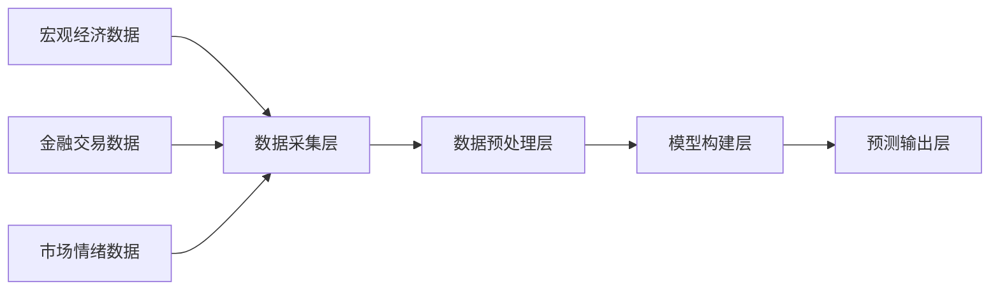

# 金融市场流动性供给预测模型

> 关键词：金融市场、流动性供给、预测模型、时间序列分析、机器学习算法

> 摘要：本文聚焦于金融市场流动性供给预测模型。首先介绍了研究背景，包括目的、预期读者等内容。接着阐述了相关核心概念及联系，展示了原理和架构的示意图与流程图。详细讲解了核心算法原理，用 Python 代码进行了具体阐述，同时给出了相关数学模型和公式并举例说明。通过项目实战，从开发环境搭建到源代码实现与解读进行了全面分析。探讨了该预测模型在不同场景下的实际应用，推荐了相关学习资源、开发工具框架以及论文著作。最后对未来发展趋势与挑战进行总结，并给出常见问题解答和参考资料，旨在为金融市场流动性供给预测提供全面深入的技术指导。

## 1. 背景介绍 
### 1.1 目的和范围
金融市场的流动性供给状况对市场的稳定运行和投资者的决策至关重要。准确预测金融市场的流动性供给可以帮助投资者更好地把握市场趋势，合理配置资产，降低投资风险。同时，对于监管机构而言，流动性供给预测有助于制定科学有效的监管政策，维护金融市场的稳定。本研究的范围涵盖了股票市场、债券市场、货币市场等主要金融市场，旨在构建一个通用的、具有较高准确性的流动性供给预测模型。

### 1.2 预期读者
本文预期读者包括金融行业的从业者，如投资经理、交易员、风险分析师等，他们可以借助本预测模型优化投资决策和风险管理策略。同时，也适用于金融监管机构的工作人员，为其制定政策提供参考依据。此外，对金融市场和预测模型感兴趣的科研人员和学生也可以从本文中获取相关知识和技术。

### 1.3 文档结构概述
本文首先介绍了研究的背景信息，包括目的、预期读者和文档结构等。接着阐述了金融市场流动性供给预测模型的核心概念和联系，通过示意图和流程图直观展示其原理和架构。然后详细讲解了核心算法原理，并给出 Python 代码示例。随后介绍了相关的数学模型和公式，并举例说明。通过项目实战，介绍开发环境搭建、源代码实现和解读。探讨了该模型的实际应用场景，推荐了学习资源、开发工具框架和相关论文著作。最后总结未来发展趋势与挑战，给出常见问题解答和参考资料。

### 1.4 术语表
#### 1.4.1 核心术语定义
- **金融市场流动性供给**：指在一定时期内，金融市场中能够提供的用于交易的资金和金融资产的数量。
- **预测模型**：基于历史数据和相关因素，运用数学和统计方法构建的，用于预测未来事件或趋势的模型。
- **时间序列分析**：一种对按时间顺序排列的数据进行分析和预测的方法，通过研究数据的变化规律来预测未来值。
- **机器学习算法**：一类基于数据自动学习模式和规律，并利用这些模式和规律进行预测和决策的算法。

#### 1.4.2 相关概念解释
- **市场深度**：衡量金融市场流动性的一个指标，反映了市场在不影响价格的情况下能够吸收的交易量大小。
- **买卖价差**：指金融资产买入价和卖出价之间的差额，是衡量市场流动性成本的一个重要指标。

#### 1.4.3 缩略词列表
- **ARIMA**：自回归积分滑动平均模型（Autoregressive Integrated Moving Average Model）
- **LSTM**：长短期记忆网络（Long Short-Term Memory Network）
- **GARCH**：广义自回归条件异方差模型（Generalized Autoregressive Conditional Heteroskedasticity Model）

## 2. 核心概念与联系 

### 金融市场流动性供给预测模型的核心概念原理

金融市场流动性供给预测模型的核心在于对影响流动性供给的各种因素进行分析和建模。这些因素包括宏观经济指标（如 GDP 增长率、通货膨胀率等）、货币政策（如利率调整、货币供应量变化等）、市场情绪（如投资者信心指数等）以及金融市场自身的交易数据（如成交量、价格波动等）。通过对这些因素的综合分析，利用合适的数学和统计方法构建预测模型，从而对未来的流动性供给进行预测。

### 架构的文本示意图

金融市场流动性供给预测模型的架构主要包括数据采集层、数据预处理层、模型构建层和预测输出层。

- **数据采集层**：负责从各种数据源收集与流动性供给相关的数据，如宏观经济数据库、金融交易平台等。
- **数据预处理层**：对采集到的数据进行清洗、转换和特征工程，以提高数据的质量和可用性。
- **模型构建层**：选择合适的算法和模型，如时间序列分析模型、机器学习模型等，对预处理后的数据进行训练和优化。
- **预测输出层**：利用训练好的模型对未来的流动性供给进行预测，并输出预测结果。

### Mermaid 流程图



## 3. 核心算法原理 & 具体操作步骤 

### 时间序列分析算法 - ARIMA 模型

ARIMA 模型是一种常用的时间序列分析模型，它结合了自回归（AR）、差分（I）和移动平均（MA）的思想。其基本原理是通过对时间序列数据的自相关性和移动平均性进行建模，来预测未来的值。

#### Python 代码示例

```python
import pandas as pd
from statsmodels.tsa.arima.model import ARIMA
import matplotlib.pyplot as plt

# 读取时间序列数据
data = pd.read_csv('liquidity_data.csv', index_col='date', parse_dates=True)

# 拆分训练集和测试集
train_data = data.iloc[:-10]
test_data = data.iloc[-10:]

# 构建 ARIMA 模型
model = ARIMA(train_data, order=(1, 1, 1))
model_fit = model.fit()

# 进行预测
predictions = model_fit.get_forecast(steps=10)
predicted_mean = predictions.predicted_mean

# 绘制预测结果
plt.plot(train_data, label='Train Data')
plt.plot(test_data, label='Test Data')
plt.plot(test_data.index, predicted_mean, label='Predictions', color='r')
plt.legend()
plt.show()
```

### 机器学习算法 - LSTM 模型

LSTM 是一种特殊的循环神经网络，它能够有效地处理序列数据中的长期依赖关系。在金融市场流动性供给预测中，LSTM 模型可以通过学习历史数据的模式和规律，对未来的流动性供给进行预测。

#### Python 代码示例

```python
import numpy as np
import pandas as pd
from sklearn.preprocessing import MinMaxScaler
from tensorflow.keras.models import Sequential
from tensorflow.keras.layers import LSTM, Dense
import matplotlib.pyplot as plt

# 读取数据
data = pd.read_csv('liquidity_data.csv', index_col='date', parse_dates=True)

# 数据归一化
scaler = MinMaxScaler()
scaled_data = scaler.fit_transform(data)

# 准备训练数据
def create_dataset(dataset, time_step=1):
    X, Y = [], []
    for i in range(len(dataset)-time_step-1):
        a = dataset[i:(i+time_step), 0]
        X.append(a)
        Y.append(dataset[i + time_step, 0])
    return np.array(X), np.array(Y)

time_step = 100
X_train, y_train = create_dataset(scaled_data, time_step)

X_train = X_train.reshape(X_train.shape[0], X_train.shape[1], 1)

# 构建 LSTM 模型
model = Sequential()
model.add(LSTM(50, return_sequences=True, input_shape=(time_step, 1)))
model.add(LSTM(50, return_sequences=True))
model.add(LSTM(50))
model.add(Dense(1))
model.compile(loss='mean_squared_error', optimizer='adam')

# 训练模型
model.fit(X_train, y_train, epochs=100, batch_size=64, verbose=1)

# 进行预测
test_data = scaled_data[-time_step:]
test_data = test_data.reshape(1, time_step, 1)
predictions = model.predict(test_data)
predictions = scaler.inverse_transform(predictions)

# 绘制预测结果
plt.plot(data.index, data.values, label='Original Data')
plt.plot(data.index[-1], predictions[0][0], 'ro', label='Prediction')
plt.legend()
plt.show()
```

## 4. 数学模型和公式 & 详细讲解 & 举例说明 

### ARIMA 模型的数学公式

ARIMA 模型的一般形式可以表示为：

$$
(1 - \sum_{i=1}^{p} \phi_i B^i)(1 - B)^d Y_t = (1 + \sum_{j=1}^{q} \theta_j B^j) \epsilon_t
$$

其中：
- $Y_t$ 是时间序列在时刻 $t$ 的值。
- $B$ 是后移算子，即 $B Y_t = Y_{t - 1}$。
- $p$ 是自回归项的阶数。
- $d$ 是差分的阶数。
- $q$ 是移动平均项的阶数。
- $\phi_i$ 是自回归系数。
- $\theta_j$ 是移动平均系数。
- $\epsilon_t$ 是白噪声序列。

#### 详细讲解
ARIMA 模型通过自回归项捕捉时间序列的自相关性，差分操作用于使时间序列变得平稳，移动平均项则考虑了过去的随机误差对当前值的影响。通过调整 $p$、$d$ 和 $q$ 的值，可以得到不同的 ARIMA 模型。

#### 举例说明
假设我们有一个时间序列数据 $Y_t$，经过分析确定 $p = 1$，$d = 1$，$q = 1$，则 ARIMA(1, 1, 1) 模型的具体形式为：

$$
(1 - \phi_1 B)(1 - B) Y_t = (1 + \theta_1 B) \epsilon_t
$$

展开可得：

$$
Y_t - Y_{t - 1} - \phi_1 (Y_{t - 1} - Y_{t - 2}) = \epsilon_t + \theta_1 \epsilon_{t - 1}
$$

### LSTM 模型的数学原理

LSTM 单元的主要组成部分包括输入门、遗忘门、输出门和细胞状态。其数学公式如下：

- 遗忘门：
$$
f_t = \sigma(W_f [h_{t - 1}, x_t] + b_f)
$$

- 输入门：
$$
i_t = \sigma(W_i [h_{t - 1}, x_t] + b_i)
$$

$$
\tilde{C}_t = \tanh(W_C [h_{t - 1}, x_t] + b_C)
$$

- 细胞状态更新：
$$
C_t = f_t \odot C_{t - 1} + i_t \odot \tilde{C}_t
$$

- 输出门：
$$
o_t = \sigma(W_o [h_{t - 1}, x_t] + b_o)
$$

$$
h_t = o_t \odot \tanh(C_t)
$$

其中：
- $x_t$ 是当前时刻的输入。
- $h_{t - 1}$ 是上一时刻的隐藏状态。
- $W$ 和 $b$ 分别是权重矩阵和偏置向量。
- $\sigma$ 是 sigmoid 函数，$\tanh$ 是双曲正切函数。
- $\odot$ 表示逐元素相乘。

#### 详细讲解
遗忘门决定了上一时刻的细胞状态有多少信息需要被遗忘。输入门决定了当前输入有多少信息需要被加入到细胞状态中。细胞状态更新是根据遗忘门和输入门的输出对细胞状态进行更新。输出门决定了当前细胞状态有多少信息需要被输出作为隐藏状态。

#### 举例说明
假设我们有一个 LSTM 单元，输入 $x_t$ 是一个向量，$h_{t - 1}$ 也是一个向量。通过上述公式的计算，遗忘门会根据输入和上一时刻的隐藏状态决定哪些信息需要被遗忘，输入门会决定哪些新信息需要被加入到细胞状态中，最终输出门会输出当前时刻的隐藏状态。

## 5. 项目实战：代码实际案例和详细解释说明 

### 5.1  开发环境搭建
- **操作系统**：推荐使用 Windows 10、Linux（如 Ubuntu）或 macOS。
- **Python 环境**：安装 Python 3.7 及以上版本。
- **Python 库**：安装所需的库，如 pandas、numpy、statsmodels、tensorflow、matplotlib 等。可以使用以下命令进行安装：
```sh
pip install pandas numpy statsmodels tensorflow matplotlib
```

### 5.2  源代码详细实现和代码解读
#### ARIMA 模型代码解读

```python
import pandas as pd
from statsmodels.tsa.arima.model import ARIMA
import matplotlib.pyplot as plt

# 读取时间序列数据
data = pd.read_csv('liquidity_data.csv', index_col='date', parse_dates=True)

# 拆分训练集和测试集
train_data = data.iloc[:-10]
test_data = data.iloc[-10:]

# 构建 ARIMA 模型
model = ARIMA(train_data, order=(1, 1, 1))
model_fit = model.fit()

# 进行预测
predictions = model_fit.get_forecast(steps=10)
predicted_mean = predictions.predicted_mean

# 绘制预测结果
plt.plot(train_data, label='Train Data')
plt.plot(test_data, label='Test Data')
plt.plot(test_data.index, predicted_mean, label='Predictions', color='r')
plt.legend()
plt.show()
```

- **数据读取**：使用 `pandas` 库的 `read_csv` 函数读取流动性数据，并将日期列作为索引。
- **数据拆分**：将数据拆分为训练集和测试集，训练集用于模型训练，测试集用于验证模型的预测效果。
- **模型构建**：使用 `ARIMA` 类构建 ARIMA 模型，`order=(1, 1, 1)` 表示 $p = 1$，$d = 1$，$q = 1$。
- **模型训练**：使用 `fit` 方法对模型进行训练。
- **预测**：使用 `get_forecast` 方法进行预测，并获取预测的均值。
- **绘图**：使用 `matplotlib` 库绘制训练数据、测试数据和预测结果的图形。

#### LSTM 模型代码解读

```python
import numpy as np
import pandas as pd
from sklearn.preprocessing import MinMaxScaler
from tensorflow.keras.models import Sequential
from tensorflow.keras.layers import LSTM, Dense
import matplotlib.pyplot as plt

# 读取数据
data = pd.read_csv('liquidity_data.csv', index_col='date', parse_dates=True)

# 数据归一化
scaler = MinMaxScaler()
scaled_data = scaler.fit_transform(data)

# 准备训练数据
def create_dataset(dataset, time_step=1):
    X, Y = [], []
    for i in range(len(dataset)-time_step-1):
        a = dataset[i:(i+time_step), 0]
        X.append(a)
        Y.append(dataset[i + time_step, 0])
    return np.array(X), np.array(Y)

time_step = 100
X_train, y_train = create_dataset(scaled_data, time_step)

X_train = X_train.reshape(X_train.shape[0], X_train.shape[1], 1)

# 构建 LSTM 模型
model = Sequential()
model.add(LSTM(50, return_sequences=True, input_shape=(time_step, 1)))
model.add(LSTM(50, return_sequences=True))
model.add(LSTM(50))
model.add(Dense(1))
model.compile(loss='mean_squared_error', optimizer='adam')

# 训练模型
model.fit(X_train, y_train, epochs=100, batch_size=64, verbose=1)

# 进行预测
test_data = scaled_data[-time_step:]
test_data = test_data.reshape(1, time_step, 1)
predictions = model.predict(test_data)
predictions = scaler.inverse_transform(predictions)

# 绘制预测结果
plt.plot(data.index, data.values, label='Original Data')
plt.plot(data.index[-1], predictions[0][0], 'ro', label='Prediction')
plt.legend()
plt.show()
```

- **数据读取**：使用 `pandas` 库读取流动性数据。
- **数据归一化**：使用 `MinMaxScaler` 对数据进行归一化处理，将数据缩放到 0 到 1 之间。
- **数据准备**：定义 `create_dataset` 函数，将时间序列数据转换为适合 LSTM 模型输入的格式。
- **模型构建**：使用 `Sequential` 模型构建 LSTM 模型，添加多个 LSTM 层和一个全连接层。
- **模型编译**：使用均方误差作为损失函数，Adam 优化器进行模型编译。
- **模型训练**：使用 `fit` 方法对模型进行训练。
- **预测**：准备测试数据，进行预测，并将预测结果反归一化。
- **绘图**：绘制原始数据和预测结果的